# 介绍

## 分布式面临问题

## ZooKeeper的作用

ZooKeeper最为主要的使用场景，是作为分布式系统的分布式协同服务。**分布式系统的协调工作就是通过某种方式，让每个节点的信息能够同步和共享。这依赖于服务进程之间的通信。**

分布式的解决方案：

1. 类似svn、git等共享存储，然后有钩子方法，中心主动发送，节点亲自订阅消息监听
2. 只有消息发送，没有共享存储

ZooKeeper就像是svn，存储了任务的分配、完成情况等共享信息。每个分布式应用的节点就是组员，订阅这些共享信息。当主节点（组leader），对某个从节点的分工信息作出改变时，相关订阅的从节点得到zookeeper的通知，取得自己最新的任务分配。完成工作后，把完成情况存储到zookeeper。主节点订阅了该任务的完成情况信息，所以将得到zookeeper的完工的通知。
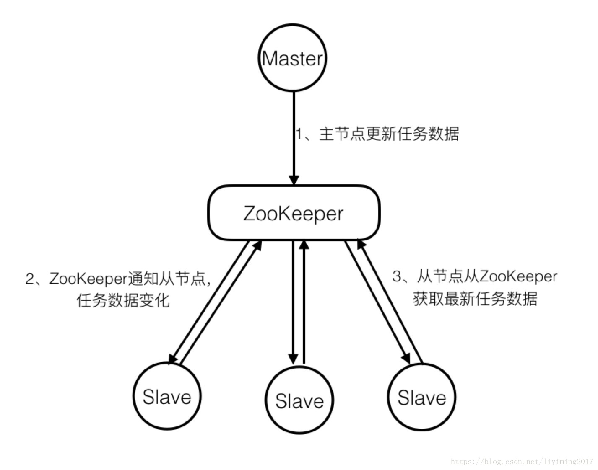

**注：Slave节点要想获取ZooKeeper的更新通知，需事先在关心的数据节点上设置观察点。**

大多数分布式系统中出现的问题，都源于信息的共享出了问题。如果各个节点间信息不能及时共享和同步，那么就会在协作过程中产生各种问题。**ZooKeeper解决协同问题的关键，在于保证分布式系统信息的一致性。**

# 使用

ZooKeeper并不直接暴露分布式服务所需要的原语及原语的调用方法。什么是原语？举个例子，比如说分布式锁机制是一个原语，它会暴露出创建、获取、释放三个调用方法。ZooKeeper以类似文件系统的方式存储数据，暴漏出调用这些数据的API。让应用通过ZooKeeper的机制和API，自己来实现分布式相关原语。


### znode

#### 介绍

Zookeeper会保存任务的分配、完成情况，等共享信息，那么ZooKeeper是如何保存的呢？在ZooKeeper中，这些信息被保存在一个个数据节点上，这些节点被称为znode。它采用了类似文件系统的层级树状结构进行管理。见下图示例：

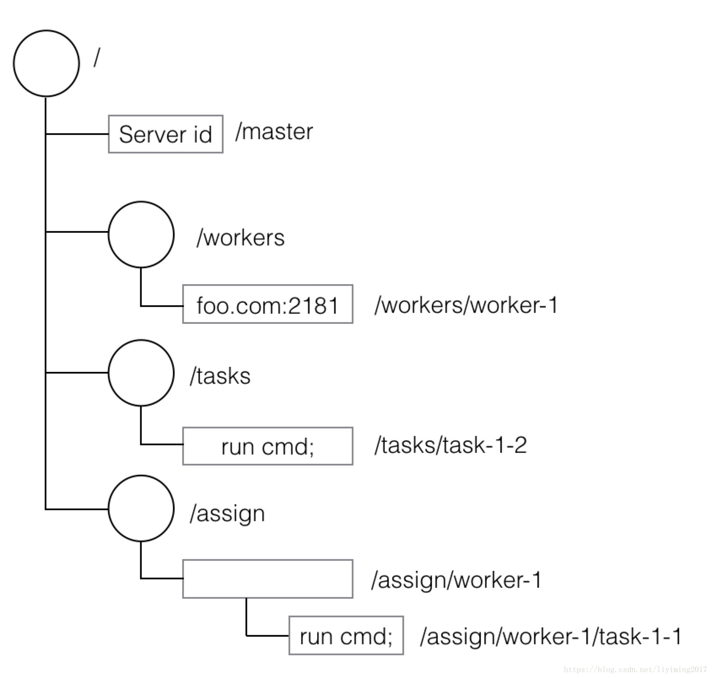

根节点/包含4个子节点，其中三个拥有下一级节点。有的叶子节点存储了信息。

节点上没有存储数据，也有着重要的含义。比如在主从模式中，当/master节点没有数据时，代表分布式应用的主节点还没有选举出来。

znode节点存储的数据为字节数组。存储数据的格式zookeeper不做限制，也不提供解析，需要应用自己实现。

实际上图就是主从模式存储数据的示例，这里先简单讲解：

> - /master，存储了当前主节点的信息
> - /workers，下面的每个子znode代表一个从节点，子znode上存储的数据，如“foo.com:2181”，代表从节点的信息。
> - /tasks，下面的每个子znode代表一个任务，子znode上存储的信息如“run cmd”，代表该内务内容
> - /assign，下面每个子znode代表一个从节点的任务集合。如/assign/worker-1，代表worker-1这个从节点的任务集合。/assign/worker-1下的每个子znode代表分配给worker-1的一个任务。

#### persistent and ephemeral

> 持久节点和临时节点

持久节点只能通过delete删除。临时节点在创建该节点的客户端崩溃或关闭时，自动被删除。

前面例子中的/master应该使用临时节点，这样当主节点失效或者退出时，该znode被删除，其他节点知道主节点崩溃了，开始进行选举的逻辑。另外/works/worker-1也应该是临时节点，在此从节点失效的时候，该临时节点自动删除。

在目前的版本，由于临时znode会因为创建者会话过期被删除，所以不允许临时节点拥有子节点。

#### sequential

> 有序节点

znode可以被设置为有序（sequential）节点。有序znode节点被分配唯一一个单调递增的证书。如果创建了个一有序节点为/workers/worker-，zookeeper会自动分配一个序号1，追加在名字后面，znode名称为/workers/worker-1。通过这种方式，可以创建唯一名称znode，并且可以直观的看到创建的顺序。

znode支持的操作及暴露的API：

```java
create /path data  	//创建一个名为/path的znode，数据为data。
delete /path  		//删除名为/path的znode。
exists /path  		//检查是否存在名为/path的znode
setData /path data  //设置名为/path的znode的数据为data
getData /path  		//返回名为/path的znode的数据
getChildren /path  	//返回所有/path节点的所有子节点列表
```

### 观察与通知

分布式应用需要及时知道zookeeper中znode的变化，从而了解到分布式应用整体的状况，如果采用**轮询**方式，代价太大，绝大多数查询都是无效的。因此，**zookeeper采用了通知的机制**。客户端向zookeeper请求，在特定的znode设置观察点（watch）。当该znode发生变化时，会触发zookeeper的通知，客户端收到通知后进行业务处理。**观察点触发后立即失效。所以一旦观察点触发，需要再次设置新的观察点。（API是不需要的）**

> 待解决：通知的机制？长轮询也是通知的机制之一

我们使用Zookeeper不能期望能够监控到节点每次的变化。思考如下场景：

1、客户端C1设置观察点在/tasks

2、观察点触发，C1处理自己的逻辑

3、C1设置新的观察点前，C2更新了/tasks

4、C1处理完逻辑，再次设置了观察点。

此时C1不会得到第三步的通知，因此错过了C2更新/tasks这次操作。要想不错过这次更新，**C1需要在设置监视点前读取/tasks的数据，进行对比，发现更新。** 

> 待解决：设置监视点前读取/tasks的数据的这个操作应该是在zookeeper做的，类似mysql的保证一致性的操作。

再如下面的场景：

1、客户端C1设置观察点在/tasks

2、/tasks上发生了连续两次更新

3、C1在得到第一次更新的通知后就读取了/tasks的数据

4、此时第二次更新也已经发生，C1用第一次的通知，读取到两次更新后的数据

此时C1虽然错过了第二次通知，但是C1最终还是读取到了最新的数据。

**因此Zookeeper只能保证最终的一致性，而无法保证强一致性。**

zookeeper可以定义不同的观察类型。例如观察znode数据变化，观察znode子节点变化，观察znode创建或者删除。

### 版本

每个znode都有版本号，随着每次数据变化自增。setData和delete，以版本号作为参数，当传入的版本号和服务器上不一致时，调用失败。当多个zookeeper客户端同时对一个znode操作时，版本将会起到作用，假设c1，c2同时往一个znode写数据，c1先写完后版本从1升为2，但是c2写的时候携带版本号1，c2会写入失败。

### 法定人数

下图展示了客户端提交请求到收到回复的过程：

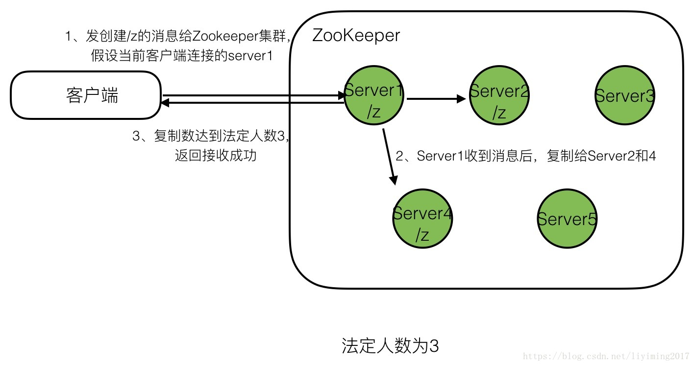

**法定人数需要大于服务器数量的一半。也称为多数原则。**举个例子说明，假如集群有5台服务器，法定人数为2，那么有2台服务器参与复制即可，若这2台server刚刚复制完/z这个znode，就挂掉了。此时剩下了3台server，大于法定人数2，所以zookeeper认为集群正常，但这三台服务器是无法发现/z这个znode的。如果法定人数大于服务器数量一半，那么法定人数复制完成，就可以确保集群存活时，至少有一台服务器有最新的znode，否则集群认为自己已经崩溃。

下面两个例子阐明了，为何要遵循多数原则。

下图展示了5台server，法定人数为3，在确保zookeeper集群存活的前提下，最坏的情况挂了2台server（剩余及器数量3>=法定人数3），zookeeper是如何能确保数据完备，集群继续工作的。

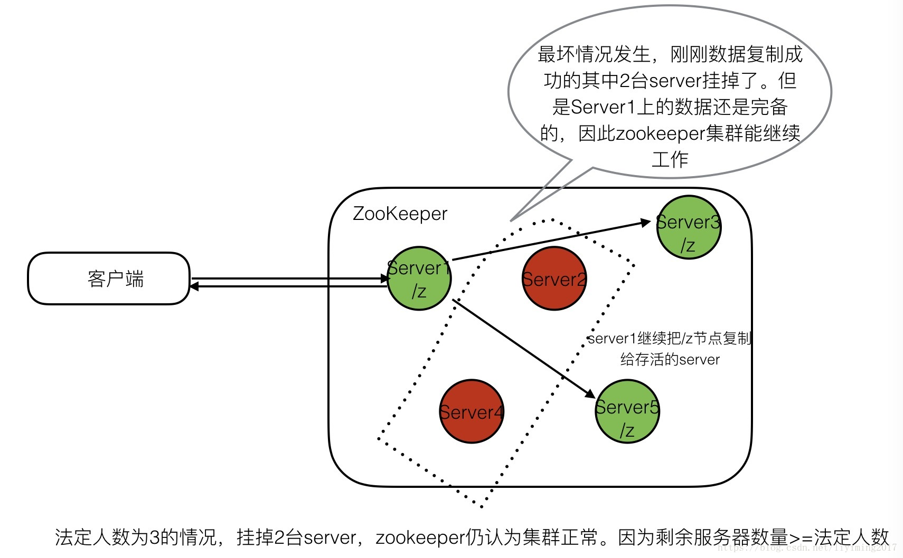

接下来两张图展示了5台server，未遵循多数原则，法定人数设为2。同样挂了两台server时，为什么zookeeper集群会出问题。

首先，客户端发起请求，2个server复制数据后即返回客户端接收成功。

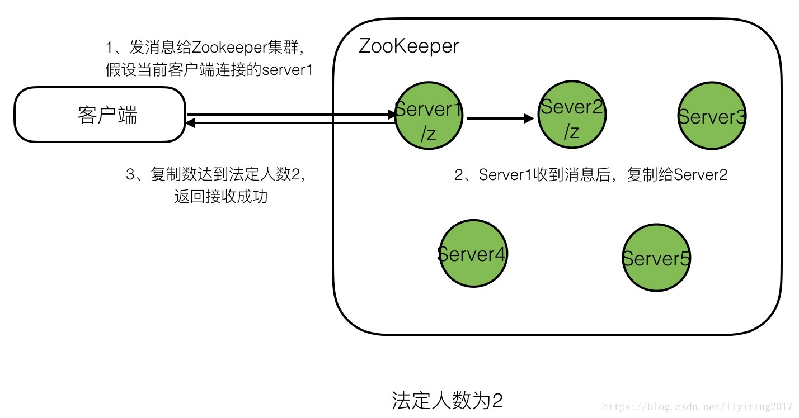

就在此刻，很不幸，在继续同步更新给其他节点前，刚刚两个复制了数据的节点挂了。此时会怎样呢？如下图：

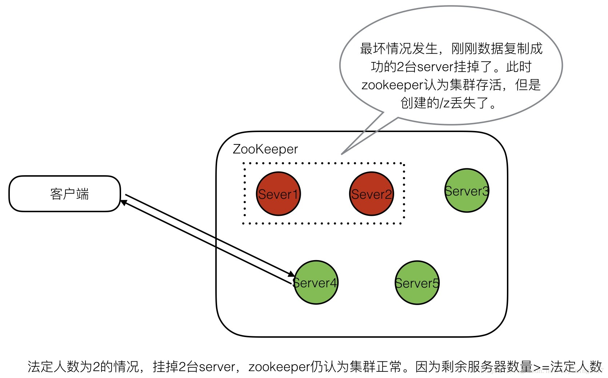

可以看到创建/z的操作在zookeeper集群中丢失了。

相信通过以上讲解，你已经能够理解为什么法定人数一定要多于一半服务器的数量。

此外，我们要尽量选用奇数个服务器，这样集群能容忍崩溃服务器占比更大，性价比更高。例如4台服务器的集群，法定人数最少为3，那么只能允许1台服务器崩溃，也就是仅允许25%的机器崩溃。而5台服务器的集群，法定人数最少也是3，但是此时允许2台服务器崩溃。换句话讲，40%的机器崩溃后还能工作。

仲裁模式下，负载均衡通过客户端随机选择连接串中的某个服务器来实现。

### 会话

客户端对zookeeper集群发送任何请求前，需要和zookeeper集群建立会话。客户端提交给zookeeper的所有操作均关联在一个会话上。当一个会话因某种原因终止时，会话期间创建的临时节点将会消失。**而当当前服务器的问题，无法继续通信时，会话将被透明的转移到另外一台zookeeper集群的服务器上。**

会话提供了顺序保障。同一个会话中的请求以FIFO顺序执行。并发会话的FIFO顺序无法保证。

### 会话状态和生命周期

会话状态有：

connecting、connected、closed、not_connected

创建会话时，需要设置会话超时这个重要的参数。如果经过时间t后服务接受不到这个会话的任何消息，服务就会声明会话过期。客户端侧，t/3时间未收到任何消息，客户端向服务器发送心跳消息，2t/3时间后，客户端开始寻找其他服务器。此时他有t/3的时间去寻找，找不到的话，会话失效。

重连服务器时，只有更新大于客户端的服务器才能被连接，以免连接到落后的服务器。zookeeper中通过更新建立的顺序，分配事务标识符。只有服务器的事物标识符大于客户端携带的标识符时，才可连接。

# 安装与配置

## 官网

官网：http://zookeeper.apache.org/

## 配置

解压后的路径下找到conf文件夹，进入conf文件夹复制zoo_sample.cfg，命名为zoo.cfg

```properties
# 每个tick的毫秒数。后面的initLimit和syncLimit都以tick为单位
tickTime=2000
 
#初始化同步阶段时长
initLimit=10
 
# 同步确认时长
syncLimit=5
 
# 快照存储路径，不要使用/tmp。这里使用只是为了示例
dataDir=/tmp/zookeeper
 
# 客户端端口好
clientPort=2181
 
#可连接的client的最大数
#如果需要处理更多的clinet，请增加此数量
#maxClientCnxns=60
#
# Be sure to read the maintenance section of the 
# administrator guide before turning on autopurge.
#
# http://zookeeper.apache.org/doc/current/zookeeperAdmin.html#sc_maintenance
#
# The number of snapshots to retain in dataDir
#autopurge.snapRetainCount=3
# Purge task interval in hours
# Set to "0" to disable auto purge feature
#autopurge.purgeInterval=1
```

对于学习来说，一般无需做修改。生产环境，需要修改dataDir。其他参数后续调优。

## 单机

在ZooKeeper根目录下执行 `bin/zkServer.sh start`，window执行 `cmd`

```bash
➜  zookeeper-3.4.12 bin/zkServer.sh start
ZooKeeper JMX enabled by default
Using config: /Users/yimingli/dev/tool/zookeeper-3.4.12/bin/../conf/zoo.cfg
Starting zookeeper ... STARTED
```

## 集群

1. 修改zoo.cfg

   ```properties
   tickTime=2000
   dataDir=/var/lib/zookeeper
   clientPort=2181
   initLimit=5
   syncLimit=2
   # 如果是同一台host，那么所有端口都需要不一样
   server.1=127.0.0.1:2888:3888 
   server.2=127.0.0.1:2889:3889
   server.3=127.0.0.1:2890:3890
   ```

   initLimit，zookeeper用来限制zookeeper服务器连接到leader的时长。

   syncLimit，一个服务器多久在leader那里过期。

   以上两种过期时间，单位都是tickTime，

   本例initLimit时长为5个tickTime＝5*2000ms＝10秒

   server.x列出了所有的zookeeper服务。集群启动它通过查看data下面的myid来知道自己是哪台服务器。

   2888用来连接其它server。3888用来leader选举。

2. 复制2份zookeeper到另外两台server上。
3. 在配置的dataDir路径下创建myid文件,文件内容为对应自己的server.x的x值。比如zoo1这台sever，myid文件中内容为1.
4. 如果是同一台机器，那么需要修改cmd，修改监控java程序的端口。`"-Dzookeeper.admin.serverPort=8081"`

## zkCli

客户端命令

```bash
# 客户端会自动随机选择集中一台连接。
➜  zookeeper-3.4.12 bin/zkCli -server ip1:2181,ip2:2181,ip3:2181
```

**有子节点的znode不能直接删除，否则会报错。**

```bash
ZooKeeper -server host:port cmd args
        addauth scheme auth
        close
        config [-c] [-w] [-s]
        connect host:port
        create [-s] [-e] [-c] [-t ttl] path [data] [acl]
        delete [-v version] path
        deleteall path
        delquota [-n|-b] path
        get [-s] [-w] path
        getAcl [-s] path
        history
        listquota path
        ls [-s] [-w] [-R] path
        ls2 path [watch]
        printwatches on|off
        quit
        reconfig [-s] [-v version] [[-file path] | [-members serverID=host:port1:port2;port3[,...]*]] | [-add serverId=host:port1:port2;port3[,...]]* [-remove serverId[,...]*]
        redo cmdno
        removewatches path [-c|-d|-a] [-l]
        rmr path
        set [-s] [-v version] path data
        setAcl [-s] [-v version] [-R] path acl
        setquota -n|-b val path
        stat [-w] path
        sync path
        
        #例子 创建子znode
        create /my_test/tester1 testData
```

## 监控

### http方式

默认8080端口，cmd中修改http://localhost:8081/commands

# Java API

## constructor

很多个重载

```java
public ZooKeeper(String connectString, int sessionTimeout, Watcher watcher)
        throws IOException
    {
        this(connectString, sessionTimeout, watcher, false);
    }
```


## 监听

> 注意，如果debug，那么很快就会断开连接
>
>
> Don't confuse the completion callback with the watch callback. The `ZooKeeper.exists()` completion callback, which happens to be the method `StatCallback.processResult()` implemented in the DataMonitor object, is invoked **when the asynchronous *setting of the watch* operation (by `ZooKeeper.exists()`) completes** on the server.

以下的watch都是一次性的，因此需要重新设置

```java
//同步和异步，指定watch、默认watch、不使用watch

//构造器的watch连接后立即触发process()
//连接的Zclient的watch触发次数不多，连接、断开、再连接一共触发三次

//同步监视node，第一次连接不会触发
public Stat exists(final String path, Watcher watcher);
lockSample.zkClient.exists("/c", true);//使用默认的watch，就是构造器传入的那个

//异步监视，第一次连接立马触发watch的process，然后执行StatCallback 的 processResult() (官网称completeCallBack)
public void exists(String path, Watch watch, StatCallback cb, Object ctx) { }
public void exists(String path, boolean watch, StatCallback cb, Object ctx) {}
```

## 官方例子

http://zookeeper.apache.org/doc/current/javaExample.html#sc_completeSourceCode

zookeeper官方例子翻译：https://blog.csdn.net/liyiming2017/article/details/83275882
zookeeper官方例子解读：https://blog.csdn.net/liyiming2017/article/details/83276706

## 代码

### 测试

`com.don.demo.zookeeper.basic.WatchTest`


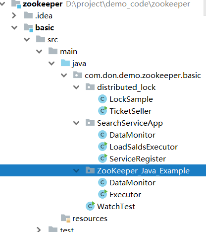

# 分布式锁

## 1.0版本

首先我们先介绍一个简单的zookeeper实现分布式锁的思路：

1. 用zookeeper中一个临时节点代表锁，比如在/exlusive_lock下创建临时子节点/exlusive_lock/lock。
2. 所有客户端争相创建此节点，但只有一个客户端创建成功。
3. 创建成功代表获取锁成功，此客户端执行业务逻辑
4. 未创建成功的客户端，监听/exlusive_lock变更
5. 获取锁的客户端执行完成后，删除/exlusive_lock/lock，表示锁被释放
6. 锁被释放后，其他监听/exlusive_lock变更的客户端得到通知，再次争相创建临时子节点/exlusive_lock/lock。此时相当于回到了第2步。

我们的程序按照上述逻辑直至抢占到锁，执行完业务逻辑。

上述是较为简单的分布式锁实现方式。能够应付一般使用场景，但存在着如下两个问题：

1. 锁的获取顺序和最初客户端争抢顺序不一致，这不是一个公平锁。每次锁获取都是当次最先抢到锁的客户端。

2. 羊群效应，所有没有抢到锁的客户端都会监听/exlusive_lock变更。当并发客户端很多的情况下，所有的客户端都会接到通知去争抢锁，此时就出现了羊群效应。

为了解决上面的问题，我们重新设计。

## 2.0版本

我们在2.0版本中，让每个客户端在/exlusive_lock下创建的临时节点为**有序节点**，这样每个客户端都在/exlusive_lock下有自己对应的锁节点，而序号排在最前面的节点，代表对应的客户端获取锁成功。排在后面的客户端监听自己前面一个节点，那么在他前序客户端执行完成后，他将得到通知，获得锁成功。逻辑修改如下：

1. 每个客户端往/exlusive_lock下创建有序临时节点/exlusive_lock/lock_。创建成功后/exlusive_lock下面会有每个客户端对应的节点，如/exlusive_lock/lock_000000001
2. 客户端取得/exlusive_lock下子节点，并进行排序，判断排在最前面的是否为自己。
3. 如果自己的锁节点在第一位，代表获取锁成功，此客户端执行业务逻辑
4. 如果自己的锁节点不在第一位，则监听自己前一位的锁节点。例如，自己锁节点lock_000000002，那么则监听lock_000000001.
5. 当前一位锁节点（lock_000000001）对应的客户端执行完成，释放了锁，将会触发监听客户端（lock_000000002）的逻辑。
6. 监听客户端重新执行第2步逻辑，判断自己是否获得了锁。

如此修改后，每个客户端只关心自己前序锁是否释放，所以每次只会有一个客户端得到通知。而且，所有客户端的执行顺序和最初锁创建的顺序是一致的。解决了1.0版本的两个问题。

## 代码

代码只做演示用，并不适合生产环境使用。

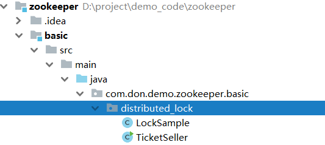

> 待解决：
>
> ```java
> //todo 这里有一个问题，如果watcher立马生效，那么下面不是会一直阻塞？，所以这里有问题
> Stat stat = zkClient.exists(LOCK_ROOT_PATH + "/" + preLockPath, watcher);
> ```

**以下测试**

1、先启动一个java程序运行，可以看到日志输出如下：

```
main 锁创建: /Locks/Lock_0000000391
main 锁获得, lockPath: /Locks/Lock_0000000391
售票开始
售票结束
 锁释放：/Locks/Lock_0000000391
main 锁创建: /Locks/Lock_0000000392
main 锁获得, lockPath: /Locks/Lock_0000000392
售票开始
售票结束
 锁释放：/Locks/Lock_0000000392
main 锁创建: /Locks/Lock_0000000393
main 锁获得, lockPath: /Locks/Lock_0000000393
售票开始
售票结束
 锁释放：/Locks/Lock_0000000393
```


可见每次执行都是按照锁的顺序执行，而且由于只有一个进程，并没有锁的争抢发生。

2、我们再启动一个同样的程序，锁的争抢此时发生了，可以看到双方的日志输出如下：

程序1:

```java
main 锁获得, lockPath: /Locks/Lock_0000000471
售票开始
售票结束
 锁释放：/Locks/Lock_0000000471
main 锁创建: /Locks/Lock_0000000473
 等待前锁释放，prelocakPath：Lock_0000000472
/Locks/Lock_0000000472 前锁释放
main 锁获得, lockPath: /Locks/Lock_0000000473
售票开始
售票结束
 锁释放：/Locks/Lock_0000000473
```


可以看到Lock_0000000471执行完成后，该进程获取的锁为Lock_0000000473，这说明Lock_0000000472被另外一个进程创建了。此时Lock_0000000473在等待前锁释放。Lock_0000000472释放后，Lock_0000000473才获得锁，然后才执行业务逻辑。

我们再看程序2的日志：

```java
main 锁获得, lockPath: /Locks/Lock_0000000472
售票开始
售票结束
 锁释放：/Locks/Lock_0000000472
main 锁创建: /Locks/Lock_0000000474
 等待前锁释放，prelocakPath：Lock_0000000473
/Locks/Lock_0000000473 前锁释放
main 锁获得, lockPath: /Locks/Lock_0000000474
售票开始
售票结束
 锁释放：/Locks/Lock_0000000474
```

 可以看到，确实是进程2获取了Lock_0000000472。

# 应用案例

## 项目背景

首先给大家介绍一下本文描述项目的情况。这是一个检索网站，它让你能在几千万份复杂文档数据中检索出你所需要的文档数据。为了加快检索速度，项目的数据分布在100台机器的内存里，我们称之为数据服务器。除了数据，这100台机器上均部署着检索程序。这些server之外，还有数台给前端提供接口的搜索server，这些机器属一个集群，我们称之为检索服务器。当搜索请求过来时，他们负责把搜索请求转发到那100台机器，待所有机器返回结果后进行合并，最终返回给前端页面。结构如下图：

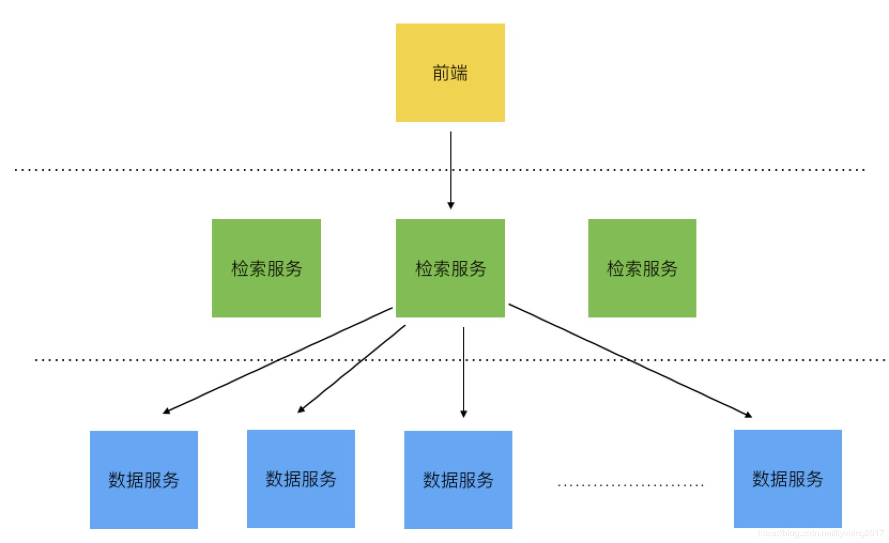

**面临问题**
网站上线之初，由于数据只有几百万，所以数据服务器只有10多台。是一个规模比较小的分布式系统，当时没有做分布式系统的协调，也能正常工作，偶尔出问题，马上解决。但是到了近期，机器增长到100台，网站几乎每天都会出现问题，导致整个分布式系统挂掉。问题原因如下：

数据服务器之前没有做分布式协调。对于检索服务器来说，并不知道哪些数据服务器还存活，所以检索服务器每次检索，都会等待100台机器返回结果。但假如100台数据服务中某一台死掉了，检索服务器也会长时间等待他的返回。这导致了检索服务器积累了大量的请求，最终被压垮。当所有的检索服务器都被压垮时，那么网站也就彻底不可用了。

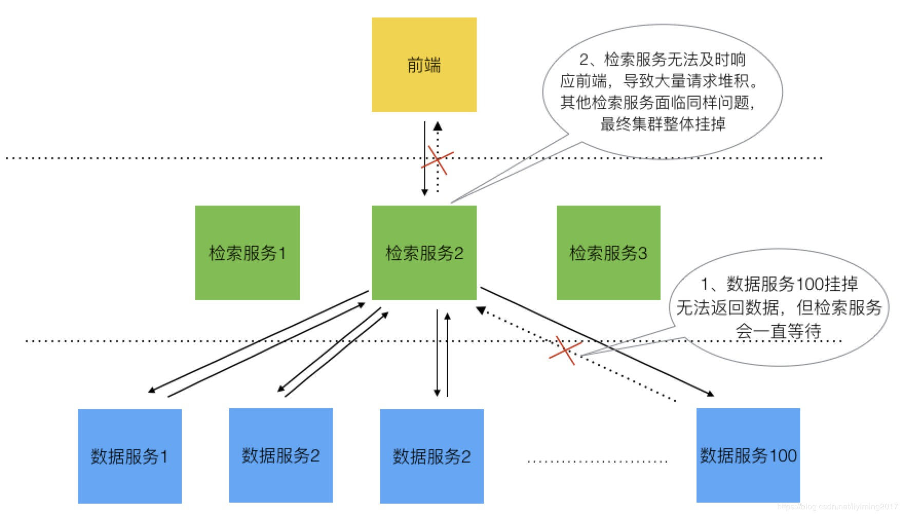

问题的本质为检索服务器维护的数据服务器列表是静态不变的，不能感知数据服务器的上下线。

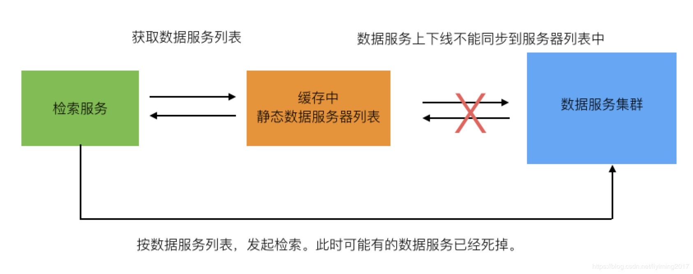

在10台数据服务器的时候，某一台机器出问题的概率很小。但当增长到100台服务器时，出问题的概率变成了10倍。所以才会导致网站几乎每天都要死掉一次。

由于一台机器的问题，导致100台机器的分布式系统不可用，这是极其不合理，也是无法忍受的。

之前此项目的数据和检索不由我负责。了解到此问题的时候，我觉得这个问题得立刻解决，否则不但用户体验差，而且开发和运维也要每天疲于系统维护，浪费了大量资源，但由于还有很多新的需求在开发，原来的团队也没时间去处理。今年我有机会来解决这个问题，当时正好刚刚研究完zookeeper，立刻想到这正是采用zookeeper的典型场景。

## 如何解决

### 介绍

我直接说方案，程序分为数据服务器和检索服务器两部分。

**数据服务器**

1、每台数据服务器启动时候以临时节点的形式把自己注册到zookeeper的某节点下，如/data_servers。这样当某数据服务器死掉时，session断开链接，该节点被删除。

**检索服务器**

1、启动时，加载/data_servers下所有子节点数据，获取了目前所有能提供服务的数据服务器列表，并且加载到内存中。

2、启动时，同时监听/data_servers节点，当新的数据server上线或者某个server下线时，获得通知，然后重新加载/data_servers下所有子节点数据，刷新内存中数据服务器列表。

通过以上方案，做到数据服务器上下线时，检索服务器能够动态感知。检索服务器在检索前，从内存中取得的数据服务器列表将是最新的、可用的。即使在刷新时间差内取到了掉线的数据服务器也没关系，最多影响本次查询，而不会拖垮整个集群。见下图：

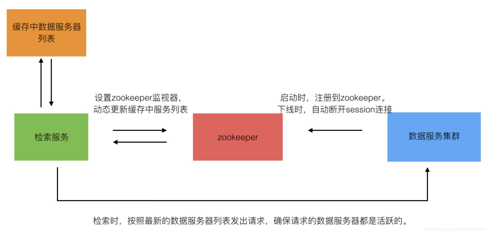

**代码讲解**
捋清思路后，其实代码就比较简单了。数据服务器只需要启动的时候写zookeeper临时节点就好了，同时写入自己服务器的相关信息，比如ip、port之类。检索无服务器端会稍微复杂点，不过此处场景和zookeeper官方给的例子十分符合，所以我直接参考官方例子进行修改，实现起来也很简单。关于官方例子我写过两篇博文，可以参考学习：


### 数据服务器

数据服务器程序十分简单，只会做一件事情：启动的时候，把自己以临时节点的形式注册到zookeeper。一旦服务器挂掉，zookeeper自动删除临时znode。

我们创建ServiceRegister.java实现Runnable，数据服务启动的时候，单独线程运行此代码，实现注册到zookeeper逻辑。维系和zookeeper的链接。

### 检索服务器

检索服务器，代码设计完全采用官方案例，所以详细的代码解读请参考上面提到的两篇文章，这里只做下简述。

代码有两个类DataMonitor和LoadSaidsExecutor。LoadSaidsExecutor是启动入口，他来启动DataMonitor监控zookeeper节点变化。DataMonitor负责监控，初次启动和发现变化时，调用LoadSaidsExecutor的方法来加载最新的数据服务器列表信息。

DataMonitor和LoadSaidsExecutor的工作流程如下：

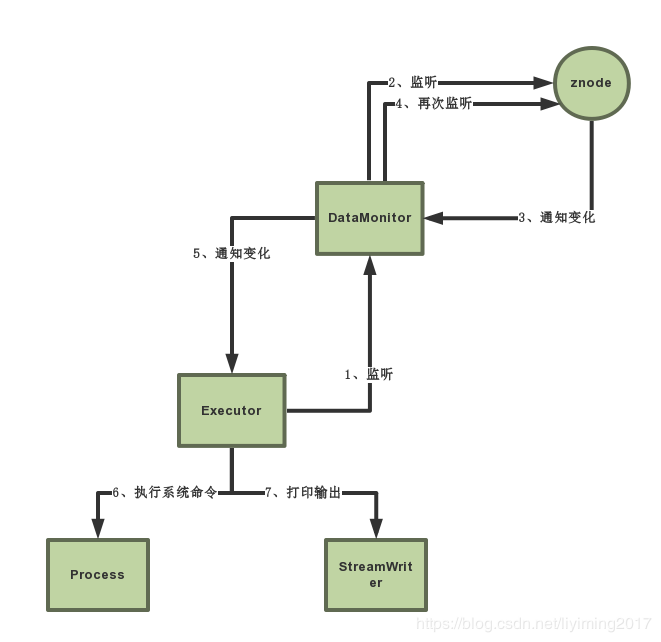

1. Excutor把自己注册为DataMonitor的监听
2. DataMonitor实现watcher接口，并监听znode
3. znode变化时，触发DataMonitor的监听回调
4. 回调中通过ZooKeeper.exist() 再次监听znode
5. 上一步exist的回调方法中，调用监听自己的Executor，执行业务逻辑6
6. Executor启新的线程加载数据服务器信息到内存中

**注意：图为以前文章配图。图里应该把6，7步改为文字描述的第6步。**

检索服务启动的时候，单独线程运行LoadSaIdsExecutor。LoadSaIdsExecutor会阻塞线程，转为事件驱动。

### 总结

我们通过一个例子，展示了zookeeper在实际系统中的应用，通过zookeeper解决了分布式系统的问题。其实以上代码还有很大的优化空间。我能想到如下两点：

1、数据服务器会假死或者变慢，但和zk链接还在，并不会从zk中删除，但已经拖慢了集群的速度。解决此问题，我们可以在数据服务器中加入定时任务，通过定时跑真实业务查询，监控服务器状态，一旦达到设定的红线阈值，强制下线，而不是等到server彻底死掉。

2、检索服务器每个server都监控zookeeper同一个节点，在节点变化时会出现羊群效应。当然，检索服务器如果数量不多还好。其实检索服务器应该通过zookeeper做一个leader选举，只由leader去监控zookeeper节点变化，更新redis中的数据服务器列表缓存即可。

## 代码

# Curator

http://curator.apache.org/

zookeeper框架。Curator中有各种分布式锁，本文挑选其中一个---InterProcessMutex进行讲解。

## InterProcessMutex

> 可重入的互斥锁，跨JVM工作。使用ZooKeeper来控制锁。所有JVM中的任何进程，只要使用同样的锁路径，将会成为跨进程的一部分。此外，这个排他锁是“公平的”，每个用户按照申请的顺序得到排他锁。

```java
    public static void soldTickWithLock(CuratorFramework client) throws Exception {
        //创建分布式锁, 锁空间的根节点路径为/curator/lock
        InterProcessMutex mutex = new InterProcessMutex(client, "/curator/locks");
        mutex.acquire();
 
        //获得了锁, 进行业务流程
        //代表复杂逻辑执行了一段时间
        int sleepMillis = (int) (Math.random() * 2000);
        Thread.sleep(sleepMillis);
 
        //完成业务流程, 释放锁
        mutex.release();
    }
```

### 实现思路

Curator设计方式和之前我们自己实现的方式是类似的：

1、创建有序临时节点

2、触发“尝试取锁逻辑”，如果自己是临时锁节点序列的第一个，则取得锁，获取锁成功。

3、如果自己不是序列中第一个，则监听前一个锁节点变更。同时阻塞线程。

4、当前一个锁节点变更时，通过watcher恢复线程，然后再次到步骤2“尝试取锁逻辑”

如下图所示：

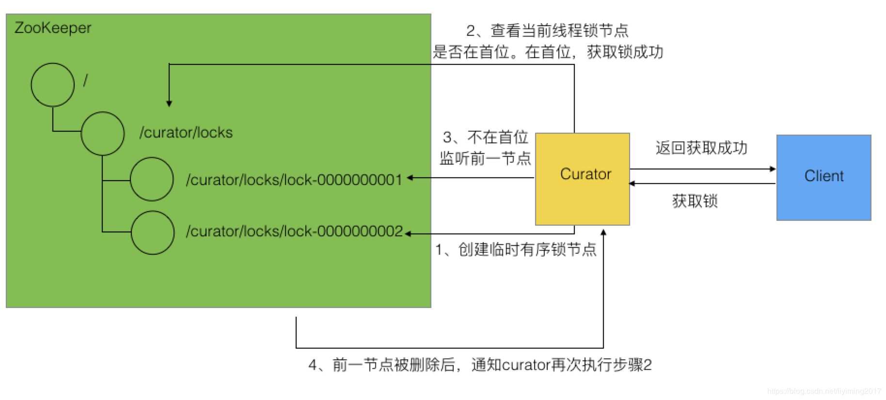

###  代码实现概述

Curator对于排它锁的顶层实现逻辑在InterProcessMutex类中，它对客户端暴露锁的使用方法，如获取锁和释放锁等。但锁的上述实现逻辑，是由他持有的LockInternals对象来具体实现的。LockInternals使用StandardLockInternalsDriver类中的方法来做一些处理。

简单点解释，我们打个比方，Curator好比是一家公司承接各种业务，InterProcessMutex是老板，收到自己客户（client）的需求后，分配给自己的下属LockInternals去具体完成，同时给他一个工具StandardLockInternalsDriver，让他在做任务的过程中使用。如下图展示：

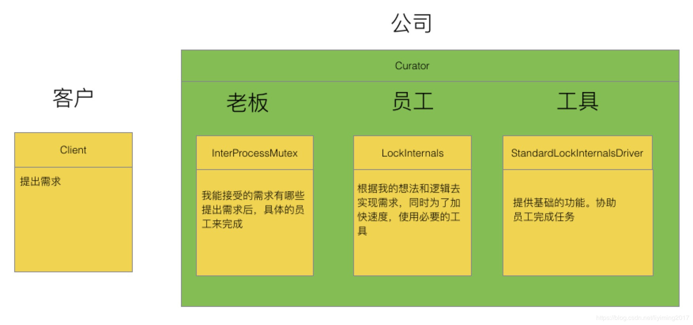

接下来我们将深入分析InterProcessMutex、LockInternals及StandardLockInternalsDriver类。

### 源码分析

InterProcessMutex类是curator中的排它锁类，客户端直接打交道的就是InterProcessMutex。所以我们从顶层开始，先分析InterProcessMutex。

#### 接口

```java
//InterProcessMutex实现了两个接口:
//InterProcessLock是分布式锁接口，分布式锁必须实现接口中的如下方法：
public class InterProcessMutex implements InterProcessLock, Revocable<InterProcessMutex>{
    
    //获取锁，直到锁可用
    public void acquire() throws Exception;
    //在指定等待的时间内获取锁。
    public boolean acquire(long time, TimeUnit unit) throws Exception;
    //释放锁
    public void release() throws Exception;
    //当前线程是否获取了锁
    boolean isAcquiredInThisProcess();
    
}
//以上方法也是InterProcessMutex暴露出来，供客户端在使用分布式锁时调用。
//Revocable<T>,实现该接口的锁，锁是可以被撤销的。本编文章重点讲解锁的实现机制，关于撤销部分不做讨论。
```

#### field

```java
private final LockInternals internals;//锁的实现都在该类中，InterProcessMutex通过此类的方法实现锁
private final String basePath;//锁节点在zk中的根路径
private final ConcurrentMap<Thread, LockData> threadData = Maps.newConcurrentMap();//线程和自己的锁相关数据映射
private static final String LOCK_NAME = "lock-";//常量，值为"lock-"。表示锁节点的前缀
```

#### 内部类

它还有一个内部静态类LockData，也是threadData中保存的value，它定义了锁的相关数据，包括锁所属线程，锁的全路径，和该线程加锁的次数（InterProcessMutex为可重入锁）。

#### constructor

可见构造方法最终初始化了两个属性，basePath被设置为我们传入的值 "/curator/lock"，这是锁的根节点。此外就是初始化了internals，前面说过internals是真正实现锁功能的对象。真正干活的是internals。

```java
InterProcessMutex(CuratorFramework client, String path, String lockName, int maxLeases, LockInternalsDriver driver)
{
    basePath = PathUtils.validatePath(path);
    internals = new LockInternals(client, driver, path, lockName, maxLeases);
}
```

#### 方法

##### 获得锁

获得锁有两个方法，区别为是否限定了等待锁的时间长度。其实最终都是调用的私有方法internalLock()。不限定等待时长的代码如下：

```JAVA
public void acquire() throws Exception
{
    if ( !internalLock(-1, null) )
    {
        throw new IOException("Lost connection while trying to acquire lock: " + basePath);
    }
}
```


可以看到internalLock()返回false时，只可能因为连接超时，否则会一直等待获取锁。

internalLock逻辑如下：

1. 取得当前线程在threadData中的lockData
2. 如果存在该线程的锁数据，说明是锁重入， lockData.lockCount加1，直接返回true。获取锁成功
3. 如果不存在该线程的锁数据，则通过internals.attemptLock()获取锁，此时线程被阻塞，直至获得到锁
4. 锁获取成功后，把锁的信息保存到threadData中。
5. 如果没能获取到锁，则返回false。

可以看到获取锁的核心代码是internals.attemptLock

##### 释放锁

释放锁的方法为release()，逻辑如下：

从threadData中取得当前线程的锁数据，有如下情况：

1. 不存在，抛出无此锁的异常
2. 存在，而且lockCount-1后大于零，说明该线程锁重入了，所以直接返回，并不在zk中释放。
3. 存在，而且lockCount-1后小于零，说明有某种异常发生，直接抛异常
4. 存在，而且lockCount-1等于零，这是无重入的正确状态，需要做的就是从zk中删除临时节点，通过internals.releaseLock()，不管结果如何，在threadData中移除该线程的数据。

#### 小结

分布式锁主要用到的是上面两个方法，InterProcessMutex还有些其他的方法，这里就不做具体讲解，可以自己看一下，实现都不复杂。

通过对InterProcessMutex的讲解，相信我们已经对锁的获得和释放有了了解，应该也意识到真正实现锁的是LockInternals类。

## LockInternals

Curator通过zk实现分布式锁的核心逻辑都在LockInternals中，我们按获取锁到释放锁的流程为指引，逐步分析LockInternals的源代码。

### 获取锁

在InterProcessMutex获取锁的代码分析中，可以看到它是通过internals.attemptLock(time, unit, getLockNodeBytes());来获取锁的，那么我们就以这个方法为入口。此方法的逻辑比较简单，如下：

1. 通过driver在zk上创建锁节点，获得锁节点路径。
2. 通过internalLockLoop()方法阻塞进程，直到获取锁成功。

**核心代码**

```
ourPath = driver.createsTheLock(client, path, localLockNodeBytes);
hasTheLock = internalLockLoop(startMillis, millisToWait, ourPath);
```


我们继续分析internalLockLoop方法，获取锁的核心逻辑在此方法中。

internalLockLoop中通过while自旋，判断锁如果没有被获取，将不断的去尝试获取锁。

while循环中逻辑如下：

1. 通过driver查看当前锁节点序号是否排在第一位，如果排在第一位，说明取锁成功，跳出循环

2. 如果没有排在第一位，则监听自己的前序锁节点，然后阻塞线程。

**当前序节点释放了锁，监听会被触发，恢复线程，此时主线程又回到while中第一步。**

重复以上逻辑，直至获取到锁（自己锁的序号排在首位）。

internalLockLoop方法核心代码分析

> 看源码去

获取锁的主要代码逻辑我们到这就已经分析完了，可见和我们自己的实现还是基本一样的。此外上面提到了driver对象，也就是StandardLockInternalsDriver类，它提供了一些辅助的方法，比如说在zk创建锁节点，判断zk上锁序列第一位是否为当前锁，锁序列的排序逻辑等。我们就不具体讲解了。

### 释放锁

释放锁的逻辑很简单，移除watcher，删除锁节点。代码如下：

```java
final void releaseLock(String lockPath) throws Exception
 
{
 
client.removeWatchers();
 
revocable.set(null);
 
deleteOurPath(lockPath);
 
}
```

## 总结

简单回顾下，InterProcessMutex类封装上层逻辑，对外暴露锁的使用方法。而真正的锁实现逻辑在LockInternals中，它通过对zk临时有序锁节点的创建和监控，判断自己的锁序号是否在首位，来实现锁的获取。此外它还结合StandardLockInternalsDriver提供的方法，共同实现了排他锁。

## InterProcessMultiLock 

多锁容器管理

## InterProcessReadWriteLock 

可重入读写锁

## InterProcessSemaphoreMutex 

 不可重入锁


# 参考

- [zookeeper介绍与核心概念](https://mp.csdn.net/postedit/83035157)
- [安装和使用](https://blog.csdn.net/liyiming2017/article/details/83501836)
- [ZooKeeper分布式锁实现](https://blog.csdn.net/liyiming2017/article/details/83786331)
- [ZooKeeper框架Curator分布式锁实现及源代码分析](https://blog.csdn.net/liyiming2017/article/details/83896169)
- [zookeeper 开发实战（java客户端）](https://blog.csdn.net/liyiming2017/article/details/85063868)