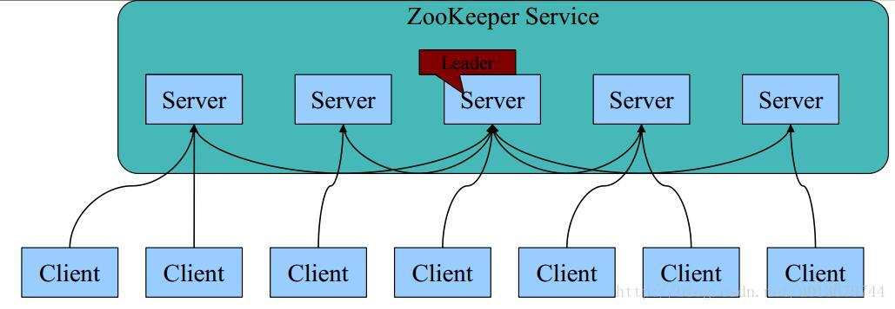
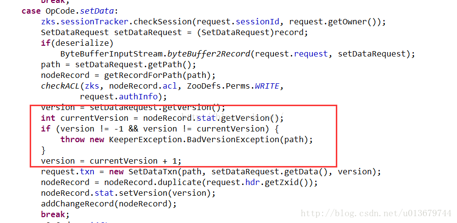
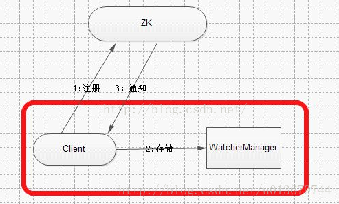
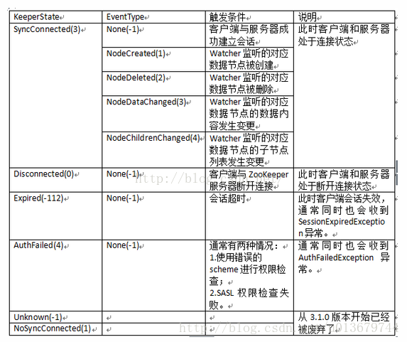

https://blog.csdn.net/u013679744/article/details/79230418

在zookeeper系列的前三篇，介绍分布式数据一致性的相关原理及经典的分布式一致性算法，比如：2PC,3PC,Paxos算法。在本篇，我们正式开始介绍Zookeeper，Zookeeper是分布式一致性问题的工业解决方案，是常用的分布式协调框架。本篇，会介绍Zookeeper的基本概念，数据模型，节点特性，Watcher机制及ACL等机制，在后边我们会介绍Zookeeper为了保证一致性使用的算法ZAB，以及Zookeeper的应用场景。

# Zookeeper基本概述

**Zookeeper为分布式应用提供了高效且可靠的分布式协调服务，其实现依赖于ZAB协议，实现了一种主备模式的架构来保持数据的一致性（Zookeeper本身可保证分布式数据的一致性，从而可以提供高效可靠的协调服务）。**

Zookeeper致力于提供一个高性能、高可用，且具有严格的顺序访问控制能力（主要是写操作的严格顺序性）的分布式协调服务。可用于大型的分布式系统中。**Zookeeper作为分布式协调服务提供了诸如统一命名服务，配置管理和分布式锁等分布式的基础服务。**在解决分布式数据的一致性方面，Zookeeper并没有直接采用Paxos算法，而是采用了一种被称为ZAB(Zookeeper Atomic Broadcast)原子广播协议的一致性协议。ZK是Google的Chubby（基于paxos算法的分布式锁服务）一个开源的实现。**由于ZK自身的高可用性和可保持一致性，所以可以将其用于很多系统服务：分负载均衡，命名服务，分布式锁，集群管理，master选举等，都是zk提高的协调服务。**

## Zookeeper可以保证如下的分布式一致性要求：

- **顺序一致性**
  从同一个客户端发起的事务请求，最终将会严格按照其**发起顺序**被应用到ZooKeeper中。

- **原子性**
  所有事务请求的结果在集群中**所有机器**上的应用情况是一致的，也就是说要么整个集群所有集群**都成功**应用了某一个事务，要么**都没有**应用，一定**不会出现**集群中部分机器应用了该事务，而另外一部分没有应用的情况。

- **单一视图**
  无论客户端连接的是哪个ZooKeeper服务器，其看到的服务端数据模型都是一致的。

- **可靠性**
  一旦服务端成功地应用了一个事务，并完成对客户端的响应，那么该事务所引起的服务端状态变更将会**被一直保留**下来，除非有另一个事务又对其进行了变更。

- **实时性**
  通常人们看到实时性的第一反应是，一旦一个事务被成功应用，那么客户端能够立即从服务端上读取到这个事务变更后的最新数据状态。这里需要注意的是，ZooKeeper**仅仅保证**在**一定的时间段内**，客户端**最终**一定能够从服务端上读取到**最新**的数据状态。

## 注意

在上边的特性中，顺序访问，对于来自客户端的每个请求，Zookeeper都会分配一个全局唯一的递增编号，编号反映了所有事务操作的先后顺序，并且在进行广播时，也是按照顺序执行的，因为TCP的连接，对于一个服务器向另一个服务器发送的信息，肯定是接收顺序肯定是和发送顺序一致的。？？

## 集群角色

在ZooKeeper中，有三种角色：

- Leader
- Follower
- Observer

一个ZooKeeper集群同一时刻只会有一个Leader，其他都是Follower或Observer。2181端口。

Zookeeper集群中的任何一台机器都可以响应客户端的读操作，且全量数据都存在于**内存**中，因此Zookeeper更适合以**读操作为主**的应用场景。注意，当不是leader的服务器收到客户端事务操作，他会将其转发到Leader，让Leader进行处理。

ZooKeeper集群的所有机器通过一个**Leader选举过程**来选定一台被称为**『Leader』**的机器，**Leader服务器**为客户端提供**读**和**写**服务。Follower和Observer都**能**提供**读**服务，**不能**提供**写**服务。两者唯一的区别在于，**Observer**机器**不参与Leader选举**过程，也**不参与写操作**的『过半写成功』策略，因此Observer可以在**不影响写性能**的情况下**提升**集群的**读性能**。

**Zookeeper集群的数量为奇数个（注意：这里并不是说偶数个就不行，而是：比如：5台和6台集群的容灾能力是一样的，所以我们可以少用一台达到相同的目的）。**

**基本架构：**



1. 每个Server在内存中存储了一份数据； 
2. Zookeeper启动时，将从实例中选举一个leader（Paxos协议）； 
3. Leader负责处理数据更新等操作（Zab协议）； 
4. 一个更新操作成功，当且仅当大多数Server在内存中成功修改

## 会话

Session是指客户端会话，在讲解客户端会话之前，我们先来了解下客户端连接。在ZooKeeper中，一个客户端连接是指客户端和ZooKeeper服务器之间的**TCP长连接**。ZooKeeper对外的服务端口默认是2181，客户端启动时，首先会与服务器建立一个TCP连接，从第一次连接建立开始，客户端会话的生命周期也开始了，通过这个连接，客户端能够通过心跳检测和服务器保持有效的会话，也能够向ZooKeeper服务器发送请求并接受响应，同时还能通过该连接接收来自服务器的**Watch事件通知**。Session的**SessionTimeout值用来设置一个客户端会话的超时时间。**当由于服务器压力太大、网络故障或是客户端主动断开连接等各种原因导致客户端连接断开时，只要在SessionTimeout规定的时间内能够重新连接上集群中任意一台服务器，那么之前创建的会话仍然有效。

# Zookeeper数据模型

zookeeper采用层次化的目录结构，命名符合常规文件系统规范； 每个目录在zookeeper中叫做znode,并且其有一个唯一的路径标识； Znode可以包含数据和子znode（ephemeral（临时）类型的节点不能有子znode）； Znode中的数据可以有多个版本，比如某一个znode下存有多个数据版本，那么查询这个路径下的数据需带上版本； 客户端应用可以在znode上设置监视器（Watcher） 。

ZNode可以保存数据，同时还可以挂载子节点，因此构成了一个层次化的树形命名空间。Znode的节点路径标识方式和Unix文件系统路径非常相似，用一系列（\）进行分割。


# 节点特性

## 分类

 ZooKeeper 节点是有生命周期的，这取决于节点的类型。在 ZooKeeper 中，节点类型可以分为持久节点（PERSISTENT ）、临时节点（EPHEMERAL），以及顺序节点（SEQUENTIAL ），具体在节点创建过程中，一般是组合使用，可以生成以下 4 种节点类型。

- **持久节点（PERSISTENT）**

  所谓持久节点，是指在节点创建后，就一直存在，直到有删除操作来主动清除这个节点——不会因为创建该节点的客户端会话失效而消失。

- 持久顺序节点（PERSISTENT_SEQUENTIAL）

  在ZK中，每个父节点会为他的第一级子节点维护一份时序，会记录每个子节点创建的先后顺序。基于这个特性，在创建子节点的时候（注意：在此节点下的子节点是由顺序的），可以设置这个属性，那么在创建节点过程中，ZK会自动为给定节点名加上一个数字后缀，作为新的节点名。这个数字后缀的上限是整型的最大值。


- **临时节点（EPHEMERAL）**

  和持久节点不同的是，临时节点的生命周期和客户端会话绑定。也就是说，如果客户端会话失效，那么这个节点就会自动被清除掉。注意，这里提到的是会话失效，而非连接断开。另外，在临时节点下面不能创建子节点，注意是更具Session会话的失效时间来设定的。


- **临时顺序节点（EPHEMERAL_SEQUENTIAL）**

  临时顺序节点的特性和临时节点一致，同时是在临时节点的基础上，添加了顺序的特性。

 在*Zookeeper*维护数据节点的同时，每个节点除了存储数据内容之外，还存储了数据节点本身一些状态信息，可通过get来获得。

## 结构体

  *ZooKeeper*中每个*znode*的*Stat*结构体由下述字段构成：

-   *czxid*：创建节点的事务的*zxid*
-   *mzxid*：对*znode*最近修改的*zxid*
-   *ctime*：以距离时间原点*(epoch)*的毫秒数表示的*znode*创建时间
-   *mtime*：以距离时间原点*(epoch)*的毫秒数表示的*znode*最近修改时间
-   **version：znode数据的修改次数**
-   **cversion：znode子节点修改次数**
-   **aversion：znode的ACL修改次数**
-   *ephemeralOwner*：如果*znode*是临时节点，则指示节点所有者的会话*ID*；如果不是临时节点，则为零。
-   *dataLength*：*znode*数据长度。
-   *numChildren*：*znode*子节点个数。

## 版本--保证分布式数据原子操作

*Zookeeper*会为每个*Znode*维护一个叫作*Stat*的数据结构，结构如图：存在三个版本信息：

-   **version：znode数据的修改次数**
-   **cversion：znode子节点修改次数**
-   **aversion：znode的ACL修改次数**

  *version*是表示对数据节点数据内容的变更次数，强调的是变更次数，因此就算数据内容的值没有发生变化，*version*的值也会递增。

 在介绍*version*时，我们可以简单的了解在数据库技术中，通常提到的“**悲观锁**”和“**乐观锁**”：

  悲观锁：具有严格的独占和排他特性，能偶有效的避免不同事务在同一数据并发更新而造成的数据一致性问题。实现原理就是：假设*A*事务正在对数据进行处理，那么在整个处理过程中，都会将数据处于锁定的状态，在这期间，其他事务将无法对这个数据进行更新操作，直到事务*A*完成对該数据的处理，释放对应的锁。一份数据只会分配一把钥匙，如数据库的表锁或者行锁*(for update).*

  乐观锁：具体实现是，表中有一个版本字段，第一次读的时候，获取到这个字段。处理完业务逻辑开始更新的时候，需要再次查看该字段的值是否和第一次的一样。如果一样更新，反之拒绝。乐观锁就是假定多个事务在处理过程中不会影响彼此，悲观锁正好相反，因此乐观锁在事务处理的绝大部分时间里不需要进行加锁处理。**乐观锁非常适用于在数据竞争不大，事务冲突较少的应用场景中。最经典的应用就是：JDK中的CAS处理。**

   *Zookeeper*的版本作用就是类似于乐观锁机制，用于实现乐观锁机制的*“*写入校验*”.*



从上边的逻辑，我们可以看到，当对数据节点状态进行改变时，首先要进行数据节点版本检查，如果首先获得当前请求的版本，然后再从数据积累获取当前服务器上该数据的最新版本，如果version=-1，则客户端不要求使用乐观锁，可以忽略此版本检查，如果不是-1，就进行检查，匹配才进行数据变更，否则抛出异常。

# Watcher机制

Watcher机制:目的是为ZK客户端操作提供一种类似于异步获得数据的操作。zk提供了分布式数据的发布订阅功能，一个典型的发布订阅系统定义了一种一对多的订阅关系，能够让多个订阅者同时监听某一个主题对象，当这个主题对象自身状态变化时，会通知所有订阅者，使它们能够做出相应的处理。zk，引入了watcher机制来实现这种分布式的通知功能。



zk允许客户端向服务端注册一个watcher监听，当服务端的一些指定事件触发这个watcher，那么就会向指定客户端发送一个事件通知。

 *Zookeeper*的*Watcher*机制主要包括客户端线程、客户端*WatchManager*和*Zookeeper*服务器三部分。在具体的流程上，客户端向*Zookeeper*服务器注册*Watcher*事件监听的同时，会将*Watcher*对象存储在 客户端*WatchManager*中。当*Zookeeper*服务器触发*Watcher*事件后，会向客户端发送通知，客户端线程从*WatchManager*中取出对应的*Watcher*对象执行回调逻辑。

**watcher机制特点：**

1. **一次性触发** 数据发生改变时，一个watcher event会被发送到client，但是client只会收到一次这样的信息。

2. **watcher event异步发送**  watcher 的通知事件从server发送到client是异步的，这就存在一个问题，不同的客户端和服务器之间通过socket进行通信，由于网络延迟或其他因素导致客户端在不通的时刻监听到事件，由于Zookeeper本身提供了ordering guarantee，即客户端监听事件后，才会感知它所监视znode发生了变化。

3. **数据监视**  Zookeeper有数据监视和子数据监视  getdata() and exists() 设置数据监视，getchildren()设置了子节点监视

其监听的事件有：




   *NodeDataChanged*事件：此处的变更包括数据节点内容和数据的版本号*DateVersion*。因此，对于*Zookeeper*来说，无论数据内容是否更改，还是会触发这个事件的通知，一旦客户端调用了数据更新接口，且更新成功，就会更新*dataversion*值。


关于watcher机制的实现，建议看《从paxos到zookeeper分布式一致性原理与实践》。有点复杂。

# ACL--保障数据的安全

ACL全称为Access Control List（访问控制列表），用于控制资源的访问权限。zk利用ACL策略控制节点的访问权限，如节点数据读写、节点创建、节点删除、读取子节点列表、设置节点权限等。

在传统的文件系统中，ACL分为两个维度，一个是属组，一个是权限，一个属组包含多个权限，一个文件或目录拥有某个组的权限即拥有了组里的所有权限，文件或子目录默认会继承自父目录的ACL。(如linux系统的权限控制)

而在Zookeeper中，znode的ACL是没有继承关系的，**每个znode的权限都是独立控制的**，只有客户端满足znode设置的权限要求时，才能完成相应的操作。Zookeeper的ACL，分为三个维度：scheme、id、permission，通常表示为：**scheme：id：permission**，**schema代表授权策略，id代表用户，permission代表权限**。下面从这三个维度分别来介绍。

id是验证模式，不同的scheme，id的值也不一样。scheme为digest时，id的值为：`username:BASE64(SHA1(password))`，scheme为ip时，id的值为客户端的ip地址。scheme为world时，id的值为`anyone`。

## scheme

scheme即采取的授权策略，每种授权策略对应不同的权限校验方式。下面是zk常用的几种scheme：

**1. digest**

语法：`digest:username:BASE64(SHA1(password)):cdrwa` 
digest：是授权方式 
username:BASE64(SHA1(password))：是id部分 
cdrwa：权限部份 

用户名+密码授权访问方式，也是常用的一种授权策略。id部份是用户名和密码做sha1加密再做BASE64加密后的组合。

使用：

```cpp
## 创建节点/node_05
shell> create /node_05 data
Created /node_05
## 设置权限
shell> setAcl /node_05 digest:yangxin:ACFm5rWnnKn9K9RN/Oc8qEYGYDs=:cdrwa
cZxid = 0x8e
ctime = Mon Nov 14 21:38:52 CST 2016
mZxid = 0x8e
mtime = Mon Nov 14 21:38:52 CST 2016
pZxid = 0x8e
cversion = 0
dataVersion = 0
aclVersion = 1
ephemeralOwner = 0x0
dataLength = 3
numChildren = 0
## 获取节点刚刚设置的权限
shell> getAcl /node_05
'digest,'yangxin:ACFm5rWnnKn9K9RN/Oc8qEYGYDs=
: cdrwa
 
## 没有授权，创建节点失败
shell> create /node_05/node_05_01 data
Authentication is not valid : /node_05/node_05_01
 
## 添加授权信息
shell> addauth digest yangxin:123456
 
## 添加授权信息后，就可以正常操作了
shell> create /node_05/node_05_01 data
Created /node_05/node_05_01
```

**2. IP**

基于客户端IP地址校验，限制只允许指定的客户端能操作znode。 
比如，设置某个节点只允许IP为`192.168.1.100`的客户端能读写该写节点的数据：`ip:192.168.1.100:rw`

**3. world**

语法：`world:anyone:cdrwa` 
创建节点默认的scheme，所有人都可以访问。如下所示：

上面主要介绍了平时常用的三种scheme，除此之外，还有host、super（管理员超级用户）、auth授权策略。


## permission

在介绍scheme的时候，提到了acl的权限，如：`digest:username:BASE64(SHA1(password)):cdrwa`中的cdrwa即是permission。 
1> CREATE(r)：创建子节点的权限 
2> DELETE(d)：删除节点的权限 
3> READ(r)：读取节点数据的权限 
4> WRITE(w)：修改节点数据的权限 
5> ADMIN(a)：设置子节点权限的权限

注意：cd权限用于控制子节点，rwa权限用于控制节点本身

# Zookeeper内存模型


　Zookeeper的数据模型是树结构，在内存数据库中，存储了整棵树的内容，包括所有的节点路径、节点数据、ACL信息，Zookeeper会定时将这个数据存储到磁盘上。

  1. DataTree

     DataTree是内存数据存储的核心，是一个树结构，代表了内存中一份完整的数据。DataTree不包含任何与网络、客户端连接及请求处理相关的业务逻辑，是一个独立的组件。

2. DataNode

   DataNode是数据存储的最小单元，其内部除了保存了结点的数据内容、ACL列表、节点状态之外，还记录了父节点的引用和子节点列表两个属性，其也提供了对子节点列表进行操作的接口。

3. ZKDatabase

   Zookeeper的内存数据库，管理Zookeeper的所有会话、DataTree存储和事务日志。ZKDatabase会定时向磁盘dump快照数据，同时在Zookeeper启动时，会通过磁盘的事务日志和快照文件恢复成一个完整的内存数据库。


DataTree是整个树的核心，不与任何网络、客户端以及请求事务有关。DataTree利用CurrentHashMap<String,DataNode>的属性nodes来存储着整个树的所有节点以及对应的路径，对于临时节点单独放在一个CurrentHashMap中。DataNode是最小的存储单元，保存着节点的数据，ACL，父节点和子节点列表。

**对于目标节点的查找并不是使用树的结构层层查找，而是在DataTree中的属性nodes--\**CurrentHashMap\**根据路径作为key直接查找DataNode，提高了查找效率。**

# Zookeeper数据与存储

我们知道Zookeeper是将全量数据存储在内存中，但他是怎样进行容错的呢？当节点崩溃后或重新初始化时，是怎么会发到宕机之前的数据呢？这就需要Zookeeper的数据存储实现。**感觉大多数内存存储的组件容错机制都差不多，都是利用快照和事务日志来保证节点宕机恢复工作。比如：zookeeper，HDFS的namenode，redis，都是采用快照+事务日志来进行数据持久化,来实现底层数据的一致性。**

## 事务日志

在配置Zookeeper集群时需要配置dataDir目录，其用来存储事务日志文件。也可以为事务日志单独分配一个文件存储目录:**dataLogDir**。若配置dataLogDir为/home/admin/zkData/zk_log，那么Zookeeper在运行过程中会在该目录下建立一个名字为version-2的子目录，该目录确定了当前Zookeeper使用的事务日志格式版本号，当下次某个Zookeeper版本对事务日志格式进行变更时，此目录也会变更，即在version-2子目录下会生成一系列文件大小一致(**64MB**)的文件。

事务日志记录了对Zookeeper的操作，命名为log.ZXID,**后缀是一个事务ID**。并且是写入该事务日志文件第一条事务记录的ZXID，使用ZXID作为文件后缀，**可以帮助我们迅速定位到某一个事务操作所在的事务日志**。同时，使用ZXID作为事务日志后缀的另一个优势是：ZXID本身由两部分组成，高32位代表当前leader周期（epoch）,低32位则是真正的操作序列号，因此，将ZXID作为文件后缀，我们就可以清楚地看出当前运行时的zookeeper的leader周期。

事务日志的写入是采用了**磁盘预分配的策略**。因为事务日志的写入性能直接决定看Zookeeper服务器对事务请求的响应，也就是说事务写入可被看做是一个磁盘IO过程，所以为了提高性能，避免磁盘寻址seek所带来的性能下降，所以zk在创建事务日志的时候就会进行文件空间“预分配”，即：在文件创建之初就想操作系统预分配一个很大的磁盘块，默认是64M，而一旦已分配的文件空间不足4KB时，那么将会再次进行预分配，再申请64M空间。

## **数据快照**

　数据快照是Zookeeper数据存储中非常核心的运行机制，数据快照用来记录Zookeeper服务器上某一时刻的全量内存数据内容，并将其写入指定的磁盘文件中。也是使用ZXID来作为文件 后缀名，并没有采用磁盘预分配的策略，因此数据快照文件在一定程度上反映了当前zookeeper的全量数据大小。

　　与事务文件类似，Zookeeper快照文件也可以指定特定磁盘目录，通过dataDir属性来配置。若指定dataDir为/home/admin/zkData/zk_data，则在运行过程中会在该目录下创建version-2的目录，该目录确定了当前Zookeeper使用的快照数据格式版本号。在Zookeeper运行时，会生成一系列文件。

针对客户端的每一次事务操作，Zookeeper都会将他们记录到事务日志中，同时也会将数据变更应用到内存数据库中，Zookeeper在进行若干次（snapCount）事务日志记录后，将内存数据库的全量数据Dump到本地文件中，这就是数据快照。

**过半随机策略：**每进行一次事务记录后，Zookeeper都会检测当前是否需要进行数据快照。理论上进行snapCount次事务操作就会开始数据快照，但是考虑到数据快照对于Zookeeper所在机器的整体性能的影响，**需要避免Zookeeper集群中所有机器在同一时刻进行数据快照。因此zk采用“过半随机”的策略**，来判断是否需要进行数据快照。即：符合如下条件就可进行数据快照：

logCount > (snapCount / 2 + randRoll)  randRoll位1~snapCount / 2之间的随机数。这种策略避免了zk集群的所有机器在同一时刻都进行数据快照，影响整体性能。

**进行快照：**

开始快照时，首先关闭当前日志文件（已经到了该快照的数了），重新创建一个新的日志文件，创建单独的异步线程来进行数据快照以避免影响Zookeeper主流程，从内存中获取zookeeper的全量数据和校验信息，并序列化写入到本地磁盘文件中，以本次写入的第一个事务ZXID作为后缀。

## 数据恢复

在Zookeeper服务器启动期间，首先会进行数据初始化工作，用于将存储在磁盘上的数据文件加载到Zookeeper服务器内存中。

数据恢复时，会加载最近100个快照文件（如果没有100个，就加载全部的快照文件）。之所以要加载100个，是因为防止最近的那个快照文件不能通过校验。在逐个解析过程中，如果正确性校验通过之后，那么通常就只会解析最新的那个快照文件，但是如果校验和发现最先的那个快照文件不可用，那么就会逐个进行解析，直到将这100个文件全部解析完。**如果将所有的快照文件都解析后还是无法恢复出一个完整的“DataTree”和“sessionWithTimeouts”，则认为无法从磁盘中加载数据，服务器启动失败。**当基于快照文件构建了一个完整的DataTree实例和sessionWithTimeouts集合了，此时根据这个快照文件的文件名就可以解析出**最新的ZXID**，该ZXID代表了zookeeper开始进行数据快照的时刻，然后利用此ZXID定位到具体事务文件从哪一个开始，然后执行事务日志对应的事务，恢复到最新的状态，并得到最新的ZXID。

在本篇中，我们详细介绍了zookeeper的概念和相关用法，在zookeeper的应用中，我们会发现zookeeper提供的服务基本都是基于节点类型和watcher机制实现的，很多都可以实现这个功能啊，为什么zk就是经典的分布式服务框架呢，主要是zk是高性能，高可用，以及能保证数据一致性的。那么它是如何保证高可用以及数据一致性呢，这就涉及到其底层一致性协议，zab协议！在下一篇将进行解释。