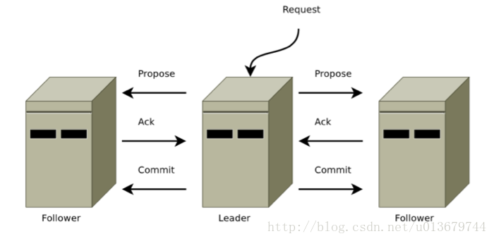
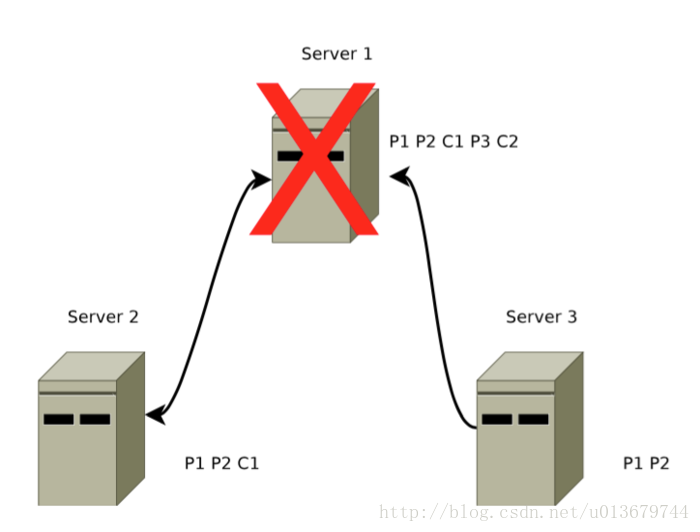
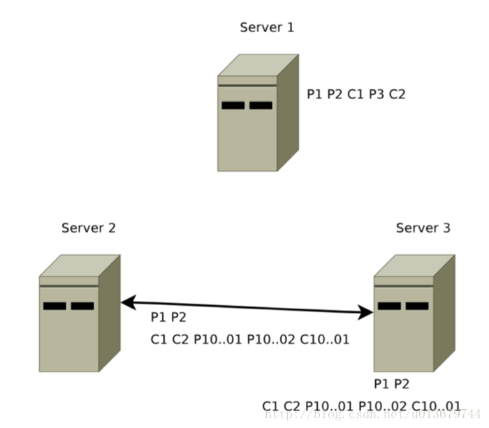

https://blog.csdn.net/u013679744/article/details/79240249

# ZAB协议概述

在前面的文章中，介绍了经典的分布式数据一致性算法Paxos算法，但事实上zookeeper并没有采用完全的Paxos算法，而是采用了一种称为Zookeeper Atomic Broadcast(**ZAB，zookeeper原子消息广播协议**)。ZAB 协议是为分布式协调服务 ZooKeeper 专门设计的一种支持崩溃恢复的原子广播协议。在 ZooKeeper 中，主要依赖 ZAB 协议来实现分布式数据一致性，基于该协议，**ZooKeeper 实现了一种主备模式的系统架构来保持集群中各个副本之间的数据一致性，同时其崩溃恢复过程也确保看zk集群的高可用性（HA）。**

Zookeeper使用一个单一主进程来接收并处理客户端的所有事务请求，并采用ZAB的原子广播协议，将服务器数据的状态变更以事务Proposal的形式广播到所有的副本进程上，并且ZAB协议能够保证一个全局的变更序列。

**ZAB协议的核心是定义了对于那些会改变Zookeeper服务器数据状态的事务请求的处理方式。**

Zookeeper 客户端会随机连接到 Zookeeper 集群的一个节点，如果是读请求，就直接从当前节点中读取数据；**如果是写请求且当前节点不是leader，那么节点就会向 leader 提交事务，leader 会广播事务**，只要有超过半数节点写入成功，该写请求就会被提交（类 2PC 协议）。

那么问题来了：

- 主从架构下，leader 崩溃，数据一致性怎么保证？
- 选举 leader 的时候，整个集群无法处理写请求的，如何快速进行 leader 选举？

**所以zab协议重要的就是：1. 消息广播协议（leader想其他节点广播事务）  2. \**leader选举（快速选举过程fastleaderelection，集群刚启动时，\*\*leader崩溃或leader与集群中超过一半的节点断连后\*\*） 3. leader重新选举后，如何进行数据同步到一致状态\****

ZAB 中的节点有三种状态

- following：当前节点是跟随者，服从 leader 节点的命令
- leading：当前节点是 leader，负责协调事务
- election/looking：节点处于选举状态

# 事务ID的概念

在 ZAB 协议的事务编号 Zxid 设计中，Zxid 是一个 64 位的数字，其中低 32 位是一个简单的单调递增的计数器，针对客户端每一个事务请求，计数器加 1；而高 32 位则代表 Leader 周期 epoch 的编号，每个当选产生一个新的 Leader 服务器，就会从这个 Leader 服务器上取出其本地日志中最大事务的ZXID，并从中读取 epoch 值，然后加 1，以此作为新的 epoch，并将低 32 位从 0 开始计数。

epoch：可以理解为当前集群所处的年代或者周期，每个 leader 就像皇帝，都有自己的年号，所以每次改朝换代，leader 变更之后，都会在前一个年代的基础上加 1。这样就算旧的 leader 崩溃恢复之后，也没有人听他的了，因为 follower 只听从当前年代的 leader 的命令。

ZAB协议的两种基本模式：崩溃恢复模式和消息广播模式。其过程为：

当系统启动或leader服务器出现故障时，进入故障恢复模式，将会开启新的一轮选举，选举产生的leader会与**过半的follower**进行同步，使数据一致，当与过半的机器同步完成后，就退出恢复模式，进入消息广播模式。当一台遵从zab协议的服务器启动时，如果检测到leader在广播消息，会自动进入恢复模式，当其完成与leader的同步之后，则进入广播模式。所以，**zk还可以保证易扩展性。（没进行数据同步，就不能加入真正可用的follower列表）**

# 消息广播

当集群中已经有过半的follower与leader服务器完成了状态同步，那么整个zk集群就可以进入消息广播模式了。

如果集群中的其他节点收到客户端地事务请求，那么这些非leader服务器会首先将这个事务请求转发给leader服务器。

ZAB协议的消息广播过程使用的是一个原子广播协议，类似于一个2PC提交过程，针对每个客户端的事务请求，leader服务器会为其生成对应的事务Proposal，并将其发送给集群中其余所有的机器，然后再分别收集各自的选票，最后进行事务提交。

- Leader 接收到消息请求后，将消息赋予一个全局唯一的 64 位自增 id，叫做：zxid，通过 zxid 的大小比较即可实现因果有序这一特性。
- Leader 通过先进先出队列（会给每个follower都创建一个队列，保证发送的顺序性）（通过 TCP 协议来实现，以此实现了全局有序这一特性）将带有 zxid 的消息作为一个提案（proposal）分发给所有 follower。
- 当 follower 接收到 proposal，先将 proposal 写到本地事务日志，写事务成功后再向 leader 回一个 ACK。
- 当 leader 接收到过半的 ACKs 后，leader 就向所有 follower 发送 COMMIT 命令，同意会在本地执行该消息。
- 当 follower 收到消息的 COMMIT 命令时，就会执行该消息

相比于完整的二阶段提交，Zab 协议最大的区别就是**移除了中断逻辑**，follower 要么回 ACK 给 leader，要么**抛弃 leader，**在某一时刻，leader 的状态与 follower 的状态很可能不一致，因此它不能处理 leader 挂掉的情况，所以 Zab 协议引入了恢复模式来处理这一问题。从另一角度看，**正因为 Zab 的广播过程不需要终止事务，也就是说不需要所有 follower 都返回 ACK 才能进行 COMMIT，而是只需要合法数量（2f+1 台服务器中的 f+1 台） 的follower，也提升了整体的性能。\**不能正常反馈的就节点就抛弃leader，然后进入数据同步阶段，和集群达成一致。\****

# 崩溃恢复（Leader选举）

ZAB协议会让ZK集群进入崩溃恢复模式的情况如下：
   （1）当服务框架在启动过程中
   （2）当Leader服务器出现网络中断，崩溃退出与重启等异常情况。
   （3）当集群中已经不存在过半的服务器与Leader服务器保持正常通信。

当leader挂掉后，集群无法进行工作，所以需要一个高效且可靠的leader选举算法。zk的实现是FastLeaderElection算法。

**Leader选举需要达到的再次使用的条件，需要解决以下两个问题：**

- **已经被leader提交的事务需要最终被所有的机器提交（已经发出commit了）**
- **保证丢弃那些只在leader上提出的事务。（只在leader上提出了proposal，还没有收到回应，还没有进行提交）**

#### 已经被处理的消息不能丢（commit的）

这一情况会出现在以下场景：当 leader 收到合法数量 follower 的 ACKs 后，就向各个 follower 广播 COMMIT 命令，同时也会在本地执行 COMMIT 并向连接的客户端返回「成功」。但是如果在各个 follower 在收到 COMMIT 命令前 leader 就挂了，导致剩下的服务器并没有执行都这条消息。

如图 1-1，消息 1 的 COMMIT 命令 Server1（leader）和 Server2（follower） 上执行了，但是 Server3 还没有收到消息 1 的 COMMIT 命令，此时 leader Server1 已经挂了，客户端很可能已经收到消息 1 已经成功执行的回复，经过恢复模式后需要保证所有机器都执行了消息 1。

为了实现已经被处理的消息不能丢这个目的，Zab 的恢复模式使用了以下的策略：

- 选举拥有 proposal 最大值**（即 zxid 最大） 的节点作为新的 leader**：由于所有提案被 COMMIT 之前必须有合法数量的 follower ACK，即必须有合法数量的服务器的事务日志上有该提案的 proposal，因此，只要有合法数量的节点正常工作，就必然有**一个节点保存了所有被 COMMIT 消息的 proposal 状态。**
- 新的 leader 将自己事务日志中 proposal 但未 COMMIT 的消息处理。
- 新的 leader 与 follower 建立先进先出的队列， 先将自身有而 follower 没有的 proposal 发送给 follower，再将这些 proposal 的 COMMIT 命令发送给 follower，以保证所有的 follower 都保存了所有的 proposal、所有的 follower 都处理了所有的消息。通过以上策略，能保证已经被处理的消息不会丢

#### 被丢弃的消息不能再次出现

这一情况会出现在以下场景：当 leader 接收到消息请求生成 proposal 后就挂了，**其他 follower 并没有收到此 proposal**，因此经过恢复模式重新选了 leader 后，**这条消息是被跳过的**。 此时，之前挂了的 leader 重新启动并注册成了 follower，他保留了被跳过消息的 proposal 状态，与整个系统的状态是不一致的，需要将其删除。
如图 1-2 ，在 Server1 挂了后系统进入新的正常工作状态后，消息 3被跳过，此时 Server1 中的 P3 需要被清除。

  Zab 通过巧妙的设计 zxid 来实现这一目的。一个 zxid 是64位，高 32 是纪元（epoch）编号，每经过一次 leader 选举产生一个新的 leader，新 leader 会将 epoch 号 +1。低 32 位是消息计数器，每接收到一条消息这个值 +1，新 leader 选举后这个值重置为 0。这样设计的好处是旧的 leader 挂了后重启，它不会被选举为 leader，因为此时它的 zxid 肯定小于当前的新 leader。当旧的 leader 作为 follower 接入新的 leader 后，新的 leader 会让它将所有的拥有旧的 epoch 号的未被 COMMIT 的 proposal 清除。

## Leader选举过程（FastLeaderElection算法）

Leader选举是保证分布式数据一致性的关键所在。当Zookeeper集群中的一台服务器出现以下两种情况之一时，需要进入Leader选举。

　1. 服务器启动时期的Leader选举

　若进行Leader选举，则至少需要两台机器，这里选取3台机器组成的服务器集群为例。在集群初始化阶段，当有一台服务器Server1启动时，其单独无法进行和完成Leader选举，当第二台服务器Server2启动时，此时两台机器可以相互通信，每台机器都试图找到Leader，于是进入Leader选举过程。选举过程如下

　**(1) 每个Server发出一个投票**。由于是初始情况，Server1和Server2都会将自己作为Leader服务器来进行投票，每次投票会包含所推举的服务器的myid和ZXID，使用(myid, ZXID)来表示，此时Server1的投票为(1, 0)，Server2的投票为(2, 0)，然后各自将这个投票发给集群中其他机器。

　　**(2) 接受来自各个服务器的投票**。集群的每个服务器收到投票后，首先判断该投票的有效性，如检查是否是本轮投票、是否来自LOOKING状态的服务器。

　　**(3) 处理投票**。针对每一个投票，服务器都需要将别人的投票和自己的投票进行PK，PK规则如下

　　　　**· 优先检查ZXID**。ZXID比较大的服务器优先作为Leader。

　　　　**· 如果ZXID相同，那么就比较myid**。myid较大的服务器作为Leader服务器。

　　对于Server1而言，它的投票是(1, 0)，接收Server2的投票为(2, 0)，首先会比较两者的ZXID，均为0，再比较myid，此时Server2的myid最大，于是更新自己的投票为(2, 0)，然后重新投票，对于Server2而言，其无须更新自己的投票，只是再次向集群中所有机器发出上一次投票信息即可。

　　**(4) 统计投票**。每次投票后，服务器都会统计投票信息，判断是否已经有过半机器接受到相同的投票信息，对于Server1、Server2而言，都统计出集群中已经有两台机器接受了(2, 0)的投票信息，此时便认为已经选出了Leader。

　　**(5) 改变服务器状态**。一旦确定了Leader，每个服务器就会更新自己的状态，如果是Follower，那么就变更为FOLLOWING，如果是Leader，就变更为LEADING。

\2. 服务器运行时期的Leader选举

　在Zookeeper运行期间，Leader与非Leader服务器各司其职，即便当有非Leader服务器宕机或新加入，此时也不会影响Leader，但是一旦Leader服务器挂了，那么整个集群将暂停对外服务，进入新一轮Leader选举，其过程和启动时期的Leader选举过程基本一致。假设正在运行的有Server1、Server2、Server3三台服务器，当前Leader是Server2，若某一时刻Leader挂了，此时便开始Leader选举。选举过程如下

　　(1) **变更状态**。Leader挂后，余下的非Observer服务器都会讲自己的服务器状态变更为LOOKING，然后开始进入Leader选举过程。

　　(2) **每个Server会发出一个投票**。在运行期间，每个服务器上的ZXID可能不同，此时假定Server1的ZXID为123，Server3的ZXID为122；在第一轮投票中，Server1和Server3都会投自己，产生投票(1, 123)，(3, 122)，然后各自将投票发送给集群中所有机器。

　　(3) **接收来自各个服务器的投票**。与启动时过程相同。

　　(4) **处理投票**。与启动时过程相同，此时，Server1将会成为Leader。

　　(5) **统计投票**。与启动时过程相同。

　　(6) **改变服务器的状态**。与启动时过程相同。

**上边选出的只是准leader，要想变成leader还需完成数据同步。**

更加详细的解释可参考《从Paxos到Zookeeper分布式一致性原理与实践》这本书。

# 数据同步

同步阶段主要是利用 leader 前一阶段获得的最新提议历史，同步集群中所有的副本。只有当 集群过半机器都同步完成，准 leader 才会成为真正的 leader。**follower 只会接收 zxid 比自己的 lastZxid 大的提议**。

**当完成Leader选举后，进行故障恢复的第二步就是数据同步： Leader服务器会为每一个Follower服务器准备一个队列，并将那些没有被各个Follower服务器同步的事务以Proposal的形式逐条发给各个Follower服务器，并在每一个Proposal后都紧跟一个commit消息，表示该事务已经被提交，档follower服务器将所有尚未同步的事务proposal都从leader服务器同步过来并成功应用到本地后，leader服务器就会将该follower加入到真正可用的follower列表中。（新选举周期，epoch已经更新了）**

每个zookeeper 事务都有一个全局唯一的事务ID，ZXID。ZXID 高32 位是leader 周期epoch，低32 位是递增计数器。从算法角度上看：

## 第一阶段（准leader生成初始事务集合）

- 所有follower 向准leader 发送自己最后接收的事务的epoch；
- 准leader 选取最大的epoch，加1得到e1，将e1 发送给follower；（准leader已经是zxid最大的机器了，且已经完成epoch更新了，防止说个leader出现）
- follower 收到准leader 发送的epoch 值之后，与自己的epoch 值作比较，若小于，则将自己的epoch 更新为e1，并向准leader 发送反馈ACK信息（epoch 信息、历史事务集合）；
- 准leader 接收到ACK 消息之后，会在所有历史事务集合中选择其中一个**历****史事务集合作为初始化事务集合**，该事务集合满足ZXID最大；

## 第一阶段（正式同步）

准leader 将epoch 与 初始化事务集合发送给集群中过半的follower；每个follower 会分配到一个队列，leader 会将那些没有被各个follower 同步的事务以proposal 形式发送给各个follower，**并在后面追加commit 消息，表示事务已被提交**；follower 接收后，会执行初始化事务集合中的事务（执行过跳过，未执行执行），反馈给leader 表明自己已经处理（追上来了）leader 收到后过半反馈后，发送commit 消息；follower 接收到commit 消息后，提交事务；***\*注意：在zk选举中，通过投票已经确认leader服务器是最大的zxid的节点了，所以同步过程没有那么复杂。\****

# ZAB协议与Paxos算法的异同

ZAB协议并不是 Paxos 算法的一个典型实现，在讲解 ZAB和 Paxos之间的区别之前, 我们首先看下两者的联系， 

- 两者都有一个类似于Leader进程的角色，由其负责协调多个Follower运行 
- Leader进程都会等待超过半数的Follower做出正确的反馈后，才会将一个提案进行提交。 
- 在ZAB协议中，每个Proposal都包含了一个epoch值，用来代表当前的Leader 周期，在Paxos算法中，同样存在这样的一个标识，只是名字变成了Ballot。

在Paxos算法中，一个新选举产生的主进程会进行两个阶段的工作，第一阶段被称为读阶段，在这个阶段中，这个新的主进程会通过和所有其他进程进行通信的方式来收集上一个—个主进程提出的提案，并将它们提交.第二阶段被称为写阶段，在这个阶段，与前主进程开始提出自己的提案。

在Paxos算法设计的基础上， ZAB协议额外添加了一 个同步阶段。在同步阶段之前，ZAB协议也存在一个和Paxos算法中的读阶段I类似的过程，被称为发现（ Discovery)阶段，在同步阶段中，新的 Leader会确存在过半数的Follower已经提交了之前Leader周期中的所有事物的Proposal，在这一同步阶段的引人，能够有效地保证Leader在新的周期中提出事务Proposal之前，所有的进程都已经完成了对之前所有事物的Proposal的提交。 

一旦完成同步阶段后，那么 ZAB就会执行和 Paxos算法类似 的写阶段。 

**总的来汫， ZAB协议和 Paxos本质区别在于，两者的设计目标不太一样。 ZAB 协议主要用于构建一个高可用的分布式数椐主备系统，例如ZooKeeper, 而Paxos算法 则是用于构建一个分布式的一致性状态机系统，**

在本篇我们介绍了Zookeeper保证其数据一致性的算法ZAB协议，这部分内容很重要。下一篇，我们将重点介绍zk作为优秀的分布式协调框架提供的各个服务以及在各大组件中的应用实例，很重要，只有知道在哪用，才能去探讨怎么去用。