# 问题所在

## 为什么需要分布式

随着大型网站的各种高并发访问、海量数据处理等场景越来越多，如何实现网站的高可用、易伸缩、可扩展、安全等目标就显得越来越重要。为了解决这样一系列问题，大型网站的架构也在不断发展。提高大型网站的高可用架构，不得不提的就是分布式。

集中式系统用一句话概括就是：一个主机带多个终端。终端没有数据处理能力，仅负责数据的录入和输出。而运算、存储等全部在主机上进行。现在的银行系统，大部分都是这种集中式的系统，此外，在大型企业、科研单位、军队、政府等也有分布。集中式系统，主要流行于上个世纪。**集中式系统**的最大的特点就是部署结构非常简单，底层一般采用从IBM、HP等厂商购买到的昂贵的大型主机。因此无需考虑如何对服务进行多节点的部署，也就不用考虑各节点之间的分布式协作问题。但是，由于采用单机部署。很可能带来系统大而复杂、难于维护、发生单点故障（单个点发生故障的时候会波及到整个系统或者网络，从而导致整个系统或者网络的瘫痪）、扩展性差等问题。

对于淘宝，腾讯等亿级用户量以及复杂的业务逻辑，且不说耦合严重，难于维护，单是这么庞大的并发量，集中式机构根本扛不住，所以就得需要进行分布式了，从2009年开始，阿里就启动了去“IOE”计划，其电商系统正式迈入分布式系统时代。

分布式系统是一个硬件或软件组件分布在不同的网络计算机上，彼此之间仅仅通过消息传递进行通信和协调的系统。可以将不同的业务模块，数据进行水平切分部署。分布式意味着可以采用更多的普通计算机（相对于昂贵的大型机）组成分布式集群对外提供服务。计算机越多，CPU、内存、存储资源等也就越多，能够处理的并发访问量也就越大。

## 分布式面临的问题

**分布式因为网络的不确定性，节点故障等情况，会带来各种复杂的问题。我们在学习分布式的相关理论时，一定要明确这样一个道理，就是：网络不可靠，网络分区以及节点宕机是常态，另外网络带宽资源是及其珍贵的，我们必须在网络不可靠、分区以及节点宕机的前提下，构建高性能、高可用的分布式系统。**

**1. 通信异常：**从集中式向分布式演变过程中，必然会引入网络因素，而由于网络本身的不可靠性，因此也引入了额外的问题。分布式系统需要在各个节点之间进行网络通信，因此**当网络通信设备故障就会导致无法顺利完成一次网络通信，就算各节点的网络通信正常，但是消息丢失和消息延时也是非常普遍的事情。**

**2. 网络分区（脑裂）：**网络发生异常情况导致分布式系统中部分节点之间的网络延时不断增大，最终导致组成分布式系统的所有节点，只有部分节点能够正常通行，而另一些节点则不能。我们称这种情况叫做网络分区（脑裂），当网络分区出现时，**分布式系统会出现多个局部小集群（多个小集群可能又会产生多个master节点）**，所以分布式系统要求这些小集群要能独立完成原本需要整个分布式系统才能完成的功能，这就对分布式一致性提出了非常大的挑战。

**3. 节点故障：**节点宕机是分布式环境中的常态，每个节点都有可能会出现宕机或僵死的情况，并且每天都在发生。

**4. 三态**：由于网络不可靠的原因，因此分布式系统的每一次请求，都存在特有的“三态”概念，即：成功，失败与超时。在集中式单机部署中，由于没有网络因素，所以程序的每一次调用都能得到“成功”或者“失败”的响应，但是在分布式系统中，网络不可靠，可能就会出现超时的情况。**可能在消息发送时丢失或者在响应过程中丢失，当出现超时情况时，网络通信的发起方是无法确定当前请求是否被成功处理的，所以这也是分布式事务的难点。**

## 分布式数据一致性问题来源

在上面，我们介绍了一下分布式和分布式下的一些问题，接下来，我们要讨论，为什么会出现分布式数据一致性问题。因为在分布式系统中，节点宕机是常态，**为了高可用性，我们一般会部署多台服务器，势必就会存在数据的复制问题。**分布式系统对于数据的复制需求一般来自于以下两个原因：

- 高可用：将数据复制到分布式部署的多台机器中，可以消除单点故障，防止系统由于某台（些）机器宕机导致的不可用。
-  性能：通过负载均衡技术，能够让分布在不同地方的数据副本全都对外提供服务。有效提高系统性能。

在分布式系统引入复制机制后，不同的数据节点之间由于网络延时等原因很容易产生数据不一致的情况。复制机制的目的是为了保证数据的一致性。但是**数据复制面临的主要难题也是如何保证多个副本之间的数据一致性。**

对分布式数据一致性简单的解释就是：当对集群中一个副本数据进行更新的同时，必须确保能够同步更新到其他副本，否则不同副本之间的数据将不再一致。举个例子来说就是：当客户端C1将系统中的一个值K由V1更新为V2，但是客户端C2读的是另一个还没有同步更新的副本，K的值依然是V1,这就导致了数据的不一致性。其中，常见的就是**主从数据库之间的复制延时问题**。

## 解决方法

**我们这个系统要重点介绍的分布式一致性协议就是来解决上边的问题的，其中Zookeeper就是分布式一致性问题的工业解决方案，paxos是理论算法，其中zab，raft和众多开源算法是对paxos的工业级实现。Zookeeper使用zab来保证其自身系统的高可用与数据一致性的。**

# CAP理论

## 介绍

CAP是Consistency、Availablity和Partition-tolerance的缩写。分别是指：

1. 一致性（Consistency）：服务A、B、C三个结点都存储了用户数据， 三个结点的数据需要保持同一时刻数据一致性。  严格的一致性的每次读操作都能保证返回的是**最新数据**。
2. 可用性（Availablity）：任何一个没有发生故障的节点，会在合理的时间内返回一个正常的结果，也就是对于用户的每一个请求总是能够在**有限的时间**内返回结果；
3. 分区容忍性（Partition-torlerance）：当节点间出现网络分区（不同节点处于不同的子网络，子网络之间是联通的，但是子网络之间是无法联通的，也就是被切分成了孤立的集群网络），照样可以提供满足一致性和可用性的服务，除非整个网络环境都发生了故障。

> **重点**：
>
> cap就是个傻逼理论，完全就是学术界强行定义的。
>
> 这个可用性，不论是通俗意义上的“高可用”、字面上的“可以用（连接到节点，能返回数据）”、还是学术界强行定义的“规定时间返回数据”，可用性的达成都必须有分区容忍性（分节点、主从），除非你把“单个服务器挂了然后手动重启恢复服务”这种情况也叫可用性。
>
> 单个服务器根本可用性只有1，所以不是高可用，只有分布式、多节点、主从这种才需要用到可用性，这不就是天然包括P了吗。
>
> 如果按我的理解来说CAP的定义应该是：C（数据一致性），A（immediacy，访问网络接口返回数据的即时程度），P（highly available。p才是可用性，高可用，多节点、主从）

**CAP理论指出：CAP三者只能取其二，不可兼得。**

## 矛盾

1. 有两个或以上节点时，当网络分区发生时，集群中两个节点不能相互通信（也就是说不能保证可用性A）。此时如果保证数据的一致性C，那么必然会有一个节点被标记为不可用的状态，违反了可用性A的要求，只能保证CP。
2. 反正，如果保证可用性A，即两个节点可以继续各自处理请求，那么由于网络不通不能同步数据，必然又会导致数据的不一致，只能保证AP。

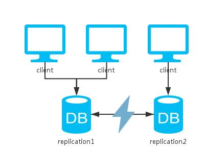

**可以不用想到底放弃P，保证CA的时候是怎么弄的，因为P总是存在的，放弃不了。另外，可用性、一致性也是我们一般系统必须要满足的，如何在可用性和一致性进行权衡，所以就出现了各种一致性的理论与算法。**

# BASE

BASE理论是：BASE是指基本可用（Basically Available）、软状态（ Soft State）、最终一致性（ Eventual Consistency）。BASE是对CAP中一致性和可用性权衡的结果，其来源于对大规模互联网系统分布式实践的总结，是基于CAP定理逐步演化而来的，其核心思想是即使无法做到强一致性(Strong consistency)，但每个应用都可以根据自身的业务特点，采用适当的方式来使系统达到最终一致性(Eventual consistency)。

在《从Paxos到Zookeeper分布式一致性原理与实践》这本书中，介绍了相关BASE理论：**基本可用：**

基本可用是指分布式系统在出现不可预知故障的时候，允许损失部分可用性——但请注意，这绝不等价于系统不可用。以下两个就是“基本可用”的典型例子。

1. 响应时间上的损失：正常情况下，一个在线搜索引擎需要在0.5秒之内返回给用户相应的查询结果，但由于出现故障（比如系统部分机房发生断电或断网故障），查询结果的响应时间增加到了1～2秒。

2. 功能上的损失：正常情况下，在一个电子商务网站上进行购物，消费者几乎能够顺利地完成每一笔订单，但是在一些节日大促购物高峰的时候，由于消费者的购物行为激增，为了保护购物系统的稳定性，部分消费者可能会被引导到一个降级页面。

**弱状态**

弱状态也称为软状态，和硬状态相对，是指允许系统中的数据存在中间状态，并认为该中间状态的存在不会影响系统的整体可用性，即允许系统在不同节点的数据副本之间进行数据同步的过程存在延时。

**最终一致性**

最终一致性强调的是系统中所有的数据副本，在经过一段时间的同步后，最终能够达到一个一致的状态。因此，最终一致性的本质是需要系统保证最终数据能够达到一致，而不需要实时保证系统数据的强一致性。

注意：最终一致性是一种特殊的弱一致性：系统能够保证在没有其他新的更新操作的情况下，数据最终一定能够达到一致的状态，因此所有客户端对系统的数据访问都能够获取到最新的值。**同时，在没有发生故障的前提下，数据达到一致状态的时间延迟，取决于网络延迟、系统负载和数据复制方案设计等因素**。

**在实际工程实践中，最终一致性存在以下五类主要变种。**

**1 因果一致性（Causal consistency）**

因果一致性是指，如果进程A在更新完某个数据项后通知了进程B，那么进程B之后对该数据项的访问都应该能够获取到进程A更新后的最新值，并且如果进程B要对该数据项进行更新操作的话，务必基于进程A更新后的最新值，即不能发生丢失更新情况。与此同时，与进程A无因果关系的进程C的数据访问则没有这样的限制。

**2 读己之所写（Read your writes）**

读己之所写是指，进程A更新一个数据项之后，它自己总是能够访问到更新过的最新值，而不会看到旧值。也就是说，对于单个数据获取者来说，其读取到的数据，一定不会比自己上次写入的值旧。因此，读己之所写也可以看作是一种特殊的因果一致性。

**3 会话一致性（Session consistency）**

会话一致性将对系统数据的访问过程框定在了一个会话当中：系统能保证在同一个有效的会话中实现“读己之所写”的一致性，也就是说，执行更能操作之后，客户端能够在同一个会话中始终读取到该数据项的最新值。

**4 单调读一致性（Monotonic read consistency）**

单调读一致性是指如果一个进程从系统中读取出一个数据项的某个值后，那么系统对于该进程后续的任何数据访问都不应该返回更旧的值。

**5 单调写一致性（Monotonic write consistency）**

单调写一致性是指，一个系统需要能够保证来自同一个进程的写操作被顺序地执行。

事实上，最终一致性并不是只有那些大型分布式系统才涉及的特性，**许多现代的关系型数据库都采用了最终一致性模型**。在现代关系型数据库中，大多都会**采用同步和异步方式来实现主备数据复制技术**。1 .在同步方式中，数据的复制过程通常是更新事务的一部分，因此在事务完成后，主备数据库的数据就会达到一致（强一致性）。2. 而在异步方式中，备库的更新往往会存在延时，这取决于事务日志在主备数据库之间传输的时间长短，如果传输时间过长或者甚至在日志传输过程中出现异常导致无法及时将事务应用到备库上，那么很显然，从备库中读取的数据将是旧的，因此就出现了数据不一致的情况。当然，无论是采用多次重试还是人为数据订正，关系型数据库还是能够保证最终数据达到一致——这就是系统提供最终一致性保证的经典案例。

总的来说，BASE理论面向的是大型高可用可扩展的分布式系统，和传统事务的ACID特性是相反的，它完全不同于ACID的强一致性模型，而是提出通过牺牲强一致性来获得可用性，并允许数据在一段时间内是不一致的，但最终达到一致状态。但同时，在实际的分布式场景中，不同业务单元和组件对数据一致性的要求是不同的，因此在具体的分布式系统架构设计过程中，ACID特性与BASE理论往往又会结合在一起使用。

以上BASE相关的理论来自《从Paxos到Zookeeper分布式一致性原理与实践》。

# 分布式一致性算法

## 总起

其实我觉得这些分布式一致性算法其实应该叫分布式共识（distributed consensus）算法，不同的一致性上下文含义不同。共识系统则很清晰， 就是多个参与者针对某一个议题达成一致意见，如经典的具有高度容错的基于消息传递的paxos算法，而2pc，3pc无法容错，太过保守。

**对于这些概念的理解应该放在固定的业务场景中，看在业务中解决了什么问题，而不是转牛角尖非要把这些算法分门别类。**

- **重点**

这些分布式一致性算法的目的**并不是达到了副本数据的强一致性**，因为CAP理论告诉我们，这是不可能的，而是在可用性和一致性的均衡处理上，用这些算法可以达到BASE状态，确保我们的分布式系统正确运行，那些数据副本的同步问题并不是一致性算法所要解决的，因为副本的同步不管是Mysql主从同步，还是其他master-slave集群的同步都是异步的，所以不可能达到强一致性，所以这些一致性算法是用来保证分布式系统的可用--一致的算法。例如，我们可以将paxos算法看做是分布式共识算法，它的目的就是怎么样对某个值（决议）在集群中达成一致，所以这可以用于集群中的leader选举，写数据过程。而2pc，3pc就是解决分布式事务（参与事务的事务管理器，参与者位于不同的节点）的原子性，一致性问题，而且这些算法并不是只能单一的应用于某个问题上，有很多问题都可以转化为用这些算法解决。

## 2PC、3PC

### 介绍

2PC,3PC主要是基于**分布式事务**的分布式一致性算法（因为分布式事务也可能会导致数据的不一致问题，这跟副本的不一致性从大类上看是都归于数据的不一致）。

在分布式系统中，各个节点之间在物理上相互独立，通过网络进行沟通和协调。由于存在事务机制，可以保证每个独立节点上的数据操作可以满足ACID。但是，相互独立的节点之间无法准确的知道其他节点中的事务执行情况。所以从理论上讲，两台机器理论上无法达到一致的状态。如果想让分布式部署的多台机器中的数据保持一致性，那么就要保证在所有节点的数据写操作，要不全部都执行，要么全部的都不执行。**但是，一台机器在执行本地事务的时候无法知道其他机器中的本地事务的执行结果。所以他也就不知道本次事务到底应该commit还是 roolback。所以，常规的解决办法就是引入一个“协调者”的组件来统一调度所有分布式节点的执行。**

### 2PC

二阶段提交的算法思路可以概括为：参与者将操作成败通知协调者，再由协调者根据所有参与者的反馈情报决定各参与者是否要提交操作还是中止操作。2PC就是用来解决分布式事务的原子性问题。所谓的两个阶段是指：第一阶段：准备阶段(投票阶段)和第二阶段：提交阶段（执行阶段）。其过程为：

#### **第一阶段：准备阶段**

事务协调者(事务管理器)给每个参与者(资源管理器)发送Prepare消息，每个参与者要么直接返回失败(如权限验证失败)，要么在本地执行事务，写本地的redo和undo日志，但不提交，然后向协调者反馈YES,NO。

其具体过程：

- 协调者节点向所有参与者节点询问是否可以执行提交操作(vote)，并开始等待各参与者节点的响应。
- 参与者节点执行询问发起为止的所有事务操作，并将Undo信息和Redo信息写入日志。（注意：若成功这里其实每个参与者已经执行了事务操作）
- 各参与者节点响应协调者节点发起的询问。如果参与者节点的事务操作实际执行成功，则它返回一个”同意”消息；如果参与者节点的事务操作实际执行失败，则它返回一个”中止”消息。

#### **第二阶段：提交阶段**

如果协调者收到了参与者的失败消息或者超时，直接给每个参与者发送回滚(Rollback)消息；否则，发送提交(Commit)消息；参与者根据协调者的指令执行提交或者回滚操作，**释放所有事务处理过程中使用的锁资源。(注意:必须在最后阶段释放锁资源)**。

**注意：在2PC中，当等待超时，会进行回滚操作。**

提交阶段可以分两种情况进行讨论：

##### **执行事务提交**

**当协调者节点从所有参与者节点获得的相应消息都为”同意”时:**

- 协调者节点向所有参与者节点发出”正式提交(commit)”的请求。
- 参与者节点正式完成操作，并释放在整个事务期间内占用的资源。
- 参与者节点向协调者节点发送”完成”消息。
- 协调者节点受到所有参与者节点反馈的”完成”消息后，完成事务。

如下图所示：

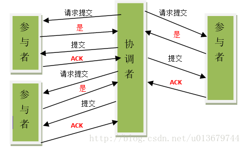

##### **中断事务**

***\*如果任一参与者节点在第一阶段返回的响应消息为”中止”，或者 协调者节点在第一阶段的询问超时之前无法获取所有参与者节点的响应消息时：\****

- 协调者节点向所有参与者节点发出”回滚操作(rollback)”的请求。
- 参与者节点利用之前写入的Undo信息执行回滚，并释放在整个事务期间内占用的资源。
- 参与者节点向协调者节点发送”回滚完成”消息。
- 协调者节点受到所有参与者节点反馈的”回滚完成”消息后，取消事务。

如下图所示：

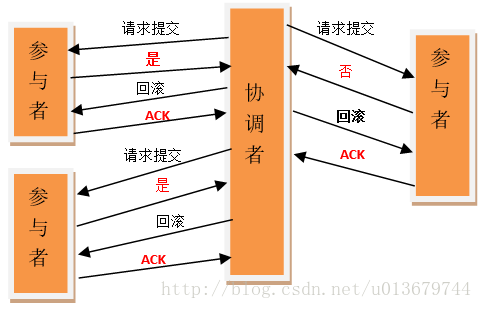

**不管最后结果如何，第二阶段都会结束当前事务**。**二阶段提交确实能够提供原子性的操作。**

#### 2PC的优缺点

**优点：**2PC的优点是很显然的，原理简单，实现方便。目前，绝大多数关系型数据库都是采用两阶段提交协议来完成分布式事务处理的。（也就是上边的2pc过程应用于关系型数据库的分布式事务）

**缺点：2PC的缺点也很致命：同步阻塞，单点问题，数据不一致，太过保守**

- 1、**同步阻塞问题**。执行过程中，所有参与节点都是事务阻塞型的。当参与者占有公共资源时，其他第三方节点访问公共资源不得不处于阻塞状态，**各个参与者在等待协调者发出提交或中断请求时，会一直阻塞，而协调者的发出时间要依赖于所有参与者的响应时间，如果协调者宕机了（单点），那么他就一直阻塞在这，而且无法达成一致（3PC引入了超时提交解决）。**
- 2、**单点故障**。由于协调者的重要性，一旦协调者发生故障。参与者会一直阻塞下去。尤其在第二阶段**，协调者发生故障，那么所有的参与者还都处于锁定事务资源的状态中，而无法继续完成事务操作**。（如果是协调者挂掉，可以重新选举一个协调者，但是无法解决因为协调者宕机导致的参与者处于阻塞状态的问题）
- 3、**数据不一致**。出现分区，或者网络故障。在二阶段提交的阶段二中，当协调者向参与者发送commit请求之后，发生了局部网络异常或者在发送commit请求过程中协调者发生了故障，这回导致**只有一部分参与者接受到了commit请求**。而在这部分参与者接到commit请求之后就会执行commit操作。但是其他部分未接到commit请求的机器则无法执行事务提交。于是整个分布式系统便出现了数据部一致性的现象。
- 4、**太过保守**：2pc没有设计相应的容错机制，当任意一个参与者节点宕机，那么协调者超时没收到响应，就会导致整个事务回滚失败。
- 5、**二阶段无法解决的问题**：协调者（在第二阶段）发出commit消息之后宕机，而唯一接收到这条消息的参与者同时也宕机了。那么即使协调者通过选举协议产生了新的协调者，这条事务的状态也是不确定的，没人知道事务是否被已经提交。

由于二阶段提交存在着诸如同步阻塞、单点问题、脑裂等缺陷，所以，研究者们在二阶段提交的基础上做了改进，提出了三阶段提交。

### 3PC

3PC，即三阶段提交，是2阶段提交的改进版，其将二阶段提交协议的“准备阶段”一份为二，形成了cancommit，precommit，do commit三个阶段。

**与两阶段提交不同的是，三阶段提交有两个改动点。**

1、引入超时机制。**（超时提交策略，当第三阶段参与者等待协调者超时后会提交事务，解决参与者同步阻塞问题，同时能在发生单点故障时，继续达成一致）**
2、在第一阶段和第二阶段中插入一个准备阶段。（也是为了减少同步阻塞的发生范围）

#### CanCommit阶段

3PC的CanCommit阶段其实和2PC的准备阶段很像。协调者向参与者发送commit请求，参与者如果可以提交就返回Yes响应，否则返回No响应。

- 1.事务询问 协调者向参与者发送CanCommit请求。询问是否可以执行事务提交操作。然后开始等待参与者的响应。
- 2.响应反馈 参与者接到CanCommit请求之后，正常情况下，如果其自身认为可以顺利执行事务，则返回Yes响应，并进入预备状态。否则反馈No

#### PreCommit阶段

协调者根据参与者的反应情况来决定是否可以记性事务的PreCommit操作。根据响应情况，有以下两种可能。

假如协调者从所有的参与者获得的反馈都是Yes响应，那么就会执行事务的预执行

- 1.发送预提交请求 协调者向参与者发送PreCommit请求，并进入Prepared阶段。
- 2.事务预提交 参与者接收到PreCommit请求后，会执行事务操作，并将undo和redo信息记录到事务日志中。
- 3.响应反馈 如果参与者成功的执行了事务操作，则返回ACK响应，同时开始等待最终指令。

假如有任何一个参与者向协调者发送了No响应，或者等待超时之后，协调者都没有接到参与者的响应，那么就执行事务的中断。

- 1.发送中断请求 协调者向所有参与者发送abort请求。
- 2.中断事务 参与者收到来自协调者的abort请求之后（或超时之后，仍未收到协调者的请求），执行事务的中断。

#### doCommit阶段

该阶段进行真正的事务提交，也可以分为以下两种情况。

执行提交

> 1.发送提交请求 协调接收到参与者发送的ACK响应，那么他将从预提交状态进入到提交状态。并向所有参与者发送doCommit请求。
>
> 2.事务提交 参与者接收到doCommit请求之后，执行正式的事务提交。并在完成事务提交之后释放所有事务资源。
>
> 3.响应反馈 事务提交完之后，向协调者发送Ack响应。
>
> 4.完成事务 协调者接收到所有参与者的ack响应之后，完成事务。

中断事务 协调者没有接收到参与者发送的ACK响应（可能是接受者发送的不是ACK响应，也可能响应超时），那么就会执行中断事务。

> 1.发送中断请求 协调者向所有参与者发送abort请求
>
> 2.事务回滚 参与者接收到abort请求之后，利用其在阶段二记录的undo信息来执行事务的回滚操作，并在完成回滚之后释放所有的事务资源。
>
> 3.反馈结果 参与者完成事务回滚之后，向协调者发送ACK消息
>
> 4.中断事务 协调者接收到参与者反馈的ACK消息之后，执行事务的中断。

**注意：**

在doCommit阶段，如果参与者无法及时接收到来自协调者的doCommit或者rebort请求时，会在等待超时之后，会继续进行事务的提交。

引入超时提交的依据：

其实这个应该是基于概率来决定的，当进入第三阶段时，说明参与者在第二阶段已经收到了PreCommit请求，那么协调者产生PreCommit请求的前提条件是他在第二阶段开始之前，**收到所有参与者的CanCommit响应都是Yes**。（一旦参与者收到了PreCommit，意味他知道大家其实都同意修改了）所以，一句话概括就是，当进入第三阶段时，由于网络超时等原因，虽然参与者没有收到commit或者abort响应，但是他有理由相信：成功提交的几率很大。

#### 3PC解决的问题

一旦进入阶段三：可能会出现：1 协调者出现问题（单点）   2 协调者参与者之间的网络出现故障

二阶段无法解决的问题：协调者（在第二阶段）发出commit消息之后宕机，而唯一接收到这条消息的参与者同时也宕机了。那么即使协调者通过选举协议产生了新的协调者，这条事务的状态也是不确定的，没人知道事务是否被已经提交。

相对于2PC，**3PC主要解决的单点故障问题，并减少阻塞**，因为一旦参与者无法及时收到来自协调者的信息之后，他会默认执行commit（所以产生新的协调者之后，可以确定事务的状态，这就解决了单点）。而不会一直持有事务资源并处于阻塞状态。

**3PC无法解决：数据不一致以及太过保守问题。**

但是这种机制也会导致数据一致性问题，因为，由于网络原因，协调者发送的abort响应没有及时被参与者接收到，那么参与者在等待超时之后执行了commit操作。这样就和其他接到abort命令并执行回滚的参与者之间存在数据不一致的情况。

### 2PC、3PC的应用

我们前面说过，对于大多数的关系型数据库来说，解决分布式事务的方法就是利用两阶段提交2pc，**其过程就是我们上边介绍的2PC的过程**。可参考：[Mysql的2pc应用](http://www.cnblogs.com/hustcat/p/3577584.html) 。主要涉及mysql的几个日志：[mysql日志文件](http://blog.csdn.net/dbdoctor/article/details/53184019) ，另外还有在事务过程中的redo_log undo [redo undo](https://www.cnblogs.com/Bozh/archive/2013/03/18/2966494.html)。

## paxos算法

###  [如何浅显易懂地解说 Paxos 的算法？](https://www.zhihu.com/question/19787937)

#### Paxos算法背景介绍：

Paxos算法是分布式技术大师Lamport提出的，主要目的是通过这个算法，让参与分布式处理的每个参与者逐步达成一致意见。用好理解的方式来说，就是在一个选举过程中，让不同的选民最终做出一致的决定。
Lamport为了讲述这个算法，假想了一个叫做Paxos的希腊城邦进行选举的情景，这个算法也是因此而得名。在他的假想中，这个城邦要采用民主提议和投票的方式选出一个最终的决议，但由于城邦的居民没有人愿意把全部时间和精力放在这种事情上，所以他们只能不定时的来参加提议，不定时来了解提议、投票进展，不定时的表达自己的投票意见。Paxos算法的目标就是让他们按照少数服从多数的方式，最终达成一致意见。

#### Paxos算法的具体情况：

1、在整个提议和投票过程中，主要的角色就是“提议者”（向“接受者”提出提议）和“接受者”（收到“提议者”的提议后，向“提议者”表达自己的意见）。

2、整个算法的大致过程为：
第一阶段：因为存在多个“提议者”，如果都提意见，那么“接受者”接受谁的不接受谁的？太混乱了。所以，要先明确哪个“提议者”是意见领袖有权提出提议，未来，“接受者”们就主要处理这个“提议者”的提议了**（这样，也可以在提出提议时就尽量让意见统一，谋求尽早形成多数派）。**
第二阶段：由上阶段选出的意见领袖提出提议，“接受者”反馈意见。如果多数“接受者”接受了一个提议，那么提议就通过了。

#### 3、必须要了解的其他相关背景：

1）怎么明确意见领袖呢？通过编号。每个“提议者”在第一阶段先报个号，谁的号大，谁就是意见领袖。如果不好理解，可以想象为贿选。每个提议者先拿着钞票贿赂一圈“接受者”，谁给的钱多，第二阶段“接受者”就听谁的。（注：这里和下文提到的“意见领袖”，并不是一个新的角色，而是代表在那一轮贿赂成功的“提议者”。所以，请把意见领袖理解为贿赂中胜出的“提议者”即可）
2）有个跟选举常识不一样的地方，就是每个“提议者”不会执着于让自己的提议通过，而是每个“提议者”会执着于让提议尽快达成一致意见。所以，为了这个目标，如果“提议者”在贿选的时候，发现“接受者”已经接受过前面意见领袖的提议了，即便“提议者”贿选成功，也会默默的把自己的提议改为前面意见领袖的提议。所以一旦贿赂成功，胜出的“提议者”再提出提议，提议内容也是前面意见领袖的提议**（这样，在谋求尽早形成多数派的路上，又前进了一步）**。
3）钱的多少很重要，如果钱少了，无论在第一还是第二阶段“接受者”都不会尿你，直接拒绝。
4）上面2）中讲到，如果“提议者”在贿选时，发现前面已经有意见领袖的提议，那就将自己的提议默默改成前面意见领袖的提议。这里有一种情况，如果你是“提议者”，在贿赂的时候，“接受者1”跟你说“他见过的意见领袖的提议是方案1”，而“接受者2”跟你说“他见过的意见领袖提议是方案2”，你该怎么办？这时的原则也很简单，还是：钱的多少很重要！你判断一下是“接受者1”见过的意见领袖有钱，还是“接受者2”见过的意见领袖有钱？如何判断呢？因为“接受者”在被“提议者”贿赂的时候，自己会记下贿赂的金额。所以当你贿赂“接受者”时，一旦你给的贿赂多而胜出，“接受者”会告诉你两件事情：a.前任意见领袖的提议内容（如果有的话），b.前任意见领袖当时贿赂了多少钱。这样，再面对刚才的情景时，你只需要判断一下“接受者1”和“接受者2”告诉你的信息中，哪个意见领袖当时给的钱多，那你就默默的把自己的提议，改成那个意见领袖的提议。
5）最后这一部分最有意思，但描述起来有点绕，如果不能一下子就理解可以先看后面的例子。在整个选举过程中，每个人谁先来谁后到，“接受者”什么时间能够接到“提议者”的信息，是完全不可控的。所以很可能一个意见领袖已经产生了，但是由于这个意见领袖的第二阶段刚刚开始，绝大部分“接受者”还没有收到这个意见领袖的提议。结果，这时突然冲进来了一个新的土豪“提议者”，那么这个土豪“提议者”也是有机会让自己的提议胜出的！**这时就形成了一种博弈：**a.上一个意见领袖要赶在土豪“提议者”贿赂到“接受者”前，赶到“接受者”面前让他接受自己的提议，否则会因为自己的之前贿赂的钱比土豪少而被拒绝。b.土豪“提议者”要赶在上一个意见领袖将提议传达给“接受者”前，贿赂到“接受者”，否则土豪“提议者”即便贿赂成功，也要默默的将自己的提议改为前任意见领袖的提议。这整个博弈的过程，最终就看这两个“提议者”谁的进展快了。但最终一定会有一个意见领袖，先得到多数“接受者”的认可，那他的提议就胜出了。

#### 4、总结

好啦，故事到这里基本讲述完了，咱们来总结一下，其实Paxos算法就下面这么几个原则：
1）Paxos算法包括两个阶段：第一个阶段主要是贿选，还没有提出提议；第二个阶段主要根据第一阶段的结果，明确接受谁的提议，并明确提议的内容是什么（这个提议可能是贿选胜出“提议者”自己的提议，也可能是前任意见领袖的提议，具体是哪个提议，见下面第3点原则）。
2）编号（贿赂金额）很重要，无论在哪个阶段，编号（贿赂金额）小的，都会被鄙视（被拒绝）。
3）在第一阶段中，一旦“接受者”已经接受了之前意见领袖的提议，那后面再来找这个“接受者”的“提议者”，即便在贿赂中胜出，也要被洗脑，默默将自己的提议改为前任意见领袖的提议，然后他会在第二阶段提出该提议（也就是之前意见领袖的提议，以力争让大家的意见趋同）。如果“接受者”之前没有接受过任何提议，那贿选胜出的“提议者”就可以提出自己的提议了。

### 其他文章

#### Paxos算法产生的背景

Paxos算法是基于 **消息传递且具有高度容错特性的一致性算法**，是目前公认的解决分布式一致性问题最有效的算法之一，**其解决的问题就是在分布式系统中如何就某个值（决议）达成一致。**

**我自己的理解是：不要把这个Paxos算法达到的目的和分布式事务联系起来，而是针对Zookeeper这样的master-slave集群对某个决议达成一致，也就是副本之间写或者leader选举达成一致。我觉得这个算法和狭义的分布式事务不是一样的。**

**在常见的分布式系统中，总会发生诸如机器宕机或网络异常（包括消息的延迟、丢失、重复、乱序，还有网络分区）(也就是会发生异常的分布式系统)等情况。Paxos算法需要解决的问题就是如何在一个可能发生上述异常的分布式系统中，快速且正确地在集群内部对某个数据的值达成一致。也可以理解成分布式系统中达成状态的一致性。**

注：这里**某个数据的值**并不只是狭义上的某个数，它可以是一条日志，也可以是一条命令（command）。。。根据应用场景不同，某个数据的值有不同的含义。

#### 对Paxos保证一致性换一种理解：

 Paxos 算法是分布式一致性算法用来解决一个分布式系统如何就某个值(决议)达成一致的问题。**一个典型的场景是，在一个分布式数据库系统中，如果各节点的初始状态一致，每个节点都执行相同的操作序列，那么他们最后能得到一个一致的状态**。为保证每个节点执行相同的命令序列，需要在每一条指令上执行一个”一致性算法”以保证每个节点看到的指令一致。

分布式系统中一般是通过多副本来保证可靠性，而多个副本之间会存在数据不一致的情况。所以必须有一个一致性算法来保证数据的一致，描述如下： 
	假如在分布式系统中初始是各个节点的数据是一致的，每个节点都顺序执行系列操作，然后每个节点最终的数据还是一致的。 
  Paxos算法就是解决这种分布式场景中的一致性问题。对于一般的开发人员来说，**只需要知道paxos是一个分布式选举算法即可**。多个节点之间存在两种通讯模型：共享内存（Shared memory）、消息传递（Messages passing），Paxos是基于消息传递的通讯模型的。

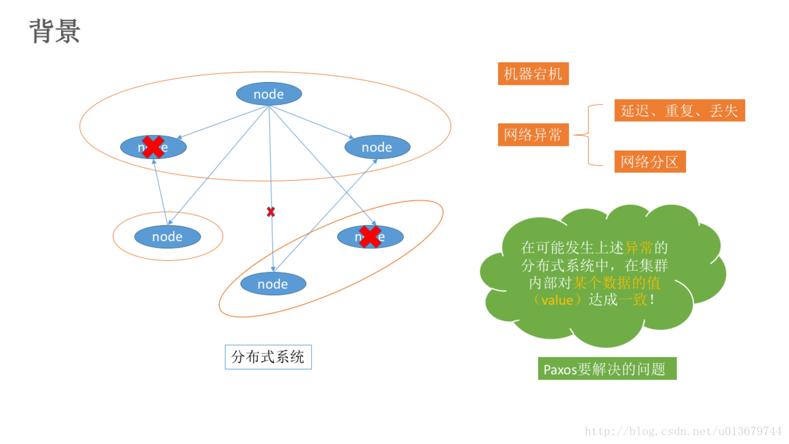

#### 拜占庭问题

拜占庭将军问题：是指拜占庭帝国军队的将军们必须全体一致的决定是否攻击某一支敌军。问题是这些将军在地理上是分隔开来的，只能依靠通讯员进行传递命令，但是通讯员中存在叛徒，**它们可以篡改消息**，叛徒可以欺骗某些将军采取进攻行动；促成一个不是所有将军都同意的决定，如当将军们不希望进攻时促成进攻行动；或者迷惑某些将军，使他们无法做出决定。

Paxos算法的前提假设是不存在拜占庭将军问题，即：***\*信道是安全的（信道可靠），发出的信号不会被篡改，因为Paxos算法是基于消息传递的\****。此问题由Lamport提出，它也是 Paxos算法的提出者。

从理论上来说，在分布式计算领域，试图在异步系统和不可靠信道上来达到一致性状态是不可能的。因此在对一致性的研究过程中，都往往假设信道是可靠的，而事实上，大多数系统都是部署在一个局域网中，因此消息被篡改的情况很罕见；另一方面，由于硬件和网络原因而造成的消息不完整问题，只需要一套简单的校验算法即可。因此，在实际工程中，可以假设所有的消息都是完整的，也就是没有被篡改。

#### Paxos算法的相关概念

在Paxos算法中，有三种角色：

- **Proposer**
- **Acceptor**
- **Learners**

在具体的实现中，一个进程可能同时充当多种角色。比如一个进程可能既是Proposer又是Acceptor又是Learner。Proposer负责提出提案，Acceptor负责对提案作出裁决（accept与否），learner负责学习提案结果。

还有一个很重要的概念叫**提案**（Proposal）。最终要达成一致的value就在提案里。只要Proposer发的提案被Acceptor接受（半数以上的Acceptor同意才行），Proposer就认为该提案里的value被**选定**了。Acceptor告诉Learner哪个value被选定，Learner就认为那个value被**选定**。只要Acceptor接受了某个提案，Acceptor就任务该提案里的value被**选定**了。

**为了避免单点故障，会有一个Acceptor集合，Proposer想Acceptor集合发送提案，Acceptor集合中的每个成员都有可能同意该提案且每个Acceptor只能批准一个提案，只有当一半以上的成员同意了一个提案，就认为该提案被选定了。**

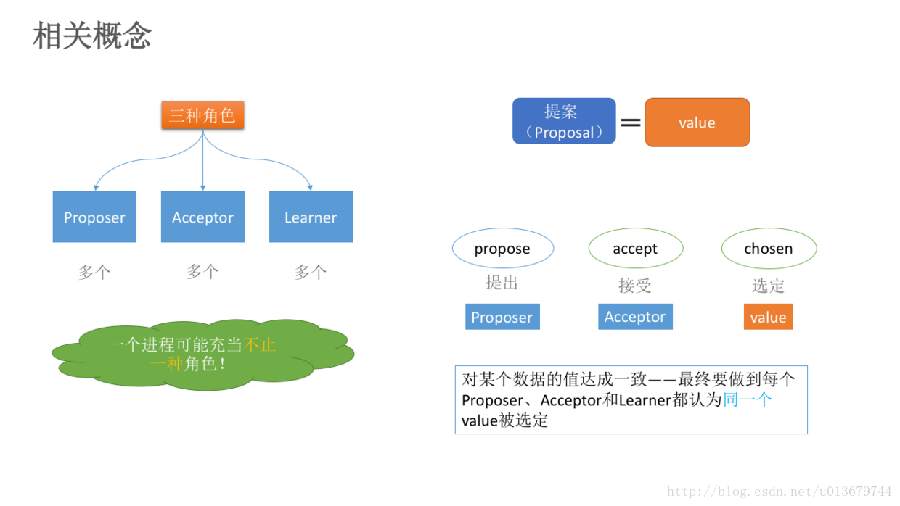

#### Paxos算法的解决的问题描述

假设有一组可以提出（propose）value（value在提案Proposal里）的进程集合。一个一致性算法需要保证提出的这么多value中，只有一个value被选定（chosen）。如果没有value被提出，就不应该有value被选定。如果一个value被选定，那么所有进程都应该能学习（learn）到这个被选定的value。对于一致性算法，安全性（safaty）要求如下：

- 只有被提出的value才能被选定。
- 只有一个value被选定，并且
- 如果某个进程认为某个value被选定了，那么这个value必须是真的被选定的那个。

***\*Paxos的目标：保证最终有一个value会被选定，当value被选定后，进程最终也能获取到被选定的value。\****

#### Paxos算法的过程（算法描述）

Paxos算法类似于两阶段提提交，其算法执行过程分为两个阶段。具体如下：

- **阶段一（prepare阶段）：**

(a) Proposer选择一个提案编号N，然后向**半数以上**的Acceptor发送编号为N的Prepare请求。Pareper（N）

(b) 如果一个Acceptor收到一个编号为N的Prepare请求，如果小于它已经响应过的请求，则拒绝，不回应或回复error。若N大于该Acceptor已经响应过的所有Prepare请求的编号（maxN），那么它就会将它已经接受过（已经经过第二阶段accept的提案）的编号最大的提案（如果有的话，如果还没有的accept提案的话返回{pok，null，null}）作为响应反馈给Proposer，**同时该Acceptor承诺\**不再接受\**任何\**编号小于N的提案\**。**

- **阶段二（accept阶段）：**

(a) 如果一个Proposer收到半数以上Acceptor对其发出的编号为N的Prepare请求的响应，那么它就会发送一个针对[N,V]提案的Accept请求给半数以上的Acceptor。注意：***\*V就是收到的\*\*响应\*\*中\*\*编号最大的提案的value（某个acceptor响应的它已经通过的{acceptN，acceptV}）\*\*，如果响应中\*\*不包含任何提案\*\*，那么V就由Proposer\*\*自己决定\*\**\***。

(b) 如果Acceptor收到一个针对编号为N的提案的Accept请求，只要该Acceptor没有对编号大于N的Prepare请求做出过响应，它就接受该提案。如果N小于Acceptor以及响应的prepare请求，则拒绝，不回应或回复error（当proposer没有收到过半的回应，那么他会重新进入第一阶段，递增提案号，重新提出prepare请求）。

所有proposer经过上边的不走

注意：**有几个约定**：

（1）每一个Acceptor最多就只能批准一个提案（就是第二阶段accept的），那么就能保证只有一个提案被选定了？？？Accept之后就不能改了？？？如果不能改的话，那Acceptor肯定不是一致的，而且这样能达到多数？？但是，如果能改的话，倒是能达成一致，但是这样真的可以？？我感觉是可以accept多个的，但是书上又写了每一个Acceptor最多就只能批准一个提案。但后边也写了改变accept的值，不懂。。。。。。。最后，我觉得是只能accept一个，proposer会达成一致的value1，所以选出了唯一的value。应该不会出现那个始终达不成过半情况，因为毕竟发送时有先后的。所以，下边的图画的还是不那么准确。

（2）因为获取那些已经通过的提案比预测未来可能会通过的提案来的简单。当Acceptor对一个N的prepare的提案响应后，他就会作出保证，不再接受任何小于N的提案号的提案。

接下来，用图来表示一下：

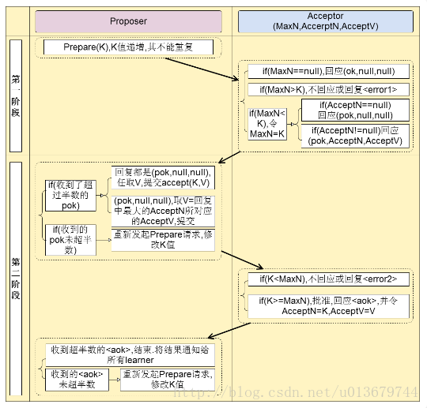

#### 具体实例理解

问题背景：假设我们有下图的系统，想要在server1，server2，server3选一个master。

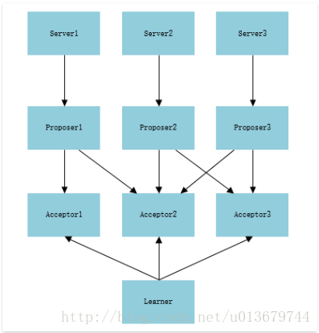

**prepare阶段** 
  1. 每个server向proposer发送消息，表示自己要当leader，假设proposer收到消息的时间不一样，顺序是： proposer2 -> proposer1 -> proposer3，消息编号依次为1、2、3。 
  紧接着，proposer将消息发给acceptor中超过半数的子成员(这里选择两个)，如图所示，proposer2向acceptor2和acceptor3发送编号为1的消息，proposer1向acceptor1和accepto2发送编号为2的消息，proposer3向acceptor2和acceptor3发送编号为3的消息。 

    \2. 假设这时proposer1发送的消息先到达acceptor1和acceptor2，它们都没有接收过请求，所以接收该请求并返回【pok，null，null】给proposer1，同时acceptor1和acceptor2承诺不再接受编号小于2的请求； 
  紧接着，proposer2的消息到达acceptor2和acceptor3，acceptor3没有接受过请求，所以返回proposer2 【pok，null，null】，acceptor3并承诺不再接受编号小于1的消息。而acceptor2已经接受proposer1的请求并承诺不再接收编号小于2的请求，所以acceptor2拒绝proposer2的请求； 
  最后，proposer3的消息到达acceptor2和acceptor3，它们都接受过提议，但编号3的消息大于acceptor2已接受的2和acceptor3已接受的1，所以他们都接受该提议，并返回proposer3 【pok，null，null】； 
  此时，proposer2没有收到过半的回复，所以重新取得编号4，并发送给acceptor2和acceptor3，此时编号4大于它们已接受的提案编号3，所以接受该提案，并返回proposer2 【pok，null，null】。

**accept阶段** 
1 
  Proposer3收到半数以上（两个）的回复，并且返回的value为null，所以，proposer3提交了【3，server3】的提案。 
  Proposer1也收到过半回复，返回的value为null，所以proposer1提交了【2，server1】的提案。 
  Proposer2也收到过半回复，返回的value为null，所以proposer2提交了【4，server2】的提案。 

  **（这里要注意，并不是所有的proposer都达到过半了才进行第二阶段，这里只是一种特殊情况）**
2 
  Acceptor1和acceptor2接收到proposer1的提案【2，server1】，acceptor1通过该请求，acceptor2承诺不再接受编号小于4的提案，所以拒绝； 
  Acceptor2和acceptor3接收到proposer2的提案【4，server2】，都通过该提案； 
  Acceptor2和acceptor3接收到proposer3的提案【3，server3】，它们都承诺不再接受编号小于4的提案，所以都拒绝。

所以proposer1和proposer3会再次进入第一阶段，但这时候 Acceptor2和acceptor3已经通过了提案（AcceptN = 4，AcceptV=server2），并达成了多数，所以proposer会递增提案编号，并最终改变其值为server2。最后所有的proposer都肯定会达成一致，这就迅速的达成了一致。

  此时，**过半的acceptor（acceptor2和acceptor3）都接受了提案【4，server2】，learner感知到提案的通过，learner开始学习提案，所以server2成为最终的leader。**

#### Learner学习被选定的value（第二阶段accept的）

有三种方案：

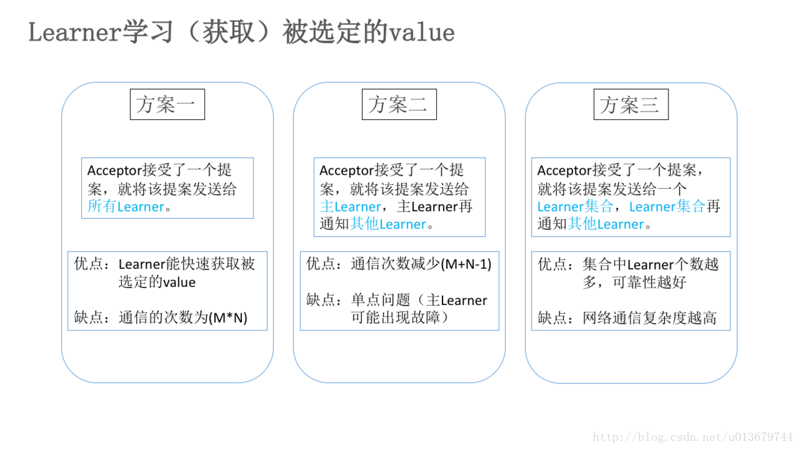

#### Paxos算法的活锁问题（保证算法活性）

上边我们介绍了Paxos的算法逻辑，但在算法运行过程中，可能还会存在一种极端情况，当有两个proposer依次提出一系列编号递增的议案，那么会陷入死循环，无法完成第二阶段，也就是无法选定一个提案。如下图：

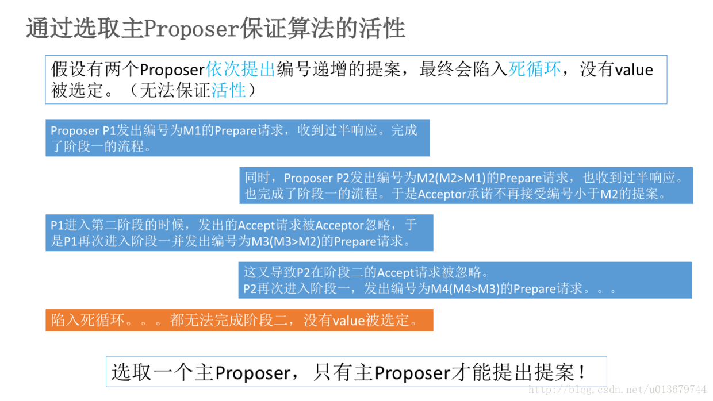

通过选取主Proposer，就可以保证Paxos算法的活性。选择一个主Proposer，并规定只有主Proposer才能提出议案。这样一来，只要主Proposer和过半的Acceptor能够正常进行网络通信，那么肯定会有一个提案被批准（第二阶段的accept），则可以解决死循环导致的活锁问题。

#### Paxos算法的过半依据

在Paxos算法中，采用了“过半”理念，也就是少数服从多数，这使Paxos算法具有很好的容错性。那么为什么采用过半就可以呢？

Paxos基于的过半数学原理： 我们称大多数（过半）进程组成的集合为法定集合，**两个法定（过半）集合必然存在非空交集，即至少有一个公共进程，称为法定集合性质**。 例如A,B,C,D,F进程组成的全集，法定集合Q1包括进程A,B,C，Q2包括进程B,C,D，那么Q1和Q2的交集必然不在空，C就是Q1，Q2的公共进程。如果要说Paxos最根本的原理是什么，那么就是这个简单性质。也就是说：两个过半的集合必然存在交集，也就是肯定是相等的，也就是肯定达成了一致。

Paxos是基于消息传递的具有高度容错性的分布式一致性算法。Paxos算法引入了过半的概念，解决了2PC，3PC的太过保守的缺点，且使算法具有了很好的容错性，另外Paxos算法支持分布式节点角色之间的轮换，这极大避免了分布式单点的出现，因此Paxos算法既解决了无限等待问题，也解决了脑裂问题，是目前来说最优秀的分布式一致性算法。其中，Zookeeper的ZAB算法和Raft一致性算法都是基于Paxos的。在后边的文章中，我会逐步介绍优秀的分布式协调服务框架，也是极优秀的工业一致性算法的实现Zookeeper使用和实现。

### 我的评论

说明的不是很好，p约束写得好复杂好绕，推理也不是很好。比如P2a那里的v1和v2矛盾，怎么就得出p2b约束。给我的感觉就是为了约束而约束。

既然分布式是为了达成一致性，那么v1和v2矛盾后的下一个约束p2b应该是：acceptor接受的提案是可以被修改的，以求快速达到提案一致性。那么应该如何修改acceptor已接受的提案？当然是少数服从多数，把少数的一方改为多数的一方就行了。那么怎么判定谁是多数的一方呢？通过编号和学习过程。我们会不断把编号较大的提案的值辐射到其余acceptor中。尝试获取过半的acceptor的中最大编号的提案，然后继续发提案。为什么是较大呢，因为网络有延迟啊、断网什么的，我们只需要过半就可以辐射一次，不需要非要找到最大编号的提案。不断重复这一步，大部分acceptor所接受的提案的值就会等于编号最大的提案的值。是不是逐渐达到一致性了。

文章并没有说为什么acceptor为什么要这样接受，proposer为什么这样提出。**都是为了尽快把编号最大的提案的value辐射到其他acceptor。**

还有，这一个过程应该挺快，虽然比起单个proposer要慢，如果一直无法令一个值超过半数，那么原因就是#10楼的活锁或者网络太差了，一到第二阶段就断开网络连接，接受失败，我感觉这种情况可能集群早就宣告崩溃了。

### learner

用于感知value最终是否被大多数acceptor认可，如果已经超过半数认可则value被定下来，并通知所有actor关闭本次更新流程。更新应该是连续的，每次更新都会有一个编号。实际应用过程中还需要对更新编号进行处理，避免老的数据残留。

### 活锁

“活锁”的根本原因在于两个proposer交替提案，避免“活锁”的方式为，如果一个proposer通过accpter返回的消息知道此时有更高编号的提案被提出时，该proposer静默一段时间，而不是马上提出更高的方案，静默期长短为一个提案从提出到被接受的大概时间长度即可，静默期过后，proposer重新提案。系统中之所以要有主proposer的原因在于，如果每次数据更改都用paxos，那实在是太慢了，还是通过主节点下发请求这样来的快，因为省去了不必要的paxos时间。所以选择主proposer用paxos算法，因为选主的频率要比更改数据频率低太多。但是主proposer挂了咋整，整个集群就一直处于不可用状态，所以一般都用租约的方式，如果proposer挂了，则租约会过期，其它proposer就可以再重新选主，如果不挂，则主proposer自己续租。

### 参考资料

- 论文《Paxos Made Simple》
- 论文《The Part-Time Parliament》
- 英文版维基百科的Paxos
- 中文版维基百科的Paxos
- 书籍《从Paxos到ZooKeeper》

# 分布式系统

## 单机

单机系统和显然，只能保证CP，牺牲了可用性A。单机版的MySQL，Redis，MongoDB等数据库都是这种模式。

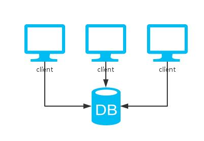

## 多副本

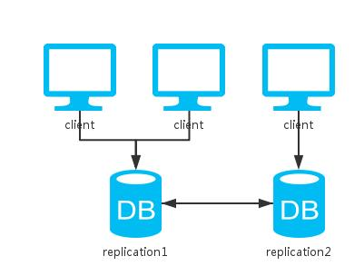

相比于单实例，这里多了一个节点去备份数据。

对于读操作来说，因为可以访问两个节点中的任意一个，所以可用性提升。

**对于写操作来说，根据更新策略分为三种情况：**

通常有一个leader作为先写。

**1.同步更新：**即写操作需要等待两个节点都更新成功才返回。这样的话如果一旦发生网络分区故障，写操作便不可用，牺牲了A。

**2.异步更新：**即写操作直接返回，不需要等待节点更新成功，节点异步地去更新数据（FastDFS文件系统的存储节点就是用这种方式，写完一份数据之后立即返回结果，副本数据由同步线程写入其他同group的节点）。这种方式，牺牲了C来保证A，即无法保证数据是否更新成功，还有可能会由于网络故障等原因，导致数据不一致。

**3.折衷：**更新部分节点成功后便返回。

这里，先介绍一下类Dynamo系统用于控制分布式存储系统中的一致性级别的策略--NWR：

*N：同一份数据的副本个数

*W：写操作需要确保成功的副本个数

*R：读操作需要读取的副本个数

当W+R>N时，由于读写操作覆盖到的副本集肯定会有交集，读操作只要比较副本集数据的修改时间或者版本号即可选出最新的，所以系统是强一致性的；反之，当W+R<=N时是弱一致性的。

如：(N,W,R)=(1,1,1)为单机系统，是强一致性的；(N,W,R)=(2,1,1)位常见的master-slave模式，是弱一致性的。

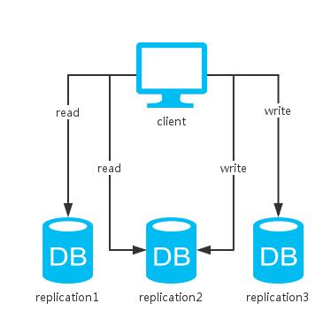

举例：

1. 如像Cassandra中的折衷型方案QUORUM，只要超过半数的节点更新成功便返回，读取时返回多副本的一致的值。然后，对于不一致的副本，可以通过read repair的方式解决。read repair：读取某条数据时，查询所有副本中的这条数据，比较数据与大多数副本的最新数据是否一致，若否，则进行一致性修复。其中，W + R > N，故而是强一致性的。

2. 又如Redis的master-slave模式，更新成功一个节点即返回，其他节点异步去备份数据。这种方式只保证了**最终一致性**。**最终一致性：**相比于数据时刻保持一致的强一致性，最终一致性允许某段时间内数据不一致。但是随着时间的增长，数据最终会到达一致的状态。其中，W+R<N，所以只能保证最终一致性。

此外，N越大，数据可靠性越好，但是由于W或者R越大，读写开销越大，性能越差，所以一般需要总和考虑一致性，可用性和读写性能，**设置W，R都为N/2+1。**

其实，**折衷方案和异步更新的方式从本质上来说是一样的，都是损失一定的C来换取A的提高**。而且，会产生'脑裂'的问题--即网络分区时节点各自处理请求，无法同步数据，当网络恢复时，导致不一致。

**一般的，数据库都会提供分区恢复的解决方案：**

1.从源头解决：如设定节点通信的超时时间，超时后'少数派'节点不提供服务。这样便不会出现数据不一致的情况，不过可用性降低。zookeeper就是这样。

2.从恢复解决：如在通信恢复时，对不同节点的数据进行比较、合并，这样可用性得到了保证。但是在恢复完成之前，数据是不一致的，而且可能出现数数据冲突。

光这样还不够，当数据量较大时，由于一台机器的资源有限并不能容纳所有的数据，我们会向把数据分到好几台机器上存储。

## 分片

相比于单实例，这里多了一个节点去分割数据。

由于所有数据只有一份，一致性得以保证；节点间不需要通信，分区容忍性也有。

然而，当任意一个节点挂掉，丢失了一部分的数据，系统可用性得不到保证。

综上，这和单机版的方案一样，都只能保证CP。

那么，有哪些好处呢？

1.某个节点挂掉只会影响部分服务，即服务降级；

2.由于分片了数据，可以均衡负载；

3.数据量增大/减小后可以相应的扩容/缩容。

大多数的数据库服务都提供了分片的功能。如Redis的slots，Cassandra的patitions，MongoDB的shards等。

基于分片解决了数据量大的问题，可是我们还是希望我们的系统是高可用的，那么，如何牺牲一定的一致性去保证可用性呢？

## 集群

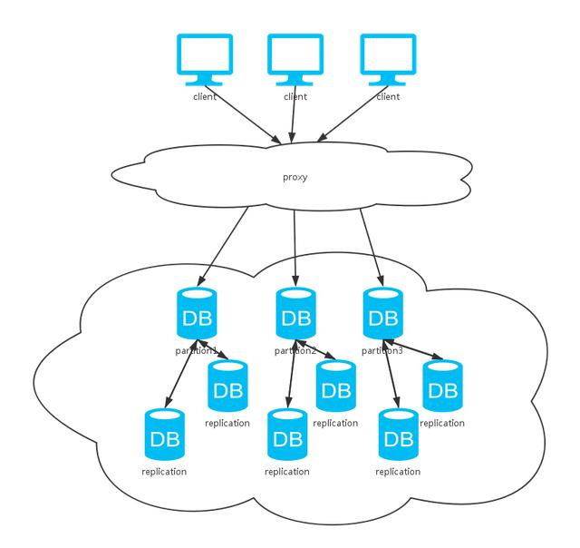

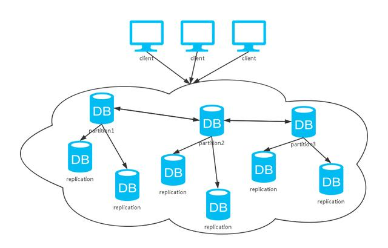

可以看到，上面这种方式综合了前两种方式。同上分析，采用不同的数据同步策略，系统CAP保证各有不同。不过，一般数据库系统都会提供可选的配置，我们根据不同的场景选择不同的特性。

其实，对于大多数的非金融类互联网公司，要求并非强一致性，而是可用性和最终一致性的保证。这也是NoSQL流行于互联网应用的一大原因，相比于强一致性系统的ACID原则，它更加倾向于BASE：

\>Basically Available：基本可用性，即允许分区失败，除了问题仅服务降级；

\>Soft-state：软状态，即允许异步；

\>Eventual Consistency：最终一致性，允许数据最终一致性，而不是时刻一直。

## 总结

基本上，上面讨论的几种方式已经涵盖了大多数的分布式存储系统了。我们可以看到，这些个方案总是需要通过牺牲一部分去换取另一部分，总没法达到100%的CAP。选择哪种方案，依据就是在特定场景下，究竟哪些特性是更加重要的了。

# 参考文章

[怕什么真理无穷, 进一寸有一寸的欢喜](https://blog.csdn.net/u013679744)：zookeeper系列

[分布式系统的思考及CAP理论](https://blog.csdn.net/lavorange/article/details/52489998)

https://www.cnblogs.com/ibigboy/p/15923344.html | etcd和Zookeeper孰优孰劣对比 - 问北 - 博客园