# 分布式事务

**解决两个本地事务的一致性**

通常把一个数据库内部的事务处理，如对多个表的操作，作为本地事务看待。数据库的事务处理对象是本地事务，而分布式事务处理的对象是全局事务。 

所谓**全局事务**，是指分布式事务处理环境中，多个数据库可能需要共同完成一个工作，这个工作即是一个全局事务，例如，一个事务中可能更新几个不同的数据库（可以是不同的应用对应的数据库，也可以是副本？？）。对数据库的操作发生在系统的各处但**必须全部被提交或回滚**。此时一个数据库对自己内部所做操作的提交不仅依赖本身操作是否成功，还要依赖与全局事务相关的其它数据库的操作是否成功，如果任一数据库的任一操作失败，则参与此事务的所有数据库所做的所有操作都必须回滚。 一般情况下，某一数据库无法知道其它数据库在做什么。因此，**在一个 DTP 环境中，交易中间件**是必需的，由它通知和协调相关数据库的提交或回滚。而一个数据库只将其自己所做的操作（可恢复）影射到全局事务中。
二阶提交协议和三阶提交协议就是根据这一思想衍生出来的。可以说二阶段提交其实就是实现XA分布式事务的关键(确切地说：**两阶段提交主要保证了分布式事务的原子性：即所有结点要么全做要么全不做**)

我的理解：其实我们也可以将2PC,3PC算法看做是和paxos一样的用来对某个决议达成共识的算法，这里的决议就是是否要提交这个事务从而更新数据。但是2PC，3PC存在很多问题，比如太过保守、单点问题，所以才会产生具有高度容错性的paxos算法。

**场景**

1. 电商系统中的下单扣库存
   电商系统中，订单系统和库存系统是两个系统，一次下单的操作由两个系统协同完成
2. 金融系统中的银行卡充值
   在金融系统中通过银行卡向平台充值需要通过银行系统和金融系统协同完成。
3. 教育系统中下单选课业务
   在线教育系统中，用户购买课程，下单支付成功后学生选课成功，此事务由订单系统和选课系统协同完成。
4. SNS系统的消息发送
   在社交系统中发送站内消息同时发送手机短信，一次消息发送由站内消息系统和手机通信系统协同完成。


# 分布式事务理论基础

## 2PC、3PC

基础，基本不会使用

分布式.md

# 分布式事务解决方法

他们有一个共同点，都是“两阶段”。“两阶段”是指完成整个分布式事务，划分成两个步骤完成。

## XA协议

### 介绍

**传统**

```text
XA 协议由 Oracle Tuxedo 首先提出的，并交给 X/Open 组织，作为资源管理器（数据库）与事务管理器的接口标准。
目前，Oracle、Informix、DB2 和 Sybase 等各大数据库厂家都提供对 XA 的支持。
XA 协议采用两阶段提交方式来管理分布式事务。
XA 接口提供资源管理器与事务管理器之间进行通信的标准接口。 
XA 就是 X/Open DTP 定义的交易中间件与数据库之间的接口规范（即接口函数），交易中间件用它来通知数据库事务的开始、结束以及提交、回滚等。
XA 接口函数由数据库厂商提供。
X/Open 组织（即现在的 Open Group）定义了分布式事务处理模型。
X/Open DTP 模型（1994）包括应用程序（AP）、事务管理器（TM）、资源管理器（RM）、通信资源管理 器（CRM）四部分。
一般，常见的事务管理器（TM）是交易中间件，常见的资源管理器（RM）是数据库，常见的通信资源管理器（CRM）是消息中间件。
```

### **XA 协议的一阶段提交 ：**

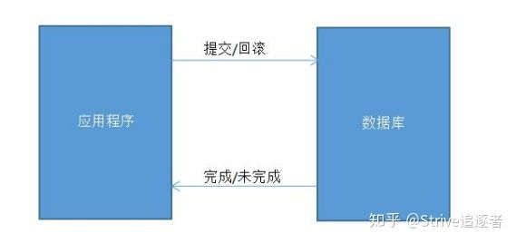

```text
如果在程序中开启了事务，那么在应用程序发出提交/回滚请求后，数据库执行操作，而后将成功/失败返回给应用程序，程序继续执行。 
一阶段提交协议相对简单。优点也很直观，它不用再与其他的对象交互，节省了判断步骤和时间，所以在性能上是在阶段提交协议中最好的。
但缺点也很明显：
数据库确认执行事务的时间较长，出问题的可能性就随之增大。如果有多个数据源，一阶段提交协议无法协调他们之间的关系。 
```

### **XA 协议的二阶段提交：**

在一阶段协议的基础上，有了二阶段协议，二阶段协议的好处是添加了一个管理者角色。

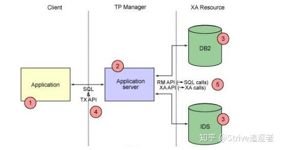

很明显，二阶段协议通过将两层变为三层，增加了中间的管理者角色，从而协调多个数据源之间的关系，二阶段提交协议分为两个阶段。

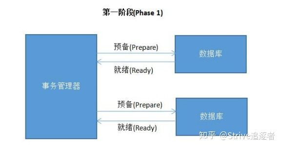

```text
应用程序调用了事务管理器的提交方法，此后第一阶段分为两个步骤： 
事务管理器通知参与该事务的各个资源管理器，通知他们开始准备事务。 
资源管理器接收到消息后开始准备阶段，写好事务日志并执行事务，但不提交，然后将是否就绪的消息返回给事务管理器（此时已经将事务的大部分事情做完，以后的内容耗时极 
小）。
```

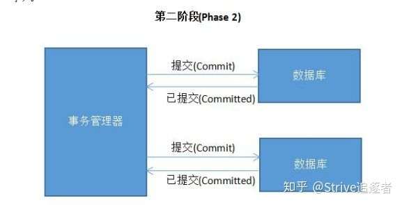

**第二阶段也分为两个步骤：**

事务管理器在接受各个消息后，开始分析，如果有任意其一失败，则发送回滚命令，否则发送提交命令。

各个资源管理器接收到命令后，执行（耗时很少），并将提交消息返回给事务管理器。

事务管理器接受消息后，事务结束，应用程序继续执行。

**为什么要分两步执行？**

一是因为分两步，就有了事务管理器统一管理的机会，二尽可能晚地提交事务，让事务在提交前尽可能地完成所有能完成的工作，这样，最后的提交阶

段将是耗时极短，耗时极短意味着操作失败的可能性也就降低。

同时，二阶段提交协议为了保证事务的一致性，不管是事务管理器还是各个资源管理器，每执行一步操作，都会记录日志，为出现故障后的恢复准备依据。

**缺点：**

**1、**二阶段提交协议的存在的弊端是阻塞，因为事务管理器要收集各个资源管理器的响应消息，如果其中一个或多个一直不返回消息，则事务管理器一直等待，应用程序也被阻塞， 甚至可能永久阻塞。

**2、**两阶段提交理论的一个广泛工业应用是 XA 协议。

目前几乎所有收费的商业数据库都 支持 XA 协议。XA 协议已在业界成熟运行数十年，但目前它在互联网海量流量的应用场景中，吞吐量这个瓶颈变得十分致命，因此很少被用到。

MySQL 提供的XA实现（[https://dev.mysql.com/doc/refman/5.7/en/xa.html](https://link.zhihu.com/?target=https%3A//dev.mysql.com/doc/refman/5.7/en/xa.html) ）

XA模式下的 开源框架有atomikos，其开发公司也有商业版本。
XA模式缺点：事务粒度大。高并发下，系统可用性低。因此很少使用。

## seata模式AT

> 待解决：不知所谓

AT 模式是一种无侵入的分布式事务解决方案。
阿里seata框架，实现了该模式。

在 AT 模式下，用户只需关注自己的“业务 SQL”，用户的 “业务 SQL” 作为一阶段，Seata 框架会自动生成事务的二阶段提交和回滚操作。

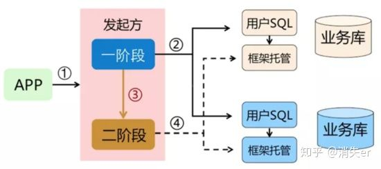

AT 模式如何做到对业务的无侵入 ：

- 一阶段：
  在一阶段，Seata 会拦截“业务 SQL”，首先解析 SQL 语义，找到“业务 SQL”要更新的业务数据，在业务数据被更新前，将其保存成“before image”，然后执行“业务 SQL”更新业务数据，在业务数据更新之后，再将其保存成“after image”，最后生成行锁。以上操作全部在一个数据库事务内完成，这样保证了一阶段操作的原子性。


- 二阶段提交：
  二阶段如果是提交的话，因为“业务 SQL”在一阶段已经提交至数据库， 所以 Seata 框架只需将一阶段保存的快照数据和行锁删掉，完成数据清理即可。

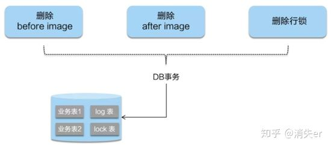

- 二阶段回滚：
  二阶段如果是回滚的话，Seata 就需要回滚一阶段已经执行的“业务 SQL”，还原业务数据。回滚方式便是用“before image”还原业务数据；但在还原前要首先要校验脏写，对比“数据库当前业务数据”和 “after image”，如果两份数据完全一致就说明没有脏写，可以还原业务数据，如果不一致就说明有脏写，出现脏写就需要转人工处理。

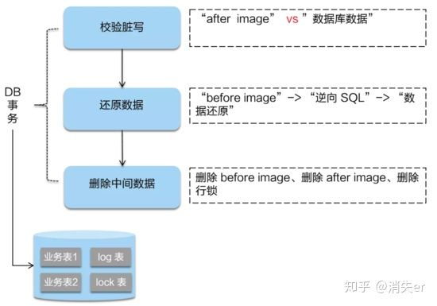

AT 模式的一阶段、二阶段提交和回滚均由 Seata 框架自动生成，用户只需编写“业务 SQL”，便能轻松接入分布式事务，AT 模式是一种对业务无任何侵入的分布式事务解决方案。

## TCC

md文件

## 消息队列最终实现一致

### 介绍

- **介绍**

  将分布式事务拆分成多个本地事务来完成，并且由消息队列异步协调完成  

- **优点** 

  由MQ按异步的方式协调完成事务，性能较高。
  不用实现try/confirm/cancel接口，开发成本比TCC低。

- **缺点**

  - 此方式基于关系数据库本地事务来实现，会出现频繁读写数据库记录，浪费数据库资源，另外对于高并发操作不是最佳方案。  
  - 如果是集群式部署，那么还需要协调重复写的问题

- **下单减少库存  ：例子**

  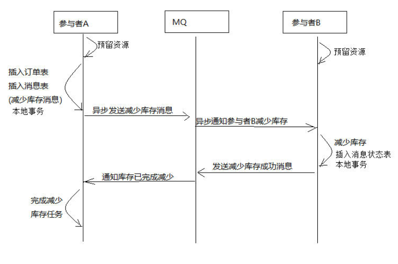

  1. 订单服务和库存服务完成检查和预留资源。
  2. 订单服务在本地事务中完成添加订单表记录和添加“减少库存任务消息”。
  3. 由定时任务根据消息表的记录发送给MQ通知库存服务执行减库存操作。
  4. 库存服务执行减少库存，并且记录执行消息状态（为避免重复执行消息，在执行减库存之前查询是否执行过此消息）。
  5. 库存服务向MQ发送完成减少库存的消息。
  6. 订单服务接收到完成库存减少的消息后删除原来添加的“减少库存任务消息”。

  实现最终事务一致要求：预留资源成功理论上要求正式执行成功，如果执行失败会进行重试，要求业务执行方法实现幂等。  

  > 待解决：预留资源是什么意思，怎么预留，直接扣减不就行了吗，sql中字段大于1不久成功了？wtf

### 例子

学成在线的例子

#### 场景

用户支付完成会将支付状态及订单状态保存在订单数据库中，由订单服务去维护订单数据库。
学生选课信息在学习中心数据库，由学习服务去维护学习中心数据库的信息  

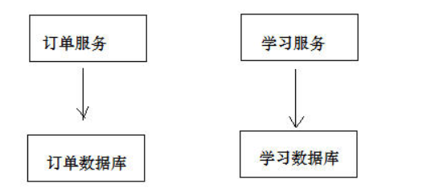

如何实现两个分布式服务（订单服务、学习服务）共同完成一件事即订单支付成功自动添加学生选课的需求，这里的关键是如何保证两个分布式服务的事务的一致性。

尝试解决上边的需求，在订单服务中远程调用选课接口，伪代码如下：  

```java
//当然这里直接用事务简单粗暴、漏洞百出
订单支付结果通知方法｛
	更新支付表中支付状态为“成功”。
	远程调用选课接口添加选课记录。
｝
```

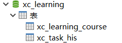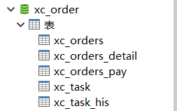

#### 解决方案

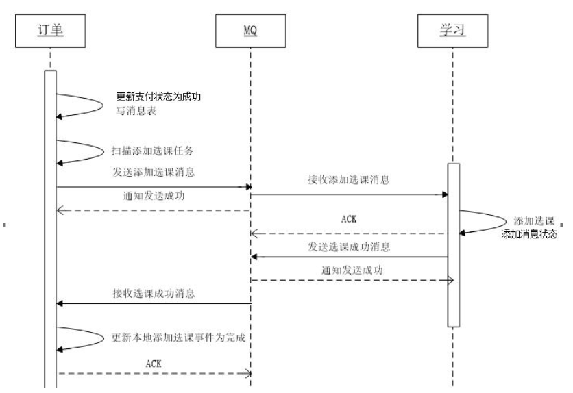

1. **order :** 支付成功后，订单服务向本地数据库更新订单状态并向消息表写入“添加选课消息”，通过本地数据库保证订单状态和添加选课消息的事务。**实际上直接利用数据库现场的选课任务** 。

2. **order :** 定时任务扫描消息表，取出“添加选课任务“并发向MQ。**这里需要异步，而且集群，实现幂等**

   - 每隔1分钟扫描一次任务表。
   - 定时任务扫描task表，一次取出多个任务，取出超过1分钟未处理的任务
   - 考虑订单服务可能集群部署，为避免重复发送任务使用**乐观锁**的方式每次从任务列表取出要处理的任务
   - 任务发送完毕更新任务发送时间

   ```
   需要配置RabbitMQ，异步定时任务
   ```

3. **learning :** 

   - 学习服务接收到添加选课的消息，先查询本地数据库的历史消息表是否存在消息，
   - 存在则说明已经添加选课，否则向本地数据库添加选课，并向历史消息表添加选课消息。这里选课表和历史消息表在同一个数据库，通过本地事务保证。**这里也需要集群，因此需要实现幂等**

4.  **learning ：** 学习服务完成后向MQ发送“完成添加选课任务的消息”

5. **order :** 订单服务接收到完成选课的消息后删除订单数据库中消息表的“添加选课消息”，为保证后期对账将消息表的消息先添加到历史消息表再删除消息，表示此消息已经完成。

> 1、3、5都是本地事务，自然可以保证成功，挂了可以回滚。而整个消息队列会持续不断地间接性发送信息，重走整个流程，因此只需要保证幂等性就可以保证分布式事务一定完成。
>
> 集群情况下： 幂等性
>
> ​	重复发送的问题：数据库用update time字段控制间隔执行
>
> ​	唯一约束、分布式锁解决重复插入问题
>
> 同时使用乐观锁等手段降低资源消耗


#### 代码

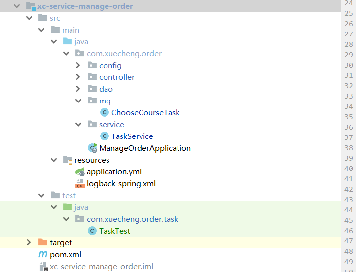

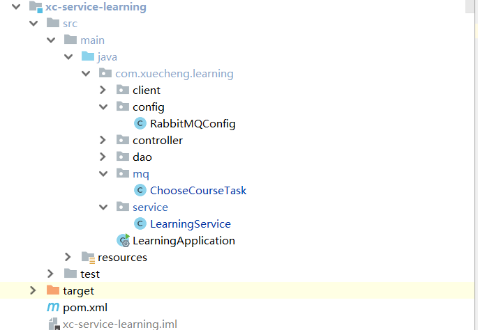

## **saga模式**

### 介绍

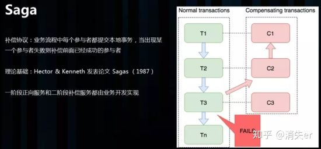

Saga 理论出自 Hector & Kenneth 1987发表的论文 Sagas。
saga模式的实现，是长事务解决方案。

Saga 是一种补偿协议，在 Saga 模式下，分布式事务内有多个参与者，每一个参与者都是一个冲正补偿服务，需要用户根据业务场景实现其正向操作和逆向回滚操作。

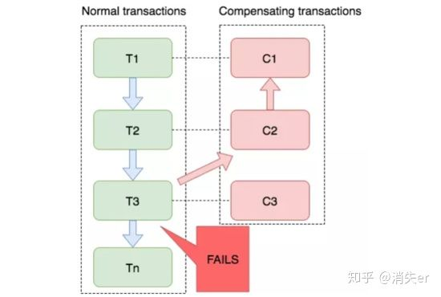

```
如图：T1~T3都是正向的业务流程，都对应着一个冲正逆向操作C1~C3
```

分布式事务执行过程中，依次执行各参与者的正向操作，如果所有正向操作均执行成功，那么分布式事务提交。如果任何一个正向操作执行失败，那么分布式事务会退回去执行前面各参与者的逆向回滚操作，回滚已提交的参与者，使分布式事务回到初始状态。

Saga 正向服务与补偿服务也需要业务开发者实现。因此是业务入侵的。

Saga 模式下分布式事务通常是由事件驱动的，各个参与者之间是异步执行的，Saga 模式是一种长事务解决方案。

### **Saga 模式使用场景**

Saga 模式适用于业务流程长且需要保证事务最终一致性的业务系统，Saga 模式一阶段就会提交本地事务，无锁、长流程情况下可以保证性能。

事务参与者可能是其它公司的服务或者是遗留系统的服务，无法进行改造和提供 TCC 要求的接口，可以使用 Saga 模式。

Saga模式的优势是：

- 一阶段提交本地数据库事务，无锁，高性能；
- 参与者可以采用事务驱动异步执行，高吞吐；
- 补偿服务即正向服务的“反向”，易于理解，易于实现；

缺点：Saga 模式由于一阶段已经提交本地数据库事务，且没有进行“预留”动作，所以不能保证隔离性。后续会讲到对于缺乏隔离性的应对措施。

与TCC实践经验相同的是，Saga 模式中，每个事务参与者的冲正、逆向操作，需要支持：

- 空补偿：逆向操作早于正向操作时；
- 防悬挂控制：空补偿后要拒绝正向操作
- 幂等

## 比较

- AT 模式是无侵入的分布式事务解决方案，适用于不希望对业务进行改造的场景，几乎0学习成本。
- TCC 模式是高性能分布式事务解决方案，适用于核心系统等对性能有很高要求的场景。时效也很好
- Saga 模式是长事务解决方案，适用于业务流程长且需要保证事务最终一致性的业务系统，Saga 模式一阶段就会提交本地事务，无锁，长流程情况下可以保证性能，多用于渠道层、集成层业务系统。事务参与者可能是其它公司的服务或者是遗留系统的服务，无法进行改造和提供 TCC 要求的接口，也可以使用 Saga 模式。
- XA模式是分布式强一致性的解决方案，但性能低而使用较少。
- 消息队列：异步简单，性能浪费、高并发有点差，弱一致性

# 如何选择分布式事务形态

> 待解决：以下没有看，因此不保证准确性
>
> http://springcloud.cn/view/413

## 各种形态的分布式事务

分布式事务有多种主流形态，包括：

- 基于消息实现的分布式事务
- 基于补偿实现的分布式事务
- 基于TCC实现的分布式事务
- 基于SAGA实现的分布式事务
- 基于2PC实现的分布式事务

这些形态的原理已经在很多文章中进行了剖析，用“分布式事务”关键字就能搜到对应的文章，本文不再赘述这些形态的原理，并将重点放在如何根据业务选择对应的分布式事务形态上。

## 何时选择单机事务？

这个相信大家都很清楚，在条件允许的情况下，我们应该尽可能地使用单机事务，因为单机事务里，无需额外协调其他数据源，减少了网络交互时间消耗以及协调时所需的存储IO消耗，在修改等量业务数据的情况下，单机事务将会有更高的性能。

但单机数据库由于 业务逻辑解耦等因素进行了数据库垂直拆分、或者由于单机数据库性能压力等因素进行了数据库水平拆分之后，数据分布于多个数据库，这时若需要对多个数据库的数据进行协调变更，则需要引入分布式事务。

分布式事务的模式有很多种，那究竟要怎么选择适合业务的模式呢？以下我们将从使用场景、性能、开发成本这几个方面进行分析。

## 何时选择基于消息实现的事务？

基于消息实现的事务适用于分布式事务的提交或回滚只取决于事务发起方的业务需求，其他数据源的数据变更跟随发起方进行的业务场景。

举个例子，假设存在业务规则：某笔订单成功后，为用户加一定的积分。

在这条规则里，管理订单数据源的服务为事务发起方，管理积分数据源的服务为事务跟随者。

从这个过程可以看到，基于消息队列实现的事务存在以下操作：

- 订单服务创建订单，提交本地事务
- 订单服务发布一条消息
- 积分服务收到消息后加积分

我们可以看到它的整体流程是比较简单的，同时业务开发工作量也不大：

- 编写订单服务里订单创建的逻辑
- 编写积分服务里增加积分的逻辑

可以看到该事务形态过程简单，性能消耗小，发起方与跟随方之间的流量峰谷可以使用队列填平，同时业务开发工作量也基本与单机事务没有差别，都不需要编写反向的业务逻辑过程。因此基于消息队列实现的事务是我们除了单机事务外最优先考虑使用的形态。

## 何时选择利用补偿实现的事务？

但是基于消息实现的事务并不能解决所有的业务场景，例如以下场景：某笔订单完成时，同时扣掉用户的现金。

这里事务发起方是管理订单库的服务，但对整个事务是否提交并不能只由订单服务决定，因为还要确保用户有足够的钱，才能完成这笔交易，而这个信息在管理现金的服务里。这里我们可以引入基于补偿实现的事务，其流程如下：

- 创建订单数据，但暂不提交本地事务
- 订单服务发送远程调用到现金服务，以扣除对应的金额
- 上述步骤成功后提交订单库的事务

以上这个是正常成功的流程，异常流程需要回滚的话，将额外发送远程调用到现金服务以加上之前扣掉的金额。

以上流程比基于消息队列实现的事务的流程要复杂，同时开发的工作量也更多：

- 编写订单服务里创建订单的逻辑
- 编写现金服务里扣钱的逻辑
- 编写现金服务里补偿返还的逻辑

可以看到，该事务流程相对于基于消息实现的分布式事务更为复杂，需要额外开发相关的业务回滚方法，也失去了服务间流量削峰填谷的功能。但其仅仅只比基于消息的事务复杂多一点，若不能使用基于消息队列的最终一致性事务，那么可以优先考虑使用基于补偿的事务形态。

（题外话：阿里GTS也是利用补偿实现，只不过补偿代码自动生成，无需业务干预，同时接管应用数据源，禁止业务修改处于全局事务状态中的记录。）

## 何时选择利用TCC实现的事务

然而基于补偿的事务形态也并非能实现所有的需求，如以下场景：某笔订单完成时，同时扣掉用户的现金，但交易未完成，也未被取消时，不能让客户看到钱变少了。

这时我们可以引入TCC，其流程如下：

- 订单服务创建订单
- 订单服务发送远程调用到现金服务，冻结客户的现金
- 提交订单服务数据
- 订单服务发送远程调用到现金服务，扣除客户冻结的现金

以上是正常完成的流程，若为异常流程，则需要发送远程调用请求到现金服务，撤销冻结的金额。

以上流程比基于补偿实现的事务的流程要复杂，同时开发的工作量也更多：

- 订单服务编写创建订单的逻辑
- 现金服务编写冻结现金的逻辑
- 现金服务编写扣除现金的逻辑
- 现金服务编写解冻现金的逻辑

TCC实际上是最为复杂的一种情况，其能处理所有的业务场景，但无论出于性能上的考虑，还是开发复杂度上的考虑，都应该尽量避免该类事务。

## 何时选择利用SAGA实现的事务？

SAGA可以看做一个异步的、利用队列实现的补偿事务。

其适用于无需马上返回业务发起方最终状态的场景，例如：你的请求已提交，请稍后查询或留意通知 之类。

将上述补偿事务的场景用SAGA改写，其流程如下：

- 订单服务创建最终状态未知的订单记录，并提交事务
- 现金服务扣除所需的金额，并提交事务
- 订单服务更新订单状态为成功，并提交事务

以上为成功的流程，若现金服务扣除金额失败，那么，最后一步订单服务将会更新订单状态为失败。

其业务编码工作量比补偿事务多一点，包括以下内容：

- 订单服务创建初始订单的逻辑
- 订单服务确认订单成功的逻辑
- 订单服务确认订单失败的逻辑
- 现金服务扣除现金的逻辑
- 现金服务补偿返回现金的逻辑

但其相对于补偿事务形态有性能上的优势，所有的本地子事务执行过程中，都无需等待其调用的子事务执行，减少了加锁的时间，这在事务流程较多较长的业务中性能优势更为明显。同时，其利用队列进行进行通讯，具有削峰填谷的作用。

因此该形式适用于不需要同步返回发起方执行最终结果、可以进行补偿、对性能要求较高、不介意额外编码的业务场景。

但当然SAGA也可以进行稍微改造，变成与TCC类似、可以进行资源预留的形态。

## 2PC事务

其适用于参与者较少，单个本地事务执行时间较少，并且参与者自身可用性很高的场景，否则，其很可能导致性能下降严重。

## 并非一种事务形态就能打遍天下

通过分析我们可以发现，并不存在一种事务形态能解决所有的问题，我们需要根据特定的业务场景选择合适的事务形态。甚至于有时需要混合多种事务形态才能更好的完成目标，如 上面提到的 订单、积分、钱包混合的场景：订单的成功与否需要依赖于钱包的余额，但不依赖于积分的多少，因此可以混合基于消息的事务形态以加积分 及 基于补偿的事务形态以确保扣钱成功，从而得到一个性能更好，编码量更少的形态。

然而目前很多框架都专注于某单一方面的事务形态，如TCC单独一个框架，可靠消息单独一个框架，SAGA单独一个框架，他们各自独立，容易导致以下问题：

- 由于前期只采用了其中一种类型事务的框架，因为工具目前只有锤子，引入其他工具又涉及测试、阅读代码等过程，因此把所有问题都看做钉子，导致性能偏低或者实现不够优雅
- 由于不同框架管理事务的形态可能不一致，导致不能很好的协调工作，如某一个TCC框架和另一个基于消息的事务框架无法很好融合。

# 框架

**收费**

- 全局事务服务GTS（收费，我试了一下5TPS下可以免费使用）（链接：[全局事务服务_GTS_分布式数据库事务_多库事务_消息事务解决方案 - 阿里云](https://link.zhihu.com/?target=https%3A//www.aliyun.com/aliware/txc%3Fspm%3Da2c4g.11174283.2.1.6eea735dFowkDU)）
- 蚂蚁金服分布式事务DTX（收费）（链接：[蚂蚁金服金融科技 - DTX](https://link.zhihu.com/?target=https%3A//tech.antfin.com/products/DTX)）

**开源**

**[github tcc主题](https://github.com/topics/tcc)**

- [changmingxie/tcc-transaction](https://link.zhihu.com/?target=https%3A//github.com/changmingxie/tcc-transaction)（免费）

- [seata ](https://github.com/seata)/ [seata](https://github.com/seata/seata)：最高star14.3k
- [Dromara ](https://github.com/Dromara)/ [hmily](https://github.com/Dromara/hmily)  高性能异步分布式事务TCC框架
- [spring-cloud-rest-tcc](https://github.com/prontera/spring-cloud-rest-tcc)  以Spring Cloud Netflix作为服务治理基础, 展示基于tcc思想所实现的分布式事务解决方案
- [liuyangming/ByteTCC](https://link.zhihu.com/?target=https%3A//github.com/liuyangming/ByteTCC)（免费，后起之秀，文档齐全）
-  [QNJR-GROUP ](https://github.com/QNJR-GROUP)/ [EasyTransaction](https://github.com/QNJR-GROUP/EasyTransaction)  A distribute transaction solution（分布式事务） unified the usage of TCC , SAGA ,FMT (seata/fescar AutoCompensation)， reliable message, compensate and so on;

# 参考文献

[Java 分布式事务规范 JTA 从入门到精通](https://blog.csdn.net/zzuhkp/article/details/124672647)

[[分布式]：Java中的事务——JDBC事务和JTA事务](https://blog.csdn.net/w372426096/article/details/80449739)

