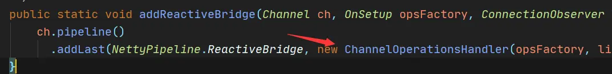
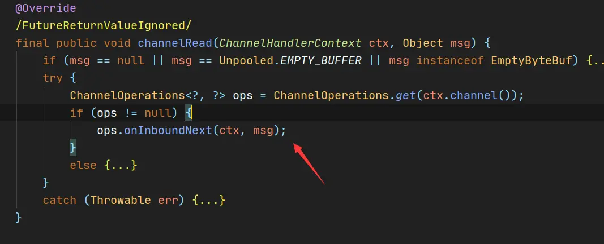
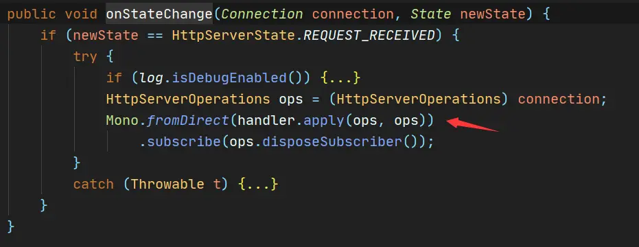
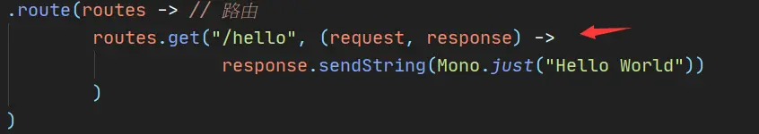
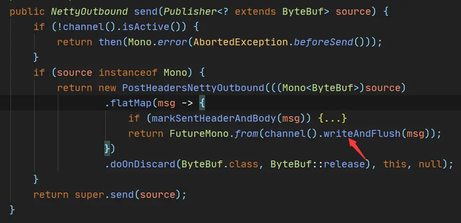
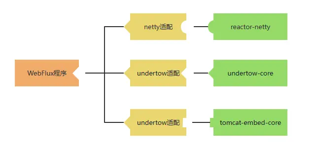

# 响应式编程之Reactor-Netty


[pq217](https://www.jianshu.com/u/14294ca8b186)关注IP属地: 四川

0.3322023.02.25 08:53:56字数 1,324阅读 4,552

## 前言

上文讲到使用WebFlux(spring-boot-starter-webflux)，我们的接口可以这么写

```java
@GetMapping("/user")
public Mono<String> getUser() { 
    return Mono.just("pq"); 
}
```

细想一下，而我们的接口返回了一个Mono/Flux的发布器，而接口调用后的结果确实订阅了这个发布器之后推送的结果：“pq”, 很显然是WebFlux帮我们进行了订阅，并把订阅的结果返回给响应流中

那么WebFlux到底是如何做的呐？今天就以这个问题为出发点研究一下WebFlux的源码

## Reactor Netty

WebFlux可以像Spring MVC运行在Tomcat上，同时也可以运行在非Servlet的服务例如Netty上

一般情况下我们使用SpringBoot不需要考虑这些事情，只需引入`spring-boot-starter-webflu`即可，而此时默认WebFlux就是运行在Netty之上的，很显然作为一个响应式的服务使用Netty更加合理，因为Netty本来就是一个非阻塞的异步网络通讯框架

spring-boot-starter-webflu依赖中，内部包含一个依赖：`reactor-netty`，这个东西的就是Reactor及Netty的结合，使用它你可以快速搭建一个响应式版http服务(也支持websocket，tcp，udp)，新建一个项目试一下，代码如下

```xml
<dependency>
    <groupId>io.projectreactor.netty</groupId>
    <artifactId>reactor-netty</artifactId>
    <version>0.9.10.RELEASE</version>
</dependency>
public class ReactorNettyApplication {
    public static void main(String[] args) {
        DisposableServer server =
                HttpServer.create() // 创建http服务
                        .port(7892) // 绑定端口
                        .route(routes -> // 路由
                                routes.get("/hello", (request, response) -> {
                                        return response.sendString(Mono.just("Hello World"));
                                        }
                                )
                        )
                        .bindNow();
        server.onDispose()
                .block();
    }
}
```

访问一下


Hello

是不是很有Tomcat的感觉，我们的接口返回的就是Mono对象，而前端展示的是订阅后的数据“Hello World”，此时再看看我们要研究的课题，会发现实际上并不是WebFlux解决的，而是Reactor Netty解决的

那问题来了，WebFlux可以运行在Tomcat，Jetty，Netty，Undertow等，那么如果用的不是Netty，自然也不会引入Reactor Netty依赖，那么这个课题谁来解决？

实际上，在这个问题的角度，WebFlux相当于只是制定了规范，而Reactor Netty是使用Netty作为服务时的一种实现，其他的服务自然有对应的实现

那么我们就看看Reactor Netty是如和把Mono对象的发布内容返回给响应的，其实想一想很简单，不过就是订阅一下，并在回调中把数据写回个客户端的Channel，但我还是想看看代码到底怎么具体写的

以下源码讲解需要对Netty非常熟悉，想深入可以参照下[netty源码](https://www.jianshu.com/p/b76c974397fe)，但这篇文章是讲源码，这里只要会用就可以了

首先reactor-netty在启动netty服务时，定制了一个Handler，即`ChannelOperationsHandler`




ChannelOperationsHandler

ChannelOperationsHandler在接收到请求时，会执行到ChannelOperations的`onInboundNext`方法




channelRead

该方法最终会走向HttpServerHandle下的`onStateChange`监听方法




HttpServerHandle.onStateChange

onStateChange方法中开始执行`hander.apply(ops, ops)`，并开始订阅，此时发布者开始发布

这个`hander.apply`就是根据路由执行我们的用户代码，即路径“/hello”绑定的方法




/hello

再看一下我们的代码执行了`response.sendString`，这个方法最终会走向`send`方法，看看send方法里做了什么




send

使用flatMap加入了一个中间处理，而处理的方式就是`channel().writeAndFlush(msg)`，此时当发布者发布数据时，就会回调执行`writeAndFlush`，即**将结果写回响应**，一次http请求就完成了！

## Spring WebFlux

说了这么久reactor-netty，活都让它干了，那么WebFlux干了什么呐又？

使用reactor-netty我们的服务就是运行在netty之上，而WebFlux提供了一个统一的响应式web开发框架，让基于WebFlux响应式程序可以自由运行在netty，tomcat，jetty，Undertow之上

如果这句话不好理解，可以类比一下Java语言，Java语言之所以可以跨平台(运行在windows，linux)之上，是因为java可以再不同的平台上通过jvm适配为不同的、适应该平台的语言，我们写一份代码，就可以让其运行在windows，linux...上，这就是为什么java被称为高级语言

同理，WebFlux可以称作响应式的高级框架，使用WebFlux开发程序，只要写一份，就可以让它运行在netty，tomcat，jetty，Undertow...上，这是因为我们相当于只写了一个服务的抽象，而底层WebFlux内部有不同的适配器去适配不同的实现，比如

- 如果想运行在netty上，WebFlux提供`ReactorHttpHandlerAdapter`适配器，将我们的代码适配到`reactor-netty`的实现
- 如果想运行在Tomcat上，同样的代码，WebFlux提供`TomcatHttpHandlerAdapter`适配器，将我们的代码适配`tomcat-embed-core`的实现




image.png

同时，WebFlux是Spring开发的，所以框架的使用我们可以沿用原来的@Controller、@GetMapping等注解，让我们用最熟悉的方式来写响应式代码。

WebFlux也是响应式Web开发的一个基础框架，背后对应的是响应式生态，是一整套响应式开发的解决方案