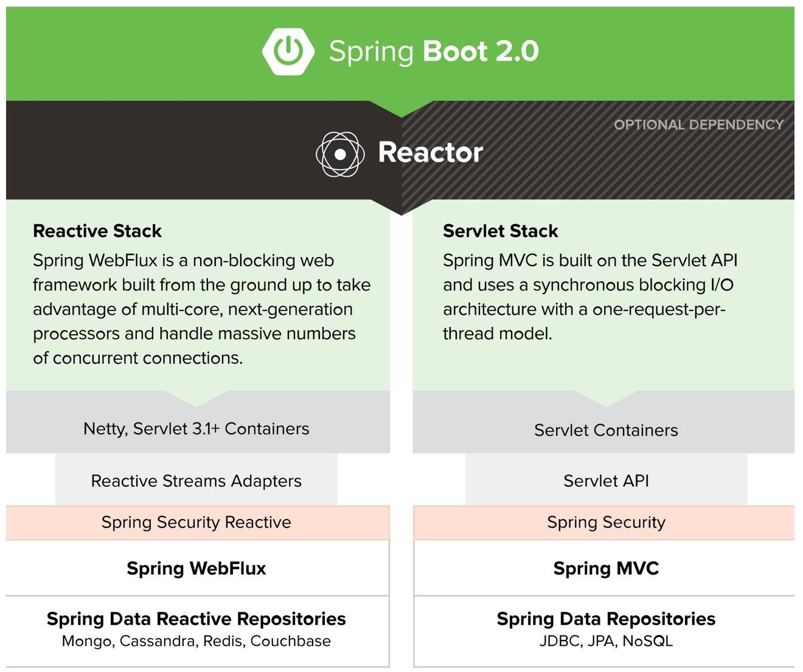

# Spring WebFlux 2小时快速入门

Spring 5 之使用Spring WebFlux开发响应式应用。

1. [lambda与函数式](http://blog.csdn.net/get_set/article/details/79480121)（15min）
2. [Reactor 3 响应式编程库](http://blog.csdn.net/get_set/article/details/79480172)（60min）
3. [Spring Webflux和Spring Data Reactive](http://blog.csdn.net/get_set/article/details/79480233)开发响应式应用（45min）

通过以上内容相信可以对Spring 5.0 推出的响应式开发有了初步的体会。如果希望有更加深入的了解，欢迎阅读下边的系列文章——

# 响应式Spring的道法术器

这个系列的文章是为了记录下自己学习Spring响应式编程的所得，也希望能够帮助到更多的朋友。

原谅我标题党了，希望能从道、法、术、器四个层面尽量全面地学习和介绍关于Spring响应式编程的方方面面。

**【道】响应式编程的概念、原则、特性与方法**

- **1.1 什么是响应式编程**：响应式编程=数据流+变化传递+声明式；
- **1.2 响应式流**：响应式流的异步非阻塞和回压（也有翻译为“背压”、“负压”的）特性，分析与多线程并发方案以及基于回调和CompletableFuture的异步开发方式的不同；
- **1.3 Hello,reactive world**，通过实例学习用[lambda](http://blog.csdn.net/get_set/article/details/79480121)、[Reactor 3](http://blog.csdn.net/get_set/article/details/79480172)、[Spring Webflux和Spring Data Reactive](http://blog.csdn.net/get_set/article/details/79480233)开发响应式应用的方法和技巧；
- **1.4 异步非阻塞有多给力**，使用gatling[对基于Spring Webmvc和Spring Webflux的Web应用进行负载测试](http://blog.csdn.net/get_set/article/details/79492439)，顺便测试[Spring WebClient与RestTemplate的性能](http://blog.csdn.net/get_set/article/details/79506373)，然后使用YCSB[对MongoDB的同步和异步驱动进行负载测试](http://blog.csdn.net/get_set/article/details/79506591)，通过测试数据分析异步非阻塞的性能优势；
- **1.5 响应式系统**，介绍响应式宣言，以及响应式编程和响应式系统的关系。

**【法】系统介绍响应式编程库的使用与原理**

- **2.1 照虎画猫深入理解响应式流规范**，介绍响应式流规范及响应式开发核心接口，通过自己动手编写响应式开发库，了解内部实现机制，是理解本章后续内容的基础，重要。
- **2.2 自定义数据流**，在Reactor 3中如何通过`generate`和`create`等方法生成自定义的数据流，是命令式编程与响应式编程的桥梁。
- **2.3 Reactor的backpressure（背压/回压）策略**，介绍Reactor3中的几种回压策略，及其在生成和消费数据流的时候如何起作用。
- **2.4 Reactor调度器与线程模型**，从原理角度分析Reactor 3的调度器以及`subscribeOn`和`publishOn`的作用原理，最后介绍用于并行执行的`ParallelFlux`。
- **2.5 Reactor 3 operators**，Reactor 3提供了丰富的操作符，介绍[如何选择合适的操作符](http://blog.csdn.net/get_set/article/details/79610895)，以及如何进行操作符的打包。
- **2.6 测试**，介绍使用`StepVerifier`、`PublisherProbe`和`TestPublisher`三种工具进行自动化测试的方法。
- **2.7 调试**，介绍基于hook的全局调试模式、基于`checkpoint()`的局部调试模式的调试方法，以及之前用过的`log()`操作符观察内部执行情况。
- **2.8 Hot vs Cold**，介绍使用Reactor 3 操作“热序列”的方法。
- **2.9 Processor**，介绍了Reactor内置的几种Processor实现。
- **2.10 操作符熔合**，介绍了基于操作符熔合进行响应式编程库性能优化的思路。

**【术】响应式关键技术与底层机制**
预告：看网上关于Actor/Reactor/Preactor模型、异步I/O的内容很详细也很棒，我就不赘述了，初步考虑直接通过**模仿reactor-netty项目**，从零编写一套基于Netty的响应式服务器和客户端，相信无论是对于我自己还是对于关注本系列文章的朋友来说，都是一次不错的提升Netty和响应式编程的尝试，也是为下一章做铺垫。这样一套基于Netty的响应式服务器和客户端工具是Spring WebFlux与Netty之间的适配层，用于将Netty的入站和出站数据进行响应式转换。

（抱歉，最近两年由于工作时间和内容的原因，后两章大概率是要鸽了，不要骂我呜呜）

**【器】实例了解Spring各种响应式组件**
系统了解Spring中支持响应式的组件，如Spring WebFlux、Spring Data Reactive、Spring Security Reactive，以及使用Spring Boot 2和Spring Cloud构建响应式系统的方法。

（抱歉，最近两年由于工作时间和内容的原因，后两章大概率是要鸽了，不要骂我呜呜）

> 相关源码见：https://github.com/get-set/get-reactive。
> Reactor3 Reference Guide参考文档中文版（跟随版本更新）：http://blog.csdn.net/get_set/article/details/79471861。

------

2017年9月，Spring Framework 5发布了其GA版本，这是自2013年12月以来的又一个大版本升级。除了一些人们期待已久的改进，最令人兴奋的新特性是它提供了完整的端到端响应式编程的支持。这是一种不同于Servlet的全新的编程范式和技术栈，它基于异步非阻塞的特性，能够借助EventLoop以少量线程应对高并发的访问，对微服务架构也颇有助益。不夸张的说，Spring 5使得Java世界拥有了Node.js那样骨骼惊奇的神器。

2018年3月1号，Spring Boot 2.0如约发布，也是一个大版本升级。

从这个图就可以看出对支持Spring 5的Spring Boot 2.0来说，新加入的响应式技术栈是其主打核心特性。具体来说，Spring Boot 2支持的响应式技术栈包括如下：

- Spring Framework 5提供的非阻塞web框架Spring Webflux；
- 遵循响应式流规范的兄弟项目Reactor；
- 支持异步I/O的Netty、Undertow等框架，以及基于Servlet 3.1+的容器（如Tomcat 8.0.23+和Jetty 9.0.4+）；
- 支持响应式的数据访问Spring Data Reactive Repositories；
- 支持响应式的安全访问控制Spring Security Reactive；
- 等。