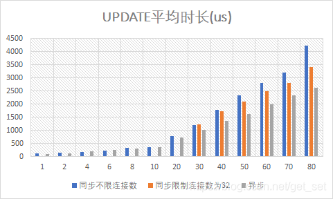

## 1.5 响应式系统

### 1.5.1 响应式宣言

关注“响应式”的朋友不难搜索到关于“响应式宣言”的介绍，先上图：

这张图凝聚了许多大神的智慧和经验，见[官网](https://www.reactivemanifesto.org/)，[中文版官网](https://www.reactivemanifesto.org/zh-CN)，如果你认可这个宣言的内容，还可以签下你的大名。虽然这些内容多概念而少实战，让人感觉是看教科书，但是字字千金，不时看一看都会有新的体会和收获。

这也是新时代男朋友的行为准则：

- Responsive，要及时响应，24小时在线，不准不接电话，微信回复时间要在5分钟以内；
- 如何做到Responsive呢，首先要Resilient，就是无论如何要有回应。即使在玩LOL，也要接电话，哪怕正在联合国演讲，那么也要设置好“对不起宝贝儿，稍后打给你么么哒~”的自动回复；
- 做到Responsive的另一点是Elastic，要弹性应对大量命令的到来。当奉天承运的圣旨过多时完不成怎么办？对不起，不存在的，如果学不会三头六臂，那就拉几个好友帮忙；
- 圣旨是通过异步方式传递的（Message Driven），给花店打电话订花、到蛋糕店订蛋糕等，别忘了购物车里的“消息队列”要及时处理喽~ 这些订单都是具有一定格式和目的地的**消息**，然后异步等待快递上门。

以响应式系统方式构建的系统更加灵活，松耦合和可扩展。这使得它们更容易开发，而且更加拥抱变化。及时地响应，以保证良好的用户体验。系统错误和异常在所难免，当异常出现时，要优雅地处理之，不要任其蔓延、甚至到达用户眼前。

关于宣言的具体内容官网上很详细，就不多赘述了。

从落地方面，我们不难想到一些具体技术来支撑响应式宣言的目标：

- 比如如今比较火热的云原生和DevOps的理念与实践，以及更早一些的自动化运维，都有助于让系统更加Elastic，不过系统架构的微服务化也是功不可没；
- 类似于Hystrix的熔断器（Circuit Breaker）使得系统更加Resilient，因为它能够及时将服务异常遏制在可控范围内，避免雪崩；而类似kubernetes的云原生应用能够及时发现和重建系统中的异常服务；
- 而类似RabbitMQ、ActiveMQ这样的消息队列产品有助于构建消息驱动的系统，并发挥解耦、提速、广播、削峰的作用；
- 消息驱动有利于系统的弹性和可靠性，弹性和可靠性又使得系统的响应更加及时；
- 等等。

### 1.5.2 响应式编程与响应式系统

响应式宣言是一组架构与设计原则，符合这些原则的系统可以认为是响应式的系统。而响应式系统与响应式编程是不同层面的内容。

看到网上有些文章在介绍RxJava、Reactor等响应式编程技术的时候，会用响应式宣言来引出话题，稍微有点驴唇对马嘴的感觉（_）。响应式系统（或响应式宣言）与响应式编程又是一对容易被揉在一起用的两个术语（上一对容易被混用的术语是“响应式编程RP”和“函数响应式编程FRP”，见[1.3.1 lambda与函数式](http://blog.51cto.com/liukang/2090187)），它们从关系上看虽然不如“雷锋”和“雷峰塔”、Java和JavaScript那么远，但并不存在必然的因果关系。

作为《响应式宣言》的作者，Jonas Bonér和Viktor Klang解释了[响应式编程与响应式系统的区别与联系](https://www.oreilly.com/ideas/reactive-programming-vs-reactive-systems)（“Linux中国”上有[翻译版](https://linux.cn/article-8773-1.html)），其中也有对响应式宣言四个原则的解读，值得学习。我从中总结了一些二者的不同点：

**1）战术与战略的区别**

响应式编程是异步编程下的一个子集，是一种范式，有具体的开发库，侧重于由信息/数据流而不是命令式的控制流来推动逻辑的前进。

响应式宣言是一组设计原则，一种关于分布式环境下系统架构与设计的思考方式，响应式系统是符合这一架构风格的系统。

**2）事件驱动与消息驱动的区别**

响应式编程——专注于短时间的数据流链条上的计算——因此倾向于事件驱动；而响应式系统——关注于通过分布式系统的通信和协作所得到的弹性和可靠性——则是消息驱动的。

响应式宣言中从定义上阐述了[消息驱动与事件驱动的不同](https://www.reactivemanifesto.org/zh-CN/glossary#Message-Driven)：

> 一条消息就是一则被送往一个明确目的地的数据。一个事件则是达到某个给定状态的组件发出的一个信号。在一个消息驱动系统中，可寻址到的接收者等待消息的到来然后响应它，否则保持休眠状态。在一个事件驱动系统中，通知的监听者被绑定到消息源上，这样当消息被发出时它就会被调用。这意味着一个事件驱动系统专注于可寻址的事件源而消息驱动系统专注于可寻址的接收者。

**3）组件范围与系统范围的区别**

响应式编程的“活动范围”是在组件内的，是一种管理组件或服务内部逻辑和数据流的技术，即使像1.4.2节中那样数据流从服务B向服务A的流动，也并非跨服务的消息传递，只是基于API的调用而已。

响应式系统，强调组件/服务间的信息交流，并通过响应式宣言提供了一种处理分布式系统弹性与可靠性的原则，因此是面向分布式的系统范围的。

**4）空间解耦能力的区别**

正如前边介绍到的异步调用方式那样，事件驱动的响应式编程侧重于时间上的解耦，从而在技术层面提供了一种更高性能的并发方式。然而其范围限定了它不易于实现空间上的解耦。

消息驱动的异步性使得响应式系统既能够在时间上解耦，还具有空间的解耦能力。服务间不仅可以通过消息队列实现分布式协作，还可以根据负载实现单个服务的弹性伸缩，从而实现响应式宣言中Elastic的能力。

**5）总结**

响应式编程技术通常用于在单个节点或服务中对数据流进行异步非阻塞的处理。当有多个结点时，就需要认真考量数据一致性（data consistency）、跨结点沟通（cross-node communication）、协调（coordination）、版本控制（versioning）、编排（orchestration）、错误管理（failure management）、关注与责任（concerns and responsibilities）分离等等的内容——这些都是响应式系统架构要考虑的内容。

类似的，Spring WebFlux是一种响应式编程框架，用于开发响应式应用，而Spring Cloud不仅是更是一套适应于当今云原生环境下微服务架构基础，更加接近响应式宣言的目标和响应式系统的设计原则。

不过也应该看到，也正是由于响应式宣言中对现代系统的Responsive、Resilient、Elastic和Message Driven的要求，使得对响应式编程技术的呼声越来越高，显然响应式编程技术是构建响应式系统的合适工具之一。尤其是随着面向响应式宣言的**响应式流规范（Reactive Streams Specification）**这一顶层设计的提出，类似Reactor、RxJava、Vert.x、Spring WebFlux等的响应式编程技术在响应式系统中必将发挥越来越大的作用。

关于响应式系统的话题比较大，涉及到许多的理念、技术。本系列的文章仍主要聚焦于响应式编程的范畴，并在最后讨论响应式编程在Spring Cloud中的应用。