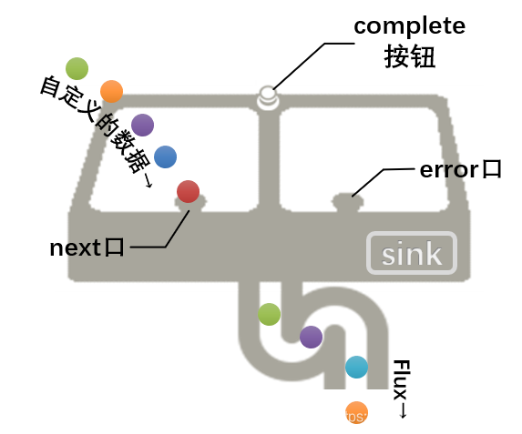
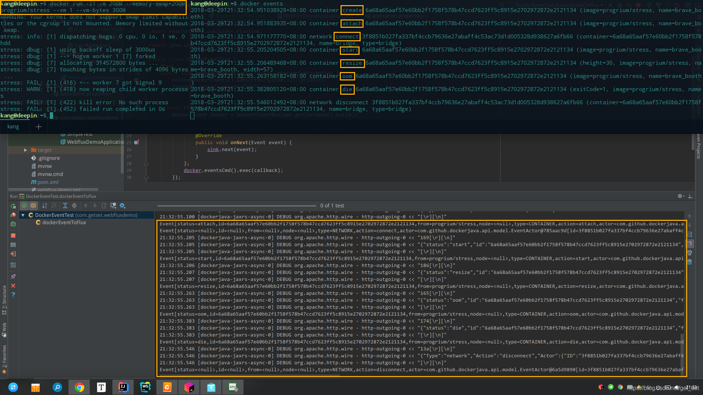

## 2.2 自定义数据流

这一小节介绍如何通过定义相应的事件（`onNext`、`onError`和`onComplete`） 创建一个 Flux 或 Mono。Reactor提供了`generate`、`create`、`push`和`handle`等方法，所有这些方法都使用 sink（池）来生成数据流。

sink，顾名思义，就是池子，可以想象一下厨房水池的样子。如下图所示：



下面介绍到的方法都有一个sink提供给方法使用者，通常至少会暴露三个方法给我们，`next`、`error`和`complete`。next和error相当于两个下水口，我们不断将自定义的数据放到next口，Reactor就会帮我们串成一个Publisher数据流，直到有一个错误数据放到error口，或按了一下`complete`按钮，数据流就会终止了。

> 本文[测试源码](https://github.com/get-set/get-reactive/blob/master/snacks/src/test/java/com/getset/Test_2_2.java)。

### 2.2.1 generate

`generate`是一种同步地，逐个地发出数据的方法。因为它提供的sink是一个`SynchronousSink`， 而且其`next()`方法在每次回调的时候最多只能被调用一次。

`generate`方法有三种签名：

```java
    public static <T> Flux<T> generate(Consumer<SynchronousSink<T>> generator)
    
    public static <T, S> Flux<T> generate(Callable<S> stateSupplier, BiFunction<S, SynchronousSink<T>, S> generator) 
    
    public static <T, S> Flux<T> generate(Callable<S> stateSupplier, BiFunction<S, SynchronousSink<T>, S> generator, Consumer<? super S> stateConsumer)
12345
```

**1）使用SynchronousSink生成数据流**

```java
    @Test
    public void testGenerate1() {
        final AtomicInteger count = new AtomicInteger(1);   // 1
        Flux.generate(sink -> {
            sink.next(count.get() + " : " + new Date());   // 2
            try {
                TimeUnit.SECONDS.sleep(1);
            } catch (InterruptedException e) {
                e.printStackTrace();
            }
            if (count.getAndIncrement() >= 5) {
                sink.complete();     // 3
            }
        }).subscribe(System.out::println);  // 4
    }
123456789101112131415
```

1. 用于计数；
2. 向“池子”放自定义的数据；
3. 告诉`generate`方法，自定义数据已发完；
4. 触发数据流。

输出结果为每1秒钟打印一下时间，共打印5次。

**2）增加一个伴随状态**

对于上边的例子来说，`count`用于记录状态，当值达到5之后就停止计数。由于在lambda内部使用，因此必须是final类型的，且不能是原生类型（如`int`）或不可变类型（如`Integer`）。

如果使用第二个方法签名，上边的例子可以这样改：

```java
    @Test
    public void testGenerate2() {
        Flux.generate(
                () -> 1,    // 1
                (count, sink) -> {      // 2
                    sink.next(count + " : " + new Date());
                    try {
                        TimeUnit.SECONDS.sleep(1);
                    } catch (InterruptedException e) {
                        e.printStackTrace();
                    }
                    if (count >= 5) {
                        sink.complete();
                    }
                    return count + 1;   // 3
                }).subscribe(System.out::println);
    }

1234567891011121314151617
```

1. 初始化状态值；
2. 第二个参数是`BiFunction`，输入为状态和sink；
3. 每次循环都要返回新的状态值给下次使用。

**3）完成后处理**

第三个方法签名除了状态、sink外，还有一个`Consumer`，这个`Consumer`在数据流发完后执行。

```java
        Flux.generate(
                () -> 1,
                (count, sink) -> {
                    sink.next(count + " : " + new Date());
                    try {
                        TimeUnit.SECONDS.sleep(1);
                    } catch (InterruptedException e) {
                        e.printStackTrace();
                    }
                    if (count >= 5) {
                        sink.complete();
                    }
                    return count + 1;
                }, System.out::println)     // 1
                .subscribe(System.out::println);
    }

12345678910111213141516
```

1. 最后将count值打印出来。

如果 state 使用了数据库连接或者其他需要进行清理的资源，这个 Consumer lambda 可以用来在最后完成资源清理任务。

### 2.2.2 create

`create`是一个更高级的创建Flux的方法，其生成数据流的方式既可以是同步的，也可以是异步的，并且还可以每次发出多个元素。

`create`用到了`FluxSink`，后者同样提供 next，error 和 complete 等方法。 与generate不同的是，create不需要状态值，另一方面，它可以在回调中触发多个事件（即使事件是发生在未来的某个时间）。

> create 常用的场景就是将现有的 API 转为响应式，比如监听器的异步方法。

先编写一个事件源：

```java
    public class MyEventSource {
    
        private List<MyEventListener> listeners;
    
        public MyEventSource() {
            this.listeners = new ArrayList<>();
        }
    
        public void register(MyEventListener listener) {    // 1
            listeners.add(listener);
        }
    
        public void newEvent(MyEvent event) {
            for (MyEventListener listener :
                    listeners) {
                listener.onNewEvent(event);     // 2
            }
        }
    
        public void eventStopped() {
            for (MyEventListener listener :
                    listeners) {
                listener.onEventStopped();      // 3
            }
        }
    
        @Data
        @NoArgsConstructor
        @AllArgsConstructor
        public static class MyEvent {   // 4
            private Date timeStemp;
            private String message;
        }
    }

12345678910111213141516171819202122232425262728293031323334
```

1. 注册监听器；
2. 向监听器发出新事件；
3. 告诉监听器事件源已停止；
4. 事件类，使用了lombok注解。

准备一个监听器接口，它可以监听上边第2和3的两种事件：（1）新的`MyEvent`到来；（2）事件源停止。如下：

```java
    public interface MyEventListener {
        void onNewEvent(MyEventSource.MyEvent event);
        void onEventStopped();
    }
1234
```

下面的测试方法逻辑是：创建一个监听器注册到事件源，这个监听器再收到事件回调的时候通过`Flux.create`的sink将一系列事件转换成异步的事件流：

```java
    @Test
    public void testCreate() throws InterruptedException {
        MyEventSource eventSource = new MyEventSource();    // 1
        Flux.create(sink -> {
                    eventSource.register(new MyEventListener() {    // 2
                        @Override
                        public void onNewEvent(MyEventSource.MyEvent event) {
                            sink.next(event);       // 3
                        }

                        @Override
                        public void onEventStopped() {
                            sink.complete();        // 4
                        }
                    });
                }
        ).subscribe(System.out::println);       // 5

        for (int i = 0; i < 20; i++) {  // 6
            Random random = new Random();
            TimeUnit.MILLISECONDS.sleep(random.nextInt(1000));
            eventSource.newEvent(new MyEventSource.MyEvent(new Date(), "Event-" + i));  
        }
        eventSource.eventStopped(); // 7
    }

12345678910111213141516171819202122232425
```

1. 事件源；
2. 向事件源注册用匿名内部类创建的监听器；
3. 监听器在收到事件回调的时候通过sink将事件再发出；
4. 监听器再收到事件源停止的回调的时候通过sink发出完成信号；
5. 触发订阅（这时候还没有任何事件产生）；
6. 循环产生20个事件，每个间隔不超过1秒的随机时间；
7. 最后停止事件源。

运行一下这个测试方法，20个`MyEvent`陆续打印出来。

如果将上边的`create`方法换成`generate`方法，则会报出异常：

```
java.lang.IllegalStateException: The generator didn't call any of the SynchronousSink method
1
```

证明`generate`并不支持异步的方式。

`create`方法还有一个变体方法`push`，适合生成事件流。与 create`类似，`push 也可以是异步地， 并且能够使用以上各种回压策略。所以上边的例子可以替换为`push`方法。区别在于，`push`方法中，调用`next`、`complete`或`error`的必须是同一个线程。

除了`next`、`complete`或`error`方法外，`FluxSink`还有`onRequest`方法，这个方法可以用来响应下游订阅者的请求事件。从而不仅可以像上一个例子那样，上游在数据就绪的时候将其推送到下游，同时下游也可以从上游拉取已经就绪的数据。这是一种推送/拉取混合的模式。比如：

```java
    Flux<String> bridge = Flux.create(sink -> {
        myMessageProcessor.register(
          new MyMessageListener<String>() {
    
            public void onMessage(List<String> messages) {
              for(String s : messages) {
                sink.next(s);   // 1
              }
            }
        });
        sink.onRequest(n -> {   // 2
            List<String> messages = myMessageProcessor.request(n);  // 3
            for(String s : message) {
               sink.next(s); 
            }
        });
        ...
    }

123456789101112131415161718
```

1. push方式，主动向下游发出数据；
2. 在下游发出请求时被调用；
3. 响应下游的请求，查询是否有可用的message。

### 2.2.3 实战[Docker](https://so.csdn.net/so/search?q=Docker&spm=1001.2101.3001.7020)事件推送API

Docker提供了一个用来监听事件的命令：`docker events`，运行这个命令后，会监听docker daemon的事件并打印出来，执行是持续进行的，就像`top`或前边介绍的`mongostat`命令一样。Docker的java开发包的`DockerClient`也提供了相应的API，这个API是基于回调的，因此我们就可以使用Reactor的`create`方法，将这个基于回调的API转换为响应式流，流中的数据就是一个一个的docker事件。如下图所示：


**1）测试DockerClient**

首先，我们先启动docker。

然后，我们继续用第一章的[`webflux-demo`](https://github.com/get-set/get-reactive/tree/master/webflux-demo)maven项目模块，在`pom.xml`中添加Docker开发相关的依赖：

```
		<!--docker client begin-->
		<dependency>
			<groupId>com.github.docker-java</groupId>
			<artifactId>docker-java</artifactId>
			<version>3.0.14</version>
		</dependency>
		<dependency>
			<groupId>javax.ws.rs</groupId>
			<artifactId>javax.ws.rs-api</artifactId>
			<version>2.1</version>
		</dependency>
		<dependency>
			<groupId>org.glassfish.jersey.inject</groupId>
			<artifactId>jersey-hk2</artifactId>
			<version>2.26</version>
		</dependency>
		<!--docker client end-->

1234567891011121314151617
```

最后编写测试方法：

```
public class DockerEventTest {
    @Test
    public void dockerEventToFlux() throws InterruptedException {
        collectDockerEvents().subscribe(System.out::println);   // 5
        TimeUnit.MINUTES.sleep(1);  // 6
    }

    private Flux<Event> collectDockerEvents() {
        DockerClient docker = DockerClientBuilder.getInstance().build();    // 1
        return Flux.create((FluxSink<Event> sink) -> {
            EventsResultCallback callback = new EventsResultCallback() {    // 2
                @Override
                public void onNext(Event event) {   // 3
                    sink.next(event);
                }
            };
            docker.eventsCmd().exec(callback);  // 4
        });
    }
}

1234567891011121314151617181920
```

1. 创建DockerClient，默认会连接`tcp://localhost:2375`，2375是docker默认的端口号，可以通过指定的IP和端口连接docker daemon：`DockerClientBuilder.getInstance("tcp://192.168.0.123:2375").build()`，不过要注意docker daemon监听接口和防火墙的配置。
2. 自定义回调类。
3. 当有docker事件产生时，会回调`onNext`，这时候通过`FluxSink`的`next`方法将`Event`对象发出。
4. 开始对docker事件进行监听。
5. 通过订阅的方式打印出来。
6. 主线程会立刻返回，因此等待1分钟。

OK，看一下效果。

为了方便对比，我们首先在终端运行`docker events`命令，然后在另一个终端进行docker操作，比如本例：

```
docker run -it -m 200M --memort-swap=200M progrium/stress --vm 1 --vm-bytes 300M
1
```

`progrium/stress`是一个用于压力测试的容器，通过`-m 200M`指定为该容器的运行最多分配200M内存，然后在压力测试的时候，通过`--vm-bytes 300M`使其运行时尝试分配300M的内存，此时会出现内存不足（OOM）的错误并导致容器被杀死（single 9）。



如图所示，上方是分别运行两个命令的终端窗口，可以看到`docker events`命令打印出了一系列事件，如果是第一个运行`progrium/stress`应该回先有一个pull镜像的事件。下方是我们的测试代码的输出，除了一些日志之外，可以看到这些事件也被输出了。

**2）REST API推送到前端**

下面，我们更进一步将Event事件通过REST API推送到浏览器端，看过第1.3.3节的话，对这一块儿应该是轻车熟路了。

（一）首先定义一个我们自己的`DockerEvent`，这一步不是必须的哈，不过`DockerClient`返回的`Event`本身字段比较多，通常前端展示的话会转换为dvo，“戏要做足”嘛，哈哈。

DockerEvent.java

```java
@Data
@Document(collection = "docker-event")
public class DockerEvent {
    @Indexed
    private String status;
    @Id
    private String id;
    private String from;
    private Node node;
    private EventType type;
    private String action;
    private String actorId;
    private Long time;
    private Long timeNano;
}
123456789101112131415
```

（二）然后就是DAO层了，创建一个`DockerEventMongoRepository`，增加三个`@Tailable`的查询方法，分别用于查询全部、按照状态查询和按类型+名称查询（比如查询某某容器的事件）：

DockerEventMongoRepository.java

```java
public interface DockerEventMongoRepository extends ReactiveMongoRepository<DockerEvent, String> {
    @Tailable
    Flux<DockerEvent> findBy();
    
    @Tailable
    Flux<DockerEvent> findByStatus(String status);

    @Tailable
    Flux<DockerEvent> findByTypeAndFrom(String type, String from);
}
12345678910
```

（三）定义一个`CommandLineRunner`，用于在应用启动后即开始监听docker事件：

DockerEventsCollector.java

```java
@Slf4j
@Component
public class DockerEventsCollector implements CommandLineRunner {

    private DockerEventMongoRepository dockerEventMongoRepository;
    private MongoTemplate mongo;    // 1

    public DockerEventsCollector(DockerEventMongoRepository dockerEventMongoRepository, MongoTemplate mongo) {  // 1
        this.dockerEventMongoRepository = dockerEventMongoRepository;
        this.mongo= mongo;
    }

    @Override
    public void run(String... args) {

        mongo.dropCollection(DockerEvent.class);    // 2
        mongo.createCollection(DockerEvent.class, CollectionOptions.empty().maxDocuments(200).size(100000).capped()); // 2

        dockerEventMongoRepository.saveAll(collect()).subscribe();  // 6
    }

    private Flux<DockerEvent> collect() {   // 3
        DockerClient docker = DockerClientBuilder.getInstance().build();

        return Flux.create((FluxSink<Event> sink) -> {
            EventsResultCallback callback = new EventsResultCallback() {
                @Override
                public void onNext(Event event) {
                    sink.next(event);
                }
            };
            docker.eventsCmd().exec(callback);
        })
                .map(this::trans)   // 4
                .doOnNext(e -> log.info(e.toString())); // 5
    }

    private DockerEvent trans(Event event) {    // 4
        DockerEvent dockerEvent = new DockerEvent();
        dockerEvent.setAction(event.getAction());
        dockerEvent.setActorId(Objects.requireNonNull(event.getActor()).getId());
        dockerEvent.setFrom(event.getFrom() == null ? null : event.getFrom().replace("//", "_"));
        dockerEvent.setId(UUID.randomUUID().toString());
        dockerEvent.setNode(event.getNode());
        dockerEvent.setStatus(event.getStatus());
        dockerEvent.setTime(event.getTime());
        dockerEvent.setTimeNano(event.getTimeNano());
        dockerEvent.setType(event.getType());
        return dockerEvent;
    }
}

123456789101112131415161718192021222324252627282930313233343536373839404142434445464748495051
```

1. 这里使用的是`MongoTemplate`，Spring 4.3 之后，如果有构造方法，Spring会自动注入，不需要`@Autowired`注解了。
2. 每次启动应用针对`DockerEvent`创建“capped”的collection，方便测试，如果提前手动创建好的话可以不加这两句。如果在//1处使用的是响应式的`ReactiveMongoTemplate`，因为是异步的，所以要用`then()`或`thenMany()`将后续的所有操作连接起来，如`mongo.dropCollection(...).then(mongo.createCollection(...)).thenMany(dockerEventMongoRepository.saveAll(collect()))`，保证能先后依次执行。
3. 监听docker事件的方法。
4. 将返回的`Event`转换为我们定义的`DockerEvent`，其中`DockerEvent.from`字段是事件主体名称，比如容器名，可能有`/`，因此进行一个字符替换，否则在URL中会有问题。
5. 打印个日志（可选）。
6. 将收集的`DockerEvent`保存到MongoDB，用`subscribe()`触发执行。

（四）Service层没有啥逻辑，我们直接写Controller：

DockerEventController.java

```java
@Slf4j
@RestController
@RequestMapping(value = "/docker/events", produces = MediaType.APPLICATION_STREAM_JSON_VALUE)    // 1
public class DockerEventController {
    private DockerEventMongoRepository dockerEventMongoRepository;

    public DockerEventController(DockerEventMongoRepository dockerEventMongoRepository) {
        this.dockerEventMongoRepository = dockerEventMongoRepository;
    }

    @GetMapping
    public Flux<DockerEvent> dockerEventStream() {  // 2
        return dockerEventMongoRepository.findBy();
    }

    @GetMapping("/{type}/{from}")
    public Flux<DockerEvent> dockerEventStream(@PathVariable("type") String type, @PathVariable("from") String from) {    // 3
        return dockerEventMongoRepository.findByTypeAndFrom(type, from);
    }

    @GetMapping("/{status}")
    public Flux<DockerEvent> dockerEventStream(@PathVariable String status) {   // 4
        return dockerEventMongoRepository.findByStatus(status);
    }
}

12345678910111213141516171819202122232425
```

OK了，启动试一下：


可以看到，右侧的浏览器的小图标一直在旋转，表示持续接收推送中，当在终端中进行docker操作的时候，所产生的事件就立刻出现在浏览器中了。如果请求`/docker/events/oom`将只推送OOM事件，如果请求`/docker/events/container/progrium_stress`将只推送来自容器progrium/stress的事件。

> 再次提醒，当capped 的 Collection中一条数据都没有的时候，`@Tailable`的API也会立刻返回，所以需要等到数据库中有至少一条数据之后（比如先执行以下pull），再在浏览器中请求`docker/events`API。