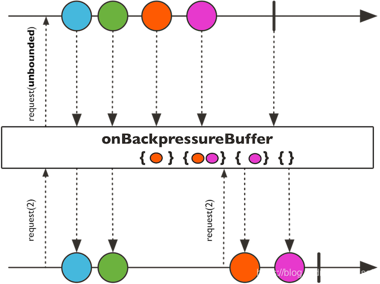
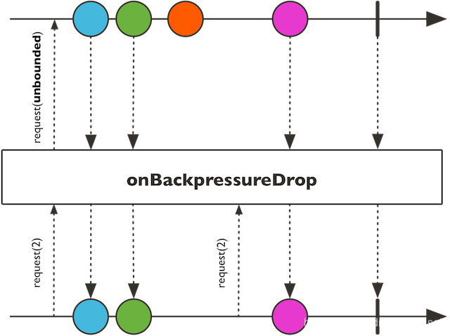
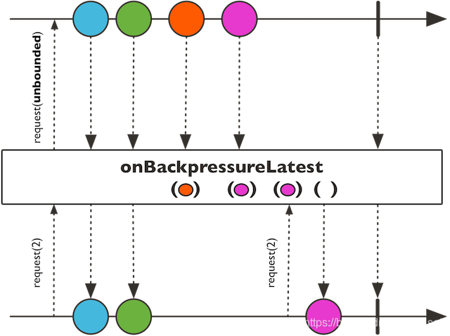
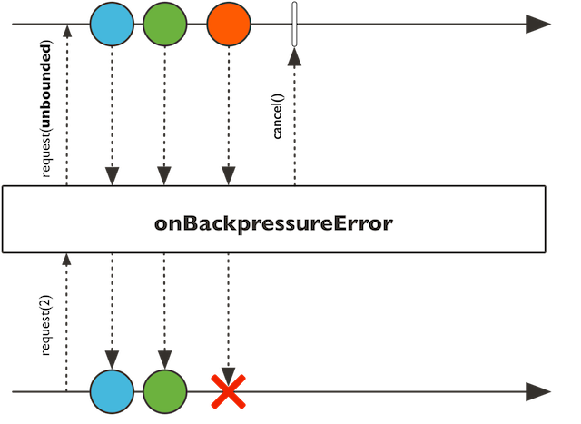

## 2.3 不同的回压策略

> 许多地方也叫做“背压”、“负压”，我在[《Reactor参考文档》](http://htmlpreview.github.io/?https://github.com/get-set/reactor-core/blob/master-zh/src/docs/index.html)中是翻译为“背压”的，后来在看到有“回压”的翻译，忽然感觉从文字上似乎更加符合。

这一节讨论回压的问题，有两个前提：

1. **发布者与订阅者不在同一个线程中**，因为在同一个线程中的话，通常使用传统的逻辑就可以，不需要进行回压处理；
2. **发布者发出数据的速度高于订阅者处理数据的速度**，也就是处于“PUSH”状态下，如果相反，那就是“PUll”状态，不需要处理回压。

> 本节[测试源码](https://github.com/get-set/get-reactive/blob/master/snacks/src/test/java/com/getset/Test_2_3.java)

### 2.3.1 回压策略

回压的处理有以下几种策略：

1. ERROR： 当下游跟不上节奏的时候发出一个错误信号。
2. DROP：当下游没有准备好接收新的元素的时候抛弃这个元素。
3. LATEST：让下游只得到上游最新的元素。
4. BUFFER：缓存下游没有来得及处理的元素（如果缓存不限大小的可能导致OutOfMemoryError）。

这几种策略定义在枚举类型`OverflowStrategy`中，不过还有一个IGNORE类型，即完全忽略下游背压请求，这可能会在下游队列积满的时候导致 IllegalStateException。

### 2.3.2 使用create声明回压策略

上一节中，用于生成数据流的方法`create`和`push`可以用于异步的场景，而且它们也支持回压，我们可以通过提供一个 OverflowStrategy 来定义背压行为。方法签名：

```java
    public static <T> Flux<T> create(Consumer<? super FluxSink<T>> emitter, OverflowStrategy backpressure) 
1
```

默认（没有第二个参数的方法）是缓存策略的，我们来试一下别的策略，比如DROP的策略。

我们继续使用2.2节的那个测试例子，下边是用`create`创建的“快的发布者”，不过方便起见拆放到两个私有方法里供调用：

```java
    public class Test_2_3 {
        /**
         * 使用create方法生成“快的发布者”。
         * @param strategy 回压策略
         * @return  Flux
         */
        private Flux<MyEventSource.MyEvent> createFlux(FluxSink.OverflowStrategy strategy) {
            return Flux.create(sink -> eventSource.register(new MyEventListener() {
                @Override
                public void onNewEvent(MyEventSource.MyEvent event) {
                    System.out.println("publish >>> " + event.getMessage());
                    sink.next(event);
                }
    
                @Override
                public void onEventStopped() {
                    sink.complete();
                }
            }), strategy);  // 1
        }
        /**
         * 生成MyEvent。
         * @param count 生成MyEvent的个数。
         * @param millis 每个MyEvent之间的时间间隔。
         */
        private void generateEvent(int times, int millis) {
            // 循环生成MyEvent，每个MyEvent间隔millis毫秒
            for (int i = 0; i < times; i++) {
                try {
                    TimeUnit.MILLISECONDS.sleep(millis);
                } catch (InterruptedException e) {
                }
                eventSource.newEvent(new MyEventSource.MyEvent(new Date(), "Event-" + i));
            }
            eventSource.eventStopped();
        }
    }

12345678910111213141516171819202122232425262728293031323334353637
```

有了“快的发布者”，下面是“慢的订阅者”，以及一些测试准备工作：

```java
    public class Test_2_3 {
        private final int EVENT_DURATION   = 10;    // 生成的事件间隔时间，单位毫秒
        private final int EVENT_COUNT      = 20;    // 生成的事件个数
        private final int PROCESS_DURATION = 30;    // 订阅者处理每个元素的时间，单位毫秒
    
        private Flux<MyEventSource.MyEvent> fastPublisher;
        private SlowSubscriber slowSubscriber;
        private MyEventSource eventSource;
        private CountDownLatch countDownLatch;
    
        /**
         * 准备工作。
         */
        @Before
        public void setup() {
            countDownLatch = new CountDownLatch(1);
            slowSubscriber = new SlowSubscriber();
            eventSource = new MyEventSource();
        }
    
        /**
         * 触发订阅，使用CountDownLatch等待订阅者处理完成。
         */
        @After
        public void subscribe() throws InterruptedException {
            fastPublisher.subscribe(slowSubscriber);
            generateEvent(EVENT_COUNT, EVENT_DURATION);
            countDownLatch.await(1, TimeUnit.MINUTES);
        }
        
        /**
         * 内部类，“慢的订阅者”。
         */
        class SlowSubscriber extends BaseSubscriber<MyEventSource.MyEvent> {
    
            @Override
            protected void hookOnSubscribe(Subscription subscription) {
                request(1);     // 订阅时请求1个数据
            }
    
            @Override
            protected void hookOnNext(MyEventSource.MyEvent event) {
                System.out.println("                      receive <<< " + event.getMessage());
                try {
                    TimeUnit.MILLISECONDS.sleep(PROCESS_DURATION);
                } catch (InterruptedException e) {
                }
                request(1);     // 每处理完1个数据，就再请求1个
            }
    
            @Override
            protected void hookOnError(Throwable throwable) {
                System.err.println("                      receive <<< " + throwable);
            }
    
            @Override
            protected void hookOnComplete() {
                countDownLatch.countDown();
            }
        }
    }

12345678910111213141516171819202122232425262728293031323334353637383940414243444546474849505152535455565758596061
```

下面是测试方法：

```java
    /**
     * 测试create方法的不同OverflowStrategy的效果。
     */
    @Test
    public void testCreateBackPressureStratety() {
        fastPublisher =
                createFlux(FluxSink.OverflowStrategy.BUFFER)    // 1
                        .doOnRequest(n -> System.out.println("         ===  request: " + n + " ==="))    // 2
                        .publishOn(Schedulers.newSingle("newSingle"), 1);   // 3
    }
12345678910
```

1. 调整不同的策略（BUFFER/DROP/LATEST/ERROR/IGNORE）观察效果，create方法默认为BUFFER；
2. 打印出每次的请求（也就是后边`.publishOn`的请求）；
3. 使用`publishOn`让后续的操作符和订阅者运行在一个单独的名为`newSingle`的线程上，第二个参数1是预取个数，也就是`.publishOn`作为订阅者每次向上游request的个数，默认为256，所以一定程度上也起到了缓存的效果，为了测试，设置为1。

> 通常情况下，发布者于订阅者并不在同一个线程上，这里使用`publishOn`来模拟这种情况。

`BUFFER`策略的输出如下（来不及处理的数据会缓存下来，这是通常情况下的默认策略）：

```
         ===  request: 1 ===
publish >>> Event-0
                      receive <<< Event-0
publish >>> Event-1
publish >>> Event-2
         ===  request: 1 ===
publish >>> Event-3
                      receive <<< Event-1
publish >>> Event-4
publish >>> Event-5
publish >>> Event-6
         ===  request: 1 ===
                      receive <<< Event-2
publish >>> Event-7
publish >>> Event-8
...

12345678910111213141516
```

`DROP`策略的输出如下（有新数据就绪的时候，看是否有request，有的话就发出，没有就丢弃）：

```
         ===  request: 1 ===
publish >>> Event-0
                      receive <<< Event-0
publish >>> Event-1
publish >>> Event-2
publish >>> Event-3
         ===  request: 1 ===
publish >>> Event-4
                      receive <<< Event-4
publish >>> Event-5
publish >>> Event-6
publish >>> Event-7
         ===  request: 1 ===
publish >>> Event-8
                      receive <<< Event-8
...

12345678910111213141516
```

可以看到，第1/2/3/5/6/7/…的数据被丢弃了，当有request之后的数据会被发出。调整一下`publishOn`方法的第二个参数（预取个数）为2，输出如下：

```
         ===  request: 2 ===
publish >>> Event-0
                      receive <<< Event-0
publish >>> Event-1
publish >>> Event-2
publish >>> Event-3
                      receive <<< Event-1
publish >>> Event-4
publish >>> Event-5
publish >>> Event-6
         ===  request: 2 ===
publish >>> Event-7
                      receive <<< Event-7
publish >>> Event-8
publish >>> Event-9
publish >>> Event-10
                      receive <<< Event-8
publish >>> Event-11
publish >>> Event-12

12345678910111213141516171819
```

可见，每次request（请求2个数据）之后的2个数据发出，更多就绪的数据由于没有request就丢弃了。

`LATEST`的输出如下（request到来的时候，将最新的数据发出）：

```
         ===  request: 1 ===
publish >>> Event-0
                      receive <<< Event-0
publish >>> Event-1
publish >>> Event-2
publish >>> Event-3
         ===  request: 1 ===
                      receive <<< Event-3
publish >>> Event-4
publish >>> Event-5
         ===  request: 1 ===
                      receive <<< Event-5
publish >>> Event-6
publish >>> Event-7
publish >>> Event-8
         ===  request: 1 ===
                      receive <<< Event-8

1234567891011121314151617
```

`ERROR`的输出如下（当订阅者来不及处理时候发出一个错误信号）：

```
         ===  request: 1 ===
publish >>> Event-0
                      receive <<< Event-0
publish >>> Event-1
publish >>> Event-2
         ===  request: 1 ===
                      receive <<< reactor.core.Exceptions$OverflowException: The receiver is overrun by more signals than expected (bounded queue...)
1234567
```

`IGNORE`的输出如下：

```
...
         ===  request: 2 ===
                      receive <<< Event-10
                      receive <<< Event-11
         ===  request: 2 ===
                      receive <<< Event-12
                      receive <<< reactor.core.Exceptions$OverflowException: Queue is full: Reactive Streams source doesn't respect backpressure
1234567
```

### 2.3.3 调整回压策略的操作符

Reactor提供了响应的`onBackpressureXxx`操作符，调整回压策略。测试方法如下：

```java
    /**
     * 测试不同的onBackpressureXxx方法的效果。
     */
    @Test
    public void testOnBackPressureXxx() {
        fastPublisher = createFlux(FluxSink.OverflowStrategy.BUFFER)
                .onBackpressureBuffer()     // BUFFER
//                .onBackpressureDrop()     // DROP
//                .onBackpressureLatest()   // LATEST
//                .onBackpressureError()    // ERROR
                .doOnRequest(n -> System.out.println("         ===  request: " + n + " ==="))
                .publishOn(Schedulers.newSingle("newSingle"), 1);
    }
12345678910111213
```

通过打开某一个操作符的注释可以观察输出。这里就不贴输出内容了，Reactor文档的示意图更加直观：

**onBackpressureBuffer**，对于来自其下游的request采取“缓存”策略。



**onBackpressureDrop**，元素就绪时，根据下游是否有未满足的request来判断是否发出当前元素。



**onBackpressureLatest**，当有新的request到来的时候，将最新的元素发出。



**onBackpressureError**，当有多余元素就绪时，发出错误信号。



真是一图胜千言啊，上边的这些图片都是来自Reactor官方文档。

当进行异步编程时，通常会面临相互协作的各个组件不在同一个线程的情况，比如一个生产者不断生成消息，而一个消费者不断处理这些产生的消息，二者通常不在一个线程甚至是两个不同的组件。当有人不小心采用了无界资源（比如无上限的弹性线程池、无界队列等），那么在高并发或任务繁重时就有可能造成线程数爆炸增长，或队列堆积，因此backpressure这种协调机制对于维持系统稳定具有重要作用。