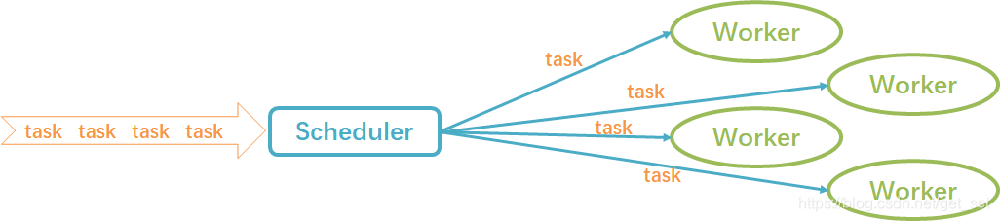
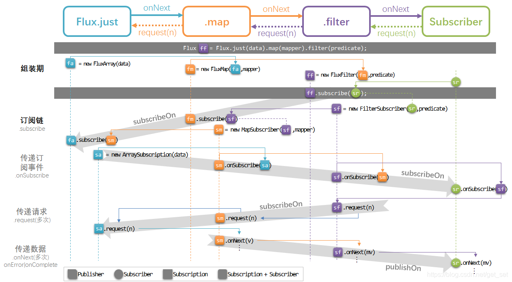

## 2.4 调度器与线程模型

在[1.3.2节](http://blog.csdn.net/get_set/article/details/79480172)简单介绍了不同类型的调度器`Scheduler`，以及如何使用`publishOn`和`subscribeOn`切换不同的线程执行环境。

下边使用一个简单的例子再回忆一下：

```
    @Test
    public void testScheduling() {
        Flux.range(0, 10)
//                .log()
                .publishOn(Schedulers.newParallel("myParallel"))
//                .log()
                .subscribeOn(Schedulers.newElastic("myElastic"))
                .log()
                .blockLast();
    }
12345678910
```

1. 只保留这个log()的话，可以看到，源头数据流是执行在`myElastic-x`线程上的；
2. 只保留这个log()的话，可以看到，`publishOn`之后数据流是执行在`myParallel-x`线程上的；
3. 只保留这个log()的话，可以看到，`subscribeOn`之后数据流依然是执行在`myParallel-x`线程上的。

通过以上三个`log()`的输出，可以发现，对于如下图所示的操作链：


- **publishOn会影响链中其后的操作符**，比如第一个publishOn调整调度器为elastic，则`filter`的处理操作是在弹性线程池中执行的；同理，`flatMap`是执行在固定大小的parallel线程池中的；
- **subscribeOn无论出现在什么位置，都只影响源头的执行环境**，也就是`range`方法是执行在单线程中的，直至被第一个`publishOn`切换调度器之前，所以`range`后的`map`也在单线程中执行。

这一节我们了解一下它的实现机制。

### 2.4.1 调度器

调度器相当于Reactor中的ExecutorService，不同的调度器定义不同的线程执行环境。`Schedulers`工具类提供的静态方法可搭建不同的线程执行环境。

`Schedulers`类已经预先创建了几种常用的不同线程池模型的调度器：使用`single()`、`elastic()`和`parallel()`方法创建的调度器可以分别使用内置的单线程、弹性线程池和固定大小线程池。如果想创建新的调度器，可以使用`newSingle()`、`newElastic()`和`newParallel()`方法。这些方法都是返回一个`Scheduler`的具体实现。

看一下`Scheduler`都有哪些行为：

```
public interface Scheduler extends Disposable {
    // 调度执行Runnable任务task。
	Disposable schedule(Runnable task);
	// 延迟一段指定的时间后执行。
	Disposable schedule(Runnable task, long delay, TimeUnit unit);
	// 周期性地执行任务。
	Disposable schedulePeriodically(Runnable task, long initialDelay, long period, TimeUnit unit);
	// 创建一个工作线程。
	Worker createWorker();
	// 启动调度器
	void start();
	// 以下两个方法可以暂时忽略
	void dispose();
	long now(TimeUnit unit)
	
	// 一个Worker代表调度器可调度的一个工作线程，在一个Worker内，遵循FIFO（先进先出）的任务执行策略
	interface Worker extends Disposable {
    	// 调度执行Runnable任务task。
    	Disposable schedule(Runnable task);
    	// 延迟一段指定的时间后执行。
    	Disposable schedule(Runnable task, long delay, TimeUnit unit);
    	// 周期性地执行任务。
    	Disposable schedulePeriodically(Runnable task, long initialDelay, long period, TimeUnit unit);
	}
}

12345678910111213141516171819202122232425
```



如图所示，`Scheduler`是领导，`Worker`是员工，每个`Scheduler`手中有若干`Worker`。接到任务后，`Scheduler`负责分派，`Worker`负责干活。

在`Scheduler`中，每个`Worker`都是一个`ScheduledExecutorService`，或一个包装了`ScheduledExecutorService`的对象。所以，`Scheduler`拥有的并不是线程池，而是一个自行维护的`ScheduledExecutorService`池。

所谓“自行维护”，主要有三点：

1. 可供调遣的`Worker`。比如`Schedulers.newParallel()`返回的`ParallelScheduler`，其内维护的是一个固定大小的`ScheduledExecutorService[]`数组；而`ElasticScheduler`由一个ExecutorService的`Queue`来维护。
2. 任务分派策略。`ElasticScheduler`和`ParallelScheduler`都有一个`pick()`方法，用来选出合适的`Worker`。
3. 对于要处理的任务，包装为`Callable`，从而可以异步地返回一个`Future`给调用者。

### 2.4.2 切换执行环境

再回到`publishOn`和`subscribeOn`方法。

在Reactor中，对于数据流的处理，实际上是一系列方法调用和基于事件的回调，包括`subscribe`、`onSubscribe`、`request`，以及`onNext`、`onError`、`onComplete`。拿出2.1节的图帮助理解：



当调用`.subscribe()`方法时，会形成从上游向下游的数据流，数据流中的元素通过`onNext* (onError|onComplete)`携带“顺流而下”。同时，Reactor使用者看不到的是，还有一条从下游向上游的“订阅链”，request就是沿着这个链向上反馈需求的。

**publishOn方法能够将onNext、onError、onComplete调度到给定的Scheduler的Worker上执行**。所以如上图场景中，再`.map`和`.filter`中间增加一个`publisheOn(Schedulers.elastic())`的话，`.filter`操作的`onNext`的过滤处理将会执行在`ElasticScheduler`的某个`Worker`上。

**subscribeOn方法能够将subscribe（会调用onSubscribe）、request调度到给定的Scheduler的Worker上执行**。所以在任何位置增加一个`subscribeOn(Schedulers.elastic())`的话，都会借助自下而上的订阅链，通过`subscribe()`方法，将线程执行环境传递到“源头”，从而`Flux.just`会执行在`ElasticScheduler`上。继而影响到其后的操作符，直至遇到`publishOn`改变了执行环境。

此外，有些操作符本身会需要调度器来进行多线程的处理，当你不明确指定调度器的时候，那些操作符会自行使用内置的单例调度器来执行。例如，`Flux.delayElements(Duration)` 使用的是 `Schedulers.parallel()`调度器对象：

```
    @Test
    public void testDelayElements() {
        Flux.range(0, 10)
                .delayElements(Duration.ofMillis(10))
                .log()
                .blockLast();
    }
1234567
```

从输出可以看到`onNext`运行在不同的线程上：

```
[ INFO] (main) onSubscribe(FluxConcatMap.ConcatMapImmediate)
[ INFO] (main) request(unbounded)
[ INFO] (parallel-1) onNext(0)
[ INFO] (parallel-2) onNext(1)
[ INFO] (parallel-3) onNext(2)
[ INFO] (parallel-4) onNext(3)
...
1234567
```

### 2.4.3 为数据流配置Context

在Reactor中，基于`Scheduler`的线程调度确实非常简单好用，但是还有个问题需要解决。

我们以往在编写多线程的代码时，如果涉及到只在线程内部使用的值，可能会使用`ThreadLocal`进行包装。

但是在响应式编程中，由于线程环境经常发生变化，这一用法就失去作用了，并且甚至带来bug。比如，使用 Logback 的 MDC 来存储日志关联的 ID 就属于这种情况。

自从版本 3.1.0，Reactor 引入了一个类似于 ThreadLocal 的高级功能：Context。它作用于一个 Flux 或一个 Mono 上，而不是应用于一个线程（Thread）。也就是其生命周期伴随整个数据流，而不是线程。

相对来说，用户使用Context并不多，对此感兴趣或有此需求的话，请看我[翻译的相关文档](https://htmlpreview.github.io/?https://github.com/get-set/reactor-core/blob/master-zh/src/docs/index.html#context)，可以对Reactor内部实现尤其是`Subscription`有更深的理解。

### 2.4.4 并行执行

如今多核架构已然普及，能够方便的进行并行处理是很重要的。

对于一些能够在一个线程中顺序处理的任务，即使调度到ParallelScheduler上，通常也只由一个Worker来执行，比如：

```java
    @Test
    public void testParallelFlux() throws InterruptedException {
        Flux.range(1, 10)
                .publishOn(Schedulers.parallel())
                .log().subscribe();
        TimeUnit.MILLISECONDS.sleep(10);
    }
1234567
```

输出如下：

```
[ INFO] (main) | onSubscribe([Fuseable] FluxPublishOn.PublishOnSubscriber)
[ INFO] (main) | request(unbounded)
[ INFO] (parallel-1) | onNext(1)
[ INFO] (parallel-1) | onNext(2)
[ INFO] (parallel-1) | onNext(3)
[ INFO] (parallel-1) | onNext(4)
[ INFO] (parallel-1) | onNext(5)
[ INFO] (parallel-1) | onNext(6)
[ INFO] (parallel-1) | onNext(7)
[ INFO] (parallel-1) | onNext(8)
[ INFO] (parallel-1) | onNext(9)
[ INFO] (parallel-1) | onNext(10)
[ INFO] (parallel-1) | onComplete()
12345678910111213
```

有时候，我们确实需要一些任务能够“均匀”分布在不同的工作线程上执行，这时候就需要用到`ParallelFlux`。

你可以对任何Flux使用`parallel()`操作符来得到一个`ParallelFlux`。不过这个操作符本身并不会进行并行处理，而只是将负载划分到多个执行“轨道”上（默认情况下，轨道个数与CPU核数相等）。

为了配置`ParallelFlux`如何并行地执行每一个轨道，需要使用`runOn(Scheduler)`，这里，Schedulers.parallel() 是比较推荐的专门用于并行处理的调度器。

```java
    @Test
    public void testParallelFlux() throws InterruptedException {
        Flux.range(1, 10)
                .parallel(2)
                .runOn(Schedulers.parallel())
//                .publishOn(Schedulers.parallel())
                .log()
                .subscribe();

        TimeUnit.MILLISECONDS.sleep(10);
    }
1234567891011
```

输出如下：

```
[ INFO] (main) onSubscribe([Fuseable] FluxPublishOn.PublishOnSubscriber)
[ INFO] (main) request(unbounded)
[ INFO] (main) onSubscribe([Fuseable] FluxPublishOn.PublishOnSubscriber)
[ INFO] (main) request(unbounded)
[ INFO] (parallel-1) onNext(1)
[ INFO] (parallel-2) onNext(2)
[ INFO] (parallel-1) onNext(3)
[ INFO] (parallel-2) onNext(4)
[ INFO] (parallel-1) onNext(5)
[ INFO] (parallel-2) onNext(6)
[ INFO] (parallel-1) onNext(7)
[ INFO] (parallel-2) onNext(8)
[ INFO] (parallel-1) onNext(9)
[ INFO] (parallel-2) onNext(10)
[ INFO] (parallel-1) onComplete()
[ INFO] (parallel-2) onComplete()

12345678910111213141516
```

可以看到，各个元素的onNext “均匀”分布执行在两个线程上，最后每个线程上有独立的`onComplete`事件，这与`publishOn`调度到ParallelScheduler上的情况是不同的。