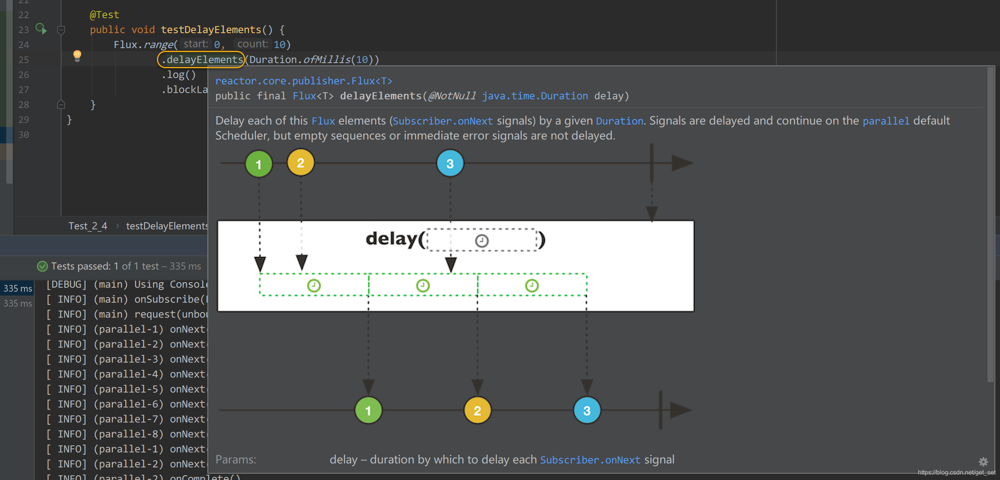
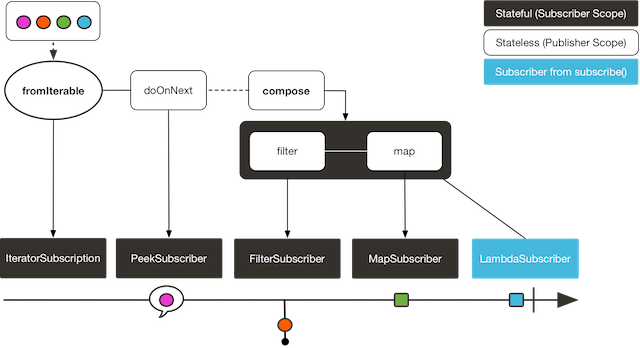
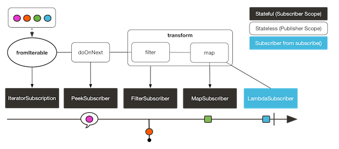

## 2.5 Reactor 3 Operators

虽然响应式流规范中对[Operator](https://so.csdn.net/so/search?q=Operator&spm=1001.2101.3001.7020)（以下均称作”操作符“）并未做要求，但是与RxJava等响应式开发库一样，Reactor也提供了非常丰富的操作符。

### 2.5.1 丰富的操作符

本系列前边的文章中，陆续介绍了一些常用的操作符。但那也只是冰山之一角，Reactor 3提供了丰富的操作符，如果要一个一个介绍，那篇幅大了去了，授人以鱼不如授人以渔，我们可以通过以下几种途径了解操作符的应用场景，熟悉它们的使用方法：

1. [附2](http://blog.csdn.net/get_set/article/details/79610895)中介绍了如何选择合适的操作符。
2. 参考[Javadoc](http://projectreactor.io/docs/core/release/api/)中对Flux和Mono的解释和示意图。
3. 如果想通过实战的方式上手试一下各种操作符，强烈推荐来自Reactor官方的[lite-rx-api-hands-on](https://github.com/reactor/lite-rx-api-hands-on)项目。拿到项目后，你要做的就是使用操作符，完成“TODO”的代码，让所有的`@Test`绿灯就OK了。相信完成这些测试之后，对于常见的操作符就能了然于胸了。
4. 此外，在日常的开发过程中，通过IDE也可以随时查阅，比如IntelliJ：



由于Project Reactor的核心开发团队也有来自[RxJava](https://so.csdn.net/so/search?q=RxJava&spm=1001.2101.3001.7020)的大牛，并且Reactor本身在开发过程中也借鉴了大多数RxJava的操作符命名（对于RxJava中少量命名不够清晰的操作符进行了优化），因此对于熟悉RxJava的朋友来说，使用Reactor基本没有学习成本。同样的，学习了Reactor之后，再去使用RxJava也没有问题。

### 2.5.2 “打包”操作符

我们在开发过程中，为了保持代码的简洁，通常会将经常使用的一系列操作封装到方法中，以备调用。

Reactor也提供了类似的对操作符的“打包”方法。

**1）使用 transform 操作符**

`transform`可以将一段操作链打包为一个函数式。这个函数式能在组装期将被封装的操作符还原并接入到调用`transform`的位置。这样做和直接将被封装的操作符加入到链上的效果是一样的。示例如下：

```java
    @Test
    public void testTransform() {
        Function<Flux<String>, Flux<String>> filterAndMap =
                f -> f.filter(color -> !color.equals("orange"))
                        .map(String::toUpperCase);

        Flux.fromIterable(Arrays.asList("blue", "green", "orange", "purple"))
                .doOnNext(System.out::println)
                .transform(filterAndMap)
                .subscribe(d -> System.out.println("Subscriber to Transformed MapAndFilter: "+d));
    }
1234567891011
```

这个例子，通过名为`filterAndMap`的函数式将`filter`和`map`操作符进行了打包，然后交给transform拼装到操作链中。输出如下：

```
blue
Subscriber to Transformed MapAndFilter: BLUE
green
Subscriber to Transformed MapAndFilter: GREEN
orange
purple
Subscriber to Transformed MapAndFilter: PURPLE
1234567
```

**2）使用 compose 操作符**

compose 操作符与 transform 类似，也能够将几个操作符封装到一个函数式中。主要的区别就是，这个函数式是**针对每一个订阅者**起作用的。这意味着它对每一个 subscription 可以生成不同的操作链。举个例子：

```java
    public void testCompose() {
        AtomicInteger ai = new AtomicInteger();
        Function<Flux<String>, Flux<String>> filterAndMap = f -> {
            if (ai.incrementAndGet() == 1) {
                return f.filter(color -> !color.equals("orange"))
                        .map(String::toUpperCase);
            }
            return f.filter(color -> !color.equals("purple"))
                    .map(String::toUpperCase);
        };

        Flux<String> composedFlux =
                Flux.fromIterable(Arrays.asList("blue", "green", "orange", "purple"))
                        .doOnNext(System.out::println)
                        .compose(filterAndMap);

        composedFlux.subscribe(d -> System.out.println("Subscriber 1 to Composed MapAndFilter :" + d));
        composedFlux.subscribe(d -> System.out.println("Subscriber 2 to Composed MapAndFilter: " + d));
    }

12345678910111213141516171819
```

这个例子中，filterAndMap函数式有一个名为`ai`的会自增的状态值。每次调用`subscribe`方法进行订阅的时候，`compose`会导致`ai`自增，从而两次订阅的操作链是不同的。输出如下：

```
blue
Subscriber 1 to Composed MapAndFilter :BLUE
green
Subscriber 1 to Composed MapAndFilter :GREEN
orange
purple
Subscriber 1 to Composed MapAndFilter :PURPLE
blue
Subscriber 2 to Composed MapAndFilter: BLUE
green
Subscriber 2 to Composed MapAndFilter: GREEN
orange
Subscriber 2 to Composed MapAndFilter: ORANGE
purple
1234567891011121314
```

也就是说，`compose`中打包的函数式可以是有状态的（stateful）：



而`transform`打包的函数式是无状态的。将`compose`换成`transform`再次执行，发现两次订阅的操作链是一样的，都会过滤掉`orange`。




文章知识点与官方知识档案匹配，可进一步学习相关知识