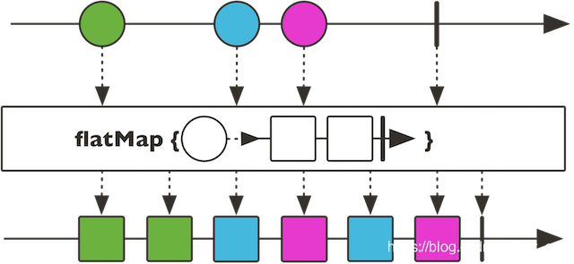

### 1.3.2 Reactor

Reactor与Spring是兄弟项目，侧重于Server端的响应式编程，主要 artifact 是 reactor-core，这是一个基于 Java 8 的实现了响应式流规范 （Reactive Streams specification）的响应式库。

本文对Reactor的介绍以基本的概念和简单的使用为主，深度以能够满足基本的Spring WebFlux使用为准。在下一章，我会结合Reactor的设计模式、并发调度模型等原理层面的内容系统介绍Reactor的使用。

> 本文[源码](https://github.com/get-set/get-reactive/blob/master/snacks/src/test/java/com/getset/Test_1_3.java#L73)。

光说不练假把式，我们先把练习用的项目搭起来。先创建一个maven项目，然后添加依赖：

```
    <dependency>
        <groupId>io.projectreactor</groupId>
        <artifactId>reactor-core</artifactId>
        <version>3.1.4.RELEASE</version>
    </dependency>
12345
```

最新版本可到http://search.maven.org查询，复制过来即可。另外出于测试的需要，添加如下依赖：

```
    <dependency>
        <groupId>io.projectreactor</groupId>
        <artifactId>reactor-test</artifactId>
        <version>3.1.4.RELEASE</version>
        <scope>test</scope>
    </dependency>
    <dependency>
        <groupId>junit</groupId>
        <artifactId>junit</artifactId>
        <version>4.12</version>
        <scope>test</scope>
    </dependency>
123456789101112
```

好了，我们开始Coding吧。

#### 1.3.2.1 Flux与Mono

Reactor中的发布者（Publisher）由`Flux`和`Mono`两个类定义，它们都提供了丰富的操作符（operator）。一个Flux对象代表一个包含0…N个元素的响应式序列，而一个Mono对象代表一个包含零/一个（0…1）元素的结果。

既然是“数据流”的发布者，Flux和Mono都可以发出三种“数据信号”：元素值、错误信号、完成信号，错误信号和完成信号都是终止信号，完成信号用于告知下游订阅者该数据流正常结束，错误信号终止数据流的同时将错误传递给下游订阅者。

下图所示就是一个Flux类型的数据流，黑色箭头是时间轴。它连续发出“1” - “6”共6个元素值，以及一个完成信号（图中⑥后边的加粗竖线来表示），完成信号告知订阅者数据流已经结束。


下图所示是一个Mono类型的数据流，它发出一个元素值后，又发出一个完成信号。


> 既然Flux具有发布一个数据元素的能力，为什么还要专门定义一个Mono类呢？举个例子，一个HTTP请求产生一个响应，所以对其进行“count”操作是没有多大意义的。表示这样一个结果的话，应该用`Mono<HttpResponse>`而不是 `Flux<HttpResponse>`，对于的操作通常只用于处理 0/1 个元素。它们从语义上就原生包含着元素个数的信息，从而避免了对Mono对象进行多元素场景下的处理。

> 有些操作可以改变基数，从而需要切换类型。比如，count操作用于Flux，但是操作返回的结果是`Mono<Long>`。

我们可以用如下代码声明上边两幅图所示的Flux和Mono：

```
Flux.just(1, 2, 3, 4, 5, 6);
Mono.just(1);
```

Flux和Mono提供了多种创建数据流的方法，`just`就是一种比较直接的声明数据流的方式，其参数就是数据元素。

对于图中的Flux，还可以通过如下方式声明（分别基于数组、集合和[Stream](https://so.csdn.net/so/search?q=Stream&spm=1001.2101.3001.7020)生成）：

```
Integer[] array = new Integer[]{1,2,3,4,5,6};
Flux.fromArray(array);
List<Integer> list = Arrays.asList(array);
Flux.fromIterable(list);
Stream<Integer> stream = list.stream();
Flux.fromStream(stream);
```

不过，这三种信号都不是一定要具备的：

- 首先，错误信号和完成信号都是终止信号，二者不可能同时共存；
- 如果没有发出任何一个元素值，而是直接发出完成/错误信号，表示这是一个空数据流；
- 如果没有错误信号和完成信号，那么就是一个无限数据流。

比如，对于只有完成/错误信号的数据流：

```
// 只有完成信号的空数据流
Flux.just();
Flux.empty();
Mono.empty();
Mono.justOrEmpty(Optional.empty());
// 只有错误信号的数据流
Flux.error(new Exception("some error"));
Mono.error(new Exception("some error"));
12345678
```

你可能会纳闷，空的数据流有什么用？举个例子，当我们从响应式的DB中获取结果的时候（假设DAO层是`ReactiveRepository<User>`），就有可能为空：

```
 Mono<User> findById(long id);
 Flux<User> findAll();
12
```

无论是空还是发生异常，都需要通过完成/错误信号告知订阅者，已经查询完毕，但是抱歉没有得到值，礼貌问题嘛~

#### 1.3.2.2 订阅前什么都不会发生

数据流有了，假设我们想把每个数据元素原封不动地打印出来：

```
Flux.just(1, 2, 3, 4, 5, 6).subscribe(System.out::print);
System.out.println();
Mono.just(1).subscribe(System.out::println);
123
```

输出如下：

```
123456
1
12
```

可见，`subscribe`方法中的[lambda](https://so.csdn.net/so/search?q=lambda&spm=1001.2101.3001.7020)表达式作用在了每一个数据元素上。此外，Flux和Mono还提供了多个`subscribe`方法的变体：

```
// 订阅并触发数据流
subscribe(); 
// 订阅并指定对正常数据元素如何处理
subscribe(Consumer<? super T> consumer); 
// 订阅并定义对正常数据元素和错误信号的处理
subscribe(Consumer<? super T> consumer,
          Consumer<? super Throwable> errorConsumer); 
// 订阅并定义对正常数据元素、错误信号和完成信号的处理
subscribe(Consumer<? super T> consumer,
          Consumer<? super Throwable> errorConsumer,
          Runnable completeConsumer); 
// 订阅并定义对正常数据元素、错误信号和完成信号的处理，以及订阅发生时的处理逻辑
subscribe(Consumer<? super T> consumer,
          Consumer<? super Throwable> errorConsumer,
          Runnable completeConsumer,
          Consumer<? super Subscription> subscriptionConsumer); 
12345678910111213141516
```

1）如果是订阅上边声明的Flux：

```
Flux.just(1, 2, 3, 4, 5, 6).subscribe(
    System.out::println,
    System.err::println,
    () -> System.out.println("Completed!"));
1234
```

输出如下：

```
1
2
3
4
5
6
Completed!
1234567
```

2）再举一个有错误信号的例子：

```
Mono.error(new Exception("some error")).subscribe(
        System.out::println,
        System.err::println,
        () -> System.out.println("Completed!")
);
12345
```

输出如下：

```
java.lang.Exception: some error
1
```

打印出了错误信号，没有输出`Completed!`表明没有发出完成信号。

这里需要注意的一点是，`Flux.just(1, 2, 3, 4, 5, 6)`仅仅声明了这个数据流，此时数据元素并未发出，只有`subscribe()`方法调用的时候才会触发数据流。所以，**订阅前什么都不会发生**。

#### 1.3.2.3 测试与调试

从命令式和同步式编程切换到响应式和异步式编程有时候是令人生畏的。学习曲线中最陡峭的地方就是出错时如何分析和调试。

在命令式世界，调试通常都是非常直观的：直接看 stack trace 就可以找到问题出现的位置， 以及其他信息：是否问题责任全部出在你自己的代码？问题是不是发生在某些库代码？如果是， 那你的哪部分代码调用了库，是不是传参不合适导致的问题？等等。

当你切换到响应式的异步代码，事情就变得复杂的多了。不过我们先不接触过于复杂的内容，先了解一个基本的单元测试工具——`StepVerifier`。

最常见的测试 Reactor 序列的场景就是定义一个 Flux 或 Mono，然后在订阅它的时候测试它的行为。

当你的测试关注于每一个数据元素的时候，就非常贴近使用 StepVerifier 的测试场景： 下一个期望的数据或信号是什么？你是否期望使用 Flux 来发出某一个特别的值？或者是否接下来 300ms 什么都不做？——所有这些都可以使用 StepVerifier API 来表示。

还是以那个1-6的Flux以及会发出错误信号的Mono为例：

```
private Flux<Integer> generateFluxFrom1To6() {
    return Flux.just(1, 2, 3, 4, 5, 6);
}
private Mono<Integer> generateMonoWithError() {
    return Mono.error(new Exception("some error"));
}
@Test
public void testViaStepVerifier() {
    StepVerifier.create(generateFluxFrom1To6())
            .expectNext(1, 2, 3, 4, 5, 6)
            .expectComplete()
            .verify();
    StepVerifier.create(generateMonoWithError())
            .expectErrorMessage("some error")
            .verify();
}
12345678910111213141516
```

其中，`expectNext`用于测试下一个期望的数据元素，`expectErrorMessage`用于校验下一个元素是否为错误信号，`expectComplete`用于测试下一个元素是否为完成信号。

`StepVerifier`还提供了其他丰富的测试方法，我们会在后续的介绍中陆续接触到。

#### 1.3.2.4 操作符（Operator）

通常情况下，我们需要对源发布者发出的原始数据流进行多个阶段的处理，并最终得到我们需要的数据。这种感觉就像是一条流水线，从流水线的源头进入传送带的是原料，经过流水线上各个工位的处理，逐渐由原料变成半成品、零件、组件、成品，最终成为消费者需要的包装品。这其中，流水线源头的下料机就相当于源发布者，消费者就相当于订阅者，流水线上的一道道工序就相当于一个一个的操作符（Operator）。

下面介绍一些我们常用的操作符。

**1）map - 元素映射为新元素**

`map`操作可以将数据元素进行转换/映射，得到一个新元素。


```
public final <V> Flux<V> map(Function<? super T,? extends V> mapper)
public final <R> Mono<R> map(Function<? super T, ? extends R> mapper) 
12
```

上图是Flux的map操作示意图，上方的箭头是原始序列的时间轴，下方的箭头是经过map处理后的数据序列时间轴。

`map`接受一个`Function`的函数式接口为参数，这个函数式的作用是定义转换操作的策略。举例说明：

```
StepVerifier.create(Flux.range(1, 6)    // 1
            .map(i -> i * i))   // 2
            .expectNext(1, 4, 9, 16, 25, 36)    //3
            .expectComplete();  // 4
1234
```

1. `Flux.range(1, 6)`用于生成从“1”开始的，自增为1的“6”个整型数据；
2. `map`接受lambda`i -> i * i`为参数，表示对每个数据进行平方；
3. 验证新的序列的数据；
4. `verifyComplete()`相当于`expectComplete().verify()`。

**2）flatMap - 元素映射为流**

`flatMap`操作可以将每个数据元素转换/映射为一个流，然后将这些流合并为一个大的数据流。



注意到，流的合并是异步的，先来先到，并非是严格按照原始序列的顺序（如图蓝色和红色方块是交叉的）。

```
public final <R> Flux<R> flatMap(Function<? super T, ? extends Publisher<? extends R>> mapper)
public final <R> Mono<R> flatMap(Function<? super T, ? extends Mono<? extends R>> transformer) 
12
```

`flatMap`也是接收一个`Function`的函数式接口为参数，这个函数式的输入为一个T类型数据值，对于Flux来说输出可以是Flux和Mono，对于Mono来说输出只能是Mono。举例说明：

```
    StepVerifier.create(
        Flux.just("flux", "mono")
                .flatMap(s -> Flux.fromArray(s.split("\\s*"))   // 1
                        .delayElements(Duration.ofMillis(100))) // 2
                .doOnNext(System.out::print)) // 3
        .expectNextCount(8) // 4
        .verifyComplete();
1234567
```

1. 对于每一个字符串`s`，将其拆分为包含一个字符的字符串流；
2. 对每个元素延迟100ms；
3. 对每个元素进行打印（注`doOnNext`方法是“偷窥式”的方法，不会消费数据流）；
4. 验证是否发出了8个元素。

打印结果为`mfolnuox`，原因在于各个拆分后的小字符串都是间隔100ms发出的，因此会交叉。

`flatMap`通常用于每个元素又会引入数据流的情况，比如我们有一串url数据流，需要请求每个url并收集response数据。假设响应式的请求方法如下：

```
Mono<HttpResponse> requestUrl(String url) {...}
1
```

而url数据流为一个`Flux<String> urlFlux`，那么为了得到所有的HttpResponse，就需要用到flatMap：

```
urlFlux.flatMap(url -> requestUrl(url));
1
```

其返回内容为`Flux<HttpResponse>`类型的HttpResponse流。

**3）filter - 过滤**

`filter`操作可以对数据元素进行筛选。


```
public final Flux<T> filter(Predicate<? super T> tester)
public final Mono<T> filter(Predicate<? super T> tester) 
12
```

`filter`接受一个`Predicate`的函数式接口为参数，这个函数式的作用是进行判断并返回boolean。举例说明：

```
StepVerifier.create(Flux.range(1, 6)
            .filter(i -> i % 2 == 1)    // 1
            .map(i -> i * i))
            .expectNext(1, 9, 25)   // 2
            .verifyComplete();
12345
```

1. `filter`的lambda参数表示过滤操作将保留奇数；
2. 验证仅得到奇数的平方。

**4）zip - 一对一合并**

看到`zip`这个词可能会联想到拉链，它能够将多个流一对一的合并起来。zip有多个方法变体，我们介绍一个最常见的二合一的。


它对两个Flux/Mono流每次各取一个元素，合并为一个二元组（`Tuple2`）：

```
public static <T1,T2> Flux<Tuple2<T1,T2>> zip(Publisher<? extends T1> source1,
                                          Publisher<? extends T2> source2)
public static <T1, T2> Mono<Tuple2<T1, T2>> zip(Mono<? extends T1> p1, Mono<? extends T2> p2) 
123
```

`Flux`的`zip`方法接受Flux或Mono为参数，`Mono`的`zip`方法只能接受Mono类型的参数。

举个例子，假设我们有一个关于`zip`方法的说明：“Zip two sources together, that is to say wait for all the sources to emit one element and combine these elements once into a Tuple2.”，我们希望将这句话拆分为一个一个的单词并以每200ms一个的速度发出，除了前面flatMap的例子中用到的`delayElements`，可以如下操作：

```
private Flux<String> getZipDescFlux() {
    String desc = "Zip two sources together, that is to say wait for all the sources to emit one element and combine these elements once into a Tuple2.";
    return Flux.fromArray(desc.split("\\s+"));  // 1
}

@Test
public void testSimpleOperators() throws InterruptedException {
    CountDownLatch countDownLatch = new CountDownLatch(1);  // 2
    Flux.zip(
            getZipDescFlux(),
            Flux.interval(Duration.ofMillis(200)))  // 3
            .subscribe(t -> System.out.println(t.getT1()), null, countDownLatch::countDown);    // 4
    countDownLatch.await(10, TimeUnit.SECONDS);     // 5
}
1234567891011121314
```

1. 将英文说明用空格拆分为字符串流；
2. 定义一个`CountDownLatch`，初始为1，则会等待执行1次`countDown`方法后结束，不使用它的话，测试方法所在的线程会直接返回而不会等待数据流发出完毕；
3. 使用`Flux.interval`声明一个每200ms发出一个元素的long数据流；因为zip操作是一对一的，故而将其与字符串流zip之后，字符串流也将具有同样的速度；
4. zip之后的流中元素类型为`Tuple2`，使用`getT1`方法拿到字符串流的元素；定义完成信号的处理为`countDown`;
5. `countDownLatch.await(10, TimeUnit.SECONDS)`会等待`countDown`倒数至0，最多等待10秒钟。

除了`zip`静态方法之外，还有`zipWith`等非静态方法，效果与之类似：

```
getZipDescFlux().zipWith(Flux.interval(Duration.ofMillis(200)))

```

在异步条件下，数据流的流速不同，使用zip能够一对一地将两个或多个数据流的元素对齐发出。

**5）更多**

Reactor中提供了非常丰富的操作符，除了以上几个常见的，还有：

- 用于编程方式自定义生成数据流的`create`和`generate`等及其变体方法；
- 用于“无副作用的peek”场景的`doOnNext`、`doOnError`、`doOncomplete`、`doOnSubscribe`、`doOnCancel`等及其变体方法；
- 用于数据流转换的`when`、`and/or`、`merge`、`concat`、`collect`、`count`、`repeat`等及其变体方法；
- 用于过滤/拣选的`take`、`first`、`last`、`sample`、`skip`、`limitRequest`等及其变体方法；
- 用于错误处理的`timeout`、`onErrorReturn`、`onErrorResume`、`doFinally`、`retryWhen`等及其变体方法；
- 用于分批的`window`、`buffer`、`group`等及其变体方法；
- 用于线程调度的`publishOn`和`subscribeOn`方法。

使用这些操作符，你几乎可以搭建出能够进行任何业务需求的数据处理管道/流水线。

抱歉以上这些暂时不能一一介绍，更多详情请参考[JavaDoc](http://projectreactor.io/docs/core/release/api/reactor/core/publisher/Flux.html)，在下一章我们还会回头对Reactor从更深层次进行系统的分析。

此外，也可阅读我翻译的[Reactor参考文档](https://htmlpreview.github.io/?https://github.com/get-set/reactor-core/blob/master-zh/src/docs/index.html)，我会尽量及时更新翻译的内容。文档源码位于[github](https://github.com/get-set/reactor-core/tree/master-zh/src/docs/asciidoc)，如有翻译不当，欢迎提交Pull-Request。

#### 1.3.2.5 调度器与线程模型

在Reactor中，对于多线程并发调度的处理变得异常简单。

在以往的多线程开发场景中，我们通常使用`Executors`工具类来创建线程池，通常有如下四种类型：

- `newCachedThreadPool`创建一个弹性大小缓存线程池，如果线程池长度超过处理需要，可灵活回收空闲线程，若无可回收，则新建线程；
- `newFixedThreadPool`创建一个大小固定的线程池，可控制线程最大并发数，超出的线程会在队列中等待；
- `newScheduledThreadPool`创建一个大小固定的线程池，支持定时及周期性的任务执行；
- `newSingleThreadExecutor`创建一个单线程化的线程池，它只会用唯一的工作线程来执行任务，保证所有任务按照指定顺序(FIFO, LIFO, 优先级)执行。

此外，`newWorkStealingPool`还可以创建支持work-stealing的线程池。

说良心话，Java提供的`Executors`工具类使得我们对`ExecutorService`使用已经非常得心应手了。BUT~ Reactor让线程管理和任务调度更加“傻瓜”——调度器（Scheduler）帮助我们搞定这件事。`Scheduler`是一个拥有多个实现类的抽象接口。`Schedulers`类（按照通常的套路，最后为`s`的就是工具类咯）提供的静态方法可搭建以下几种线程执行环境：

- 当前线程（`Schedulers.immediate()`）；
- 可重用的单线程（`Schedulers.single()`）。注意，这个方法对所有调用者都提供同一个线程来使用， 直到该调度器被废弃。如果你想使用独占的线程，请使用`Schedulers.newSingle()`；
- 弹性线程池（`Schedulers.elastic()`）。它根据需要创建一个线程池，重用空闲线程。线程池如果空闲时间过长 （默认为 60s）就会被废弃。对于 I/O 阻塞的场景比较适用。`Schedulers.elastic()`能够方便地给一个阻塞 的任务分配它自己的线程，从而不会妨碍其他任务和资源；
- 固定大小线程池（`Schedulers.parallel()`），所创建线程池的大小与CPU个数等同；
- 自定义线程池（`Schedulers.fromExecutorService(ExecutorService)`）基于自定义的ExecutorService创建 Scheduler（虽然不太建议，不过你也可以使用Executor来创建）。

`Schedulers`类已经预先创建了几种常用的线程池：使用`single()`、`elastic()`和`parallel()`方法可以分别使用内置的单线程、弹性线程池和固定大小线程池。如果想创建新的线程池，可以使用`newSingle()`、`newElastic()`和`newParallel()`方法。

`Executors`提供的几种线程池在Reactor中都支持：

- `Schedulers.single()`和`Schedulers.newSingle()`对应`Executors.newSingleThreadExecutor()`；
- `Schedulers.elastic()`和`Schedulers.newElastic()`对应`Executors.newCachedThreadPool()`；
- `Schedulers.parallel()`和`Schedulers.newParallel()`对应`Executors.newFixedThreadPool()`；
- 下一章会介绍到，`Schedulers`提供的以上三种调度器底层都是基于`ScheduledExecutorService`的，因此都是支持任务定时和周期性执行的；
- `Flux`和`Mono`的调度操作符`subscribeOn`和`publishOn`支持work-stealing。

**举例：将同步的阻塞调用变为异步的**

前面介绍到`Schedulers.elastic()`能够方便地给一个阻塞的任务分配专门的线程，从而不会妨碍其他任务和资源。我们就可以利用这一点将一个同步阻塞的调用调度到一个自己的线程中，并利用订阅机制，待调用结束后异步返回。

假设我们有一个同步阻塞的调用方法：

```
private String getStringSync() {
    try {
        TimeUnit.SECONDS.sleep(2);
    } catch (InterruptedException e) {
        e.printStackTrace();
    }
    return "Hello, Reactor!";
}
```

正常情况下，调用这个方法会被阻塞2秒钟，然后同步地返回结果。我们借助elastic调度器将其变为异步，由于是异步的，为了保证测试方法所在的线程能够等待结果的返回，我们使用`CountDownLatch`：

```
@Test
public void testSyncToAsync() throws InterruptedException {
    CountDownLatch countDownLatch = new CountDownLatch(1);
    Mono.fromCallable(() -> getStringSync())    // 1
            .subscribeOn(Schedulers.elastic())  // 2
            .subscribe(System.out::println, null, countDownLatch::countDown);
    countDownLatch.await(10, TimeUnit.SECONDS);
}
```

1. 使用`fromCallable`声明一个基于Callable的Mono；
2. 使用`subscribeOn`将任务调度到`Schedulers`内置的弹性线程池执行，弹性线程池会为Callable的执行任务分配一个单独的线程。

**切换调度器的操作符**

Reactor 提供了两种在响应式链中调整调度器 Scheduler的方法：`publishOn`和`subscribeOn`。它们都接受一个 `Scheduler`作为参数，从而可以改变调度器。但是`publishOn`在链中出现的位置是有讲究的，而`subscribeOn` 则无所谓。


> 假设与上图对应的代码是：
> Flux.range(1, 1000)
> .map(…)
> .publishOn(Schedulers.elastic()).filter(…)
> .publishOn(Schedulers.parallel()).flatMap(…)
> .subscribeOn(Schedulers.single())

- 如图所示，`publishOn`会影响链中其后的操作符，比如第一个publishOn调整调度器为elastic，则`filter`的处理操作是在弹性线程池中执行的；同理，`flatMap`是执行在固定大小的parallel线程池中的；
- `subscribeOn`无论出现在什么位置，都只影响源头的执行环境，也就是`range`方法是执行在单线程中的，直至被第一个`publishOn`切换调度器之前，所以`range`后的`map`也在单线程中执行。

关于`publishOn`和`subscribeOn`为什么会出现如此的调度策略，需要深入讨论Reactor的实现原理，我们将在下一章展开。

#### 1.3.2.6 错误处理

在响应式流中，错误（error）是终止信号。当有错误发生时，它会导致流序列停止，并且错误信号会沿着操作链条向下传递，直至遇到subscribe中的错误处理方法。这样的错误还是应该在应用层面解决的。否则，你可能会将错误信息显示在用户界面，或者通过某个REST endpoint发出。所以还是建议在subscribe时通过错误处理方法妥善解决错误。

```
@Test
public void testErrorHandling() {
    Flux.range(1, 6)
            .map(i -> 10/(i-3)) // 1
            .map(i -> i*i)
            .subscribe(System.out::println, System.err::println);
}

```

1. 当i为3时会导致异常。

输出为：

```
25
100
java.lang.ArithmeticException: / by zero    //注：这一行是红色，表示标准错误输出

```

`subscribe`方法的第二个参数定义了对错误信号的处理，从而测试方法exit为0（即正常退出），可见错误没有蔓延出去。不过这还不够~

此外，Reactor还提供了其他的用于在链中处理错误的操作符（error-handling operators），使得对于错误信号的处理更加及时，处理方式更加多样化。

在讨论错误处理操作符的时候，我们借助命令式编程风格的 try 代码块来作比较。我们都很熟悉在 try-catch 代码块中处理异常的几种方法。常见的包括如下几种：

1. 捕获并返回一个静态的缺省值。
2. 捕获并执行一个异常处理方法或动态计算一个候补值来顶替。
3. 捕获，并再包装为某一个 业务相关的异常，然后再抛出业务异常。
4. 捕获，记录错误日志，然后继续抛出。
5. 使用 finally 来清理资源，或使用 Java 7 引入的 “try-with-resource”。

以上所有这些在 Reactor 都有相应的基于 error-handling 操作符处理方式。

**1. 捕获并返回一个静态的缺省值**

`onErrorReturn`方法能够在收到错误信号的时候提供一个缺省值：

```
Flux.range(1, 6)
    .map(i -> 10/(i-3))
    .onErrorReturn(0)   // 1
    .map(i -> i*i)
    .subscribe(System.out::println, System.err::println);

```

1. 当发生异常时提供一个缺省值0

输出如下：

```
25
100
0

```

**2. 捕获并执行一个异常处理方法或计算一个候补值来顶替**

`onErrorResume`方法能够在收到错误信号的时候提供一个新的数据流：

```
Flux.range(1, 6)
    .map(i -> 10/(i-3))
    .onErrorResume(e -> Mono.just(new Random().nextInt(6))) // 提供新的数据流
    .map(i -> i*i)
    .subscribe(System.out::println, System.err::println);

```

输出如下：

```
25
100
16

```

举一个更有业务含义的例子：

```
Flux.just(endpoint1, endpoint2)
    .flatMap(k -> callExternalService(k))   // 1
    .onErrorResume(e -> getFromCache(k));   // 2

```

1. 调用外部服务；
2. 如果外部服务异常，则从缓存中取值代替。

**3. 捕获，并再包装为某一个业务相关的异常，然后再抛出业务异常**

有时候，我们收到异常后并不想立即处理，而是会包装成一个业务相关的异常交给后续的逻辑处理，可以使用`onErrorMap`方法：

```
Flux.just("timeout1")
    .flatMap(k -> callExternalService(k))   // 1
    .onErrorMap(original -> new BusinessException("SLA exceeded", original)); // 2

```

1. 调用外部服务；
2. 如果外部服务异常，将其包装为业务相关的异常后再次抛出。

这一功能其实也可以用`onErrorResume`实现，略麻烦一点：

```
Flux.just("timeout1")
    .flatMap(k -> callExternalService(k))
    .onErrorResume(original -> Flux.error(
        new BusinessException("SLA exceeded", original)
    );

```

**4. 捕获，记录错误日志，然后继续抛出**

如果对于错误你只是想在不改变它的情况下做出响应（如记录日志），并让错误继续传递下去， 那么可以用`doOnError` 方法。前面提到，形如`doOnXxx`是只读的，对数据流不会造成影响：

```
Flux.just(endpoint1, endpoint2)
    .flatMap(k -> callExternalService(k)) 
    .doOnError(e -> {   // 1
        log("uh oh, falling back, service failed for key " + k);    // 2
    })
    .onErrorResume(e -> getFromCache(k)); 

```

1. 只读地拿到错误信息，错误信号会继续向下游传递；
2. 记录日志。

**5. 使用 finally 来清理资源，或使用 Java 7 引入的 "try-with-resource"**

```
Flux.using(
        () -> getResource(),    // 1
        resource -> Flux.just(resource.getAll()),   // 2
        MyResource::clean   // 3
);

```

1. 第一个参数获取资源；
2. 第二个参数利用资源生成数据流；
3. 第三个参数最终清理资源。

另一方面， `doFinally`在序列终止（无论是 onComplete、`onError`还是取消）的时候被执行， 并且能够判断是什么类型的终止事件（完成、错误还是取消），以便进行针对性的清理。如：

```
LongAdder statsCancel = new LongAdder();    // 1

Flux<String> flux =
Flux.just("foo", "bar")
    .doFinally(type -> {
        if (type == SignalType.CANCEL)  // 2
          statsCancel.increment();  // 3
    })
    .take(1);   // 4

```

1. 用`LongAdder`进行统计；
2. `doFinally`用`SignalType`检查了终止信号的类型；
3. 如果是取消，那么统计数据自增；
4. `take(1)`能够在发出1个元素后取消流。

**重试**

还有一个用于错误处理的操作符你可能会用到，就是`retry`，见文知意，用它可以对出现错误的序列进行重试。

请注意：**retry对于上游Flux是采取的重订阅（re-subscribing）的方式，因此重试之后实际上已经一个不同的序列了， 发出错误信号的序列仍然是终止了的。举例如下：

```
Flux.range(1, 6)
    .map(i -> 10 / (3 - i))
    .retry(1)
    .subscribe(System.out::println, System.err::println);
Thread.sleep(100);  // 确保序列执行完
12345
```

输出如下：

```
5
10
5
10
java.lang.ArithmeticException: / by zero
12345
```

可见，`retry`不过是再一次从新订阅了原始的数据流，从1开始。第二次，由于异常再次出现，便将异常传递到下游了。

#### 1.3.2.7 回压

前边的例子并没有进行流量控制，也就是，当执行`.subscribe(System.out::println)`这样的订阅的时候，直接发起了一个无限的请求（unbounded request），就是对于数据流中的元素无论快慢都“照单全收”。

`subscribe`方法还有一个变体：

```
// 接收一个Subscriber为参数，该Subscriber可以进行更加灵活的定义
subscribe(Subscriber subscriber)
12
```

> 注：其实这才是`subscribe`方法本尊，前边介绍到的可以接收0~4个函数式接口为参数的`subscribe`最终都是拼装为这个方法，所以按理说前边的`subscribe`方法才是“变体”。

我们可以通过自定义具有流量控制能力的Subscriber进行订阅。Reactor提供了一个`BaseSubscriber`，我们可以通过扩展它来定义自己的Subscriber。

假设，我们现在有一个非常快的Publisher——`Flux.range(1, 6)`，然后自定义一个每秒处理一个数据元素的慢的Subscriber，Subscriber就需要通过`request(n)`的方法来告知上游它的需求速度。代码如下：

```
@Test
public void testBackpressure() {
    Flux.range(1, 6)    // 1
            .doOnRequest(n -> System.out.println("Request " + n + " values..."))    // 2
            .subscribe(new BaseSubscriber<Integer>() {  // 3
                @Override
                protected void hookOnSubscribe(Subscription subscription) { // 4
                    System.out.println("Subscribed and make a request...");
                    request(1); // 5
                }

                @Override
                protected void hookOnNext(Integer value) {  // 6
                    try {
                        TimeUnit.SECONDS.sleep(1);  // 7
                    } catch (InterruptedException e) {
                        e.printStackTrace();
                    }
                    System.out.println("Get value [" + value + "]");    // 8
                    request(1); // 9
                }
            });
}

1234567891011121314151617181920212223
```

1. `Flux.range`是一个快的Publisher；
2. 在每次`request`的时候打印request个数；
3. 通过重写`BaseSubscriber`的方法来自定义Subscriber；
4. `hookOnSubscribe`定义在订阅的时候执行的操作；
5. 订阅时首先向上游请求1个元素；
6. `hookOnNext`定义每次在收到一个元素的时候的操作；
7. sleep 1秒钟来模拟慢的Subscriber；
8. 打印收到的元素；
9. 每次处理完1个元素后再请求1个。

输出如下（我们也可以使用`log()`来打印类似下边的输出，以代替上边代码中的`System.out.println`）：

```
Subscribed and make a request...
Request 1 values...
Get value [1]
Request 1 values...
Get value [2]
Request 1 values...
Get value [3]
Request 1 values...
Get value [4]
Request 1 values...
Get value [5]
Request 1 values...
Get value [6]
Request 1 values...

```

这6个元素是以每秒1个的速度被处理的。由此可见`range`方法生成的Flux采用的是缓存的回压策略，能够缓存下游暂时来不及处理的元素。

#### 1.3.2.8 总结

以上关于Reactor的介绍主要是概念层面和使用层面的介绍，不过应该也足以应对常见的业务环境了。

从命令式编程到响应式编程的切换并不是一件容易的事，需要一个适应的过程。不过相信你通过本节的了解和实操，已经可以体会到使用Reactor编程的一些特点：

- 相对于传统的基于回调和Future的异步开发方式，响应式编程更加具有**可编排性和可读性**，配合lambda表达式，代码更加简洁，处理逻辑的表达就像装配“流水线”，适用于对数据流的处理；
- 在**订阅（subscribe）时才触发数据流**，这种数据流叫做“冷”数据流，就像插座插上电器才会有电流一样，还有一种数据流不管是否有订阅者订阅它都会一直发出数据，称之为“热”数据流，Reactor中几乎都是“冷”数据流；
- **调度器对线程管理进行更高层次的抽象**，使得我们可以非常容易地切换线程执行环境；
- **灵活的错误处理机制**有利于编写健壮的程序；
- **“回压”机制**使得订阅者可以无限接受数据并让它的源头“满负荷”推送所有的数据，也可以通过使用`request`方法来告知源头它一次最多能够处理 n 个元素，从而将“推送”模式转换为“推送+拉取”混合的模式。

后续随着对Reactor的了解我们还会逐渐了解它更多的好玩又好用的特性。

Reactor的开发者中也有来自RxJava的大牛，因此Reactor中甚至许多方法名都是来自RxJava的API的，学习了Reactor之后，很轻松就可以上手Rx家族的库了。