### 1.3.3 Spring WebFlux

Spring WebFlux是随Spring 5推出的响应式Web框架。

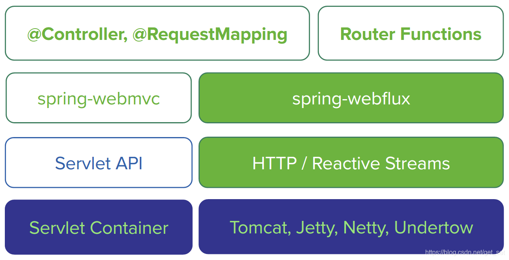


**1）服务端技术栈**

Spring提供了完整的支持响应式的服务端[技术栈](https://so.csdn.net/so/search?q=技术栈&spm=1001.2101.3001.7020)。

如上图所示，左侧为基于spring-webmvc的技术栈，右侧为基于spring-webflux的技术栈，

- Spring WebFlux是基于响应式流的，因此可以用来建立异步的、非阻塞的、事件驱动的服务。它采用Reactor作为首选的响应式流的实现库，不过也提供了对RxJava的支持。
- 由于响应式编程的特性，Spring WebFlux和Reactor底层需要支持异步的运行环境，比如Netty和Undertow；也可以运行在支持异步I/O的Servlet 3.1的容器之上，比如Tomcat（8.0.23及以上）和Jetty（9.0.4及以上）。
- 从图的纵向上看，spring-webflux上层支持两种开发模式：
  - 类似于Spring WebMVC的基于注解（`@Controller`、`@RequestMapping`）的开发模式；
  - Java 8 lambda 风格的函数式开发模式。
- Spring WebFlux也支持响应式的Websocket服务端开发。

> 由此看来，Spring WebFlux与Vert.x有一些相通之处，都是建立在非阻塞的异步I/O和事件驱动的基础之上的。

**2）响应式Http客户端**

此外，Spring WebFlux也提供了一个响应式的Http客户端API `WebClient`。它可以用函数式的方式异步非阻塞地发起Http请求并处理响应。其底层也是由Netty提供的异步支持。

我们可以把`WebClient`看做是响应式的`RestTemplate`，与后者相比，前者：

- 是非阻塞的，可以基于少量的线程处理更高的并发；
- 可以使用Java 8 lambda表达式；
- 支持异步的同时也可以支持同步的使用方式；
- 可以通过数据流的方式与服务端进行双向通信。

当然，与服务端对应的，Spring WebFlux也提供了响应式的Websocket客户端API。

简单介绍这些，让我们来Coding吧（本文[源码](https://github.com/get-set/get-reactive/tree/master/webflux-demo)）~

本节，我们仍然是本着“Hello，world！”的精神来上手熟悉WebFlux，因此暂时不会像手册一样面面俱到地谈到WebFlux的各个细节，我们通过以下几个例子来了解它：

1. 先介绍一下使用Spring WebMVC风格的基于注解的方式如何编写响应式的Web服务，这几乎没有学习成本，非常赞。虽然这种方式在开发上与Spring WebMVC变化不大，但是框架底层已经是完全的响应式技术栈了；
2. 再进一步介绍函数式的开发模式；
3. 简单几行代码实现服务端推送（Server Send Event，SSE）；
4. 然后我们再加入响应式数据库的支持（使用Reactive Spring Data for MongoDB）；
5. 使用`WebClient`与前几步做好的服务端进行通信；
6. 最后我们看一下如何通过“流”的方式在Http上进行通信。

Spring Boot 2是基于Spring 5的，其中一个比较大的更新就在于支持包括spring-webflux和响应式的spring-data在内的响应式模块。Spring Boot 2即将发布正式版，不过目前的版本从功能上已经完备，下边的例子我们就用Spring Boot 2在进行搭建。

#### 1.3.3.1 基于WebMVC注解的方式

我们首先用Spring WebMVC开发一个只有Controller层的简单的Web服务，然后仅仅做一点点调整就可切换为基于Spring WebFlux的具有同样功能的Web服务。

我们使用Spring Boot 2搭建项目框架。

> 以下截图来自IntelliJ IDEA，不过其他IDE也都是类似的。

**1）基于Spring Initializr创建项目**

本节的例子很简单，不涉及Service层和Dao层，因此只选择spring-webmvc即可，也就是“Web”的starter。

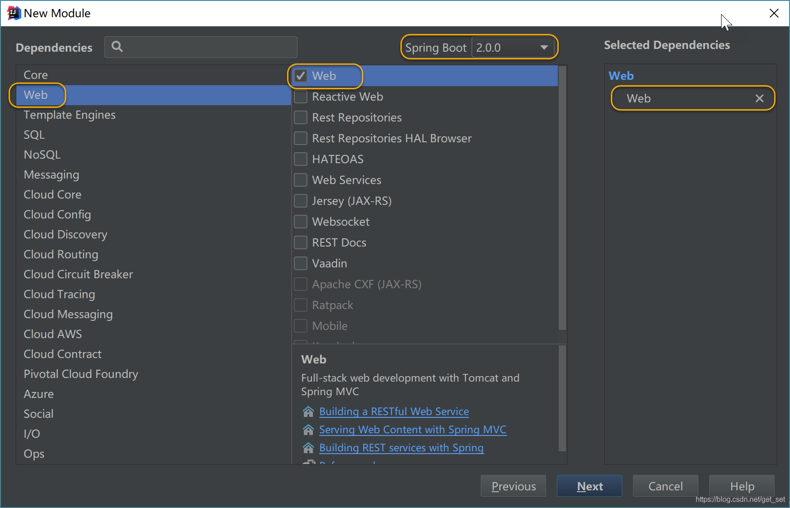


也可以使用网页版的https://start.spring.io来创建项目：

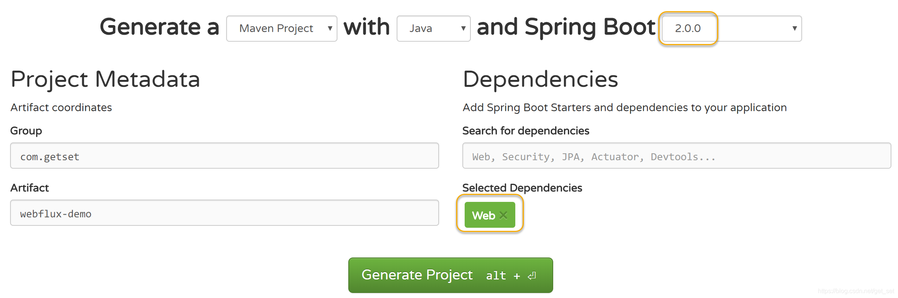


创建后的项目POM中，包含下边的依赖，即表示基于Spring WebMVC：

```
    <dependency>
        <groupId>org.springframework.boot</groupId>
        <artifactId>spring-boot-starter-web</artifactId>
    </dependency>

```

**2）创建Controller和Endpoint**

创建Controller类`HelloController`，仅提供一个Endpoint：`/hello`：

```java
    @RestController
    public class HelloController {
    
        @GetMapping("/hello")
        public String hello() {
            return "Welcome to reactive world ~";
        }
    }

```

**3）启动应用**

OK了，一个简单的基于Spring WebMVC的Web服务。我们新增了`HelloController.java`，修改了`application.properties`。

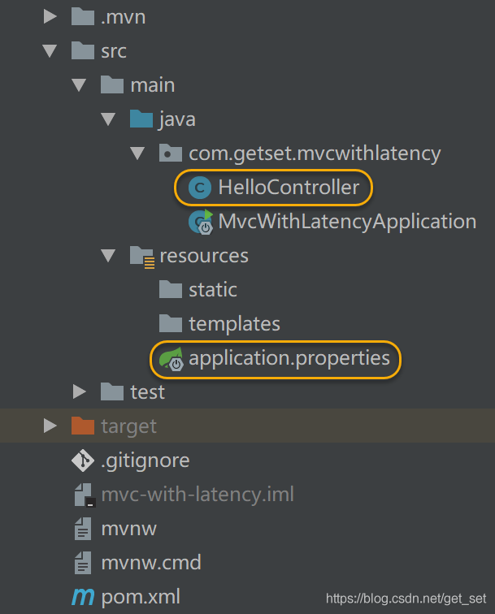


使用IDE启动应用，或使用[maven](https://so.csdn.net/so/search?q=maven&spm=1001.2101.3001.7020)命令：

```
mvn spring-boot:run

```

通过打印的log可以看到，服务运行于Tomcat的8080端口：


测试Endpoint。在浏览器中访问`http://localhost:8080/hello`，或运行命令：

```
curl http://localhost:8080/hello

```

返回`Welcome to reactive world ~`。

基于Spring WebFlux的项目与上边的步骤一致，仅有两点不同。我们这次偷个懒，就不从新建项目了，修改一下上边的项目：

**4）依赖“Reactive Web”的starter而不是“Web”**

修改项目POM，调整依赖使其基于Spring WebFlux：

```
    <dependency>
        <groupId>org.springframework.boot</groupId>
        <artifactId>spring-boot-starter-webflux</artifactId>    <!--【改】增加“flux”四个字符-->
    </dependency>

```

**5）Controller中处理请求的返回类型采用响应式类型**

```java
    @RestController
    public class HelloController {
    
        @GetMapping("/hello")
        public Mono<String> hello() {   // 【改】返回类型为Mono<String>
            return Mono.just("Welcome to reactive world ~");     // 【改】使用Mono.just生成响应式数据
        }
    }
12345678
```

**6）启动应用**

仅需要上边两步就改完了，是不是很简单，同样的方法启动应用。启动后发现应用运行于Netty上：


访问`http://localhost:8080/hello`，结果与Spring WebMVC的相同。

**7）总结**

从上边这个非常非常简单的例子中可以看出，Spring真是用心良苦，WebFlux提供了与之前WebMVC相同的一套注解来定义请求的处理，使得Spring使用者迁移到响应式开发方式的过程变得异常轻松。

虽然我们只修改了少量的代码，但是其实这个简单的项目已经脱胎换骨了。整个技术栈从命令式的、同步阻塞的【spring-webmvc + servlet + Tomcat】变成了响应式的、异步非阻塞的【spring-webflux + Reactor + Netty】。

Netty是一套异步的、事件驱动的网络应用程序框架和工具，能够开发高性能、高可靠性的网络服务器和客户端程序，因此与同样是异步的、事件驱动的响应式编程范式一拍即合。

> 下边的内容了解即可，就不实战了。
> 在Java 7推出异步I/O库，以及Servlet3.1增加了对异步I/O的支持之后，Tomcat等Servlet容器也随后开始支持异步I/O，然后Spring WebMVC也增加了对Reactor库的支持，所以上边第4）步如果不是将`spring-boot-starter-web`替换为`spring-boot-starter-WebFlux`，而是增加`reactor-core`的依赖的话，仍然可以用注解的方式开发基于Tomcat的响应式应用。

#### 1.3.3.2 WebFlux的函数式开发模式

既然是响应式编程了，有些朋友可能会想统一用函数式的编程风格，WebFlux满足你。WebFlux提供了一套函数式接口，可以用来实现类似MVC的效果。我们先接触两个常用的。

再回头瞧一眼上边例子中我们用`Controller`定义定义对Request的处理逻辑的方式，主要有两个点：

1. 方法定义处理逻辑；
2. 然后用`@RequestMapping`注解定义好这个方法对什么样url进行响应。

在WebFlux的函数式开发模式中，我们用`HandlerFunction`和`RouterFunction`来实现上边这两点。

- `HandlerFunction`相当于`Controller`中的具体处理方法，输入为请求，输出为装在`Mono`中的响应：

```java
    Mono<T extends ServerResponse> handle(ServerRequest request);
1
```

- `RouterFunction`，顾名思义，路由，相当于`@RequestMapping`，用来判断什么样的url映射到那个具体的`HandlerFunction`，输入为请求，输出为装在Mono里边的`Handlerfunction`：

```java
    Mono<HandlerFunction<T>> route(ServerRequest request);
1
```

我们看到，在WebFlux中，请求和响应不再是WebMVC中的`ServletRequest`和`ServletResponse`，而是`ServerRequest`和`ServerResponse`。后者是在响应式编程中使用的接口，它们提供了对非阻塞和回压特性的支持，以及Http消息体与响应式类型Mono和Flux的转换方法。

下面我们用函数式的方式开发两个Endpoint：

1. `/time`返回当前的时间；
2. `/date`返回当前的日期。

对于这两个需求，HandlerFunction很容易写：

```java
    // 返回包含时间字符串的ServerResponse
    HandlerFunction<ServerResponse> timeFunction = 
        request -> ServerResponse.ok().contentType(MediaType.TEXT_PLAIN).body(
            Mono.just("Now is " + new SimpleDateFormat("HH:mm:ss").format(new Date())), String.class);
    
    // 返回包含日期字符串的ServerResponse
    HandlerFunction<ServerResponse> dateFunction = 
        request -> ServerResponse.ok().contentType(MediaType.TEXT_PLAIN).body(
            Mono.just("Today is " + new SimpleDateFormat("yyyy-MM-dd").format(new Date())), String.class);

```

那么RouterFunction为：

```java
    RouterFunction<ServerResponse> router = 
        RouterFunctions.route(GET("/time"), timeFunction)
            .andRoute(GET("/date"), dateFunction);

```

> 按照常见的套路，`RouterFunctions`是工具类。

不过这么写在业务逻辑复杂的时候不太好组织，我们通常采用跟MVC类似的代码组织方式，将同类业务的HandlerFunction放在一个类中，然后在Java Config中将RouterFunction配置为Spring容器的Bean。我们继续在第一个例子的代码上开发：

**1）创建统一存放处理时间的Handler类**

创建`TimeHandler.java`：

```java
    import static org.springframework.web.reactive.function.server.ServerResponse.ok;

    @Component
    public class TimeHandler {
        public Mono<ServerResponse> getTime(ServerRequest serverRequest) {
            return ok().contentType(MediaType.TEXT_PLAIN).body(Mono.just("Now is " + new SimpleDateFormat("HH:mm:ss").format(new Date())), String.class);
        }
        public Mono<ServerResponse> getDate(ServerRequest serverRequest) {
            return ok().contentType(MediaType.TEXT_PLAIN).body(Mono.just("Today is " + new SimpleDateFormat("yyyy-MM-dd").format(new Date())), String.class);
        }
    }

```

> 由于出现次数通常比较多，这里静态引入`ServerResponse.ok()`方法。

**2）在Spring容器配置RouterFunction**

我们采用Spring现在比较推荐的Java Config的配置Bean的方式，创建用于存放Router的配置类`RouterConfig.java`：

```java
    import static org.springframework.web.reactive.function.server.RequestPredicates.GET;
    import static org.springframework.web.reactive.function.server.RouterFunctions.route;
    
    @Configuration
    public class RouterConfig {
        @Autowired
        private TimeHandler timeHandler;
    
        @Bean
        public RouterFunction<ServerResponse> timerRouter() {
            return route(GET("/time"), req -> timeHandler.getTime(req))
                    .andRoute(GET("/date"), timeHandler::getDate);  // 这种方式相对于上一行更加简洁
        }
    }

```

**3）重启服务试一试**

重启服务测试一下吧：

```
$ curl http://localhost:8080/date
Today is 2018-02-26

$ curl http://localhost:8080/time
Now is 21:12:53
12345
```

#### 1.3.3.3 服务器推送

我们可能会遇到一些需要网页与服务器端保持连接（起码看上去是保持连接）的需求，比如类似微信网页版的聊天类应用，比如需要频繁更新页面数据的监控系统页面或股票看盘页面。我们通常采用如下几种技术：

- 短轮询：利用ajax定期向服务器请求，无论数据是否更新立马返回数据，高并发情况下可能会对服务器和带宽造成压力；
- 长轮询：利用comet不断向服务器发起请求，服务器将请求暂时挂起，直到有新的数据的时候才返回，相对短轮询减少了请求次数；
- SSE：服务端推送（Server Send Event），在客户端发起一次请求后会保持该连接，服务器端基于该连接持续向客户端发送数据，从HTML5开始加入。
- Websocket：这是也是一种保持连接的技术，并且是双向的，从HTML5开始加入，并非完全基于HTTP，适合于频繁和较大流量的双向通讯场景。

既然响应式编程是一种基于数据流的编程范式，自然在服务器推送方面得心应手，我们基于函数式方式再增加一个Endpoint `/times`，可以每秒推送一次时间。

**1）增加Handler方法**

`TimeHandler.java`：

```java
    public Mono<ServerResponse> sendTimePerSec(ServerRequest serverRequest) {
        return ok().contentType(MediaType.TEXT_EVENT_STREAM).body(  // 1
                Flux.interval(Duration.ofSeconds(1)).   // 2
                        map(l -> new SimpleDateFormat("HH:mm:ss").format(new Date())), 
                String.class);
    }

```

1. `MediaType.TEXT_EVENT_STREAM`表示`Content-Type`为`text/event-stream`，即SSE；
2. 利用interval生成每秒一个数据的流。

**2）配置router**

`RouterConfig.java`：

```java
        @Bean
        public RouterFunction<ServerResponse> timerRouter() {
            return route(GET("/time"), timeHandler::getTime)
                    .andRoute(GET("/date"), timeHandler::getDate)
                    .andRoute(GET("/times"), timeHandler::sendTimePerSec);  // 增加这一行
        }

```

**3）重启服务试一下**

重启服务后，测试一下：

```
curl http://localhost:8080/times
data:21:32:22
data:21:32:23
data:21:32:24
data:21:32:25
data:21:32:26
<Ctrl+C>
1234567
```

就酱，访问这个url会收到持续不断的报时数据（时间数据是在`data`中的）。

那么用注解的方式如何进行服务端推送呢，这个演示就融到下一个例子中吧~

#### 1.3.3.3 响应式Spring Data

开发基于响应式流的应用，就像是在搭建数据流流动的管道，从而异步的数据能够顺畅流过每个环节。前边的例子主要聚焦于应用层，然而绝大多数系统免不了要与数据库进行交互，所以我们也需要响应式的持久层API和支持异步的数据库驱动。就像从自来水厂到家里水龙头这个管道中，如果任何一个环节发生了阻塞，那就可能造成整体吞吐量的下降。

各个数据库都开始陆续推出异步驱动，目前Spring Data支持的可以进行响应式数据访问的数据库有MongoDB、Redis、Apache Cassandra和CouchDB。今天我们用MongoDB来写一个响应式demo。

我们这个例子很简单，就是关于`User`的增删改查，以及基于注解的服务端推送。

**1）编写User**

既然是举例，我们随便定义几个属性吧~

```java
    public class User {
        private String id;
        private String username;
        private String phone;
        private String email;
        private String name;
        private Date birthday;
    }

```

然后为了方便开发，我们引入lombok库，它能够通过注解的方式为我们添加必要的Getter/Setter/hashCode()/equals()/toString()/构造方法等，添加依赖（版本可自行到http://search.maven.org搜索最新）：

```
	<dependency>
		<groupId>org.projectlombok</groupId>
		<artifactId>lombok</artifactId>
		<version>1.16.20</version>
	</dependency>
12345
```

然后为`User`添加注解：

```java
    @Data   // 生成无参构造方法/getter/setter/hashCode/equals/toString
    @AllArgsConstructor // 生成所有参数构造方法
    @NoArgsConstructor  // @AllArgsConstructor会导致@Data不生成无参构造方法，需要手动添加@NoArgsConstructor，如果没有无参构造方法，可能会导致比如com.fasterxml.jackson在序列化处理时报错
    public class User {
        ...
12345
```

我们可以利用IDE看一下生成的方法（如下图黄框所示）：

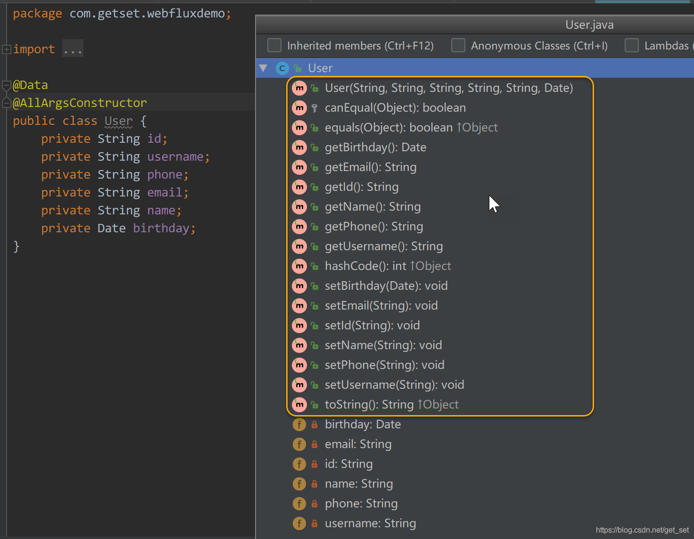


> 可能需要先在IDE中进行少量配置以便支持lombok的注解，比如IntelliJ IDEA：
>
> 1. 安装“lombok plugin”：
>    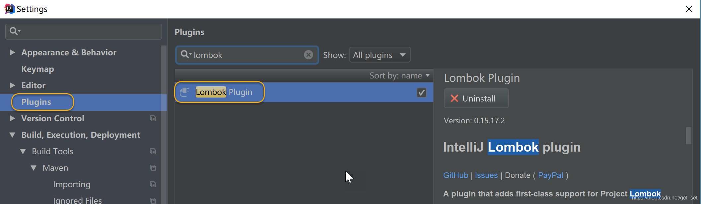

> 1. 开启对注解编译的支持：
>    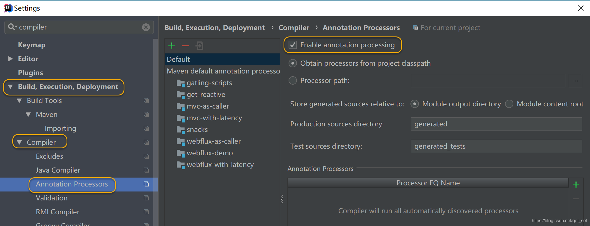

lombok对于Java开发者来说绝对算是个福音了，希望使用Kotlin的朋友不要笑话我们土哦~

**2）增加Spring Data的依赖**

在POM中增加Spring Data Reactive Mongo的依赖：

```
	<dependency>
		<groupId>org.springframework.boot</groupId>
		<artifactId>spring-boot-starter-data-mongodb-reactive</artifactId>
	</dependency>
1234
```

MongoDB是文档型的NoSQL数据库，因此，我们使用`@Document`注解`User`类：

```java
    @Data
    @AllArgsConstructor
    @Document
    public class User {
        @Id
        private String id;      // 注解属性id为ID
        @Indexed(unique = true) // 注解属性username为索引，并且不能重复
        private String username;
        private String name;
        private String phone;
        private Date birthday;
    }
123456789101112
```

OK，这样我们的模型就准备好了。MongoDB会自动创建collection，默认为类名首字母小写，也就是`user`。

**3）配置数据源**

Spring Boot为我们搞定了几乎所有的[配置](https://docs.spring.io/spring-boot/docs/current/reference/html/common-application-properties.html)，太赞了，下边是MongoDB的默认配置：

```
# MONGODB (MongoProperties)
spring.data.mongodb.authentication-database= # Authentication database name.
spring.data.mongodb.database=test # Database name.
spring.data.mongodb.field-naming-strategy= # Fully qualified name of the FieldNamingStrategy to use.
spring.data.mongodb.grid-fs-database= # GridFS database name.
spring.data.mongodb.host=localhost # Mongo server host. Cannot be set with uri.
spring.data.mongodb.password= # Login password of the mongo server. Cannot be set with uri.
spring.data.mongodb.port=27017 # Mongo server port. Cannot be set with uri.
spring.data.mongodb.repositories.enabled=true # Enable Mongo repositories.
spring.data.mongodb.uri=mongodb://localhost/test # Mongo database URI. Cannot be set with host, port and credentials.
spring.data.mongodb.username= # Login user of the mongo server. Cannot be set with uri.

```

请根据需要添加自定义的配置，比如我的MongoDB是跑在IP为192.168.0.101的虚拟机的Docker中的，就可在`application.properties`中增加一条：

```
spring.data.mongodb.host=192.168.0.101

```

**4）增加DAO层repository**

与非响应式Spring Data的`CrudReposity`对应的，响应式的Spring Data也提供了相应的Repository库：`ReactiveCrudReposity`，当然，我们也可以使用它的子接口`ReactiveMongoRepository`。

我们增加`UserRepository`：

```java
    public interface UserRepository extends ReactiveCrudRepository<User, String> {  // 1
        Mono<User> findByUsername(String username);     // 2
        Mono<Long> deleteByUsername(String username);
    }

```

1. 同样的，`ReactiveCrudRepository`的泛型分别是`User`和`ID`的类型；
2. `ReactiveCrudRepository`已经提供了基本的增删改查的方法，根据业务需要，我们增加四个方法（在此膜拜一下Spring团队的牛人们，使得我们仅需按照规则定义接口方法名即可完成DAO层逻辑的开发，牛~）

**5）Service层**

由于业务逻辑几乎为零，只是简单调用了DAO层，直接贴代码：

```java
    @Service
    public class UserService {
        @Autowired
        private UserRepository userRepository;
    
        /**
         * 保存或更新。
         * 如果传入的user没有id属性，由于username是unique的，在重复的情况下有可能报错，
         * 这时找到以保存的user记录用传入的user更新它。
         */
        public Mono<User> save(User user) {
            return userRepository.save(user)
                    .onErrorResume(e ->     // 1
                            userRepository.findByUsername(user.getUsername())   // 2
                                    .flatMap(originalUser -> {      // 4
                                        user.setId(originalUser.getId());
                                        return userRepository.save(user);   // 3
                                    }));
        }
    
        public Mono<Long> deleteByUsername(String username) {
            return userRepository.deleteByUsername(username);
        }
    
        public Mono<User> findByUsername(String username) {
            return userRepository.findByUsername(username);
        }
        
        public Flux<User> findAll() {
            return userRepository.findAll();
        }
    }


```

1. `onErrorResume`进行错误处理；
2. 找到username重复的记录；
3. 拿到ID从而进行更新而不是创建；
4. 由于函数式为`User -> Publisher`，所以用`flatMap`。

**6）Controller层**

直接贴代码：

```java
    @RestController
    @RequestMapping("/user")
    public class UserController {
        @Autowired
        private UserService userService;
    
        @PostMapping("")
        public Mono<User> save(User user) {
            return this.userService.save(user);
        }
    
        @DeleteMapping("/{username}")
        public Mono<Long> deleteByUsername(@PathVariable String username) {
            return this.userService.deleteByUsername(username);
        }
    
        @GetMapping("/{username}")
        public Mono<User> findByUsername(@PathVariable String username) {
            return this.userService.findByUsername(username);
        }
    
        @GetMapping("")
        public Flux<User> findAll() {
            return this.userService.findAll();
        }
    }

1234567891011121314151617181920212223242526
```

**7）启动应用测试一下**

由于涉及到POST和DELETE方法的请求，建议用支持RESTful的client来测试，比如“Restlet client”：


如图，增加操作是成功的，只要username不变，再次发送请求会更新该记录。

> 图中birthday的时间差8小时，不去管它。

用同样的方法增加一个李四，之后我们再来测试一下查询。

1. 根据用户名查询（METHOD:GET URL:http://localhost:8080/user/zhangsan），下边输出是格式化的JSON：

   {
   “id”: “5a9504a167646d057051e229”,
   “username”: “zhangsan”,
   “name”: “张三”,
   “phone”: “18610861861”,
   “birthday”: “1989-12-31T16:00:00.000+0000”
   }

2. 查询全部（METHOD:GET URL:http://localhost:8080/user）

   [{“id”:“5a9504a167646d057051e229”,“username”:“zhangsan”,“name”:“张三”,“phone”:“18610861861”,“birthday”:“1989-12-31T16:00:00.000+0000”},{“id”:“5a9511db67646d3c782f2e7f”,“username”:“lisi”,“name”:“李四”,“phone”:“18610861862”,“birthday”:“1992-02-01T16:00:00.000+0000”}]

测试一下删除（METHOD:DELETE URL:http://localhost:8080/user/zhangsan），返回值为1，再查询全部，发现张三已经被删除了，OK。

**8）stream+json**

看到这里细心的朋友可能会有点嘀咕，怎么看是不是异步的呢？毕竟查询全部的时候，结果都用中括号括起来了，这和原来返回`List<User>`的效果似乎没多大区别。假设一下查询100个数据，如果是异步的话，以我们对“异步响应式流”的印象似乎应该是一个一个至少是一批一批的到达客户端的嘛。我们加个延迟验证一下：

```java
	@GetMapping("")
	public Flux<User> findAll() {
	    return this.userService.findAll().delayElements(Duration.ofSeconds(1));
	}
1234
```

每个元素都延迟1秒，现在我们在数据库里弄三条记录，然后请求查询全部的那个URL，发现并不是像`/times`一样一秒一个地出来，而是3秒之后一块儿出来的。果然如此，这一点都不响应式啊！

与`/times`类似，我们也加一个MediaType，不过由于这里返回的是JSON，因此不能使用`TEXT_EVENT_STREAM`，而是使用`APPLICATION_STREAM_JSON`，即`application/stream+json`格式。

```
@GetMapping(value = "", produces = MediaType.APPLICATION_STREAM_JSON_VALUE)
public Flux<User> findAll() {
    return this.userService.findAll().delayElements(Duration.ofSeconds(2));
}
1234
```

1. `produces`后边的值应该是`application/stream+json`字符串，因此用`APPLICATION_STREAM_JSON_VALUE`。

重启服务再次请求，发现三个user是一秒一个的速度出来的，中括号也没有了，而是一个一个独立的JSON值构成的json [stream](https://so.csdn.net/so/search?q=stream&spm=1001.2101.3001.7020)：

```
{"id":"5a9504a167646d057051e229","username":"zhangsan","name":"张三","phone":"18610861861","birthday":"1989-12-31T16:00:00.000+0000"}
{"id":"5a9511db67646d3c782f2e7f","username":"lisi","name":"李四","phone":"18610861862","birthday":"1992-02-01T16:00:00.000+0000"}
{"id":"5a955f08fa10b93ec48df37f","username":"wangwu","name":"王五","phone":"18610861865","birthday":"1995-05-04T16:00:00.000+0000"}
123
```

**9）总结**

如果有Spring Data开发经验的话，切换到Spring Data Reactive的难度并不高。跟Spring WebFlux类似：原来返回`User`的话，那现在就返回`Mono<User>`；原来返回`List<User>`的话，那现在就返回`Flux<User>`。

对于稍微复杂的业务逻辑或一些必要的异常处理，比如上边的save方法，请一定采用响应式的编程方式来定义，从而一切都是异步非阻塞的。如下图所示，从HttpServer（如Netty或Servlet3.1以上的Servlet容器）到ServerAdapter（Spring WebFlux框架提供的针对不同server的适配器），到我们编写的Controller和DAO，以及异步数据库驱动，构成了一个完整的异步非阻塞的管道，里边流动的就是响应式流。

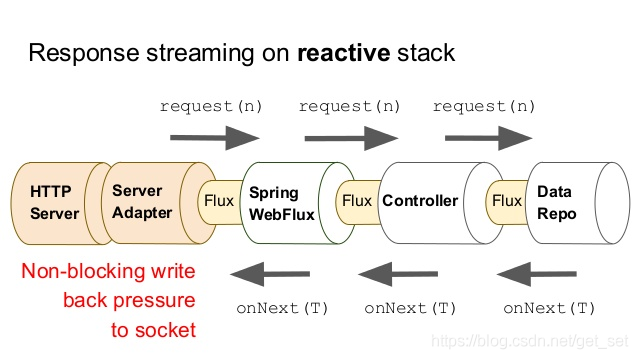

#### 1.3.3.4 使用`WebClient`开发响应式Http客户端

下面，我们用WebClient测试一下前边几个例子的成果。

**1) /hello，返回Mono**

```java
    @Test
    public void webClientTest1() throws InterruptedException {
        WebClient webClient = WebClient.create("http://localhost:8080");   // 1
        Mono<String> resp = webClient
                .get().uri("/hello") // 2
                .retrieve() // 3
                .bodyToMono(String.class);  // 4
        resp.subscribe(System.out::println);    // 5
        TimeUnit.SECONDS.sleep(1);  // 6
    }

```

1. 创建`WebClient`对象并指定baseUrl；
2. HTTP GET；
3. 异步地获取response信息；
4. 将response body解析为字符串；
5. 打印出来；
6. 由于是异步的，我们将测试线程sleep 1秒确保拿到response，也可以像前边的例子一样用`CountDownLatch`。

运行效果如下：
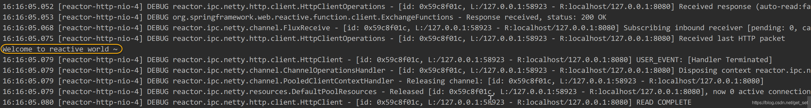

**2） /user，返回Flux**

为了多演示一些不同的实现方式，下边的例子我们调整几个地方，但是效果跟上边是一样的：

```java
    @Test
    public void webClientTest2() throws InterruptedException {
        WebClient webClient = WebClient.builder().baseUrl("http://localhost:8080").build(); // 1
        webClient
                .get().uri("/user")
                .accept(MediaType.APPLICATION_STREAM_JSON) // 2
                .exchange() // 3
                .flatMapMany(response -> response.bodyToFlux(User.class))   // 4
                .doOnNext(System.out::println)  // 5
                .blockLast();   // 6
    }

```

1. 这次我们使用WebClientBuilder来构建WebClient对象；
2. 配置请求Header：`Content-Type: application/stream+json`；
3. 获取response信息，返回值为`ClientResponse`，`retrive()`可以看做是`exchange()`方法的“快捷版”；
4. 使用`flatMap`来将ClientResponse映射为Flux；
5. 只读地peek每个元素，然后打印出来，它并不是subscribe，所以不会触发流；
6. 上个例子中sleep的方式有点low，`blockLast`方法，顾名思义，在收到最后一个元素前会阻塞，响应式业务场景中慎用。

运行效果如下：
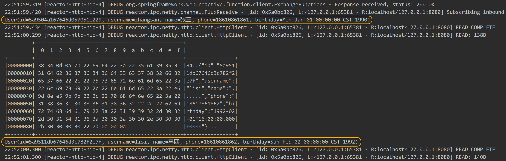

**3） /times，服务端推送**

```java
    @Test
    public void webClientTest3() throws InterruptedException {
        WebClient webClient = WebClient.create("http://localhost:8080");
        webClient
                .get().uri("/times")
                .accept(MediaType.TEXT_EVENT_STREAM)    // 1
                .retrieve()
                .bodyToFlux(String.class)
                .log()  // 2
                .take(10)   // 3
                .blockLast();
    }

```

1. 配置请求Header：`Content-Type: text/event-stream`，即SSE；
2. 这次用`log()`代替`doOnNext(System.out::println)`来查看每个元素；
3. 由于`/times`是一个无限流，这里取前10个，会导致流**被取消**；

运行效果如下：
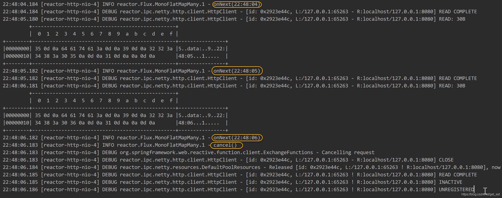

#### 1.3.3.5 让数据在Http上双向无限流动起来

许多朋友看到这个题目会想到Websocket，的确，Websocket确实可以实现全双工通信，但它的数据传输并非是完全基于HTTP协议的，关于Websocket我们后边再聊。

下面我们实现一个这样两个Endpoint：

- POST方法的`/events`，“源源不断”地收集数据，并存入数据库；
- GET方法的`/events`，“源源不断”将数据库中的记录发出来。

**0）准备**

一、数据模型`MyEvent`：

```java
    @Data
    @AllArgsConstructor
    @NoArgsConstructor
    @Document(collection = "event") // 1
    public class MyEvent {
        @Id
        private Long id;    // 2
        private String message;
    }
123456789
```

1. 指定collection名为`event`；
2. 这次我们使用表示时间的long型数据作为ID。

二、DAO层：

```java
    public interface MyEventRepository extends ReactiveMongoRepository<MyEvent, Long> { // 1
    }
12
```

1. 下边用到了可以保存Flux的`insert(Flux)`方法，这个方法是在`ReactiveMongoRepository`中定义的。

三、简单起见就不要Service层了，直接Controller：

```java
    @RestController
    @RequestMapping("/events")
    public class MyEventController {
        @Autowired
        private MyEventRepository myEventRepository;
    
        @PostMapping(path = "")
        public Mono<Void> loadEvents(@RequestBody Flux<MyEvent> events) {   // 1
            // TODO
            return null;
        }
    
        @GetMapping(path = "", produces = MediaType.APPLICATION_STREAM_JSON_VALUE)
        public Flux<MyEvent> getEvents() {  // 2
            // TODO
            return null;
        }
    }


```

1. POST方法的接收数据流的Endpoint，所以传入的参数是一个Flux，返回结果其实就看需要了，我们用一个`Mono<Void>`作为方法返回值，表示如果传输完的话只给一个“完成信号”就OK了；
2. GET方法的无限发出数据流的Endpoint，所以返回结果是一个`Flux<MyEvent>`，不要忘了注解上`produces = MediaType.APPLICATION_STREAM_JSON_VALUE`。

准备到此为止，类如下。我们来完成上边的两个TODO吧。

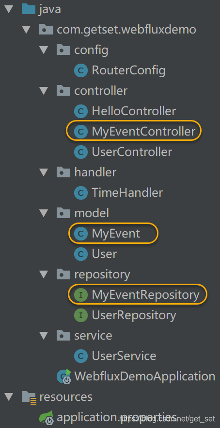


**1）接收数据流的Endpoint**

在客户端，`WebClient`可以接收`text/event-stream`和`application/stream+json`格式的数据流，也可以在请求的时候上传一个数据流到服务器；
在服务端，WebFlux也支持接收一个数据流作为请求参数，从而实现一个接收数据流的Endpoint。

我们先看服务端。Controller中的`loadEvents`方法：

```java
    @PostMapping(path = "", consumes = MediaType.APPLICATION_STREAM_JSON_VALUE) // 1
    public Mono<Void> loadEvents(@RequestBody Flux<MyEvent> events) {
        return this.myEventRepository.insert(events).then();    // 2
    }
1234
```

1. 指定传入的数据是`application/stream+json`，与`getEvents`方法的区别在于这个方法是`consume`这个数据流；
2. `insert`返回的是保存成功的记录的Flux，但我们不需要，使用`then`方法表示“忽略数据元素，只返回一个完成信号”。

服务端写好后，启动之，再看一下客户端怎么写（还是放在`src/test`下）：

```java
    @Test
    public void webClientTest4() {
        Flux<MyEvent> eventFlux = Flux.interval(Duration.ofSeconds(1))
                .map(l -> new MyEvent(System.currentTimeMillis(), "message-" + l)).take(5); // 1
        WebClient webClient = WebClient.create("http://localhost:8080");
        webClient
                .post().uri("/events")
                .contentType(MediaType.APPLICATION_STREAM_JSON) // 2
                .body(eventFlux, MyEvent.class) // 3
                .retrieve()
                .bodyToMono(Void.class)
                .block();
    }
12345678910111213
```

1. 声明速度为每秒一个MyEvent元素的数据流，不加`take`的话表示无限个元素的数据流；
2. 声明请求体的数据格式为`application/stream+json`；
3. `body`方法设置请求体的数据。

运行一下这个测试，根据控制台数据可以看到是一条一条将数据发到`/events`的，看一下MongoDB中的数据：

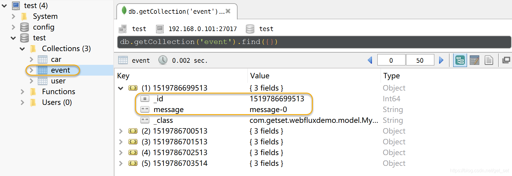


**2）发出无限流的Endpoint**

回想一下前边`/user`的例子，当数据库中所有的内容都查询出来之后，这个流就结束了，因为其后跟了一个“完成信号”，我们可以通过在`UserService`的`findAll()`方法的流上增加`log()`操作符来观察更详细的日志：


我们可以看到在三个`onNext`信号后是一个`onComplete`信号。

这样的流是有限流，这个时候如果在数据库中再新增一个User的话，已经结束的请求也不会再有新的内容出现了。

反观`/times`请求，它会无限地发出SSE，而不会有“完成信号”出现，这是无限流。

我们希望的情况是无论是请求GET的`/events`之后，当所有数据都发完之后，不要结束，而是挂起等待新的数据。如果我们用上边的POST的`/events`传入新的数据到数据库后，新的数据会自动地流到客户端。

这可以在DAO层配置实现：

```java
    public interface MyEventRepository extends ReactiveMongoRepository<MyEvent, Long> {
        @Tailable   // 1
        Flux<MyEvent> findBy(); // 2
    }

```

1. `@Tailable`注解的作用类似于linux的`tail`命令，被注解的方法将发送无限流，需要注解在返回值为Flux这样的多个元素的Publisher的方法上；
2. `findAll()`是想要的方法，但是在`ReactiveMongoRepository`中我们够不着，所以使用`findBy()`代替。

然后完成Controller中的方法：

```java
    @GetMapping(path = "", produces = MediaType.APPLICATION_STREAM_JSON_VALUE)
    public Flux<MyEvent> getEvents() {
        return this.myEventRepository.findBy();
    }
1234
```

不过，这还不够，`@Tailable`仅支持有大小限制的（“capped”）collection，而自动创建的collection是不限制大小的，因此我们需要先手动创建。Spring Boot提供的`CommandLineRunner`可以帮助我们实现这一点。

Spring Boot应用程序在启动后，会遍历CommandLineRunner接口的实例并运行它们的run方法。

```java
    @Bean   // 1
    public CommandLineRunner initData(MongoOperations mongo) {  // 2
        return (String... args) -> {    // 3
            mongo.dropCollection(MyEvent.class);    // 4
            mongo.createCollection(MyEvent.class, CollectionOptions.empty().size(200).capped()); // 5
        };
    }
1234567
```

1. 对于复杂的Bean只能通过Java Config的方式配置，这也是为什么Spring3之后官方推荐这种配置方式的原因，这段代码可以放到配置类中，本例我们就直接放到启动类`WebFluxDemoApplication`了；
2. `MongoOperations`提供对MongoDB的操作方法，由Spring注入的mongo实例已经配置好，直接使用即可；
3. `CommandLineRunner`也是一个函数式接口，其实例可以用lambda表达；
4. 如果有，先删除collection，生产环境慎用这种操作；
5. 创建一个记录个数为10的capped的collection，容量满了之后，新增的记录会覆盖最旧的。

启动应用，我们检查一下`event` collection：

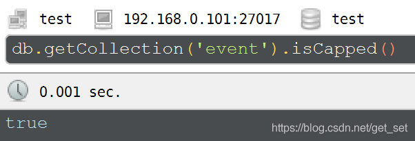


OK，这个时候我们请求一下`http://localhost:8080/events`，发现立马返回了，并没有挂起。原因在于collection中一条记录都没有，而`@Tailable`起作用的前提是至少有一条记录。

跑一下WebClient测试程序插入5条数据，然后再次请求：

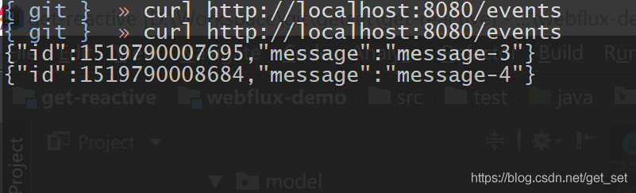


请求是挂起的，这没错，但是只有两条数据，看WebClient测试程序的控制台明明发出了5个请求啊。

原因定义的`CollectionOptions.empty().size(200).capped()`中，`size`指的是以字节为单位的大小，并且会向上取到256的整倍数，所以我们刚才定义的是256byte大小的collection，所以最多容纳两条记录。我们可以这样改一下：

```
CollectionOptions.empty().maxDocuments(200).size(100000).capped()
1
```

`maxDocuments`限制了记录条数，`size`限制容量且是必须定义的，因为MongoDB不像关系型数据库有严格的列和字段大小定义，鬼知道会存多大的数据进来，所以容量限制是必要的。

好了，再次启动应用，先插入5条数据，然后请求`/events`，收到5条记录后请求仍然挂起，在插入5条数据，curl客户端又会陆续收到新的数据。

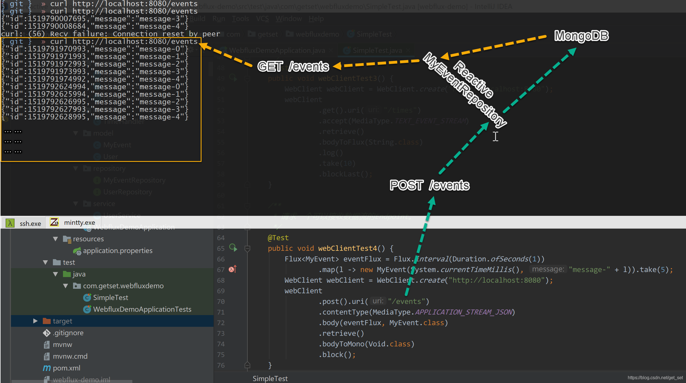

我们用代码搭建了图中箭头所表示的“管道”，看效果还是很畅通的嘛。现在再回想我们最初的那个Excel的例子，是不是感觉这个demo很有响应式的“范儿”了呢？

#### 1.3.3.6 总结

这一节，我们对WebFlux做了一个简单的基于实例的介绍，相信你对响应式编程及其在WEB应用中如何发挥作用有了更多的体会，本章的实战是比较基础的，初衷是希望能够通过上手编写代码体会响应式编程的感觉，因为切换到响应式思维方式并非易事。

这一章的核心关键词其实翻来覆去就是：“异步非阻塞的响应式流”。我们了解了异步非阻塞的好处，也知道如何让数据流动起来，下面我们就通过对实例的性能测试，借助实实在在的数据，真切感受一下异步非阻塞的“丝滑”。

# 参考

https://github.com/callicoder/spring-webflux-reactive-rest-api-demo