本系列其他文章见：[《响应式Spring的道法术器》](http://blog.csdn.net/get_set/article/details/79466657)。
前情提要：[Reactor快速上手](http://blog.csdn.net/get_set/article/details/79480172) | [Spring WebFlux快速上手](http://blog.csdn.net/get_set/article/details/79480233)
本文[源码](https://github.com/get-set/get-reactive/tree/master/gatling)

## 1.4 从负载测试看异步非阻塞的优势

前面总是“安利”异步非阻塞的好处，下面我们就实实在在感受一下响应式编程在高并发环境下的性能提升。异步非阻塞的优势体现在I/O操作方面，无论是文件I/O、网络I/O，还是数据库读写，都可能存在阻塞的情况。

我们的测试内容有三：

1. 首先分别创建基于WebMVC和WebFlux的Web服务，来对比观察异步非阻塞能带来多大的性能提升，我们模拟一个简单的带有延迟的场景，然后启动服务使用gatling进行测试，并进行分析；
2. 由于现在微服务架构应用越来越广泛，我们基于第一步的测试项目进一步观察调用存在延迟的服务的情况下的测试数据，其实主要是针对客户端的测试：阻塞的`RestTemplate`和非阻塞的`WebClient`；
3. 针对MongoDB的同步和异步数据库驱动进行性能测试和分析。

> 说明：本节进行的并非是严谨的基于性能调优的需求的，针对具体业务场景的负载测试。本节测试场景简单而直接，各位朋友GET到我的点即可。
> 此外：由于本节主要是进行横向对比测试，因此不需要特定的硬件资源配置，不过还是**建议在Linux环境下进行测试**，我最初是在Win10上跑的，当用户数上来之后出现了不少请求失败的情况，下边的测试数据是在一台系统为Deepin Linux（Debian系）的笔记本上跑出来的。

那么我们就开始搭建这套简单粗暴的测试环境吧~

### 1.4.1 带有延迟的负载测试分析

**1）搭建待测试项目**

我们分别基于WebMVC和WebFlux创建两个项目：`mvc-with-latency`和`WebFlux-with-latency`。

为了模拟阻塞，我们分别在两个项目中各创建一个带有延迟的`/hello/{latency}`的API。比如`/hello/100`的响应会延迟100ms。

`mvc-with-latency`中创建`HelloController.java`：

```java
    @RestController
    public class HelloController {
        @GetMapping("/hello/{latency}")
        public String hello(@PathVariable long latency) {
            try {
                TimeUnit.MILLISECONDS.sleep(latency);   // 1
            } catch (InterruptedException e) {
                return "Error during thread sleep";
            }
            return "Welcome to reactive world ~";
        }
    }
123456789101112
```

1. 利用sleep来模拟业务场景中发生阻塞的情况。

`WebFlux-with-latency`中创建`HelloController.java`：

```java
    @RestController
    public class HelloController {
        @GetMapping("/hello/{latency}")
        public Mono<String> hello(@PathVariable int latency) {
            return Mono.just("Welcome to reactive world ~")
                    .delayElement(Duration.ofMillis(latency)); // 1
        }
    }
12345678
```

1. 使用`delayElement`操作符来实现延迟。

然后各自在`application.properties`中配置端口号8091和8092：

```
server.port=8091
1
```

启动应用。

**2）编写负载测试脚本**

本节我们采用gatling来进行测试。创建测试项目`gatling-scripts`。

POM中添加gatling依赖和插件（目前gradle暂时还没有这个插件，所以只能是maven项目）：

```xml
    <dependencies>
        <dependency>
            <groupId>io.gatling.highcharts</groupId>
            <artifactId>gatling-charts-highcharts</artifactId>
            <version>2.3.0</version>
            <scope>test</scope>
        </dependency>
    </dependencies>
    <build>
        <plugins>
            <plugin>
                <groupId>io.gatling</groupId>
                <artifactId>gatling-maven-plugin</artifactId>
                <version>2.2.4</version>
            </plugin>
        </plugins>
    </build>

1234567891011121314151617
```

在`src/test`下创建测试类，gatling使用scala语言编写测试类：

```java
    import io.gatling.core.scenario.Simulation
    import io.gatling.core.Predef._
    import io.gatling.http.Predef._
    
    import scala.concurrent.duration._
    
    class LoadSimulation extends Simulation {
    
      // 从系统变量读取 baseUrl、path和模拟的用户数
      val baseUrl = System.getProperty("base.url")
      val testPath = System.getProperty("test.path")
      val sim_users = System.getProperty("sim.users").toInt
    
      val httpConf = http.baseURL(baseUrl)
    
      // 定义模拟的请求，重复30次
      val helloRequest = repeat(30) {
        // 自定义测试名称
        exec(http("hello-with-latency")
          // 执行get请求
          .get(testPath))
          // 模拟用户思考时间，随机1~2秒钟
          .pause(1 second, 2 seconds)
      }
    
      // 定义模拟的场景
      val scn = scenario("hello")
        // 该场景执行上边定义的请求
        .exec(helloRequest)
    
      // 配置并发用户的数量在30秒内均匀提高至sim_users指定的数量
      setUp(scn.inject(rampUsers(sim_users).over(30 seconds)).protocols(httpConf))
    }

123456789101112131415161718192021222324252627282930313233
```

如上，这个测试的场景是：

- 指定的用户量是在30秒时间内匀速增加上来的；
- 每个用户重复请求30次指定的URL，中间会随机间隔1~2秒的思考时间。

其中URL和用户量通过`base.url`、`test.path`、`sim.users`变量传入，借助maven插件，通过如下命令启动测试：

```shell
    mvn gatling:test -Dgatling.simulationClass=test.load.sims.LoadSimulation -Dbase.url=http://localhost:8091/ -Dtest.path=hello/100 -Dsim.users=300
1
```

就表示用户量为300的对`http://localhost:8091/hello/100`的测试。

**3）观察线程数量**

测试之前，我们打开jconsole观察应用（连接MVCWithLatencyApplication）的线程变化情况：

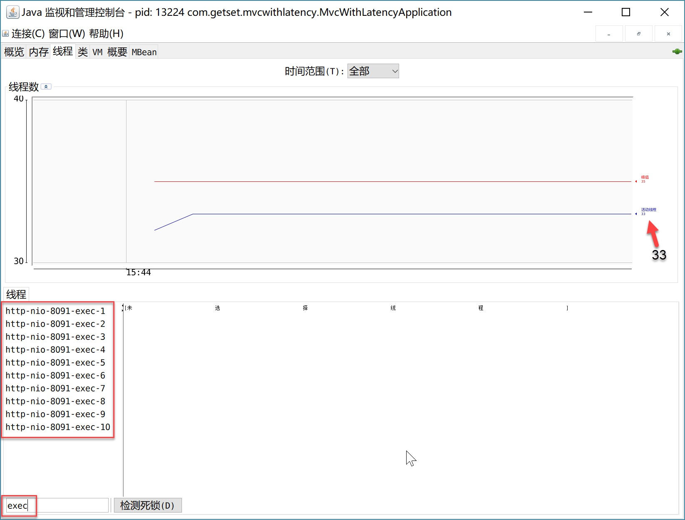


如图（分辨率问题显示不太好）是刚启动无任何请求进来的时候，默认执行线程有10个，总的线程数31-33个。

比如，当进行用户数为2500个的测试时，执行线程增加到了200个，总的线程数峰值为223个，就是增加的这190个执行线程。如下：


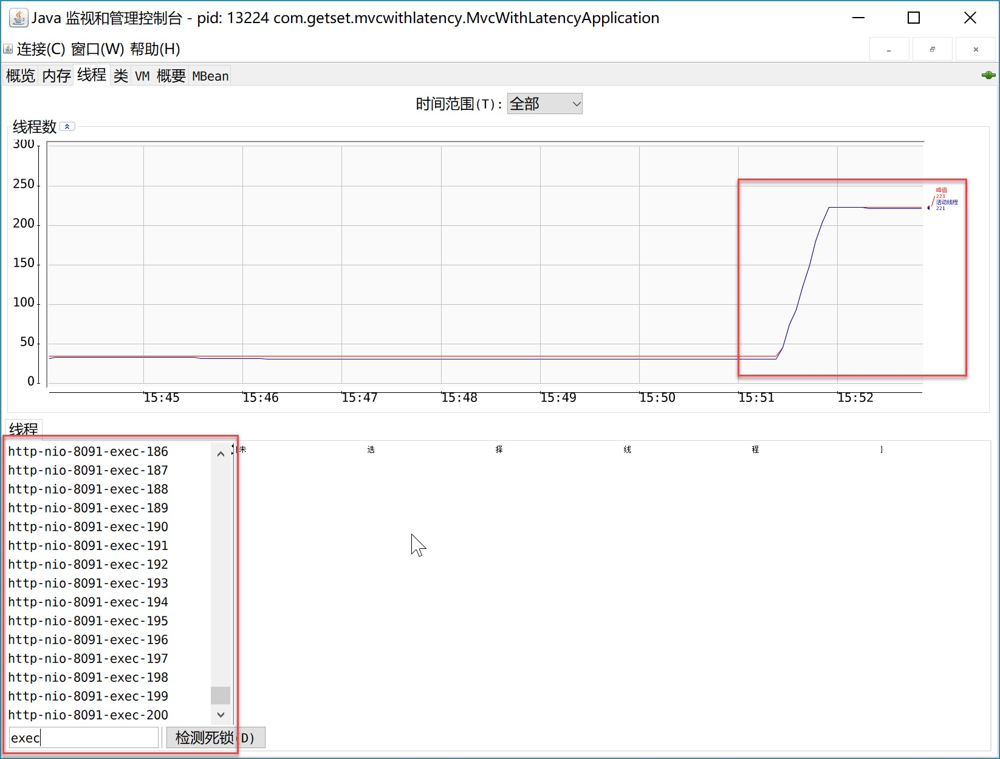

由于在负载过去之后，执行线程数量会随机减少回10个，因此看最大线程编号估算线程个数的话并不靠谱，我们可以用“峰值线程数-23”得到测试过程中的执行线程个数。

**4）负载测试**

首先我们测试`mvc-with-latency`：

- -Dbase.url=http://localhost:8091/；
- -Dtest.path=hello/100（延迟100ms）；
- -Dsim.users=1000/2000/3000/…/10000。

测试数据如下（Tomcat最大线程数200，延迟100ms）：

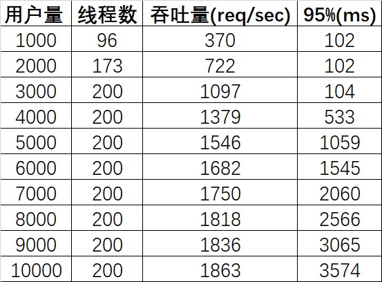

 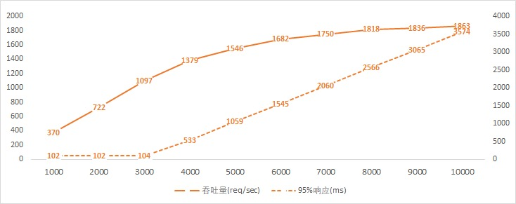


由以上数据可知：

1. 用户量在接近3000的时候，线程数达到默认的最大值200；
2. 线程数达到200前，95%的请求响应时长是正常的（比100ms多一点点），之后呈直线上升的态势；
3. 线程数达到200后，吞吐量增幅逐渐放缓。

这里我们不难得出原因，那就是当所有可用线程都在阻塞状态的话，后续再进入的请求只能排队，从而当达到最大线程数之后，响应时长开始上升。我们以6000用户的报告为例：

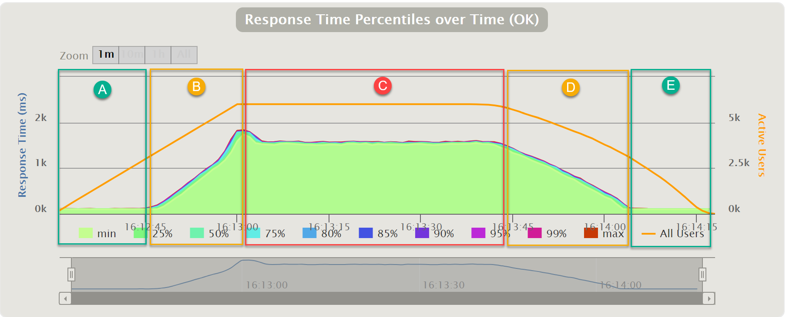

这幅图是请求响应时长随时间变化的图，可以看到大致可以分为五个段：

- A. 有空闲线程可用，请求可以在100ms+时间返回；
- B. 线程已满，新来的请求开始排队，因为A和B阶段是用户量均匀上升的阶段，所以排队的请求越来越多；
- C. 每秒请求量稳定下来，但是由于排队，维持一段时间的高响应时长；
- D. 部分用户的请求完成，每秒请求量逐渐下降，排队情况逐渐缓解；
- E. 用户量降至线程满负荷且队列消化后，请求在正常时间返回；

所有请求的响应时长分布如下图所示：

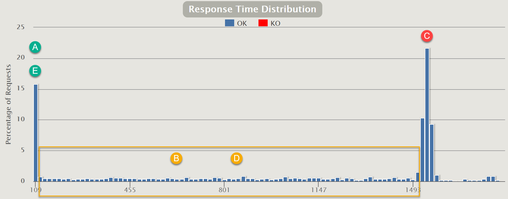

A/E段与C段的时长只差就是平均的排队等待时间。在持续的高并发情况下，大部分请求是处在C段的。而且等待时长随请求量的提高而线性增长。

增加Servlet容器处理请求的线程数量可以缓解这一问题，就像上边把最大线程数量从默认的200增加的400。

最高200的线程数是Tomcat的默认设置，我们将其设置为400再次测试。在`application.properties`中增加：

```
server.tomcat.max-threads=400
1
```

测试数据如下：

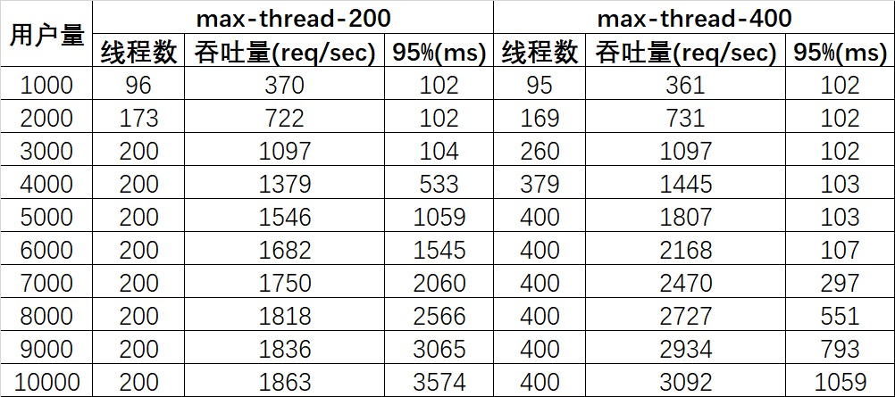

 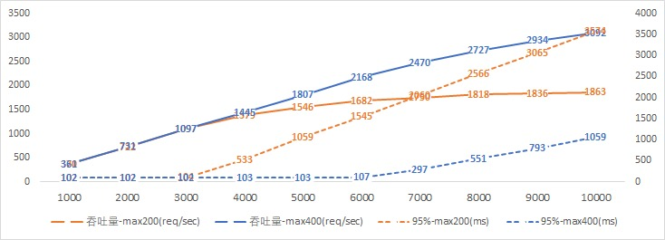


由于工作线程数扩大一倍，因此请求排队的情况缓解一半，具体可以对比一下数据：

1. “最大线程数200用户5000”的“95%响应时长”恰好与“最大线程数400用户10000”完全一致，我对天发誓，这绝对绝对是真实数据，更加巧合的是，吞吐量也恰好是1:2的关系！有此巧合也是因为测试场景太简单粗暴，哈哈；
2. “95%响应时长”的曲线斜率也是两倍的关系。

这也再次印证了我们上边的分析。增加线程数确实可以一定程度下提高吞吐量，降低因阻塞造成的响应延时，但此时我们需要权衡一些因素：

- 增加线程是有成本的，JVM中默认情况下在创建新线程时会分配大小为1M的线程栈，所以更多的线程异味着更多的内存；
- 更多的线程会带来更多的线程上下文切换成本。

我们再来看一下对于`WebFlux-with-latency`的测试数据：

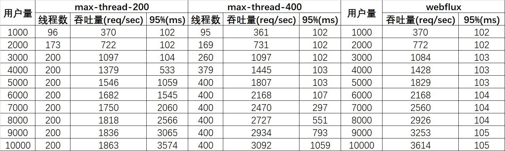


- 这里没有统计线程数量，因为对于运行在异步IO的Netty之上的WebFlux应用来说，其工作线程数量始终维持在一个固定的数量上，通常这个固定的数量等于CPU核数（通过jconsole可以看到有名为`reactor-http-nio-X`和`parallel-X`的线程，我这是四核八线程的i7，所以`X`从1-8），因为异步非阻塞条件下，程序逻辑是由事件驱动的，并不需要多线程并发；
- 随着用户数的增多，吞吐量基本呈线性增多的趋势；
- 95%的响应都在100ms+的可控范围内返回了，并未出现延时的情况。

可见，非阻塞的处理方式规避了线程排队等待的情况，从而可以用少量而固定的线程处理应对大量请求的处理。

> 除此之外，我又一步到位直接测试了一下20000用户的情况：
>
> 1. 对`mvc-with-latency`的测试由于出现了许多的请求fail而以失败告终；
> 2. 而`WebFlux-with-latency`应对20000用户已然面不改色心不慌，吞吐量达到7228 req/sec（我擦，正好是10000用户下的两倍，太巧了今天怎么了，绝对是真实数据！），95%响应时长仅117ms。

最后，再给出两个吞吐量和响应时长的图，更加直观地感受异步非阻塞的WebFlux是如何一骑绝尘的吧：

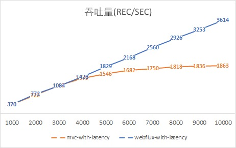 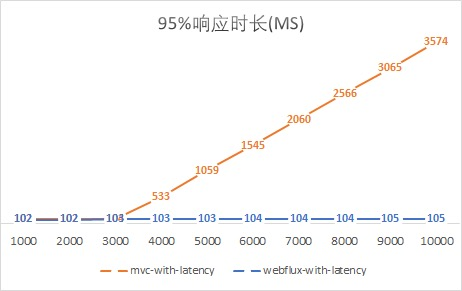

此时，我们更加理解了Nodejs的骄傲，不过我们大Java语言也有了Vert.x和现在的Spring WebFlux。

本节我们进行服务器端的性能测试，下一节继续分析Spring WebFlux的客户端工具WebClient的性能表现，它会对微服务架构的系统带来不小的性能提升呢！