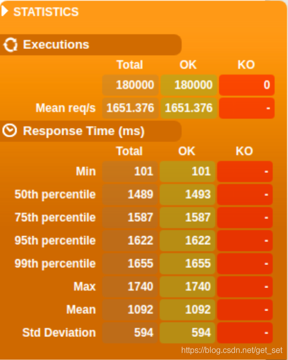
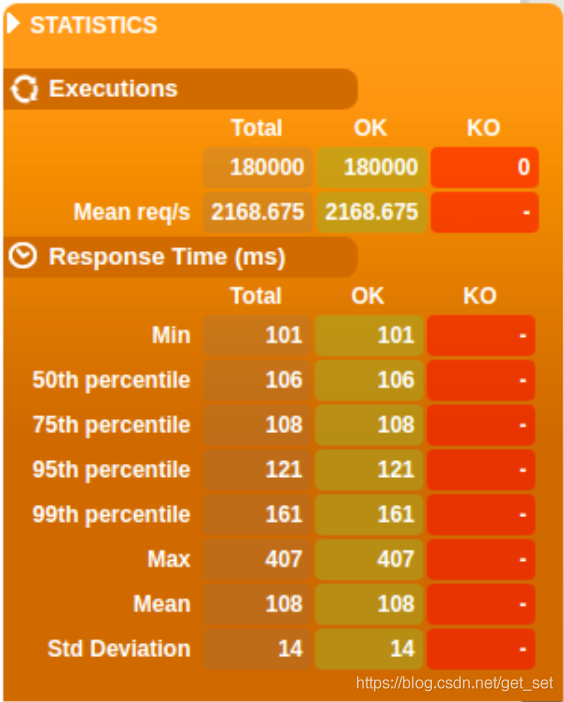
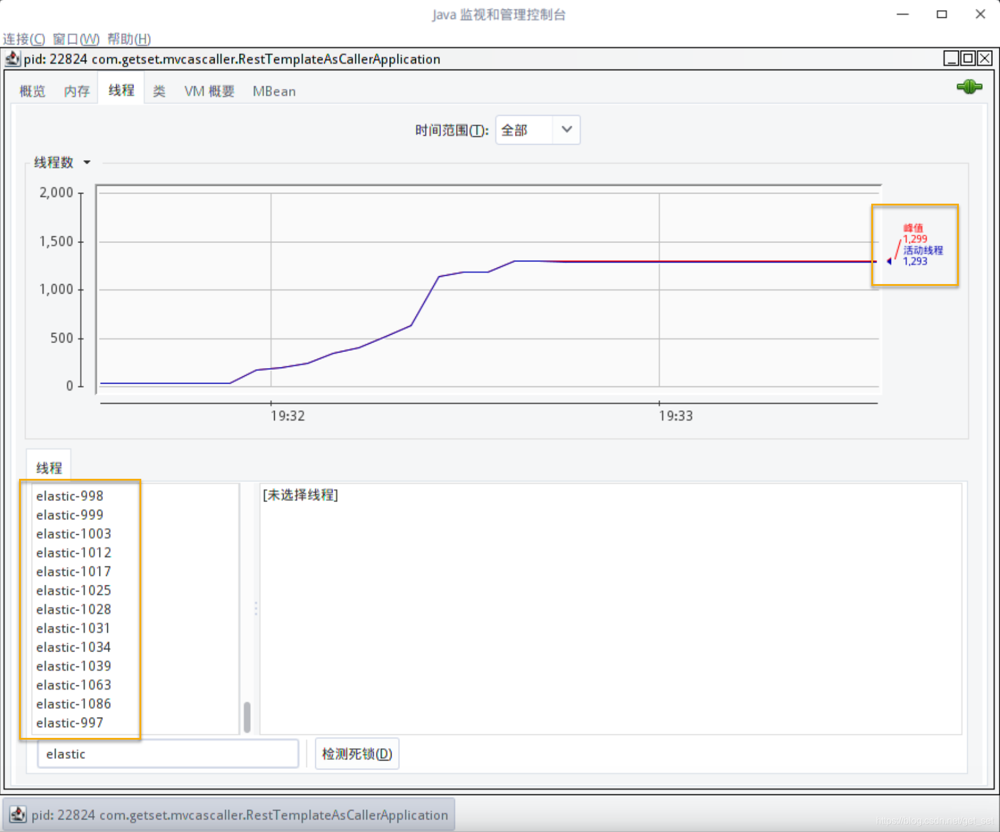
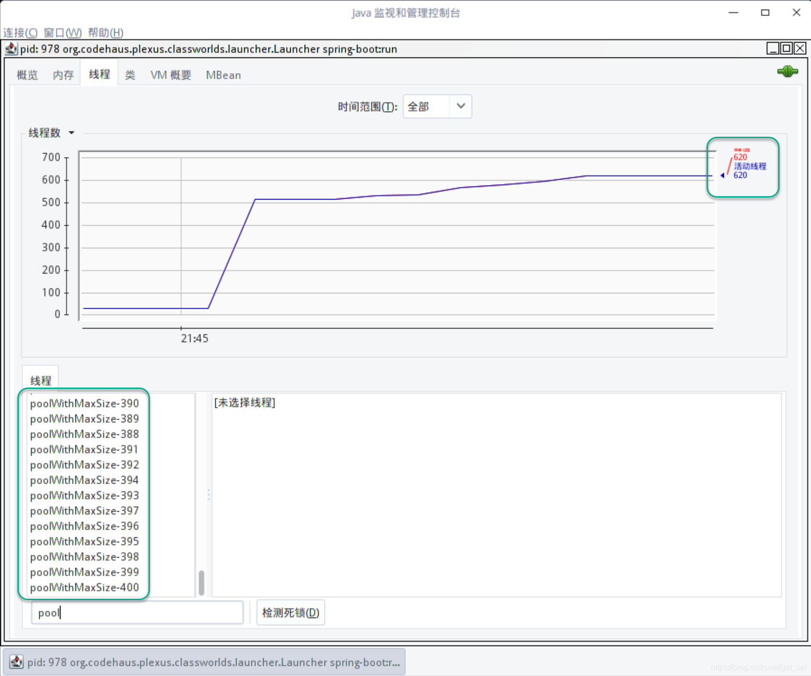
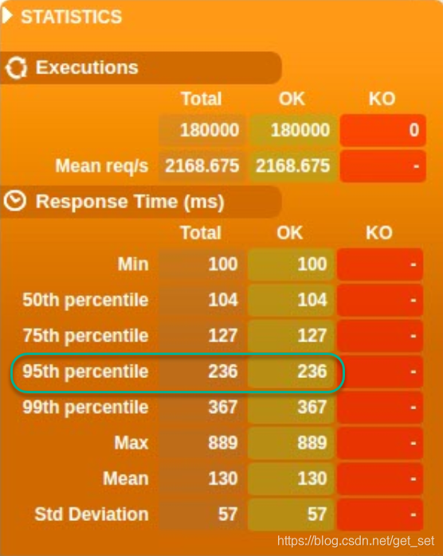
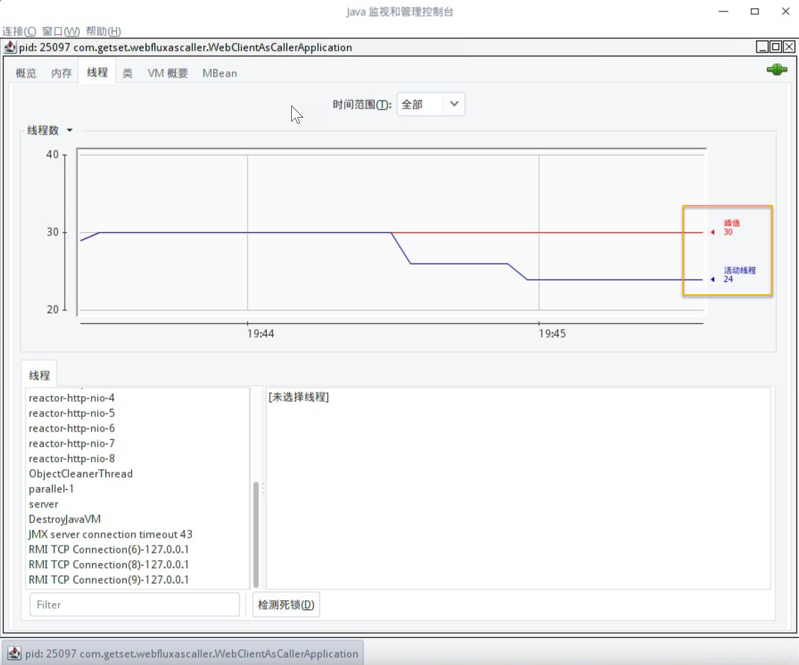

> 本系列其他文章见：[《响应式Spring的道法术器》](http://blog.csdn.net/get_set/article/details/79466657)。
> 前情提要：[Spring WebFlux快速上手](http://blog.csdn.net/get_set/article/details/79480233) | [Spring WebFlux性能测试](http://blog.csdn.net/get_set/article/details/79492439)
> 本文[源码](https://github.com/get-set/get-reactive/tree/master/gatling)

### 1.4.2 调用带有延迟的服务负载分析

由于微服务架构的盛行，大型系统内服务间基于HTTP API进行调用的会相当频繁。Netflix的系统有500+的微服务，感受一下~

我们的测试如下图所示，服务A调用服务B的API，从服务A发出请求到接收到响应，期间可能存在延迟，比如网络不稳定、服务B不稳定，或因为所请求的API本身执行时间略长等等。对于作为HTTP客户端的服务A来说，是否能够异步地处理对服务B的请求与响应，也会带来明显的性能差异。我们通过简单的场景模拟一下：


通过上一个测试，我们已经确定`WebFlux-with-latency`的API `/hello/{latency}`能够在高并发下，仍然以稳定的`latency`~`latency+5`ms的延迟做出响应，因此用来作为被调用的服务B，模拟带有延迟的服务。这样如果测试结果出现明显的差异，那么可以排除服务B的原因。

本次测试我们创建两个服务A的项目：`restTemplate-as-caller`和`webClient-as-caller`。它们也都提供URL为`/hello/{latency}`的API，在API的实现上都是通过Http请求服务A的`/hello/{latency}`，返回的数据作为自己的响应。区别在于：`restTemplate-as-caller`使用`RestTemplate`作为Http客户端，`webClient-as-caller`使用`WebClient`作为Http客户端。

**1）restTemplate-as-caller**

使用Spring Initializr创建一个依赖“Web”的项目（也就是WebMVC项目），POM依赖：

```
        <dependency>
            <groupId>org.springframework.boot</groupId>
            <artifactId>spring-boot-starter-web</artifactId>
        </dependency>
1234
```

端口号设置为8093，然后开发`/hello/{latency}`：

`HelloController.java`：

```java
    @RestController
    public class HelloController {
        private final String TARGET_HOST = "http://localhost:8092";
        private RestTemplate restTemplate;
    
        public HelloController() {  // 1
            PoolingHttpClientConnectionManager connectionManager = new PoolingHttpClientConnectionManager();
            connectionManager.setDefaultMaxPerRoute(1000);
            connectionManager.setMaxTotal(1000);
            this.restTemplate = new RestTemplate(new HttpComponentsClientHttpRequestFactory(
                    HttpClientBuilder.create().setConnectionManager(connectionManager).build()
            ));
    
        }
    
        @GetMapping("/hello/{latency}")
        public String hello(@PathVariable int latency) {
            return restTemplate.getForObject(TARGET_HOST + "/hello/" + latency, String.class);
        }
    }

1234567891011121314151617181920
```

1. 由于测试过程中，RestTemplate会发出大量请求，我们在Controller的构造方法中创建一个基于Http连接池构造的RestTemplate，否则可能会把系统能给的端口用尽而出错；
2. 使用RestTemplate请求服务B，并将响应返回。

启动服务`WebFlux-with-latency`和`restTemplate-as-caller`。

这个测试我们并不需要分析1000~10000的不同用户量场景下的响应时长的变化趋势，只是验证RestTemplate的阻塞性，所以直接测试一下6000用户，测试结果如下：



吞吐量为1651req/sec，95%响应时长为1622ms。

与1.4.1中`mvc-with-latency`的6000用户的结果类似，可见RestTemplate确实是会阻塞的。好吧，其实写个小@Test就能测出来是不是阻塞的，不过我的用意不仅限于此，下边我们进行一个响应式改造。首先请回忆前边介绍的两个内容：

1. 不知道你是否还记得在1.3.3.1的最后提过，用Spring WebMVC + Reactor（`spring-boot-starter-web`+`reactor-core`）也可以像WebFlux一样实现基于注解的响应式编程；
2. 在1.3.2.5介绍过如何利用elastic的调度器将阻塞的调用转化为异步非阻塞的。

基于此，我们来改一下代码。首先在pom.xml中增加`reactor-core`：

```
        <dependency>
            <groupId>io.projectreactor</groupId>
            <artifactId>reactor-core</artifactId>
            <version>3.1.4.RELEASE</version>
        </dependency>
12345
```

然后RestTemplate的调用转为异步：

```java
    @GetMapping("/hello/{latency}")
    public Mono<String> hello(@PathVariable int latency) {
        return Mono.fromCallable(() -> restTemplate.getForObject(TARGET_HOST + "/hello/" + latency, String.class))
                .subscribeOn(Schedulers.elastic());
    }
12345
```

再次测试，发现结果有了明显改善：



吞吐量为2169 req/sec，95%响应时长为121ms。

但是，使用`Schedulers.elastic()`其实就相当于将每一次阻塞的RestTemplate调用调度到不同的线程里去执行，效果如下：



因为不仅有处理请求的200个线程，还有`Schedulers.elastic()`给分配的工作线程，所以总的线程数量飙到了1000多个！不过在生产环境中，我们通常不会直接使用弹性线程池，而是使用线程数量可控的线程池，RestTemplate用完所有的线程后，更多的请求依然会造成排队的情况。

这一点使用`Schedulers.newParallel()`的调度器一测便知。

```java
    @RestController
    public class HelloController {
        private final String TARGET_HOST = "http://localhost:8092";
        private RestTemplate restTemplate;
        private Scheduler fixedPool;
    
        public HelloController() {
            PoolingHttpClientConnectionManager connectionManager = new PoolingHttpClientConnectionManager();
            connectionManager.setDefaultMaxPerRoute(1000);
            connectionManager.setMaxTotal(1000);
            this.restTemplate = new RestTemplate(new HttpComponentsClientHttpRequestFactory(
                    HttpClientBuilder.create().setConnectionManager(connectionManager).build()
            ));
            fixedPool = Schedulers.newParallel("poolWithMaxSize", 400); // 1
        }
    
        @GetMapping("/hello/{latency}")
    //    public String hello(@PathVariable int latency) {
    //        return restTemplate.getForObject(TARGET_HOST + "/hello/" + latency, String.class);
    //    }
        public Mono<String> hello(@PathVariable int latency) {
            return Mono.fromCallable(() -> restTemplate.getForObject(TARGET_HOST + "/hello/" + latency, String.class))
                    .subscribeOn(fixedPool);    // 2
        }
    }

12345678910111213141516171819202122232425
```

1. 创建一个有最大400个线程的线程池`poolWithMaxSize`；
2. 调度到这个线程池上。

测试时查看线程数：



可见，最多有400个名为`poolWithMaxSize`的线程，RestTemplate就工作在这些线程上，相比请求处理线程多了一倍。看一下最终的测试结果：



吞吐量2169req/sec，与弹性线程池的那次相同；95%响应时长为236ms，虽然达不到弹性线程池的效果，但是比完全同步阻塞的方式（RestTemplate在请求处理线程中执行）要好多了。

我们再看看非阻塞的`WebClient`表现如何吧。

**2）webClient-as-caller**

`webClient-as-caller`基于WebFlux的依赖，端口号8094，不多说，直接看Controller：

```java
    @RestController
    public class HelloController {
        private final String TARGET_HOST = "http://localhost:8092";
        private WebClient webClient;
    
        public HelloController() {
            this.webClient = WebClient.builder().baseUrl(TARGET_HOST).build();
        }
    
        @GetMapping("/hello/{latency}")
        public Mono<String> hello(@PathVariable int latency) {
            return webClient
                    .get().uri("/hello/" + latency)
                    .exchange()
                    .flatMap(clientResponse -> clientResponse.bodyToMono(String.class));
        }

12345678910111213141516
```

跑一下6000用户的测试：


吞吐量2195 req/sec，95%响应时长109ms。

关键的是，WebClient不需要大量并发的线程就可以漂亮地搞定这件事儿了：



**3）总结**

WebClient同样能够以少量而固定的线程数处理高并发的Http请求，在基于Http的服务间通信方面，可以取代RestTemplate以及AsyncRestTemplate。

异步非阻塞的Http客户端，请认准——WebClient~

下一节，介绍一下微服务先行者、全球最大的视频服务平台Netflix使用异步的Http客户端来改造其微服务网关的案例。