### 1.4.4 同步与异步数据库驱动的性能对比

许多数据库已陆续推出官方的异步驱动，在Spring Data Reactive中，已经集成了Mongo、Casandra、Redis、CouchDB的异步驱动。

> 在Spring WebFlux中使用 Reactive Mongo的示例见：http://blog.csdn.net/get_set/article/details/79480233。

这一节我们通过使用YSCB对MongoDB的同步和异步驱动的性能基准测试，来观察异步驱动的优势。

[YCSB（Yahoo! Cloud Serving Benchmark）](https://github.com/brianfrankcooper/YCSB/wiki)是雅虎开源的一款用于测试各类云服务/NoSQL/键值对存储的性能基准测试工具。YCSB很赞，使用起来很简单，我们就按照wiki介绍来操作即可。

**1）准备YCSB**

如果使用Windows，请参考[这里](https://github.com/brianfrankcooper/YCSB/wiki/Prerequisites-for-Windows)来预先安装必要的软件和工具。

获取YCSB有两种方式，一种是直接下载压缩包：

```
curl -O --location https://github.com/brianfrankcooper/YCSB/releases/download/0.12.0/ycsb-0.12.0.tar.gz
tar xfvz ycsb-0.12.0.tar.gz
cd ycsb-0.12.0
123
```

另一种是基于源码构建：

```
git clone git://github.com/brianfrankcooper/YCSB.git
cd YCSB
mvn clean package
123
```

此时就可以使用`bin/ycsb`命令来进行性能测试了，运行一下：

```
usage: bin/ycsb command databse [options]

Commands:
    load        Execute the load phase
    run         Execute the transaction phase
    shell       Interactive mode

...
12345678
```

从上边的命令帮助可以看到，我们可以运行三种命令：

- load，执行数据加载，也就是向数据库保存数据；
- run，执行事务，比如更新、查询等；
- shell，可以交互式地运行测试。

本节的测试主要用到load和run来进行数据的批量操作，先用load命令加载数据集，然后使用run命令测试数据操作。在YCSB中，测试的工作量由workload文件来定义。我们看到在`workloads`下有workload[a-f]几个配置文件，比如workloada：

```
# Yahoo! Cloud System Benchmark
# Workload A: Update heavy workload
#   Application example: Session store recording recent actions
#                        
#   Read/update ratio: 50/50
#   Default data size: 1 KB records (10 fields, 100 bytes each, plus key)
#   Request distribution: zipfian

recordcount=1000
operationcount=1000
workload=com.yahoo.ycsb.workloads.CoreWorkload

readallfields=true

readproportion=0.5
updateproportion=0.5
scanproportion=0
insertproportion=0

requestdistribution=zipfian

1234567891011121314151617181920
```

可见配置文件定义了记录条数、操作次数、以及不同的操作所占的百分比。比如上边`readproportion`和`updateproportion`都是50%，从注释也可以看出来，这模拟的是一种更新操作比较频繁的场景，可以模拟Web应用中保存session的场景。

几个workload的配置通过不同的read/update/scan/insert操作比例来模拟不同的场景。

我们可以通过如下命令对mongo运行基于workloada的load阶段的性能测试：

```
bin/ycsb load mongodb -P workloads/workloada
1
```

默认是连接`localhost:27017`的mongodb数据库，如果希望指定数据库连接信息，可以用-p参数指定：

```
bin/ycsb load mongodb -P workloads/workloada \
-p "mongodb.url=mongodb://192.168.0.101:27017/ycsb?w=1&maxPoolSize=32&waitQueueMultiple=20" 
12
```

同时还指定了连接池最大数量和最多等待数量。

当然我们也可以通过命令参数覆盖workloada文件中的数值，比如：

```
bin/ycsb load mongodb -P workloads/workloada \
-p "mongodb.url=mongodb://192.168.0.101/ycsb?w=1&maxPoolSize=32&waitQueueMultiple=20"  \
-p recordcount=10000 -p operationcount=10000 -threads 20
123
```

此外，还用`-threads`指定了并发线程数为20。

以上这些是本次测试会用到的内容，其他更多关于YCSB的使用请参考wiki吧。

**2）准备测试**

本次测试的目标是对比Mongodb同步和异步驱动的性能，简单起见，从**吞吐量**和**平均操作时长**两个数据来衡量。纵向上，

- 比较不同数量的并发线程对两个数据的影响；
- 观察测试时的连接数变化。

连接数的变化可以通过`mongostat`命令来观察，如下图所示：

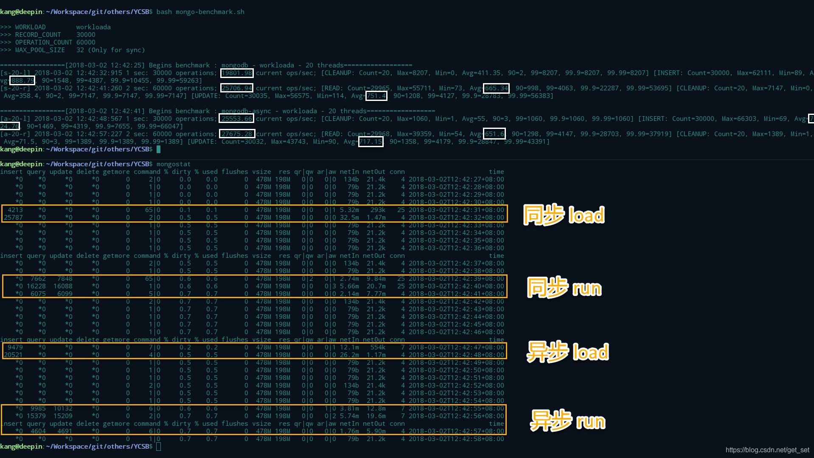

> 上边运行的`mongo-benchmark.sh`是基于`bin/ycsb`命令编写的方便测试的脚本，并输出一些汇总数据（包括吞吐量和平局操作时长）方便查看，同时也会将每次`bin/ycsb`命令输出的详细内容保存到`output`目录下的文件中。
> 脚本可以在[代码库](https://github.com/get-set/get-reactive/blob/master/ycsb-mongo-shell/mongo-benchmark.sh)中找到，如果mongo运行于`localhost:27017`，可直接用如下命令执行（在与`bin`同目录下）：
>
> curl https://raw.githubusercontent.com/get-set/get-reactive/master/ycsb-mongo-shell/mongo-benchmark.sh | bash

图中上方是对同步驱动和异步驱动各自跑了一次基于workloada的load和run的测试，下方是`mongostat`的输出（每秒输出一行），从`insert`、`query`、`update`的数字可以找出四个橘黄色的框标出的4个阶段。通过这些数据我们可以分析出：

- load主要是加载数据集，因此会看到`insert`的数字增多，加起来是测试预设的30000条数据；类似的run主要是进行基于workload的操作测试，workloada是50/50的read/update，在mongostat的输出中也有体现。
- load阶段同步和异步驱动的吞吐量分别为19801和25554，run阶段同步和异步的吞吐量分别为25706和27675，同步驱动略逊一筹；再观察insert、read和update操作的平均时长，可以得出同样的结论。
- 这次测试设置了20个线程对mongo数据库进行操作，在mongostat输出的`conn`列可以看到数据库连接个数的变化，对于同步的驱动来说，连接个数会从4个增加到25个，而对于异步的驱动来说，连接个数会从4个增加到7个。

通过这种方式，针对不同的线程数，观察两种驱动的性能数据并通过mongostat的数据记录连接数。

一、不限制连接数

为了观察连接数的变化，先不限制`maxPoolSize`（注释脚本中`MAX_POOL_SIZE=8`那一行）。最终结果如下：

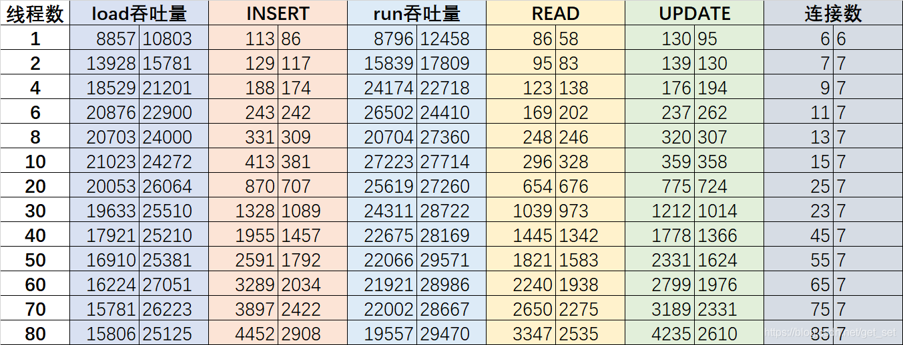

图中，每种颜色的左列和右列分别是同步和异步的数据。直观起见，我们通过图表来对比一下：

首先对比一下load阶段和run阶段的吞吐量（柱越高越好）

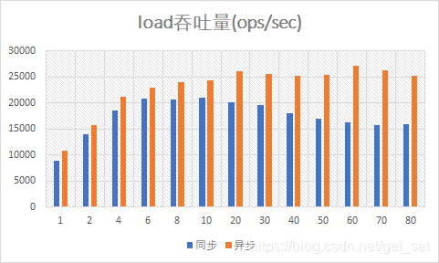

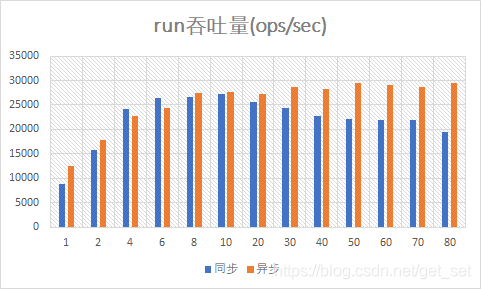

可以发现，当线程数达到8个之后，吞吐量的增长趋势基本消失了，尤其是同步驱动的吞吐量还会随线程数的继续增加而略有下降。不知是否跟测试环境为四核八线程的CPU有关系。

然后对比一下INSERT、READ和UPDATE操作的平均时长（柱越低越好）

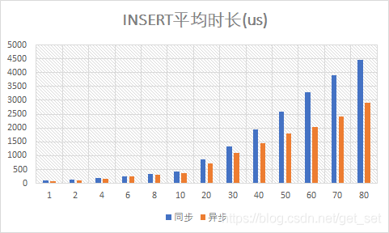

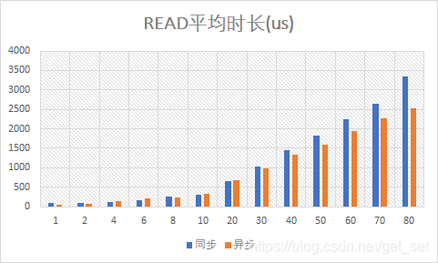

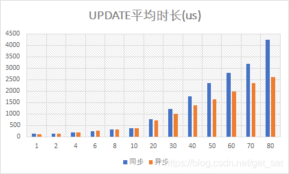

相对来说，异步驱动能带来更快的读写操作，尤其是应对越来越多的线程的时候。

最后对比一下连接数

连接数的对比更加明显：对于同步的情况，连接数=线程数+5；而对于异步的情况，连接数几乎一直保持在7个。没有对比就没有伤害呀。

二、限制连接数

下面，将连接数限制为32个，测试一下线程数从30-80的情况下，同步驱动的性能数据：

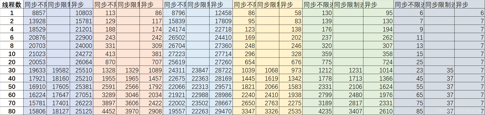

通过图表对比：

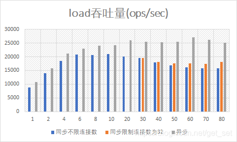

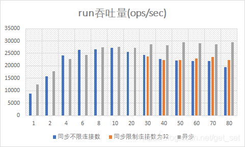


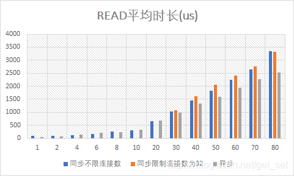

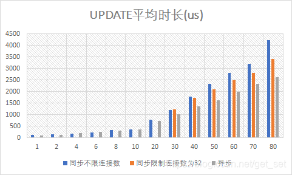

可见，限制连接数之后，略有改善，但是相比异步驱动来说，仍然有一定差距。

**3）结论**

首先，需要说明的是，以上并非是以数据库调优为目的的测试，这里我们只测试了workloada（如果你感兴趣可以将脚本中的`WORKLOAD`变量修改一下，然后测试其他场景），而且限制连接数为32并没有特别的依据，对测试的机器来说，32也并非最优的连接数。

通过本节的测试，针对MongoDB驱动我们可以得出以下两个结论：

- 相对于同步驱动来说，异步驱动在性能方面略胜一筹；
- 在应对大量客户端线程的情况下，异步驱动能够以少量而稳定的连接数应对，意味着更少的内存消耗（每个连接消耗stack size的内存空间，默认情况下stack size为10M）。

### 1.4.4 总结

上边我们分别针对[Http服务端](http://blog.csdn.net/get_set/article/details/79492439)、[Http客户端](http://blog.csdn.net/get_set/article/details/79506373)以及数据库进行了同步和异步的测试对比，综上来看，**基于异步非阻塞的响应式应用或驱动能够以少量且固定的线程应对高并发的请求或调用，对于存在阻塞的场景，能够比多线程的并发方案提供更高的性能。**

响应式和非阻塞并不是总能让应用跑的更快，况且将代码构建为非阻塞的执行方式本身还会带来少量的成本。但是在类似于WEB应用这样的高并发、少计算且I/O密集的应用中，响应式和非阻塞往往能够发挥出价值。尤其是微服务应用中，网络I/O比较多的情况下，效果会更加惊人。