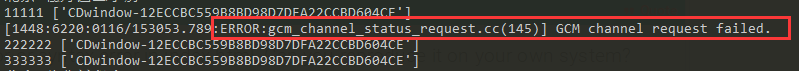

# 1.环境配置

配置要点：

1.webdriver要和浏览器版本对应，chrome使用chromedriver和chrome浏览器，firefox使用geckodrive和firefox浏览器

2.支持headless：本地开发使用mac环境，默认支持；linux需要安装xvf8（虚拟GUI）

3.maven项目构建，使用selenium-3.9.1或者最新版本

4.linux配置参考：chrome：[blog.csdn.net/qq_39802740…](https://blog.csdn.net/qq_39802740/article/details/82015197)  ； firefox：[blog.csdn.net/u014283248/…](https://blog.csdn.net/u014283248/article/details/80631072)  [www.xnathan.com/2017/12/04/…](https://www.xnathan.com/2017/12/04/headless-selenium-on-centos/)

# 2.chromium项目使用

chrome启动参数参考：[peter.sh/experiments…](https://peter.sh/experiments/chromium-command-line-switches/)

1.系统环境变量配置：webdriver.chrome.driver=DRIVER_PATH

2.常用options配置：

| —headless                          | 无浏览器模式                         |
| ---------------------------------- | ------------------------------------ |
| --no-sandbox                       | 非沙盒模式，linux部署必填            |
| --disable-gpu                      | 禁用gpu，liinux部署需填，防止未知bug |
| blink-settings=imagesEnabled=false | 不加载图片                           |
| --user-agent=ua值                  | 设置ua                               |
| --disable-web-security             | 禁用同源策略                         |


3.webdriver实例化：

```
//设置系统环境变量
System.setProperty("webdriver.chrome.driver", env.getProperty("path.chrome.driver"));
WebDriver webDriver = null;
try{
    ChromeOptions options = new ChromeOptions();
	options.addArguments("--headless"); //无浏览器模式
	options.addExtensions(new File(env.getProperty("path.chrome.proxy")));//增加代理扩展
    webDriver = new ChromeDriver(options);//实例化
}catch(Exception e){
    e.printStackTrace();
}finally{
    //使用完毕，关闭webDriver
    if(webDriver != null){
        webDriver.quit();
    }
}
```

# 3.gecko项目使用

1.系统环境变量配置：webdriver.gecko.driver=DRIVER_PATH

2.常用options配置：

| —headless         | 无浏览器模式                         |
| ----------------- | ------------------------------------ |
| --no-sandbox      | 非沙盒模式，linux部署必填            |
| --disable-gpu     | 禁用gpu，liinux部署需填，防止未知bug |
| --user-agent=ua值 | 设置ua                               |

preference配置：

| permissions.default.image | 2    | 不加载图片 |
| ------------------------- | ---- | ---------- |
|                           |      |            |

3.webdriver实例化：

```
//设置系统环境变量
System.setProperty("webdriver.gecko.driver", env.getProperty("path.gecko.driver"));
WebDriver webDriver = null;
try{
    FirefoxOptions options = new FirefoxOptions();
	options.addArguments("--headless"); //无浏览器模式
    FirefoxProfile profile = new FirefoxProfile();
	profile.addExtensions(new File(env.getProperty("path.chrome.proxy")));//增加代理扩展
    profile.setPreference("permissions.default.image", 2);//不显示图片
    options.setProfile(profile);
	//实例化
    webDriver = new FirefoxDriver(options);
}catch(Exception e){
    e.printStackTrace();
}finally{
    //使用完毕，关闭webDriver
    if(webDriver != null){
        webDriver.quit();
    }
}

复制代码
```

4.注意：默认加载会屏蔽部分请求（js请求等）

#### 5.PageFactory模式

介绍：整合封装简化WebDriver业务操作流程，采用工厂模式配合FindBy等注解使用

```
PageGenerator page = new PageGenerator(driver);//抽象page对象
//实例化LoginPage对象，并调用click方法
page.GetInstance(LoginPage.class).click("admin","123456");
复制代码
```

LoginPage.java

```
public class LoginPage extends BasePage{
    private final static String URL = "https://www.testlogin.com";
    @FindBy(id = "login")
    private WebElement login;
    public LoginPage(WebDriver driver) {
        super(driver);
    }
    public Boolean clickLogin(String name, String pwd){
        get(URL);
        click(login);
        return wait(ExpectedConditions.urlContains("main.html"));
    }
}
复制代码
```

BasePage.java

```
public class BasePage extends PageGenerator {
    private Long timeOut = 60L;//默认超时时间60s
    public BasePage(WebDriver driver) {
        super(driver);
    }
    public <T> void get(String url) {
        driver.get(url);
    }
    public <T> T wait(ExpectedCondition<T> c){
        return wait(c, timeOut);
    }
    public <T> T wait(ExpectedCondition<T> c, Long t){
        WebDriverWait webDriverWait = new WebDriverWait(this.driver, t==null?timeOut:t);
        try{
            return webDriverWait.until(c);
        }catch (Exception e){
            return null;
        }
    }
    public <T> void click (T elementAttr) {
        if(elementAttr.getClass().getName().contains("By")) {
            driver.findElement((By) elementAttr).click();
        } else {
            ((WebElement) elementAttr).click();
        }
    }
}
复制代码
```

PageGenerator.java

```
public class PageGenerator {
    public WebDriver driver;
    public PageGenerator(WebDriver driver){
        this.driver = driver;
    }
    public  <T extends BasePage> T GetInstance (Class<T> pageClass) {
        try {
            return PageFactory.initElements(driver,  pageClass);
        } catch (Exception e) {
            e.printStackTrace();
            throw e;
        }
    }
}
复制代码
```

# 6.代理使用

[github.com/lightbody/b…](https://github.com/lightbody/browsermob-proxy#using-with-selenium)

## 一、无auth验证代理

```
String proxyServer = "1.2.3.4:666";
Proxy proxy = new Proxy().setHttpProxy(proxyServer).setSslProxy(proxyServer);
options.setProxy(proxy);
复制代码
```

## 二、需auth验证代理

使用browsermobproxy做代理（或其他代理）

```
//创建一个本地代理
BrowserMobProxyServer bmpServer = new BrowserMobProxyServer();
bmpServer.setChainedProxy(new InetSocketAddress("proxy.com",222));//代理地址端口
bmpServer.chainedProxyAuthorization("user","pwd",AuthType.BASIC);//代理用户名密码
bmpServer.setTrustAllServers(true);//信任所有服务
bmpServer.start(11112);//启动一个本地代理服务，并设置端口为11112，访问地址：localhost:11112
//使用本地代理
String proxyServer = "localhost:11112";
Proxy proxy = new Proxy().setHttpProxy(proxyServer).setSslProxy(proxyServer);
options.setProxy(proxy);
复制代码
```

本地代理可单独做分布式部署，多节点，使用zk管理

## 三、使用浏览器扩展extensions

1.chrome扩展：无法在headless模式下使用加载扩展，尚未解决

```
chromeOptions.addExtensions(new File(env.getProperty("path.chrome.proxy")));//代理扩展  需要在background.js配置代理账号密码后再打包
复制代码
```

参考：

2.firefox扩展：无法使用，新版本firefox由于认证问题无法加载，尚未解决

3.firefox使用close-proxy-authentication插件，需要旧版才能使用：[www.site-digger.com/html/articl…](http://www.site-digger.com/html/articles/20180822/662.html)  [addons.thunderbird.net/zh-tw/thund…](https://addons.thunderbird.net/zh-tw/thunderbird/addon/close-proxy-authentication/?src=search)

## 四、使用phantom.js

selenium新的api不再支持phantom.js，可以使用旧版api

## 五、代理其他作用

1.设置黑名单

2.设置header

3.其他

# 7.遇到的坑

##### 一、页面加载慢：（需验证）

chromium虽然是多进程执行，但是js引擎是单线程，同时打开多个窗口，只会加载一个页面，直到加载结束或打开下一个窗口才会去加载下一个页面，参考（[blog.csdn.net/ouyanggengc…](https://blog.csdn.net/ouyanggengcheng/article/details/83036680）)

firefox可以同时加载多个窗口的页面，同时会默认屏蔽一些请求

##### 二、设置黑名单：屏蔽某些网页加载（设置header同理）

1.通过代理设置，browsermobserver

```
BrowserMobProxy server = new BrowserMobProxyServer();
server.blacklistRequests("http://.*\\.blacklist.com/.*", 200);//方式1，设置单个黑名单
server.setBlacklist();//方式2，设置黑名单列表
复制代码
```

2.通过拓展设置，暂时没整透

##### 三、bmp代理无法连接

1.采用正确连接方式

```
//错误
Proxy proxy = ClientUtil.createSeleniumProxy(server);//无法获取到代理的host
//正确
String proxyServer = "localhost:11112";
Proxy proxy = new Proxy().setHttpProxy(proxyServer).setSslProxy(proxyServer);
复制代码
```

2.使用最新的maven包

##### 四、firefox兼容使用chrome扩展

[developer.mozilla.org/zh-CN/docs/…](https://developer.mozilla.org/zh-CN/docs/Mozilla/Add-ons/WebExtensions/Porting_from_Google_Chrome)

##### 五、使用auth代理时，弹出登录框

1.options禁止弹窗

2.获取alert，关闭弹窗

##### 六、grid启动

1.使用grid启动：chromedriver的权限要和grid的权限一致

2.启动grid节点： -Dwebdriver.chrome.driver参数放在-jar后面 java -jar -Dwebdriver.chrome.driver=/Users/apple/Downloads/chromedriver selenium-server-standalone-3.141.5.jar -role node  -hub http://localhost:4444/grid/register -browser browserName=chrome

# 8.分布式

使用grid启动多个节点

注意：单节点使用多线程时，最好使用geckodriver，chromium的js引擎是单线程执行的

# 9.wiki、doc参考整理

gecko官方文档：[github.com/mozilla/gec…](https://github.com/mozilla/geckodriver)

[firefox-source-docs.mozilla.org/testing/gec…](https://firefox-source-docs.mozilla.org/testing/geckodriver/geckodriver/Support.html)

chromium官方文档：[chromedriver.chromium.org/getting-sta…](http://chromedriver.chromium.org/getting-started)

# 10.项目实战策略

搭配http请求、多线程、grid使用


# 参考文章

http://www.python66.com/seleniumjiaocheng/list_2.html

https://zhuanlan.zhihu.com/p/78368287

[Selenium使用总结（Java版本）](https://juejin.im/post/5c13880ef265da610f639c3c#heading-24)

[selenium自动化脚本](https://www.cnblogs.com/linxinmeng/category/997834.html)

[How To Download & Upload Files Using Selenium With Java](https://www.lambdatest.com/blog/how-to-download-upload-files-using-selenium-with-java/)

# 坑

通过编写Chrome插件来解决这个问题，让插件里面的js代码在网站自带的所有js代码之前执行。

**1 规避检测失败**

　　selenium驱动的浏览器后window.navigator.webdriver值是true，正常的浏览器这个值是未定义的(undefined)。对方网站根据这个特征容易识别出来你是爬虫！为了规避检测需要配置。

```
option.add_experimental_option("excludeSwitches", ['enable-automation']) 
```


　　但是ChromeDriver 79.0.3945.36版本修复了非无头模式下排除“启用自动化”时window.navigator.webdriver是未定义的问题，无法通过更改enable-automation设置解决window.navigator.webdriver==true的问题。所以版本很新的话该方法就失效了！

　　要正常使用的话，把Chrome回滚一个版本，并找到对应的ChromeDriver版本即可

　　**2 send_keys丢失字符**

　　用send_keys一次输入多个字符容易丢失，比如输入"我喜欢你"四个字，可能只输入了喜欢2个字。测试用for循环一个字一个字输入也会丢失。

　　解决：定位输入框元素后先clear()，再click()，最后for循环依次输入(send_keys)多数情况下能正常！实在不行可以通过js的方式来赋值 [selenium用js完成元素定位和赋值](http://www.python66.com/seleniumjiaocheng/176.html)

　　https://www.crifan.com/selenium_input_box_send_keys_cannot_input_text_string/

　　**3 selenium启动浏览器有几十个特征可以被识别**

　　不要以为用了selenium就万事俱备了，该方法一样可以被反爬虫，所以如果搞不定淘宝不要纳闷！详情查看[selenium启动特征](http://www.python66.com/seleniumjiaocheng/181.html)。其实淘宝的反爬挺牛逼，selenium的抓取有时候会有问题，更多知识参考[selenium消除启动特征](http://www.python66.com/seleniumjiaocheng/182.html)。

　　**4 更改窗口大小及uer_agent和手机模式(移动仿真)不同**

　　改窗口大小用option.add_argument('--window-size=xxx,xxx')，但是这个改的是浏览器窗口大小。即使配了移动的UA依然不是真正的模拟移动设备！

　　PC设备和移动设备之间差别在于分辨率！要想模拟手机除了上述两项外还有进行分辨率的配置！如下：

```
	iphone_ua = 'Mozilla/5.0 (iPhone; CPU iPhone OS 11_0 like Mac OS X) AppleWebKit/604.1.38 (KHTML, like Gecko) Version/11.0 Mobile/15A372 
        mobile_emulation = {
          "deviceMetrics": {"width": 375, "height": 667, 'pixelRatio': 3}, #分辨率配置
          "userAgent": iphone_ua # UA
                           }
        option.add_experimental_option("mobileEmulation", mobile_emulation)　　
```


　　这样才能达到移动仿真！

　　**5 请求网页后要等待**

　　打开一个网页后必须配备等待时间，否则可能加载不全！个人习惯用显示等待，用selenium的WebDriverWait和expected_conditions两个类！

　　**6 quit()前等待**

　　如果代码层面没有任何等待，那么使用quit()方法后程序会很快退出，有时候代码没执行完就退出了(quit前并不会自动等待网页加载完)！

　　**7 长时间运行卡死**

　　用selenium爬了三天三夜，不是用的无头模式而是正常界面化的运行。最后浏览器左下角显示正在载入内存...然后程序一直卡死不动了！

　　**8 gcm_channel_status_request.cc(145)] GCM channel request failed**

****

　　在cmd下运行脚本一会报一个下以上的错误！踏遍网络无人能解！在国外这么牛逼的网站https://stackoverflow.com/也没给出确切回答。但是据观察该错误并不影响脚本的效果。个人觉得selenium+python运行期间，会和一些谷歌一些服务进行通信，因为国内的屏蔽导致访问不通。详情查看http://www.python66.com/bbs/163.html


　　**9 add_argument('--disable-infobars')设置无效**

　　用selenium浏览器后，浏览器顶部会显示Chrome正在受到自动软件的控制这几个字，看上去非常恶心，上述设置在谷歌76版本及以上版本就无效了，但是高版本的谷歌还能通过一些方法设置，详情查看[屏蔽Chrome提示受到自动软件控制](http://www.python66.com/bbs/210.html)

# 常见的反爬虫和应对方法

一般网站从三个方面反爬虫：用户请求的Headers，用户行为，网站目录和数据加载方式。前两种比较容易遇到，大多数网站都从这些角度来反爬虫。第三种一些应用ajax的网站会采用，这样增大了爬取的难度。

## 0x02 通过Headers反爬虫

从用户请求的Headers反爬虫是最常见的反爬虫策略。很多网站都会对Headers的User-Agent进行检测，还有一部分网站会对Referer进行检测（一些资源网站的防盗链就是检测Referer）。如果遇到了这类反爬虫机制，可以直接在爬虫中添加Headers，将浏览器的User-Agent复制到爬虫的Headers中；或者将Referer值修改为目标网站域名。对于检测Headers的反爬虫，在爬虫中修改或者添加Headers就能很好的绕过。

## 0x03 基于用户行为反爬虫

还有一部分网站是通过检测用户行为，例如同一IP短时间内多次访问同一页面，或者同一账户短时间内多次进行相同操作。

大多数网站都是前一种情况，对于这种情况，使用IP代理就可以解决。可以专门写一个爬虫，爬取网上公开的代理ip，检测后全部保存起来。这样的代理ip爬虫经常会用到，最好自己准备一个。有了大量代理ip后可以每请求几次更换一个ip，这在requests或者urllib2中很容易做到，这样就能很容易的绕过第一种反爬虫。

对于第二种情况，可以在每次请求后随机间隔几秒再进行下一次请求。有些有逻辑漏洞的网站，可以通过请求几次，退出登录，重新登录，继续请求来绕过同一账号短时间内不能多次进行相同请求的限制。

## 0x04 动态页面的反爬虫

上述的几种情况大多都是出现在静态页面，还有一部分网站，我们需要爬取的数据是通过ajax请求得到，或者通过JavaScript生成的。首先用Firebug或者HttpFox对网络请求进行分析。如果能够找到ajax请求，也能分析出具体的参数和响应的具体含义，我们就能采用上面的方法，直接利用requests或者urllib2模拟ajax请求，对响应的json进行分析得到需要的数据。


能够直接模拟ajax请求获取数据固然是极好的，但是有些网站把ajax请求的所有参数全部加密了。我们根本没办法构造自己所需要的数据的请求。我这几天爬的那个网站就是这样，除了加密ajax参数，它还把一些基本的功能都封装了，全部都是在调用自己的接口，而接口参数都是加密的。遇到这样的网站，我们就不能用上面的方法了，我用的是selenium+phantomJS框架，调用浏览器内核，并利用phantomJS执行js来模拟人为操作以及触发页面中的js脚本。从填写表单到点击按钮再到滚动页面，全部都可以模拟，不考虑具体的请求和响应过程，只是完完整整的把人浏览页面获取数据的过程模拟一遍。

用这套框架几乎能绕过大多数的反爬虫，因为它不是在伪装成浏览器来获取数据（上述的通过添加 Headers一定程度上就是为了伪装成浏览器），它本身就是浏览器，phantomJS就是一个没有界面的浏览器，只是操控这个浏览器的不是人。利用 selenium+phantomJS能干很多事情，例如识别点触式（12306）或者滑动式的验证码，对页面表单进行暴力破解等等。它在自动化渗透中还 会大展身手，以后还会提到这个。


# 我的总结

getText()不会返回null，空就是"",


# window.navigator.webdriver

[关于修改window.navigator.webdriver代码失效问题](https://blog.csdn.net/qq_35866846/article/details/104422505)

[（新）关于修改window.navigator.webdriver代码失效问题](https://blog.csdn.net/qq_35866846/article/details/105712147)

[chrome升了chrome88后，selenium修改window.navigator.webdriver](https://blog.csdn.net/qq_35866846/article/details/113185737)