## [数据库设计三大范式](https://www.cnblogs.com/linjiqin/archive/2012/04/01/2428695.html)

为了建立冗余较小、结构合理的数据库，设计数据库时必须遵循一定的规则。在关系型数据库中这种规则就称为范式。范式是符合某一种设计要求的总结。要想设计一个结构合理的关系型数据库，必须满足一定的范式。

​         

在实际开发中最为常见的设计范式有三个：

### **1**. 第一范式

> (确保每列保持原子性)

第一范式是最基本的范式。如果数据库表中的**所有字段值都是不可分解的原子值**，就说明该数据库表满足了第一范式。

第一范式的合理遵循需要根据系统的实际需求来定。比如某些数据库系统中需要用到“地址”这个属性，本来直接将“地址”属性设计成一个数据库表的字段就行。但是如果系统经常会访问“地址”属性中的“城市”部分，那么就非要将“地址”这个属性重新拆分为省份、城市、详细地址等多个部分进行存储，这样在对地址中某一部分操作的时候将非常方便。这样设计才算满足了数据库的第一范式，如下表所示。

  

上表所示的用户信息遵循了第一范式的要求，这样在对用户使用城市进行分类的时候就非常方便，也提高了数据库的性能。

​         

### 2. 第二范式

> (确保表中的每列都和主键相关；如果多个主键，都要相关)

第二范式在第一范式的基础之上更进一层。第二范式需要确保数据库表中的每一列都和主键相关，而不能只与主键的某一部分相关（主要针对联合主键而言）。**也就是说在一个数据库表中，一个表中只能保存一种数据，不可以把多种数据保存在同一张数据库表中。**

比如要设计一个订单信息表，因为订单中可能会有多种商品，所以要将订单编号和商品编号作为数据库表的联合主键，如下表所示。

 **订单信息表**

 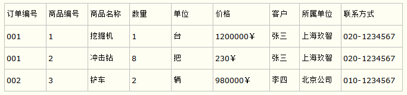

这样就产生一个问题：这个表中是以订单编号和商品编号作为联合主键。这样在该表中商品名称、单位、商品价格等信息不与该表的主键相关，而仅仅是与商品编号相关。所以在这里违反了第二范式的设计原则。

而如果把这个订单信息表进行拆分，把商品信息分离到另一个表中，把订单项目表也分离到另一个表中，就非常完美了。如下所示。

  

这样设计，在很大程度上减小了数据库的冗余。如果要获取订单的商品信息，使用商品编号到商品信息表中查询即可。

​         

### 3. 第三范式

第三范式需要确**保数据表中的每一列数据都和主键直接相关，而不能间接相关。**

比如在设计一个订单数据表的时候，可以将客户编号作为一个外键和订单表建立相应的关系。而不可以在订单表中添加关于客户其它信息（比如姓名、所属公司等）的字段。如下面这两个表所示的设计就是一个满足第三范式的数据库表。

​	 


这样在查询订单信息的时候，就可以使用客户编号来引用客户信息表中的记录，也不必在订单信息表中多次输入客户信息的内容，减小了数据冗余。

### 4. 总结

> 第二范式（2NF）和第三范式（3NF）的概念很容易混淆，区分它们的关键点在于，2NF：非主键列是否完全依赖于主键，还是依赖于主键的一部分；3NF：非主键列是直接依赖于主键，还是直接依赖于非主键列。
>
>
> 粗略的理解，2NF，处理不合理的复合主键，3NF，处理单主键表的非主键列
>
> 第一范式是字段拆分设计
> 第二范式是中间表设计
> 第三范式是表拆分设计


## 数据类型

### 1. 数值

所有数值类型都可以输入 `false(0)`  ，`true(0)`

| 类型              | 大小                                     | 范围（有符号）                                               | 范围（无符号）                                               | 用途            |
| :---------------- | :--------------------------------------- | :----------------------------------------------------------- | :----------------------------------------------------------- | :-------------- |
| TINYINT           | 1 字节                                   | (-128，127)                                                  | (0，255)                                                     | 小整数值        |
| SMALLINT          | 2 字节                                   | (-32 768，32 767)                                            | (0，65 535)                                                  | 大整数值        |
| MEDIUMINT         | 3 字节                                   | (-8 388 608，8 388 607)                                      | (0，16 777 215)                                              | 大整数值        |
| INT或INTEGER      | 4 字节                                   | (-2 147 483 648，2 147 483 647)                              | (0，4 294 967 295)                                           | 大整数值        |
| BIGINT            | 8 字节                                   | (-9,223,372,036,854,775,808，9 223 372 036 854 775 807)      | (0，18 446 744 073 709 551 615)                              | 极大整数值      |
| FLOAT             | 4 字节                                   | (-3.402 823 466 E+38，-1.175 494 351 E-38)，0，(1.175 494 351 E-38，3.402 823 466 351 E+38) | 0，(1.175 494 351 E-38，3.402 823 466 E+38)                  | 单精度 浮点数值 |
| DOUBLE            | 8 字节                                   | (-1.797 693 134 862 315 7 E+308，-2.225 073 858 507 201 4 E-308)，0，(2.225 073 858 507 201 4 E-308，1.797 693 134 862 315 7 E+308) | 0，(2.225 073 858 507 201 4 E-308，1.797 693 134 862 315 7 E+308) | 双精度 浮点数值 |
| DECIMAL（或DEC）  | 对DECIMAL(M,D) ，如果M>D，为M+2否则为D+2 | 依赖于M和D的值                                               | 依赖于M和D的值                                               | 小数值          |
| BIT               | 保存位字段值                             |                                                              |                                                              |                 |
| BOOLEAN（或BOOL） |                                          | 布尔标志，或者为0或者为1，主要用于开/关（on/off）标志        |                                                              |                 |

>   不使用引号 与串不一样，数值不应该括在引号内。
>
>   存储货币数据类型 MySQL中没有专门存储货币的数据类	型，一般情况下使用DECIMAL(8, 2).
>
>   有符号或无符号 
>
>   > ​		所有数值数据类型（除BIT和BOOLEAN外）都可以有符号或无符号。有符号数值列可以存储正或负的数值，无符号数值列只能存储正数。默认情况为有符号，但如果你知道自己不需要存储负值，可以使用UNSIGNED关键字，这样做将允许你存储两倍大小的值。  

​	

### 2. 日期时间类型

| 类型      | 大小 (字节) | 范围                                                         | 格式                | 用途                                                         |
| :-------- | :---------- | :----------------------------------------------------------- | :------------------ | :----------------------------------------------------------- |
| DATE      | 3           | 1000-01-01/9999-12-31                                        | YYYY-MM-DD          | 日期值                                                       |
| TIME      | 3           | '-838:59:59'/'838:59:59'                                     | HH:MM:SS            | 时间值或持续时间                                             |
| YEAR      | 1           | 1901/2155                                                    | YYYY                | 年份值                                                       |
| DATETIME  | 8           | 1000-01-01 00:00:00/9999-12-31 23:59:59                      | YYYY-MM-DD HH:MM:SS | 混合日期和时间值，精确到毫秒，会四舍五入                     |
| TIMESTAMP | 4           | 1970-01-01 00:00:00/2038结束时间是第 **2147483647** 秒，<br /> 北京时间 **2038-1-19 11:14:07**，格林尼治时间 2038年1月19日 凌晨 03:14:07 | YYYYMMDD HHMMSS     | 混合日期和时间值，时间戳，精确到毫秒，可以更新自动修改默认值 |

### 3.   字符串

>   存储串，如名字、地址、电话号码、邮政编码等。有两种基本的串类型，分别为定长串和变长串 。
>
>   MySQL处理定长列远比处理变长列快得多。此外， MySQL不允许对变长列（或一个列的可变部分）进行索引。  
>
>   不管使用何种形式的串数据类型，串值都必须括在引号内（通常单引号更好）。  
>
>   | 类型       | 大小                | 用途             |
>   | :--------- | :------------------ | :--------------- |
>   | CHAR       | 0-255字节           | 定长字符串       |
>   | VARCHAR    | 0-65535 字节        | 变长字符串       |
>   | TINYTEXT   | 0-255字节           | 短文本字符串     |
>   | TEXT       | 0-65 535字节        | 长文本数据       |
>   | MEDIUMTEXT | 0-16 777 215字符    | 中等长度文本数据 |
>   | LONGTEXT   | 0-4 294 967 295字节 | 极大文本数据     |

```
1、CHAR(M)：定长类型，比如CHAR(5),如果我们只赋值abc，那么系统会自动在后面补两个空格0——255
2、VARCHAR(M)：变长类型，L+1个字节，其中L<=M且0<=M0——65535
3、ENUM（'value1','value2'...）枚举值，提供几个选项，选择其中一个，如：性别（'男','女','保密'）
4、SET('value1','value2'...) 最多64个成员，可以任选里面其中几个，任意排列组合

长度M 和java的lenghth()相等
在mysql中length是计算字段的长度一个汉字是算三个字符,一个数字或字母算一个字符
在mysql内置函数里面查看字符串长度的还有一个函数是char_length，这两个函数的区别是：
length: 一个汉字是算三个字符，一个数字或字母算一个字符。
char_length: 不管汉字还是数字或者是字母都算是一个字符。
```

  **当数值不是数值时** 

> 你可能会认为电话号码和邮政编码应该存储在数值字段中（数值字段只存储数值数据），但是，这样做却是不可取的。如果在数值字段中存储邮政编码01234，则保存的将是数值1234，实际上丢失了一位数字。    
>
> 需要遵守的基本规则是：如果数值是计算（求和、平均等）中使用的数值，则应该存储在数值数据类型列中。 如果作为字符串（可能只包含数字）使用，则应该保存在串数据类型列中。

**char、varchar 与 text**

> - 经常变化的字段用 varchar
> - 知道固定长度的用 char
> - 尽量用 varchar
> - 超过 255 字符的只能用 varchar 或者 text
> - 能用 varchar 的地方不用 text

****

### BINARY

BINARY 和 VARBINARY 类似于 CHAR 和 VARCHAR，不同的是它们包含二进制字符串而不要非二进制字符串。也就是说，它们包含字节字符串而不是字符字符串。这说明它们没有字符集，并且排序和比较基于列值字节的数值值。

|            |      |      |
| ---------- | ---- | ---- |
| varbinary  |      |      |
| longbinary |      |      |
| binary     |      |      |

### 4.   二进制数据类型

| 数据类型   | 说 明               |
| ---------- | ------------------- |
| TINYBLOB   | Blob最大长度为255 B |
| BLOB       | Blob最大长度为64 KB |
| MEDIUMBLOB | Blob最大长度为16 MB |
| LONGBLOB   | Blob最大长度为4 GB  |

>   二进制数据类型可存储任何数据（甚至包括二进制信息），如图像、多媒体、字处理文档等  
>
>   BLOB是一个二进制大对象，可以容纳可变数量的数据。有 4 种 BLOB 类型：TINYBLOB、BLOB、MEDIUMBLOB 和 LONGBLOB。它们区别在于可容纳存储范围不同。

### MYSQL类型与JAVA类型对应表

|      | 类型名称                | 显示长度(需要自己设置) | 数据库类型               | JAVA类型                 | JDBC类型索引(int) |
| ---- | ----------------------- | ---------------------- | ------------------------ | ------------------------ | ----------------- |
| !    | VARCHAR                 | L+N                    | VARCHAR                  | java.lang.String         | 12                |
| !    | longVARCHAR             |                        |                          | java.lang.String         |                   |
| !    | CHAR                    | N                      | CHAR                     | java.lang.String         | 1                 |
|      |                         |                        |                          |                          |                   |
|      | BLOB                    | L+N                    | BLOB                     | java.lang.byte[]         | -4                |
|      | TEXT                    | 65535                  | VARCHAR                  | java.lang.String         | -1                |
|      |                         |                        |                          |                          |                   |
| !    | TINYINT（可以用作字典） | 3                      | TINYINT UNSIGNED         | java.lang.Byte           | -6                |
| !    | SMALLINT                | 5                      | SMALLINT UNSIGNED        | java.lang.Short          | 5                 |
| !    | MEDIUMINT               | 8                      | MEDIUMINT UNSIGNED       | java.lang.INTEGER        | 4                 |
| !    | INTEGER                 | 4                      | INTEGER UNSIGNED         | java.lang.INTEGER        | 4                 |
| ！   | BIGINT                  | 20                     | BIGINT UNSIGNED          | java.lang.Long           | -5                |
|      |                         |                        |                          |                          |                   |
|      | FLOAT                   | 4+8                    | FLOAT                    | java.lang.Float          | 7                 |
| ！   | DOUBLE                  | 22                     | DOUBLE                   | java.lang.Double         | 8                 |
| ！   | **DECIMAL**             | **11**                 | **DECIMAL**              | **java.math.BigDecimal** | **3**             |
|      |                         |                        |                          |                          |                   |
| !    | BIT                     | 1                      | BIT（1：true，0：false） | java.lang.**Boolean**    | -7                |
| ！   | BOOLEAN                 | 1                      | 同TINYINT                | java.lang.**Boolean**    |                   |
|      |                         |                        |                          |                          |                   |
|      | ID                      | 11                     | PK (INTEGER UNSIGNED)    | java.lang.Long           | 4                 |
|      |                         |                        |                          |                          |                   |
| ！   | DATE                    | 10                     | DATE                     | java.sql.Date            | 91                |
| ！   | TIME                    | 8                      | TIME                     | java.sql.Time            | 92                |
|      | DATETIME                | 19                     | DATETIME                 | java.sql.Timestamp       | 93                |
| ！   | TIMESTAMP               | 19                     | TIMESTAMP                | java.sql.Timestamp       | 93                |
|      | YEAR                    | 4                      | YEAR                     | java.sql.Date            | 91                |
|      |                         |                        |                          |                          |                   |
| !    | binary,还有其他变式     |                        |                          | byte[]                   |                   |

### 字段设计

1. boolean使用bit或者tinyint（1）

2. 整形数值的长度，通常不用自定义，使用对应长度的整形类型的默认值就可以了，一般有符号要比无符号多一位显示。

   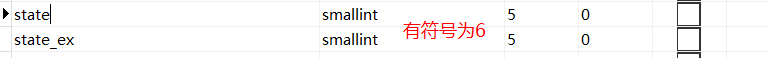

## DCL

>   Data Control Language  :  grant /revoke  

> mysqld 是 MySQL 的主程序，服务器端。 mysql 是 MySQL 的命令行工具，客户端.
>
> 默认使用的都是 root 用户， 超级管理员， 拥有全部的权限。  

### 1. 创建用户

```mysql
CREATE USER '用户名'@'主机名' IDENTIFIED BY '密码'
-- '用户名'：将创建的用户名
-- '主机名'： 指定该用户在哪个主机上可以登陆，如果是本地用户可用 localhost，如果想让该用户可以 从任意远程主机登陆，可以使用通配符%（需要远程，或者外网ip）
-- '密码'： 该用户的登陆密码，密码可以为空，如果为空则该用户可以不需要密码登陆服务器

-- e.g.
create user 'user1'@'localhost' identified by '123'; -- 创建 user1 用户，只能在 localhost 这个服务器登录 mysql 服务器，密码为 123
create user 'user2'@'%' identified by '123'; 		 -- 创建 user2 用户可以在任何远程电脑，上登录 mysql 服务器，密码为 123

-- USER_PRIVILEGES 表可以查到所有用户，没有user表
```

### 2. 权限控制

>   用户创建之后，只有对test的操作权限！需要给用户授权

 	


#### 授权

```mysql
GRANT 权限 1, 权限 2... ON 数据库名.表名 TO '用户名'@'主机名';

-- GRANT…ON…TO 授权关键字
-- 权限 授予用户的权限，如 CREATE、 ALTER、 SELECT、 INSERT、 UPDATE 等。如果要授予所有的权限则使用 ALL
-- 数据库名.表名 该用户可以操作哪个数据库的哪些表。如果要授予该用户对所有数据库和表的相应操作权限则可用*表示，如*.*
-- '用户名'@'主机名' 给哪个用户授权，注：有 2 对单引号

-- e.g.
grant create,alter,insert,update,select on test.* to 'user1'@'localhost'; -- 给 user1 用户分配对 test 这个数据库操作的权限：创建表，修改表，插入记录，更新记录，查询
grant all on *.* to 'user2'@'%';  -- 给 user2 用户分配所有权限，对所有数据库的所有表

```

#### 撤销授权

```mysql
REVOKE 权限 1, 权限 2... ON 数据库.表名 FROM '用户名'@'主机名';

-- REVOKE…ON…FROM 撤销授权的关键字
-- 权限 用户的权限，如 CREATE、 ALTER、 SELECT、 INSERT、 UPDATE 等，所有的权限则使用 ALL
-- 数据库名.表名 对哪些数据库的哪些表，如果要取消该用户对所有数据库和表的操作权限则可用*表示，如*.*
-- '用户名'@'主机名' 给哪个用户撤销

revoke all on test.* from 'user1'@'localhost'; -- 不行，test不能控制
```

**GRANT和REVOKE可在几个层次上控制访问权限**

> 整个服务器，使用GRANT ALL和REVOKE ALL；
> 整个数据库，使用ON database.*；
> 特定的表，使用ON database.table；
> 特定的列；
> 特定的存储过程。

>   在使用GRANT和REVOKE时，用户账号必须存在，
>   但对所涉及的对象没有这个要求。这允许管理员在创建数据库
>   和表之前设计和实现安全措施。  

| 权 限                   | 说 明                                                        |
| ----------------------- | ------------------------------------------------------------ |
| ALL                     | 除GRANT OPTION外的所有权限                                   |
| ALTER                   | 使用ALTER TABLE                                              |
| ALTER ROUTINE           | 使用ALTER PROCEDURE和DROP PROCEDURE                          |
| CREATE                  | 使用CREATE TABLE                                             |
| CREATE ROUTINE          | 使用CREATE PROCEDURE                                         |
| CREATE TEMPORARY TABLES | 使用CREATE TEMPORARY TABLES                                  |
| CREATE USER             | 使用CREATE USER、 DROP USER、 RENAME USER和REVOKE ALL PRIVILEGES |
| CREATE VIEW             | 使用CREATE VIEW                                              |
| DELETE                  | 使用DELETE                                                   |
| DROP                    | 使用DROP TABLE                                               |
| EXECUTE                 | 使用CALL和存储过程                                           |
| FILE                    | 使用SELECT INTO OUTFILE和LOAD DATA INFILE                    |
| GRANT OPTION            | 使用GRANT和REVOKE                                            |
| INDEX                   | 使用CREATE INDEX和DROP INDEX                                 |
| INSERT                  | 使用INSERT                                                   |
| LOCK TABLES             | 使用LOCK TABLES                                              |
| PROCESS                 | 使用SHOW FULL PROCESSLIST                                    |
| RELOAD                  | 使用FLUSH                                                    |
| REPLICATION CLIENT      | 服务器位置的访问                                             |
| REPLICATION SLAVE       | 由复制从属使用                                               |
| SELECT                  | 使用SELECT                                                   |
| SHOW DATABASES          | 使用SHOW DATABASES                                           |
| SHOW VIEW               | 使用SHOW CREATE VIEW                                         |
| SHUTDOWN                | 使用mysqladmin shutdown（用来关闭MySQL）                     |
| SUPER                   | 使用CHANGE MASTER、 KILL、 LOGS、 PURGE、 MASTER 和SET GLOBAL。还允许mysqladmin调试登录 |
| UPDATE                  | 使用UPDATE                                                   |
| USAGE                   | 无访问权限                                                   |

### 4.   查看权限

```mysql
SHOW GRANTS FOR '用户名'@'主机名';

SHOW GRANTS FOR 'user2'@'%';
-- Grants for user2@%                                                           
-- GRANT USAGE ON *.* TO 'user2'@'%' IDENTIFIED BY PASSWORD '*23AE809DDACAF96AF0FD78ED04B6A265E05AA257'

-- usage 是指连接（登陆）权限，建立一个用户，就会自动授予其 usage 权限（默认授予）。
```

### 5.   删除用户	

```mysql
DROP USER '用户名'@'主机名';

drop user 'user2'@'%;
```

### 6.   修改管理员密码  

```mysql
SET PASSWORD FOR 'root'@'localhost' = PASSWORD('root'); -- 可以用，或者navicat中使用，新密码要加单引号

-- mysqladmin -uroot -p password 新密码 无效
```


## DDL

>    Data Definition Language  : create / alter / drop  

### database

#### create

```mysql
-- 直接创建数据库 db1
create database db1;
-- 判断是否存在，如果不存在则创建数据库 db2
create database if not exists db2;
-- 创建数据库并指定字符集为 gbk
create database db3 default character set gbk;

-- 建表并且同时插入相同结构的数据
CREATE TABLE `student_2` (
  `s` int(11) DEFAULT NULL,
  `sname` varchar(32) DEFAULT NULL,
  `sage` int(11) DEFAULT NULL,
  `ssex` varchar(8) DEFAULT NULL
) ENGINE=InnoDB DEFAULT CHARSET=utf8 
SELECT * from student;
```

#### show

```mysql
SHOW {DATABASES | SCHEMAS} [LIKE 'pattern' | WHERE expr]

-- 查看所有的数据库
show databases;
-- 查看某个数据库的定义信息
show create database db3;
```

#### alter

```mysql
-- 修改数据库默认的字符集 : ALTER DATABASE 数据库名 DEFAULT CHARACTER SET 字符
alter database db3 character set utf8;
```

#### drop

```mysql
-- 删除数据库 DROP DATABASE 数据库名;
drop database db2;

```

#### select 

```mysql
-- 使用的一个 mysql 中的全局函数,查看正在使用的数据库
SELECT DATABASE();

-- 改变要使用的数据库
use db4;
```

### table

#### create

```mysql
-- ` 存在的目的是为了避免关键字的冲突
CREATE TABLE `student` (
`id` int(11) DEFAULT NULL,
`name` varchar(20) DEFAULT NULL,
`birthday` date DEFAULT NULL
) ENGINE=InnoDB DEFAULT CHARSET=utf8

-- 快速创建一个表结构相同的表 : CREATE TABLE 新表名 LIKE 旧表名;
create table s1 like student;
```

#### show

```mysql
-- 查看某个数据库中的所有表
SHOW TABLES;

-- 查看表结构
SHOW COLUMNS FROM customers;
DESCRIBE customers;
DESC 表名;

-- 查看创建表的 SQL 语句
SHOW CREATE TABLE 表名;
	
```

#### alter

```mysql
-- 添加列 add

-- 修改列 modify，change

-- 删除列 drop	

-- 修改表名 rename

-- 字符集
alter table student2 character set gbk;
```


#### drop

```mysql
-- 直接删除表 s1 表
drop table s1;
-- 判断表是否存在并删除 s1 表
drop table if exists `create`;
```


## DML

>    Data Manipulation Language  : insert /update/delete 

### insert

```mysql
语法1：INSERT [INTO] 表名 [(列名1,列名2,...)] VALUES(列值1,列值2,...),(...),...;
对于自动编号的字段，插入“NULL”或“DEFAULT”系统将自动依次递增编号；
对于有默认约束的字段，可以插入“DEFAULT”表示使用默认值；
列值可传入数值、表达式或函数，如密码可以用md5()函数进行加密（如md5('123')）；
可同时插入多条记录，多条记录括号间用逗号“,”隔开

语法2：INSERT [INTO] 表名 SET 列名1=列值1, 列名2=列值2,...;
这种方法一次只能插入一条记录；列值中有自动编号、默认值或Boolean类型均可以不赋值(使用子查询)

语法3：INSERT [INTO] 表名(列名1,...) SELECT 列名1,... FROM 表名 [GROUP BY/HAVING/ORDER BY/LIMIT...];
一般用于将其他表的数据插入到指定表，注意对应

-- 字符和日期型数据应包含在单引号中。 MySQL 中也可以使用双引号做为分隔符。
-- 不指定列或使用 null，表示插入空值。
```

### update

#### 单表

```mysql
单表更新 UPDATE
UPDATE 表名 SET 列名1=列值1 [,列名2=列值2, ...] [WHERE 条件];(如条件为 列名=列值 修改某一字段的值)
省略条件则更新所有记录该列的值
```

#### 多表

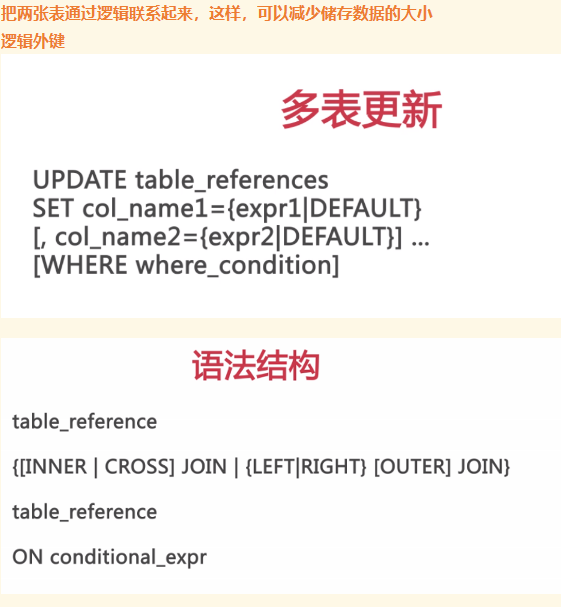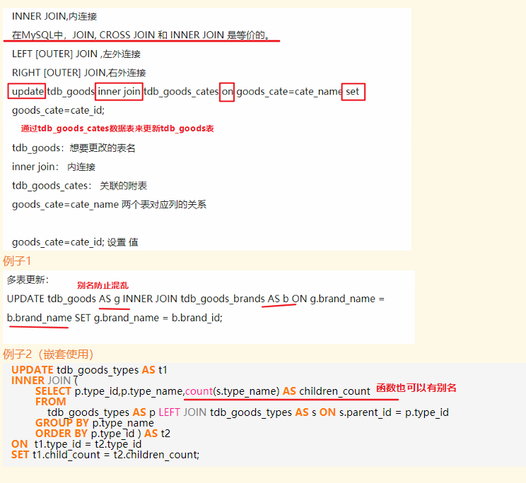

### delete

#### 单表

```mysql
-- 单表删除 DELETE
DELETE FROM 表名 [WHERE 条件];
省略条件则默认删除该表所有记录(仅删除所有记录，不删除数据表)；
插入自动编号的字段时，号数为已有的最大号数+1，即使中间有空号数也是如此（如12356，插入记录后为123567）

truncate 删除表中所有记录
	-- truncate 相当于删除表的结构，再创建一张表。auto Increment都会从头开始
```

**优先级**

  如果数据检索是最重要的（通常是这样），则你可以通过在INSERT和INTO之间添加关键字 `LOW_PRIORITY`，指示MySQL降低INSERT语句的优先级，顺便说一下，这也适用于下一章介绍的UPDATE和DELETE语句。  

#### 多表

tbl_name可以是多个，删除多个表


```mysql
-- 以下不行了
-- In MySQL, you can't modify the same table which you use in the SELECT part.
-- This behaviour is documented at: http://dev.mysql.com/doc/refman/5.6/en/update.html
DELETE t1
FROM tdb_goods AS t1 LEFT JOIN (SELECT goods_id,goods_name FROM tdb_goods GROUP BY goods_name HAVING count(goods_name) >= 2 ) AS t2  ON t1.goods_name = t2.goods_name 
 WHERE t1.goods_id > t2.goods_id;
 
 -- 用这个，不要参杂select
 DELETE t1  from bdm_jd_item t1 inner join bdm_jd_item t2 on t1.item_id = t2.item_id  WHERE t1.id > t2.id 
 SELECT count(*) from bdm_jd_item GROUP BY item_id HAVING count(item_id) > 2 -- 测试
 
 /* 很有启发，这段代码应该分成三点分析，
 1、DELETE t1     表示要在t1表中删除记录，t1 即 tdb_goods。
 2、t1 LEFT JOIN t2     将t1与t2(即上面的参照表)连接起来，（形成一个新的虚拟的表）连接方式是LEFT JOIN。
当然这里也可以用别的连接方式，比如：INNER JOIN/ RIGHT JOIN 结果都是一样的。ON t1.goods_name = t2.goods_name     连接的条件
大家可以把这个左连接的表单独显示出来，用如下语句：
*/
 select * from  tdb_goods AS t1 LEFT JOIN 
 (SELECT goods_id,goods_name FROM tdb_goods GROUP BY goods_name HAVING count(goods_name) >= 2 ) AS t2
 ON t1.goods_name = t2.goods_name;
```

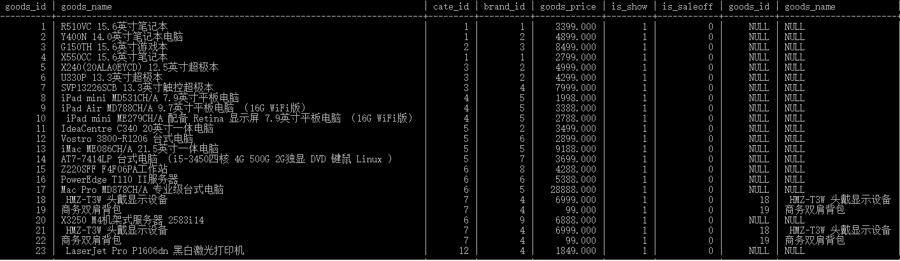

3 、WHERE t1.goods_id > t2.goods_id;  这里表示的是：删除t1中 t1.goods_id > t2.goods_id的所有记录。 

from之后的是where的作用空间

为什么要用左连接？因为是删除左表中部分数据，所以用左连接把左表全部显示出来比较好，整体逻辑上。

为什么内连接和右连接也行？因为要删除的部分在两个表的公共部分，而内连接和右连接也有公共部分，所以也可以！

去掉where条件后会把整个左边的数据表都删除？

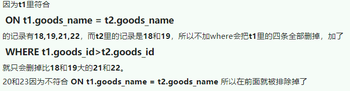

## DQL

>   Data Query Language  :    select /show  

### 查询表达总式

```mysql
每一个表达式表示想要的一列，必须至少有一个
多个列之间以英文逗号分隔
星号(*)表示所以列 tbl_name.*可以表示命名表的所有列
查询表达式可以使用[As]alias_name为其赋予别名
别名可用于GROUP BY，ORDRE BY或HAVING子句

SELECT 字段出现顺序影响结果集出现顺序，字段别名也影响结果集字段别名。

一、查找记录
1、语法：
SELECT [DISTINCT] select_expr [,select expr2...] 只查找某一个函数或表达式
[FROM table_references] 查询表名
[WHERE where_conditon] 
[GROUP BY {col_name|position} [ASC|DESC],...] 按某个字段进行分组，相同的只显示第一个
[HAVING where_conditon] 分组时，给出显示条件
[ORDER BY {col_name|expr|position} [ASC|DESC],...] 排序
[LIMIT {[offset,]row_count|row_count OFFSET offset}] 限制返回数量

-- 执行顺序：FROM 》WHERE》GROUP BY》HAVING》SELECT》ORDER BY

2、查询表达式的顺序会影响结果顺序
每个表达式表示想要的一列，必须有至少一个
多个列直接以英文逗号分隔
星号*表示所有列
3、使用tbl_name.col_name来表示列记录，这多表查询时可以区别开同名的列
4、使用[AS] alias_name为其赋予别名，别名可以用于GROUP BY、ORDER BY或HAVING子句，例如SELECT id AS userId,username AS uname FROM users; 这样查询出来的结果会用别名表示
```

#### distinct

```mysql
-- 去重
-- 不能部分使用DISTINCT DISTINCT关键字应用于所有列而不仅是前置它的列。如果给出`SELECT DISTINCT vend_id,prod_price`，除非指定的两个列都不同，否则所有行都将被检索出来。  
```

####  WHERE

```mysql
-- 过滤指定的行，在行的所有列上操作
-- 后各种根据条件(>、<、=、>=、<=、!=、<>、IS NOT NULL)，根据逻辑(and,or），根据模式匹配(IN、NOT IN、like、not like、regexp)，使用各种MySQL函数和表达式，从表集合中筛选记录。 
```

####  Group by

```mysql
-- 对查询结果分组，where之后

[GROUP BY {col_name|position} [ASC|DESC],...]
ASC：升序，默认
DESC：降序
position：SELECT语句中列的序号

-- GROUP BY子句中列出的每个列都必须是检索列或有效的表达式（但不能是聚集函数）。如果在SELECT中使用表达式，则必须在GROUP BY子句中指定相同的表达式。不能使用别名。
-- 

eg. SELECT sex FROM users GROUP BY sex;对users中的sex按sex进行分组
eg. SELECT * FROM users GROUP BY 1; -- (这里的1表示查询的第一个字段，这里查询所有字段信息，第一个字段就是id，所以会按照id字段进行分组） 1表示SELECT语句中第一个出现的字段，即位置。建议BY后写列名称，不写位置，因为位置还要人为数数。

/*
1. 可选多个字段
2. 如果存在相同的值（例如上面的age可能有多个相同的值），只会保留一个。所以select中列出的非分组字段没有意义，并不代表精确的行。
3. 在建立分组时，指定的所有列都一起计算
4. 分组的目的就是为了统计，一般与聚合丞数一起使用
5. 如果分组列中具有NULL值，则NULL将作为一个分组返回。如果列中有多行NULL值，它们将分为一组。
*/

-- 多分组，随着分组字段越多，相当于组内再分小组，分的组越小，组数（记录数越多），count(*)也会变得更小
SELECT
	purchase_id,
	order_number,
	goods_number,
	goods_amount,
	count(*) AS count2 
FROM
	bdm_yz_order 
GROUP BY
	purchase_id,
	order_number,
	goods_number,
	goods_amount 
HAVING
	count(*)> 1 
ORDER BY
	purchase_id,
	order_number,
	goods_number,
	goods_amount
	
-- 另一种，MySQL数据库查找多个字段值全部相同的记录，存在用户名和密码都相同的账户
select User_Account,User_Pwd,COUNT(User_Account) As Account,COUNT(User_Pwd) As Account2 from base_userinfo group by User_Account,User_Pwd HAVING Account>1 and Account2>1;
```

#### HAVING

```MySQL
-- 过滤分组，包括	哪些分组，排除哪些分组
-- 用在group by后面追加条件，判断式中的字段是必须出现在前面select中的字段或者是一个聚合函数count()，max()（可以包含没有出现在前面查询中的字段的）

[HAVING when where_condition]
SELECT sex FROM users GROUP BY 1 HAVING age > 35; //有错
SELECT sex, age FROM users GROUP BY 1 HAVING age > 35;
SELECT sex FROM users GROUP BY 1 HAVING count(id) >= 2;
-- （这条指令，指按照sex分组，分成了两组sex=0和sex=NULL，条件id数大于2的留下显示，显然sex=0个数有8>2故留下，而sex=NULL个数为1，不满足条件，故不显示。如果条件改成count(id)>=1,则会显示sex为0和NULL两个分组。）

SELECT brand_name , SUM(number*goods_price) AS total FROM goods GROUP BY brand_name HAVING SUM(number*goods_price)>=5000 ORDER BY total;

```

​	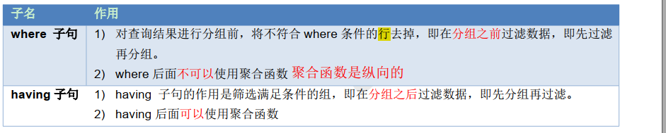

#### order by

```mysql
对查询结果进行排序，默认是升序
order by{col_name}

select * from users order by id desc; #对一个字段排序
select * from users order by age,id desc; #两个字段同时排序

-- desc是降序
-- 1、对查询结果进行排序：[ORDER BY [col_name | expr | position } [ASC|DESC],...]elect * from user order by id desc;
-- 2、可以同时按多条字段进行排序，规则是先按前面的字段排，在基础上再按后面字段排。
-- 3、如：SELECT * FROM users ORDER BY age,id DESC; 先按照age排序，如果age有重复的，重复的字段里按id排序
```

#### limit

```mysql
限制查询结果返回数量
[LIMIT{[offset,]row_countrow_count OFFSET offset}]
eg:
SELECT * FROM users LIMIT 2; -- 从第一条开始（第一个为0），返回两条
SELECT * FROM users LIMIT 2,3 ;-- 从第三条开始（第一个为0），返回三条

第三种insert，数据从一个表插入到另一个表：
INSERT table_name(column_name) SELECT ...

eg:
INSERT test SELECT username FROM users WHERE age >=30; -- 字段不匹配提示
INSERT test (username) SELECT username FROM users WHERE age >= 30;
```

### SQL执行顺序

```mysql
(1) FROM <left_table>   -- 组装来自不同数据源的数据; 
(2) <join_type> JOIN <right_table>
(3) ON <join_condition> -- 对 VT1 应用 ON 筛选器，只有那些使为真才被插入到 TV2。
(4) WHERE <where_condition> -- 基于指定的条件对记录行进行筛选；
(5) GROUP BY <group_by_list>   -- 将数据划分为多个分组；
(6) WITH {CUBE | ROLLUP}
(7) HAVING <having_condition> -- 筛选分组
(8) SELECT
(9) DISTINCT
(9) ORDER BY <order_by_list>
(10) <TOP_specification> <select_list>  

-- 以上每个步骤都会产生一个虚拟表，该虚拟表被用作下一个步骤的输入。这些虚拟表对调用者(客户端应用程序或者外部查询)不可用。只有最后一步生成的表才会会给调用者。如果没有在查询中指定某一个子句，将跳过相应的步骤。

-- 描述

1、 FROM：对 FROM 子句中的前两个表执行笛卡尔积(交叉联接)，生成虚拟表 VT1。
2、 ON：对 VT1 应用 ON 筛选器，只有那些使为真才被插入到 TV2。
3、 OUTER (JOIN):如果指定了 OUTER JOIN(相对于 CROSS JOIN 或 INNER JOIN)，保留表中未找到匹配的行将作为外部行添加到 VT2，生成 TV3。如果 FROM 子句包含两个以上的表，则对上一个联接生成的结果表和下一个表重复执行步骤 1 到步骤 3，直到处理完所有的表位置。
4、 WHERE：对 TV3 应用 WHERE 筛选器，只有使为 true 的行才插入 TV4。
5、 GROUP BY：按 GROUP BY 子句中的列列表对 TV4 中的行进行分组，生成 TV5。
6、 CUTE|ROLLUP：把超组插入 VT5，生成 VT6。
7、 HAVING：对 VT6 应用 HAVING 筛选器，只有使为 true 的组插入到 VT7。
8、 SELECT：处理 SELECT 列表，产生 VT8。
9、 DISTINCT：将重复的行从 VT8 中删除，产品 VT9。
10、 ORDER BY：将 VT9 中的行按 ORDER BY 子句中的列列表顺序，生成一个游标(VC10)。
11、 TOP：从 VC10 的开始处选择指定数量或比例的行，生成表 TV11，并返回给调用者。
```


### 条件表达式

#### 比较运算符

> 单个条件

| 比较运算符               | 说明                                                         |
| ------------------------ | ------------------------------------------------------------ |
| >、 <、 <=、 >=、 =、 <> | <>在 SQL 中表示不等于，在 mysql 中也可以使用!= 没有==        |
| BETWEEN...AND            | 在一个范围之内，如： between 100 and 200 相当于条件在 100 到 200 之间，包头又包尾 |
| IN(集合)                 | 集合表示多个值，使用逗号分隔                                 |
| LIKE '张%'               | 模糊查询                                                     |
| IS NULL                  | 查询某一列为 NULL 的值，注：不能写=NULL                      |

> NULL与不匹配 ：不会返回，除非 ：`select * from user where refer != 8 or refer is NULL`

#### 逻辑运算符

> 多个条件

| 逻辑运算符 | 说明                                    |
| ---------- | --------------------------------------- |
| and 或 &&  | 与， SQL 中建议使用前者，后者并不通用。 |
| or 或 \|\| | 或，短路                                |
| not 或 !   | 非                                      |

#### LIKE

> 模糊匹配

| 通配符 | 说明                  |
| ------ | --------------------- |
| %      | 匹配任意0到多个字符串 |
| _      | 匹配0到1个字符        |

>  尾空格可能会干扰通配符匹配。例如，在保存词anvil 时 ， 如 果 它 后 面 有 一 个 或 多 个 空 格 ， 则 子 句 WHERE prod_name LIKE '%anvil'将不会匹配它们，因为在最后的l后有多余的字符。解决这个问题的一个简单的办法是在搜索模式最后附加一个%。一个更好的办法是使用函数（第11章将会介绍）去掉首尾空格。  
>
>  虽然似乎%通配符可以匹配任何东西，但有一个例外，即NULL。即使是WHERE prod_name LIKE '%'也不能匹配用值NULL作为产品名的行。  

- **注意**

> 1. 不要过度使用通配符。如果其他操作符能达到相同的目的，应该使用其他操作符。
> 2. 在确实需要使用通配符时，除非绝对有必要，否则不要把它们用在搜索模式的开始处。把通配符置于搜索模式的开始处，搜索起来是最慢的。  


------


#### ANY,SOME,ALL,IN

> 与集合比较

- **为什么要使用IN操作符？其优点具体如下**

  > 在使用长的合法选项清单时， IN操作符的语法更清楚且更直观。
  >
  > 在使用IN时，计算的次序更容易管理（因为使用的操作符更少）。
  >
  > IN操作符一般比OR操作符清单执行更快。
  >
  > IN的最大优点是可以包含其他SELECT语句，使得能够更动态地建立WHERE子句。  


- **其他**

​	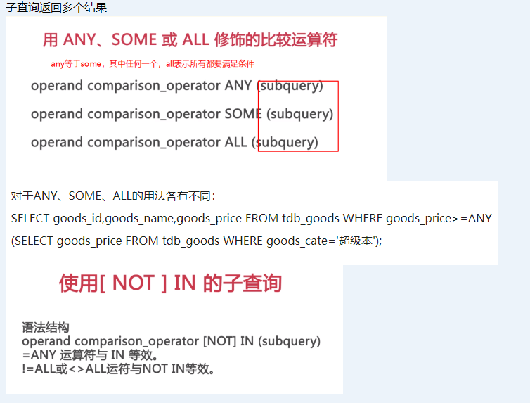

#### EXISTS

> 如 果 子 查 询 返 回 任 何 行 ， EXISTS 将 返 回 TRU E ； 否 则 为 FALSE.

​	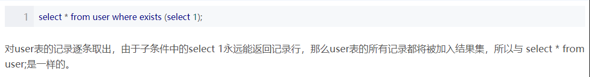


------

#### REGEXP

>   LIKE匹配整个串而REGEXP匹配子串  

**单次匹配**(匹配一次)

```mysql
-- 等价
select * from user where username like "%s%";
select * from user where username REGEXP "s";

-- . 匹配任意一个字符，必须有1个以上匹配
select * from user where username REGEXP ".S.";

-- or 
select * from user where username REGEXP "si|sdf";

-- []内是or ，等价于[1|2|3]Ton，1Ton|2Ton|3Ton
select * from user where username REGEXP "[gi]s";

-- 匹配除这些字符外的任何东西，起码有一个
select * from user where username REGEXP "[^g]s";

-- [0-9]简化版的[0123456789]

-- 转义\\.' 包括.、 |、 []以及迄今为止使用过的其他特殊字符。
-- 为了匹配反斜杠（ \）字符本身，需要使用\\\
-- \\f 换页
-- \\n 换行
-- \\r 回车
-- \\t 制表
-- \\v 纵向制表

-- 多数正则表达式实现使用单个反斜杠转义特殊字符，以便能使用这些字符本身。但MySQL要求两个反斜杠（ MySQL自己解释一个，正则表达式库解释另一个

-- 预定义的字符集
[:alnum:] 任意字母和数字（同[a-zA-Z0-9]）
[:alpha:] 任意字符（同[a-zA-Z]）
[:blank:] 空格和制表（同[\\t]）
[:cntrl:] ASCII控制字符（ ASCII 0到31和127）
[:digit:] 任意数字（同[0-9]）
[:graph:] 与[:print:]相同，但不包括空格
[:lower:] 任意小写字母（同[a-z]）
[:print:] 任意可打印字符
[:punct:] 既不在[:alnum:]又不在[:cntrl:]中的任意字符
[:space:] 包括空格在内的任意空白字符（同[\\f\\n\\r\\t\\v]）
[:upper:] 任意大写字母（同[A-Z]）
[:xdigit:] 任意十六进制数字（同[a-fA-F0-9]）
```

**多次匹配**

```mysql
-- 重复元字符
* 0个或多个匹配
+ 1个或多个匹配（等于{1,}）
? 0个或1个匹配（等于{0,1}）
{n} 指定数目的匹配
{n,} 不少于指定数目的匹配
{n,m} 匹配数目的范围（ m不超过255）


'\\([0-9] sticks?\\)'   -- \\(匹配)，[0-9]匹配任意数字（这个例子中为1和5）， sticks?匹配stick和sticks（ s后的?使s可选，因为?匹配它前面的任何字符的0次或1次出现）， \\)匹配)。

'[[:digit:]]{4}'-- [:digit:]匹配任意数字，因而它为数字的一个集合。{4}确切地要求它前面的字符（任意数字）出现4次，所以[[:digit:]]{4}匹配连在一起的任意4位数字。'[0-9][0-9][0-9][0-9]'

```

​	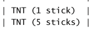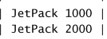

**定位符**

```mysql
^ 文本的开始  -- ^有两种用法。在集合中（用[和]定义），用它来否定该集合，否则，用来指串的开始处
$ 文本的结尾
[[:<:]] 词的开始
[[:>:]] 词的结尾

'^[0-9\\.]'  -- 只在.或任意数字为串中第一个字符时才匹配它们。

-- LIKE匹配整个串而REGEXP匹配子串。利用定位符，通过用^开始每个表达式，用$结束每个表达式，可以使REGEXP的作用与LIKE一样。
```

  **简单的正则表达式测试**  

 


### 组合查询 UNION

1. 在单个查询中从不同的表返回类似结构的数据

2. 对单个表执行多个查询，按单个查询返回数据。  

   > 单个表：UNION和多条where子句的作用一样，会合并重复记录，UNION ALL 则会包含重复

```mysql
SELECT goods_id , goods_name , brand_name FROM goods WHERE goods_price>5000
UNION
SELECT goods_id , goods_name , brand_name FROM goods WHERE brand_name = '索尼';
```

> **rule**
> 	  列数据类型必须兼容：类型不必完全相同，但必须是DBMS可以隐含地转换的类型（例如，不同的数值类型或不同的日期类型）。  
>
> ​		排序时最后使用order by语句，集体排列


### 子查询

#### 1.   单行单列

 	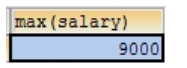

```mysql
--  子查询结果只要是单行单列， 肯定在 WHERE 后面作为条件， 父查询使用： 比较运算符， 如： > 、 <、 <>、 =等  

  select * from emp where salary = (select max(salary) from emp);
```

  

#### 2.   多行单列

 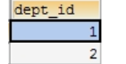

```mysql
-- 子查询结果是单例多行，结果集类似于一个数组，父查询使用 IN 运算符

select name from dept where id = (select dept_id from emp where salary > 5000);

```


#### 3.   多行多列

 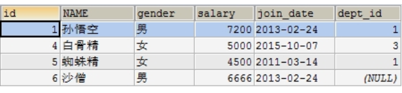

```mysql
-- 子查询结果只要是多列，肯定在 FROM 后面作为表,子查询作为表需要取别名，否则这张表没有名称则无法访问表中的字段
select * from dept d, (select * from emp where join_date >='2011-1-1') e where d.`id`= e.dept_id ;
```


### 关联子查询

#### 介绍

**关联子查询通常是是关联两个条件，一个是分类（也就是分组）；另一个是外部的where**

> 1、关联子查询的执行逻辑完全不同于正常的SELECT语句。
>
> 2、关联子查询执行逻辑如下：
>
> （1）先从主查询的Product表中product _type列取出第一个值，进入子查询中，得到子查询结果，然后返回父查询，判断父查询的where子句条件，则返回整个语句的第1条结果。
>
> （2）重复上述操作，直到所有主查询中的Product表中product _type列记录取完为止。得出整个语句的结果集，就是最后的答案。


**例子**

- **选取出各商品种类中高于该商品种类的平均销售单价的商品。**

 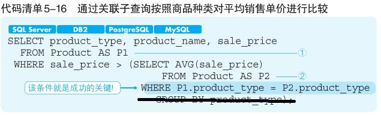 

- **执行顺序**

记住，关联子查询和正常的SELECT语句完全不同。

1. 先执行主查询

```mysql
SELECT product _type , product_name, sale_price FROM Product AS P1
```

结果：

 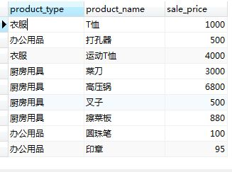

- 从主查询的product _type*先取第一个值*=‘衣服’，通过WHERE P1.product_type = P2.product_type传入子查询，子查询变成：

```mysql
-- 应该不会一个一个地试，可能会先分类要对比的字段，然后再传入子查询，然后子查询再传出来
SELECT AVG(sale_price)

FROM Product AS P2

WHERE P2.product_type = ‘衣服’

GROUP BY product_type);
```

第一次子查询结果：

 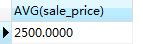


从子查询得到的结果AVG(sale_price)=2500，返回主查询：

```mysql
SELECT product_type , product_name, sale_price FROM Product AS P1 WHERE sale_price > 2500 AND product_type = ‘衣服’;
```

第一次整个语句的结果：

 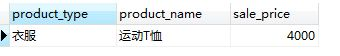

然后，product _type取第二个值，得到整个语句的第二结果，依次类推，把product _type全取值一遍，就得到了整个语句的结果集。结果如下：

 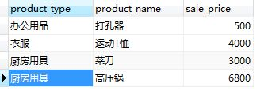

#### 错误

> 不能用分组函数代替关联子查询，没有了字段约束条件


### [Case函数]( https://blog.csdn.net/weixin_34247032/article/details/90098388 )

#### 用于分组中

 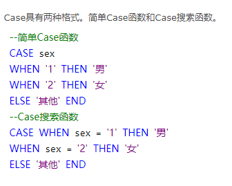


 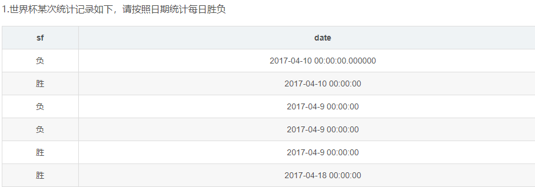

```mysql
SELECT
date,
sum(case when sf='胜' then 1 else 0 end) as '胜', #当统计到胜，输出1，并求和
sum(case when sf='负' then 1 else 0 end) as '负'
from shengfu GROUP BY date
```

 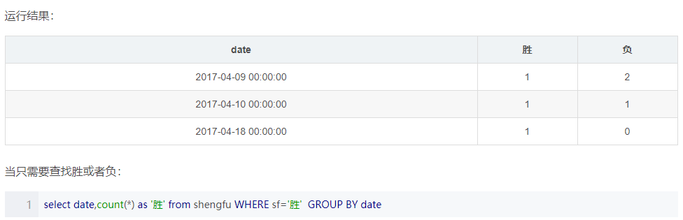

### 如何写sql语句

```
1. 一步一步把需求复杂化，先构建简单查询，再慢慢添砖加瓦
2. 复杂查询：表连接，子查询，case，子表
2. 如何构建sql： 
		看需求：把需要的列 按自己设计的先后顺序（很多先后顺序） 一个一个查询出来。  
		关键字：from要不要表连接，然后where 筛选，然后group分组， having筛选分组， select 出需要的列， 还可以选择内联子查询
```


## 函数

### 字符函数

```mysql
1.CONCAT() 字符连接 --  SELECT CONCAT('a','-','b');  结果为:a-b<br>  --多数DBMS使用+或||来实现拼接，MySQL则使用Concat()函数来实现。 
2.CONCAT_WS() 使用指定的分隔符进行字符连接 --  SELECT CONCAT_WS('|','A','B','C');   结果为： A|B|C<br>
3.FORMAT()  数字格式化  -- SELECT FORMAT(12560.7,2);  结果：12，560.70  SELECT FORMAT(12560.78,1); 结果：12，560.8
4.LOWER() 转换成小写字母
5.UPPER() 转换成大写字母
6.LEFT()  获取左侧字符 -- SELECT LEFT('mysql',2);  结果：my
7.RIGHT() 获取右侧字符
8.LTRIM() 删除前导空格(=LEFT TRIM())
9.RTRIM() 删除后续空格
10.TRIM（）删除前后两边的空格，还可以删除指定的前导和后续的字符,不能删除中间的字符 -- SELECT TRIM(LEADING'?','??MYSQL????');  结果：MYSQL???? 
SELECT TRIM(TRAILING'?','??MYSQL????');  结果：??MYSQL
SELECT TRIM(BOTH'?','??MYSQL???');  结果：MYSQL
11.REPLACE() 替换字符 -- SELECT REPLACE('??MYSQL???','?','-');  结果：--MYSQL---
12.SUBSTRING(string，offset，length)   截取字符串 -- SELECT SUBSTRING('MYSQL',2,3);  结果：SQL
```

### **数值处理函数**

```mysql
Abs() 返回一个数的绝对值
Cos() 返回一个角度的余弦
Exp() 返回一个数的指数值
Mod() 返回除操作的余数
Pi() 返回圆周率
Rand() 返回一个随机数
Sin() 返回一个角度的正弦
Sqrt() 返回一个数的平方根
Tan() 返回一个角度的正切

1、CEIL(数值); 说明：就是向上取整，如：SELECT CEIL(3.01);结果是4；
2、FLOOR(数值); 说明：就是向下取整，如：SELECT FLOOR(3.99);结果是3；
3、DIV,例子：SELECT 3 DIV 4; 结果是0；因为3除以4，整数位为0；
4、MOD,相当于C语言的%取余函数运算符，也可以用%号代替；例子：SELECT 4 MOD 3; 结果为1；SELECT 5.3 MOD 3; 结果为2.3；
5、POWER(数值,数值);例子：SELECT POWER(3,3); 结果为27；
6、ROUND(数值,小数的位数)
7、TRUNCATE(数值，截取位数);  说明：和ROUND()相似，只是不四舍五入，截取位数还能是负数，如：SELECT TRUNCATE(125.68,-1); 结果为120

```


### **日期时间函数**

``` mysql
AddDate() 增加一个日期（天、周等）
AddTime() 增加一个时间（时、分等）
CurDate() 返回当前日期
CurTime() 返回当前时间
Date() 返回日期时间的日期部分
DateDiff() 计算两个日期之差
Date_Add() 高度灵活的日期运算函数
Date_Format() 返回一个格式化的日期或时间串
Day() 返回一个日期的天数部分
DayOfWeek() 对于一个日期，返回对应的星期几
Hour() 返回一个时间的小时部分
Minute() 返回一个时间的分钟部分
Month() 返回一个日期的月份部分
Now() 返回当前日期和时间
Second() 返回一个时间的秒部分
Time() 返回一个日期时间的时间部分
Year() 返回一个日期的年份部分
TIMESTAMPDIFF(unit,datetime_expr1,datetime_expr2) 时间差，里面可以用函数

-- 日期必须为格式yyyy-mm-dd。 

SELECT DATE_ADD('2014-3-12',INTERVAL 365 DAY); -- 2015-3-12 /*在原有给定的时间上增加365天 INTERVAL增加可以增加负值 单位 year ,month,week,day
SELECT DATEDIFF('2014-1-1','2015-1-1')-- -365  时间差值计算 单位为日 前面时间减去后面时间
SELECT DATE_FORMAT('2014-3-2','%m/%d/%d'); --  03/02/2014 /*日期格式转换
SELECT name, birth, CURDATE(), TIMESTAMPDIFF(YEAR,birth,CURDATE()) AS age FROM pet; 

-- 检索出2005年9月下的所有订单
SELECT ust_id, order_num FROM orders WHERE Date(orderdate) BETWEEN '2005一09一01'AND '200S-09-30' ;
SELECT ust_id, order_num FROM orders WHERE YEAR(orderdate) =2005 AND MONTH(orderdate)=9;
```

### **聚合函数**

```mysql
-- 不需要实际内容,只需要统计数据,节约带宽
-- 聚合函数查询是纵向查询，它是对一列的值进行计算，然后返回一个结果值。忽略列值为NULL的行。

AVG() 返回某列的平均值  -- 为了获得多个列的平均值，必须使用多个AVG()函数。
COUNT() 返回某列的行数  -- 如果指定列名，则指定列的值为null的行被COUNT()函数忽略，但如果COUNT()函数中用的是星号（ *），则不忽略。
MAX() 返回某列的最大值  -- 任意列(数值和日期最常用)  
MIN() 返回某列的最小值  
SUM() 返回某列值之和	-- 也可以用来合计计算值: SUM(item_price*quantity)


-- COUNT 排除null,不建议,直接(*)
select count(ifnull(id,0)) from student;

-- ALL和DISTINCT ,ALL参数不需要指定，因为它是默认行为。如果不指定DISTINCT，则假定为ALL。
-- 聚集不同值,DISTINCT必须使用列名，不能用于计算或表达式。
select COUNT(DISTINCT password) from user;
select AVG (DISTINCT password) from user;
```

### 信息函数

​	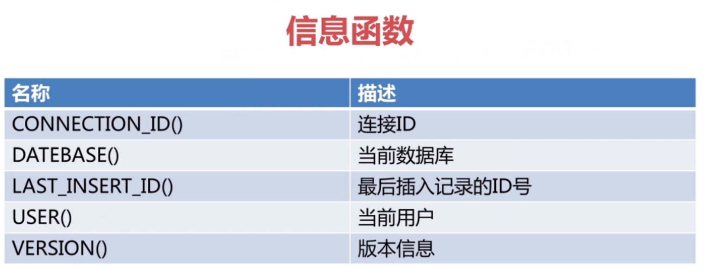

​       

### 加密函数

```mysql
1.MD5()：  -- 信息摘要算法，为以后的Web页面做准备，尽量使用MD5()
SELECT MD5('admin'); 
2. PASSWORD()： -- 密码算法，通过PASSWORD()修改(重要用于MYSQL数据库)当前用户和其他用户的密码，修改客户端自己的密码
举例 SET PASSWORD=PASSWORD(‘dimitar’); 把密码修改成dimitar。

-- MySQL5.79后废弃了password()
```

## 视图

  **视图就是封装了一条复杂查询的语句。**

**作用**

> 1. 重用SQL语句；简化复杂的SQL操作。在编写查询后，可以方便地重用它而不必知道它的基本查询细节。
> 2. 使用表的组成部分而不是整个表。
> 3. 保护数据。可以给用户授予表的特定部分的访问权限而不是整个表的访问权限。屏蔽敏感字段记录。
> 4. 更改数据格式和表示。视图可返回与底层表的表示和格式不同的数据。


**视图的规则**

> ​	与表一样，视图必须唯一命名（不能给视图取与别的视图或表相同的名字）。
>
> ​	对于可以创建的视图数目没有限制。
>
> ​	为了创建视图，必须具有足够的访问权限。这些限制通常由数据库管理人员授予。
>
> ​	视图可以嵌套，即可以利用从其他视图中检索数据的查询来构造一个视图。
>
> ​	ORDER BY可以用在视图中，但如果从该视图检索数据SELECT中也含有ORDER BY，那么该视图中的ORDER BY将被覆盖。
>
> ​	视图不能索引，也不能有关联的触发器或默认值。
>
> ​	视图可以和表一起使用。例如，编写一条联结表和视图的SELECT语句。


**视图操作**

>   CREATE VIEW  AS 子查询
>
>   SHOW CREATE VIEW viewname；来查看创建视图的语句。  
>
>   DROP删除视图，其语法为DROP VIEW viewname
>
>   更新视图时，可以先用DROP再用CREATE，也可以直接用CREATE OR	REPLACE VIEW。  

​	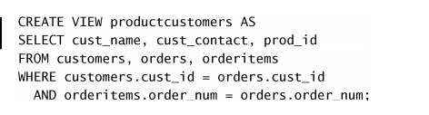

  **更新视图**  

> **视图主要用于数据检索，  而不用于更新（ INSERT、 UPDATE和DELETE）**
>
> 并非所有视图都是可更新的。基本上可以说，如果MySQL不能正确地确定被更新的基数据，则不允许更新（包括插入和删除）。这实际上意味着，如果视图定义中有以下操作，则不能进行视图的更新：

> 分组（使用GROUP BY和HAVING）；
> 联结；
> 子查询；
> 并；
> 聚集函数（ Min()、 Count()、 Sum()等）；
> DISTINCT；
> 导出（计算）列。

## 自定义函数UDF

### 介绍

- 用户自定义函数（UDF）是一种对MySQL扩展的途径，其用法与内置函数相同
- 自定义**函数的两个必要条件**：参数和返回值，所有的函数都有返回值，但是不一定有参数
- 函数可以返回任意类型的值，同样可以接收这些类型的参数，函数的参数和返回值之间没有必然的内在的联系
- 参数的数量，不能超过1024个。

### 语法

```mysql
CREATE FUNCTION function_name  -- function_name函数名
RETURNS {STRING | INTEGER | REAL | DECIMAL}  -- RETURNS返回值类型
routine_body -- routine_body函数体
	-- 函数体由合法的SQL语句构成
    -- 函数体可以是简单的SELECT或INSERT语句
    -- 函数体如果为复合结构则使用BEGIN..END语句
    -- 复合结构可以包含声明，循环，控制结构
```

```mysql
-- 无参数
CREATE FUNCTION f1() 
RETURNS VARCHAR(30)
RETURN DATE_FORMAT(NOW(),'%Y年%m月%d日  %H点%i分%s秒');
 
SELECT f1();

-- 有参数
CREATE FUNCTION f2 (num1 SMALLINT UNSIGNED,num2 SMALLINT UNSIGNED)
RETURNS FLOAT(10,2) UNSIGNED
RETURN (num1 + num2) / 2;

SELECT f2(50,12);

-- 复合结构
DELIMITER //   -- 修改MySQL的分隔符

CREATE FUNCTION adduser(username VARCHAR(20))
RETURNS INT UNSIGNED
BEGIN
INSERT test(username) VALUES (username); -- 依然不能去掉';'，';'代表着执行语句的结束标识，而//代表着输入语句的标识
RETURN LAST_INSERT_ID();
END
//
 
mysql> SELECT adduser('Rose');
```


## 存储过程

### 介绍

#### SQL缺点

在增删改查中，我们输入SQL命令后，MySQL引擎会对输入的命令进行语法分析，查看输入的语句是否正确，如果正确，则编译成MySQL引擎可以识别的命令，最后开始执行，并将执行的结果返回客户端，这就是MySQL命令的执行过程，如果我们能省去语法分析和编译的环节，MySQL的执行效率便能大大提高。

#### 存储过程

存储过程是SQL语句和控制语句的预编译集合，以一个名称存储并作为一个单元处理

存储过程存储在数据库内，可以由应用程序调用执行，而且允许用户申明变量以及进行流程控制，存储过程可以接受输入、输出类型的参数，并且可以存在多个返回值。当我们使用了存储过程后，只有第一次会进行语法分析和编译，以后如果在客户端再次调用，会直接调用编译的结果，省略了语法分析和编译的过程.

记住：**存储过程不带有事务，因此不会回滚**，需要自己额外使用事务语句。

#### 优点

- 增强SQL语句的功能和灵活性，有控制语句对流程进行控制和判断
- 实现较快的执行速度，经编译后存储在数据库中  。
- 减少网络流量，传递存储过程的名字和参数就可以了。
- 更好的安全机制，对于没有权限执行存储过程的用户，也可授权他们执行存储过程。
  - 系统管理员可以对执行的某一个存储过程进行权限限制，避免非授权用户对数据的访问
  - 在通过网络调用过程时，只有对执行过程的调用是可见的。 因此，恶意用户无法看到表和数据库对象名称、嵌入自己的 Transact-SQL 语句或搜索关键数据。
  - 使用过程参数有助于避免 SQL 注入攻击。 因为参数输入被视作文字值而非可执行代码，所以，攻击者将命令插入过程内的 Transact-SQL 语句并损害安全性将更为困难。
  - 可以对过程进行加密，这有助于对源代码进行模糊处理。   

#### 劣势

1、存储过程需要专门的数据库开发人员进行维护，但实际情况是，往往由程序开发员人员兼职

2、设计逻辑变更，修改存储过程没有SQL灵活


#### 实际应用少

在通常的项目研发中，用存储过程却相对较少，这是为什么呢？
分析原因如下：
1）没有特定的数据库开发人员，普通程序员兼职进行数据库操作
2）程序员往往只需操作程序，即可完成数据访问，无需再在数据库上进行开发
3）项目需求变动比较频繁，修改SQL语句比较方便，特别是涉及逻辑变更 


#### sql和存储过程的选择

1、在一些高效率或者规范性要求比较高的项目，建议采用存储过程
2、对于一般项目建议采用参数化命令方式，是存储过程与SQL语句一种折中的方式
3、对于一些算法要求比较高，涉及多条数据逻辑，建议采用存储过程

### 语法

#### create

```mysql
CREATE
[DEFINER = {user | CURRENT_USER }]  -- 创建者，如果省略，则默认为当前登录用户
PROCEDURE sp_name ([proc_parameter[,...]])
[characteristic...]routine_body

-- sp_name：存储过程名字，参数有三个选项：
    IN：表示该参数的值必须在调用存储过程时指定
    OUT：表示该参数的值可以被存储过程改变，并且可以返回
    INOUT：表示该参数的调用时指定，并且可以被改变和返回

-- [characteristic...]routine_body 特性
	COMMENT 'string'
	| { CONTAINS SQL | NO SQL | READS SQL DATA | MODIFIES SQL DATA }
	| SQL SECURITY {DEFINER | INVOKER }
	
	COMMENT：注释
	CONTAINS SQL：包含SQL语句，但不包含读或写数据的语句
	NO SQL：不包含SQL语句
	READS SQL DATA：包含读数据的语句
	MODIFIES SQL DATA：包含写数据的语句
	SQL SECURITY {DEFINER| INVOKER }指明谁有权限来执行

-- 过程体
    过程体由合法的SQL语句构成
    过程体可以是‘任意’SQL语句
    复合解耦股可以包含声明，循环，控制结构
    过程体如果为复合结构则使用BEGIN...END语句
```

#### drop

```mysql
DROP PROCEDURE [IF EXISTS] sp_name
```

#### call

```mysql
-- 存储过程的调用一共有两种结构：区别是，存储过程在封装的过程中，如果不带参数，那么()可以加可以不加，如果带参数，则必须加
CALL sp_name([parameter[,...]])
CALL sp_name[()]
```

### 例子

#### 不带参数

```mysql
CREATE PROCEDURE sp1() SELECT VERSION();
call sp1() ;
CALL sp1;
```

#### 带IN

```mysql
-- create
CREATE PROCEDURE removeUSerByID(IN id INT UNSIGNED)
BEGIN
DELETE FROM user WHERE id = id; --  第一个id指的的是数据表中的字段，而第二个id和IN后面的id都是指以后需要传递的参数，但是数据库并不这样认为，它无法区分这两个id的不同含义，所以id = id 默认为真，直接删除了整张表,所以给参数的时候，参数名不能和数据表中的记录名相同，所以需要修改存储过程 
END;

-- call
CALL removeUserByID(3); 
```

可以看到即使只有一条语句，也可以使用BEGIN和END

这里的IN指的是：表示该参数的值必须在调用存储过程时指定，参数名为id，数据类型为`INT UNSIGNED`

#### IN和OUT

```mysql
-- 创建一个删除ID无固定的记录，并且返回剩余的记录数，则需要两个语句，一个是DELETE语句，一个是获取剩余记录总数的语句，并且这个语句的类型因为需要返回，则需要设置为OUT

-- create
CREATE PROCEDURE ruarun(IN p_id INT UNSIGNED, OUT userNums INT UNSIGNED)
BEGIN
DELETE FROM users WHERE id = p_id;
SELECT COUNT(id) FROM users INTO userNums;
END;

-- call
CALL ruarun(4,@nums); -- 定义一个变量
SELECT @nums;
```

#### 多个OUT

```mysql
-- 创建一个根据年龄删除用户并返回删除的记录数以及剩余的记录数的存储过程，在创建之前，我们先来学习一个函数：
BEGIN
DELETE FROM user WHERE age = p_age;
SELECT ROW_COUNT() INTO deleteUsers;
SELECT COUNT(id) FROM user INTO userCounts;
END

-- call , 使用SElECT语句，或者SELECT...INTO语句 以及SET = @变量名 声明的变量是用户变量，用户变量跟MySQL客户端绑定，只对当前用户所使用的客户端生效。
SELECT COUNT(id) FROM user WHERE age = 23;
SELECT COUNT(id) FROM user;
CALL remove2(23,@a,@b);
SELECT @a , @b;
```

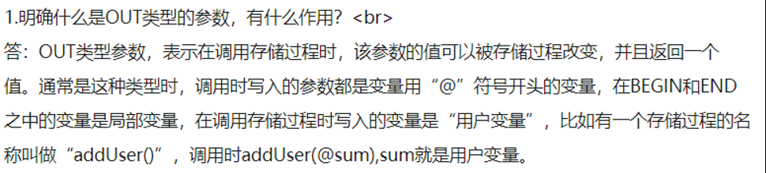

### 存储过程与自定义函数的区别


- 存储过程实现的功能要复杂一些，而函数针对性更强，对表做操作用存储过程更多一些
- 存储过程可以返回多个值，函数只能有一个返回值
- 存储过程一般独立的来执行，函数可以作为其他SQL语句的组成部分来出现，和内置函数类似
- 函数比较少用，存储过程就是编译好的函数等待调用，存储在服务器中

## 游标

看mysql必知必会

```sql
-- 出处 https://blog.csdn.net/yjclsx/article/details/84566009

-- 创建存储过程之前需判断该存储过程是否已存在，若存在则删除
DROP PROCEDURE IF EXISTS init_reportUrl; 
-- 创建存储过程
CREATE PROCEDURE init_reportUrl()
BEGIN
	-- 定义变量
	DECLARE s int DEFAULT 0;
	DECLARE report_id varchar(255);
	DECLARE report_url varchar(256);
	-- 定义游标，并将sql结果集赋值到游标中
	DECLARE report CURSOR FOR select reportId,reportUrl from patrolReportHistory;
	-- 声明当游标遍历完后将标志变量置成某个值
	DECLARE CONTINUE HANDLER FOR NOT FOUND SET s=1;
	-- 打开游标
	open report;
		-- 将游标中的值赋值给变量，注意：变量名不要和返回的列名同名，变量顺序要和sql结果列的顺序一致
		fetch report into report_id,report_url;
		-- 当s不等于1，也就是未遍历完时，会一直循环
		while s<>1 do
			-- 执行业务逻辑
			update patrolreporthistory set reportUrl = CONCAT('patrolReport.html?monitorId=',substring(report_url,15,1),'&reportId=',report_id) where reportId=report_id;
			-- 将游标中的值再赋值给变量，供下次循环使用
			fetch report into report_id,report_url;
		-- 当s等于1时表明遍历以完成，退出循环
		end while;
	-- 关闭游标
	close report;
END;

-- 执行存储过程
call init_reportUrl();
```


## 触发器

### 介绍

https://www.cnblogs.com/yank/p/4193820.html

MySQL 包含对触发器的支持。触发器是一种与表操作有关的数据库对象，当触发器所在表上出现指定事件时，将调用该对象，即表的操作事件触发表上的触发器的执行。

**作用**

1. 触发器可通过数据库中的相关表实现级联更改；通过级联引用完整性约束可以更有效地执行这些更改。
2. 触发器可以强制比用 CHECK 约束定义的约束更为复杂的约束。与 CHECK 约束不同，触发器可以引用其它表中的列。例如，触发器可以使用另一个表中的 SELECT 比较插入或更新的数据，以及执行其它操作，如修改数据或显示用户定义错误信息。
3. 触发器还可以强制执行业务规则
4. 触发器也可以评估数据修改前后的表状态，并根据其差异采取对策。  

在 MySQL 中，创建触发器语法如下：

```mysql
CREATE TRIGGER trigger_name
trigger_time
trigger_event ON tbl_name
FOR EACH ROW
trigger_stmt
```

其中：

trigger_name：标识触发器名称，用户自行指定；
trigger_time：标识触发时机，取值为 BEFORE 或 AFTER；
trigger_event：标识触发事件，取值为 INSERT、 UPDATE 或 DELETE；
tbl_name：标识建立触发器的表名，即在哪张表上建立触发器；
trigger_stmt：触发器程序体，可以是一句 SQL 语句，或者用 BEGIN 和 END 包含的多条语句。

由此可见，可以建立 6 种触发器，即： BEFORE INSERT、 BEFORE UPDATE、 BEFORE DELETE、 AFTER INSERT、AFTER UPDATE、 AFTER DELETE。

另外有一个限制是不能同时在一个表上建立 2 个相同类型的触发器，因此在一个表上最多建立 6 个触发器。

### 例子

假设系统中有两个表：

1)班级表 class(班级号 classID, 班内学生数 stuCount)
2)学生表 student(学号 stuID, 所属班级号 classID)

- **创建触发器**

  要创建触发器来使班级表中的班内学生数随着学生的添加自动更新，代码如下：

  ```mysql
  create trigger tri_stuInsert after insert
  on student for each row
  begin
  declare c int;
  set c = (select stuCount from class where classID=new.classID);
  update class set stuCount = c + 1 where classID = new.classID;
  ```

  

- **查看触发器**

  和查看数据库（show databases;）查看表格（show tables;）一样，查看触发器的语法如下：

  ```mysql
  SHOW TRIGGERS [FROM schema_name];
  ```

  其中， schema_name 即 Schema 的名称，在 MySQL 中 Schema 和 Database 是一样的，也就是说，可以指定数据库名，这样就不必先“USE database_name;”了。

- **删除触发器**

  和删除数据库、删除表格一样，删除触发器的语法如下：

  ```mysql
  DROP TRIGGER [IF EXISTS] [schema_name.]trigger_name
  ```

## 变量

使用SElECT语句，或者SELECT...INTO语句 以及SET = @变量名 声明的变量是用户变量，用户变量跟MySQL客户端绑定，只对当前用户所使用的客户端生效。

DECLARE称之为局部变量，声明的时候必须放在第一行只能作用于BEGIN~END语句块之间，运行完BEGIN~END语句，局部变量消失


## 约束

### 1. 约束的作用：

对表中的数据进行限制， 保证数据的正确性、 有效性和完整性。一个表如果添加了约束， 不正确的数据将无法插入到表中。约束在创建表的时候添加比较合适。  

### 2. 约束种类：

| 约束名 | 关键字      | 说明                         |
| ------ | ----------- | ---------------------------- |
| 主键   | primary key | 1) 唯一 2) 非空              |
| 默认   | default     | 如果一列没有值，使用默认值   |
| 非空   | not null    | 这一列必须有值               |
| 唯一   | unique      | 这一列不能有重复值           |
| 外键   | foreign key | 主表中主键列，在从表中外键列 |

####   2.1 主键约束

**主键的作用**

```
用来唯一标识数据库中的每一条记录
```

**哪个字段应该作为表的主键**

```java
通常不用业务字段作为主键，单独给每张表设计一个id 的字段，把id 作为主键。 主键是给数据库和程序使用的，不是给最终的客户使用的。所以主键有没有含义没有关系，只要不重复，非空就行。
    
主键可以单列，也可以是多列。
```

**主键自增**

> AUTO_INCREMENT 表示自动增长(字段类型必须是整数类型)
>
> 添加记录失败的时候也会自动添加，例如外键约束失败
>
> 自增长只能用在主键上  


#### 2.2 唯一约束

- **可能遇到的错误**

如果唯一性是后期加的（设计完表之后，并且表里已经有了一些数据）
 可能存在表中部分数据不满足唯一性的情况，例：想对字段sid设置唯一性，但目前表中有两条数据sid都是472，这是设置唯一性就会出错。
 如下图所示（这种情况在命令行操作下也会出现，只不过是以文字的形式）


这时就应该删除重复的数据后再设置唯一性。

- **组合索引的唯一性**

>  例子：有一个保存大四毕业生每周上传的毕设报告的表。它有学生id：sid，周数：week，报告内容：content等字段。
>  这里只允许每个学生每周上传一份周报告，即sid和week的组合不能出现重复的情况，也就是说不能有两条记录他们的sid和week都相同。
>  如何在mysql中进行设置呢，这里只给出navicat中的方法：如图只需要选中两个栏位就可以啦！

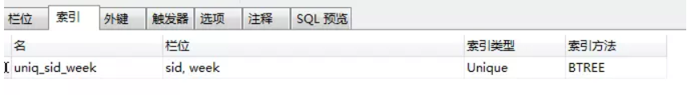

#### 2.3 非空约束

>   某一列不能为 null。  

####   2.4 默认约束

#### 2.5 外键约束

-   **什么是外键约束**

> ​	在从表中与**主表主键**对应的那一列，如：员工表中的 dep_id
> ​	主表： 一方，用来约束别人的表
> ​	从表： 多方，被别人约束的表  

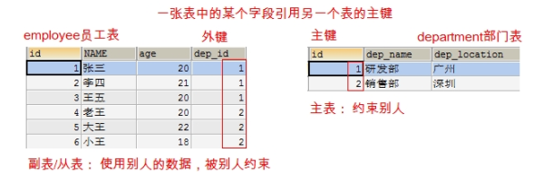

- **条件**

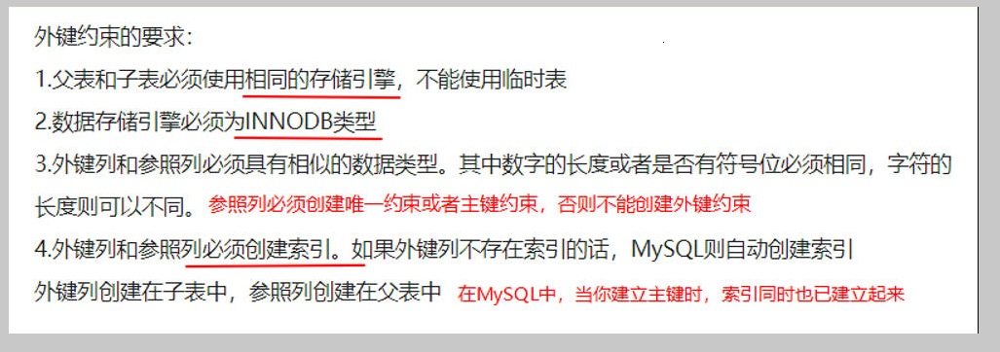

> 在实际的开发过程中，我们很少使用物理的外键约束，很多都去使用逻辑的外键约束  

-   **外键的级联**  


>   在修改和删除主表的主键时，同时更新或删除副表的外键值，称为级联操作

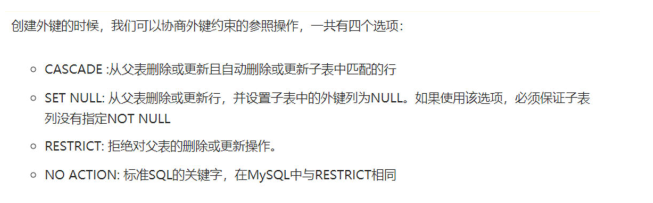

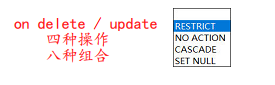

### 3. sql语句

```mysql
-- 各种约束建表 test库 --user表
-- key 和 index 好像是一样的
CREATE TABLE `user` (
	`id` INT (11) NOT NULL AUTO_INCREMENT,
	`username` VARCHAR (50) NOT NULL DEFAULT '',
	`password` VARCHAR (50) NOT NULL DEFAULT '',
	`name` VARCHAR (50) DEFAULT NULL,
	`refer` INT (11) DEFAULT '8',
	PRIMARY KEY (`id`, `username`, `password`),
	UNIQUE KEY `asd` (`refer`) USING BTREE,
	KEY `name` (`name`),
	CONSTRAINT `user_ibfk_1` FOREIGN KEY (`refer`) REFERENCES `user_copy` (`id`) ON DELETE CASCADE ON UPDATE CASCADE
) ENGINE = INNODB AUTO_INCREMENT = 3 DEFAULT CHARSET = utf8 

-- 删除外键约束
ALTER TABLE `user` DROP FOREIGN KEY `user_ibfk_1`;

-- 修改Default约束，null约束
ALTER TABLE `user` MODIFY COLUMN `username` VARCHAR (50) CHARACTER
SET utf8 COLLATE utf8_general_ci NULL DEFAULT '' AFTER `id`,
 MODIFY COLUMN `password` VARCHAR (50) CHARACTER
SET utf8 COLLATE utf8_general_ci NOT NULL DEFAULT hello AFTER `username`,

-- 主键增删
 DROP PRIMARY KEY,
 ADD PRIMARY KEY (`id`),

-- 普通索引增删
 DROP INDEX `asd`,
 ADD INDEX `asd` (`refer`) USING BTREE,

-- 唯一约束增删
 DROP INDEX `name`,
 ADD UNIQUE INDEX `name` (`name`) USING BTREE;
 
-- 查看索引（不是约束）,一样效果
SHOW KEYS FROM USER;
SHOW INDEX FROM USER;

```

### 4. 约束和索引

> 约束和索引，前者是维护数据的正确性。启者用来实现数据查询的优化。

 

## 多表连接

### 介绍

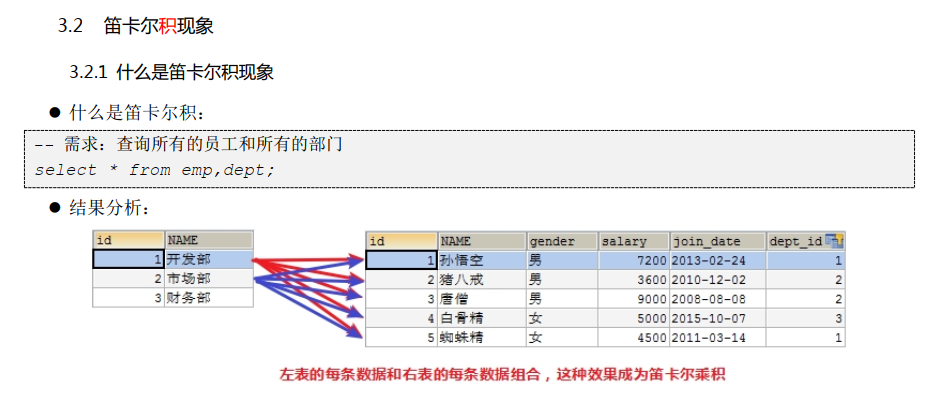

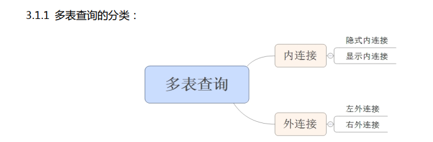

### 连接

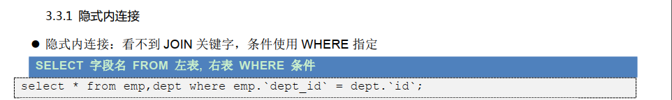

 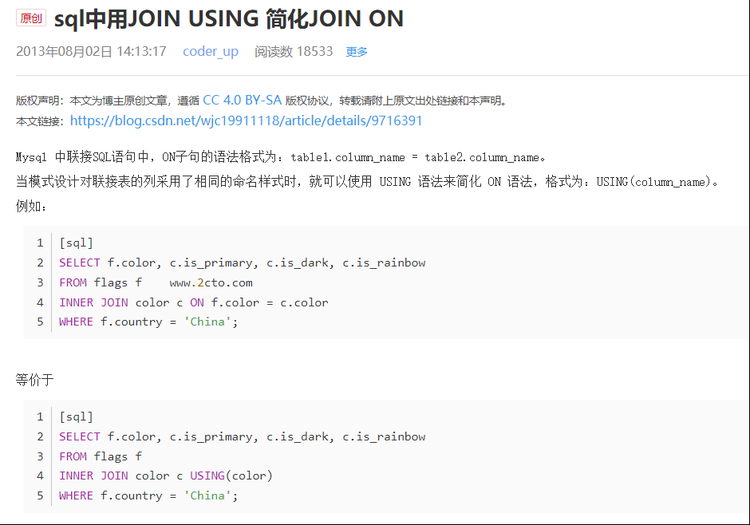

### 例子

**tdb_goods**

 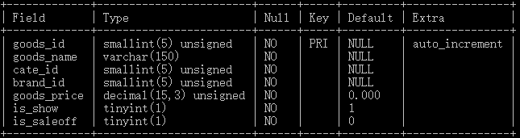

**tdb_goods_cates**

 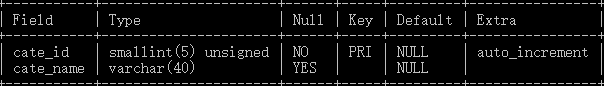

**Tdb_goods_brands**

 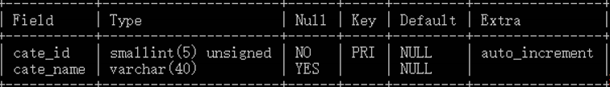


 


 

 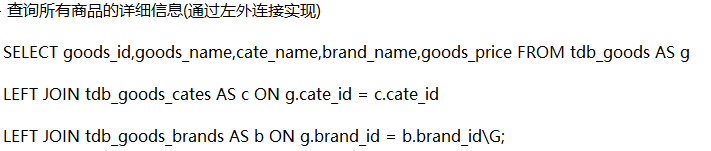

 


 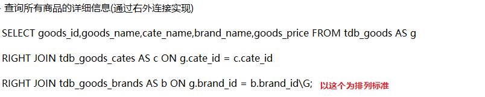

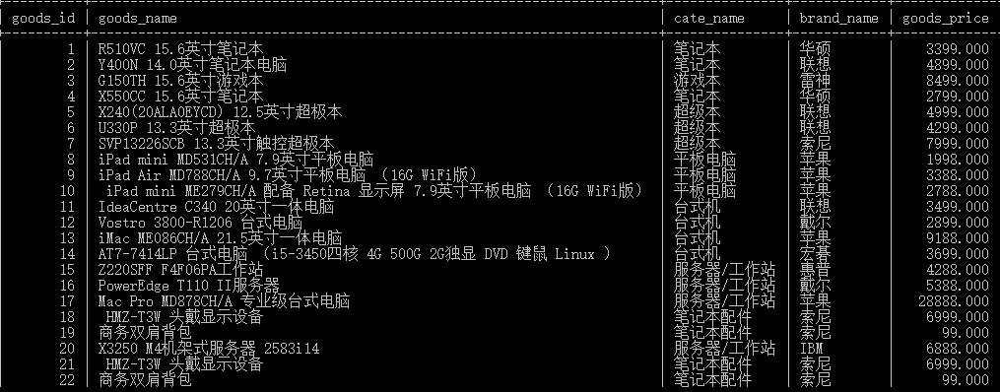

## 控制流程

> 待解决

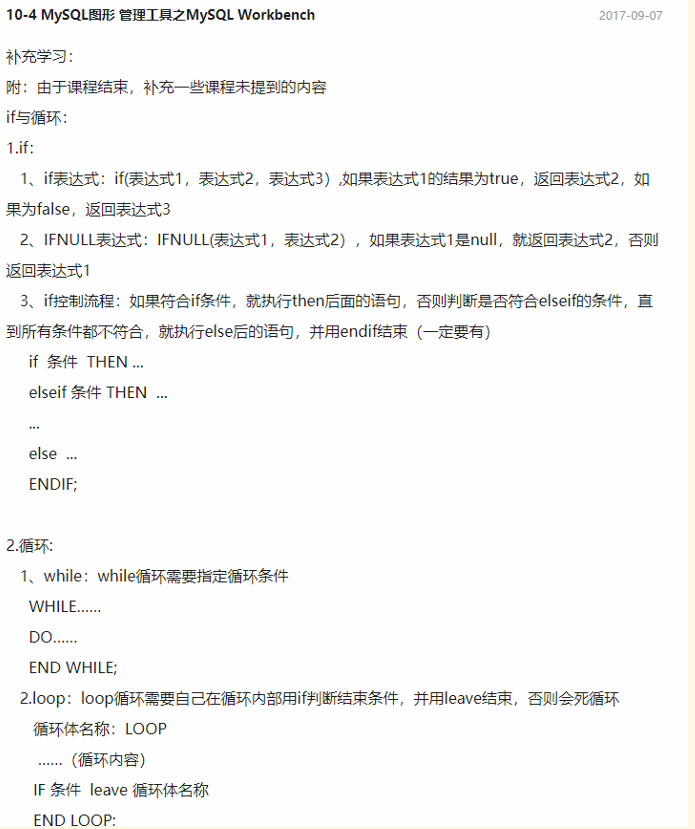

## schema

[difference-between-schema-database-in-mysql](https://stackoverflow.com/questions/11618277/difference-between-schema-database-in-mysql)

As defined in the [MySQL Glossary](http://dev.mysql.com/doc/en/glossary.html#glos_schema):

> In MySQL, physically, a ***schema\*** is synonymous with a ***database\***. You can substitute the keyword `SCHEMA` instead of `DATABASE` in MySQL SQL syntax, for example using `CREATE SCHEMA` instead of `CREATE DATABASE`.
>
> Some other database products draw a distinction. For example, in the Oracle Database product, a ***schema\*** represents only a part of a database: the tables and other objects owned by a single user.

> Depends on the database server. `MySQL` doesn't care, its basically the same thing.
>
> `Oracle`, `DB2`, and other enterprise level database solutions make a distinction. Usually a **schema is a collection of tables** and a **Database is a collection of schemas.**