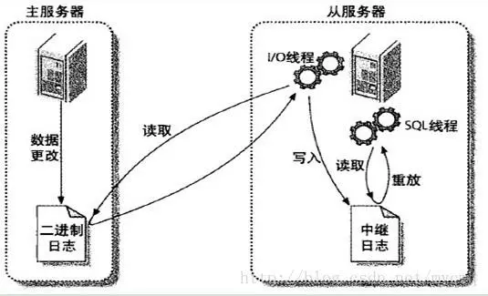

# 安装

## 还没测试

centos7.4下二进制方式安装mysql8.0 https://blog.csdn.net/u013246891/article/details/81747639

MYSQL8.0多实例详细讲解内含配置文件 https://blog.csdn.net/lida1234567/article/details/82866581

安装mysql5.6不用初始化设置

## msi安装

**官网下载msi**，不建议

1. 打开下载的 mysql 安装文件双击解压缩，运行“mysql-5.5.40-win32.msi”。  

   选择自定义

2. Detail configuration

   选择mysql数据库的大致用途， “Multifunctional Database（通用多功能型，好） ”、 “Transactional Database Only（服务器类型，专注于事务处理，一般） ”、 “Non-Transactional Database Only（非事务处理型， 较简单， 主要做一些监控、 记数用， 对 MyISAM 数据类型的支持仅限于 non-transactional），  

3. 选择网站并发连接数，同时连接的数目， “Decision Support(DSS)/OLAP（ 20个左右） “Online ”、 TransactionProcessing(OLTP)（ 500 个左右） ”、 “Manual Setting（手动设置，自己输一个数） ”  

4. 是否启用 TCP/IP 连接，设定端口，如果不启用，就只能在自己的机器上访问 mysql 数据库了，在这个页面上，您还可以选择“启用标准模式”（ Enable Strict Mode），这样 MySQL 就不会允许细小的语法错误。  

5. 按“Finish”后有一个比较常见的错误， 就是不能“Start service”， 一般出现在以前有安装 mysql的服务器上，解决的办法，先保证以前安装的 mysql 服务器彻底卸载掉了  

## zip安装

**官网下载zip文件**

1. 解压目录下创建my.ini文件，自己配置

2. 在bin目录下开启cmd，安装win服务

   ```bash
   mysqld --install
   
   #指定ini文件
   mysqld install MySQL3  --defaults-file="D:\mysql8.0\my.ini“ //默认目录下不需要
   ```

3. 初始化data

   新版mysql解压后安装目录没有data文件夹，需要初始化，**注意不能手动创建，**因为初始的时候还随机生 成了一个初始root密码，初始化命令如下所示：

   ```bash
   #执行此命令或默认一个密码，屏幕能看到
   mysqld --initialize --console 
   mysqld --initialize
   
   #指定ini文件
   mysqld --defaults-file=D:\mysql8.0\my.ini --initialize --console
   mysqld --initialize-insecure
   执行此命令则默认没有密码。
   ```

   这时候安装目录下生成了data文件夹。
   进入data文件，打开一个.err结尾的文件,里面有初始化的密码。**这个得记住了，后面步骤登录使用的**
   

   

4. 启动服务

   ```
   net start mysql
   ```

5. 登录

   ```
   mysql -u root -p
   ```

6. 修改密码

   ```mysql
   ALTER USER 'root'@'localhost' IDENTIFIED WITH mysql_native_password BY '1234'
   ```

   

## 复制安装

[WIN10上装多个MySQL实例](https://blog.csdn.net/ycd500756/article/details/80065127)

利用原来数据库安装

背景：我本机Win10已经装好了一个MySQL实例：安装路径（默认）是C:\Program Files (x86)\MySQL；

### 1资料准备

##### 1.1复制文件夹MySQL，然后重命名


##### 1.2复制data

查看C:\Program Files (x86)\MySQL下的my.in文件，可以查看MySQL服务启动的端口，数据的存储路径


打开C:/ProgramData/MySQL/MySQL Server 5.1，将MySQL Server 5.1复制两份，然后重命名

### 2.修改启动my.ini文件中的port，basedir，datadir

修改C:\Program Files (x86)\MySQL\MySQL Server 5.1 - 3307下的my.ini文件：启动端口改为3307；数据存储路径改为上一步骤对应的路径：C:\ProgramData\MySQL\MySQL Server 5.1 - 3307\data；根路径basedir

C:\Program Files (x86)\MySQL\MySQL Server 5.1 - 3308下的my.ini文件也做一样的修改：修改启动端口位3308；数据存储路径改为上一步骤对应的路径：C:\ProgramData\MySQL\MySQL Server 5.1 - 3308\data;根路径basedir

### 3.设置Mysql为系统服务

进入MySQL Server 5.1 - 3307目录中的bin目录下 运行命令 mysqld –install MySQL-3307 (服务名 自定义即可)

对MySQL Server 5.1 - 3308一样的操作

------

### 4.检查注册表：

运行regedit打开注册表找到

> HEY_LOCAL_MACHINE\SYSTEM\CurrentControlSet\services\

找到MySQL-3307 和MySQL-3308 查看**ImagePath**的值是否是对应的路径，
如果ImagePath的值是

> C:\Program Files (x86)\MySQL\MySQL Server 5.1 - 3307\bin\mysqld” MySQL-3307

则配置成功。

我查看我的注册表的时候ImagePath的值为：

> “C:\Program Files(x86)\MySQL\MySQL Server 5.1 \bin\mysqld” MySQL-3307；

（没有匹配自己的安装路径）；因为我在安装时该参数值默认为第一个MySQL实例的路径，这时候手动修改ImagePath的值即可。

------

### 5.启动服务：

##### 5.1.通过命令启动：net start MySQL-3307


##### 5.2.或者起任务管理器中找到该服务，手动启动


------

### 6遇到的问题：

##### 6.1发生系统错误 193。

> C:\Users\asus>net start MySQL-3307
> 发生系统错误 193。
> *** 不是有效的 Win32 应用程序。

解决办法：bin目录下有个mysqld的空文件，删除即可。

## community 

社区版，里面包含了很多下载工具，按需选择，也是msi

# 卸载

卸载服务 sc delete 服务名

控制面板卸载

如果是解压安装，直接删除文件夹就行了

删除 c 盘 ProgramDate 目录中关于 MySQL 的目录。路径为： C:\ProgramData\MySQL(是隐藏文件,需要显示 出来)

# 启动

1. 计算机管理里启动服务，需要先安装服务。
2. 也需要先安装服务

# 连接

## navicat

简单不说了

## mysql.exe

1. 在bin目录下通过cmd运行`./mysql` 命令，直接运行是无法登录的。需要cmd。ini文件可以设置client的默认port和提示符。
2. 也可以设置系统path，方便调用

```sql
mysql --host=dc.leazy.cn --port=8891 -u craser -p
```


# 提示符

[mysql提示符常用参数](https://blog.csdn.net/xiaoyi23000/article/details/52916070?depth_1-utm_source=distribute.pc_relevant.none-task&utm_source=distribute.pc_relevant.none-task)

在mysql配置文件my.cnf(windows系统为.ini文件)的mysql选项下定义prompt参数进行提示符美化，使之达到自己想要的效果，

```mysql
\D 完整的日期
\d 当前数据库
\h 服务器名称
\u 当前用户
\p 端口
prompt \u@\h:\p \d> #结果为 root@localhost:3308 test>
```


# DBMS

数据库管理系统（ DataBase Management System， DBMS） ： 指一种操作和管理数据库的大型软件，用于建立、 使用和维护数据库， 对数据库进行统一管理和控制， 以保证数据库的安全性和完整性。用户通过数据库管理系统访问数据库中表内的数据  。

数据库管理程序(DBMS)可以管理多个数据库，一般开发人员会针对每一个应用创建一个数据库。为保存应用中实体的数据，一般会在数据库创建多个表，以保存程序中实体 User 的数据。
数据库管理系统、数据库和表的关系如图所示：  


# 备份

## copy data文件夹


# ini配置文件

https://www.cnblogs.com/kuoAT/p/7080770.html


# 性能监控

1. 先查询 show processLIst、show status、show variables
2. 分析所在服务器和mysql相关进程数据

[mysql性能检测常用命令](https://blog.csdn.net/li_adou/article/details/78791972)

[Mysql性能优化(一) - 性能检测与瓶颈分析](https://baike.xsoftlab.net/view/217.html#2)

[linux查询mysql内存使用率_Linux查看CPU和内存使用情况方法总结](https://blog.csdn.net/weixin_35785014/article/details/113584969)

[MySQL服务进程占用系统CPU达100%](https://developer.aliyun.com/article/277610)

[MySQL查看数据库性能常用命令](https://blog.csdn.net/qq_15735767/article/details/93038879?utm_medium=distribute.pc_relevant.none-task-blog-baidujs_title-0&spm=1001.2101.3001.4242)

[Mysql性能瓶颈深度定位分析](https://blog.csdn.net/smooth00/article/details/106614578)

# 主从复制

还有很多文章没有看，折叠起来 mysql主从复制

## 主从复制原理

主服务器数据库的每次操作都会记录在其二进制文件mysql-bin.xxx（该文件可以在mysql目录下的data目录中看到）中，从服务器的I/O线程使用专用账号登录到主服务器中读取该二进制文件，并将文件内容写入到自己本地的中继日志 relay-log 文件中，然后从服务器的SQL线程会根据中继日志中的内容执行SQL语句



## 作用

1、可以作为备份机制，相当于热备份
2、可以用来做读写分离，均衡数据库负载

## 缺陷

复制在slave上是串行化的，也就是说master上的并行更新操作不能在slave上并行操作。主库并发越高延迟越大，现在有些并行复制的新特性。

## 操作

### 1. 锁库，同步数据

主从服务器需要有相同的初态

1. 将主服务器要同步的数据库枷锁，避免同步时数据发生改变

   ```php
   mysql>use db;
   mysql>flush tables with read lock;  
   ```

2. 将主服务器数据库中数据导出

   ```mysql
   mysql> mysqldump -uroot -pxxxx db > db.sql;
   --  这个命令是导出数据库中所有表结构和数据，如果要导出函数和存储过程的话使用
   mysql> mysqldump -R -ndt db -uroot -pxxxx > db.sql
   ```

   其他关于mysql导入导出命令的[戳这里](http://www.cnblogs.com/chevin/p/5683281.html)

3. 将初始数据导入从服务器数据库

   ```php
   mysql>create database db;
   mysql>use db;
   mysql>source db.sql;
   ```

### 2. 主服务器（测试3308）设置为master

1. ini文件

   ```ini
   #主数据库端ID号
   server_id = 1           
    #开启二进制日志                  
   log-bin = mysql-bin    
   #需要复制的数据库名，如果复制多个数据库，重复设置这个选项即可                  
   binlog-do-db = db        
   #将从服务器从主服务器收到的更新记入到从服务器自己的二进制日志文件中                 
   log-slave-updates                        
   #控制binlog的写入频率。每执行多少次事务写入一次(这个参数性能消耗很大，但可减小MySQL崩溃造成的损失) 
   sync_binlog = 1                    
   #这个参数一般用在主主同步中，用来错开自增值, 防止键值冲突
   auto_increment_offset = 1           
   #这个参数一般用在主主同步中，用来错开自增值, 防止键值冲突
   auto_increment_increment = 1            
   #二进制日志自动删除的天数，默认值为0,表示“没有自动删除”，启动时和二进制日志循环时可能删除  
   expire_logs_days = 7                    
   #将函数复制到slave  
   log_bin_trust_function_creators = 1       
   ```

2. 重启MySQL，创建允许从服务器同步数据的账户

   ```mysql
   # 创建slave账号account，密码123456
   grant replication slave on *.* to 'slave'@'127.0.0.1' identified by '123456';
   # 更新数据库权限
   flush privileges;
   # 查看主服务器状态
   show master status\G;
   ***************** 1. row ****************
               File: mysql-bin.000355 #当前记录的日志
           Position: 120 #日志中记录的位置  
       Binlog_Do_DB: 
   Binlog_Ignore_DB: 
   ```

### 3. 从服务器（测试3307）接上master

1. ini

   ```ini
   server_id = 2
   log-bin = mysql-bin
   log-slave-updates
   sync_binlog = 0
   #log buffer将每秒一次地写入log file中，并且log file的flush(刷到磁盘)操作同时进行。该模式下在事务提交的时候，不会主动触发写入磁盘的操作
   innodb_flush_log_at_trx_commit = 0        
   #指定slave要复制哪个库
   replicate-do-db = db         
   #MySQL主从复制的时候，当Master和Slave之间的网络中断，但是Master和Slave无法察觉的情况下（比如防火墙或者路由问题）。Slave会等待slave_net_timeout设置的秒数后，才能认为网络出现故障，然后才会重连并且追赶这段时间主库的数据
   slave-net-timeout = 60                    
   log_bin_trust_function_creators = 1
   ```

2. 连接

   如果从服务器关闭后，那么需要重新走这一步

   ```mysql
   -- 如果之前有运行过，即便是重新启动，需要先执行命令停下来，slave_IO_Runnign和Slave_SQL_Running必须都为no
   STOP SLAVE 
   
   -- 执行同步命令，设置主服务器ip，使用主服务器给的同步账号密码，同步位置，如果位置不对，需要重新设置，对应上面的show master status
   change master to master_host='127.0.0.1',master_port=3308, master_user='slave',master_password='123456',master_log_file='mysql-bin.000355',master_log_pos=120;
   
   -- 开启同步功能
   start slave;
   
   -- 查看从服务器状态
   show slave status;
   
   -- Slave_IO_Running及Slave_SQL_Running进程必须正常运行，即Yes状态，否则说明同步失败，若失败查看mysql错误日志中具体报错详情来进行问题定位
   mysql>show slave status\G;
   *************************** 1. row ***************************
                  Slave_IO_State: Waiting for master to send event
                     Master_Host: 10.10.20.111
                     Master_User: account
                     Master_Port: 3306
                   Connect_Retry: 60
                 Master_Log_File: mysql-bin.000033
             Read_Master_Log_Pos: 337523
                  Relay_Log_File: db2-relay-bin.000002
                   Relay_Log_Pos: 337686
           Relay_Master_Log_File: mysql-bin.000033
                Slave_IO_Running: Yes
               Slave_SQL_Running: Yes
                 Replicate_Do_DB:
             Replicate_Ignore_DB:
             ...
   ```

### 4. 解锁

解锁主服务器

```mysql
mysql>unlock tables;
```

### 错误

uuid不能相同，也就是copy数据库后需要修改

地址： `\data\auto.cnf`

# 参考文献

[MySQL所有的主从同步架构搭建方式](https://www.cnblogs.com/renshengdezheli/p/12979504.html)

[MySQL Replication 主从复制全方位解决方案](https://developer.aliyun.com/article/439162)

# 性能分析


[Mysql性能瓶颈深度定位分析](https://blog.csdn.net/smooth00/article/details/106614578)