# 安装

## 还没测试

centos7.4下二进制方式安装mysql8.0 https://blog.csdn.net/u013246891/article/details/81747639

MYSQL8.0多实例详细讲解内含配置文件 https://blog.csdn.net/lida1234567/article/details/82866581

安装mysql5.6不用初始化设置

## msi安装

**官网下载msi**，不建议

1. 打开下载的 mysql 安装文件双击解压缩，运行“mysql-5.5.40-win32.msi”。  

   选择自定义

2. Detail configuration

   选择mysql数据库的大致用途， “Multifunctional Database（通用多功能型，好） ”、 “Transactional Database Only（服务器类型，专注于事务处理，一般） ”、 “Non-Transactional Database Only（非事务处理型， 较简单， 主要做一些监控、 记数用， 对 MyISAM 数据类型的支持仅限于 non-transactional），  

3. 选择网站并发连接数，同时连接的数目， “Decision Support(DSS)/OLAP（ 20个左右） “Online ”、 TransactionProcessing(OLTP)（ 500 个左右） ”、 “Manual Setting（手动设置，自己输一个数） ”  

4. 是否启用 TCP/IP 连接，设定端口，如果不启用，就只能在自己的机器上访问 mysql 数据库了，在这个页面上，您还可以选择“启用标准模式”（ Enable Strict Mode），这样 MySQL 就不会允许细小的语法错误。  

5. 按“Finish”后有一个比较常见的错误， 就是不能“Start service”， 一般出现在以前有安装 mysql的服务器上，解决的办法，先保证以前安装的 mysql 服务器彻底卸载掉了  

## zip安装

**官网下载zip文件**

1. 解压目录下创建my.ini文件，自己配置

2. 在bin目录下开启cmd，安装win服务

   ```bash
   mysqld --install
   
   #指定ini文件
   mysqld install MySQL3  --defaults-file="D:\mysql8.0\my.ini
   ```

3. 初始化data

   新版mysql解压后安装目录没有data文件夹，需要初始化，**注意不能手动创建，**因为初始的时候还随机生 成了一个初始root密码，初始化命令如下所示：

   ```bash
   #执行此命令或默认一个密码，屏幕能看到
   mysqld --initialize --console 
   mysqld --initialize
   
   #指定ini文件
   mysqld --defaults-file=D:\mysql8.0\my.ini --initialize --console
   mysqld --initialize-insecure
   执行此命令则默认没有密码。
   ```

   这时候安装目录下生成了data文件夹。
   进入data文件，打开一个.err结尾的文件,里面有初始化的密码。**这个得记住了，后面步骤登录使用的**
   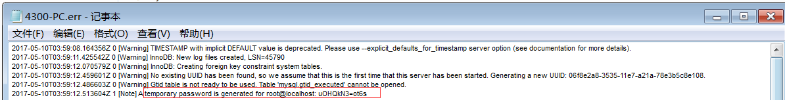

   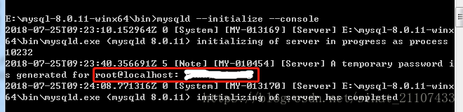

4. 启动服务

   ```
   net start mysql
   ```

5. 登录

   ```
   mysql -u root -p
   ```

6. 修改密码

   ```mysql
   ALTER USER 'root'@'localhost' IDENTIFIED WITH mysql_native_password BY '1234'
   ```

   

## 复制安装

[WIN10上装多个MySQL实例](https://blog.csdn.net/ycd500756/article/details/80065127)

利用原来数据库安装

背景：我本机Win10已经装好了一个MySQL实例：安装路径（默认）是C:\Program Files (x86)\MySQL；

### 1资料准备

##### 1.1复制文件夹MySQL，然后重命名

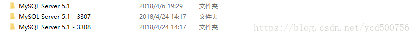

##### 1.2复制data

查看C:\Program Files (x86)\MySQL下的my.in文件，可以查看MySQL服务启动的端口，数据的存储路径

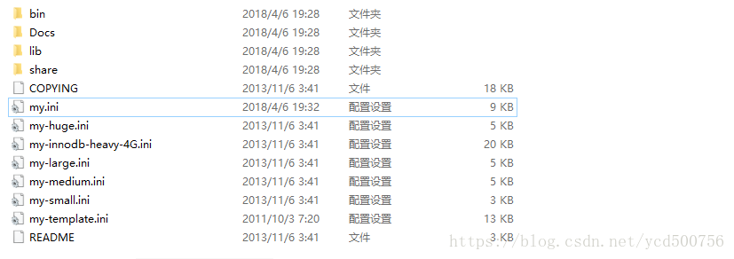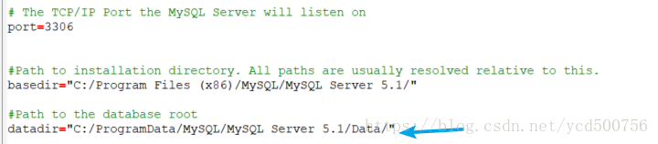

打开C:/ProgramData/MySQL/MySQL Server 5.1，将MySQL Server 5.1复制两份，然后重命名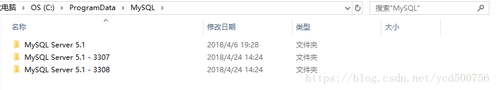

### 2.修改启动my.ini文件中的port，basedir，datadir

修改C:\Program Files (x86)\MySQL\MySQL Server 5.1 - 3307下的my.ini文件：启动端口改为3307；数据存储路径改为上一步骤对应的路径：C:\ProgramData\MySQL\MySQL Server 5.1 - 3307\data；根路径basedir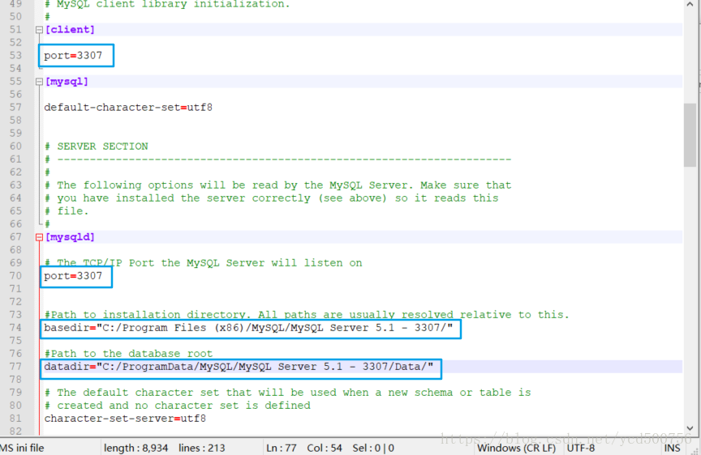

C:\Program Files (x86)\MySQL\MySQL Server 5.1 - 3307下的my.ini文件也做一样的修改：修改启动端口位3308；数据存储路径改为上一步骤对应的路径：C:\ProgramData\MySQL\MySQL Server 5.1 - 3308\data;根路径basedir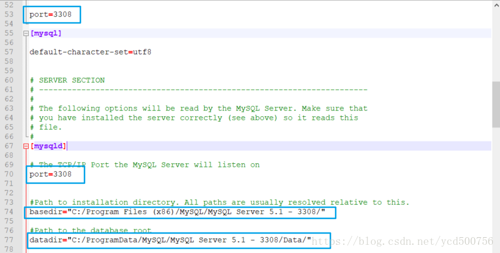

### 3.设置Mysql为系统服务

进入MySQL Server 5.1 - 3307目录中的bin目录下 运行命令 mysqld –install MySQL-l3307 (服务名 自定义即可)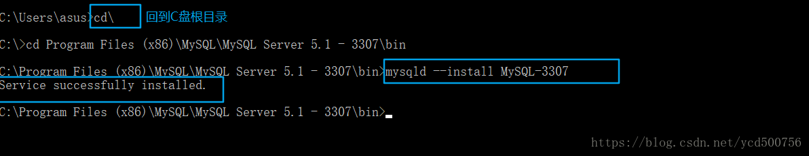

对MySQL Server 5.1 - 3308一样的操作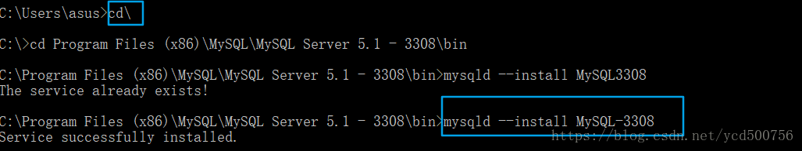

------

### 4.检查注册表：

运行regedit打开注册表找到

> HEY_LOCAL_MACHINE/SYSTEM/CurrentControlSet/services/

找到MySQL-3307 和MySQL-3308 查看**ImagePath**的值是否是对应的路径，
如果ImagePath的值是

> C:\Program Files (x86)\MySQL\MySQL Server 5.1 - 3307\bin\mysqld” MySQL-3307

则配置成功。

我查看我的注册表的时候ImagePath的值为：

> “C:\Program Files(x86)\MySQL\MySQL Server 5.1 \bin\mysqld” MySQL-3307；

（没有匹配自己的安装路径）；因为我在安装时该参数值默认为第一个MySQL实例的路径，这时候手动修改ImagePath的值即可。

------

### 5.启动服务：

##### 5.1.通过命令启动：net start MySQL-3307

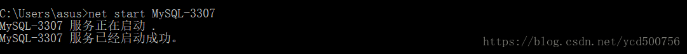

##### 5.2.或者起任务管理器中找到该服务，手动启动

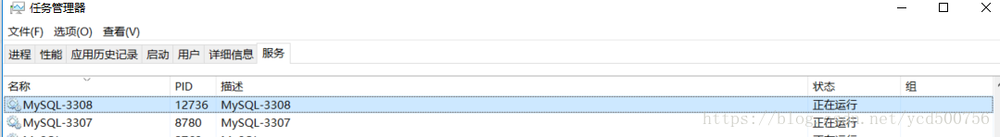

------

### 6遇到的问题：

##### 6.1发生系统错误 193。

> C:\Users\asus>net start MySQL-3307
> 发生系统错误 193。
> *** 不是有效的 Win32 应用程序。

解决办法：bin目录下有个mysqld的空文件，删除即可。

## community 

社区版，里面包含了很多下载工具，按需选择，也是msi

# 卸载

卸载服务 sc delete 服务名

控制面板卸载

如果是解压安装，直接删除文件夹就行了

删除 c 盘 ProgramDate 目录中关于 MySQL 的目录。路径为： C:\ProgramData\MySQL(是隐藏文件,需要显示 出来)

# 启动

1. 计算机管理里启动服务，需要先安装服务。
2. 也需要先安装服务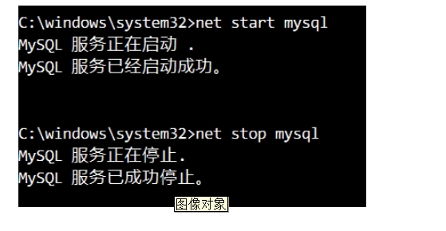

# 连接

## navicat

简单不说了

## mysql.exe

1. 在bin目录下通过cmd运行`./mysql` 命令，直接运行是无法登录的。需要cmd。ini文件可以设置client的默认port和提示符。
2. 也可以设置系统path，方便调用

# 提示符

[mysql提示符常用参数](https://blog.csdn.net/xiaoyi23000/article/details/52916070?depth_1-utm_source=distribute.pc_relevant.none-task&utm_source=distribute.pc_relevant.none-task)

在mysql配置文件my.cnf(windows系统为.ini文件)的mysql选项下定义prompt参数进行提示符美化，使之达到自己想要的效果，

```mysql
\D 完整的日期
\d 当前数据库
\h 服务器名称
\u 当前用户
\p 端口
prompt \u@\h:\p \d> #结果为 root@localhost:3308 test>
```


# DBMS

数据库管理系统（ DataBase Management System， DBMS） ： 指一种操作和管理数据库的大型软件，用于建立、 使用和维护数据库， 对数据库进行统一管理和控制， 以保证数据库的安全性和完整性。用户通过数据库管理系统访问数据库中表内的数据  。

数据库管理程序(DBMS)可以管理多个数据库，一般开发人员会针对每一个应用创建一个数据库。为保存应用中实体的数据，一般会在数据库创建多个表，以保存程序中实体 User 的数据。
数据库管理系统、数据库和表的关系如图所示：  

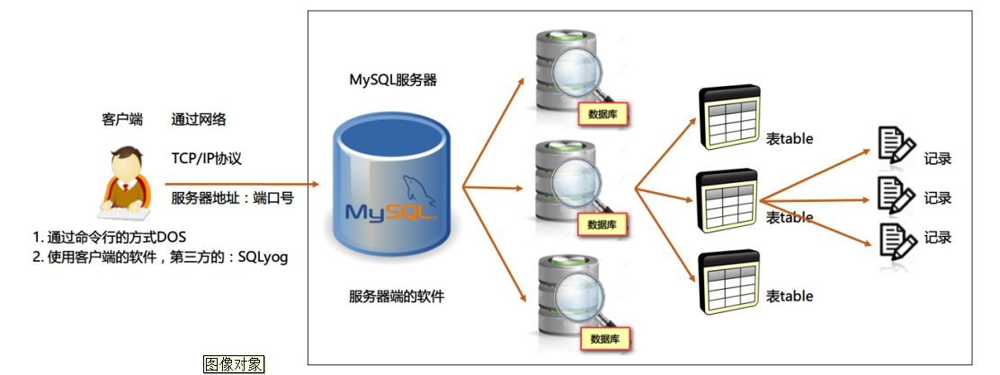

# 备份

## copy data文件夹


# ini配置文件

https://www.cnblogs.com/kuoAT/p/7080770.html