#         事务TCL

## 介绍

事务执行是一个整体， 所有的 SQL 语句都必须执行成功。如果其中有 1 条 SQL 语句出现异常， 则所有的SQL 语句都要回滚，整个业务执行失败。  保证原子操作。（多线程中不保证线程切换问题）

> 注意：
>
> ​	事务是原子操作，但并不保证（事务级别：业务）并发问题，锁机制保证（数据级别：行、表）并发问题

## 四大特性 ACID

| 事务特性               | 含义                                                         |
| ---------------------- | ------------------------------------------------------------ |
| 原子性（ Atomicity）   | 每个事务都是一个整体，不可再拆分，事务中所有的 SQL 语句要么都执行成功， 要么都失败。 |
| 一致性（ Consistency） | 在事务开始之前和事务结束以后，数据库的完整性没有被破坏。这表示写入的资料必须完全符合所有的预设[约束](https://zh.wikipedia.org/wiki/数据完整性)、[触发器](https://zh.wikipedia.org/wiki/触发器_(数据库))、[级联回滚](https://zh.wikipedia.org/wiki/级联回滚)等。可以简单的把一致性理解为正确性或者完整性。 |
| 隔离性（ Isolation）   | 数据库允许多个并发事务同时对其数据进行读写和修改的能力，隔离性可以防止多个事务并发执行时由于交叉执行而导致数据的不一致。 |
| 持久性（ Durability）  | 事务处理结束后，对数据的修改就是永久的，即便系统故障也不会丢失。 |

## 事务操作

```mysql
-- 1. 开启事务
set autocommit = 0 ; -- 关闭自动commit； MySQL 默认每一条 DML(增删改)语句都是一个单独的事务，每条语句都会自动开启一个事务

SET TRANSACTION, begin  -- 显式开启事务，并且自动触发commit，因此嵌套事务没用
COMMIT  
ROLLBACK  -- 回滚，如果不回滚，下次事务会把这些一起提交

-- 2. 保留点
-- 在事务处理块中合适的位置放置占位符。这样，如果需要回退，可以回退到某个占位符。
-- 保留点在事务处理完成（执行一条ROLLBACK或COMMIT）后自动释放。
SAVEPOINT [identifier] 	-- 设置保存点
ROLLBACK TO [identifier] 	-- 回滚到保留点
RELEASE SAVEPOINT 	  -- 释放

-- 3. 事务失败需要 rollback，然后重新开启事务
```

##   事务原理

事务开启之后, 所有的操作都会临时保存到事务日志中, 事务日志只有在得到 commit 命令才会同步到数据表中，其他任何情况都会清空事务日志(rollback，断开连接)  **必须清空**

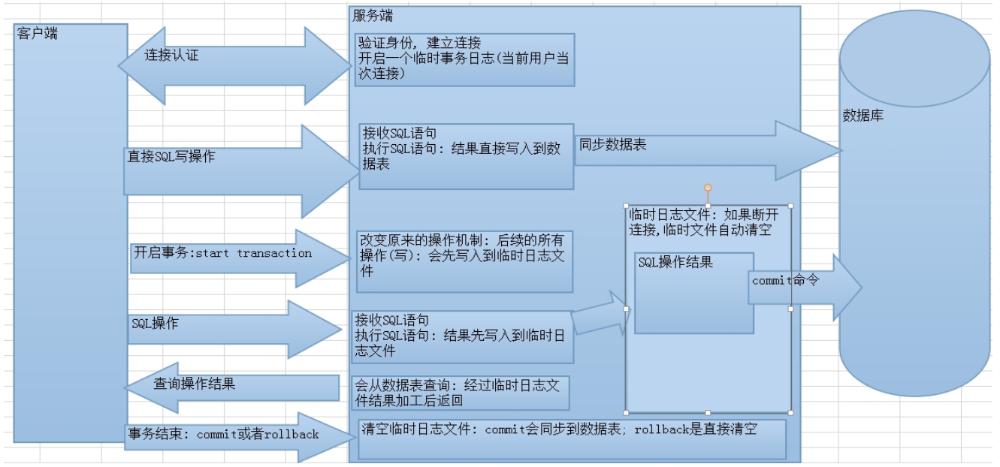

## 事务的隔离级别

### 事务并发问题

事务在操作时的**理想状态**： 所有的事务之间保持隔离，互不影响。因为并发操作，多个用户同时访问同一个数据。可能引发并发访问的问题：

| 并发访问的问题 | 含义                                                         |
| -------------- | ------------------------------------------------------------ |
| 脏读           | 一个事务读取到了另一个事务中尚未提交的数据                   |
| 不可重复读     | 一个事务中两次读取的**数据内容**不一致，要求的是一个事务中多次读取时数据是一致的， 这是另一个事务 update 时引发的问题 |
| 幻读           | 一个事务中两次读取的数据的**数量**不一致，要求在一个事务多次读取的数据的数量是一致的，这是insert 或 delete 时引发的问题 |

### 四大隔离级别

#### 介绍

这是ansi的隔离级别，不是mysql的隔离级别

| 级别 | 名字     | 隔离级别         | 脏读 | 不可重复读 | 幻读 | 数据库默认隔离级别   |
| ---- | -------- | ---------------- | ---- | ---------- | ---- | -------------------- |
| 1    | 读未提交 | read uncommitted | 是   | 是         | 是   |                      |
| 2    | 读已提交 | read committed   | 否   | 是         | 是   | Oracle 和 SQL Server |
| 3    | 可重复读 | repeatable read  | 否   | 否         | 是   | MySQL                |
| 4    | 串行化   | serializable     | 否   | 否         | 否   |                      |

>  隔离级别越高，性能越差，安全性越
>
>    可串行化  ：  保证**读取的范围**内没有新的数据插入，比如事务第一次查询得到某个范围的数据，第二次查询也同样得到了相同范围的数据，中间没有新的数据插入到该范围中。  

#### **命令**

| 命令         | 语句                                               |
| ------------ | -------------------------------------------------- |
| 查询隔离级别 | select @@tx_isolation;                             |
| 设置隔离级别 | set global transaction isolation level 级别字符串; |

> ​	设置后先退出客户端才会生效

#### **演示**

1. 脏读很容易

2. 不可重复读： 先设置隔离机制为：读已提交

    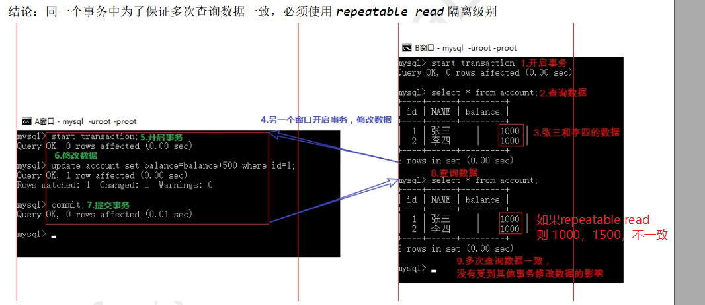

3. 串行化：无法演示   

   > 结论：使用 serializable 隔离级别，前面的事务没有执行完，后面其他事务的 增删改 执行不了，但可以查询，可以挡住幻读  

# 并发

## 事务和锁的关系

### 介绍

一条sql语句也是事务

有写锁才可以进行写操作，哪个事务先进行（update，insert，delete）操作，先获得该行写锁，commit后才释放。类似于同步锁。

写锁会排除其他事务对同一行的（update，insert，delete）操作，但可以读取，加读锁。

但是通常一个事务读和写是一体，不允许其他线程先写。

### 区别

1. 开启事务只是保证事务操作的的原子性，无法完全保证并发操作的线程安全问题。**原子操作有可能是多步骤**的，即使是单步骤的操作在**cpu层面也可能是多步骤**的。
2. 并发操作中，由于线程切换，不同的原子操作之间是在cpu中不断切换（类似于java多线程切换），会发生**线程安全问题**，因此需要再用锁机制来保证。

## 分布式锁

并不是一种锁，只是一种实现手段，其实就是乐观锁。

我们可以将我们分布式要操作的资源都定义成表，表结构定义t_lock如下：

id:

resource: 资源

status: 状态 0|1

add_time: 添加时间

update_time: 更新时间

version: 如果采用乐观锁，使用版本号，对当前资源的状态进行更新就加1
大致流程就是：

select id, resource, status,version fromt_lock  where status=0 and id=xxxx;

如果查到了说明没有数据，可以进行update

update t_lock set status=1, version=1,update_time=now() where id=xxxx and status=0 and version=0

否则，说明该锁被其他线程持有，还没有释放

 

缺点：

更新之前会多一次查询，增加了数据库的操作

数据库链接资源宝贵，如果并发量太大，数据库的性能有影响

如果单个数据库存在单点问题，所以最好是高可用的。
————————————————
版权声明：本文为CSDN博主「happy19870612」的原创文章，遵循 CC 4.0 BY-SA 版权协议，转载请附上原文出处链接及本声明。
原文链接：https://blog.csdn.net/zhanglh046/article/details/78630371

## 乐观锁

 总是认为**不会产生并发问题**（自己业务逻辑），每次去取数据的时候总认为不会有其他线程对数据进行修改，因此不会上锁，但是在更新时会判断其他线程在这之前有没有对数据进行修改，一般会使用版本号机制或CAS操作实现。像数据库如果提供类似于write_condition机制的其实都是提供的乐观锁。

####  **1. version方式**

​	一般是在数据表中加上一个数据版本号version字段，表示数据被修改的次数，当数据被修改时，version值会加一。当线程A要更新数据值时，在读取数据的同时也会读取version值，在提交更新时，若刚才读取到的version值为当前数据库中的version值相等时才更新，否则重试更新操作，直到更新成功。

```mysql
-- 核心SQL代码：
-- version表示执行的次数
-- 还可以加一个状态量0、1，表示是否允许执行，但是如果服务器挂了，会导致永远阻塞
update table set x=x+1, version=#{version}+1 where id=#{id} and version=#{version};  

-- 解决状态量0、1阻塞的方法，使用时间来决定是否允许执行，最新时间
update XcTask t set t.version = #{version}+1 ,t.updateTime = #{updateTime} where t.id = #{id} and t.version = #{version}
```

####  **2. CAS操作方式**

​	即compare and swap 或者 compare and set，是一种有名的**无锁算法**。

​	**无锁编程**，即不使用锁的情况下实现多线程之间的变量同步，也就是在没有线程被阻塞的情况下实现变量的同步，所以也叫非阻塞同步（Non-blocking Synchronization）。

​	CAS算法涉及到三个操作数 ： 需要读写的内存值 V  ，进行比较的值 A  ， 拟写入的新值 B

​	当且仅当 V 的值等于 A时，CAS通过原子方式用新值B来更新V的值，否则不会执行任何操作（比较和替换是一个原子操作）。一般情况下是一个**自旋操作**，即**不断的重试**。

#### 3. 案例

考虑xc_order将来会集群部署，为了避免任务在1分钟内重复执行，这里使用乐观锁，实现思路如下：

每次取任务时判断当前版本及任务id是否匹配，如果匹配则更新当前版本加1，然后执行任务，如果不匹配则取消执行。

1. 在Dao中增加校验当前版本及任务id的匹配方法

   ```java
   public interface XcTaskRepository extends JpaRepository<XcTask, String> {
       //使用乐观锁方式校验任务id和版本号是否匹配，匹配则版本号加1
       @Modifying
       @Query("update XcTask t set t.version = :version+1 where t.id = :id and t.version = :version")
       public int updateTaskVersion(@Param(value = "id") String id, @Param(value = "version") int version);
       ...
   }
   ```

2. 在service中增加方法，使用乐观锁方法校验任务

   ```java
   @Transactional
   public int getTask(String taskId,int version){
       int i = xcTaskRepository.updateTaskVersion(taskId, version);
       return i;
   }
   ```

3. 执行任务类中修改

   ```java
   ...
       //任务id
       String taskId = xcTask.getId();
       //版本号
       Integer version = xcTask.getVersion();
       //调用乐观锁方法校验任务是否可以执行
       if(taskService.getTask(taskId, version)>0){
       	//发送选课消息
           taskService.publish(xcTask, xcTask.getMqExchange(),xcTask.getMqRoutingkey());
           LOGGER.info.("send choose course task id:{}",taskId);
       }
   ...
       
   /*
   注意：
       如果有多个微服务，并不能保证先更新version的微服务先发送选课消息（大概率，并发不高），有可能被其他线程执行，只要其他微服务运行得够快，重新拿到task然后更新再发送任务。
       但如果是这种高并发情况就不该考虑乐观锁，应该使用悲观锁（不同微服务如何使用悲观锁？或者优化业务逻辑），乐观锁就是在并发不高的情况下使用的
   */
   ```

#### 4. 缺陷

[url](https://blog.csdn.net/qq_34337272/article/details/81072874#commentBox)

1. ABA 问题

   如果一个变量V初次读取的时候是A值，并且在准备赋值的时候检查到它仍然是A值，那我们就能说明它的值没有被其他线程修改过了吗？很明显是不能的，因为在这段时间它的值可能被改为其他值，然后又改回A，那CAS操作就会误认为它从来没有被修改过。这个问题被称为CAS操作的 "ABA"问题。

   JDK 1.5 以后的 `AtomicStampedReference` 类就提供了此种能力，其中的 `compareAndSet` 方法就是首先检查当前引用是否等于预期引用，并且当前标志是否等于预期标志，如果全部相等，则以原子方式将该引用和该标志的值设置为给定的更新值。

2. 循环时间长开销大

   **自旋CAS（也就是不成功就一直循环执行直到成功）如果长时间不成功，会给CPU带来非常大的执行开销。** 如果JVM能支持处理器提供的pause指令那么效率会有一定的提升，pause指令有两个作用，第一它可以延迟流水线执行指令（de-pipeline）,使CPU不会消耗过多的执行资源，延迟的时间取决于具体实现的版本，在一些处理器上延迟时间是零。第二它可以避免在退出循环的时候因内存顺序冲突（memory order violation）而引起CPU流水线被清空（CPU pipeline flush），从而提高CPU的执行效率。

3. 只能保证一个共享变量的原子操作

   CAS 只对单个共享变量有效，当操作涉及跨多个共享变量时 CAS 无效。但是从 JDK 1.5开始，提供了`AtomicReference`类来保证引用对象之间的原子性，你可以把多个变量放在一个对象里来进行 CAS 操作。所以我们可以使用锁或者利用`AtomicReference`类把多个共享变量合并成一个共享变量来操作。

## 悲观锁

### 介绍

​		总是假设最坏的情况，每次取数据时都认为其他线程会修改，所以都会加锁（读锁、写锁等），当其他线程想要访问数据时，都需要阻塞挂起。可以依靠数据库实现，如读锁和写锁等，都是在操作之前加锁，在Java中，synchronized，ReentrantLock的思想也是悲观锁。

用场景：数据争用激烈的环境，以及发生并发冲突时**使用锁保护数据的成本**要低于**回滚事务的成本**的环境中。

#### mysql加锁

```mysql
select lock in share mode（共享锁 = s锁 = 读锁？）
select for update （排他锁 = x锁 = 写锁？）

-- 从官网上查找到对应的章节，属于Locking Reads里面的内容，具体链接如下:locking-reads
/*
这两个语句是在事务内起作用的，所涉及的概念是行锁。它们能够保证当前session事务所锁定的行不会被其他session所修改(这里的修改指更新或者删除)。
两个语句不同的是，一个是加了共享锁而另外一个是加了排它锁。

共享锁允许其他事务加共享锁，可以读取，但是，不允许其他事务去做修改，或者加排它锁。
而排它锁显得更加严格，不允许其他事务加共享锁或者排它锁，更加不允许其他事务修改加锁的行,但可以读取。

注意 ： 无论在使用select lock in share mode 或者 select for update，都应该尽快释放锁。

 https://blog.csdn.net/d6619309/article/details/52688250
*/
```

示例：

> ​	1) 读取一行数据
> ​	2) 根据读取到的数据去更新其他数据
>
> 假设在1)和2)之间，有个其他的user session刚好修改了你读取的那行数据，那么你下面的更新就有可能会出错！因为关联的数据产生了变化！

```mysql
use test;
create table tb_test (
  id int primary key,
  col1 varchar(20)
) engine = innodb default character set = 'utf8';

insert into tb_test(id, col1) values(1, 'AAA');
```

#### 共享锁

##### 介绍

使用示例

```mysql
-- session 1:
set autocommit = 0;
select * from tb_test where id = 1 lock in share mode;
```

```mysql
-- open session 2:
update tb_test set col1 = 'BBB' where id = 1;
-- 这个时候可以观察到session2处于blocking状态…. 
```

```mysql
-- 直到 session 1:
commit;
-- 这个时候session2更新成功了。

-- 长时间block，会断开
[SQL]update  city set name="666" where id ="1";
[Err] 1205 - Lock wait timeout exceeded; try restarting transaction
```

**这里也就验证了lock in share mode可以在事务中保证锁定的行不被其他session所更改，只有在上一个事务释放掉锁后才能进行写操作，但是可以进行读操作。**

##### 注意死锁

**使用lock in share mode具有很高的风险**，看下面的案例:

```mysql
-- session 1:
set autocommit = 0;
select * from tb_test where id = 1 lock in share mode;
```

```mysql
-- open session2:
set autocommit = 0;
select * from tb_test where id = 1 lock in share mode;
```


这个时候两个session同时持有id = 1这行数据的共享锁。这个时候我们在session 1里面执行update操作:

```mysql
-- session 1:
update tb_test set col1 = 'AAA' where id = 1;
```


卡住了!!!! ????这个时候session1必须等待session2退出事务或者等待直到锁超时:

锁超时的情况:

```mysql
ERROR 1205 (HY000): Lock wait timeout exceeded; try restarting transaction
```

如果我们在session 2里面执行:

```mysql
-- session2:
update tb_test set col1 = 'BBB' where id = 1;

ERROR 1213 (40001): Deadlock found when trying to get lock; try restarting transaction
```

这个时候mysql检测到会发生死锁，会中断当前事务该语句的执行，重新开启一个新的事务(应该就是相当于session2先退出事务，然后再开启一个事务吧)。

这个时候session1可以更新成功了。

上面的例子可以看出使用lock in share mode比较危险，很可能因为其他session同时加了这种锁，导致当前session无法进行更新，进而阻塞住。

#### 排他锁

select for update加的是排它锁，所以没有上面`lock in share mode`所产生的死锁，因为一个session加了这种锁，其他session除了读取操作，其他操作都会阻塞，如更改操作，或者加锁，共享锁和排它锁都不可以。

**重点**

> 能则为行锁，否则为表锁；未查到数据则无锁。而 使用'<>','like'等操作时，索引会失效，自然进行的是table lock [参考](https://www.cnblogs.com/wangshiwen/p/9837408.html)

**下面演示一下用法:**

```sql
-- session 1:
set autocommit = 0;
select * from tb_test where id = 1 for update;
```

```mysql
-- open session 2:
update tb_test set col1 = 'BBB' where id = 1;
-- 这个时候session 2处于blocking状态
```

我们手动kill掉session 2, 按`Ctrl + C`。然后执行:

```mysql
-- session 2:
set autocommit = 0;
select * from tb_test where id = 1 for update;
```


还是blocking状态，证明其他session的事务不能对已经加了排它锁(for update)的行再加排它锁。kill掉，再来

```mysql
-- session 2:
set autocommit = 0;
select * from tb_test where id = 1 lock in share mode;
```


还是blocking状态，证明其他session的事务不能对已经加了排它锁(for update)的行再加共享锁(lock in share mode)。

当然，如果使用select for update的时候，如果锁定当前行的事务一直不退出，将会导致其他进行这个行更改操作的session一直阻塞。(没有试是否有超时的情况)

#### 总结

1. 共享锁容易导致死锁，因此目的不是为了写数据，而是为了防止写数据，只读。

2. 对某一资源加排他锁，自身可以进行增删改查，其他人无法进行修改。就是为了写。

3. 先读再写，加排他锁，防止读后被其他线程写了。

   ```mysql
   -- 例子 ： 先读作判断，之后再写
   -- 线程1 ：读（排他锁）~ 写
   -- 线程2 ：读（排他锁）~ 写
   -- 这样两个线程都可以保证读写的业务逻辑正确
   ```

   

#### 行锁

行锁，由字面意思理解，就是给某一行加上锁，也就是一条记录加上锁。

比如之前演示的共享锁语句

SELECT * from city where id = "1"  lock in share mode; 

由于对于city表中，id字段为主键，就也相当于索引。执行加锁时，会将id这个索引为1的记录加上锁，那么这个锁就是行锁。如果没有那么就是锁表。

#### 表锁

表锁，和行锁相对应，给这个表加上锁。

## 总结

两种锁各有优缺点，不可认为一种好于另一种。

> **简单的来说CAS适用于写比较少的情况下（多读场景，冲突一般较少），synchronized适用于写比较多的情况下（多写场景，冲突一般较多）**

1、对于资源竞争较少（线程冲突较轻）的情况，使用synchronized同步锁进行线程阻塞和唤醒切换以及用户内核态间的切换操作额外浪费消耗cpu资源；而CAS基于硬件实现，不需要进入内核，不需要切换线程，操作自旋几率较少，因此可以获得更高的性能。

2、对于资源竞争严重（线程冲突严重）的情况，CAS自旋的概率会比较大，从而浪费更多的CPU资源，效率低于synchronized。

> 补充：
>
> ​	Java并发编程这个领域中synchronized关键字一直都是元老级的角色，很久之前很多人都会称他为“重量级锁”。但是，在JavaSE1.6之后进行了主要包括为了减少获得锁和释放锁带来的性能消耗而引入了偏向锁和轻量级锁以及其他各种优化之后变得在某些情况下并不是那么重了。
>
> ​	synchronized的底层实现主要依靠lock-Free队列，基本思路是自旋后阻塞，竞争切换后继续竞争锁，稍微牺牲了公平性，但获得了高吞吐量。在线程冲突较少的情况下，可以获得和CAS类似的性能；而线程冲突严重的情况下性能远高于CAS。

## innodb锁补充

1. innodb引入行锁，行锁的实现，next-key，如何用锁和mvcc实现不同的隔离机制，rr和rc各自的复制和幻读。

[关于幻读，可重复读的真实用例是什么？](https://www.zhihu.com/question/47007926)

当前读，何为当前读？就是说insert、update等语句执行之前，会先select，再执行insert、update。简单说，就是先读一次，再执行更新语句。而且这个读，是读最新的数据！！！

**mysql幻读的真相**

**在RR隔离级别下，如果一个事务从头到尾就只有快照读，那么MVCC解决了幻读的问题。如果一个事务从头到尾只有当前读，那么通过间隙锁和临建锁也解决了幻读问题。但是如果一个事务既有快照读也有当前读，那么MVCC就解决不了幻读问题。**但是保证了恢复和复制。


rr是si的弱化版

[MYSQL- Lock--gap before rec insert intention waiting:意向锁(IX)等待](http://www.linuxmysql.com/14/2019/1029.htm)

[解决死锁之路 - 了解常见的锁类型](https://www.aneasystone.com/archives/2017/11/solving-dead-locks-two.html)

[互联网公司MySQL数据库采用读已提交的隔离级别原因](https://blog.csdn.net/mclongyi/article/details/120717879)

[MySQL中的锁（表锁、行锁，共享锁，排它锁，间隙锁）](https://blog.csdn.net/soonfly/article/details/70238902)

# 查询优化

重要性依次向下

## 优化业务逻辑

## 索引

### 1. [什么是索引](https://www.linuxidc.com/Linux/2018-06/152757.htm)

-  **MySQL官方对索引的定义**：

  索引(Index)是帮助MySQL高效获取数据的数据结构。我们可以简单理解为：快速查找排好序的一种数据结构。

- **类型**：

  普通索引，唯一索引，全文索引

Mysql索引主要有两种结构：B+Tree索引和Hash索引。我们平常所说的索引，如果没有特别指明，一般都是指B树结构组织的索引(B+Tree索引)。索引如图所示： 


 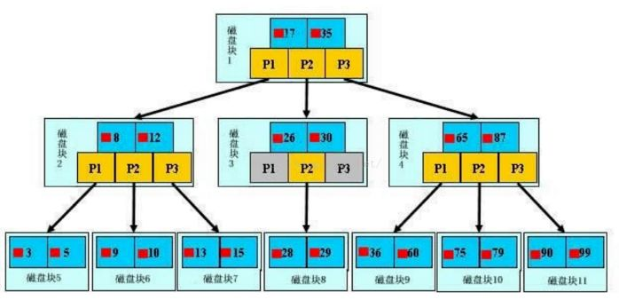 

最外层浅蓝色磁盘块1里有数据17、35（深蓝色）和指针P1、P2、P3（黄色）。P1指针表示小于17的磁盘块，P2是在17-35之间，P3指向大于35的磁盘块。真实数据存在于叶子节点也就是最底下的一层3、5、9、10、13……非叶子节点不存储真实的数据，只存储指引搜索方向的数据项，如17、35。

查找过程：例如搜索28数据项，首先加载磁盘块1到内存中，发生一次I/O，用二分查找确定在P2指针。接着发现28在26和30之间，通过P2指针的地址加载磁盘块3到内存，发生第二次I/O。用同样的方式找到磁盘块8，发生第三次I/O。

真实的情况是，上面3层的B+Tree可以表示上百万的数据，上百万的数据只发生了**三次I/O**而不是上百万次I/O，时间提升是巨大的。


### 2. Explain

 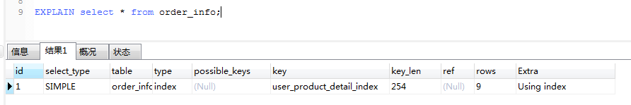

索引使用情况在possible_keys、key和key_len三列，接下来我们先从左到右依次讲解。

#### 1.id

```mysql
-- id相同,执行顺序由上而下（记录越少的在前面先执行，小表驱动大表）
explain select u.*,o.* from user_info u,order_info o where u.id=o.user_id;
```

 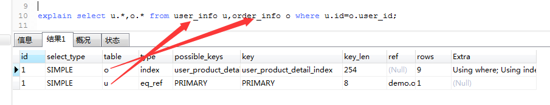 

```mysql
-- id不同,值越大越先被执行
explain select * from  user_info  where id=(select user_id from order_info where  product_name ='p8');
```

  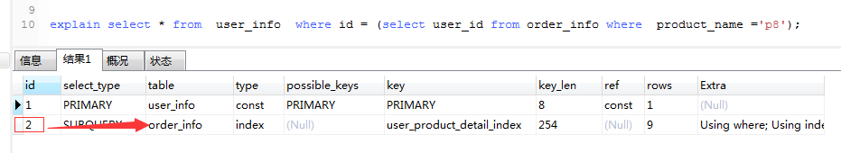 

#### 2.select_type

可以看id的执行实例，总共有以下几种类型：

- SIMPLE： 表示此查询不包含 UNION 查询或子查询
- PRIMARY： 表示此查询是最外层的查询
- SUBQUERY： 子查询中的第一个 SELECT
- UNION： 表示此查询是 UNION 的第二或随后的查询
- DEPENDENT UNION： UNION 中的第二个或后面的查询语句, 取决于外面的查询。 Mysql 先执行外查询，内查询根据这个查询结果(如执行计划里所述，38196 rows)的每一条记录组成新的查询语句后执行。 非常慢
- UNION RESULT, UNION 的结果
- DEPENDENT SUBQUERY: 子查询中的第一个 SELECT, 取决于外面的查询. 即子查询依赖于外层查询的结果.
- DERIVED：衍生，表示导出表的SELECT（FROM子句的子查询）

#### 3.table

```mysql
-- table表示查询涉及的表或衍生的表：
explain select tt.* from (select u.* from user_info u,order_info o where u.id=o.user_id and u.id=1) tt
-- id为1的<derived2>的表示id为2的u和o表衍生出来的。
```

  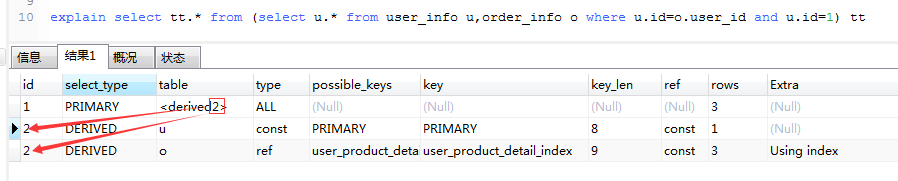 


#### 4.type

> type 字段比较重要，它提供了判断查询是否高效的重要依据依据。 通过 type 字段，我们判断此次查询是 全表扫描 还是 索引扫描等。

 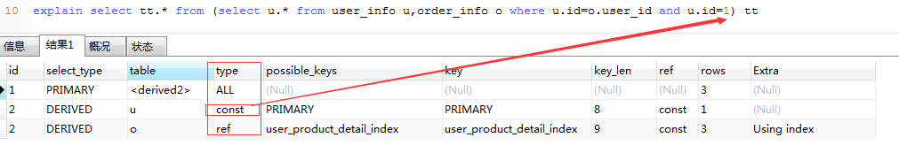 
type 常用的取值有:

- null：不用访问表或者索引，直接就能得到结果。`select 1 from test`
- system: 表中只有一条数据， 这个类型是特殊的 const 类型。
- const: 针对**主键或唯一索引**的等值查询扫描，最多只返回一行数据，这个匹配行的其他列的值可以被优化器在当前查询中当作常量来处理。 const 查询速度非常快， 因为它仅仅读取一次即可。例如下面的这个查询，它使用了主键索引，因此 type 就是 const 类型的：`explain select * from user_info where id = 2`；
- eq_ref: 此类型通常出现在多表的 join 查询，与ref的区别在于使用唯一索引，表示对于前表的每一个结果，都只能匹配到后表的一行结果。并且查询的比较操作通常是 =，查询效率较高。例如：`explain select * from user_info, order_info where user_info.id = order_info.user_id`;
- ref: 单表使用非唯一索引或者唯一索引的前缀扫描，返回一行以上记录。此类型通常出现在多表的 join 查询，针对于非唯一或非主键索引，或者是使用了 最左前缀 规则索引的查询。例如下面这个例子中， 就使用到了 ref 类型的查询：`explain select * from user_info, order_info where user_info.id = order_info.user_id AND order_info.user_id = 5`
- range: 表示使用**索引范围查询**，通过索引字段范围获取表中部分数据记录。这个类型通常出现在 =, <>, >, >=, <, <=, <=>, BETWEEN, IN() 操作中。例如下面的例子就是一个范围查询：`explain select * from user_info  where id between 2 and 8`；
- index: 表示全索引扫描(full index scan)，和 ALL 类型类似，只不过 ALL 类型是全表扫描，而 index 类型则仅仅扫描所有的索引， 而不扫描数据。index 类型通常出现在：所要查询的数据直接在索引树中就可以获取到, 而不需要扫描数据。当是这种情况时，Extra 字段 会显示 Using index。
- ALL: 表示全表扫描，这个类型的查询是性能最差的查询之一。通常来说， 我们的查询不应该出现 ALL 类型的查询，因为这样的查询在数据量大的情况下，对数据库的性能是巨大的灾难。 如一个查询是 ALL 类型查询， 那么一般来说可以对相应的字段添加索引来避免。

通常来说, 不同的 type 类型的性能关系如下:

> ALL < index < range ~ index_merge < ref < eq_ref < const < system
>
> ALL 类型因为是全表扫描， 因此在相同的查询条件下，它是速度最慢的。而 index 类型的查询虽然不是全表扫描，但是它扫描了所有的索引，因此比 ALL 类型的稍快.后面的几种类型都是利用了索引来查询数据，因此可以过滤部分或大部分数据，因此查询效率就比较高了。
>
> 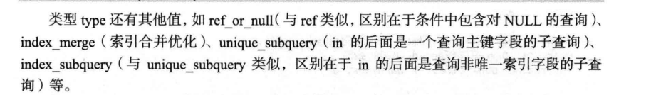

##### 1.ref

> 使用普通索引

```mysql
select * from user_info where age =20 ;
explain select * from user_info  where age =20 ;
ALTER TABLE `user_info` ADD INDEX (`age`) ;-- 使用索引后结果数据量和查询的行数是一样的
```

​	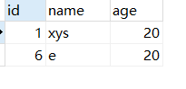

​	

​	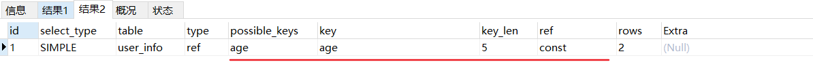

#### 5.possible_keys

它表示 mysql 在查询时，可能使用到的索引。 注意，即使有些索引在 possible_keys 中出现，但是并不表示此索引会真正地被 mysql 使用到。 mysql 在查询时具体使用了哪些索引，由 key 字段决定。

#### 6.key

此字段是 mysql 在当前查询时所真正使用到的索引。比如请客吃饭,possible_keys是应到多少人，key是实到多少人。当我们没有建立索引时：

> explain select o.* from order_info o where o.product_name= 'p1' and o.productor='whh';
>
> ​	drop index idx_name_productor on order_info;

   

建立复合索引后再查询：

 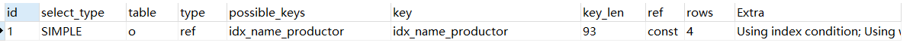

#### 7.key_len

表示查询优化器使用了索引的字数，这个字段可以评估组合索引是否完全被使用。

#### 8.ref

这个表示显示索引的哪一列被使用了，如果可能的话，是一个常量。前文的type属性里也有ref，注意区别。

 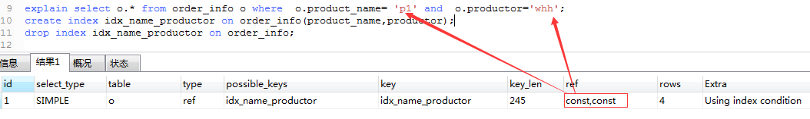 

#### 9.rows

rows 也是一个重要的字段，mysql 查询优化器根据统计信息，估算 sql 要查找到结果集需要扫描读取的数据行数，这个值非常直观的显示 sql 效率好坏， 原则上 rows 越少越好。可以对比key中的例子，一个没建立索引钱，rows是9，建立索引后，rows是4。

#### 10.extra

 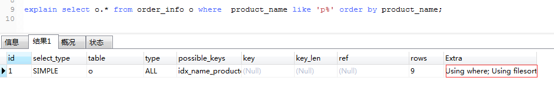 

explain 中的很多额外的信息会在 extra 字段显示, 常见的有以下几种内容:

- using filesort ：表示 mysql 需额外的排序操作，不能通过索引顺序达到排序效果。一般有 using filesort都建议优化去掉，因为这样的查询 cpu 资源消耗大。

- using index：覆盖索引扫描，表示查询在索引树中就可查找所需数据，不用扫描表数据文件，往往说明性能不错。

- `Using index condition`  使用索引下推，需要回表

- using temporary：查询有使用临时表, 一般出现于排序， 分组和多表 join 的情况， 查询效率不高，建议优化。

- using where ：表名使用了where过滤。

- Using join buffer (Block Nested Loop) :  嵌套循环 

- Using intersect 索引合并交集算法对所有使用的索引执行同步扫描，并生成从合并索引扫描中接收到的行序列的交集。其中Using intersect 就是一种。

  https://blog.51cto.com/u_15127623/2843986

  建议改为联合索引

### 3. 优化案例

```mysql
explain select u.*,o.* from user_info u LEFT JOIN order_info o on u.id = o.user_id;
-- left join，一定是先循环左表，无论大小，
```

```mysql
-- 执行结果，type有ALL，并且没有使用索引，扫描了9行数据，Extra使用的是嵌套循环：Using join buffer (Block Nested Loop)
```

 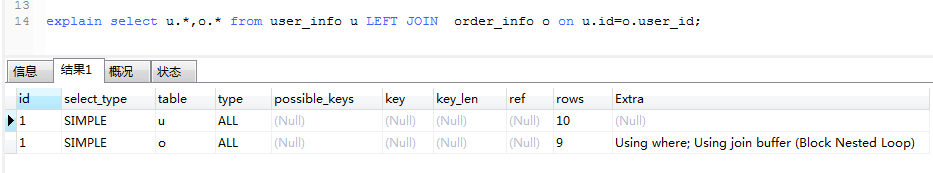 

```mysql
-- 开始优化，在关联列user_id上创建索引，明显看到type列的ALL变成ref，并且用到了索引，rows也从扫描9行变成了1行(只是扫描索引的表，具体数据的表只是扫描了一行)
```

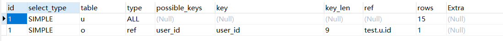 

```mysql
-- 这里面一般有个规律是：左链接索引加在右表上面，右链接索引加在左表上面。
```


### 4. 是否需要创建索引

索引虽然能非常高效的提高查询速度，同时却会降低更新表的速度。实际上索引也是一张表，该表保存了主键与索引字段，并指向实体表的记录，所以索引列也是要占用空间的。

**原则**：查询索引扫描行数最少。

  


## 数据库设计

1. 选择合适的数据库

   es，mongodb，mysql，oracle，sql server

2. 合适的存储引擎

   ```
   Mysql 中有两个引擎 MyISAM 和 InnoDB，每个引擎有利有弊。
   MyISAM 适用于一些大量查询的应用，但对于有大量写功能的应用不是很好。甚至你只需要update 一个字段整个表都会被锁起来。而别的进程就算是读操作也不行要等到当前 update 操作完成之后才能继续进行。另外， MyISAM 对于 select count(*)这类操作是超级快的。 
   InnoDB 的趋势会是一个非常复杂的存储引擎，对于一些小的应用会比 MyISAM 还慢，但是支持“行锁”，所以在写操作比较多的时候会比较优秀。并且，它支持很多的高级应用，例如：事务。
   ```

a. 对查询进行优化，应尽量避免全表扫描，首先应考虑在 where 及 order by 涉及的列上建立索引。

b. 应尽量避免在 where 子句中对字段进行 null 值判断，否则将导致引擎放弃使用索引而进行全表扫描，如： select id from t where num is null 可以在 num 上设置默认值 0，确保表中 num 列没有 null 值，然后这样查询： select id from t where num=0  

c. 并不是所有索引对查询都有效， SQL 是根据表中数据来进行查询优化的，当索引列有大量数据重复时,查询可能不会去利用索引，如一表中有字段 sex， male、 female 几乎各一半，那么即使在 sex 上建了索引也对查询效率起不了作用。

d. 索引并不是越多越好，索引固然可以提高相应的 select 的效率，但同时也降低了 insert 及 update 的效率，因为 insert 或 update 时有可能会重建索引，所以怎样建索引需要慎重考虑，视具体情况而定。一个表的索引数最好不要超过 6 个，若太多则应考虑一些不常使用到的列上建的索引是否有必要。   如果你有一些表，它们收集数据且不经常被搜索，则在有必要之前不要索引它们。（索引可根据需要添加和删除。）  

e. 应尽可能的避免更新索引数据列，因为索引数据列的顺序就是表记录的物理存储顺序，一旦该列值改变将导致整个表记录的顺序的调整，会耗费相当大的资源。若应用系统需要频繁更新索引数据列，那么需要考虑是否应将该索引建为索引。   

f. 尽量使用数字型字段，若只含数值信息的字段尽量不要设计为字符型，这会降低查询和连接的性能，并会增加存储开销。这是因为引擎在处理查询和连接时会逐个比较字符串中每一个字符，而对于数字型而言只需要比较一次就够了。  

g. 尽可能的使用 varchar/nvarchar 代替 char/nchar ，因为首先变长字段存储空间小，可以节省存储空间，其次对于查询来说，在一个相对较小的字段内搜索效率显然要高些。

h. 尽量使用表变量来代替临时表。如果表变量包含大量数据，请注意索引非常有限（只有主键索引）。

i. 避免频繁创建和删除临时表，以减少系统表资源的消耗。

j. 临时表并不是不可使用，适当地使用它们可以使某些例程更有效，例如，当需要重复引用大型表或常用表中的某个数据集时。但是，对于一次性事件，最好使用导出表。

k. 在新建临时表时，如果一次性插入数据量很大，那么可以使用 select into 代替 create table，避免造成大量 log ，以提高速度；如果数据量不大，为了缓和系统表的资源，应先 create table，然后 insert  .

l. 如果使用到了临时表，在存储过程的最后务必将所有的临时表显式删除，先 truncate table ，然后 droptable ，这样可以避免系统表的较长时间锁定  

## 高效的sql

```mysql
-- 当只要一行数据时使用limit1	
	查询时如果已知会得到一条数据，这种情况下加上limit1会增加性能。因为mysql数据库引擎会在找到一条结果停止搜索，而不是继续查询下一条是否符合标准直到所有记录查询完毕。

-- 用 not exists 代替 not in
   Not exists 用到了连接能够发挥已经建立好的索引的作用， not in 不能使用索引。 Not in 是最慢的方式要同每条记录比较，在数据量比较大的操作红不建议使用这种方式。

-- 对操作符的优化，尽量不采用不走索引的操作符如：or ，is null ，is not null ，<>,!= 等
-- 通过使用多条SELECT语句和连接它们的UNION语句，你能看到极大的性能改进。
	实测 `where age in(15,20)` 和 `where age =20 or age =15` 不使用索引，使用union代替。
    `where age in(15)` 经过索引

-- in ，not in，也要慎用，否则会导致全表扫描，如： select id from t where num in(1,2,3)
-- 对于连续的数值，能用 between 就不要用 in 了： select id from t where num between 1 and 3

-- 某个字段总要拿来搜索，为其建立索引

-- 最好不要给数据库留null

-- join 的时候 尽量把牵涉到多表联合的查询拆分多个 query（多个连表查询效率低，容易到之后锁表（锁几个表）和阻塞）。  
	select * from admin left join log on admin.admin_id = log.admin_id where log.admin_id>10 如何优化?
	优化为： select * from (select * from admin where admin_id>10) T1 lef join log on T1.admin_id =log.admin_id。
	
-- limit 的基数比较大时使用 between 要求索引必须是连续的，不然不能用

-- 尽量避免在列上做运算、函数，这样导致索引失效	
	例如： select * from admin where year(admin_time)>2014
	优化为： select * from admin where admin_time > '2014-01-01';
	
-- 自连接使用子表连接父表，例如父类别和子类别，直接回表，不用走索引查询，因为子类已经知道父类的位置，父类不知道子类在哪里

-- 一般来说，存储过程执行得比一条一条地执行其中的各条MySQL语句快。

e. 如果在 where 子句中使用参数，也会导致全表扫描。因为 SQL 只有在运行时才会解析局部变量，但优化程序不能将访问计划的选择推迟到运行时；它必须在编译时进行选择。然而，如果在编译时建立访问计划，变量的值还是未知的，因而无法作为索引选择的输入项。如下面语句将进行全表扫描： select id from t where num=@num 可以改为强制查询使用索引： select id from t with(index(索引名)) where num=@num

i. 不要写一些没有意义的查询，如需要生成一个空表结构： select col1,col2 into #t from t where 1=0 这类代码不会返回任何结果集，但是会消耗系统资源的，应改成这样： create table #t(…)

j. 很多时候用 exists 代替 in 是一个好的选择： select num from a where num in(select num from b)用下面的语句替换： select num from a where exists(select 1 from b where num=a.num)

k. 任何地方都不要使用 select * from t ，用具体的字段列表代替“*”，不要返回用不到的任何字段。

l. 尽量避免使用游标，因为游标的效率较差，如果游标操作的数据超过 1 万行，那么就应该考虑改写。

m. 尽量避免向客户端返回大数据量，若数据量过大，应该考虑相应需求是否合理。

n. 尽量避免大事务操作，提高系统并发能力。  

--  有的操作（包括INSERT）支持一个可选的DELAYED关键字，如果使用它，将把控制立即返回给调用程序，并且一旦有可能就实际执行该操作。

-- LIKE很慢。一般来说，最好是使用FULLTEXT而不是LIKE。
```

## 其他

```mysql
 -- 在导入数据时，应该关闭自动提交。你可能还想删除索引（包括FULLTEXT索引），然后在导入完成后再重建它们。
```

## java方面

1. 尽可能的少造对象。
2. 合理摆正系统设计的位置。大量数据操作，和少量数据操作一定是分开的。大量的数据操作，肯定不是ORM框架搞定的。，
3. 使用 jDBC 链接数据库操作数据
4. 控制好内存，让数据流起来，而不是全部读到内存再处理，而是边读取边处理；
5. 合理利用内存，有的数据要缓存  


# 安全问题

### sql 注入

#### 问题

1. 普通sql注入

   ```
   当执行的 sql 为 select * from user where username = “admin” or “a” =“a” 时， sql 语句恒成立，参数 admin 毫无意义。
   ```

2. 二次注入

   一般表拆分，如果一个table转义，相关的另一个table不转义，那么就会对另一个table造成攻击。

   **为了预防SQL注入攻击，程序将用户输入进行了转义，但是这些数据却又在“未被转义”的查询窗体中重复使用。**

   以PHP为例，当开启了magic_quotes_gpc之后，将会对特殊字符转义，

   ```mysql
   -- 将 ' 转义为 \' SQL语句
   insert into userinfo(id,username,password) values (1,'$username','$password')
   
   -- 通过网站插入数据：id为1、username 为 admin' -- 、password为123456，那么SQL语句如下：
   insert into userinfo(id,username,password) values (1,'admin\' -- ','123456')
   
   -- 但是在插入数据库后却没有“\”
   +----+------------+-----------+
   | id |  username  |  password |
   +----+------------+-----------+
   |  1 | admin' --  |   123456  |     '
   +----+------------+-----------+  
   
   -- 假设程序允许用户更改密码，用户名为admin' -- ,上面的查询就变成了这样：
   update users set password = '[new_password]' where username = 'admin' -- '
   因此攻击者通过注册一个admin' --用户修改了admin的密码
   ```


#### 防御

1. **PreparedStatement（简单又有效的方法）**：如， `select * from user where username = ？`

   原理：

   - sql注入只对sql语句的准备(编译)过程有破坏作用， 而PreparedStatement已经准备好了，是SQL引擎会预先进行语法分析，产生语法树，生成执行计划。执行阶段只是把输入串作为数据处理, 而不再对sql语句进行解析,准备,因此也就避免了sql注入问题。

2. Mybatis 框架中的 mapper 方式中的 `#{name}`也能很大程度的防止 sql 注入。（`${name}`无法防止 sql 注入）。 

   > 前者底层也是使用PreparedStatement，后者拼接sql

3. 存储过程、函数

4. **拼接sql语句时特别注意**：

   - 检查参数字符串的数据类型，字符长度

     比如 id 只能是 int型，复杂情况可以使用正则表达式来判断。

   - 安全函数，排除字符串、特殊字符

   - ESAPI.md

     ```java
     MySQLCodec codec = new MySQLCodec(Mode.STANDARD);
     name = ESAPI.encoder().encodeForSQL(codec, name);//该函数会将 name 中包含的一些特殊字符进行编码，这样 sql 引擎就不会将name中的字符串当成sql命令来进行语法分析了。
     String sql = "select id,no from user where name=" + name;
     ```

5. 通过对数据库强制执行最小权限原则，来减缓SQL注入漏洞的影响。籍此，应用程序的每一个软件组件都只能访问、并仅影响它所需要的资源。

6. 对访问数据库的Web应用程序采用Web应用防火墙(Web Application Firewall，WAF)。这有助于识别出针对SQL注入的各种尝试，进而防止此类尝试作用到应用程序上。

7. 避免在生产环境中，直接输出错误信息，因为这些错误信息有可能被攻击者利用。

8. 对用户敏感信息特别是密码做严格加密处理。


# 配置

### ini文件

https://blog.csdn.net/itmr_liu/article/details/80851266
**my.ini文件**
在C:\ProgramData\MySQL\MySQL Server 8.0\目录下
**Path环境变量**

**启动关闭MySQL**

	1. net stop mysql
	net start mysql
	所有Windows服务都可以通过这两个命令实现
	2. 计算机服务

**cmd中操作**


### sql-mode

```mysql
select @@global.sql_mode\G
-- global.sql_mode : NO_AUTO_CREATE_USER,NO_ENGINE_SUBSTITUTION
```

最后得出结论

1. 如果sql_mode 没有设置STRICI_TRANS_TABLES，则在插入记录时，如果有非空字段没有值 而且没有设置默认值，则引擎会自动填充（int类型 填充0 string类型 填充 '' timestamp 类型填充 当前时间戳（2018-06-22 19:54:52）

2. 标准推荐设置 global.sql_mode : STRICI_TRANS_TABLES,NO_ENGINE_SUBSTITUTION

   在mysql配置文件my.cnf 或my.ini 中添加 sql_mode=NO_ENGINE_SUBSTITUTION,STRICT_TRANS_TABLES

   

资料连接： https://www.cnblogs.com/zengkefu/p/5636614.html  

###   status和variables

 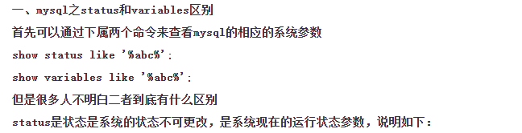

 https://blog.csdn.net/andyzhaojianhui/article/details/50052117 

### 编码

>   统一编码 ，  建数据库和建表时应尽量使用统一的编码，强烈推荐的是 utf8 编码  。  在安装时就一定要设置为 utf8 编码  

```mysql
-- show编码
show variables like “%colla%”;
show variables like “%char%”
-- 其中 collation，代表了字符串排序（比较）的规则，如果值是 utf8_general_ci,代表使用 utf8 字符集大小写不敏感的自然方式比较。

-- 修改数据库默认编码为 utf8
ALTER DATABASE imooc DEFAULT CHARACTER SET 'utf8';
SET character_set_client='utf8';
SET character_set_connection='utf8';
SET character_set_results='utf8';
```

 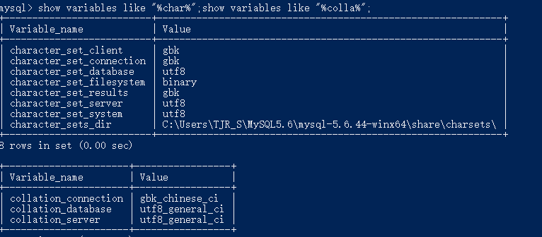


# 架构

 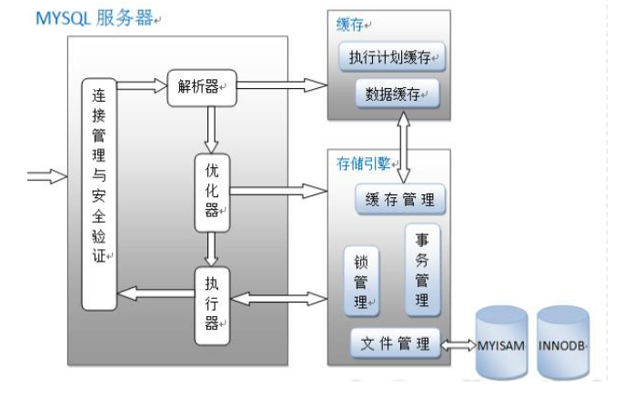

### 各模块

1）、连接管理与安全验证是什么？

每个客户端都会建立一个与服务器连接的线程，服务器会有一个线程池来管理这些 连接；如果客户端需要连
接到 MYSQL 数据库还需要进行验证，包括用户名、密码、 主机信息等。
（2）、解析器是什么？
解析器的作用主要是分析查询语句，最终生成解析树；首先解析器会对查询语句的语法进行分析，分析语法是否
有问题。还有解析器会查询缓存，如果在缓存中有对应的语句，就返回查询结果不进行接下来的优化执行操作。前提是
缓存中的数据没有被修改，当然如果被修改了也会被清出缓存。
（3）、优化器怎么用？
优化器的作用主要是对查询语句进行优化操作，包括选择合适的索引，数据的读取方式，包括获取查询的开销信
息，统计信息等，这也是为什么图中会有优化器指向存储引擎的箭头。之前在别的文章没有看到优化器跟存储引擎之间的关系，在这里我个人的理解是因为优化器需要通过存储引擎获取查询的大致数据和统计信息。
（4）、执行器是什么？
执行器包括执行查询语句，返回查询结果，生成执行计划包括与存储引擎的一些处理操作。

# 存储引擎

### MyISAM 存储引擎

MyISAM 是 MySQL 官方提供默认的存储引擎，其特点是不支持事务、表锁和全文索引，对于一些 OLAP（联机分析处理）系统，操作速度快。每个 MyISAM 在磁盘上存储成三个文件。文件名都和表名相同，扩展名分别是.frm（存储表定义）、 .MYD (MYData，存储数据)、 .MYI (MYIndex，存储索引)。这里特别要注意的是 MyISAM 不缓存数据文件，只缓存索引文件。

### InnoDB 存储引擎

InnoDB 存储引擎支持事务，主要面向 OLTP（联机事务处理过程）方面的应用，其特点是行锁设置、支持外键，并支持类似于 Oracle 的非锁定读，即默认情况下读不产生锁。 InnoDB 将数据放在一个逻辑表空间中（类似 Oracle）。

InnoDB 通过多版本并发控制来获得高并发性，实现了 ANSI 标准的 4 种隔离级别，默认为 Repeatable，使用一种被称为 next-key locking 的策略避免幻读。

对于表中数据的存储， InnoDB 采用类似 Oracle 索引组织表 Clustered 的方式进行存储。

InnoDB 存储引擎提供了具有提交、回滚和崩溃恢复能力的事务安全。但是对比 Myisam 的存储引擎， InnoDB 写的处理效率差一些并且会占用更多的磁盘空间以保留数据和索引。  

### MyISAM和InnoDB的区别

①InnoDB支持事务与外键和行级锁,MyISAM不支持(最主要的差别)

②MyISAM读性能要优于InnoDB,除了针对索引的update操作,MyISAM的写性能可能低于InnoDB,其他操作MyISAM的写性能也是优于InnoDB的,而且可以通过分库分表来提高MyISAM写操作的速度

③MyISAM的索引和数据是分开的,而且索引是压缩的,而InnoDB的索引和数据是紧密捆绑的,没有使用压缩,所以InnoDB的体积比MyISAM庞大

MyISAM引擎索引结构的叶子节点的数据域，存放的并不是实际的数据记录，而是数据记录的地址。索引文件与数据文件分离，这样的索引称为“非聚簇索引”。其检索算法：先按照B+Tree的检索算法检索，找到指定关键字，则取出对应数据域的值，作为地址取出数据记录。

InnoDB引擎索引结构的叶子节点的数据域，存放的就是实际的数据记录。这样的索引被称为“聚簇索引”，一个表只能有一个聚簇索引。

④InnoDB 中不保存表的具体行数，也就是说，执行select count(*) from table时，InnoDB要扫描一遍整个表来计算有多少行，但是MyISAM只要简单的读出保存好的行数即可。注意的是，当count(*)语句包含 where条件时，两种表的操作是一样的。

⑤DELETE FROM table时，InnoDB不会重新建立表，而是一行一行的删除。

⑥InnoDB表的行锁也不是绝对的，假如在执行一个SQL语句时MySQL不能确定要扫描的范围，InnoDB表同样会锁全表，例如update table set num=1 where name like “%aaa%”

在where条件没有主键时,InnoDB照样会锁全表

 

选择哪种搜索引擎,应视具体应用而定

①如果是读多写少的项目,可以考虑使用MyISAM,MYISAM索引和数据是分开的，而且其索引是压缩的，可以更好地利用内存。所以它的查询性能明显优于INNODB。压缩后的索引也能节约一些磁盘空间。MYISAM拥有全文索引的功能，这可以极大地优化LIKE查询的效率。

②如果你的应用程序一定要使用事务，毫无疑问你要选择INNODB引擎

③如果是用MyISAM的话，merge引擎可以大大加快应用部门的开发速度，他们只要对这个merge表做一些select count(*)操作，非常适合大项目总量约几亿的rows某一类型(如日志，调查统计)的业务表。

第二是存储引擎本身能支持的最大空间大小。比如

InnoDB存储引擎的表空间最大容量为64TB，不具体限制单表的大小，但受限于表空间。

MyISAM最大表尺寸为65536TB，但是在 MySQL5.0版本之前，默认情况下，MyISAM单个表允许的最大尺寸为4GB，你可以通过 SHOW TABLE STATUS 语句或 myisamchk -dv tbl_name 检查表的最大尺寸，如果是4G，可以通过修改 AVG_ROW_LENGTH 和 MAX_ROWS 选项的值来达到目的。MySQL5.0版本后，默认MyISAM表的限制是256TB。

# 其他命令

https://blog.csdn.net/starnight_cbj/article/details/4492555

**查看连接数，状态**

```mysql

-- 如果是root帐号，你能看到所有用户的当前连接。如果是其它普通帐号，只能看到自己占用的连接。
show processlist; -- 只列出前100条
show full processlist; -- 全列

-- 将慢查询日志的阈值设置为0，表示这个线程接下来的语句都会被记录入慢查询日志中；
set long_query_time=0;
```

索引

```mysql
-- 强制使用索引a
select * from t force index(a) where a between 10000 and 20000; 

-- 重新统计索引信息，如果你发现explain的结果预估的rows值跟实际情况差距比较大，可以采用这个方法来处理。
analyze table t ;

-- 存储索引统计
-- 设置为on的时候，表示统计信息会持久化存储。这时，默认的N是20，M是10。
-- 设置为off的时候，表示统计信息只存储在内存中。这时，默认的N是8，M是16。
-- 由于是采样统计，所以不管N是20还是8，这个基数都是很容易不准的。
设置参数innodb_stats_persistent
```


# 经验

## 金额(金钱)相关的数据存储类型

#### int

对于游戏币等代币，一般存储为int类型是可行的。

问题在于越界，int类型长度为32位。

在存储人民币相关的金额的时候，最大只能存储2^32，大约42亿的数值。

#### Decimal

Decimal为专门为财务相关问题设计的数据类型。

> DECIMAL从MySQL 5.1引入，列的声明语法是DECIMAL(M,D)。在MySQL 5.1中，参量的取值范围如下：
>
> ·M是数字的最大数（精度）。其范围为1～65（在较旧的MySQL版本中，允许的范围是1～254），M 的默认 值是10。
>
> ·D是小数点右侧数字的数目（标度）。其范围是0～30，但不得超过M。
>
> 说明：float占4个字节，double占8个字节，decimail(M,D)占M+2个字节。
>
> 如DECIMAL(5,2) 的最大值为 9 9 9 . 9 9，因为有7 个字节可用。

能够解决数据的范围和精度的问题。


#### float

注意mysql 中一定要用decimal标识货币的值！不要用float了，举例说明：

```mysql
CREATE TABLE LedgerEntries (
	LedgerEntryID INT PRIMARY KEY Auto_Increment NOT NULL,
	CustomerID INT NOT NULL,
	Amount FLOAT NOT NULL
);

-- 然后插入一些数据；
INSERT INTO LedgerEntries (CustomerID, Amount)
VALUES
	(1, 3.14);

INSERT INTO LedgerEntries (CustomerID, Amount)
VALUES
	(1, 30000.14);

Insert Into LedgerEntries (CustomerID, Amount)
Values (1, 30000.14);

-- 最后查询下
Select * From LedgerEntries;

-- 看到了么？没了最后的一位！，因此，赶紧用decimal吧
+---------------+------------+---------+
| LedgerEntryID | CustomerID | Amount |
+---------------+------------+---------+
| 1 | 1 | 3.14 |
| 2 | 1 | 30000.1 |
+---------------+------------+---------+
```

## 在数据库上实现每3秒最多只插入一条记录

https://www.jianshu.com/p/3695f2be9651

# **M**ySQL 8.0

**修改密码**
**MySQL下使用语句**
ALTER USER 'root'@'localhost' IDENTIFIED WITH mysql_native_password BY '你的密码';  

**MySQL8.0.11的配置文件**
my.ini文件在C:\ProgramData\MySQL\MySQL Server 8.0\目录下，这个目录是一个隐藏目录。
改变端口


改变编码
MySQL最好使用UTF8MB4，而不要使用UTF8

![[client]  default-cha racter-set=utf8mb4  [mysql]  default-character-set=utf8mb4  [mysqld]  character-set-client-handshake=FALSE  character-set-server=utf8mb4  collation-server=utf8mb4 unicode ci  init connect='SET NAMES utf8mb4' ](img/clip_image001-1580398194318.png)

# 日志文件

| 日志类型              | 写入日志的信息                                               |
| :-------------------- | :----------------------------------------------------------- |
| 错误日志              | 记录在启动，运行或停止mysqld时遇到的问题                     |
| 通用查询日志          | 记录建立的客户端连接和执行的语句                             |
| 二进制日志            | 记录更改数据的语句                                           |
| 中继日志              | 从复制主服务器接收的数据更改                                 |
| 慢查询日志            | 记录所有执行时间超过 `long_query_time` 秒的所有查询或不使用索引的查询 |
| DDL日志（元数据日志） | 元数据操作由DDL语句执行                                      |

## binlog

#### 介绍

MySQL 的二进制日志 binlog 可以说是 MySQL 最重要的日志，它记录了所有的 `DDL` 和 `DML` 语句（除了数据查询语句select、show等），**以事件形式记录**，还包含语句所执行的消耗的时间，MySQL的二进制日志是事务安全型的。binlog 的主要目的是**复制和恢复**。

- **MySQL主从复制**：MySQL Replication在Master端开启binlog，Master把它的二进制日志传递给slaves来达到master-slave数据一致的目的
- **数据恢复**：通过使用 mysqlbinlog工具来使恢复数据

#### 启用 Binlog

一般来说开启binlog日志大概会有1%的性能损耗。

启用binlog，通过配置 `/etc/my.cnf` 或 `/etc/mysql/mysql.conf.d/mysqld.cnf` 配置文件的 `log-bin` 选项：

在配置文件中加入 `log-bin` 配置，表示启用binlog，如果没有给定值，写成 `log-bin=`，则默认名称为主机名。（注：名称若带有小数点，则只取第一个小数点前的部分作为名称）

```ini
[mysqld]
log-bin=my-binlog-name
```

也可以通过 `SET SQL_LOG_BIN=1` 命令来启用 binlog，通过 `SET SQL_LOG_BIN=0` 命令停用 binlog。启用 binlog 之后须重启MySQL才能生效。

#### 常用的Binlog操作命令

```mysql
# 是否启用binlog日志
show variables like 'log_bin';

# 查看详细的日志配置信息
show global variables like '%log%';

# mysql数据存储目录
show variables like '%dir%';

# 查看binlog的目录
show global variables like "%log_bin%";

# 查看当前服务器使用的biglog文件及大小
show binary logs;

# 查看主服务器使用的biglog文件及大小

# 查看最新一个binlog日志文件名称和Position
show master status;


# 事件查询命令
# IN 'log_name' ：指定要查询的binlog文件名(不指定就是第一个binlog文件)
# FROM pos ：指定从哪个pos起始点开始查起(不指定就是从整个文件首个pos点开始算)
# LIMIT [offset,] ：偏移量(不指定就是0)
# row_count ：查询总条数(不指定就是所有行)
show binlog events [IN 'log_name'] [FROM pos] [LIMIT [offset,] row_count];

# 查看 binlog 内容
show binlog events;

# 查看具体一个binlog文件的内容 （in 后面为binlog的文件名）
show binlog events in 'master.000003';

# 设置binlog文件保存事件，过期删除，单位天
set global expire_log_days=3; 

# 删除当前的binlog文件
reset master; 

# 删除slave的中继日志
reset slave;

# 删除指定日期前的日志索引中binlog日志文件
purge master logs before '2019-03-09 14:00:00';

# 删除指定日志文件
purge master logs to 'master.000003';
```

#### 写 Binlog 的时机

对支持事务的引擎如InnoDB而言，必须要提交了事务才会记录binlog。binlog 什么时候**刷新到磁盘**跟参数 `sync_binlog` 相关。

- 如果设置为0，则表示MySQL不控制binlog的刷新，由文件系统去控制它缓存的刷新；
- 如果设置为不为0的值，则表示每 `sync_binlog` 次事务，MySQL调用文件系统的刷新操作刷新binlog到磁盘中。
- 设为1是最安全的，在系统故障时最多丢失一个事务的更新，但是会对性能有所影响。

如果 `sync_binlog=0` 或 `sync_binlog大于1`，当发生电源故障或操作系统崩溃时，可能有一部分已提交但其binlog未被同步到磁盘的事务会被丢失，恢复程序将无法恢复这部分事务。

在MySQL 5.7.7之前，默认值 sync_binlog 是0，MySQL 5.7.7和更高版本使用默认值1，这是最安全的选择。一般情况下会设置为100或者0，牺牲一定的一致性来获取更好的性能。

#### Binlog 文件以及扩展

binlog日志包括两类文件:

- 二进制日志索引文件（文件名后缀为.index）用于记录所有有效的的二进制文件
- 二进制日志文件（文件名后缀为.00000*）记录数据库所有的DDL和DML语句事件

binlog是一个二进制文件集合，每个binlog文件以一个4字节的魔数开头，接着是一组Events:

- 魔数：0xfe62696e对应的是0xfebin；
- Event：每个Event包含header和data两个部分；header提供了Event的创建时间，哪个服务器等信息，data部分提供的是针对该Event的具体信息，如具体数据的修改；
- 第一个Event用于描述binlog文件的格式版本，这个格式就是event写入binlog文件的格式；
- 其余的Event按照第一个Event的格式版本写入；
- 最后一个Event用于说明下一个binlog文件；
- binlog的索引文件是一个文本文件，其中内容为当前的binlog文件列表

当遇到以下3种情况时，MySQL会重新生成一个新的日志文件，文件序号递增：

- MySQL服务器停止或重启时
- 使用 `flush logs` 命令；
- 当 binlog 文件大小超过 `max_binlog_size` 变量的值时；

> `max_binlog_size` 的最小值是4096字节，最大值和默认值是 1GB (1073741824字节)。事务被写入到binlog的一个块中，所以它不会在几个二进制日志之间被拆分。因此，如果你有很大的事务，为了保证事务的完整性，不可能做切换日志的动作，只能将该事务的日志都记录到当前日志文件中，直到事务结束，你可能会看到binlog文件大于 max_binlog_size 的情况。

#### Binlog 的日志格式

记录在二进制日志中的事件的格式取决于二进制记录格式。支持三种格式类型：

- STATEMENT：基于SQL语句的复制（statement-based replication, SBR）
- ROW：基于行的复制（row-based replication, RBR）
- MIXED：混合模式复制（mixed-based replication, MBR）

在 `MySQL 5.7.7` 之前，默认的格式是 `STATEMENT`，在 `MySQL 5.7.7` 及更高版本中，默认值是 `ROW`。日志格式通过 `binlog-format` 指定，如 `binlog-format=STATEMENT`、`binlog-format=ROW`、`binlog-format=MIXED`。

##### Statement

每一条会修改数据的sql都会记录在binlog中

优点：不需要记录每一行的变化，减少了binlog日志量，节约了IO, 提高了性能。

缺点：由于记录的只是执行语句，为了这些语句能在slave上正确运行，因此还必须记录每条语句在执行的时候的一些相关信息，以保证所有语句能在slave得到和在master端执行的时候相同的结果。另外mysql的复制，像一些特定函数的功能，slave与master要保持一致会有很多相关问题。

##### Row

5.1.5版本的MySQL才开始支持 `row level` 的复制,它不记录sql语句上下文相关信息，仅保存哪条记录被修改。

优点： binlog中可以不记录执行的sql语句的上下文相关的信息，仅需要记录那一条记录被修改成什么了。所以row的日志内容会非常清楚的记录下每一行数据修改的细节。而且不会出现某些特定情况下的存储过程，或function，以及trigger的调用和触发无法被正确复制的问题.

缺点:所有的执行的语句当记录到日志中的时候，都将以每行记录的修改来记录，这样可能会产生大量的日志内容。

> 注：将二进制日志格式设置为ROW时，有些更改仍然使用基于语句的格式，包括所有DDL语句，例如CREATE TABLE， ALTER TABLE，或 DROP TABLE。

##### Mixed

从5.1.8版本开始，MySQL提供了Mixed格式，实际上就是Statement与Row的结合。
在Mixed模式下，一般的语句修改使用statment格式保存binlog，如一些函数，statement无法完成主从复制的操作，则采用row格式保存binlog，MySQL会根据执行的每一条具体的sql语句来区分对待记录的日志形式，也就是在Statement和Row之间选择一种。

#### mysqlbinlog 命令的使用

服务器以二进制格式将binlog日志写入binlog文件，如何要以文本格式显示其内容，可以使用 mysqlbinlog 命令。

```mysql
# mysqlbinlog 的执行格式
mysqlbinlog [options] log_file ...

# 查看bin-log二进制文件（shell方式）
mysqlbinlog -v --base64-output=decode-rows /var/lib/mysql/master.000003

# 查看bin-log二进制文件（带查询条件）
mysqlbinlog -v --base64-output=decode-rows /var/lib/mysql/master.000003 \
    --start-datetime="2019-03-01 00:00:00"  \
    --stop-datetime="2019-03-10 00:00:00"   \
    --start-position="5000"    \
    --stop-position="20000"
```

设置日志格式为ROW时，在我的机器上输出了以下信息

```mysql
/*!50530 SET @@SESSION.PSEUDO_SLAVE_MODE=1*/;
/*!50003 SET @OLD_COMPLETION_TYPE=@@COMPLETION_TYPE,COMPLETION_TYPE=0*/;
DELIMITER /*!*/;
# at 4
#190308 10:05:03 server id 1  end_log_pos 123 CRC32 0xff02e23d     Start: binlog v 4, server v 5.7.22-log created 190308 10:05:03
# Warning: this binlog is either in use or was not closed properly.
# at 123
#190308 10:05:03 server id 1  end_log_pos 154 CRC32 0xb81da4c5     Previous-GTIDs
# [empty]
# at 154
#190308 10:05:09 server id 1  end_log_pos 219 CRC32 0xfb30d42c     Anonymous_GTID  last_committed=0    sequence_number=1   rbr_only=yes
/*!50718 SET TRANSACTION ISOLATION LEVEL READ COMMITTED*//*!*/;
SET @@SESSION.GTID_NEXT= 'ANONYMOUS'/*!*/;
# at 219
...
...
# at 21019
#190308 10:10:09 server id 1  end_log_pos 21094 CRC32 0x7a405abc     Query   thread_id=113   exec_time=0 error_code=0
SET TIMESTAMP=1552011009/*!*/;
BEGIN
/*!*/;
# at 21094
#190308 10:10:09 server id 1  end_log_pos 21161 CRC32 0xdb7a2b35     Table_map: `maxwell`.`positions` mapped to number 110
# at 21161
#190308 10:10:09 server id 1  end_log_pos 21275 CRC32 0xec3be372     Update_rows: table id 110 flags: STMT_END_F
### UPDATE `maxwell`.`positions`
### WHERE
###   @1=1
###   @2='master.000003'
###   @3=20262
###   @4=NULL
###   @5='maxwell'
###   @6=NULL
###   @7=1552011005707
### SET
###   @1=1
###   @2='master.000003'
###   @3=20923
###   @4=NULL
###   @5='maxwell'
###   @6=NULL
###   @7=1552011009790
# at 21275
#190308 10:10:09 server id 1  end_log_pos 21306 CRC32 0xe6c4346d     Xid = 13088
COMMIT/*!*/;
SET @@SESSION.GTID_NEXT= 'AUTOMATIC' /* added by mysqlbinlog */ /*!*/;
DELIMITER ;
# End of log file
/*!50003 SET COMPLETION_TYPE=@OLD_COMPLETION_TYPE*/;
/*!50530 SET @@SESSION.PSEUDO_SLAVE_MODE=0*/;
```

截取其中的一段进行分析：

```mysql
# at 21019
#190308 10:10:09 server id 1  end_log_pos 21094 CRC32 0x7a405abc     Query   thread_id=113   exec_time=0 error_code=0
SET TIMESTAMP=1552011009/*!*/;
BEGIN
/*!*/;
```

上面输出包括信息：

- position: 位于文件中的位置，即第一行的（# at 21019）,说明该事件记录从文件第21019个字节开始
- timestamp: 事件发生的时间戳，即第二行的（#190308 10:10:09）
- server id: 服务器标识（1）
- end_log_pos 表示下一个事件开始的位置（即当前事件的结束位置+1）
- thread_id: 执行该事件的线程id （thread_id=113）
- exec_time: 事件执行的花费时间
- error_code: 错误码，0意味着没有发生错误
- type:事件类型Query

#### Binlog 事件类型

binlog 事件的结构主要有3个版本：

- v1: 在 MySQL 3.23 中使用
- v3: 在 MySQL 4.0.2 到 4.1 中使用
- v4: 在 MySQL 5.0 及以上版本中使用

现在一般不会使用MySQL5.0以下版本，所以下面仅介绍v4版本的binlog事件类型。binlog 的事件类型较多，本文在此做一些简单的汇总

| 事件类型                 | 说明                                                         |
| :----------------------- | :----------------------------------------------------------- |
| UNKNOWN_EVENT            | 此事件从不会被触发，也不会被写入binlog中；发生在当读取binlog时，不能被识别其他任何事件，那被视为UNKNOWN_EVENT |
| START_EVENT_V3           | 每个binlog文件开始的时候写入的事件，此事件被用在MySQL3.23 – 4.1，MYSQL5.0以后已经被 FORMAT_DESCRIPTION_EVENT 取代 |
| QUERY_EVENT              | 执行更新语句时会生成此事件，包括：create，insert，update，delete； |
| STOP_EVENT               | 当mysqld停止时生成此事件                                     |
| ROTATE_EVENT             | 当mysqld切换到新的binlog文件生成此事件，切换到新的binlog文件可以通过执行flush logs命令或者binlog文件大于 `max_binlog_size` 参数配置的大小； |
| INTVAR_EVENT             | 当sql语句中使用了AUTO_INCREMENT的字段或者LAST_INSERT_ID()函数；此事件没有被用在binlog_format为ROW模式的情况下 |
| LOAD_EVENT               | 执行LOAD DATA INFILE 语句时产生此事件，在MySQL 3.23版本中使用 |
| SLAVE_EVENT              | 未使用                                                       |
| CREATE_FILE_EVENT        | 执行LOAD DATA INFILE 语句时产生此事件，在MySQL4.0和4.1版本中使用 |
| APPEND_BLOCK_EVENT       | 执行LOAD DATA INFILE 语句时产生此事件，在MySQL4.0版本中使用  |
| EXEC_LOAD_EVENT          | 执行LOAD DATA INFILE 语句时产生此事件，在MySQL4.0和4.1版本中使用 |
| DELETE_FILE_EVENT        | 执行LOAD DATA INFILE 语句时产生此事件，在MySQL4.0版本中使用  |
| NEW_LOAD_EVENT           | 执行LOAD DATA INFILE 语句时产生此事件，在MySQL4.0和4.1版本中使用 |
| RAND_EVENT               | 执行包含RAND()函数的语句产生此事件，此事件没有被用在binlog_format为ROW模式的情况下 |
| USER_VAR_EVENT           | 执行包含了用户变量的语句产生此事件，此事件没有被用在binlog_format为ROW模式的情况下 |
| FORMAT_DESCRIPTION_EVENT | 描述事件，被写在每个binlog文件的开始位置，用在MySQL5.0以后的版本中，代替了START_EVENT_V3 |
| XID_EVENT                | 支持XA的存储引擎才有，本地测试的数据库存储引擎是innodb，所有上面出现了XID_EVENT；innodb事务提交产生了QUERY_EVENT的BEGIN声明，QUERY_EVENT以及COMMIT声明，如果是myIsam存储引擎也会有BEGIN和COMMIT声明，只是COMMIT类型不是XID_EVENT |
| BEGIN_LOAD_QUERY_EVENT   | 执行LOAD DATA INFILE 语句时产生此事件，在MySQL5.0版本中使用  |
| EXECUTE_LOAD_QUERY_EVENT | 执行LOAD DATA INFILE 语句时产生此事件，在MySQL5.0版本中使用  |
| TABLE_MAP_EVENT          | 用在binlog_format为ROW模式下，将表的定义映射到一个数字，在行操作事件之前记录（包括：WRITE_ROWS_EVENT，UPDATE_ROWS_EVENT，DELETE_ROWS_EVENT） |
| PRE_GA_WRITE_ROWS_EVENT  | 已过期，被 WRITE_ROWS_EVENT 代替                             |
| PRE_GA_UPDATE_ROWS_EVENT | 已过期，被 UPDATE_ROWS_EVENT 代替                            |
| PRE_GA_DELETE_ROWS_EVENT | 已过期，被 DELETE_ROWS_EVENT 代替                            |
| WRITE_ROWS_EVENT         | 用在binlog_format为ROW模式下，对应 insert 操作               |
| UPDATE_ROWS_EVENT        | 用在binlog_format为ROW模式下，对应 update 操作               |
| DELETE_ROWS_EVENT        | 用在binlog_format为ROW模式下，对应 delete 操作               |
| INCIDENT_EVENT           | 主服务器发生了不正常的事件，通知从服务器并告知可能会导致数据处于不一致的状态 |
| HEARTBEAT_LOG_EVENT      | 主服务器告诉从服务器，主服务器还活着，不写入到日志文件中     |

#### Binlog 事件的结构

一个事件对象分为事件头和事件体，事件的结构如下：

```
+=====================================+
| event  | timestamp         0 : 4    |
| header +----------------------------+
|        | type_code         4 : 1    |
|        +----------------------------+
|        | server_id         5 : 4    |
|        +----------------------------+
|        | event_length      9 : 4    |
|        +----------------------------+
|        | next_position    13 : 4    |
|        +----------------------------+
|        | flags            17 : 2    |
|        +----------------------------+
|        | extra_headers    19 : x-19 |
+=====================================+
| event  | fixed part        x : y    |
| data   +----------------------------+
|        | variable part              |
+=====================================+
```

如果事件头的长度是 `x` 字节，那么事件体的长度为 `(event_length - x)` 字节；设事件体中 `fixed part` 的长度为 `y` 字节，那么 `variable part` 的长度为 `(event_length - (x + y))` 字节

#### Binlog Event 简要分析

从一个最简单的实例来分析Event，包括创建表，插入数据，更新数据，删除数据；

```
CREATE TABLE `test` (
  `id` bigint(20) NOT NULL AUTO_INCREMENT,
  `age` int(11) DEFAULT NULL,
  `name` varchar(255) DEFAULT NULL,
  PRIMARY KEY (`id`)
) ENGINE=InnoDB DEFAULT CHARSET=utf8;

insert into test values(1,22,"小旋锋");
update test set name='whirly' where id=1;
delete from test where id=1;
```

日志格式为`STATEMENT`，查看所有的Event


STATEMENT格式下create、insert、update、delete操作产生的binlog事件

日志格式为`ROW`时是下面这样，可以发现又有一些不同


ROW格式下create、insert、update、delete操作产生的binlog事件

关于Event的分析，有需要可以查看参考文档进行推算。

#### ROW模式下查看最原始的SQL语句

- **在线**

```mysql
-- 在线设置全局的binlog_rows_query_log_events参数，
     set binlog_rows_query_log_events=1;     
--  刷新日志录
     flush logs；
```

- **配置文件**

```
 # vim my.cnf
     [mysqld]
     binlog_format=row  # binlog 日志格式
     binlog_rows_query_log_events = 1  # 将原始的操作sql记录写入事件中
```

binlog看不到查看，没有变化，`show binlog events in` 'mysql-bin.000216';可以看到


#### 参考文档

- [MySQL Binlog 介绍](https://mp.weixin.qq.com/s?__biz=MzI1NDU0MTE1NA==&mid=2247483875&idx=1&sn=2cdc232fa3036da52a826964996506a8&chksm=e9c2edeedeb564f891b34ef1e47418bbe6b8cb6dcb7f48b5fa73b15cf1d63172df1a173c75d0&scene=0&xtrack=1&key=e3977f8a79490c6345befb88d0bbf74cbdc6b508a52e61ea076c830a5b64c552def6c6ad848d4bcc7a1d21e53e30eb5c1ead33acdb97df779d0e6fa8a0fbe4bda32c04077ea0d3511bc9f9490ad0b46c&ascene=1&uin=MjI4MTc0ODEwOQ%3D%3D&devicetype=Windows+7&version=62060719&lang=zh_CN&pass_ticket=h8jyrQ71hQc872LxydZS%2F3aU1JXFbp4raQ1KvY908BcKBeSBtXFgBY9IS9ZaLEDi)
- MySQL 5.7参考手册.二进制日志
- MySQL Internals Manual.The Binary Log
- 朱小厮.MySQL Binlog解析
- 七把刀.MySQL binlog格式解析
- 散尽浮华.Mysql之binlog日志说明及利用binlog日志恢复数据操作记录
- MySql Binlog 初识
- MySQL5.7杀手级新特性：GTID原理与实战
- MySQL 5.7 基于 GTID 的主从复制实践

# MySQL的分区/分库/分表总结

https://zhuanlan.zhihu.com/p/342814592

[Mysql 分库分表后需要跨库 join 的问题，求指教！](https://www.v2ex.com/t/686831)

[分库后如何解决不能JOIN的问题](https://blog.csdn.net/zhangzeyuaaa/article/details/120455542)

# 参考文献

[解决死锁之路 - 了解常见的锁类型](https://www.aneasystone.com/archives/2017/11/solving-dead-locks-two.html)

[Innodb semi-consistent 简介](https://www.cnblogs.com/yuyutianxia/p/8548063.html)

[MYSQL- Lock--gap before rec insert intention waiting:意向锁(IX)等待](http://www.linuxmysql.com/14/2019/1029.htm)

[MySQL BlackHole引擎有何用，能做什么？](https://www.qycn.com/xzx/article/1722.html)

[mysql blackhole_mysql基于BLACKHOLE复制基础的各种架构](https://blog.csdn.net/weixin_29233857/article/details/113169489)

[17.5.1.2 Replication and BLACKHOLE Tables](https://dev.mysql.com/doc/refman/8.0/en/replication-features-blackhole.html)

[16.6 The BLACKHOLE Storage Engine](https://dev.mysql.com/doc/refman/8.0/en/blackhole-storage-engine.html)

[BLACKHOLE的BINLOG实现](https://blog.csdn.net/weixin_33969116/article/details/92745818?spm=1001.2101.3001.6650.12&utm_medium=distribute.pc_relevant.none-task-blog-2%7Edefault%7EBlogCommendFromBaidu%7Edefault-12-92745818-blog-113424506.pc_relevant_default&depth_1-utm_source=distribute.pc_relevant.none-task-blog-2%7Edefault%7EBlogCommendFromBaidu%7Edefault-12-92745818-blog-113424506.pc_relevant_default&utm_relevant_index=17)

[BLACKHOLE的BINLOG实现](https://blog.51cto.com/dbaspace/1895182)

[mysql blackhole_MySQL BlackHole引擎](https://blog.csdn.net/weixin_42520374/article/details/113169484?spm=1001.2101.3001.6650.4&utm_medium=distribute.pc_relevant.none-task-blog-2%7Edefault%7EBlogCommendFromBaidu%7Edefault-4-113169484-blog-113424506.pc_relevant_default&depth_1-utm_source=distribute.pc_relevant.none-task-blog-2%7Edefault%7EBlogCommendFromBaidu%7Edefault-4-113169484-blog-113424506.pc_relevant_default&utm_relevant_index=9)

[mysql 存储引擎_MySQL存储引擎与适用场景详解](https://blog.csdn.net/weixin_39678525/article/details/110864004?utm_medium=distribute.pc_relevant.none-task-blog-2~default~baidujs_title~default-5-110864004-blog-81100491.pc_relevant_multi_platform_whitelistv3&spm=1001.2101.3001.4242.4&utm_relevant_index=7)

[子查询和关联查询 效率](https://blog.csdn.net/luckarecs/article/details/7165472)

[[转载] 为什么 MySQL 不推荐使用子查询和 join](https://blog.csdn.net/weixin_38676357/article/details/81510079)

[MySQL多表关联查询效率高点还是多次单表查询效率高，为什么？](https://www.zhihu.com/question/68258877)

[【MySQL】MySQL性能优化之Block Nested-Loop Join(BNL)](https://blog.csdn.net/u014756578/article/details/52795545)

[mysql Using join buffer (Block Nested Loop) join连接查询优化](https://blog.csdn.net/u013958151/article/details/86304463)

[如何理解数据库事务中的一致性的概念？](https://www.zhihu.com/question/31346392)

[键、索引、约束及其区别](https://blog.csdn.net/DLODJ/article/details/7017331)


# bug

[**BLACKHOLE replication with RBR is broken**](https://bugs.mysql.com/bug.php?id=38360)

[**Delete fails in Blackhole table on slave when using row-based replication**](https://bugs.mysql.com/bug.php?id=38355)

[Parallel replication with blackhole tabe on replica throws error 1863](https://bugs.mysql.com/bug.php?id=106002)

# process status

converting heap to MyISAM

> https://stackoverflow.com/questions/3119725/why-do-i-keep-getting-converting-heap-to-myisam-on-my-mysql-server
>
> So MySQL is creating these in-memory tables (and potentially converting them into temporary MyISAM tables), not Grails. But my understanding is that they may result from too heavy queries.

Slave_SQL_Running_State: Waiting for Slave Workers to free pending events

>   这个的意思是， 现在工作线程里面等待的队列太多，都已经超过上限了，要等工作线程消化掉一些事务再分
>
> 简单说，就是备库的应用日志的队列太慢了。。  