# 介绍

​	Redis是用C语言开发的一个开源的高性能**键值对（key-value）数据库**，官方提供测试数据，50个并发执行100000个请求,读的速度是110000次/s,写的速度是81000次/s ，且Redis通过提供多种键值数据类型来适应不同场景下的存储需求，

## Redis 优势和优点

（1）性能极高 – Redis能读的速度是110000次/s,写的速度是81000次/s 。

（2）丰富的数据类型 – Redis支持二进制案例的 Strings, Lists, Hashes, Sets 及 Ordered Sets 数据类型操作。

（3）原子 – Redis的所有操作都是原子性的，同时Redis还支持对几个操作全并后的原子性执行。

（4）丰富的特性 – Redis还支持 publish/subscribe（发布/订阅）, 通知, key 过期等等特性。


## 应用场景

​		•	缓存（数据查询、短连接、新闻内容、商品内容等等）
​		•	聊天室的在线好友列表
​		•	任务队列。（秒杀、抢购、12306等等）
​		•	应用排行榜
​		•	网站访问统计
​		•	数据过期处理（可以精确到毫秒
​		•	分布式集群架构中的session分离

# 使用

## 下载安装

	1. 解压直接可以使用：

  * redis.windows.conf：配置文件
  * redis-cli.exe：redis的客户端
  * redis-server.exe：redis服务器端

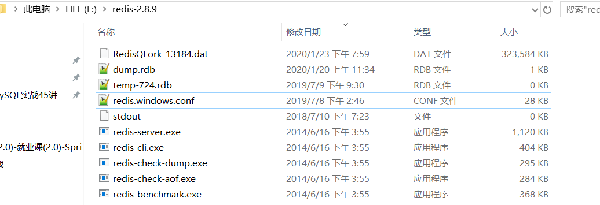

## 文档

      	1. 官网：https://redis.io
    2. 中文网：http://www.redis.net.cn/

## 工作模式

按存储方式可分为：**硬盘数据库和内存数据库**。Redis 将数据储存在内存里面，读写数据的时候都不会受到硬盘 I/O 速度的限制，所以速度极快。

（1）硬盘数据库的工作模式：


（2）内存数据库的工作模式：


## 持久化

redis是一个内存数据库，当redis服务器重启，获取电脑重启，数据会丢失，我们可以将redis内存中的数据持久化保存到硬盘的文件中。

### RDB

默认方式，不需要进行配置，默认就使用这种机制。在一定的间隔时间中，检测key的变化情况，然后持久化数据。

通过bgsave命令触发，然后父进程执行fork操作创建子进程，子进程创建RDB文件，根据父进程内存生成临时快照文件，完成后对原有文件进行原子替换（定时一次性将所有数据进行快照生成一份副本存储在硬盘中）

优点：是一个紧凑压缩的二进制文件，Redis加载RDB恢复数据远远快于AOF的方式。

缺点：由于每次生成RDB开销较大，非实时持久化，

1. 编辑redis.windwos.conf文件

   ```mysql
   #   after 900 sec (15 min) if at least 1 key changed
   save 900 1
   #   after 300 sec (5 min) if at least 10 keys changed
   save 300 10
   #   after 60 sec if at least 10000 keys changed
   save 60 10000
   ```

2. 重新启动redis服务器，并指定配置文件名称
   D:\JavaWeb2018\day23_redis\资料\redis\windows-64\redis-2.8.9>redis-server.exe redis.windows.conf	

### AOF

日志记录的方式，可以记录每一条命令的操作。可以每一次命令操作后，持久化数据。

优点：实时持久化。

缺点：所以AOF文件体积逐渐变大，需要定期执行重写操作来降低文件体积，加载慢

1. 编辑redis.windwos.conf文件

   ```mysql
   appendonly no（关闭aof） --> appendonly yes （开启aof）
   # appendfsync always ： 每一次操作都进行持久化
   appendfsync everysec ： 每隔一秒进行一次持久化
   # appendfsync no	 ： 不进行持久化
   ```

## 发布订阅消息

可以，（然后可以引出哨兵模式（后面会讲）怎么互相监督的，就是因为每隔2秒哨兵节点会发布对某节点的判断和自身的信息到某频道，每个哨兵订阅该频道获取其他哨兵节点和主从节点的信息，以达到哨兵间互相监控和对主从节点的监控）和很多专业的消息队列系统（例如Kafka、RocketMQ）相比，Redis的发布订阅略显粗糙，例如无法实现消息堆积和回溯。但胜在足够简单。

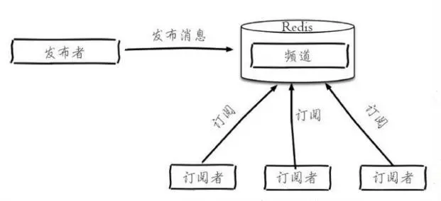


## 缓存

### 缓存更新策略

即内存和cpu资源占用平衡。

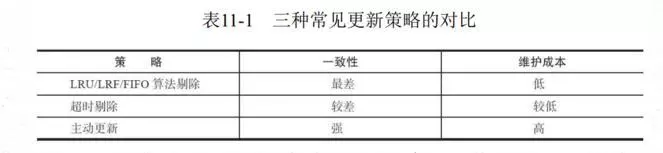

####  **key过期清除（超时剔除）策略**

- **惰性过期**（类比懒加载，这是懒过期）：只有当访问一个key时，才会判断该key是否已过期，过期则清除。该策略可以最大化地节省CPU资源，却对内存非常不友好。极端情况可能出现大量的过期key没有再次被访问，从而不会被清除，占用大量内存。

- **定期过期**：每隔一定的时间，会扫描一定数量的数据库的expires字典中一定数量的key，并清除其中已过期的key。该策略是前两者的一个折中方案。通过调整定时扫描的时间间隔和每次扫描的限定耗时，可以在不同情况下使得CPU和内存资源达到最优的平衡效果。

- (expires字典会保存所有设置了过期时间的key的过期时间数据，其中，key是指向键空间中的某个键的指针，value是该键的毫秒精度的UNIX时间戳表示的过期时间。键空间是指该Redis集群中保存的所有键。)

- 问：比如这么个场景，我设计了很多key，过期时间是5分钟，当前内存占用率是50%。但是5分钟到了，内存占用率还是很高，请问为什么？

  Redis中同时使用了惰性过期和定期过期两种过期策略，即使过期时间到了，但是**有部分**并没有真正删除，等待惰性删除。

  为什么有定期还要有惰性呢？其实很简单，比如10万个key就要过期了，Redis默认是100ms检查一波。如果他检查出10万个即将要清除，那他接下来的时间基本都是在干这些清空内存的事了，那肯定影响性能，所以他只会部分删除，剩下的等惰性

#### 内存淘汰策略

Redis的内存淘汰策略是指在Redis的用于缓存的内存不足时，怎么处理需要新写入且需要申请额外空间的数据。

- noeviction：当内存不足以容纳新写入数据时，新写入操作会报错。

- allkeys-lru：当内存不足以容纳新写入数据时，在键空间中，移除最近最少使用的key。

- allkeys-random：当内存不足以容纳新写入数据时，在键空间中，随机移除某个key。

- volatile-lru：当内存不足以容纳新写入数据时，在设置了过期时间的键空间中，移除最近最少使用的key。

- volatile-random：当内存不足以容纳新写入数据时，在设置了过期时间的键空间中，随机移除某个key。

- volatile-ttl：当内存不足以容纳新写入数据时，在设置了过期时间的键空间中，有更早过期时间的key优先移除。

### 缓存粒度控制

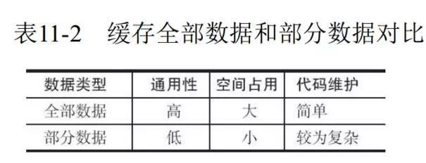

### 缓存穿透

#### 介绍

（缓存穿透指的是查询一个根本不存在的数据，缓存层不命中，又去查存储层，又不命中。但如果有大量这种查询不存在的数据的请求过来，会对存储层有较大压力，若是恶意攻击，后果就）

- 在接口层增加校验，比如用户鉴权校验，参数做校验，不合法的参数直接代码Return，比如：id 做基础校验，id <=0的直接拦截等。
- 布隆过滤器：利用高效的数据结构和算法快速判断出你这个Key是否在数据库中存在，不存在你return就好了，存在你就去查了DB刷新KV再return。

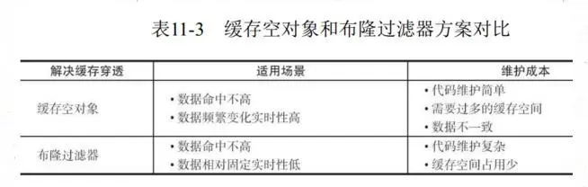

#### 缓存空值存在的问题


#### 布隆过滤器

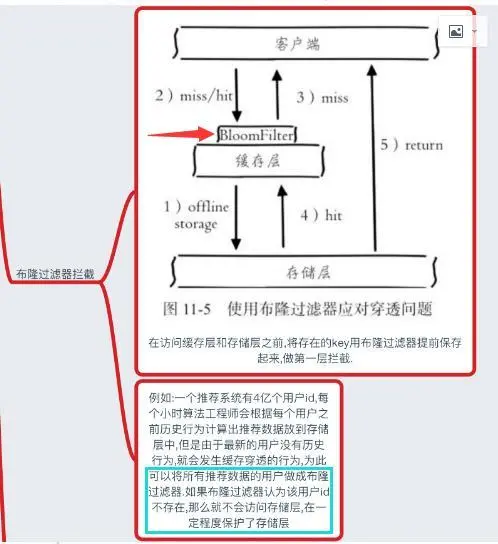


###  **缓存雪崩**

如果缓存层由于某些原因不能提供服务，于是所有的请求都会达到存储层，存储层的调用量会暴增，造成存储层也会级联宕机的情况。

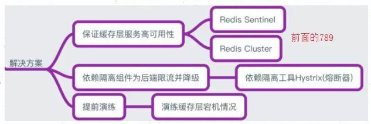

### 缓存击穿

当前key是一个热点key（例如一个热门的娱乐新闻），并发量非常大。

跟缓存雪崩有点像，但是又有一点不一样，缓存雪崩是因为大面积的缓存失效，打崩了DB，而缓存击穿不同的是缓存击穿是指一个Key非常热点，在不停的扛着大并发，大并发集中对这一个点进行访问，当这个Key在失效的瞬间，持续的大并发就穿破缓存，直接请求数据库，就像在一个完好无损的桶上凿开了一个洞。


### 无底洞优化

造成原因：redis分布式越来越多，导致性能反而下降，因为键值分布到更多的 节点上，所以无论是Memcache还是Redis的分布式，批量操作通常需要从不 同节点上获取，相比于单机批量操作只涉及一次网络操作，分布式批量操作 会涉及多次网络时间。 即分布式过犹不及。

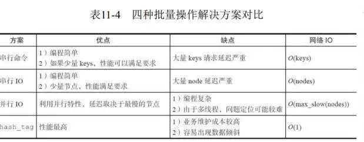

## Java客户端

### Jedis

```java
	* Jedis: 一款java操作redis数据库的工具.
	* 使用步骤：
		1. 下载jedis的jar包
		2. 使用
			//1. 获取连接
    		Jedis jedis = new Jedis("localhost",6379);
   			//2. 操作
   			jedis.set("username","zhangsan");
    		//3. 关闭连接
    		jedis.close();
    		
	* Jedis操作各种redis中的数据结构
		1) 字符串类型 string
			set
			get
			
			//1. 获取连接
	        Jedis jedis = new Jedis();//如果使用空参构造，默认值 "localhost",6379端口
	        //2. 操作
	        //存储
	        jedis.set("username","zhangsan");
	        //获取
	        String username = jedis.get("username");
	        System.out.println(username);
	
	        //可以使用setex()方法存储可以指定过期时间的 key value
	        jedis.setex("activecode",20,"hehe");//将activecode：hehe键值对存入redis，并且20秒后自动删除该键值对
	
	        //3. 关闭连接
	        jedis.close();

		2) 哈希类型 hash ： map格式  
			hset
			hget
			hgetAll
			//1. 获取连接
	        Jedis jedis = new Jedis();//如果使用空参构造，默认值 "localhost",6379端口
	        //2. 操作
	        // 存储hash
	        jedis.hset("user","name","lisi");
	        jedis.hset("user","age","23");
	        jedis.hset("user","gender","female");
	
	        // 获取hash
	        String name = jedis.hget("user", "name");
	        System.out.println(name);
	        // 获取hash的所有map中的数据
	        Map<String, String> user = jedis.hgetAll("user");
	
	        // keyset
	        Set<String> keySet = user.keySet();
	        for (String key : keySet) {
	            //获取value
	            String value = user.get(key);
	            System.out.println(key + ":" + value);
	        }
	
	        //3. 关闭连接
	        jedis.close();   

		3) 列表类型 list ： linkedlist格式。支持重复元素
			lpush / rpush
			lpop / rpop
			lrange start end : 范围获取
			
			 //1. 获取连接
	        Jedis jedis = new Jedis();//如果使用空参构造，默认值 "localhost",6379端口
	        //2. 操作
	        // list 存储
	        jedis.lpush("mylist","a","b","c");//从左边存
	        jedis.rpush("mylist","a","b","c");//从右边存
	
	        // list 范围获取
	        List<String> mylist = jedis.lrange("mylist", 0, -1);
	        System.out.println(mylist);
	        
	        // list 弹出
	        String element1 = jedis.lpop("mylist");//c
	        System.out.println(element1);
	
	        String element2 = jedis.rpop("mylist");//c
	        System.out.println(element2);
	
	        // list 范围获取
	        List<String> mylist2 = jedis.lrange("mylist", 0, -1);
	        System.out.println(mylist2);
	
	        //3. 关闭连接
	        jedis.close();
	        
	    4) 集合类型 set  ： 不允许重复元素
			sadd
			smembers:获取所有元素

			//1. 获取连接
	        Jedis jedis = new Jedis();//如果使用空参构造，默认值 "localhost",6379端口
	        //2. 操作
	        
	        // set 存储
	        jedis.sadd("myset","java","php","c++");
	
	        // set 获取
	        Set<String> myset = jedis.smembers("myset");
	        System.out.println(myset);
	
	        //3. 关闭连接
	        jedis.close();
	        
		5) 有序集合类型 sortedset：不允许重复元素，且元素有顺序
			zadd
			zrange

			//1. 获取连接
	        Jedis jedis = new Jedis();//如果使用空参构造，默认值 "localhost",6379端口
	        //2. 操作
	        // sortedset 存储
	        jedis.zadd("mysortedset",3,"亚瑟");
	        jedis.zadd("mysortedset",30,"后裔");
	        jedis.zadd("mysortedset",55,"孙悟空");
	
	        // sortedset 获取
	        Set<String> mysortedset = jedis.zrange("mysortedset", 0, -1);
	
	        System.out.println(mysortedset);
	      	//3. 关闭连接
	        jedis.close();
```

### JedisPool

jedis连接池

```java
		* 使用：
			1. 创建JedisPool连接池对象
			2. 调用方法 getResource()方法获取Jedis连接
				//0.创建一个配置对象
		        JedisPoolConfig config = new JedisPoolConfig();
		        config.setMaxTotal(50);
		        config.setMaxIdle(10);
		
		        //1.创建Jedis连接池对象
		        JedisPool jedisPool = new JedisPool(config,"localhost",6379);
		
		        //2.获取连接
		        Jedis jedis = jedisPool.getResource();
		        //3. 使用
		        jedis.set("hehe","heihei");			
				//4. 关闭 归还到连接池中
		        jedis.close();
		
		* 连接池工具类
			public class JedisPoolUtils {

			    private static JedisPool jedisPool;
			
			    static{
			        //读取配置文件
			        InputStream is = JedisPoolUtils.class.getClassLoader().getResourceAsStream("jedis.properties");
			        //创建Properties对象
			        Properties pro = new Properties();
			        //关联文件
			        try {
			            pro.load(is);
			        } catch (IOException e) {
			            e.printStackTrace();
			        }
			        //获取数据，设置到JedisPoolConfig中
			        JedisPoolConfig config = new JedisPoolConfig();
			        config.setMaxTotal(Integer.parseInt(pro.getProperty("maxTotal")));
			        config.setMaxIdle(Integer.parseInt(pro.getProperty("maxIdle")));
			
			        //初始化JedisPool
			        jedisPool = new JedisPool(config,pro.getProperty("host"),Integer.parseInt(pro.getProperty("port")));
			        
			        }
			        
            	/**
			     * 获取连接方法
			     */
			    public static Jedis getJedis(){
			        return jedisPool.getResource();a
			    }
			}
```

## 分布式锁

### 介绍

开源实现已有不少比如Redis作者基于Redis设计的Redlock，Redission等

小插曲：
 锁存在的地方就有争议，Redlock也不例外。有一位分布式专家曾经发表过一片文章[<How to do distributed locking>](https://link.jianshu.com?t=http%3A%2F%2Fmartin.kleppmann.com%2F2016%2F02%2F08%2Fhow-to-do-distributed-locking.html), 质疑Redlock的正确性，Redis作者则在[<Is Redlock safe?>](https://link.jianshu.com?t=http%3A%2F%2Fantirez.com%2Fnews%2F101)中给予了回应，争锋相对精彩无比，有兴趣的读者可以自行前往。

### 设计要点

- 锁的时效。避免单点故障造成死锁，影响其他客户端获取锁。但是也要保证一旦一个客户端持锁，在客户端可用时不会被其他客户端解锁。

- 持锁期间的check。尽量在关键节点检查锁的状态，所以要设计成可重入锁。

- 减少获取锁的操作，尽量减少redis压力。所以需要让客户端的申请锁有一个等待时间，而不是所有申请锁的请求线程不断的循环申请锁。

- 加锁的事务或者操作尽量粒度小，减少其他客户端申请锁的等待时间，提高处理效率和并发性。

- 持锁的客户端解锁后，要能通知到其他等待锁的节点，否则其他节点只能一直等待一个预计的时间再触发申请锁。类似线程的notifyAll,要能同步锁状态给其他客户端，并且是分布式消息。

- 考虑任何执行句柄中可能出现的异常，状态的正确流转和处理。比如，不能因为一个节点解锁失败，或者锁查询失败（redis 超时或者其他运行时异常），影响整个等待的任务队列，或者任务池。

- 若Redis服务器宕机或者网络异常，要有其他备份方案，比如单机锁限流+最终数据库的持久化锁来做好最终一致性控制。

### 单机模式

#### 可靠性

首先，为了确保分布式锁可用，我们至少要确保锁的实现同时满足以下四个条件：

1. 互斥性。在任意时刻，只有一个客户端能持有锁。
2. 不会发生死锁。即使有一个客户端在持有锁的期间崩溃而没有主动解锁，也能保证后续其他客户端能加锁。
3. 具有容错性。只要大部分的Redis节点正常运行，客户端就可以加锁和解锁。
4. 解铃还须系铃人。加锁和解锁必须是同一个客户端，客户端自己不能把别人加的锁给解了。

#### 组件依赖

首先我们要通过Maven引入`Jedis`开源组件，在`pom.xml`文件加入下面的代码：

```xml
<dependency>
    <groupId>redis.clients</groupId>
    <artifactId>jedis</artifactId>
    <version>2.9.0</version>
</dependency>
```

#### 加锁代码

##### 正确姿势

Talk is cheap, show me the code。先展示代码，再带大家慢慢解释为什么这样实现：

```java
public class RedisTool {

    private static final String LOCK_SUCCESS = "OK";
    private static final String SET_IF_NOT_EXIST = "NX";
    private static final String SET_WITH_EXPIRE_TIME = "PX";//ex表示过期时间的单位是秒，px表示过期时间的单位是毫秒

    /**
     * 尝试获取分布式锁
     * @param jedis Redis客户端
     * @param lockKey 锁
     * @param requestId 请求标识
     * @param expireTime 超期时间
     * @return 是否获取成功
     */
    public static boolean tryGetDistributedLock(Jedis jedis, String lockKey, String requestId, int expireTime) {

        String result = jedis.set(lockKey, requestId, SET_IF_NOT_EXIST, SET_WITH_EXPIRE_TIME, expireTime);

        if (LOCK_SUCCESS.equals(result)) {
            return true;
        }
        return false;

    }

}
```

可以看到，我们加锁就一行代码：`jedis.set(String key, String value, String nxxx, String expx, int time)`，这个set()方法一共有五个形参：

- 第一个为key，我们使用key来当锁，因为key是唯一的。
- 第二个为value，我们传的是requestId，很多童鞋可能不明白，有key作为锁不就够了吗，为什么还要用到value？原因就是我们在上面讲到可靠性时，分布式锁要满足第四个条件解铃还须系铃人，通过给value赋值为requestId，我们就知道这把锁是哪个请求加的了，在解锁的时候就可以有依据。requestId可以使用`UUID.randomUUID().toString()`方法生成。
- 第三个为nxxx，这个参数我们填的是NX，意思是SET IF NOT EXIST，即当key不存在时，我们进行set操作；若key已经存在，则不做任何操作；
- 第四个为expx，这个参数我们传的是PX，意思是我们要给这个key加一个过期的设置，具体时间由第五个参数决定。
- 第五个为time，与第四个参数相呼应，代表key的过期时间。

总的来说，执行上面的set()方法就只会导致两种结果：1. 当前没有锁（key不存在），那么就进行加锁操作，并对锁设置个有效期，同时value表示加锁的客户端。2. 已有锁存在，不做任何操作。

心细的童鞋就会发现了，我们的加锁代码满足我们可靠性里描述的三个条件。首先，set()加入了NX参数，可以保证如果已有key存在，则函数不会调用成功，也就是只有一个客户端能持有锁，满足互斥性。其次，由于我们对锁设置了过期时间，即使锁的持有者后续发生崩溃而没有解锁，锁也会因为到了过期时间而自动解锁（即key被删除），不会发生死锁。最后，因为我们将value赋值为requestId，代表加锁的客户端请求标识，那么在客户端在解锁的时候就可以进行校验是否是同一个客户端。由于我们只考虑Redis单机部署的场景，所以容错性我们暂不考虑。

##### 错误示例1

比较常见的错误示例就是使用`jedis.setnx()`和`jedis.expire()`组合实现加锁，代码如下：

```java
public static void wrongGetLock1(Jedis jedis, String lockKey, String requestId, int expireTime) {


    Long result = jedis.setnx(lockKey, requestId);

    if (result == 1) {

        // 若在这里程序突然崩溃，则无法设置过期时间，将发生死锁

        jedis.expire(lockKey, expireTime);

    }


}
```

setnx()方法作用就是SET IF NOT EXIST，expire()方法就是给锁加一个过期时间。乍一看好像和前面的set()方法结果一样，然而由于这是两条Redis命令，不具有原子性，如果程序在执行完setnx()之后突然崩溃，导致锁没有设置过期时间。那么将会发生死锁。网上之所以有人这样实现，是因为低版本的jedis并不支持多参数的set()方法。

##### 错误示例2

```java
public static boolean wrongGetLock2(Jedis jedis, String lockKey, int expireTime) {

    long expires = System.currentTimeMillis() + expireTime;
    String expiresStr = String.valueOf(expires);

    // 如果当前锁不存在，返回加锁成功
    if (jedis.setnx(lockKey, expiresStr) == 1) {
        return true;
    }

    // 如果锁存在，获取锁的过期时间
    String currentValueStr = jedis.get(lockKey);
    if (currentValueStr != null && Long.parseLong(currentValueStr) < System.currentTimeMillis()) {
        // 锁已过期，获取上一个锁的过期时间，并设置现在锁的过期时间
        String oldValueStr = jedis.getSet(lockKey, expiresStr);
        if (oldValueStr != null && oldValueStr.equals(currentValueStr)) {
            // 考虑多线程并发的情况，只有一个线程的设置值和当前值相同，它才有权利加锁
            return true;
        }
    }
        
    // 其他情况，一律返回加锁失败
    return false;

}
```

这一种错误示例就比较难以发现问题，而且实现也比较复杂。实现思路：使用`jedis.setnx()`命令实现加锁，其中key是锁，value是锁的过期时间。执行过程：1. 通过setnx()方法尝试加锁，如果当前锁不存在，返回加锁成功。2. 如果锁已经存在则获取锁的过期时间，和当前时间比较，如果锁已经过期，则设置新的过期时间，返回加锁成功。代码如下：

 

那么这段代码问题在哪里？1. 由于是客户端自己生成过期时间，所以需要强制要求分布式下每个客户端的时间必须同步。 2. 当锁过期的时候，如果多个客户端同时执行`jedis.getSet()`方法，那么虽然最终只有一个客户端可以加锁，但是这个客户端的锁的过期时间可能被其他客户端覆盖。3. 锁不具备拥有者标识，即任何客户端都可以解锁。

#### 解锁代码

##### 正确姿势

还是先展示代码，再带大家慢慢解释为什么这样实现：

```java
public class RedisTool {

    private static final Long RELEASE_SUCCESS = 1L;

    /**
     * 释放分布式锁	
     * @param jedis Redis客户端
     * @param lockKey 锁
     * @param requestId 请求标识
     * @return 是否释放成功
     */
    public static boolean releaseDistributedLock(Jedis jedis, String lockKey, String requestId) {

        String script = "if redis.call('get', KEYS[1]) == ARGV[1] then return redis.call('del', KEYS[1]) else return 0 end";
        Object result = jedis.eval(script, Collections.singletonList(lockKey), Collections.singletonList(requestId));

        if (RELEASE_SUCCESS.equals(result)) {
            return true;
        }
        return false;

    }

}
```

可以看到，我们解锁只需要两行代码就搞定了！第一行代码，我们写了一个简单的Lua脚本代码，上一次见到这个编程语言还是在《黑客与画家》里，没想到这次居然用上了。第二行代码，我们将Lua代码传到`jedis.eval()`方法里，并使参数KEYS[1]赋值为lockKey，ARGV[1]赋值为requestId。eval()方法是将Lua代码交给Redis服务端执行。

那么这段Lua代码的功能是什么呢？其实很简单，首先获取锁对应的value值，检查是否与requestId相等，如果相等则删除锁（解锁）。那么为什么要使用Lua语言来实现呢？因为要确保上述操作是原子性的。关于非原子性会带来什么问题，可以阅读[【解锁代码-错误示例2】](http://wudashan.cn/2017/10/23/Redis-Distributed-Lock-Implement/#releaseLock-wrongDemo2) 。那么为什么执行eval()方法可以确保原子性，源于Redis的特性，下面是官网对eval命令的部分解释：


简单来说，就是在eval命令执行Lua代码的时候，Lua代码将被当成一个命令去执行，并且直到eval命令执行完成，Redis才会执行其他命令。

##### 错误示例1

最常见的解锁代码就是直接使用`jedis.del()`方法删除锁，这种不先判断锁的拥有者而直接解锁的方式，会导致任何客户端都可以随时进行解锁，即使这把锁不是它的。

```
public static void wrongReleaseLock1(Jedis jedis, String lockKey) {
    jedis.del(lockKey);
}
```

 

##### 错误示例2

这种解锁代码乍一看也是没问题，甚至我之前也差点这样实现，与正确姿势差不多，唯一区别的是分成两条命令去执行，代码如下：

```java
public static void wrongReleaseLock2(Jedis jedis, String lockKey, String requestId) {
        
    // 判断加锁与解锁是不是同一个客户端
    if (requestId.equals(jedis.get(lockKey))) {
        // 若在此时，这把锁突然不是这个客户端的，则会误解锁
        jedis.del(lockKey);
    }

}
```

如代码注释，问题在于如果调用`jedis.del()`方法的时候，这把锁已经不属于当前客户端的时候会解除他人加的锁。那么是否真的有这种场景？答案是肯定的，比如客户端A加锁，一段时间之后客户端A解锁，在执行`jedis.del()`之前，锁突然过期了，此时客户端B尝试加锁成功，然后客户端A再执行del()方法，则将客户端B的锁给解除了。

#### 续约锁

```java
String script = "if redis.call('get', KEYS[1]) == ARGV[1] then return redis.call('set', KEYS[1] , ARGV[1] , ARGV[2] , ARGV[3]) else return 0 end";
        Jedis jedis = getJedis();
        Object result;
        try {
            result = jedis.eval(script, Collections.singletonList(lockKey), Arrays.asList(requestId, "PX", expireTime + ""));
        } finally {
            closeJedis(jedis);
        }
        boolean success = LOCK_SUCCESS.equals(result);
        if (success) {
            log.debug("续约分布式锁成功，lockKey：" + lockKey + " ，requestId：" + requestId);
        } else {
            log.debug("续约分布式锁失败，lockKey：" + lockKey + " ，requestId：" + requestId + " ,result:" + result);
        }
        return success;
```


#### 缺陷

1. 获取锁哪里怎么保证各个客户端的公平呢?

   > 公平估计保证不了,不过我们可以在客户端再添加一层本地锁,减少redis压力.

2. 获取到锁之后，执行业务代码，业务代码的执行时间大于设置的过期时间时，业务还没有执行完就释放掉锁，会有问题呢？

   > 可以在和业务线程的同一个进程中，开一个守护线程，用来给业务线程用来给快过期但未完成的业务线程续航时间
   >
   > 锁的过期时间要设置的合理，要大于业务执行时间。
   >
   > 添加子线程 判断主线程是否还存活，如果存活就继续给主线程续命，比如主线程固定时间存活13秒，子线程每6秒执行一次 如果发现主线程业务没有执行完，就给主线程续命7秒。这样只要业务没有执行完子线程就会无限给主线程续命，这个时候如果是业务代码出现问题就会导致死锁，怎么解决这个死锁就自己解决吧=-=

3. lock 方法不支持重入。

   > 同一时刻只有一个线程获取锁，这个锁是排他性的；获取不到锁的同学只能排队等候。

4. lock方法没有获取到锁，下一次什么时候在去获取锁？意思是线程需要sleep多久？我有一个想法是lock 返回ttl时间，避免频繁sleep，引发线程上下文频繁切换。

   > 这个根据具体业务具体处理，如：获取不到锁重试N次或直接返回无法获取锁。

5. 在真正的集群模式下，当存储锁的那台实例挂掉（或者是集群发生网络分区）发生主备切换的时候，互斥性就被打破了，大概率会出现多于一个线程同时获取到了锁

   而在实际生产中，Redis实例更多是Cluster模式，这种方案在Cluster模式下，容错性其实并不够友好

   当时由于我们的业务能够接受这样的“脏”锁出现，所以就还是采用了这种方案（事实上业内确实没有真正做到“令人满意”的方案，手动狗头）

   那么有没有比这种方案更优的解呢？ 有！ Redis作者antirez 的RedLock方案 有兴趣的可以自行问度娘 但这种方案也只是做到了更优 仍然难以称得上令人满意

   Redis分布式锁这个问题的探究过程是最为有趣的，层层深入思考，解决了眼前的问题又会出现新的问题，是一个不完美到趋近完美的过程，目前感觉这个问题在分布式下短时间内是没办法得到完美解决的 也许随着将来硬件、网络可靠性的提升不攻自破也说不一定 哈哈

#### 总结

本文主要介绍了如何使用Java代码正确实现Redis分布式锁，对于加锁和解锁也分别给出了两个比较经典的错误示例。其实想要通过Redis实现分布式锁并不难，只要保证能满足可靠性里的四个条件。互联网虽然给我们带来了方便，只要有问题就可以google，然而网上的答案一定是对的吗？其实不然，所以我们更应该时刻保持着质疑精神，多想多验证。

如果你的项目中Redis是多机部署的，那么可以尝试使用`Redisson`实现分布式锁，这是Redis官方提供的Java组件，链接在[参考阅读](http://wudashan.cn/2017/10/23/Redis-Distributed-Lock-Implement/#参考阅读)章节已经给出。

### 参考文章

 [理解锁以及分布式锁](https://www.jianshu.com/p/de67ae50f919)

[聊一聊分布式锁的设计](https://link.jianshu.com/?t=http%3A%2F%2Fwww.weizijun.cn%2F2016%2F03%2F17%2F%E8%81%8A%E4%B8%80%E8%81%8A%E5%88%86%E5%B8%83%E5%BC%8F%E9%94%81%E7%9A%84%E8%AE%BE%E8%AE%A1%2F)

[基于 Redis 的分布式锁](https://crossoverjie.top/2018/03/29/distributed-lock/distributed-lock-redis/)

| 拜托，面试请不要再问我Redis分布式锁的实现原理【石杉的架构笔记】 |
| ------------------------------------------------------------ |
| <https://mp.weixin.qq.com/s/y_Uw3P2Ll7wvk_j5Fdlusw>          |
| 分布式从来都是Java面试中的热门话题，而分布式锁，则是这其中必不可少的一个技术点。本文就来深入的探讨一下，基于业界流行的Redisson框架如何实现Redis分布式锁，并进一步看看，这背后究竟隐藏着哪些缺陷？ |

| 每秒上千订单场景下的分布式锁高并发优化实践！【石杉的架构笔记】 |
| ------------------------------------------------------------ |
| <https://mp.weixin.qq.com/s/RLeujAj5rwZGNYMD0uLbrg>          |
| 每秒上千订单场景下，如何对分布式锁的并发能力进行优化？       |

# 原理

redis是**单线程**。memcached 是多线程模型，nginx 是master 和work 多进程模型。

非异步IO+事件轮询API（多路复用，相当于JAVA里面的NIO）。

# 原子性

执行get、set以及eval等API，都是一个一个的任务，这些任务都会由Redis的线程去负责执行，任务要么执行成功，要么执行失败，这就是Redis的命令是原子性的原因。

# 事务

https://www.cnblogs.com/lori/p/9300087.html

> 事务之间不隔离

https://www.jianshu.com/p/f14dfbbc7a38

https://blog.csdn.net/qq_32331073/article/details/79926307

 Redis 不支持回滚


# 集群

1. 主从

解决读写分离的问题。分为主库 master、从库 slave。一般主库可以写数据，从库只读自动同步主库更新的数据。集群情况下，有节点宕机会导致请求不可用；主机宕机可能会导致数据不一致；从机重启同步数据需要考虑主机的 io 压力。生产环境建议使用哨兵和cluster方法

2. 哨兵

Redis Sentinel，哨兵机制，解决主从节点高可用的问题。监控主从服务器运行状态；检测到 master 宕机时，会发布消息进行选举，自动将 slave 提升为 master

总结下哨兵组件的主要功能：

集群监控：负责监控 Redis master 和 slave 进程是否正常工作。
消息通知：如果某个 Redis 实例有故障，那么哨兵负责发送消息作为报警通知给管理员。
故障转移：如果 master node 挂掉了，会自动转移到 slave node 上。
配置中心：如果故障转移发生了，通知 client 客户端新的 master 地址。
3. Cluster

Redis Cluster，分布式解决方案，解决单点故障与扩展性以及哨兵机制中每台 Redis 服务器都存储相同的数据浪费内存的问题。实现了 Redis 的分布式存储，也就是每台 Redis 节点上存储不同的内容

redis哈希槽：redis 集群没有使用一致性 hash，而是引入了哈希槽的概念。

redis 集群有 16384 个哈希槽，每个 key 通过 CRC16 算法计算的结果，对 16384 取模后放到对应的编号在 0-16383 之间的哈希槽，集群的每个节点负责一部分哈希槽

4.一些问题

（1）Redis集群方案不可用的情况？

集群主库半数宕机(根据 failover 原理，fail 掉一个主需要一半以上主都投票通过才可以)
集群某一节点的主从全数宕机
（2）Redis 集群会有写操作丢失吗？

过期 key 被清理
最大内存不足，导致 Redis 自动清理部分 key 以节省空间
主库故障后自动重启，从库自动同步
单独的主备方案，网络不稳定触发哨兵的自动切换主从节点，切换期间会有数据丢失
（3）Redis集群之间是如何复制？

2.8 版以前，Redis 通过同步(sync)和指令传播(command propagate)两个操作完成同步
同步(sync)：将从节点的数据库状态更新至与主节点的数据库状态一致
指令传播(command propagate)：主节点数据被修改，会主动向从节点发送执行的写指令，从节点执行之后，两个节点数据状态又保持一致
2.8 版开始新增 PSYNC 指令，PSYNC 具有两种模式：
完整重同步(full resynchronization)，与 SYNC 过程基本一致
部分重同步(partial resynchronization)，借助复制偏移量、复制积压缓冲区、服务器运行 ID ，完成主从节点断开连接后，从节点重连主节点后，条件允许，主节点将连接断开期间执行的写指令发送给从节点，从节点接收并执行写指令，将数据库更新至主节点当前状态
（4）Redis集群支持最大节点数是多少？

16384 个。原因如下：

Redis 集群有 16384 个哈希槽，每个 key 通过 CRC16 算法计算的结果，对 16384 取模后放到对应的编号在 0-16383 之间的哈希槽，集群的每个节点负责一部分哈希槽
————————————————
版权声明：本文为CSDN博主「咕咕粒」的原创文章，遵循CC 4.0 BY-SA版权协议，转载请附上原文出处链接及本声明。
原文链接：https://blog.csdn.net/weixin_42307002/article/details/112176482

# 数据结构细节

Redis是由C语言编写的。Redis支持5种数据类型，以K-V形式进行存储，K是String类型的，V支持5种不同的数据类型，分别是：string，list，hash，set，sorted set，每一种数据结构都有其特定的应用场景。

从内部实现的角度来看是如何更好的实现这些数据类型。Redis底层数据结构有以下数据类型：简单动态字符串（SDS），链表，字典，跳跃表，整数集合，压缩列表，对象。【

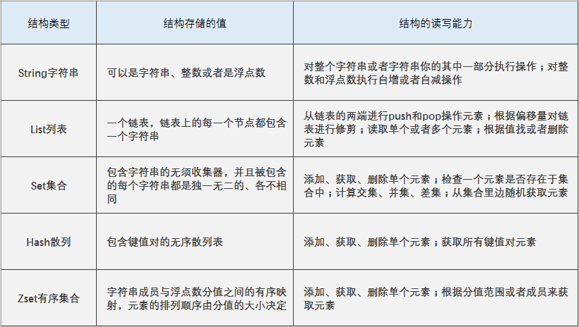

## String

Redis中的String类型就是一个由字节组成的序列，他和其他编程语言或者其他键值对存储提供的字符串操作非常相似。

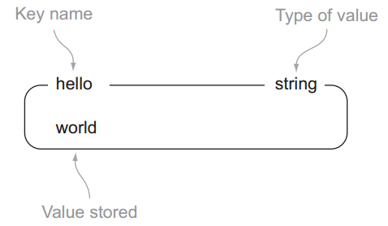

String是最常用的一种数据类型，普通的`key/value`存储都可以归为此类，value其实**不仅是String， 也可以是数字**：比如想知道什么时候封锁一个IP地址(访问超过几次)。加减命令让这些变得很容易，通过原子递增保持计数。

## List

Redis中的List其实就是链表（redis 使用双端链表实现的 List），相信学过数据结构知识的人都应该能理解其结构。

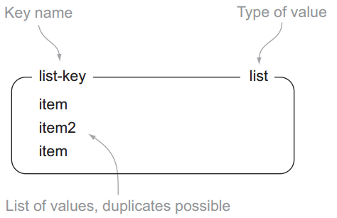

使用 List 结构，我们可以轻松地实现最新消息排行等功能（比如新浪微博的 TimeLine ）。List 的另一个应用就是消息队列，可以利用 List 的 PUSH 操作，将任务存在 List 中，然后工作线程再用 POP 操作将任务取出进行执行。

- **使用场景**
  - 微博 TimeLine
  - 消息队列

## Set

Redis的集合和列表都可以存储多个字符串，他们的不同支持在于，列表可以存储多个相同的字符串，而集合通过使用散列表来保证自己存储的每个字符串都是各不相同的。

Redis的集合使用的是无序的方式存储元素，所以不可以像List列表那样，将元素推入集合的某一端，或者从集合的某一端弹出元素。
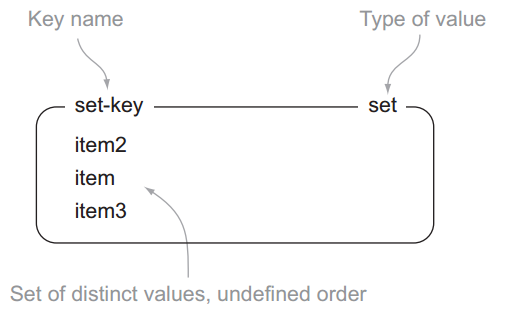

- **使用场景**
  - 共同好友、二度好友
  - 利用唯一性，可以统计访问网站的所有独立 IP
  - 好友推荐的时候，根据 tag 求交集，大于某个 threshold 就可以推荐

## Hash散列

Redis的散列可以存储多个键值对之间的映射。和字符串一样，散列存储的值既可以是字符串又可以是数字值，并且用户同样可以对散列存储的数字执行自增操作或者是自减操作。

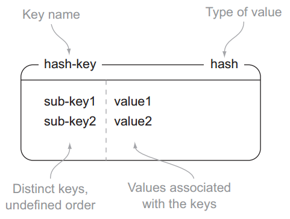

## ZSet

有序集合和散列一样，用于存储键值对；有序集合的键被称为成员member，每一个成员都是独一无二的；而有序集合的值被称为分值score，分值必须是浮点数。

有序集合是Redis里面唯一一个既可以根据成员访问元素，又可以根据分值以及分值的排序来访问元素的结构。

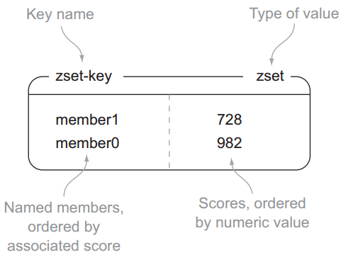

## 底层实现

### 简单动态字符串

#### 介绍

simple dynamic string SDS

String的数据类型是由SDS实现的。Redis并没有采用C语言的字符串表示，而是自己构建了一种名为SDS的抽象类型，并将SDS作为Redis的默认字符串表示。

```shell
redis>SET msg "hello world"
OK
```

上边设置key=msg，value=hello world的键值对，它们的底层存储是：键（key）是字符串类型，其底层实现是一个保存着“msg”的SDS。值（value）是字符串类型，其底层实现是一个保存着“hello world”的SDS。
  注意：SDS除了用于实现字符串类型，还被用作AOF持久化时的缓冲区。
SDS的定义为：

```c
/*  
 * 保存字符串对象的结构  
 */  
struct sdshdr {  
      
    // buf 中已占用空间的长度  
    int len;  
  
    // buf 中剩余可用空间的长度  
    int free;  
  
    // 数据空间  
    char buf[];  
};
```

#### 为什么要使用SDS

我们一定会思考，redis为什么不使用C语言的字符串而是费事搞一个SDS呢，这是因为C语言用N+1的字符数组来表示长度为N的字符串，这样做在获取字符串长度，字符串扩展等操作方面效率较低，并且无法满足redis对字符串在安全性、效率以及功能方面的要求。

- **获取字符串长度（SDS O（1））**

  在C语言字符串中，为了获取一个字符串的长度，必须遍历整个字符串，时间复杂度为O(1)，而SDS中，有专门用于保存字符串长度的变量，所以可以在O（1）时间内获得。

- **防止缓冲区溢出**
  C字符串，容易导致缓冲区溢出，假设在程序中存在内存紧邻的字符串s1和s2，s1保存redis，s2保存MongoDB，如下图：

  

  如果我们现在将s1 的内容修改为redis cluster，但是又忘了重新为s1 分配足够的空间，这时候就会出现以下问题：

  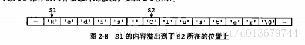


    因为s1和s2是紧邻的，所以原本s2 中的内容已经被S1的内容给占领了，s2 现在为 cluster，而不是“Mongodb”。而Redis中的SDS就杜绝了发生缓冲区溢出的可能性。

   当我们需要对一个SDS 进行修改的时候，redis 会在执行拼接操作之前，**预先检查给定SDS 空间是否足够**（free记录了剩余可用的数据长度），如果不够，会先拓展SDS 的空间，然后再执行拼接操作。

- **减少扩展或收缩字符串带来的内存重分配次数**

  当字符串进行扩展或收缩时，都会对内存空间进行重新分配。

  1. 字符串拼接会产生字符串的内存空间的扩充，在拼接的过程中，原来的字符串的大小很可能小于拼接后的字符串的大小，那么这样的话，就会导致一旦忘记申请分配空间，就会导致内存的溢出。
  2. 字符串在进行收缩的时候，内存空间会相应的收缩，而如果在进行字符串的切割的时候，没有对内存的空间进行一个重新分配，那么这部分多出来的空间就成为了内存泄露。

  比如：字符串"redis"，当进行字符串拼接时，将redis+cluster=13，会将SDS的长度修改为13，同时将free也改为13，这意味着进行预分配了，将buffer大小变为了26。这是为了如果再次执行字符串拼接操作，如果拼接的字符串长度<13,就不需要重新进行内存分配了。

  通过这种预分配策略，SDS将连续增长N次字符串所需的内存重分配次数从必定N次降低为最多N次。通过惰性空间释放，SDS 避免了缩短字符串时所需的内存重分配操作，并未将来可能有的增长操作提供了优化。

- **二进制安全**

  C 字符串中的字符必须符合某种编码，并且除了字符串的末尾之外，字符串里面不能包含空字符，否则最先被程序读入的空字符将被误认为是字符串结尾，这些限制使得C字符串只能保存文本数据，而不能保存想图片，音频，视频，压缩文件这样的二进制数据。

  但是在Redis中，不是靠空字符来判断字符串的结束的，而是通过len这个属性。那么，即便是中间出现了空字符对于SDS来说，读取该字符仍然是可以的。

  但是，SDS依然可以兼容部分C字符串函数。

### 链表

链表是list的实现方式之一。当list包含了数量较多的元素，或者列表中包含的元素都是比较长的字符串时，Redis会使用链表作为实现List的底层实现。此链表是双向链表：

```c
typedef struct listNode{
      struct listNode *prev;
      struct listNode * next;
      void * value;  
}
```

一般我们通过操作list来操作链表：

```c
typedef struct list{
    //表头节点
    listNode  * head;
    //表尾节点
    listNode  * tail;
    //链表长度
    unsigned long len;
    //节点值复制函数
    void *(*dup) (void *ptr);
    //节点值释放函数
    void (*free) (void *ptr);
    //节点值对比函数
    int (*match)(void *ptr, void *key);
}
```

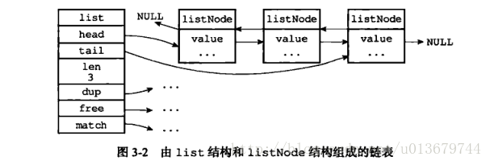

链表结构的特点是可以快速的在表头和表尾插入和删除元素，但查找复杂度高，是列表的底层实现之一，也因此列表没有提供判断某一元素是否在列表中的借口，因为在链表中查找复杂度高。

### 字典

字典，又称为符号表（symbol table）、关联数组（associative array）或映射（map），是一种用于保存键值对的抽象数据结构。　

在字典中，一个键（key）可以和一个值（value）进行关联，字典中的每个键都是独一无二的。在C语言中，并没有这种数据结构，但是Redis 中构建了自己的字典实现。

```shell
redis > SET msg "hello world"
OK
```

**Redis本身的K-V存储就是利用字典这种数据结构的，另外value类型的哈希表也是通过这个实现的。**
哈希表dicy的定义为：

```c
typedef struct dictht {
   //哈希表数组
   dictEntry **table;
   //哈希表大小
   unsigned long size;

   //哈希表大小掩码，用于计算索引值
   unsigned long sizemask;
   //该哈希表已有节点的数量
   unsigned long used;
}
```

我们可以想到对比Java hashMap的实现方式，在dictht中，table数组的类型是：

```c
typeof struct dictEntry{
   //键
   void *key;
   //值
   union{
      void *val;
      uint64_tu64;
      int64_ts64;
   }
   struct dictEntry *next;

}
```

我们存入里面的key 并不是直接的字符串，而是一个hash 值，通过hash 算法，将字符串转换成对应的hash 值，然后在dictEntry 中找到对应的位置。

这时候我们会发现一个问题，如果出现hash 值相同的情况怎么办？Redis 采用了链地址法来解决hash冲突。这与hashmap的实现类似。

注意：Redis又在dictht的基础上，又抽象了一层字典dict，其定义为：

```c
typedef struct dict {
    // 类型特定函数
    dictType *type;
    // 私有数据
    void *privedata;
    // 哈希表
    dictht  ht[2];
    // rehash 索引
    in trehashidx;

}
```


　type 属性 和privdata 属性是针对不同类型的键值对，为创建多态字典而设置的。

　ht 属性是一个包含两个项（两个哈希表）的数组，如图：

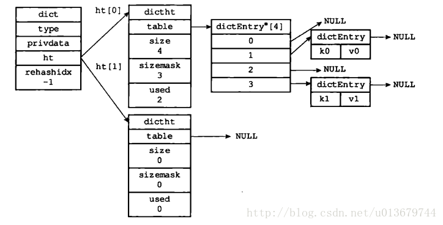

**解决hash冲突**：采用链地址法来实现。

**扩充Rehash**：　随着对哈希表的不断操作，哈希表保存的键值对会逐渐的发生改变，为了让哈希表的负载因子维持在一个合理的范围之内，我们需要对哈希表的大小进行相应的扩展或者压缩，这时候，我们可以通过 rehash（重新散列）操作来完成。其实现方式和hashmap略有不同，因为dict有两个hash表dictht，所以它是通过这两个dictht互相进行转移的。
比如：

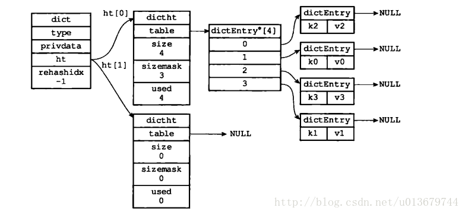

上图这种情况，代表要进行扩容了，所以就要将ht[0]的数据转移到ht[1]中。ht[1]创建为`2*ht[0].size`大小的，如下图：


将ht[0]释放，然后将ht[1]设置成ht[0]，最后为ht[1]分配一个空白哈希表：

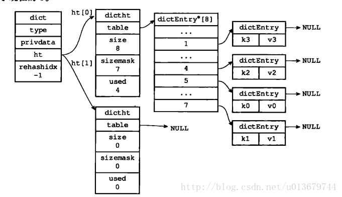


其实上边的扩容过程和Java 的HashMap具体的扩容实现方式还是挺像的。

**渐进式rehash**：在实际开发过程中，这个rehash 操作并不是一次性、集中式完成的，而是分多次、渐进式地完成的。采用渐进式rehash 的好处在于它采取分而治之的方式，避免了集中式rehash 带来的庞大计算量。

渐进式rehash 的详细步骤：

1、为ht[1] 分配空间，让字典同时持有ht[0]和ht[1]两个哈希表

2、在几点钟维持一个索引计数器变量rehashidx，并将它的值设置为0，表示rehash 开始

 3、在rehash 进行期间，每次对字典执行CRUD操作时，程序除了执行指定的操作以外，还会将ht[0]中的数据rehash 到ht[1]表中，并且将rehashidx加一

  4、当ht[0]中所有数据转移到ht[1]中时，将rehashidx 设置成-1，表示rehash 结束

### 跳跃表

Redis 只在两个地方用到了跳跃表，一个是实现有序集合键（sorted Sets），另外一个是在集群节点中用作内部数据结构。

其实跳表主要是来替代平衡二叉树的，比起平衡树来说，跳表的实现要简单直观的多。

跳跃表（skiplist）是一种有序数据结构，它通过在每个节点中维持多个指向其他节点的指针，从而达到快速查找访问节点的目的。跳跃表是一种随机化的数据,跳跃表以有序的方式在层次化的链表中保存元素，效率和平衡树媲美 ——查找、删除、添加等操作都可以在O（logn）期望时间下完成。

 Redis 的跳跃表 主要由两部分组成：zskiplist（链表）和zskiplistNode （节点）：

```c
typedef struct zskiplistNode{
　　　//层
     struct zskiplistLevel{
　　　　　//前进指针
        struct zskiplistNode *forward;
　　　　//跨度
        unsigned int span;
    } level[];
　　//后退指针
    struct zskiplistNode *backward;
　　//分值
    double score;
　　//成员对象
    robj *obj;
}
```

1、层：level 数组可以包含多个元素，每个元素都包含一个指向其他节点的指针。level数组的每个元素都包含：前进指针：用于指向表尾方向的前进指针，跨度：用于记录两个节点之间的距离
2、后退指针：用于从表尾向表头方向访问节点

3、分值和成员：跳跃表中的所有节点都按分值从小到大排序（按照这个进行排序的，也就是平衡二叉树（搜索树的）的节点大小）。成员对象指向一个字符串，这个字符串对象保存着一个SDS值（实际存储的值）

```c
typedef struct zskiplist {
     //表头节点和表尾节点
     structz skiplistNode *header,*tail;
     //表中节点数量
     unsigned long length;
     //表中层数最大的节点的层数
     int level;

}zskiplist;
```

#### 应用

Redis 为 `o1` 、 `02` 和 `03` 三个 `member` 分别创建了三个字符串， 值分别为 `double` 类型的 `1.0` 、 `2.0` 和 `3.0` ， 然后用跳跃表将这些指针有序地保存起来， 形成这样一个跳跃表：

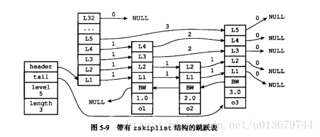

为了方便展示， 在图片中我们直接将 `member` 和 `score` 值包含在表节点中， 但是在实际的定义中， 因为跳跃表要和另一个实现有序集的结构（字典）分享 `member` 和 `score` 值， 所以跳跃表只保存指向 `member` 和 `score` 的指针。 更详细的信息，请参考《[有序集](https://redisbook.readthedocs.io/en/latest/datatype/sorted_set.html#sorted-set-chapter)》章节。

从结构图中我们可以清晰的看到，header，tail分别指向跳跃表的头结点和尾节点。level 用于记录最大的层数，length 用于记录我们的节点数量。

- 跳跃表是有序集合的底层实现之一
- 主要有zskiplist 和zskiplistNode两个结构组成\
- 每个跳跃表节点的层高都是1至32之间的随机数
- 在同一个跳跃表中，多个节点可以包含相同的分值，但每个节点的对象必须是唯一
- 节点按照分值的大小从大到小排序，如果分值相同，则按成员对象大小排序

**怎么使用跳表来实现O（logn）的增删改查？？**

其实跳表的实现原理，我们可以结合二分法来看。

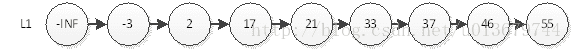

比如上图，我们要查找55，如果通过遍历，则必须得从头遍历到最后一个才能找到，所以在数组实现中，我们可以使用二分法来实现，但是在链表中，我们没办法直接通过下标来访问元素，所以一般我们可以用二叉搜索树，平衡树来存储元素，我们知道跳表就是来替代平衡树的，那么跳表是如何快速查询呢？看下图：

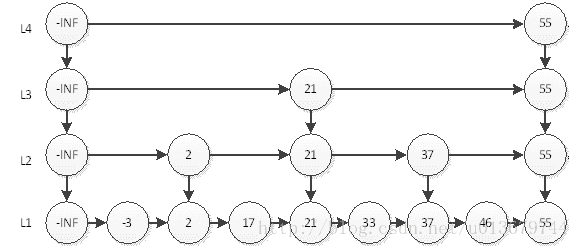

从上图我们可以看到，我们通过第4层，只需一步便可找到55，另外最耗时的访问46需要6次查询。即L4访问55，L3访问21、55，L2访问37、55，L1访问46。我们直觉上认为，这样的结构会让查询有序链表的某个元素更快。这种实现方式跟二分很相似，其时间复杂度就是O(logn)。其插入，删除都是O（logn）。

我们可以看到，redis正是通过定义这种结构来实现上边的过程，其层数最高为32层，也就是他可以存储2^32次方的数据，其查找过程与上图很类似。

### 整数集合

（Intset）

《Redis 设计与实现》 中这样定义整数集合：“整数集合是集合建(sets)的底层实现之一，当一个集合中只包含整数，且这个集合中的元素数量不多时，redis就会使用整数集合intset作为集合的底层实现。”

我们可以这样理解整数集合，他其实就是一个特殊的集合，里面存储的数据只能够是整数，并且数据量不能过大。

```c
typedef struct intset{
    //编码方式
    uint32_t enconding;
   // 集合包含的元素数量
    uint32_t length;
    //保存元素的数组    
    int8_t contents[];

} 
```


整数集合是集合建的底层实现之一.

整数集合的底层实现为数组，这个数组以有序，无重复的范式保存集合元素，在有需要时，程序会根据新添加的元素类型改变这个数组的类型.

### 压缩列表

压缩列表是列表键（list）和哈希键（hash）的底层实现之一。当一个列表键只有少量列表项，并且每个列表项要么就是小整数，要么就是长度比较短的字符串，那么Redis 就会使用压缩列表来做列表键的底层实现。

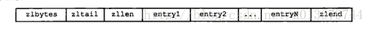

　　1、zlbytes:用于记录整个压缩列表占用的内存字节数

　　2、zltail：记录要列表尾节点距离压缩列表的起始地址有多少字节

　　3、zllen：记录了压缩列表包含的节点数量。

　　4、entryX：要说列表包含的各个节点

　　5、zlend：用于标记压缩列表的末端

　　　　

压缩列表是一种为了节约内存而开发的顺序型数据结构

压缩列表被用作列表键和哈希键的底层实现之一

压缩列表可以包含多个节点，每个节点可以保存一个字节数组或者整数值

添加新节点到压缩列表，可能会引发连锁更新操作。


在上边我们介绍了Redis的5种数据结构和其底层实现，对与这些数据结构的使用命令，只要理解了这些数据类型，使用就是一件很简单的事情。在下一篇博客中，会继续接受Redis的相关原理如：Redis的持久化，Redis的事务，Redis 3.0 的集群功能，Redis的应用场景等内容。

关于Redis的各个数据类型的应用，我们可以参考下边的文章：
[数据类型的应用](https://www.cnblogs.com/xiaoxi/p/7007695.html)

# 参考文献

https://blog.csdn.net/u010870518/category_5928487.html

https://www.redis.net.cn/order/

[《Redis 设计与实现》](http://redisbook.com/)

Redis [原理及应用](https://blog.csdn.net/u013679744/category_7424631.html) 没看完，很好，待解决

 [redis学习](https://www.cnblogs.com/xiaoxi/p/7007695.html) 没看完，很好，待解决

https://redisbook.readthedocs.io/en/latest/internal-datastruct/skiplist.html 待解决