#  什么是全文检索

## 2.1  数据分类

我们生活中的数据总体分为两种：结构化数据和非结构化数据。

结构化数据：指具有固定格式或有限长度的数据，如数据库，元数据等。

非结构化数据：指不定长或无固定格式的数据，如邮件，word文档等磁盘上的文件

## 2.2  结构化数据搜索

常见的结构化数据也就是数据库中的数据。在数据库中搜索很容易实现，通常都是使用sql语句进行查询，而且能很快的得到查询结果。

为什么数据库搜索很容易？

因为数据库中的数据存储是有规律的，有行有列而且数据格式、数据长度都是固定的。

## 2.3  非结构化数据查询方法

**（1）顺序扫描法(Serial Scanning)**

所谓顺序扫描，比如要找内容包含某一个字符串的文件，就是一个文档一个文档的看，对于每一个文档，从头看到尾，如果此文档包含此字符串，则此文档为我们要找的文件，接着看下一个文件，直到扫描完所有的文件。如利用windows的搜索也可以搜索文件内容，只是相当的慢。

**（2）全文检索(Full-text Search)**

将非结构化数据中的一部分信息提取出来，重新组织，使其变得有一定结构，然后对此有一定结构的数据进行搜索，从而达到搜索相对较快的目的。这部分从非结构化数据中提取出的然后重新组织的信息，我们称之**索引**。

例如：字典。字典的拼音表和部首检字表就相当于字典的索引，对每一个字的解释是非结构化的，如果字典没有音节表和部首检字表，在茫茫辞海中找一个字只能顺序扫描。然而字的某些信息可以提取出来进行结构化处理，比如读音，就比较结构化，分声母和韵母，分别只有几种可以一一列举，于是将读音拿出来按一定的顺序排列，每一项读音都指向此字的详细解释的页数。我们搜索时按结构化的拼音搜到读音，然后按其指向的页数，便可找到我们的非结构化数据——也即对字的解释。

**这种先建立索引，再对索引进行搜索的过程就叫全文检索(Full-text Search)。**

虽然创建索引的过程也是非常耗时的，但是索引一旦创建就可以多次使用，全文检索主要处理的是查询，所以耗时间创建索引是值得的。

## 2.4  如何实现全文检索

可以使用Lucene实现全文检索。Lucene 是 apache 下的一个开放源代码的全文检索引擎工具包。提供了完整的**查询引擎**和**索引引擎**，**部分文本分析引擎**。Lucene 的目的是为软件开发人员提供一个简单易用的工具包，以方便的在目标系统中实现全文检索的功能。

 

## 2.5  全文检索的应用场景

对于数据量大、数据结构不固定、搜索条件个性化的数据可采用全文检索方式搜索，比如百度、Google等搜索引擎、论坛站内搜索、电商网站站内搜索等。

# 流程

## 3.1  索引和搜索流程图

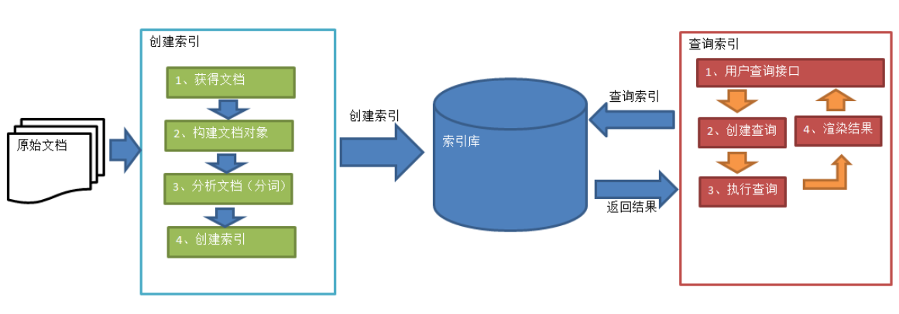

1、绿色表示索引过程，对要搜索的原始内容进行索引构建一个索引库，索引过程包括：

​		确定原始内容即要搜索的内容→采集文档→创建文档→分析文档→索引文档

​     

2、红色表示搜索过程，从索引库中搜索内容，搜索过程包括：

​		用户通过搜索界面→创建查询→执行搜索，从索引库搜索→渲染搜索结果

## 3.2  创建索引

对文档索引的过程，将用户要搜索的文档内容进行索引，索引存储在索引库（index）中。

这里我们要搜索的文档是磁盘上的文本文件，根据案例描述：凡是文件名或文件内容包括关键字的文件都要找出来，这里要对文件名和文件内容创建索引。

### 3.2.1 获得原始文档

**原始文档**是指要索引和搜索的内容。原始内容包括互联网上的网页、数据库中的数据、磁盘上的文件等。

本案例中的原始内容就是磁盘上的文件，如下图：

 

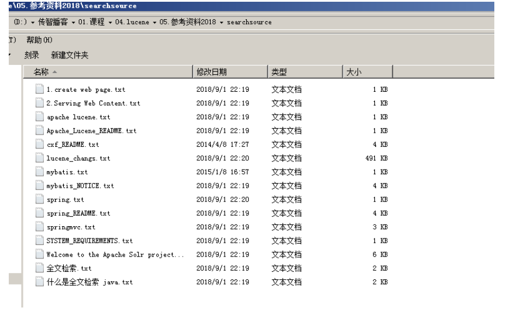

从互联网上、数据库、文件系统中等获取需要搜索的原始信息，这个过程就是**信息采集**，信息采集的目的是为了对原始内容进行索引。

在Internet上采集信息的软件通常称为爬虫或蜘蛛，也称为网络机器人，爬虫访问互联网上的每一个网页，将获取到的网页内容存储起来。

本案例我们要获取磁盘上文件的内容，可以通过文件流来读取文本文件的内容，对于pdf、doc、xls等文件可通过第三方提供的解析工具读取文件内容，比如Apache POI读取doc和xls的文件内容。

 

### 3.2.2 创建文档对象

获取原始内容的目的是为了索引，在索引前需要将原始内容创建成文档（Document），文档中包括一个一个的域（Field），域中存储内容。

这里我们可以将磁盘上的一个文件当成一个document，Document中包括一些Field（file_name文件名称、file_path文件路径、file_size文件大小、file_content文件内容），如下图：

 

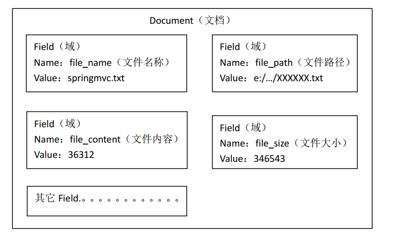

注意：每个Document可以有多个Field，不同的Document可以有不同的Field，同一个Document可以有相同的Field（域名和域值都相同）

每个文档都有一个唯一的编号，就是文档id。

### 3.2.3 分析文档

​	将原始内容创建为包含域（Field）的文档（document），需要再对域中的内容进行分析，分析的过程是经过对原始文档提取单词、将字母转为小写、去除标点符号、去除停用词等过程生成最终的**语汇单元**，可以将语汇单元理解为一个一个的单词。

比如下边的文档经过分析如下：

原文档内容：

Lucene is a Java full-text search engine. Lucene is not a complete

application, but rather a code library and API that can easily be used

to add search capabilities to applications.

分析后得到的语汇单元：

lucene、java、full、search、engine。。。。

每个单词叫做一个Term，不同的域中拆分出来的相同的单词是不同的term。term中包含两部分一部分是文档的域名，另一部分是单词的内容。

例如：文件名中包含apache和文件内容中包含的apache是不同的term。

### 3.2.4 创建索引

​	对所有文档分析得出的语汇单元进行索引，索引的目的是为了搜索，最终要实现只搜索被索引的语汇单元从而找到Document（文档）。

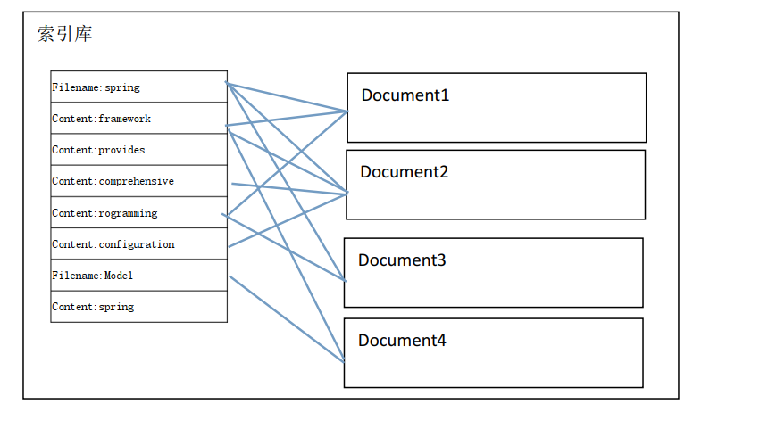

注意：**创建索引是对语汇单元索引**，通过词语找文档，这种索引的结构叫**倒排索引结构**。

传统方法是根据文件找到该文件的内容，在文件内容中匹配搜索关键字，这种方法是顺序扫描方法，数据量大、搜索慢。

**倒排索引结构**是根据内容（词语）找文档，如下图： 

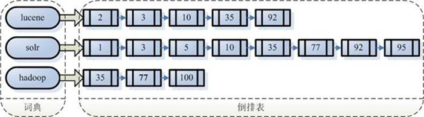

 

**倒排索引结构也叫反向索引结构，包括索引和文档两部分，索引即词汇表，它的规模较小，而文档集合较大。**

## 3.3  查询索引

​	查询索引也是搜索的过程。搜索就是用户输入关键字，从索引（index）中进行搜索的过程。根据关键字搜索索引，根据索引找到对应的文档，从而找到要搜索的内容（这里指磁盘上的文件）。

### 3.3.1 用户查询接口

全文检索系统提供用户搜索的界面供用户提交搜索的关键字，搜索完成展示搜索结果。

 

比如：

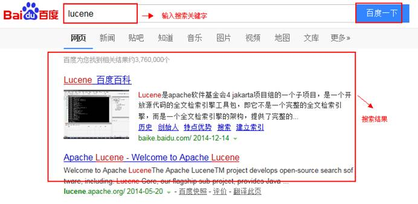

 

Lucene不提供制作用户搜索界面的功能，需要根据自己的需求开发搜索界面。

### 3.3.2 创建查询

用户输入查询关键字执行搜索之前需要先构建一个查询对象，查询对象中可以指定查询要搜索的Field文档域、查询关键字等，查询对象会生成具体的查询语法，

例如：

语法 “`fileName:lucene`”表示要搜索Field域的内容为“lucene”的文档

 

### 3.3.3 执行查询

搜索索引过程：

根据查询语法在倒排索引词典表中分别找出对应搜索词的索引，从而找到索引所链接的文档链表。

比如搜索语法为“fileName:lucene”表示搜索出fileName域中包含Lucene的文档。

搜索过程就是在索引上查找域为fileName，并且关键字为Lucene的term，并根据term找到文档id列表。

 


 

### 3.3.4 渲染结果

以一个友好的界面将查询结果展示给用户，用户根据搜索结果找自己想要的信息，为了帮助用户很快找到自己的结果，提供了很多展示的效果，比如搜索结果中将关键字高亮显示，百度提供的快照等。

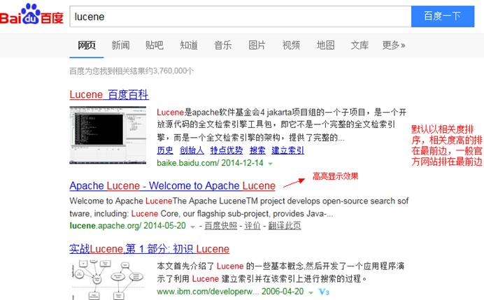

 

 

# 配置开发环境

## 4.1  Lucene下载

Lucene是开发全文检索功能的工具包，从官方网站下载lucene-7.4.0，并解压。


官方网站：http://lucene.apache.org/ 

版本：lucene-7.4.0

Jdk要求：1.8以上

## 4.2  使用的jar包

lucene-core-7.4.0.jar

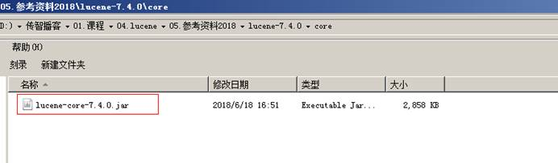

lucene-analyzers-common-7.4.0.jar

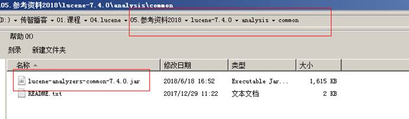

# 入门

## 5.1  需求

实现一个文件的搜索功能，通过关键字搜索文件，凡是文件名或文件内容包括关键字的文件都需要找出来。还可以根据中文词语进行查询，并且需要支持多个条件查询。

本案例中的原始内容就是磁盘上的文件，如下图：

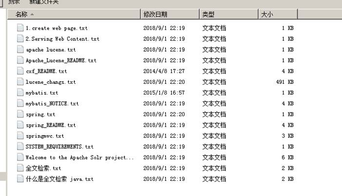

 

## 5.2  创建索引

### 5.2.1 实现步骤

第一步：创建一个java工程，并导入jar包。

第二步：创建一个indexwriter对象。

​		1）指定索引库的存放位置Directory对象

​		2）指定一个IndexWriterConfig对象。

第二步：创建document对象。

第三步：创建field对象，将field添加到document对象中。

第四步：使用indexwriter对象将document对象写入索引库，此过程进行索引创建。并将索引和document对象写入索引库。

第五步：关闭IndexWriter对象。

### 5.2.2 代码实现

```java
//创建索引
@Test
public void createIndex() throws Exception {
	//指定索引库存放的路径
	//D:\temp\index
	Directory directory = FSDirectory.open(new File("D:\\temp\\index").toPath());
	//索引库还可以存放到内存中
	//Directory directory = new RAMDirectory();
	//创建 indexwriterCofig 对象
	IndexWriterConfig config = new IndexWriterConfig();
	//创建 indexwriter 对象
	IndexWriter indexWriter = new IndexWriter(directory, config);
	//原始文档的路径
	File dir = new File("D:\\temp\\searchsource");
	for (File f : dir.listFiles()) {
		//文件名
		String fileName = f.getName();
		//文件内容
		String fileContent = FileUtils.readFileToString(f);
		//文件路径
		String filePath = f.getPath();
		//文件的大小
		long fileSize = FileUtils.sizeOf(f);
		//创建文件名域
		//第一个参数：域的名称
		//第二个参数：域的内容
		//第三个参数：是否存储
		Field fileNameField = new TextField("filename", fileName, Field.Store.YES);
		//文件内容域
		Field fileContentField = new TextField("content", fileContent, Field.Store.YES);
		//文件路径域（不分析、不索引、只存储）
		Field filePathField = new TextField("path", filePath, Field.Store.YES);
		//文件大小域
		Field fileSizeField = new TextField("size", fileSize + "", Field.Store.YES);
		//创建 document 对象
		Document document = new Document();
		document.add(fileNameField);
		document.add(fileContentField);
		document.add(filePathField);
		document.add(fileSizeField);
		//创建索引，并写入索引库
		indexWriter.addDocument(document);
	}
	//关闭 indexwriter
	indexWriter.close();
}   
```

 

### 5.2.3 使用Luke工具查看索引文件

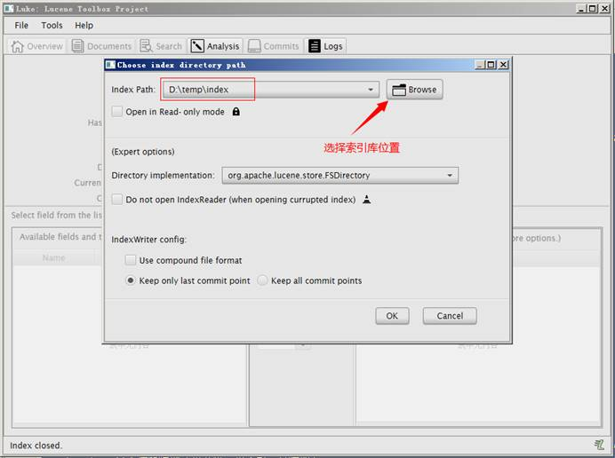

我们使用的luke的版本是luke-7.4.0，跟lucene的版本对应的。可以打开7.4.0版本的lucene创建的索引库。需要注意的是此版本的Luke是jdk9编译的，所以要想运行此工具还需要jdk9才可以。

 

 

## 5.3  查询索引

### 5.3.1 实现步骤

第一步：创建一个Directory对象，也就是索引库存放的位置。

第二步：创建一个indexReader对象，需要指定Directory对象。

第三步：创建一个indexsearcher对象，需要指定IndexReader对象

第四步：创建一个TermQuery对象，指定查询的域和查询的关键词。

第五步：执行查询。

第六步：返回查询结果。遍历查询结果并输出。

第七步：关闭IndexReader对象

 

### 5.3.2 代码实现

```java
	//查询索引库
	@Test
	public void searchIndex() throws Exception {
		//指定索引库存放的路径
		//D:\temp\index
		Directory directory = FSDirectory.open(new File("D:\\temp\\index").toPath());
		//创建 indexReader 对象
		IndexReader indexReader = DirectoryReader.open(directory);
		//创建 indexsearcher 对象
		IndexSearcher indexSearcher = new IndexSearcher(indexReader);
		//创建查询
		Query query = new TermQuery(new Term("filename", "apache"));
		//执行查询
		//第一个参数是查询对象，第二个参数是查询结果返回的最大值
		TopDocs topDocs = indexSearcher.search(query, 10);
		//查询结果的总条数
		System.out.println("查询结果的总条数： " + topDocs.totalHits);
		//遍历查询结果
		//topDocs.scoreDocs 存储了 document 对象的 id
		for (ScoreDoc scoreDoc : topDocs.scoreDocs) {
			//scoreDoc.doc 属性就是 document 对象的 id
			//根据 document 的 id 找到 document 对象
			Document document = indexSearcher.doc(scoreDoc.doc);
			System.out.println(document.get("filename"));
			//System.out.println(document.get("content"));
			System.out.println(document.get("path"));
			System.out.println(document.get("size"));
			System.out.println("-------------------------");
		}
		//关闭 indexreader 对象
		indexReader.close();
	}
```

# 分析器

## 6.1  分析器的分词效果

```java
//查看标准分析器的分词效果

	@Test
	public void testTokenStream() throws Exception {
		//创建一个标准分析器对象
		Analyzer analyzer = new StandardAnalyzer();
		//获得 tokenStream 对象
		//第一个参数：域名，可以随便给一个
		//第二个参数：要分析的文本内容
		TokenStream tokenStream = analyzer.tokenStream("test", "The Spring Framework provides a comprehensive
				programming and configuration model.");
				//添加一个引用，可以获得每个关键词
				CharTermAttribute charTermAttribute = tokenStream.addAttribute(CharTermAttribute.class);
		//添加一个偏移量的引用，记录了关键词的开始位置以及结束位置
		OffsetAttribute offsetAttribute = tokenStream.addAttribute(OffsetAttribute.class);
		//将指针调整到列表的头部
		tokenStream.reset();
		//遍历关键词列表，通过 incrementToken 方法判断列表是否结束
		while (tokenStream.incrementToken()) {
			//关键词的起始位置
			System.out.println("start->" + offsetAttribute.startOffset());
			//取关键词
			System.out.println(charTermAttribute);
			//结束位置
			System.out.println("end->" + offsetAttribute.endOffset());
		}
		tokenStream.close();
	}
```

 

## 6.2  中文分析器

### 6.2.1 Lucene自带中文分词器

-  StandardAnalyzer：

  单字分词：就是按照中文一个字一个字地进行分词。如：“我爱中国”，效果：“我”、“爱”、“中”、“国”。

- SmartChineseAnalyzer

  对中文支持较好，但扩展性差，扩展词库，禁用词库和同义词库等不好处理

### 6.2.2 IKAnalyzer

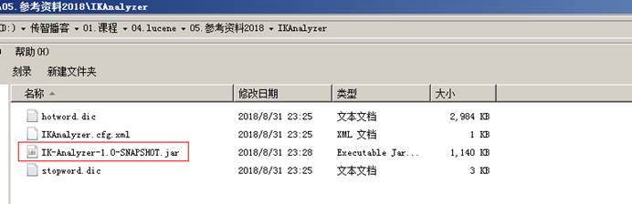

使用方法：

第一步：把jar包添加到工程中

第二步：把配置文件和扩展词典和停用词词典添加到classpath下

 

注意：hotword.dic和ext_stopword.dic文件的格式为UTF-8，注意是无BOM 的UTF-8 编码。

也就是说禁止使用windows记事本编辑扩展词典文件

 

使用EditPlus.exe保存为无BOM 的UTF-8 编码格式，如下图：

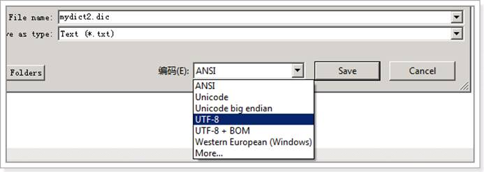

## 6.3  使用自定义分析器

```java
@Test
public void addDocument() throws Exception {
//索引库存放路径
Directory directory = FSDirectory.open(new File("D:\\temp\\index").toPath());
IndexWriterConfig config = new IndexWriterConfig(new IKAnalyzer());
//创建一个 indexwriter 对象
IndexWriter indexWriter = new IndexWriter(directory, config);
//...
}
```

 

 

# 索引库的维护

## 7.1  索引库的添加

### 7.1.1 Field域的属性

**是否分析**：是否对域的内容进行分词处理。前提是我们要对域的内容进行查询。

**是否索引**：将Field分析后的词或整个Field值进行索引，只有索引方可搜索到。

​					比如：商品名称、商品简介分析后进行索引，订单号、身份证号不用分析但也要索引，这些将来都要作为查询条件。

**是否存储**：将Field值存储在文档中，存储在文档中的Field才可以从Document中获取

​					比如：商品名称、订单号，凡是将来要从Document中获取的Field都要存储。

 

**是否存储的标准：是否要将内容展示给用户**

| Field类                                                      | 数据类型               | Analyzed  是否分析 | Indexed  是否索引 | Stored  是否存储 | 说明                                                         |
| ------------------------------------------------------------ | ---------------------- | ------------------ | ----------------- | ---------------- | ------------------------------------------------------------ |
| StringField(FieldName,  FieldValue,Store.YES))               | 字符串                 | N                  | Y                 | Y或N             | 这个Field用来构建一个字符串Field，但是不会进行分析，会将整个串存储在索引中，比如(订单号,姓名等)  是否存储在文档中用Store.YES或Store.NO决定 |
| LongPoint(String name, long... point)                        | Long型                 | Y                  | Y                 | N                | 可以使用LongPoint、IntPoint等类型存储数值类型的数据。让数值类型可以进行索引。但是不能存储数据，如果想存储数据还需要使用StoredField。 |
| StoredField(FieldName, FieldValue)                           | 重载方法，支持多种类型 | N                  | N                 | Y                | 这个Field用来构建不同类型Field  不分析，不索引，但要Field存储在文档中 |
| TextField(FieldName, FieldValue, Store.NO)  或  TextField(FieldName, reader) | 字符串  或  流         | Y                  | Y                 | Y或N             | 如果是一个Reader, lucene猜测内容比较多,会采用Unstored的策略. |

 

 

### 7.1.2 添加文档代码实现

```java
//添加索引
@Test
public void addDocument() throws Exception {
    //索引库存放路径
    Directory directory = FSDirectory.open(new File("D:\\temp\\index").toPath());
    IndexWriterConfig config = new IndexWriterConfig(new IKAnalyzer());
    //创建一个 indexwriter 对象
    IndexWriter indexWriter = new IndexWriter(directory, config);
    //创建一个 Document 对象
    Document document = new Document();
    //向 document 对象中添加域。
    //不同的 document 可以有不同的域，同一个 document 可以有相同的域。
    document.add(new TextField("filename", "新添加的文档", Field.Store.YES));
    document.add(new TextField("content", "新添加的文档的内容", Field.Store.NO));
    //LongPoint 创建索引
    document.add(new LongPoint("size", 1000l));
    //StoreField 存储数据
    document.add(new StoredField("size", 1000l));
    //不需要创建索引的就使用 StoreField 存储
    document.add(new StoredField("path", "d:/temp/1.txt"));
    //添加文档到索引库
    indexWriter.addDocument(document);
    //关闭 indexwriter
    indexWriter.close();
}
```

## 7.2  索引库删除

### 7.2.1 删除全部

```java
//删除全部索引
@Test
public void deleteAllIndex() throws Exception {
    IndexWriter indexWriter = getIndexWriter();
    //删除全部索引
    indexWriter.deleteAll();
    //关闭 indexwriter
    indexWriter.close()
}
```

 说明：将索引目录的索引信息全部删除，直接彻底删除，无法恢复。

**此方法慎用！**

### 7.2.2 指定查询条件删除

```java
//根据查询条件删除索引
@Test
public void deleteIndexByQuery() throws Exception {
    IndexWriter indexWriter = getIndexWriter();
    //创建一个查询条件
    Query query = new TermQuery(new Term("filename", "apache"));
    //根据查询条件删除
    indexWriter.deleteDocuments(query);
    //关闭 indexwriter
    indexWriter.close();
}
```

 

## 7.3  索引库的修改

原理就是先删除后添加。

```java
//修改索引库
@Test
public void updateIndex() throws Exception {
    IndexWriter indexWriter = getIndexWriter();
    //创建一个 Document 对象
    Document document = new Document();
    //向 document 对象中添加域。
    //不同的 document 可以有不同的域，同一个 document 可以有相同的域。
    document.add(new TextField("filename", "要更新的文档", Field.Store.YES));
    document.add(new TextField("content", " Lucene 简介 Lucene 是一个基于 Java 的全文信息检索工具包," + "它不是一个完整的搜索应用程序,而是为你的应用程序提供索引和搜索功能。 ",
    Field.Store.YES));
    indexWriter.updateDocument(new Term("content", "java"), document);
    //关闭 indexWriter
    indexWriter.close();
}
```

# 索引库查询

​     对要搜索的信息创建Query查询对象，Lucene会根据Query查询对象生成最终的查询语法，类似关系数据库Sql语法一样Lucene也有自己的查询语法，比如：“name:lucene”表示查询Field的name为“lucene”的文档信息。

​     可通过两种方法创建查询对象：

​     1）使用Lucene提供Query子类

​     2）使用QueryParse解析查询表达式

## 8.1    TermQuery

TermQuery，通过项查询，TermQuery不使用分析器所以建议匹配不分词的Field域查询，比如订单号、分类ID号等。

指定要查询的域和要查询的关键词。

```java
//使用 Termquery 查询
@Test
public void testTermQuery() throws Exception {
    Directory directory = FSDirectory.open(new File("D:\\temp\\index").toPath());
    IndexReader indexReader = DirectoryReader.open(directory);
    IndexSearcher indexSearcher = new IndexSearcher(indexReader);
    //创建查询对象
    Query query = new TermQuery(new Term("content", "lucene"));
    //执行查询
    TopDocs topDocs = indexSearcher.search(query, 10);
    //共查询到的 document 个数
    System.out.println("查询结果总数量： " + topDocs.totalHits);
    //遍历查询结果
    for (ScoreDoc scoreDoc : topDocs.scoreDocs) {
    Document document = indexSearcher.doc(scoreDoc.doc);
    System.out.println(document.get("filename"));
    //System.out.println(document.get("content"));
    System.out.println(document.get("path"));
    System.out.println(document.get("size"));
    }
    //关闭 indexreader
    indexSearcher.getIndexReader().close();
}
```

## 8.2  数值范围查询

```java
@Test
public void testRangeQuery() throws Exception {
    IndexSearcher indexSearcher = getIndexSearcher();
    Query query = LongPoint.newRangeQuery("size", 0l, 10000l);
    printResult(query, indexSearcher);
}
```

 

## 8.3  使用queryparser查询

通过QueryParser也可以创建Query，QueryParser提供一个Parse方法，此方法可以直接根据查询语法来查询。Query对象执行的查询语法可通过System.out.println(query);查询。

需要使用到分析器。建议创建索引时使用的分析器和查询索引时使用的分析器要一致。

需要加入queryParser依赖的jar包。

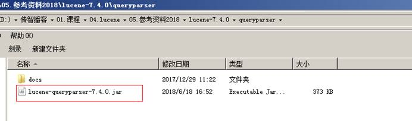

```java
@Test
public void testQueryParser() throws Exception {
IndexSearcher indexSearcher = getIndexSearcher();
//创建 queryparser 对象
//第一个参数默认搜索的域
//第二个参数就是分析器对象
QueryParser queryParser = new QueryParser("content", new IKAnalyzer());
Query query = queryParser.parse("Lucene 是 java 开发的");
//执行查询
printResult(query, indexSearcher);
}
private void printResult(Query query, IndexSearcher indexSearcher) throws Exception {
//执行查询
TopDocs topDocs = indexSearcher.search(query, 10);
//共查询到的 document 个数
System.out.println("查询结果总数量： " + topDocs.totalHits);
//遍历查询结果
for (ScoreDoc scoreDoc : topDocs.scoreDocs) {
Document document = indexSearcher.doc(scoreDoc.doc);
System.out.println(document.get("filename"));
//System.out.println(document.get("content"));
System.out.println(document.get("path"));
System.out.println(document.get("size"));
}
//关闭 indexreader
indexSearcher.getIndexReader().close();
}
```

 