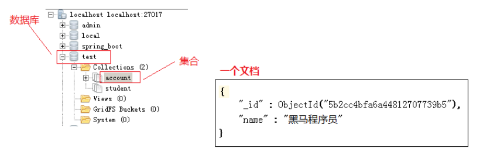

# 介绍

官方地址：https://www.mongodb.com/  

MongoDB是一个文档数据库，提供好的性能，领先的非关系型数据库。采用BSON存储文档数据。

MongoDB用c++编写的,流行的开源数据库MySQL也是用C++开发的。

在mongodb中是通过数据库、集合、文档的方式来管理数据，下边是mongodb与关系数据库的一些概念对比：

| SQL术语/概念 | MongoDB术语/概念        | 解释/说明                                 |
| ------------ | ----------------------- | ----------------------------------------- |
| database     | database                | 数据库                                    |
| table        | collection              | 数据库表/集合                             |
| row          | document                | 数据记录行/文档                           |
| column       | field                   | 数据字段/域                               |
| index        | index                   | 索引                                      |
| table joins  | 表连接（MongoDB不支持） |                                           |
| primary key  | primary key             | 主键,MongoDB自动在每个集合中添加_id的主键 |

1、一个mongodb实例可以创建多个数据库
2、一个数据库可以创建多个集合
3、一个集合可以包括多个文档。  

#### 可替代产品

- Cassandra
- Redis
- Riak
- CouchDB

#### 优势

- 面向文档的存储：以 JSON 格式的文档保存数据。
- 任何属性都可以建立索引。
- 复制以及高可扩展性。
- 自动分片。
- 丰富的查询功能。
- 快速的即时更新。
- 来自 MongoDB 的专业支持。
- 架构简单
- 没有复杂的连接
- 深度查询能力,MongoDB支持动态查询。
- 容易调试
- 容易扩展
- 不需要转化/映射应用对象到数据库对象
- 使用内部内存作为存储工作区,以便更快的存取数据。

#### 文档

文档由一组key value组成。文档是动态模式,这意味着同一集合里的文档不需要有相同的字段和结构。在关系型数据库中table中的每一条记录相当于MongoDB中的一个文档。

**key-value表示**

#### 使用场景

- 大数据
- 内容管理系统
- 移动端Apps
- 数据管理

# 使用

### mongod

mongod是处理MongoDB系统的主要进程。它处理数据请求，管理数据存储，和执行后台管理操作。当我们运行mongod命令意味着正在启动MongoDB进程,并且在后台运行。

- 传递数据库存储路径，默认是"/data/db"
- 端口号 默认是 "27017"

### mongo

它是一个命令行工具用于连接一个特定的mongod实例。当我们没有带参数运行mongo命令它将使用默认的端口号和localhost连接

### GridFS

GridFS是一种将大型文件存储在MongoDB中的文件规范。使用GridFS可以将大文件分隔成多个小文档存放，这样我们能够有效的保存大文档，而且解决了BSON对象有限制的问题。

# 分片

分片是将数据水平切分到不同的物理节点。当应用数据越来越大的时候，数据量也会越来越大。当数据量增长时，单台机器有可能无法存储数据或可接受的读取写入吞吐量。利用分片技术可以添加更多的机器来应对数据量增加以及读写操作的要求。

# 命名空间

> 待解决

MongoDB内部有预分配空间的机制，每个预分配的文件都用0进行填充。

数据文件每新分配一次，它的大小都是上一个数据文件大小的2倍，每个数据文件最大2G。

MongoDB每个集合和每个索引都对应一个命名空间，这些命名空间的元数据集中在16M的*.ns文件中，平均每个命名占用约 628 字节，也即整个数据库的命名空间的上限约为24000。

如果每个集合有一个索引（比如默认的_id索引），那么最多可以创建12000个集合。如果索引数更多，则可创建的集合数就更少了。同时，如果集合数太多，一些操作也会变慢。

要建立更多的集合的话，MongoDB 也是支持的，只需要在启动时加上“--nssize”参数，这样对应数据库的命名空间文件就可以变得更大以便保存更多的命名。这个命名空间文件（.ns文件）最大可以为 2G。

每个命名空间对应的盘区不一定是连续的。与数据文件增长相同，每个命名空间对应的盘区大小都是随分配次数不断增长的。目的是为了平衡命名空间浪费的空间与保持一个命名空间数据的连续性。

需要注意的一个命名空间$freelist，这个命名空间用于记录不再使用的盘区（被删除的Collection或索引）。每当命名空间需要分配新盘区时，会先查看$freelist是否有大小合适的盘区可以使用，如果有就回收空闲的磁盘空间。