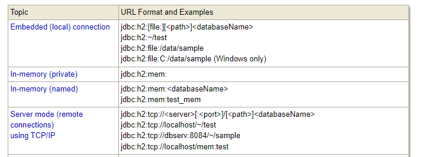
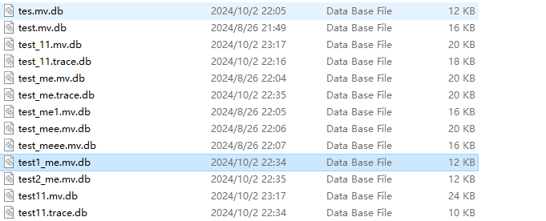
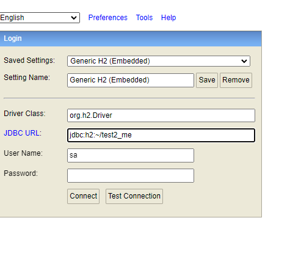

两种连接模式。本地嵌入和远程tcp，两者都可以连文件或者内存。一般来说本地内存就够了。tcp用不上，不持久化数据。

如果是文件，那么会有文件

数据库不必预先启动，是一个静态变量，driver conect的时候就会自动获取。

远程tcp需要预先启动tcp server来接收。

Server.*main*()启动tcp server，console，pg serve， 还会尝试打开浏览器。

springboot集成用的是h2提供的servlet，也是console的位置。

console就是一个ui客户端，方便使用。

idea也有h2的连接客户端。

结合代码和文档看。

# 参考连接

http://www.h2database.com/html/advanced.html

https://www.cnblogs.com/cnjavahome/p/8995650.html

https://blog.csdn.net/zhoche2008/article/details/7017767

https://juejin.cn/post/6978669186583101448#heading-18

https://blog.csdn.net/qq_45297578/article/details/116272514?spm=1001.2101.3001.6650.1&utm_medium=distribute.pc_relevant.none-task-blog-2%7Edefault%7ECTRLIST%7ERate-1-116272514-blog-122060058.235%5Ev27%5Epc_relevant_default_base1&depth_1-utm_source=distribute.pc_relevant.none-task-blog-2%7Edefault%7ECTRLIST%7ERate-1-116272514-blog-122060058.235%5Ev27%5Epc_relevant_default_base1&utm_relevant_index=2

https://zhuanlan.zhihu.com/p/509877891

https://segmentfault.com/a/1190000020636564

https://www.cnblogs.com/Eastry/p/13795926.html | 无聊的笔记：之三（使用H2内嵌式数据库） - BobCheng - 博客园
https://blog.csdn.net/u013161278/article/details/110001461 | 【学习总结】H2数据库_navicat h2-CSDN博客
https://www.cnblogs.com/cnjavahome/p/8995650.html | H2 数据库使用简介 - 沐小悠 - 博客园
https://blog.csdn.net/qq_45297578/article/details/116272514?spm=1001.2101.3001.6650.1&utm_medium=distribute.pc_relevant.none-task-blog-2~default~CTRLIST~Rate-1-116272514-blog-122060058.235^v27^pc_relevant_default_base1&depth_1-utm_source=distribute.pc_relevant.none-task-blog-2~default~CTRLIST~Rate-1-116272514-blog-122060058.235^v27^pc_relevant_default_base1&utm_relevant_index=2 | 【SpringBoot新手篇】SpringBoot 集成H2数据库_h2 springboot-CSDN博客
https://juejin.cn/post/6978669186583101448#heading-18 | 嵌入式数据库H2的简单介绍你们在开发中是否遇到过这样的场景，需要数据存储，但是又没有必要部署专门的数据存储服务，这是可以 - 掘金
https://www.h2database.com/html/quickstart.html#h2_console | Quickstart
https://www.h2database.com/html/tutorial.html#using_server | Tutorial
https://www.h2database.com/html/features.html#in_memory_databases | Features
https://www.imooc.com/wenda/detail/691622 | 如何在 Spring Boot 中启用 H2 数据库服务器模式_慕课猿问
https://stackoverflow.com/questions/37068808/how-to-start-h2-tcp-server-on-spring-boot-application-startup | java - How to start H2 TCP server on Spring Boot application startup? - Stack Overflow

# 代码

> https://github.com/carl-don-it/springboot-h2-test-demo
>
> https://github.com/carl-don-it/h2-demo

