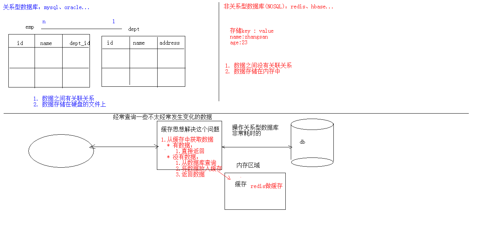

# [关系型数据库的本质是什么？mongodb为什么不是关系型数据库？](https://www.zhihu.com/question/465549093)

# 介绍

NoSQL = non SQL
NoSQL = non relational
NoSQL = not only SQL

​	NoSQL(NoSQL = Not Only SQL)，意即“不仅仅是SQL”，是一项全新的数据库理念，泛指非关系型的数据库。
​	随着互联网web2.0网站的兴起，传统的关系数据库在应付web2.0网站，特别是超大规模和高并发的SNS类型的web2.0纯动态网站已经显得力不从心，暴露了很多难以克服的问题，而非关系型的数据库则由于其本身的特点得到了非常迅速的发展。NoSQL数据库的产生就是为了解决大规模数据集合多重数据种类带来的挑战，尤其是大数据应用难题。

# NOSQL和关系型数据库

## 优点

1. 成本：nosql数据库简单易部署，基本都是开源软件，不需要像使用oracle那样花费大量成本购买使用，相比关系型数据库价格便宜。
2. 查询速度：nosql数据库将数据存储于缓存之中，关系型数据库将数据存储在硬盘中，自然查询速度远不及nosql数据库。
3. 存储数据的格式：nosql的存储格式是key,value形式、文档形式、图片形式等等，所以可以存储基础类型以及对象或者是集合等各种格式，而数据库则只支持基础类型。
4. 扩展性：关系型数据库有类似join这样的多表查询机制的限制导致扩展很艰难。

## 缺点

1. 维护的工具和资料有限，因为nosql是属于新的技术，不能和关系型数据库10几年的技术同日而语。
2. 不提供对sql的支持，如果不支持sql这样的工业标准，将产生一定用户的学习和使用成本。
3. 不提供关系型数据库对事务的处理。
4. 一致性（consistency）

## 非关系型数据库的优势：

1. 性能NOSQL是基于键值对的，可以想象成表中的主键和值的对应关系，而且**不需要经过SQL层的解析**，所以性能非常高。
2. 可扩展性同样也是因为基于键值对，数据之间没有耦合性，所以非常容易水平扩展。

## 关系型数据库的优势

1. 复杂查询可以用SQL语句方便的在一个表以及多个表之间做非常复杂的数据查询。
2. 事务支持使得对于安全性能很高的数据访问要求得以实现。对于这两类数据库，对方的优势就是自己的弱势，反之亦然。

## 总结

​		关系型数据库与NoSQL数据库并非对立而是互补的关系，即通常情况下使用关系型数据库，在适合使用NoSQL的时候使用NoSQL数据库，
​		让NoSQL数据库对关系型数据库的不足进行弥补。
​		一般会将数据存储在关系型数据库中，在nosql数据库中备份存储关系型数据库的数据

	

# 主流的NOSQL产品

## 键值(Key-Value)存储数据库

​			相关产品： Tokyo Cabinet/Tyrant、Redis、Voldemort、Berkeley DB
​			典型应用： 内容缓存，主要用于处理大量数据的高访问负载。 
​			数据模型： 一系列键值对
​			优势： 快速查询
​			劣势： 存储的数据缺少结构化

## 列存储数据库

​			相关产品：Cassandra, HBase, Riak
​			典型应用：分布式的文件系统
​			数据模型：以列簇式存储，将同一列数据存在一起
​			优势：查找速度快，可扩展性强，更容易进行分布式扩展
​			劣势：功能相对局限

## 文档型数据库

​			相关产品：CouchDB、MongoDB
​			典型应用：Web应用（与Key-Value类似，Value是结构化的）
​			数据模型： 一系列键值对
​			优势：数据结构要求不严格
​			劣势： 查询性能不高，而且缺乏统一的查询语法

## 图形(Graph)数据库

​			相关数据库：Neo4J、InfoGrid、Infinite Graph
​			典型应用：社交网络
​			数据模型：图结构
​			优势：利用图结构相关算法。
​			劣势：需要对整个图做计算才能得出结果，不容易做分布式的集群方案。

# 字段设计

我想你问的还是数据建模中实体拆分的问题。比如说博客这个实体是否包含评论？还是博客和评论分别定义成两个实体？这类问题考虑的方向是：评论是否可以脱离博客单独存在？如果是，则分开定义两个实体；否则则定义成一个实体。两个实体的情况下，需要定义relationship 来关联。

使用字典

 

一般在产品设计上数据量肯定不太大的字段为了好查询和省事务就不用拆分。大到需要独立维护就得拆分了。