[ Darkhouse](https://darkhouse.com.cn/blog/#)

- [博客列表](https://darkhouse.com.cn/blog/list)
- [关于](https://darkhouse.com.cn/blog/about)

## NoSQL数据库模型7

*黑屋在[“关系型数据库统治”](https://darkhouse.com.cn/blog/1)中提到在关系型数据库之前，层级数据库和网状数据库适应了当时硬件的性能，成为了大型数据库系统的主流。 有趣的是老一代数据库要求应用程序负责数据的获取逻辑，这和当前流行的NoSQL数据库如出一辙。当时的开发者必须非常了解数据存储底层的原理， 由他们决定程序该调用哪些索引，如何以最优的方式获取数据。可是这样又产生另一个大问题：一旦数据物理模型发生调整，往往会演变成一次灾难。 业务逻辑和数据访问逻辑被紧紧的耦合在一起，你根本无法预测你在存储设备上的一次轻微调整（例如扩充一个硬盘）会对上层程序带来多大的影响。 关系型数据库正是解决了应用程序和数据访问方式的耦合问题，才确立了自己的统治地位。*

2

*然而关系型数据库解决这个问题主要是在单机环境中。随着互联网的兴起，单台数据库服务器已经无法满足大数据量、大吞吐量以及跨地理区域等业务要求。 那些标准化的关系型数据产品无法在可控的成本范围内提供适合的方案，于是一些互联网公司开始研究适合自己的数据存储解决方案。 它们对关系型数据库进行重新解构和裁剪，并吸取以往的一些非关系型数据库经验，形成了专门应对互联网分布式架构下的数据存储方案。 这类数据库有着共同的特征：不支持SQL，但具有灵活的扩展性，因此被统一归类为NoSQL数据库。 介绍NoSQL的文章不计其数，然而大多是围绕其性能、扩展性以及可用性等方面。本文将从数据模型角度描述当前流行的几种NoSQL数据库类型， 并将它们同关系模型一一对比。*

1

*在这之前，黑屋先要介绍一些重要的概念，这些概念能帮助我们更深入的了解数据库的内在机制。黑屋认为不管外在的形式如何多样化， 但凡能抓住本质性的东西，一切将变得格外清晰。数据库的发展一直是伴随着计算机硬件的发展，然而很多逻辑上的理念到现在为止也没有发生太大变化。 关系型模型还是有着不可动摇的地位，很多当前流行的分布式数据模型也是重复着数据库早期的一些理念，只是在更大的互联网背景下实践。 因此在我们进步的同时，时不时的回顾历史，弄明白为何发展成现在这样子，思考和归纳一些本质性的东西，更有助于看清以后的方向。*

### 计算机如何存储数据3

黑屋一直试图从数据模型的角度来阐述数据库的一些本质，并尽量避免介绍工程细节，例如：如何保证数据一致性，如何实现并发性，数据库日志是如何记录和回滚， 如何建立索引，分布式数据库实现等等。这些工程细节确实是数据库非常重要的部分，然而并不涉及其本质。本质的东西往往是简单，正是由于太多的细节把其淹没， 使得我们忽略了它。对于初学者来说，实在太容易迷失在这些工程实现细节中了。**黑屋认为数据模型是数据库最重要的本质，所有其他东西都是围绕着它来设计和运行的。** 而数据模型又依赖于计算机硬件系统，因此在开始解释其他东西之前，我们得先弄明白一个最基础的问题：计算机是如何存储数据的？或者说数据的物理模型长什么样？

如果你在思考“计算机是如何存储数据”这个问题的时候？第一个想到的是操作系统中的文件夹和文件，那么你和我想的是一致的。 文件系统才是我们读取、新建、删除数据最常用的工具。实际上，文件系统和数据库系统本质上是一样的，你可以把文件系统理解为一个特殊的数据库系统， 或者把数据库系统理解为一个特殊的文件系统。到底谁包含谁仅仅看你站在哪个阵营里：操作系统or数据库系统，但这并不妨碍我们对这个问题的理解。 由于现在很多数据库系统都是直接建立在文件系统之上，那么我们还是以文件系统来说明这个问题。

1

抛开复杂的文件路径以及权限控制，一个文件系统最基本的能力是识别哪些数据是属于一个文件的。最直观的想法就是把属于一个文件的数据存放在硬盘上一块连续的区域， 然后记录这个文件在硬盘的起始位置和结束位置就可以了。第二个文件就从第一个文件结束位置的后一位开始，依次类推。现在问题来了，如果我修改了第一个文件， 使得它变大了，那么从第二个文件开始，所有的后续文件都要向后移，这意味着整块硬盘的数据都要重写。但我们知道系统肯定不会这么做， 因为经验告诉我们，保存一个文件速度很快。这是因为文件系统一开始就给我们做了一定的规划，主要是划分了好多相同大小的连续区域， 规定每个单元区域称为“块”（block），其大小为4KB，每个块在物理设备上的具体位置信息被记录在引导区，这些位置信息如果是机械硬盘则包括盘号，磁道和扇区。 我们将这个规划过程叫做文件系统的“格式化”。

现在新建一个文件就以“块”为最小单位保存，这也就是说哪怕建立一个空文件，它也要占去4KB的存储空间。而如果一个文件大小超过4KB， 文件系统会关联多个4KB的块来容纳这个文件，并尽量做到这些“块”在物理位置上是连续的。这里只能说“尽量”，因为一旦文件大小发生变动， 文件系统只能在其他地方找到合适的“块”来容纳多出的部分，而那些被判断为没有发生变动的“块”就不必再被重写了。一旦发生这样的情形， 你会发现读取一个文件的速度变慢了，因为这个文件的内容被散布在硬盘的各个角落，硬盘必须驱动磁臂和磁头找到这些位置读取它们， 这便是随机访问（Random Access）；与之对应的叫顺序访问（Sequential Access），后者的读取速度通常是前者的100倍。 现在也许你已经明白“硬盘碎片整理”的意思了，没错，就是将属于一个文件的多个“块”放在连续的位置，这样就能减少随机访问的次数。

> 有兴趣的读者可以阅读
>
> 此文
>
> 了解更多关于设计一个文件系统的细节。

### 偏移量和指向

这里我想总结一下文件系统组织数据的核心思想：偏移量(Offset)和指向（Pointer）。如果数据是连续存放的，通过偏移量的方式可以很容易定位信息。 你可以以不同的层面去理解“连续”，最小的层面是字位（Bit），规定每8个连续的字位为一个字节（Byte），每4个连续的字节可表示一个整数； 高一点的层面是文件系统的块或者就是一个文件——以元数据来描述这个文件的结构模式，并通过偏移量来解析这个文件中所包含的信息。 如果数据无法连续的保存在一起，那么你可以通过“指向”来关联相关的数据。当然你也可以从多个层面去理解指向，最容易理解的是宏观层面上打开一个文件的快捷方式， 或者HTML文档中的超链接，它们都是以“指向”的方式来关联信息的。在微观层面上，指向往往是一些物理地址，例如硬盘地址，内存地址，或者网络地址等。 在我们接下来的内容中，你会处处体会到计算机系统中这种分形几何现象，即同一种逻辑或构造在各个层面上反复出现。因此当你在文件系统层面理解“偏移量”和“指向”， 你就能轻松应对更高层面上数据库系统和应用系统的架构逻辑。下面我将就这两种数据关联方式分别作简单介绍。

图1.自然界中的分形几何

1

#### 偏移量

如果相关数据连续保存在一起，那么我们可以用偏移量来定位具体信息。例如存储一天的任务清单，每个任务都以具体的时间点作为开始， 后面是具体要做的任务，每个任务的描述不能超过50个字节；下一个任务紧接着前一个任务，这样我们就能得到如图2中的数据结构。

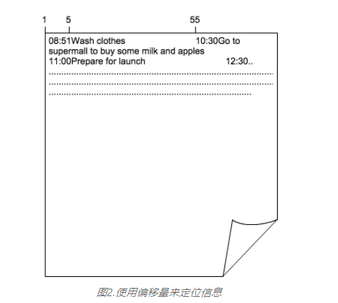

图2.使用偏移量来定位信息

现在我们要读取第一个任务的信息，它处于这个文件的开始位置，那么开始位置的值为1， 一直到第5位是任务的时间信息；从第6位开始到第55位则是任务1的具体内容。 每个任务信息的长度固定都是55（不满则以空补充）。因此我们很容易确定任务2的开始位置是56，进而可以推断第n个任务的起始位置为(n-1)*55+1，这就是解读这个文件的模式（Schema）。 所以偏移量可以理解为一个包含数据起始位置和长度信息的二元组：*（起始位置，长度）*。只要将相关数据紧挨在一起，并约定每个数据段的长度， 我们便可以通过偏移量来定位具体的信息。

1

也许你会问，为什么不用分隔符来区分不同数据段信息呢？这样我们还可以节省一些因长度不满所造成的空间浪费。 例如针对上面的例子，我们选择特殊的分隔符，用“|”分割同一行的不同字段，用“#"分割不同的行， 这样任务清单的存储模型变成了图3的样子。这当然是没有问题的，实际上你还可以使用更通用的数据格式协议来定义数据模式，例如XML或JSON等。 但分隔符本质上还是通过确定数据段的起始位置和结束位置来定位信息，因此大可把它们同偏移量归为同一类数据关联方式。 值得说明的，偏移量相比于分隔符具有更高的计算机执行效率，你因此需要在时间和空间上权衡到底选用哪种方式。

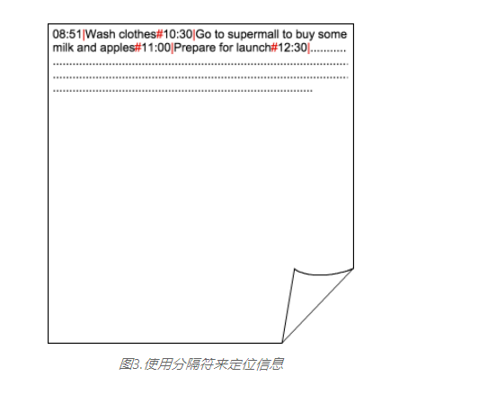

图3.使用分隔符来定位信息

#### 指向

如果数据无法保存在一个连续的区域内，那么我们需要通过指向来关联这些信息。还是任务清单的例子，假如有一天我的任务实在太多了，以至于一个4KB的块容纳不下， 那么我只能将多出来的任务存放在另一个4KB大小的块内。但我必须将这两个块通过某种方式关联起来，以表示这一天所有的任务都在这里了。 每个块都有一个编号作为其唯一性标识，并且系统能通过这个编号直接控制硬盘读取该块。我们现在可以通过如图4中的方式将块1和块2关联起来。

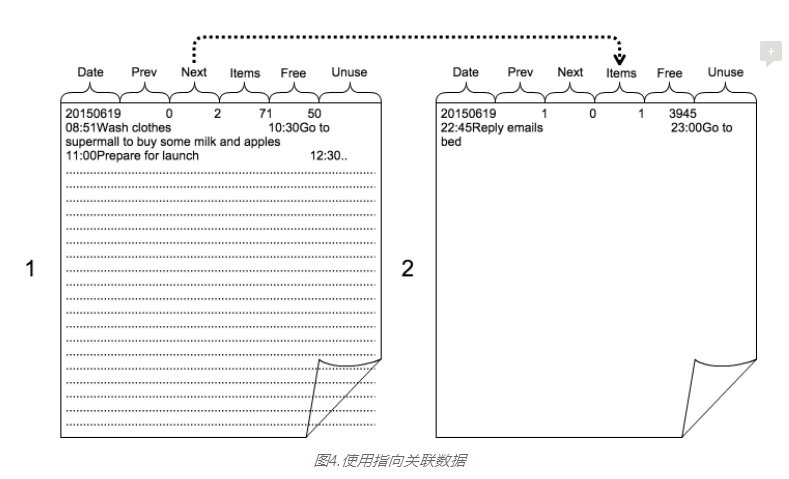

图4.使用指向关联数据

与图2不同的是，现在块的第一行多了一些额外的描述性信息，称之为元数据。“Date”表示当天的年、月、日，“Prev”表示前续的块号，“Next”表示后续的块号。 块1中Next对应的值是2，意味着还有相关信息保存在块2中，这样系统就知道还需读取块2中的数据以构成2015年6月19日那天的任务清单。 相反，块2中对应的Prev是块1，而Next为空，则表示块2是最后一个需要读取的块了。“Items”表示块中对应的条目数，块1中一共容纳了71条任务， 因此只剩下50字节的剩余空间，即“Free”对应的值。由于50字节已经无法容纳下一个任务了，因此我们只能将后面的任务保存到块2中。 这些元数据为系统有效组织数据提供了重要的依据，也许有些特性我们暂时没有想全面，因此预留了一部分“Unuse”的空间为将来之用。

块1中保存了块2的逻辑地址，系统再将逻辑地址映射到物理地址，最后读取了块2中的内容。这里实际上同时运用了偏移量和指向两种方式来关联数据。 对于那些存放在一个块中的任务来说，由于它们在物理层面上是连续的，因此它们本来就关联在一起；而对于那些无法在物理层面上连续存放的任务来说， 只能通过指向从逻辑层面上关联起来。

> 图2~图4中所描述的并不是我们直观上那种适合人类阅读的数据展现形式，而是底层数据存储的形式。 为了说明方便，图中用了明文的编码，更为准确的应该是类似01000101001001010101010101010....这样的二进制码。 计算机系统是通过偏移量来识别二进制编码，规定每8个字位为1个字节，一个字母占用1个字节，一个整数占4个字节。

### 规范化和聚合

偏移量和指向经常结合在一起使用的，在文件系统中，通过这两种方式来关联属于一个文件的数据。正如前面提到计算机系统是基于分形几何学的， 对应到数据库模型，有两种与之对应的更高层面的叫法：聚合(Aggregation)和规范化（Normalization）。 前者很容易顾名思义，将相关联的数据聚合在一起，通过偏移量来定位各个字段；而对后者的理解，需要回顾一下Codd在其 [论文](https://darkhouse.com.cn/blog/assets/docs/A_Relational_Model_of_Data_for_Large_Data_Banks.pdf)中对Normalization的描述。 简单的说，规范化是降低数据冗余的过程，一张规范化的二维表是指每行每列只能对应一个具有基本数据类型的值；而当遇到多值等复杂数据类型的时候， 需将其规范成多张简单二维表，并通过外码建立它们之间的关联。

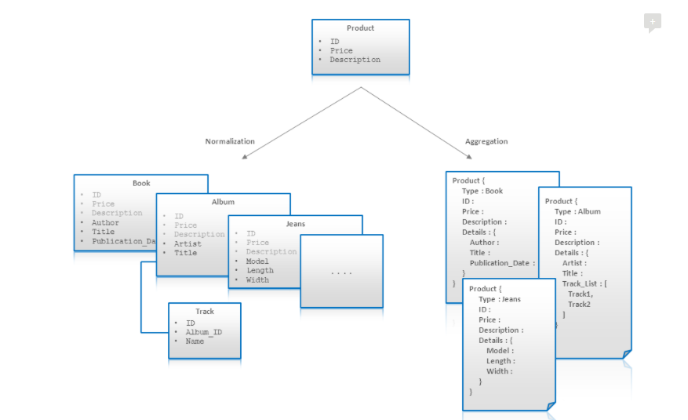

图5.规范化和聚合

图5描绘了分别用规划化和聚合两种方式对电商领域产品的实体建模。最初，我们可以说，所有的产品都有一个ID，价格，和描述。 接下来，我们发现不同类型的产品有不同的属性，如书本有作者而牛仔裤有尺寸。其次，实体中有的属性是一对一，而有的一对多，例如一个音乐专辑很多曲目。 我们很容易发现规范化就是“指向”高一级的表现形式，而聚合则对应的是“偏移量”。

**规范化要求我们尽可能打散信息，以便能降低数据的冗余度，提高数据操控的精确度；而聚合则希望我们能从整体上把握数据，因为粗粒度能提高数据的操作效率， 但却会产生大量的数据冗余。**数据库建模本质上需要考虑的就是如何在这两种方式间权衡，这很难用只言片语描述清楚。我们可以用物理学来作一个类比： 研究物理你既可以微观到量子理论，亦可宏观到天体宇宙学，两种方式都有各自的研究难度，最后你又隐隐约约觉得它们可能是相通的。 同样最严格的规范化是要把信息打碎到原子级别。何谓原子级别？对应到数据库模型层面可理解为一个实体所具有的一个属性，如果再对这个属性分解就没有信息价值了。 我们用销售订单来举例说明一下。

一个销售订单至少包含商品、客户、数量、金额、日期等属性，当然一定还有一个唯一性的订单号。原子级别的规范化要求我们对这些独立属性建立对应的表来存储。 这意味着我们得用5张表来存储这些信息，分别是：SalesOrderProduct，SalesOrderCustomer，SalesOrderQuantity，SalesOrderAmount，SalesOrderDate。 这5张表都是以订单号为主码。

图6.规范化后的销售订单相关表

如图6所示，彻底规范化的数据模型具有以下三个优势：

- 每个属性信息只需保存一次，因此没有必要考虑复杂耗时的数据同步问题。
- 每次改动只会影响需要变动的部分，如果将这些属性聚合成一行来保存，修改其中一个属性势必会影响其他属性的访问。
- 你可以灵活的调整数据模型，如果你需要为销售订单再增加一个属性，例如“销售税”，那么只需再新建一个表来保存这些信息即可， 原来的销售订单数据不会受任何影响。

与之对比，我们将图7中的数据模型采用反规范化（Denormalizing）的方式处理，得到一张聚合了各个属性的销售订单表（SalesOrder）。 也许图7中销售订单模型才更符合我们的习惯，因为这几个属性是销售订单的基本要素，它们之间一一对应，而且经常一起出现。 将它们聚合在一起给我们带来的便利性远远大于完全规范化后的收益。数据一旦被分散保存在多张窄表中，会导致重构一个实体需要发生多次JOIN， 而不同的表很有可能分散在硬盘不同的角落，加大了随机访问的概率，会造成很大的性能损失。

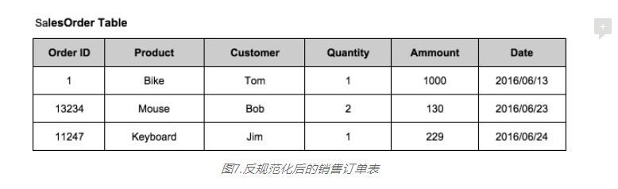

图7.反规范化后的销售订单表

> 数据库规范化在关系型数据库建模中是一项非常重要的技术，一般要求数据模型要达到3范式。但这不是一条金科玉律，设计者往往需结合实际， 权衡各方面的性能需求，适当的聚合数据提高冗余度。
>
> 1

聚合和规范化如同一个硬币的两面，规范化反向操作会提高了聚合度，而聚合的反向操作则会提高规范度。 对NoSQL数据库来说，往往是先考虑将数据聚合在一起，再根据需要逐步规范化。而正是从聚合到规范化的转变过程中，演变出许多不同类型的NoSQL数据库。 图8很形象的表现了这个演变过程，以及各个点上大家所熟知的NoSQL数据库。有趣的是它们都是向着SQL的方向进化，又重新演绎了上个世纪发生的类似过程。

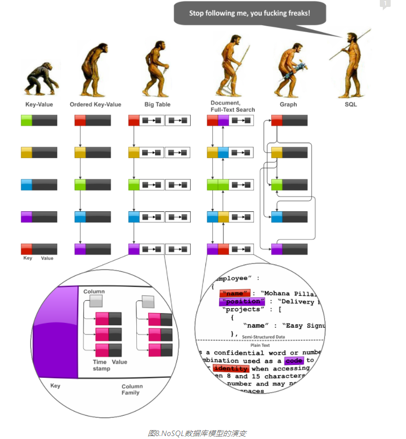

图8.NoSQL数据库模型的演变

1

### NoSQL的到来

互联网应用的高并发访问量、大数据存储量以及跨地理区域等性质使得传统的基于关系型数据库的应用架构无法满足其要求。 在传统的企业应用架构中，数据库往往处于系统集成的结合点上，如果两个应用之间具有高度的相关性，那么就应该将这两个应用合在一起，共享同一个数据库实例。 这样数据的一致性、原子性以及可用性就能由关系型数据库得到充分保证。而数据库被要求只能安装在单机环境中，这样才能保证数据在一个存储空间中。 即使是那些高端的高可用性解决方案，也被要求至少要使用共享的磁盘组。那么单机的数据库服务器到底受哪些条件限制，使得它再也无法提高？ 我们从以下三个维度看：

- 并发访问量：

  一台普通关系型数据库服务器一般只能接受每秒100个并发访问连接， 并且不管你如何扩大内存或者增加CPU，提高的空间都非常有限。这是因为关系型数据库具有很强的数据一致性和原子性校验， 如果两个会话连接（Connection Session）同时访问同一条记录，先到的那个会话会在这条记录上加一个排他锁，这导致后一个会话只能等待前一个会话完成后才能有所动作。 而如果前一个会话是要修改这条记录，那么很有可能会涉及磁盘读写操作，这会让第二个会话会等得更久。这仅仅是2个会话，而如果同一秒中有100个会话， 这意味着发生相互等待的概率非常大。等待的会话不能及时释放系统资源，而后续的访问请求又源源不断进来，最后导致系统突然间无法提供服务，即所谓的“雪崩”效应。

- 最大存储量：

  理论上，关系型数据库是没有最大存储量限制的。但随着数据量的增大，数据库的性能确实会随之下降。 直接影响性能的是那些超级大表，这些表在一个数据库中往往不会超过10个，却可能占据了整体80%以上的空间。在实际使用过程， 你会发现一旦表的条目数达到上亿的级别，那么对该表的查询会遇到严重的性能问题，这个时候扩充服务器的性能也是无济于事的。 大多数数据库针对这些大表的解决方案是做横向的分区（Partition），这确实能缓解一些性能问题，但数据量增大对运维工作带来的成本提升却是难以克服的。 无论是新建索引、数据库重组还是数据库备份都要花上好几个小时甚至天以上的时间单位。当数据库大到一定程度，就无法有效备份了。

- 跨地理区域：

  在标准的三层架构中，数据库服务器和应用服务器是分开部署的，但考虑网络传输等因素，往往被安置在同一个机房。 现在想象一下一个互联网应用它的数据库服务器在纽约，而为了满足中国市场，又在上海部署了一套应用服务器。这样能否提高中国用户访问的速度？ 答案是不能，因为应用服务器与数据库服务器之间的通讯还需跨越太平洋底下的光缆，这反应在数据通讯上是高延迟性（受狭义相对论约束：任何信息传输无法超过光速）。 只有在上海同时部署一个数据库服务器的副本，才能解决跨地理区域的性能问题。但这样上海和纽约两个副本之间数据的同步与一致性就无法再得到关系型数据库的庇护了。

以上三个问题预示着只有采用分布式架构才能应对互联网级别应用的特性。然而一旦这么做，意味着同样的数据可能会出现多个副本， 对任何一个副本所做的更新都需要同步的其他副本上。想象一下，当你提交一个订单，需要等待部署在不同地理位置上相距很远的多个数据库都保存成功了， 才弹出提示框，告诉你订单已经成功提交。由于网络的延迟，反应到前端等待时间是无法忍受的；而且一旦其中一个副本没有更新成功，就会造成副本间的数据不一致。 为了达成一种妥协，只能忍受数据暂时的不一致，并希望通过后续异步的数据交换，实现所有副本数据的最终一致。

> 关于分布式数据库有一个著名的
>
> CAP理论
>
> ， 描述在数据一致性（Consistency）、可用性（Availability）和分区容错性（Partition tolerance）这三者之间，你只能很好的满足其中任意两个，而无法做到三个同时满足。

许多互联网公司觉得标准的关系型数据库产品无法满足它们对扩展性、可用性以及性能上的要求，于是转而开发符合自身应用特点的数据存储方案。 这类数据存储方案有着共同的特点就是支持分布式但不支持SQL，通过调用更为底层的API来对数据进行操作。于是更多的企业和组织跟进，都根据自身应用的特点去定制化数据库。 这类数据库没有出现一些标准化的产品，但它们统一被归为非关系型数据库，或者更习惯上称之为“NoSQL数据库”。

1

> 很多文献将“NoSQL”理解为“Not Only SQL”，黑屋认为这和实际不符。很多BI产品在SQL的基础上扩展了一些OLAP元素，但它们明显不属于NoSQL的范畴。 SQL是一种命令式脚本语言，用户通过SQL可以实现任何符合逻辑的数据集合操作，而无须告知系统该如何去实现。关系型数据库在设计上被要求尽量满足SQL的标准， 即尽量从使用者角度考虑，把复杂的计算逻辑封装成容易调用的人机接口。从模型角度理解“关系型”和“非关系型”是有逻辑偏差的，因为所有数据库原则上或多或少满足关系模型。 然而从通用性和易用性角度理解则相对容易，关系型数据库具有良好的通用性和易用性；而非关系型数据库或者NoSQL数据库是满足特定领域的定制化数据库。

说到这里其实有个很大的疑问：难道去除了对“SQL”的支持，就能满足扩展性、可用性以及高性能了吗？如果真是这样，那就把现有的关系型数据库的SQL功能禁用掉，不也可以吗？ 对于前一个问题的答案是否定的，而对于后一个问题的答案黑屋认为是可行的。事实上，NoSQL数据库就是关系型数据库的一个工程子集，你只要关闭或者禁用关系型数据库的某些功能， 就能将之塑造成一个NoSQL数据库。但令人遗憾的是，**你抛弃的那部分功能是要在应用层面上还回来的。**也就是说你要在应用层面重写原来由数据库完成的一些功能特性。 对于习惯于依赖成熟关系型数据库产品解决方案的公司和组织来说，开发这种底层数据处理特性实在是太难了，因此NoSQL数据库到目前为止还是那种技术性公司和组织的专属玩具。 所以，确切的说不是关系型数据库无法支持分布式，而是传统的基于关系型数据库的应用架构和运维能力无法支持分布式。

在以下的内容中我将对目前流行的几种NoSQL数据库作简单的介绍，它们分别是：键值数据库（Key-Value Stores），列族数据库（Column-Family Databases）， 文档数据库（Document Databases），和图形数据库（Graph Databases）。我会从数据库模型层面来阐明它们之间的不同主要体现在聚合和规范化的程度。 如果将聚合和规范化的转变过程看成一个连续体，左边是最聚合的状态，右边是最规范化的状态，那么无疑键值数据库是属于最左边的，而处于最右边的可不是关系型数据库（这里允许我先卖个关子）。 在分析每种NoSQL数据库模型的时候，我都将尝试使用关系型数据库来塑造类似的效果，这能让我们更清楚的看到不同数据库间的相通性。

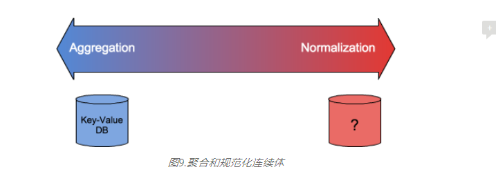

图9.聚合和规范化连续体

### 键值数据库

**键值数据库是所有数据库中最精简的形式，也可以说所有数据库本质上都是键值数据库。** 前面讲的文件系统也是一个键值数据库，它的Key是文件名（包含路径），Value则对应文档的内容。 然而NoSQL中的键值数据库在实现上通常是一张大的哈希表，每个Value被指定一个唯一性的Key，通过一个哈希函数计算， 可将Key直接对应到Value的存储位置信息上，然后便能快速访问Value对应的数据。这里Key就是Value的一个“指向”，而Value对数据库来说是模糊的， 它可以是以二进制形式（BLOB）保存的任何数据结构。应用程序通过一个Key获取对应的Value后需要自己负责解析这个二进制串，基于这个原因， 键值数据库只能支持最简单的针对单个Key的查询（get）、插入（put）和删除（delete）操作。

键值数据库是最有可能也是最容易实现分布式部署的，因为每个Key对应的Value都是相互独立的，不存在任何指向关联，而所有的数据关联都已经聚合在一个Value里了。 为了保证数据能均匀的分布在不同的分区服务器（Partition）上，键值数据库需要选择合适的哈希函数来决定数据存放的位置。 首先确定数据保存在哪个分区服务器，接着是分区服务器上的具体存储位置。这里我们又看到计算机系统呈现的分形几何：在单机环境下，数据从不同的硬盘上汇聚到内存作聚合， 而在分布式环境下，硬盘被放大成了一台独立的服务器，数据从不同的分区服务器上汇聚到应用服务器中作聚合（见图10）。

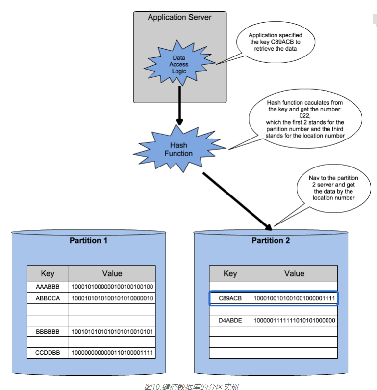

图10.键值数据库的分区实现

现在我们试着用关系型数据库来实现和键值数据库类似的存储模型。我们需要做的是创建一张包含2列的表：第一列为Key, 类型为128位的字符型； 第二列为Value, 类型为BLOG，无长度限制；然后注明在第一列上建立一个哈希索引，这就差不多了。但为了防止一些校验功能带来的性能损耗， 我们还可以关闭日志功能、事务原子性支持、并发锁功能（如果确定不大可能出现同时操作同一条记录的情况）。我们还是可以通过SQL来访问这个表的数据， 因为SQL只会在第一次访问的时候编译，以后便会留有一个编译后的缓存；而对这张表的操作也就3个SQL语句，所以这不会损耗太多性能。 这样我们就得到了一个用关系型数据库实现的键值数据库，虽然有点委屈，但性能上也不会输给一个纯粹的键值数据库太多，而且一旦有调整的需要， 我们还可以马上恢复一些禁用掉的功能。

> 关于哪些是影响SQL数据库性能的主要因素，可参考StoneBraker的这篇文章
>
> "SQL vs NoSQL"
>
> 。

键值数据库一般用于存储一些临时性的东西，而且一定要用在分布式的架构中才能最大发挥其优势。最常见的应用场景例如CDN服务， 对网页中大量图片，Javascript代码建立就近缓存点，加快用户打开网页的速度。在大多数键值数据库的应用中，我们还发现一般都将其完全内存化（In-memory）， 因为很多情况下这些数据可以从其他数据源（例如关系型数据库）还原，数据的持久化因此变得没有那么重要了。 还有一些应用场景对Key是有顺序性要求的，例如获取Key在某个范围内所有的Value, 这时就要用BTree来代替哈希函数了。 一旦添加了这个能力，那么对分区将带来不小的挑战，你只能根据Key的范围来分区，而这很难做到数据在各分区间的平衡。

### 列族数据库

列族数据库之所以能在众多NoSQL数据库中脱颖而出不得不说是因为Google公司[BigTable](https://darkhouse.com.cn/blog/assets/docs/BigTable-Thesis.pdf)名声在外。 BigTable主要被用于GoogleAnalytics和GoogleMap等应用，它的主要特点是在能提供高扩展性和大数据存储的同时，还能保证一定的数据分析能力。 列族数据库或者说BigTable类数据库相比于键值数据库要丰富得多，列族（Column-Family）的意思是将具有相关性的列聚合成一个存储单元。 例如客户的基本信息包括姓名、称谓等，客户的地址信息包括街道、城市、州、邮编等，那么我们将客户基本信息和地址信息分别看成两个不同的列族， 它们包含的每个“name/value pair”就是列族的列，不同的列族通过相同的“Row Key”关联起来。

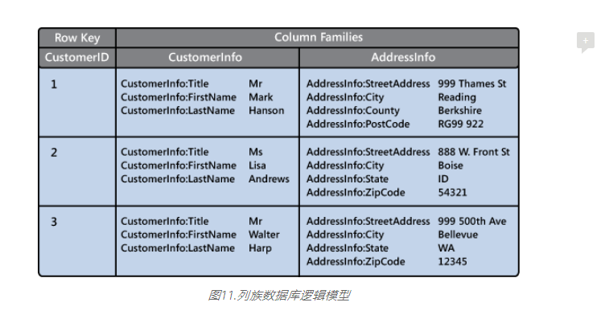

图11.列族数据库逻辑模型

从图11中列族数据库的逻辑模型上看不出什么特别之处，仅仅是把关系型数据原来横着排的列并成了竖排。但是这种把相关性强的属性组成一组， 不同的组相互区分开的形式在物理模型上是具有很大意义的。这就是前面我们描述的聚合和规范化应用的一个实例，列族数据库本质上是根据实际需要来权衡聚合和规范化的程度， 做到一个合理的安排。这个安排就是将相关性强的信息聚合到一起，相关性弱的信息用不同的列族来规范化。

与关系型数据库不同的是，列族中的列没有严格的模式定义，它可以被自由定义并任意添加。例如图11中，客户1的地址信息与其他客户在模式上是不同的， 作为一个英国的客户他只有Country没有State, 他的邮编的叫法和格式都与美国的客户不同。事实上很多情况下，列都不一定是静态的， 例如一个以股票代码为Row Key的列族数据库，其中一个列族记录每天的收盘价，那么列名就是当天的日期，它是动态的。

尽管图9中客户基本信息和地址信息是放在一块儿的，然而在物理层面上这两个列族会生成两个不同的文件，这意味着你可以分别将这两个文件存放在不同的硬盘上， 这样的垂直分割能实现对两个列族并行访问，并且在操作上相互隔离（图12），这也更有利于在MapReduce框架下做海量数据分析。

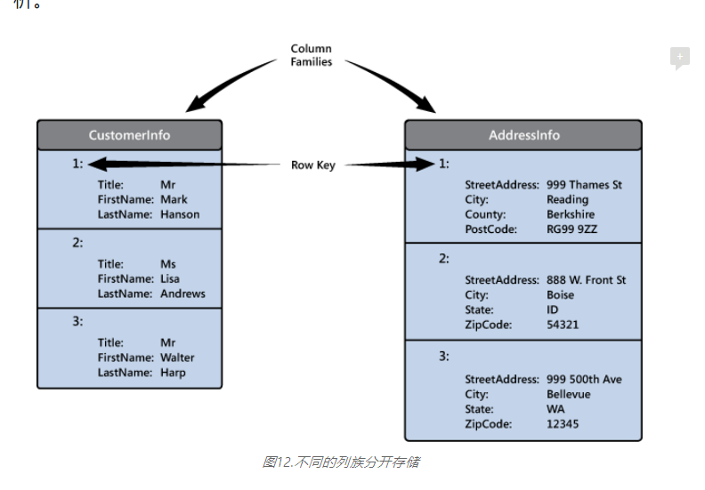

图12.不同的列族分开存储

那么用关系型数据库是否可以模仿列族数据库？这取决于你的关系型数据库是否支持将表建立在不同的文件里，据我所知， Oracle是可以通过定义表空间来实现这样的配置的。那么假设在Oracle的环境下，我们为每个列族创建一个包含Row Key和Column Family两列的表， 表名即为列族的名字。其中Column Family这列的数据类型是没有长度限制的String，用于保存类似JSON串形式的“列名/列值对”。 我们还可以使用内建的压缩技术对该列中的数据进行压缩，如果该列保存了相对长的字符串，就会得到一个不错的压缩率。 这个表需要独享一个表空间，并把不同表空间对应的数据文件保存到不同的硬盘上。这样我们基本上就完成了对一个列族数据库的模仿， 你还是可以用SQL来实现所有对列族数据库的操作，甚至还可以使用JOIN来关联两个不同列族的数据。 当然，你还是得自己完成分布式架构的设计，包括实现一些副本的冗余、负载的均衡、数据同步等问题，你还得借助第三方的MapReduce框架来支持海量数据的操作。

> 数据压缩技术应用到数据库不仅可以提高空间使用率，也可以显著提高性能，因为同样一次读盘可以获取更多的数据。 虽然解压过程耗费一定的CPU时间，但和I/O时间相比可以忽略不计，何况现实情况中CPU都处于饥饿状态，利用率不高。 甚至有些压缩技术可以在不需要解压的情况下完成某些数据操作，这样效率就更高了。

### 文档数据库

在所有NoSQL数据库中，文档数据库可谓是最火热的。它最能让用户犹豫：到底是选择用文档数据库呢，还是关系型数据库？ 文档数据库的吸引力在于灵活的数据结构和方便的横向扩展能力。在大多数人印象中文档数据库就是性能的保证，使用它就能轻松解决关系型数据库无法处理的大数据问题。

本质上讲，文档数据库只是在键值数据库的基础上丰富了点内容。首先，Value不再对数据库完全模糊，而是以一种半结构化的文档形式呈现。 “文档”在这里更倾向于一种将相关数据聚合在一起的一个实体，一般以XML、JSON或者TXT（偏移量）等通用数据格式来组织。 其次，应用程序不仅可以通过Key来获取数据，也可以通过文档中的某个属性值来查询和过滤数据。 这个特征使得文档数据库能满足一些基于复杂查询条件的应用需求，也让它看起来更像是一个关系型数据库。

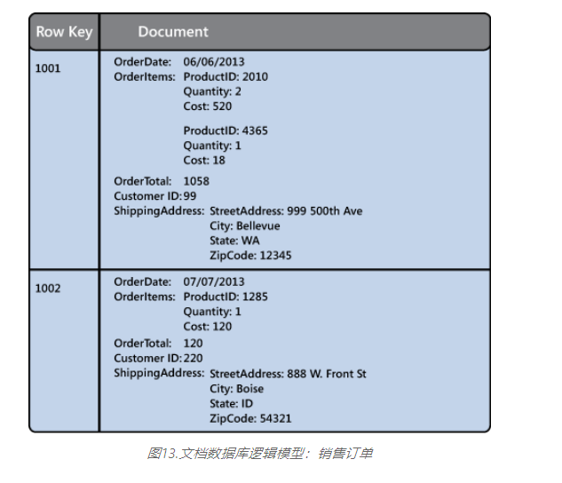

图13.文档数据库逻辑模型：销售订单

与关系型数据库建模的规范化理念不同，文档数据库更愿意接受一定的数据冗余以便能将相关信息存放在一个实体文档中，这样做可以避免产生过多的小文档。 如图13中的销售订单的文档模型，文档数据库建议将整个销售订单的数据聚合在一个实体中，这样就能根据订单号一下子获取一张完整的销售订单信息。 而在关系型数据库中，一般会将销售订单规范化成销售订单抬头表和销售订单行项目表，前者存放抬头的共享信息，后者存放属于该订单的多个行项目。 关系型数据库需要通过SQL的JOIN操作关联这两张表中的数据，以便Denormalize成类似图13中的文档形式。虽然访问单个订单的效率关系型数据库不如文档数据库， 但如果需要统计销售量最大的产品，那么关系型数据库只需遍历行项目表就可以了，而文档数据库则要遍历更多的数据。

**但即使是文档数据库，你也不能无限制的使用聚合，你还是得花很多心思去考虑规范化的问题。** 如图13中，客户和产品只是保存了一个ID，并没有将客户和产品的实际属性聚合到销售订单这个实体中。这样做是有理由的，当你更新一个客户数据或者产品数据时， 你不必再去遍历整个销售订单库来同步这些更新了。然而当你想知道某个城市的销售额，你必须得先从客户数据库中获取属于该城市的所有客户， 然后根据这些客户再去销售订单数据库中过滤满足条件的销售订单，并累计销售额。需要说明的是，文档数据库一般不支持JOIN操作， 上面所说的所有逻辑你必须在应用程序层面自己实现。

我们是否可以用一个关系型数据库实现文档数据库最主要的两个优点呢？先说数据结构的灵活性，同列族数据库一样， 我们为每个文档库建立一个包含Row Key和Document两列的表，其中Document列的类型为String（可以限定长度为4000Byte，也可以不限长度）， 用于保存JSON格式的字符串。这样我们虽然可以得到一个灵活的数据结构，但却无法使用关系数据库内建的索引机制。 不过我们还是可以用一种变通的方式实现，如果我们想对某个属性建立索引，我们只需再建立一个表，该表的主码为需要被索引的属性（可多个）， 而非主码字段可以是一些描述性的或者数字性的字段。如图14，我们通过客户ID的胖索引（Fat Index）可以快速找到一个客户对应的所有订单号， 甚至无须访问主表，就能累计每个客户的消费。但这就要求应用程序在更新主表的时候还需同时更新相应的索引表， 幸运的是我们还是可以用到关系型数据库Transaction的机制来保证这两边数据的一致性。

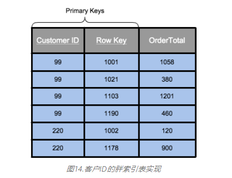

图14.客户ID的胖索引表实现

那么扩展性（Scale-Out）呢？确实许多文档数据库具有内建的Replication和Sharding功能，也正因为这两点才使得文档数据库能支持海量的数据和高并发访问量。 从前面的描述中不难发现，其实单台的文档数据库的性能并不能凌驾于关系型数据库之上，甚至在综合能力方面也毫无优势可言。那么现在的问题就转化为： **关系型数据库是否也可以内建Replication和Sharding功能？从理论上是完全可行的，文档数据库之所以支持这些横向扩展能力， 完全是因为放弃了一些数据一致性的要求，这和支持的是文档模型还是关系模型毫无关系。** 事实上，MySQL就已经有了类似的[横向扩展解决方案](http://dev.mysql.com/doc/refman/5.6/en/replication-solutions-scaleout.html)。

**文档数据库这种介乎键值数据库和关系型数据中间的状态有时候使得它很难正确找到自己的定位。** 如果你还是个新手，那么从一个相对容易、内容积累还不是很多的文档数据库入手是一个不错的选择。 它能让你了解一些数据库本质性的东西，但你最后还是无法忽略关系型数据库，即使它到现在已经发展得极其复杂令人发指。 文档数据库以Denormalized的形式保存数据的特点使得它在一个特殊的应用领域具有良好的适用性，这便是数据归档。 **将保存在关系型数据库中一些老旧的历史数据迁移出来保存到文档数据库中，既能缓解关系型数据库的压力，又能很好的满足对这些历史数据的操作和存储要求。**

### 图形数据库

图形数据库（Graph Databases）可以说是NoSQL数据库中的一个异类，如果说其他NoSQL数据库更喜欢用聚合来关联数据， **那么图形数据库则是彻底规范化的数据模型**，它高度依赖于用指向来关联数据。也许你早已知道了答案，在我们前面的聚合和规范化连续体中，图形数据库与键值数据库就是两个对应的极端。 处于极端的事物总是在某些方面具有绝对的优势，键值数据库的优势在于获取单个实体数据时是最快的；而图形数据库更关注实体与实体间的关系（Relationship）， 因此它在各个实体和关系间的遍历是最有效率的。

图形数据库主要存储三类信息：其一是和所有数据库一样的实体信息，称之为Node，不同之处在于Node中不会保存具体的属性内容，而是属性和关系的指向。 其二是描述实体间关系的信息，称之为Edge。Edge具有方向性，例如: “Mary是Jack的妻子，Jack是Mary的丈夫”描述的是婚姻这种关系的两个不同方向。 同Node一样，Edge也拥有属性信息，因此除了保存“开始Node”和“结束Node”的指向外，还保存其自有的属性指向。 最后是属性信息，Node和Edge都将各自的属性内容保存在一个地方，并通过指向链的方式关联在一起，这种设定使得Denormalize一个实体信息需要通过多次随机访问， 但也意味着你可以灵活添加或删除Node和Edge的属性。图形数据库最适合用来描述系统性集群组织，例如图15便是用图形数据模型描述的公司组织结构。

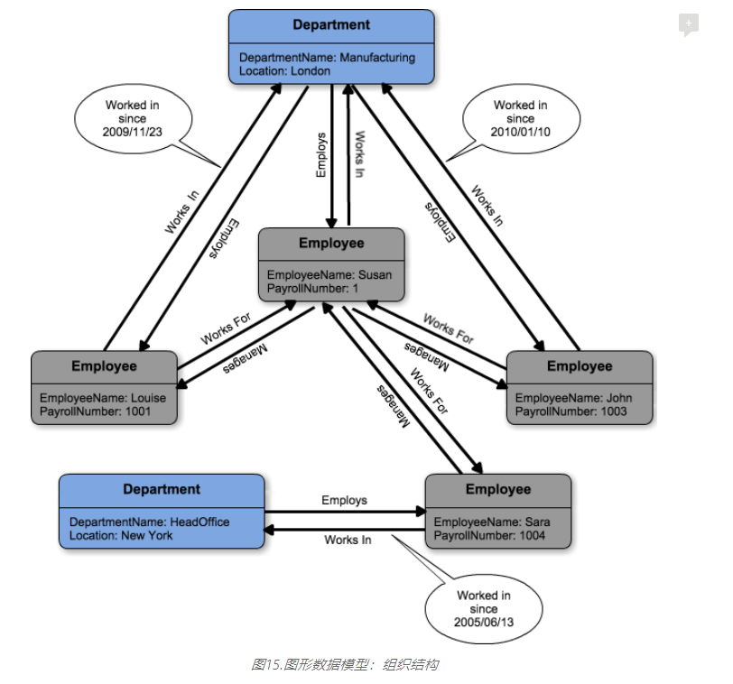

图15.图形数据模型：组织结构

上图中两个Node的之间的关系都是双向的，例如部门与雇员间存在“部门Employs雇员”和“雇员Work In部门”两个独立的关系。 这样设计的好处在于遇到诸如“哪些雇员在Manufacturing部门工作？”时，不需要遍历所有的雇员节点来检查是否有该部门的“Work In”关系， 而是直接将“Manufacturing部门”设置为起点，获取其下所有“Employs”关系，再以这些关系为指向，便能快速获取所有雇员节点。 在上图的例子中，我们还可以发现“Work In”关系拥有自己的属性，即雇员的受雇日期。这在逻辑是必须的，因为“受雇日期”既不能单独赋予雇员， 也不能单独赋予部门，它只能用于描述雇员和部门之间发生的雇佣关系。

> 似乎在“关系”上加上时间信息是具有一定通用性的，黑屋认为在存储一段“关系”的时候将开始日期和结束日期作为两个默认属性是值得考虑的。

对图形数据库来说，影响性能的主要因素是一次遍历所经历的节点数，而对数据库容量的大小并不敏感。但它并不能像关系型数据库那样能处理错综复杂的数据分析， 而仅仅是在处理“关系”上更胜一筹。在[关系型数据库统治中](https://darkhouse.com.cn/blog/1)我们也曾提到过关系模型之前的网状模型，当时的网状数据库虽然也是通过节点间的指向来关联信息， 但是这种关联和信息间的导航是与前端业务逻辑紧密绑定的。图形数据库相比网状数据库最大的进步在于它实现了一种通用型的网状模型， 基于Node、Edge以及关联的属性，它原则上可以对现实中的任何事物建模。这种最高级别的规范化就好比构成一个原子的质子、中子和电子， 是构建万事万物的基础。所以图形数据库在某种程度被认为是下一代的关系型数据库。

在前文中，我们还提到过实体-关系模型（ER Model），这也是一种注重实体间“关系”的建模方式。从逻辑层面上说它和图形模型是完全相通的， 你可以毫无费力的将一个实体-关系模型转变成图形模型，反之亦然。但在具体实现的物理模型层面上，实体-关系模型是基于关系型数据库的， 实体和关系都是以二维表的形式保存，并以Join操作实现“实体-关系-实体”的导航；而图形数据库则在键值数据库的基础上优化了这种指向关联方式， 使其无论在性能还是数据结构的灵活性上都更胜一筹。

大家都已经习惯应用实体-关系模型在关系型数据库之上建模，这也充分说明图形模型的普适性；至少在逻辑层面上大家非常容易接受这种建模方式， 因为现实事物本就是呈网状关联的。但我在这里还是想尝试在关系型数据库的基础上实现一个图形数据库，不仅仅在逻辑层面上， 也要在性能和数据结构的灵活性上更接近一个图形数据库。那么首先我们需要创建三个表，分别是：NodeTable, EdgeTable和PropertyTable（见下图）。

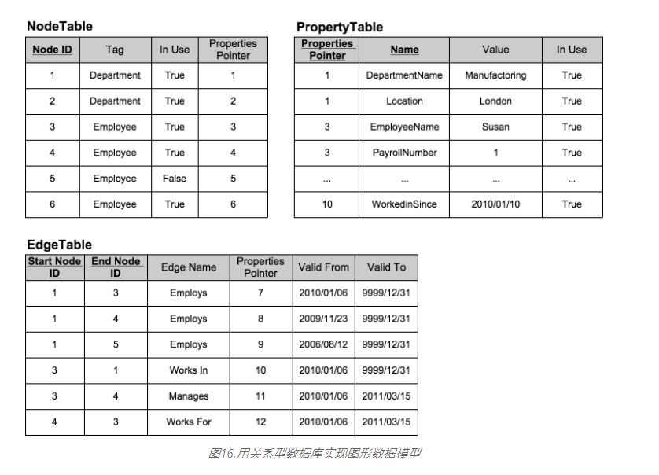

图16.用关系型数据库实现图形数据模型

NodeTable有4个列，第一列Node ID是主码，用于唯一标识一个Node；它的数据类型是整数，这样能稍微提高些BTREE索引访问的效率。 第二列Tag用于区分Node的类别，我们将不同类别的Node统一存放在一个表里而不是分开建表，这样就能保证对前端应用的一致性；如果数据量过大， 可考虑根据Tag列来建立分区（Partition）。第三列In Use用于标识该Node是否已被删除（一般不直接从表里删除数据）。 第四列Properties Pointer是属性的指向，Node的表里不直接保存属性的内容。EdgeTable的第一列和第二列分别表示一条边的起始节点和结束节点， 它们是该表的联合主码，默认情况下基于这两列的主索引是排序的；这样的设定能保证根据一个Start Node ID快速获取所有属于该节点的关系， 因为相同的Start Node ID在物理位置是连续的，可以避免过多的随机读取。Edge Name是对Edge的归类，必要情况下可以根据该列做分区。 与Node一样，Edge也只保存属性的指向，但Edge还有另外两列Valid From和Valid To用于表示一段关系的有效期，如果今天的日期不在有效期内， 那么就认为该关系已经失效了。所有的属性都统一保存在PropertiesTable里， 它的主码是由Properties Pointer和属性名Name组合而成； 同样主索引的排序能保证同一个属性指向下的所有属性（Name/Value Pairs）能在物理位置上连续。Value的数据类型可以是Binary或者String， 用于存储各种数据类型。

我们用图16中的三个表基本上实现了一个图形数据库的主要特征，无论从数据结构的灵活性，还是性能上看，都会相当接近一个纯粹的图形数据库。 当然，要让它实际运作，还缺少一些元数据表和应用层面的工程实现细节，但整体思路可以从这三个表来呈现。对于访问接口来说，我们还是可以用SQL， 但完全可以根据实际需要，封装一些通用的图形遍历操作接口，因此在接口易用性上也不会差太多。如果我们想对某个属性创建索引， 那么我们可以像前面文档数据库中描述的那些通过创建一个表来实现，它的主码为要属性的值，另一列则为Node或Edge的ID。 我们以“<Node Tag>_<Property Name>”的形式来命名这个索引表，这样应用程序就知道应该怎么利用索引去查询和过滤了。

**实际上，这就是一个多租户架构的数据存储模型，如果你了解SalesForces的底层架构，你就知道它们是有多么的相似。** 黑屋也一直在尝试将图形数据库模型应用于SaaS领域，创造一种灵活的通用型多租户数据存储解决方案， 但这里还有很长的路要走，难度在于那些看似矛盾的需求间的权衡：灵活性和性能、一致性和分布式、聚合和规范化等。 从目前来看，图形数据库已经拥有很多成熟的应用场景，例如:社交网络，导航系统的路径计算，计算机网络管理，数字营销的推荐系统， 数据挖掘，复杂系统的权限和访问控制等。如果你的应用也落在上面的范围内，不凡考虑一下图形数据库。

### 总结

我们从计算机如何存储数据开始，讨论了数据是如何在底层进行组织的，并见识了计算机系统中的分形几何现象。文件系统通过偏移量和指向来关联数据； 而到了数据库层面，我们主要平衡聚合和规范化的程度；在应用系统集成层面，我们考量的是紧耦合还是松耦合。 所有这些系统架构思维在底层共享着相同的内核，掌握它有助于我们从错综复杂的表像中看清实质，进而灵活应用到其他层面上。

我们后面又讨论了NoSQL数据库的到来，由于传统的基于关系型数据库的应用架构无法支撑互联网规模的应用，于是很多互联网公司开发了适合自身应用的数据存储方案。 这类以不提供SQL支持为主要特征的数据库成为关系型数据库之外的第二种选择，它们以提供高性能和高的扩展性在分布式应用系统架构中得到越来越广泛的关注。 然而NoSQL数据库的性能和灵活性并不是平白无故产生的，它们大都是以牺牲一致性来换取的。在这点上我们无法忽略关系型数据已取得的成就。

NoSQL数据库相比关系型数据库是简单的，**它们之中甚至还没有出现成熟的商业化产品。**在生产环境中应用它们还需借助其他一些组件，如：集群管理、负载均衡、消息中间件等； 因此NoSQL在很多情况下被看成是一种工具集，你必须配套使用它们，甚至还需要自己完成一些定制开发。这就好比DIY一台电脑， 你需要了解每个组件的特性以及它们之间如何相互磨合，才能组装出一台适合你的完美电脑。对年轻的学习者来说，NoSQL无疑充满了吸引力， 他们不必从封装得很好却复杂得毫无头绪的成熟数据库产品入手，去追赶前辈们订立下来的规矩；他们现在可以直接接触到数据库的Alpha版本（键值数据库）， 并随着前端业务的发展逐渐体验数据库在不同时期的进化。这比看着一款成熟产品的手册，调整那些莫名其妙的参数实在要有意思多了。

然而我们也不能因此忽视关系型数据库的地位，认为它一定会被NoSQL数据库取代。在后面的内容中，我分别介绍了4种常见的NoSQL数据库类型， 并将它们一一在关系型数据库上近似实现。**我想说明的是当前所有的NoSQL数据库都只能算关系型数据库的一个工程子集，它们并没有什么先进性。** 对比单机环境下一切性能优势都是假象，这只能说明你对关系型数据库产品不够了解。作为成熟的产品，关系型数据库需要考虑： 如何面向普通的使用者提供简便性和易用性？如何能支持所有的软硬件平台？如何能支持所有的应用场景？因此它固然会损失一些性能。 然而对于一套经过定制化开发，并部署在定制化硬件系统上的NoSQL数据库系统来说，一个专业化团队才是保证其性能优越的关键。

1

关系型数据库可以作为一个很好的考量基准，毕竟40多年的发展使得它已经总结出了许多数据处理的经验。 因此，当你推荐一个项目使用NoSQL数据库的时候，你一定要对比它与关系型数据库的差距，你同时也要心里有数， 这些丢失的功能特性很有可能需要项目团队在应用层面上去完成，而这又严重依赖于团队的能力以及项目时间和成本上的容忍程度。 对于大部分应用场景来说，只要你认为数据库服务器能在单机环境中部署，那么关系型数据库永远是最佳选择。 随着数据量和访问量的逐步上升，在你决定使用分布式架构之前，不凡先考虑使用键值数据库（In-Memory）做一些缓存机制，使用文档数据库归档一些在线的历史数据， 或者使用列族数据库降低在线关系型数据库的OLAP压力。**这种将NoSQL数据库作为关系型数据库一种补充，联合使用多种数据存储方案的架构具有更好的可操作性和成本收益。**