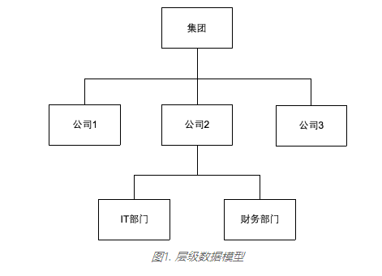
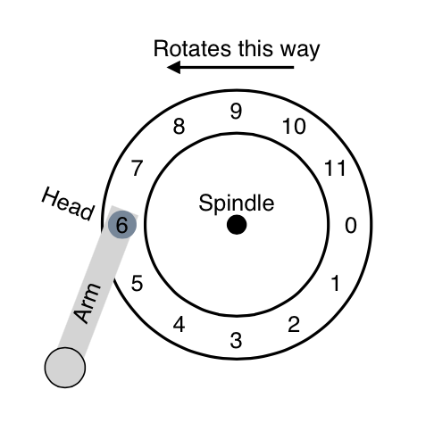
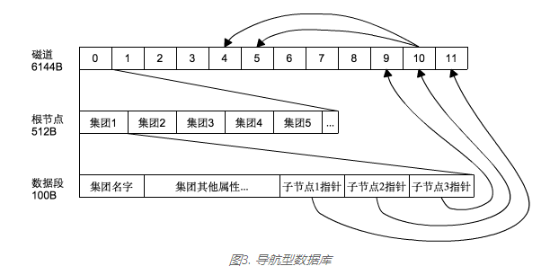
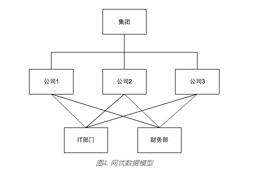
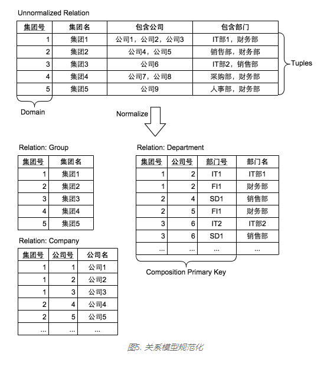
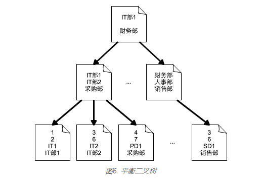
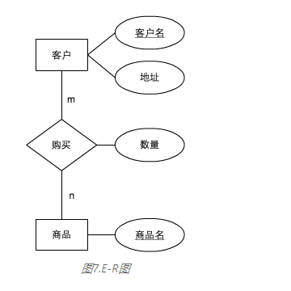
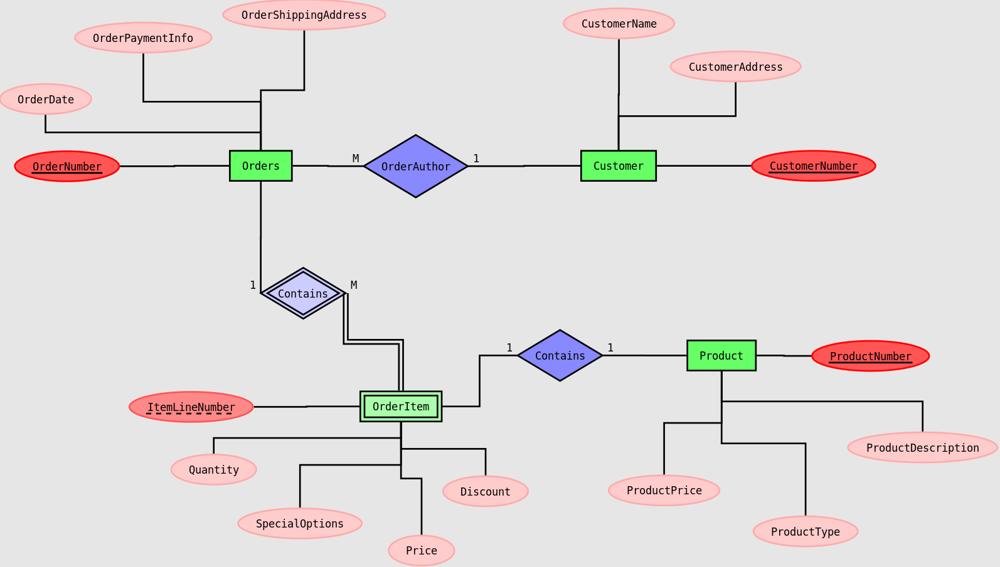
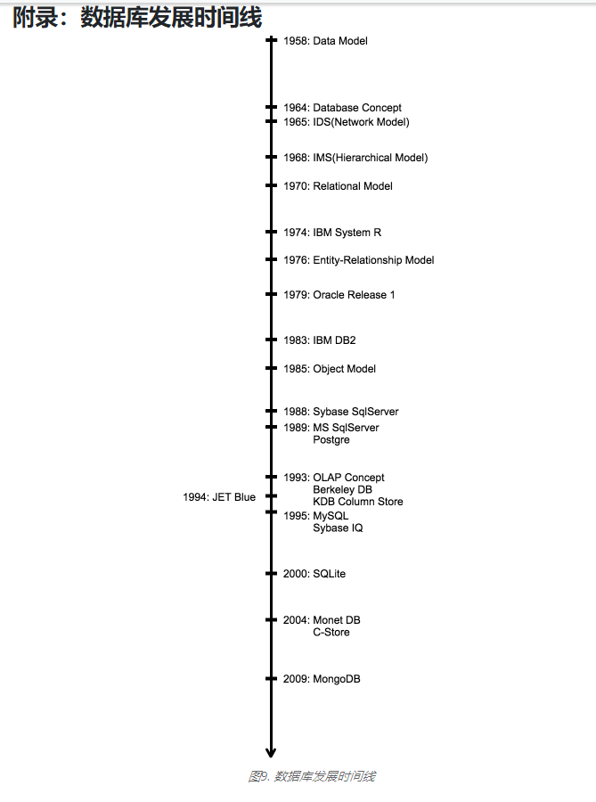

# 介绍

https://darkhouse.com.cn/blog/2

大多数的软件开发离不开数据库，如果你把软件定义为“程序”和“数据”，如何存储数据一直是软件开发过程中最值得去思考的问题。上世纪 80年代来，关系型数据库已经让大家从这个复杂的问题中解放了出来。至少对一部分开发者来说，他们再也不用愁数据存储这个问题了， 以至那些企业应用软件的用户已经完全忽视了数据存储。他们更热衷于绘制业务流程图以及对UI界面的指手画脚， 数据存储在他们的印象中就如同EXCEL中的几个SHEET那样理所当然。然而，理所当然的事物往往是最重要，也是最难实现的。 黑屋认为业务逻辑和UI是一堆没有价值的“管道代码”，因此应尽可能实现自动生成。


在另一个阵营中，一群人一直在挖掘数据存储的潜力，他们造就了属于这个时代的新名词：“大数据”， “Hadoop”， “NoSQL”, 等等。他们更接近IT的本质(开发实质的信息处理软件而非管道软件)，凭借扎实的技术和进取心，撼动着强大的关系型数据库。 然而这些IT新名词仅仅是一段时期内的流行词汇，还是能真正带来一些变革？无论怎样，它们确实影响到了如今的应用开发者。 “数据存储”这个问题被重新提出来：突然多了那么多数据库，到底选择哪个？看待这个问题不能只从技术层面上， 因为追随新锐事物总能给人以先进的感觉，从而获得超出实际的评价。


因此我们也不能仅仅将对比不同数据库的特性来作为挑选的依据（而且这样的文章已经够多了）。如果我们重新回顾一下数据库发展的历史， 了解各个阶段它要解决的问题，熟悉更多关于数据库本质的内容，这将有助于我们做出正确的选择。黑屋冀希望以此能让企业应用软件领域的用户重新重视数据存储； 也希望那些年轻的互联网从业者更多的关注数据处理软件的前尘往事，去创造更令人激动的未来。


本系列以数据库发展历史为主线，分别以5篇博客依次介绍：“关系型数据库的统治”，“OLAP浪潮”，“列式数据库的逆袭”，“互联网时代的百家争鸣”， 以及最后“MDB的多租户数据模型”。


本文是这个系列的第一篇，首先介绍一些早期的数据库模型，然后重点介绍关系型模型以及关系型数据库。 虽然主题是数据库模型，但如果不涉及底层的物理模型（物理介质上的数据结构），是很难描述全面的，同时为了避免过于技术， 对数据物理模型的描述只会点到为止。最后讨论一些关系模型之后出现的数据模型，主要以实体-关系模型为主。

# 早期的数据库模型

**层级数据模型 、网状数据模型 和 导航型数据库**

我们在讨论数据库模型的时候是不能不提承载它的物理设备的，虽然数据库模型从一开始就想摆脱硬件对它的限制，做到所谓的硬件独立， 但一旦放诸于实际应用，你就必须得考虑硬件的实际承载能力。事实上，在计算机发展过程中，硬件和软件总是相辅相成的： 硬件是软件运行的容器，容器的形状和大小决定了软件的设计；然而软件反映的是人类的思维，思维不受限制， 因此软件就能反过来促使硬件按照它的定义去发展。早期的数据库模型正是在磁盘被广泛应用的基础上发展起来的。


相对于磁带的**顺序访问**（Sequential Access），磁盘提供的直接访问(Random Direct Access)为软件提供了更多的思维空间。 我们现在熟悉的文件系统也是在磁盘的基础上实现的，思考一下，这种我们习以为常的文件夹包含文件夹和文件的层级架构是如何实现的？ 这是个非常有趣的话题，但不在本文的讨论范围内。然而我们接下来要谈的第一个数据库模型和文件系统有着非常类似的层级结构， 它的名字就叫**层级数据模型**。


**层级数据模型是以树形结构组织数据的，要求每个子节点只能拥有唯一的父节点**，从这个意义上它和现在的文件系统是一样的。 然而作为一个数据库系统，和文件系统最大的不同在于它要有能力对现实中的事物模型化。我们对现实世界中的事物往往存有一个概念上的抽象， 例如，公司内部的组织结构在我们的概念中就是一个层级，你能图像化不同的部门、人、以及他们的上下级关系。 这种概念上的抽象需要进一步抽象到逻辑层面，即去除那些无关紧要的部分（比如刚从你脑中一闪而过的各种图像），以便我们能把精力集中在问题本身。 经过上述思维过程后，我们便能画出类似图1中的层级数据模型。

> *文件系统和数据库系统到底有什么区别？从本质上它们是一样的，文件系统是模拟了文件夹和文件的数据库，数据库是更细节化的文件系统。 有趣的是来自这两个阵营的开发者至今还在相互对峙中。*



​												图1. 层级数据模型

接下来的问题是如何在计算机系统中实现这样一个层级模型，这就是计算机软件（或者说数据库）所要负责的事情，即将**数据逻辑模型**和**数据物理模型**对应起来。 要了解这种对应关系是如何实现，我们有必要先简单描述一下磁盘的工作原理。

磁盘顾名思义是一个表面带磁性的圆形盘片，它能绕着中心轴快速的旋转；磁盘表面的各个同心圆被称为磁道，二进制数据就是分散保存在这些磁道上； 磁头和磁臂负责定位处于特定磁道中的特定扇区。为了简化，假设我们的磁盘只有一个磁道，这个磁道被分为12个扇区，分别标上从0到11的编号（参见图2）。



图2. 单磁道磁盘

我们的单道磁盘如果以每分钟10,000转的速度旋转（RPM），那么通过简单的换算，便得出磁头从指向扇区6到指向扇区0所需的时间为3ms。 扇区0中正好保存着图1层级结构中的根节点，即所有的“集团”信息。假设每个扇区的大小是512 Byte，每个“集团”信息需要100 Byte的长度， 那么在扇区0中可以保存5个“集团”，分别是“集团1”到“集团5”（参见图3）。如果我要看“集团1”的信息，那么只需截取前100 Byte长的数据， 这里面就包含了如“集团名字”等固有属性信息，它们占据88 Byte长；在剩下的12 Byte中，分别保存了3个指向子节点的指针，每个指针4 Byte长， 它们分别指向保存“公司1”、“公司2”、“公司3”的扇区；“公司2”对应的扇区10保存了“公司2”的属性信息及其部门子节点所在的扇区编号， 这里“财务部”和“IT部”的数据被分别保存在扇区4和扇区5。这样通过层级间的导航，我们可以快速遍历整个层级结构。 粗略估算一下，在不考虑缓存的情况下，获取集团1下面公司2的IT部门信息大概需要9ms（按导航指引，访问扇区0、10、5）， 不算太慢，是不是？



这种通过数据记录之间的直接指引并提供引导式访问路径的数据库被称为**导航型数据库**（Navigational Database）。 考虑到上世纪60年代中期，磁盘速度还远没有现在那么快的情况下，以这种物理模型实现的数据库还是能提供可接受的性能的。 我们也看到，将层级数据模型对应到这种导航型的物理数据模型是比较直接的，没有涉及复杂的数据结构和转换， 这恰恰能说明这个时期的数据库模型受限于硬件能力。


> 导航型数据库的工作方式和现在导航软件很类似：向前1000米，右转，向前500米，左转，向前100米，到达。

虽然现实世界中有许多事物本身就是以层级组织的，例如， 除了组织结构外，制造行业中的物料清单（BOM）也是个天然的层级结构， 然而层级结构并是一个通用数据模型。 还是以一个企业的组织结构为例，如果这个集团下面的所有公司共享一个财务部和IT部（这在现代企业架构中很常见）， 那么我们就得到如图4这样的网状模型。与层级数据模型不同，网状数据模型允许子节点有多个父节点，这样便能实现“多对多”的实体对应关系。



网状数据模型还是可以轻松的用导航型数据库实现，这并不会添加太多的难度，只要在子节点上存有指向其各个父节点的指针即可。 然而无论是层级数据模型还是网状数据模型，其访问数据的路径总是被严格限制的，你只能基于它给出的路径，一个节点一个节点的去遍历。 分别有2个著名的数据库采用这两种数据模型：其一是GE于1964年发布的Integrated Data Store(IDS)，它是个网状数据库； 其二是IBM于1968发布的Management Information System(MIS)，它是个层级数据库。值得注意的是，MIS至今仍然被广泛应用于银行和电信领域。


> 还有一个最常见的层级数据库就是WINDOWS系统中的注册表，它被用于保存WINDOWS应用程序的配置信息。

虽然这两种数据模型都将被随之而来的关系型模型取代，但是它们代表了数据库的原型，并一直影响着以后的数据库实现。 即便是今天，我们依然能从这些早期的设计和实现中获取无穷无尽的灵感。如今流行的NoSQL数据库也多少让人觉得是在“反祖”中获得的新生。 在谈论那些形形色色的互联网数据库之前，我们还是需要先花点时间来了解关系型数据模型。

# 关系型数据模型

数据库模型的历史虽然不是起源于关系型模型，但必须得说关系型数据库曾统一了所有的数据库模型，并一直统治至今。 关系型模型进入人们视野的具体时间是E.F.Codd在1970年发表的论文: ["A Relational Model of Data for Large Data Bank"](http://www.seas.upenn.edu/~zives/03f/cis550/codd.pdf)。


很多人对关系型数据模型的印象是表和字段，并还能想到的是表与表之间通过某些字段可以关联起来。似乎正因为这样，关系型数据库才被冠于这个名字。 然而关系型数据模型中的“关系”在英文中对应的单词“Relation”是一个抽象的数学概念，它既不是独指2个表之间的关系，也不等价于一个二维表（虽然习惯于以二维表来表示）。 数学中关于*Relation*的定义是这样的：给定n个集合S1、S2、 S3、 ...、 Sn, R是一个n元数组(n-tuples)，它的第一个元素取自集合S1，第二个元素取自集合S2，以此类推。我们将R称之为基于该n 个集合的一个*Relation*，Sj为R的第j个域(Domain)。


> *换种方式表述：R是集合S*1*×S*2*×S*3*× ...×S*n*笛卡尔积的一个子集。*

很难将上述的定义与现在的关系型数据库联系起来，然而这正是Codd在1970年那篇论文中的精华， 十年后，Larry Ellison也正是根据这篇论文开发了ORACLE数据库。 **Relation完全是个逻辑层面上的概念**，将一个逻辑数据模型变成一个数据库产品，需要在工程方面付出巨大的努力，并最终得到市场认可。 我们必然好奇是什么样的内在因素使关系型模型能得到工程师和市场的一致认可，即Codd当时引入关系型模型是要解决什么问题？


需要解决的问题自然是层级数据模型和网状数据模型的不足，即数据对底层物理存储结构还是有很强的依赖性。 从前面对这两个模型的描述中我们发现，在处理实体间关系这个问题上，它们都是以磁盘的扇区号为直接指向，这当然可以说是为了保证性能， 但在实际应用过程中，会带来诸多不便。例如，你只能被限制在有限的几条访问路径上，更大的问题还在于对模型的调整很有可能会同时牵涉磁盘重组和应用程序重写。 Codd指出了当时数据库系统中需要消除的三大数据依赖。


- 排序依赖：

  数据总是以一定的顺序保存在磁盘上，例如以“集团号”从小到大的顺序存储， 应用程序如果只能按存储顺序处理数据，那么哪天突然要求按另一种顺序排列（如“集团名字”），它很有可能会运行失败。 这就要求数据库系统能将数据的存储顺序和展现顺序独立开。

- 索引依赖：

  索引被用来加快对数据的查询和遍历操作，但同时它会降低数据的插入性能。单从信息角度看，索引是个冗余部件， 因此即使在没有索引的情况下，应用程序应该也能正确运行（只是带来性能的影响）。数据库系统应该要保证，无论是添加还是删除索引， 都不会导致应用程序的调整，即消除其对索引的依赖。

- 访问路径依赖：

  层级和网状数据库系统的访问路径都是一开始设计好的，应用程序只能被限制在这些规定好的访问路径上。 例如：如果想取得“部门”信息，那只能根据预设好的路径先通过“集团”，再到“公司”，最后找到所要的信息；反过来， 如果想根据“部门”信息找到对应的“集团”信息，那么就先得建立“部门”的索引，然后设置从“部门”到“公司”最后到“集团”的导航指引。 这些访问路径都必须在一开始设计数据库的时候考虑到，并生成对应的访问程序，如果后期对数据模型有调整或者增加新的访问路径， 都意味着数据库和应用程序的双重调整。因此数据库系统要有能力提供所有可能的访问路径，消除对访问路径的依赖。

> 如果你整理过个人电脑中的文件夹，你会经历同样的烦恼：你可以将文件按你所经历过的项目来组织，也可以按文件对应于你专业的知识框架来组织， 讨厌的是你只能选择其中一种文件夹结构；如果你突然哪天想按年份层级来查阅文件，你会发现系统根本无法做到。

基于当时数据库系统以上三点的不足，Codd进一步总结出，将来的数据库系统要能做到“**对称探索**”（Symmetric Exploitation）， 即用户可以根据任何已知的属性组合去探索剩下的未知属性。我们有理由相信关系型模型的灵感来源于数学，而正因为数学包罗万象， 所以有能力去实现各种语义级别的数据探索。从Relation的数学定义中可以看出它属于集合，那么对于集合的所有操作包括： 交集、并集、子集等应可用于Relation。Codd在此基础上提出了“关系代数”(Relation Algebra)，其中的一些操作， 如：Projection, Join, Restriction为后来SQL语言的形成提供了理论基础。


> 这里的“探索”包含查询、更新、插入和删除等操作；对称性不是体现在性能上，而是在访问路径上。

很明显，Codd当时提出的关系型模型只是一种理论框架，它最大的成就在于赋予数据库系统一个科学内核。 即定义了数据库系统应该能而且必须要做到的事情，因为只有这样它才能如同物理学一样，与数学契合；才能成为一种真正的信息科学技术。 那么接下来，留给工程师们的就是这么一个远大而又宏伟的目标——如何在计算机系统中实现或者接近这个模型。问题是凭借当时的计算机性能， 要实现关系型数据模型是件非常具有挑战的事情。然而正是其科学内核赋予它强大的吸引力，使得在以后的十年里，雨后春笋般诞生了许多号称关系型数据库的产品。

### 关系型数据库

开发关系型数据库的难点在哪里？我们先从“对称探索”说起，要实现这个特征，你必须要对一个Relation提供所有可能的访问路径。 例如：一个二元关系(x, y)， 有2条访问路径：通过x来访问y（x->y）, 和通过y来访问x（y->x）。由此我们可以推断，一个n元关系的访问路径总数为n的阶乘(1×2...×n)。 如何在计算机中实现一个n元关系的所有访问路径？最直接的想法就是用一张二维表的形式来表现一个Relation：表的每一行代表了这个Relation的一个元组(Tuple)， 而每一列对应一个域（Domain）；每一行可通过一个独一无二的值唯一指定，包含这些值的域称为主码（Primary Key）（参见图5，主码域标有下划线）。


这里存在的问题是Domain很多时候对应的不是单值，图5中，“包含公司”这列说明，一个集团可以拥有多家公司。当然你可以将所有公司到保存在一个Domain中， 用逗号将它们区分开。然而如果一个公司下又可以有多个部门（如“包含部门”），这种情况下你会发现很难在一张表中表现哪个部门对应哪个公司。 如果在“包含公司”这个域中保存的是一个指针，指向其所包含的所有公司，然后公司再保存指向部门的指针，这就又回到导航数据库了， 即还是限定了访问路径，无法实现对称探索。




图5. 关系模型规范化

解决这个问题的办法是**通过对关系模型进行规范化**（Normalize），具体过程如下：将那些多值的Domain剥离出来，为之建立一个独立的Relation， 这个Relation的主码是一个复合主码，其中一部分是来自父Relation的主码；依次执行相同的操作，直到所有的Relation都只含有单值Domain为止。 我们对图5中上面的Relation进行规范化操作后便得到下面的3个Relation： Group和Company间是一对多的关系，体现的是一种层级结构； Company和Department之间是多对多关系，体现的是一种网状结构。通过这种转换后，你会发现对称探索的能力被保留了下来， 逻辑上，你可通过任何已知的属性访问剩下未知属性，不需要指针指引。


接下来的问题是如何将这3张二维表（Relation）保存到磁盘上。最简单的想法是分别以3个文件保存，这当然是对的，只是会面临严重的性能问题。 例如：你想取得部门名为“IT部1”的集团名和公司名，那么你必须依次打开Department，Company，和Group对应的3个文件， 并对文件中包含的条目进行逐一比对。这种算法效率显然不够高，而且一旦数据量变得很大，这种数据库将变得无法操作。


避免这种全文件扫描的办法是先将文件分成更小的单元，称之为“页”（Page），一个Page的大小是恒定的，一般设为4KB；然后对这些Page建立索引， 根据索引能快速获知满足条件的数据被保存在哪些Page中。数据库索引的工作原理和查字典是完全一样的，像汉语字典就有好几个索引：读音，部首，笔画等等； 每种索引的编排方式都不同，但最终一定是指向一个页码。数据库的索引也可以用不同技术基于不同的Domain去建立。 这里只介绍一种使用最广泛的索引技术——平衡二叉树（参见图6）。





图6中的树形结构每个节点是一个Page，Page内部保存我们要查找的部门名字，假设我们的Page容量很小，根节点只保存了两个部门名字： “IT部1”和“财务部”。我们定义大于等于“IT部1”且小于“财务部”的部门名保存在根节点的左孩子节点中；大于等于“财务部”的部门名保存在右孩子节点中。 这样我们的树的第二层节点中的第一个Page保存了3个部门的名字，其中第一个值“IT部1”其对应的指针直接指向实际的数据记录—— 表Department中满足部门名字是“IT部1”的行。基于平衡二叉树，我们的查询只需读取3个Page。当获取对应的集团主码和公司主码后，以同样的方式， 我们可以获取公司名和集团名。


> 怎么来比较部门名的大小完全可以由你自己设定，这里根据英文字母的排列顺序，如果是汉字则取其拼音的首字母。

平衡二叉树之所以被冠之“平衡”是因为它左右两边的层级保持一致，一旦达到这种平衡效果，所有的查询都是二分查找，算法复杂度为O(logn)。 但维持左右平衡并不是件容易的事情，如果数据在一段时间内有插入，又有删除，那么你得仔细的调整这棵树使其永远保持平衡。实际上， 每次的插入和删除动作都是对这组数据的一次重新排序，平衡二叉树能做到对这种重新排序操作的算法复杂度也在O(logn)。 从这个意义上说“平衡”具有更加深远的意义，即所有访问路径上的性能平衡，这使它成为实现关系型数据库最实用、最基础的数据结构。


进一步思考平衡二叉树，你会得出一个有趣的结论：平衡二叉树是一个层级结构，它的物理实现也是个导航型数据库。 一个更加抽象化的物理模型也就具有更广泛的通用性。导航型数据库相对于平衡二叉树正如层级数据模型之对于关系型模型。


回到一开始的问题，实现关系型模型到底有多难？答案是：非常难。我们举得平衡二叉树的例子也许并没有让你生畏， 那只是因为我们遗漏了太多的工程细节，例如：范围查询如何实现，节点动态分裂，索引同步更新，并发控制，等等。 然而我们已经知道要实现对称探索，并且保证一定的性能，我们需对涉及查询的多个Domain建立索引。如果不那么做， 你就无法避免全表扫描带来的资源侵吞；而如果你这么做了，你在插入和删除数据的时候又得兼顾对这些索引的同步更新，以保持数据的一致性。


每个索引本质上就是一个导航型数据库，索引的自由建立意味着**关系型数据库要成为导航型数据库一个高层次的抽象**， 它要负责协调多个导航型数据库的一致性。在上世纪70年代初，在硬件刚好能承受导航型数据库的年代里，这种设想仅仅是一种美好的愿景。 然而摩尔定律最终让这一切成为现实，10年后，硬件的性能终于能够承载起关系型数据库。从某种意义上说，ORACLE可能当时正好撞上了风口。


关系模型之上是否还可以再抽象？这是个有趣的问题，我不知道数学之上是否还可以抽象，如果数学已经是这个世界最高层次的抽象， 那么关系模型也就无法再抽象了**。事实也证明在关系模型之后，出现的许多数据库模型反而都是关系模型的具象化，** 这其中最为著名的便是实体-关系数据模型。

# 实体-关系数据模型

在Codd提出关系模型的6年后，另一篇论文对关系型数据库的发展起到了非常重要作用。这便是由陈品山博士在1976年发表的论文： ["The Entity-Relationship Model"](http://www.minet.uni-jena.de/dbis/lehre/ws2005/dbs1/Chen.pdf)


实体-关系数据模型（E-R模型）为设计数据库提供了一种更为直观的描述。如果说Codd的灵感来源于数学，那么品山的灵感一定来源于自然语言。 事实上，品山自己也提到过中文对其思维方式的影响。因此，我们不妨将E-R模型和自然语言作一个类比。


| 自然语言 | E-R模型对象                |
| -------- | -------------------------- |
| 普通名词 | Entity Type                |
| 专有名词 | Entity                     |
| 及物动词 | Relationship Type          |
| 形容词   | Attribute for Entity       |
| 副词     | Attribute for Relationship |



​																	图7.E-R图

图7是一个E-R图的例子，描述一个现实中的商业行为：上海的客户A购买了3个商品B。客户和商品是Entity Type（用方框表示）， 客户A和商品B分别是其对应的Entity； 如果通过客户名能唯一确定一个客户，那么客户名是主属性（椭圆加下划线），地址为一般属性（椭圆）; 客户和商品通过“购买”这个行为联系在一起，“购买”是Relationship Type（用菱形表示），一般情况同样的商品可以销售给不同的客户， 同一个客户也可以购买不同的商品，因此这里是个多对多（m:n）的Relationship；“数量”是Relationship的一个属性，用于描述此次购买行为。


E-R模型非常的直观，并且易于理解，这源于它和自然语言良好的兼容性。将E-R模型转换成关系型模型也很直接， 你只要将Entity和Relationship分别对应到一个Relation就可以了，于是便有Entity Relation和Relationship Relation， 而且能很自然的达到3范式，这个在关系模型中需要通过规范化操作（Normalization）去实现。


```
       客户（客户名，地址）
       商品（商品名）
       购买（客户名，商品名，数量）
```

> Relation和Relationship有什么区别？这个问题从数学角度更容易理解: Relation对Domain是有顺序要求的， （a, b, c）与(b, a, c)是不一样的；而Relationship没有这方面的要求。 E-R模型中的Relationship是指n个Entity之间的关系（n>=1），而对Entity没有作顺序要求。

实体-关系数据模型更多的是以E-R图为世人所熟悉。一方面对于业务人员来说，它非常直观便于掌握；另一方面，它能很容易的对应到关系型模型， 因此也无须为它再单独设计一个物理模型。E-R模型就这样介于概念模型和逻辑模型之间。实际上，长期以来人们已经将E-R模型等价于概念模型， 或者更确切的说是关系型数据库的概念模型。


然而当开发人员将E-R模型转换成关系模型的时候，有时候很难区分Entity Relation和Relationship Relation。 这也可以从自然语言中名词变动词，或者动词变名词等生动活跃的语法中体现，这时候准确理解它们需要结合一定的语境。例如：在图7中， 如果你只将“购买”理解成一种行为显然是不够的（不贴合商业语境），一般情况下，会将“购买”这个Relationship Type具象成一个逻辑的Entity——销售订单， 这样就符合商业语境了（参见图8）。这里的原因在于商业组织本身就是一个信息系统（即使在没有计算机系统之前），它已经经过一层信息化的抽象，形成了其固有的沟通语境。 它并不完全等同于自然语言沟通系统，因此在很多情况下直接比对到关系模型反而更加简单。




图8.现实中销售活动的E-R图

仔细观察上图中用E-R图描绘的一个典型销售活动，并尝试用我们的自然语言去阐述它。你也许会惊讶的发现E-R模型和自然语言共享着一些本源性的东西。 我们的自然语言本身就是对现实世界的一种模型化，这种本源性的东西一直扎根在人类的思维中，并指导着人类认识这个世界。 如果有可能让E-R模型变成一个逻辑模型，进而拥有自己的物理模型实现，那么我们是否可以让计算机变得更像人脑？ 现代的物理学向我们证明宇宙是建立在数学之上的，然而宇宙中产生的智慧又是反应数学的一个最生动的具象。 E-R模型通过将关系模型印射到自然语言降低了其通用性，然而这是否能让以E-R模型为逻辑模型的数据库在特定领域发挥出更好的优势呢？ MDB最初就是基于上述的想法和冲动去搭建的，关于这部分内容我们会在后续的博客中单独介绍。


# 后续的发展

接下来数据库模型的发展可简单归结为2个方向：其一是继续沿着具象化的道路前进；其二则是针对特定应用领域的性能优化。


#### 具象化方向

在这个方向上，最有影响力的便是对象模型（Object Model）。对象模型是伴随着面向对象的编程（Object-Oriented Programming）一起被提出的， 然而在实际应用过程中，对象模型并没有像OO-Programming那样风靡。这是可以想象的，对象模型相对于关系模型的进一步具象化使得“对称探索”变得不可能。 对象模型更多的是给程序员带来了方便，这样他们可以有效减少大量管道代码（那些用于将数据格式转换成关系模型的代码），但在其他方面看不出它除了限制外还能带来什么。 在后续的发展过程中，对象模型的影响力主要体现在对SQL语言的对象化扩展以及众多的ORM（Object-Relational Mappings）框架， 但却丝毫没有撼动关系模型和关系型数据库的地位。


#### 性能优化方向

性能是数据库发展的第一推动力。在过去30多年里，摩尔定律一直是性能最有力的保障， 然而互联网时代的海量数据以及几何级的增长速度使得摩尔定律带来的性能红利犹如杯水车薪，更何况摩尔定律似乎也到了强弩之末。 这让关系模型再次受限于硬件，然而我们似乎已经掌握了应对之策——分布式模型，这也是迄今为止对关系型数据库最大的一次冲击。 我们会在这个系列的第四篇博客中详细介绍分布式数据库模型，在这之前，我们先关注另一个曾经在性能方向引起波动的数据模型， 这便是下一篇博客中的内容——《OLAP浪潮》。


### 附录：数据库发展时间线



​												图9. 数据库发展时间线
