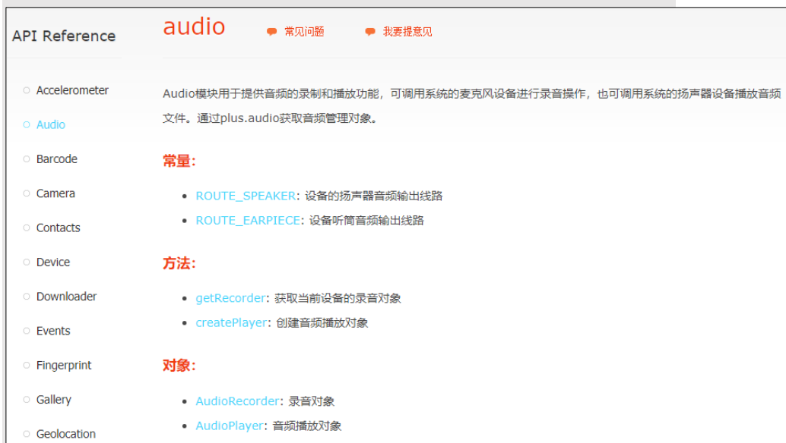
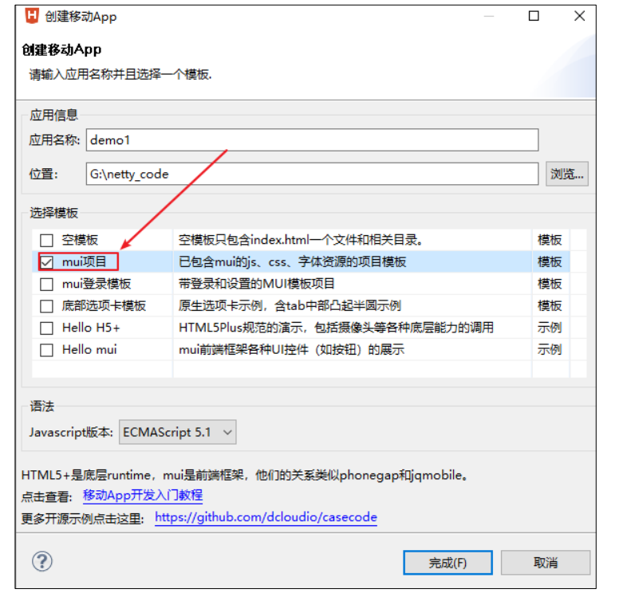
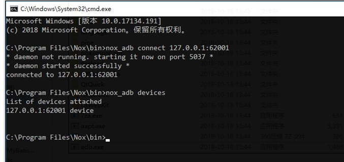
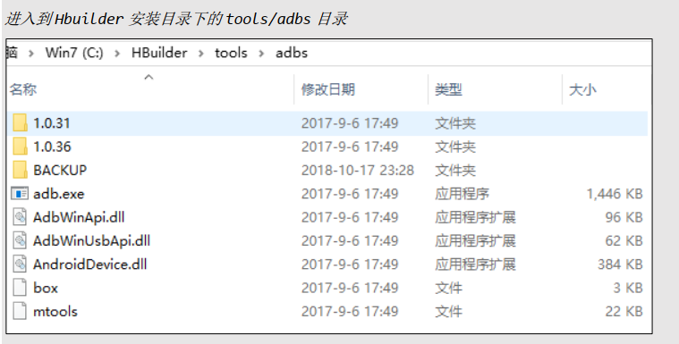
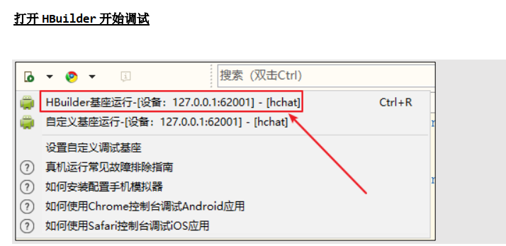

## MUI、 HTML5+、 HBuilder 介绍

### MUI 介绍

http://dev.dcloud.net.cn/mui/
MUI 是一个轻量级的前端框架。 MUI 以 iOS 平台 UI 为基础，补充部分 Android 平台特有的 UI 控件。 MUI 不依赖任
何第三方 JS 库，压缩后的 JS 和 CSS 文件仅有 100+K 和 60+K， 可以根据自己的需要，自定义去下载对应的模块。
并且 MUI 编写的前端， 可以打包成 APK 和 IPA 安装文件， 在手机端运行。也就是，编写一套代码，就可以在 Android、IOS 下运行  

API 地址： http://dev.dcloud.net.cn/mui/ui/

### H5+

H5+提供了对 HTML5 的增强， 提供了 40WAPI 给程序员使用。 使用 H5+ API 可以轻松开发二维码扫描、摄像头、地
图位置、消息推送等功能  



​	API 地址： http://www.html5plus.org/doc/zh_cn/accelerometer.html#  

### HBuilder  

前端开发工具。 本次项目所有的前端使用 HBuilder 开发。 在项目开发完后，也会使用 HBuilder 来进行打包Android/IOS 的安装包。

## MUI 前端开发  

### 创建项目/页面/添加 MUI 元素

#### 创建 MUI 移动 App 项目



http://dev.dcloud.net.cn/mui/ui/#accordion  

**例子**


## 夜神模拟器

### 连接

下载安装

在模拟器的bin目录执行如下命令



```sghell
//夜神模拟器默认端口
nox_adb connect 127.0.0.1:62001 
nox_adb devices
```



```
切换到命令行中执行以下命令
adb connect 127.0.0.1:62001
adb devices
```




### 夜神模拟器连不上 adb 问题解决方法

链接：https://www.jianshu.com/p/8af043534fc4

在做 android 测试过程中经常要用到夜神模拟器，但夜神模拟器连 adb 时并不是那么顺利，可能会出现各种问题。下面笔者把一些遇到并解决了的问题分享一下。

#### 1、SDK 的 adb 版本与夜神模拟器的 adb 版本不一致

如果 SDK 的 adb 版本与夜神模拟器的 adb 版本不一致，在命令行窗口输入命令`adb devices` 查看连接设备信息时经常会出现下面的错误提示：

```python
List of devices attached
adb server version (31) doesn't match this client (39); killing...
* daemon started successfully *
```

大家可以去看看两个 adb 的版本分别是多少。

SDK adb 版本查询命令`adb version`

夜神模拟器的 adb 版本查询命令`nox_adb version`

查出来以后会发现两个 adb 版本是不一样的，这里就不截图了。

**解决方法：**

1. 先关闭所有 adb 的进程；

2. 将 SDK 的 platform-tools 目录下的 adb.exe 文件复制到电脑任意路径下，并改名为 nox_adb.exe 。然后再把改名后的文件拷贝到夜神模拟器安装路径的 bin 1目录下替换原来的 nox_adb.exe 文件；（everything搜索）

   

3. 重启模拟器。

接着再进入命令行窗口输入命令`adb devices` 查看设备信息，这样就能正常显示出来了。

```python
List of devices attached
127.0.0.1:62001 device
```

#### 2、设备信息为空

另外还有的情况是在命令行输入命令`adb devices` 后设备信息为空。

```python
List of devices attached
```

这个时候可以先连接一下夜神 adb ，在命令行输入命令`nox_adb.exe connect 127.0.0.1:62001` ，然后再输入命令`adb devices` ，这个之后夜神模拟器的设备信息就能显示了。

```python
List of devices attached
127.0.0.1:62001 device
```

### [Android开发调试工具ADB的使用](https://www.cnblogs.com/meil/archive/2012/05/24/2516055.html)

ADB（Android Debug Bridge）是Android SDK中的一个工具, 使用ADB可以直接操作管理Android模拟器或者真实的Andriod设备。
  ADB主要功能有:

  1、在Android设备上运行Shell(命令行)
  2、管理模拟器或设备的端口映射
  3、在计算机和设备之间上传/下载文件
  4、将电脑上的本地APK软件安装至Android模拟器或设备上

https://www.cnblogs.com/meil/archive/2012/05/24/2516055.html