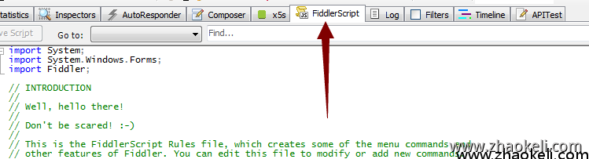
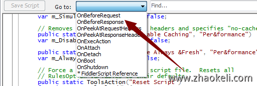
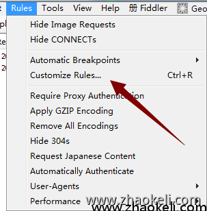
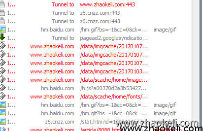

# 【Fiddler4.6.3】使用Fiddler Script 脚本控制断点修改请求和和响应数据(二)

来源:[赵克立博客](http://www.zhaokeli.com/) 分类:[ 其它](https://www.zhaokeli.com/cat/other.html) 标签：[网络安全](https://www.zhaokeli.com/tag/279.html)[fiddler](https://www.zhaokeli.com/tag/1454.html)发布时间:2017-01-07 18:34:25最后更新:2022-01-26 10:05:15浏览:10968

版权声明：

本文为博主原创文章，转载请声明原文链接...谢谢。o_0。

原文链接:

[http://www.zhaokeli.com /article/8089.html](http://www.zhaokeli.com/article/8089.html)

更新时间：

2022-01-26 10:05:15

温馨提示：

学无止境,技术类文章有它的时效性,请留意文章更新时间,如发现内容有误请留言指出,防止别人"踩坑",我会及时更新文章

- 概览

  [OnBeforeRequest在把请求发送给服务器之前调用](https://www.zhaokeli.com/article/8089.html#mulu0)

  [监测和修改请求主机](https://www.zhaokeli.com/article/8089.html#mulu1)

  [修改cookie，header头信息](https://www.zhaokeli.com/article/8089.html#mulu2)

  [修改post时的body里面的值(注意里面的值是&分隔的键值参数字符串)](https://www.zhaokeli.com/article/8089.html#mulu3)

  [禁止css请求](https://www.zhaokeli.com/article/8089.html#mulu4)

  [伪装user-agent头](https://www.zhaokeli.com/article/8089.html#mulu5)

  [OnBeforeResponse从服务器收到响应然后返回给浏览器之前调用](https://www.zhaokeli.com/article/8089.html#mulu6)

  [查找并且替换html](https://www.zhaokeli.com/article/8089.html#mulu7)

  [修改json类型](https://www.zhaokeli.com/article/8089.html#mulu8)

  [正则替换](https://www.zhaokeli.com/article/8089.html#mulu9)

  [在response返回的html中查找出指定字符串时把当前链接显示成红色(查找时不区分大小写)](https://www.zhaokeli.com/article/8089.html#mulu10)

  [移除响应内容中的所有div标签](https://www.zhaokeli.com/article/8089.html#mulu11)

  [远程Api接口替换响应数据](https://www.zhaokeli.com/article/8089.html#mulu12)

  [本地文件响应](https://www.zhaokeli.com/article/8089.html#mulu13)

  [本地目录响应](https://www.zhaokeli.com/article/8089.html#mulu14)

  [使用脚本控制断点功能](https://www.zhaokeli.com/article/8089.html#mulu15)

  [暂停所有post请求(断下后可以修改post的数据)](https://www.zhaokeli.com/article/8089.html#mulu16)

  [暂停所有包含指定关键字的post请求](https://www.zhaokeli.com/article/8089.html#mulu17)

  [暂停url中请求类型是xml的请求](https://www.zhaokeli.com/article/8089.html#mulu18)

  [暂停响应头是javascript类型的请求(一般用在修改响应数据的时候)](https://www.zhaokeli.com/article/8089.html#mulu19)


官方的Fiddler Script使用文档

http://docs.telerik.com/fiddler/KnowledgeBase/FiddlerScript/ModifyRequestOrResponse


打开fiddler后在右边找到下面选项来编辑脚本



打开go to 下拉框我看看下



这里是一些http经过代理时的事件,看名字应该就可以明白是什么意思啦,


没有上面这个选项卡的就打开菜单里的customize rules会自动打开一个页面让你下载一个扩展,安装后重启软件就可以看到啦



下面介绍两个常用的事件请求和响应


## OnBeforeRequest 在把请求发送给服务器之前调用


### 监测和修改请求主机

我们把要监测的请求链接给加成红色方便我们查看

在这个函数里添加下面代码,里面主机名改成你的就可以

复制代码

```
static function OnBeforeRequest(oSession: Session) {
    //添加颜色
    if (oSession.HostnameIs("www.zhaokeli.com")) {
        oSession["ui-color"] = "red";
    }
    //把指定主机重定向到另一个主机,并且把请求url给替换下
    if (oSession.HostnameIs("s29.xxxx.cn")||oSession.HostnameIs("s29.xxxx.cn")) {
        oSession.hostname="test.xxxxx.cn";
        oSession.url = oSession.url.Replace("/static/study_h5","");
        oSession.url = oSession.url.Replace("/static/common/js","");
      }
}
```

如下图,颜色已经为红色




### 修改cookie，header头信息

cookie是请求头里的一个字段,并不是像我们写程序设置cookies时的一个键对应一个值,直接就是一个cookies的字符串,因此我们可以把cookie清除掉重新添加

复制代码

```
static function OnBeforeRequest(oSession: Session) {
	// 删除所有的cookie
	oSession.oRequest.headers.Remove("Cookie");
	// 新建新的cookie
	oSession.oRequest.headers.Add("Cookie", "uuid=asdfasdfasdf;key=asdfasdf");
    //修改来源地址
    if (oSession.uriContains("www.xxxx.com")) {       
        oSession.oRequest["Referer"] = "www.xxxx.com"
     }
    //添加随机值强制刷新缓存
     if (oSession.uriContains("s29.9956.cn/static/study_h5")) {
        oSession.url = oSession.url+ "?"+ Math.random()*1000000;
    }
}
```

也可以使用替换字符串的方法对单个的cookie值进行修改

复制代码

```
static function OnBeforeRequest(oSession: Session) {
	//如果url里包含username并且请求头里包含cookie的话就修改cookie
	if(oSession.uriContains('username') &&oSession.oRequest.headers.Contains("Cookie")){
		//取出cookie字符串
		var sCookie = oSession.oRequest["Cookie"];
		//用replace方法或者正则表达式的方法去操作cookie的string
		sCookie = sCookie.Replace("strname", "replacename");
		//设置cookie
		oSession.oRequest["Cookie"] = sCookie;
	}
}
```


### 修改post时的body里面的值(注意里面的值是&分隔的键值参数字符串)

复制代码

```
static function OnBeforeRequest(oSession: Session) {
	//第一种修改方法,取出来再修改
	// 获取Request 中的body字符串
	var strBody=oSession.GetRequestBodyAsString();
	// 用正则表达式或者replace方法去修改string
	strBody=strBody.replace("1111","2222");
	// 弹个对话框检查下修改后的body
	FiddlerObject.alert(strBody);
	// 将修改后的body，重新写回Request中
	oSession.utilSetRequestBody(strBody);
	//第二种方法直接替换
	oSession.utilReplaceInRequest("1111", "2222");
}
```


### 禁止css请求

复制代码

```
if (oSession.uriContains(".css")){
 oSession["ui-color"]="orange";
 oSession["ui-bold"]="true";
 oSession.oRequest.FailSession(404, "Blocked", "Fiddler blocked CSS file");
}
```


### 伪装user-agent头 

复制代码

```
 oSession.oRequest["User-Agent"]="Googlebot/2.X (+http://www.googlebot.com/bot.html)";
```


## OnBeforeResponse从服务器收到响应然后返回给浏览器之前调用


### 查找并且替换html

复制代码

```
static function OnBeforeResponse(oSession: Session) {
    if (oSession.HostnameIs("www.zhaokeli.com") && oSession.oResponse.headers.ExistsAndContains("Content-Type","text/html")){
      oSession.utilDecodeResponse();
      oSession.utilReplaceInResponse('<b>','<u>');
    }
}
```


### 修改json类型

复制代码

```
oSession.utilDecodeResponse();
var str=oSession.GetResponseBodyAsString();
//替换内容
str=str.Replace("msg","message");
// 转成json对象修改内容
var json=Fiddler.WebFormats.JSON.JsonDecode(str);
json.JSONObject["code"]="200";
json.JSONObject["data"]["message"]="200";
oSession.utilSetResponseBody(Fiddler.WebFormats.JSON.JsonEncode(json.JSONObject));
```


### 正则替换

复制代码

```
// 解码响应内容
oSession.utilDecodeResponse();
var oBody = System.Text.Encoding.UTF8.GetString(oSession.responseBodyBytes);
// 使用正则进行替换
var oRegEx=/<\/head>/ig;
oBody = oBody.replace(oRegEx, "<script>alert(1);</script></head>");
//设置新的响应内容
oSession.utilSetResponseBody(oBody);
```


### 在response返回的html中查找出指定字符串时把当前链接显示成红色(查找时不区分大小写)

复制代码

```
if (oSession.oResponse.headers.ExistsAndContains("Content-Type", "text/html") && oSession.utilFindInResponse("searchfor", false)>-1){
  oSession["ui-color"] = "red";
}
```


### 移除响应内容中的所有div标签

复制代码

```
// 如果返回内容类型为 HTML, 那么移除所有的div标签
if (oSession.oResponse.headers.ExistsAndContains("Content-Type", "html")){
  // 解码响应内容
  oSession.utilDecodeResponse();
  var oBody = System.Text.Encoding.UTF8.GetString(oSession.responseBodyBytes);
  // 使用正则进行替换所有div标签
  var oRegEx = /<div[^>]*>|<\/div>/gi;
  oBody = oBody.replace(oRegEx, "");
  //设置新的响应内容
  oSession.utilSetResponseBody(oBody); 
}
```


### 远程Api接口替换响应数据

fiddler中提供的处理能力有限，使用下面同步请求方法,把响应内容发到一个接口中处理后再响应

复制代码

```
if (oSession.HostnameIs("goo.***com") && oSession.oResponse.headers.ExistsAndContains("Content-Type","application/json")){
    // 解码响应内容
    oSession.utilDecodeResponse();
    //把内容通过ajax http发送其它地方
    var _xhr = new ActiveXObject('Microsoft.XMLHTTP');
    var url = 'http://zkeli.com/dh/jm.php';
    //发送的数据参数
    var param = {
        data: oSession.GetResponseBodyAsString()
        };
    var par = '';
    for (var i in param) {
        var _data = escape(param[i]);
        par += par ? ("&" + i + "=" + _data) : (i + "=" + _data);
    }
    // 同步处理
    _xhr.open('POST', url, false);
    _xhr.setRequestHeader("Content-Type", "application/x-www-form-urlencoded");
    _xhr.setRequestHeader("X-Requested-With", "XMLHttpRequest");
    _xhr.send(par); 
    //FiddlerApplication.Log.LogString( oSession.GetResponseBodyAsString());
    //FiddlerApplication.Log.LogString("str:"+_xhr.responseText);
    //FiddlerApplication.Log.LogFormat("set result:{0}",_xhr.responseText);
     oSession.utilSetResponseBody(_xhr.responseText);
    
}
```


### 本地文件响应

复制代码

```
static function OnBeforeResponse(oSession: Session) {
    if (oSession.uriContains("header.js")) {
        oSession["x-replywithfile"] ="E:/mod.js";
    }
}
```


### 本地目录响应

先添加一个函函数

复制代码

```
static function AutoResponseFolder ( oSession: Session, domain:String, folder:String ) {
    // 获取当前对话的完整URL
    var fullUrl:String = oSession. fullUrl ;
    if ( fullUrl. StartsWith ( domain ) ) {
        var localPath:String = fullUrl. replace (domain, folder ) ;
        //set back color
        oSession [ 'ui-backcolor' ] = 'seashell' ;
        //set delay
        //oSession['response-trickle-delay'] = 2000;
        //replace server file
        oSession [ 'x-replywithfile' ] = localPath;
        //write log
        //FiddlerObject.log(localPath);
    }
}
```

在响应之前使用本地目录响应内容

复制代码

```
static function OnBeforeResponse(oSession: Session) {
    if (m_Hide304s && oSession.responseCode == 304) {
        oSession["ui-hide"] = "true";
    }
//    if (oSession.uriContains("app.min.js")) {
//        oSession["x-replywithfile"] ="E:/mod.js";
//    }
    //只要查到下面路径就进行本地目录替换
    var domain:String='https://s29.9956.cn/static/study_h5/';
    //本地目录
    var folder:String='E:/GitServer/bxd/rest-study/Public/static/';
    AutoResponseFolder(oSession,domain,folder);
}
```


## 使用脚本控制断点功能


### 暂停所有post请求(断下后可以修改post的数据)

复制代码

```
if (oSession.HTTPMethodIs("POST")){
  oSession["x-breakrequest"]="breaking for POST";
}
```


### 暂停所有包含指定关键字的post请求

复制代码

```
if (oSession.HTTPMethodIs("POST") && (oSession.utilFindInRequest("thekeyword", true) > -1)){
oSession["x-breakrequest"] = "keyword";
}
```


### 暂停url中请求类型是xml的请求

复制代码

```
if (oSession.url.toLowerCase().indexOf(".xml")>-1){
 oSession["x-breakrequest"]="reason_XML"; 
}
```


### 暂停响应头是javascript类型的请求(一般用在修改响应数据的时候)

复制代码

```
if (oSession.oResponse.headers.ExistsAndContains("Content-Type", "javascript")){
 oSession["x-breakresponse"]="reason is JScript"; 
}
```

还有很多功能请查看官方文档,都带的有示例