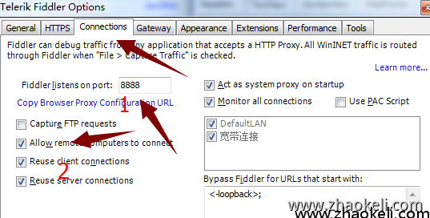
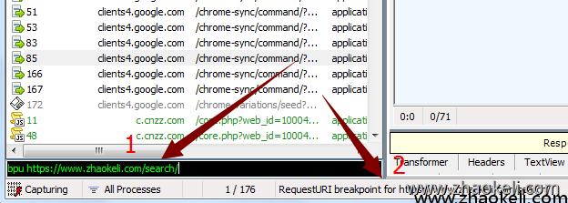
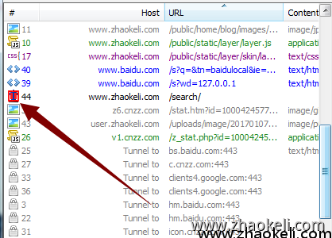
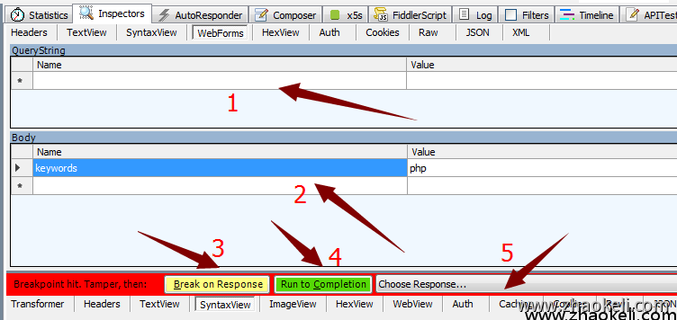
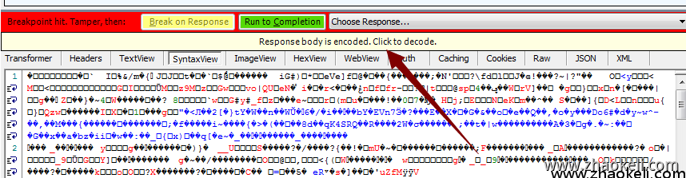
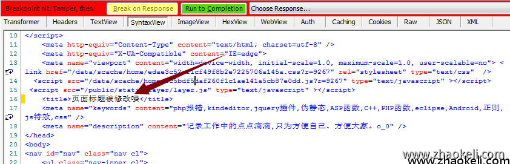

# 【Fiddler4.6.3】fiddler超简单临时修改响应内容的方法

来源:[赵克立博客](http://www.zhaokeli.com/) 分类:[ 其它](https://www.zhaokeli.com/cat/other.html) 标签：[fiddler](https://www.zhaokeli.com/tag/1454.html)发布时间:2017-01-07 17:29:40最后更新:2020-06-28 20:48:30浏览:10923

版权声明：

本文为博主原创文章，转载请声明原文链接...谢谢。o_0。

原文链接:

[http://www.zhaokeli.com /article/8088.html](http://www.zhaokeli.com/article/8088.html)

更新时间：

2020-06-28 20:48:30

温馨提示：

学无止境,技术类文章有它的时效性,请留意文章更新时间,如发现内容有误请留言指出,防止别人"踩坑",我会及时更新文章

- 概览

  [简易代理拦截功能](https://www.zhaokeli.com/article/8088.html#mulu0)

  [需要安装的软件](https://www.zhaokeli.com/article/8088.html#mulu1)

  [拦截页面的请求并进行修改](https://www.zhaokeli.com/article/8088.html#mulu2)

  [命令使用方法](https://www.zhaokeli.com/article/8088.html#mulu3)


### 简易代理拦截功能

[HttpProxy拦截保存下载](http://htp.59vip.cn/?a=help&c=index&m=index&tab_id=3)

有时候我们想拦截并修改网页发出请求,或在浏览器解析response返回数据之前把页面进行相应的修改,然后再在浏览器里呈现出来.

听起来很像被运行商劫持的页面一样,其实就是想要那种劫持住页面,进行修改后再返回给浏览器端的用户使用查看。完全实现运行商那种拦截修改可能不太可能,但是我们可以自己搭个代理实现功能，

下面我们使用fiddler就可以轻松的实现上面的功能


## 需要安装的软件 

fiddler(v4.6.3.50306)

chrome 谷歌浏览器(其它的浏览器也可以,只要你会设置代理就可以)

安装好首先使用fidler设置一个代理服务器,为啦让谷歌浏览器请求的页面走这个代理去请求数据,

打开tool->telerik fiddler options




代理地址为  http://localhost:8888 记下来,数字2是允许远程调试使用的,也就是可以让手机走这个代理,从而调试手机页面请求

然后设置谷歌浏览器的代理为上面的地址,其它浏览器也一样设置下代理就好


## 拦截页面的请求并进行修改

下面以我的博客搜索页面为例，打开fiddler 在最下面的命令行中输入下面命令,有这个请求经过时中断,注意如果只是输入域名不带后面的目录的话,整个网站的请求都会被中断,包括一些css,js等请求

复制代码

```
bpu https://www.zhaokeli.com/search/
```



输入后回车,会在2的位置看到当前会中断的断点请求,清除设置的断点方法为单独输入个 **bpu** 

打开博客输入php回车搜索


fiddler中就会拦截这个搜索请求如下图,看准那个中断的图标标志



选中后在后边窗口可以查看当前请求的数据



1. 当前get请求字符串
2. 当前post的数据
3. 点击这个后,当前请求会继续发送,并且会在数据返回时再次中断,
4. 直接继续运行完成,不会再中断
5. 选择一个返回值,选择后直接就返回给浏览器

在这个页面中的一些请求数据都可以进行修改,修改完成后再发送出去

在上面的界面中我们单击Break on Respose ，之后会收到一个返回的数据如下图



上面是服务器返回的数据,乱码看不懂,但是注意下图中箭头指向的一个按钮,点击后就会解析成我们能看懂的喽.



直接在这里修改网页的标题,然后点击run to completion 

浏览器中查看网页标题,已经被修改啦


## 命令使用方法

bpu [url] 在请求开始时中断 

bpafter [url] 在响应到达时中断 

bps [url]   在特定http状态码时中断

bpv/bpm [url] 在特定请求method时中断


下面文章介绍fiddler script使用脚本更灵活的处理请求的页面,下断点等强大功能

[使用Fiddler Script 脚本控制断点修改请求和返回数据](http://www.zhaokeli.com/article/8089.html)