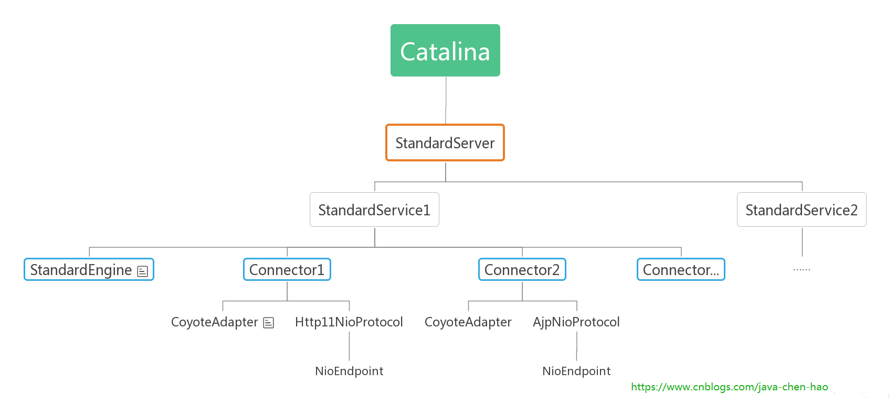

# [ Tomcat源码分析 （六）----- Tomcat 启动过程(一)](https://www.cnblogs.com/java-chen-hao/p/11344968.html)


**目录**

- 启动脚本
  - [startup.sh 脚本](https://www.cnblogs.com/java-chen-hao/p/11344968.html#_label0_0)
- Bootstrap.main
  - [Catalina.load](https://www.cnblogs.com/java-chen-hao/p/11344968.html#_label1_0)
  - [Service初始化](https://www.cnblogs.com/java-chen-hao/p/11344968.html#_label1_1)
  - [Engine初始化](https://www.cnblogs.com/java-chen-hao/p/11344968.html#_label1_2)
  - [Connector初始化](https://www.cnblogs.com/java-chen-hao/p/11344968.html#_label1_3)
- [总结](https://www.cnblogs.com/java-chen-hao/p/11344968.html#_label2)

 

**正文**

说到Tomcat的启动，我们都知道，我们每次需要运行tomcat/bin/startup.sh这个脚本，而这个脚本的内容到底是什么呢？我们来看看。

[回到顶部](https://www.cnblogs.com/java-chen-hao/p/11344968.html#_labelTop)

## 启动脚本


### startup.sh 脚本

[](javascript:void(0);)

```
#!/bin/sh
os400=false
case "`uname`" in
OS400*) os400=true;;
esac

# resolve links - $0 may be a softlink
PRG="$0"

while [ -h "$PRG" ] ; do
  ls=`ls -ld "$PRG"`
  link=`expr "$ls" : '.*-> \(.*\)$'`
  if expr "$link" : '/.*' > /dev/null; then
    PRG="$link"
  else
    PRG=`dirname "$PRG"`/"$link"
  fi
done

PRGDIR=`dirname "$PRG"`
EXECUTABLE=catalina.sh

# Check that target executable exists
if $os400; then
  # -x will Only work on the os400 if the files are:
  # 1. owned by the user
  # 2. owned by the PRIMARY group of the user
  # this will not work if the user belongs in secondary groups
  eval
else
  if [ ! -x "$PRGDIR"/"$EXECUTABLE" ]; then
    echo "Cannot find $PRGDIR/$EXECUTABLE"
    echo "The file is absent or does not have execute permission"
    echo "This file is needed to run this program"
    exit 1
  fi
fi

exec "$PRGDIR"/"$EXECUTABLE" start "$@"
```

[](javascript:void(0);)

我们来看看这脚本。该脚本中有2个重要的变量：

1. PRGDIR：表示当前脚本所在的路径
2. EXECUTABLE：catalina.sh 脚本名称
   其中最关键的一行代码就是 `exec "$PRGDIR"/"$EXECUTABLE" start "$@"`，表示执行了脚本catalina.sh，参数是start。

### catalina.sh 脚本

然后我们看看catalina.sh 脚本中的实现：

[](javascript:void(0);)

```
elif [ "$1" = "start" ] ; then

  if [ ! -z "$CATALINA_PID" ]; then
    if [ -f "$CATALINA_PID" ]; then
      if [ -s "$CATALINA_PID" ]; then
        echo "Existing PID file found during start."
        if [ -r "$CATALINA_PID" ]; then
          PID=`cat "$CATALINA_PID"`
          ps -p $PID >/dev/null 2>&1
          if [ $? -eq 0 ] ; then
            echo "Tomcat appears to still be running with PID $PID. Start aborted."
            echo "If the following process is not a Tomcat process, remove the PID file and try again:"
            ps -f -p $PID
            exit 1
          else
            echo "Removing/clearing stale PID file."
            rm -f "$CATALINA_PID" >/dev/null 2>&1
            if [ $? != 0 ]; then
              if [ -w "$CATALINA_PID" ]; then
                cat /dev/null > "$CATALINA_PID"
              else
                echo "Unable to remove or clear stale PID file. Start aborted."
                exit 1
              fi
            fi
          fi
        else
          echo "Unable to read PID file. Start aborted."
          exit 1
        fi
      else
        rm -f "$CATALINA_PID" >/dev/null 2>&1
        if [ $? != 0 ]; then
          if [ ! -w "$CATALINA_PID" ]; then
            echo "Unable to remove or write to empty PID file. Start aborted."
            exit 1
          fi
        fi
      fi
    fi
  fi

  shift
  touch "$CATALINA_OUT"
  if [ "$1" = "-security" ] ; then
    if [ $have_tty -eq 1 ]; then
      echo "Using Security Manager"
    fi
    shift
    eval $_NOHUP "\"$_RUNJAVA\"" "\"$LOGGING_CONFIG\"" $LOGGING_MANAGER $JAVA_OPTS $CATALINA_OPTS \
      -classpath "\"$CLASSPATH\"" \
      -Djava.security.manager \
      -Djava.security.policy=="\"$CATALINA_BASE/conf/catalina.policy\"" \
      -Dcatalina.base="\"$CATALINA_BASE\"" \
      -Dcatalina.home="\"$CATALINA_HOME\"" \
      -Djava.io.tmpdir="\"$CATALINA_TMPDIR\"" \
      org.apache.catalina.startup.Bootstrap "$@" start \
      >> "$CATALINA_OUT" 2>&1 "&"

  else
    eval $_NOHUP "\"$_RUNJAVA\"" "\"$LOGGING_CONFIG\"" $LOGGING_MANAGER $JAVA_OPTS $CATALINA_OPTS \
      -classpath "\"$CLASSPATH\"" \
      -Dcatalina.base="\"$CATALINA_BASE\"" \
      -Dcatalina.home="\"$CATALINA_HOME\"" \
      -Djava.io.tmpdir="\"$CATALINA_TMPDIR\"" \
      org.apache.catalina.startup.Bootstrap "$@" start \
      >> "$CATALINA_OUT" 2>&1 "&"

  fi

  if [ ! -z "$CATALINA_PID" ]; then
    echo $! > "$CATALINA_PID"
  fi

  echo "Tomcat started."
```

[](javascript:void(0);)

该脚本很长，但我们只关心我们感兴趣的：如果参数是 `start`， 那么执行这里的逻辑，关键再最后一行执行了 `org.apache.catalina.startup.Bootstrap "$@" start`， 也就是说，执行了我们熟悉的main方法，并且携带了start 参数，那么我们就来看Bootstrap 的main方法是如何实现的。

[回到顶部](https://www.cnblogs.com/java-chen-hao/p/11344968.html#_labelTop)

## Bootstrap.main

首先我们启动 main 方法:

[](javascript:void(0);)

```
public static void main(String args[]) {
    System.err.println("Have fun and Enjoy! cxs");

    // daemon 就是 bootstrap
    if (daemon == null) {
        Bootstrap bootstrap = new Bootstrap();
        try {
            //类加载机制我们前面已经讲过，在这里就不在重复了
            bootstrap.init();
        } catch (Throwable t) {
            handleThrowable(t);
            t.printStackTrace();
            return;
        }
        daemon = bootstrap;
    } else {
        Thread.currentThread().setContextClassLoader(daemon.catalinaLoader);
    }
    try {
        // 命令
        String command = "start";
        // 如果命令行中输入了参数
        if (args.length > 0) {
            // 命令 = 最后一个命令
            command = args[args.length - 1];
        }
        // 如果命令是启动
        if (command.equals("startd")) {
            args[args.length - 1] = "start";
            daemon.load(args);
            daemon.start();
        }
        // 如果命令是停止了
        else if (command.equals("stopd")) {
            args[args.length - 1] = "stop";
            daemon.stop();
        }
        // 如果命令是启动
        else if (command.equals("start")) {
            daemon.setAwait(true);// bootstrap 和 Catalina 一脉相连, 这里设置, 方法内部设置 Catalina 实例setAwait方法
            daemon.load(args);// args 为 空,方法内部调用 Catalina 的 load 方法.
            daemon.start();// 相同, 反射调用 Catalina 的 start 方法 ,至此,启动结束
        } else if (command.equals("stop")) {
            daemon.stopServer(args);
        } else if (command.equals("configtest")) {
            daemon.load(args);
            if (null==daemon.getServer()) {
                System.exit(1);
            }
            System.exit(0);
        } else {
            log.warn("Bootstrap: command \"" + command + "\" does not exist.");
        }
    } catch (Throwable t) {
        // Unwrap the Exception for clearer error reporting
        if (t instanceof InvocationTargetException &&
                t.getCause() != null) {
            t = t.getCause();
        }
        handleThrowable(t);
        t.printStackTrace();
        System.exit(1);
    }
}
```

[](javascript:void(0);)

我们来看看bootstrap.init();的部分代码

[](javascript:void(0);)

```
public void init() throws Exception {

    // 类加载机制我们前面已经讲过，在这里就不在重复了
    initClassLoaders();

    Thread.currentThread().setContextClassLoader(catalinaLoader);
    SecurityClassLoad.securityClassLoad(catalinaLoader);

    // 反射方法实例化Catalina
    Class<?> startupClass = catalinaLoader.loadClass("org.apache.catalina.startup.Catalina");
    Object startupInstance = startupClass.getConstructor().newInstance();

   
    String methodName = "setParentClassLoader";
    Class<?> paramTypes[] = new Class[1];
    paramTypes[0] = Class.forName("java.lang.ClassLoader");
    Object paramValues[] = new Object[1];
    paramValues[0] = sharedLoader;
    Method method =
        startupInstance.getClass().getMethod(methodName, paramTypes);
    method.invoke(startupInstance, paramValues);

    // 引用Catalina实例
    catalinaDaemon = startupInstance;
}
```

[](javascript:void(0);)

我们可以看到是通过反射实例化Catalina类，并将实例引用赋值给catalinaDaemon,接着我们看看**daemon.load(args);**

[](javascript:void(0);)

```
private void load(String[] arguments)
    throws Exception {

    // Call the load() method
    String methodName = "load";
    Object param[];
    Class<?> paramTypes[];
    if (arguments==null || arguments.length==0) {
        paramTypes = null;
        param = null;
    } else {
        paramTypes = new Class[1];
        paramTypes[0] = arguments.getClass();
        param = new Object[1];
        param[0] = arguments;
    }
    Method method =
        catalinaDaemon.getClass().getMethod(methodName, paramTypes);
    if (log.isDebugEnabled())
        log.debug("Calling startup class " + method);
    //通过反射调用Catalina的load()方法
    method.invoke(catalinaDaemon, param);

}
```

[](javascript:void(0);)


### Catalina.load

我们可以看到daemon.load(args)实际上就是通过反射调用Catalina的load()方法.那么我们进入 Catalina 类的 load 方法看看:

[](javascript:void(0);)

```
public void load() {

    initDirs();

    // 初始化jmx的环境变量
    initNaming();

    // Create and execute our Digester
    // 定义解析server.xml的配置，告诉Digester哪个xml标签应该解析成什么类
    Digester digester = createStartDigester();

    InputSource inputSource = null;
    InputStream inputStream = null;
    File file = null;
    try {

      // 首先尝试加载conf/server.xml，省略部分代码......
      // 如果不存在conf/server.xml，则加载server-embed.xml(该xml在catalina.jar中)，省略部分代码......
      // 如果还是加载不到xml，则直接return，省略部分代码......

      try {
          inputSource.setByteStream(inputStream);

          // 把Catalina作为一个顶级实例
          digester.push(this);

          // 解析过程会实例化各个组件，比如Server、Container、Connector等
          digester.parse(inputSource);
      } catch (SAXParseException spe) {
          // 处理异常......
      }
    } finally {
        // 关闭IO流......
    }

    // 给Server设置catalina信息
    getServer().setCatalina(this);
    getServer().setCatalinaHome(Bootstrap.getCatalinaHomeFile());
    getServer().setCatalinaBase(Bootstrap.getCatalinaBaseFile());

    // Stream redirection
    initStreams();

    // 调用Lifecycle的init阶段
    try {
        getServer().init();
    } catch (LifecycleException e) {
        // ......
    }

    // ......

}
```

[](javascript:void(0);)

### Server初始化

可以看到, 这里有一个我们今天感兴趣的方法, getServer.init(), 这个方法看名字是启动 Server 的初始化, 而 Server 是我们上面图中最外层的容器. 因此, 我们去看看该方法, 也就是LifecycleBase.init() 方法. 该方法是一个模板方法, 只是定义了一个算法的骨架, 将一些细节算法放在子类中去实现.我们看看该方法:

**LifecycleBase.init()**

[](javascript:void(0);)

```
@Override
public final synchronized void init() throws LifecycleException {
    // 1
    if (!state.equals(LifecycleState.NEW)) {
        invalidTransition(Lifecycle.BEFORE_INIT_EVENT);
    }
    // 2
    setStateInternal(LifecycleState.INITIALIZING, null, false);

    try {
        // 模板方法
        /**
         * 采用模板方法模式来对所有支持生命周期管理的组件的生命周期各个阶段进行了总体管理，
         * 每个需要生命周期管理的组件只需要继承这个基类，
         * 然后覆盖对应的钩子方法即可完成相应的声明周期阶段的管理工作
         */
        initInternal();
    } catch (Throwable t) {
        ExceptionUtils.handleThrowable(t);
        setStateInternal(LifecycleState.FAILED, null, false);
        throw new LifecycleException(
                sm.getString("lifecycleBase.initFail",toString()), t);
    }

    // 3
    setStateInternal(LifecycleState.INITIALIZED, null, false);
}
```

[](javascript:void(0);)

`Server`的实现类为`StandardServer`，我们分析一下**`StandardServer.initInternal()`**方法。该方法用于对`Server`进行初始化，关键的地方就是代码最后对services的循环操作，对每个service调用init方法。
【注】：这儿我们只粘贴出这部分代码。

**StandardServer.initInternal()**

[](javascript:void(0);)

```
@Override
protected void initInternal() throws LifecycleException {
    super.initInternal();

    // Initialize our defined Services
    for (int i = 0; i < services.length; i++) {
        services[i].init();
    }
}
```

[](javascript:void(0);)

调用Service子容器的init方法，让Service组件完成初始化，注意：在同一个Server下面，可能存在多个Service组件.


### Service初始化

StandardService和StandardServer都是继承至LifecycleMBeanBase，因此公共的初始化逻辑都是一样的，这里不做过多介绍，我们直接看下initInternal

***\*StandardService.\**initInternal()**

[](javascript:void(0);)

```
protected void initInternal() throws LifecycleException {

    // 往jmx中注册自己
    super.initInternal();

    // 初始化Engine
    if (engine != null) {
        engine.init();
    }

    // 存在Executor线程池，则进行初始化，默认是没有的
    for (Executor executor : findExecutors()) {
        if (executor instanceof JmxEnabled) {
            ((JmxEnabled) executor).setDomain(getDomain());
        }
        executor.init();
    }

    mapperListener.init();

    // 初始化Connector，而Connector又会对ProtocolHandler进行初始化，开启应用端口的监听,
    synchronized (connectorsLock) {
        for (Connector connector : connectors) {
            try {
                connector.init();
            } catch (Exception e) {
                // 省略部分代码，logger and throw exception
            }
        }
    }
}
```

[](javascript:void(0);)

1. 首先，往jmx中注册StandardService
2. 初始化Engine，而Engine初始化过程中会去初始化Realm(权限相关的组件)
3. 如果存在Executor线程池，还会进行init操作，这个Excecutor是tomcat的接口，继承至java.util.concurrent.Executor、org.apache.catalina.Lifecycle
4. 初始化Connector连接器，默认有http1.1、ajp连接器，而这个Connector初始化过程，又会对ProtocolHandler进行初始化，开启应用端口的监听，后面会详细分析


### Engine初始化

StandardEngine初始化的代码如下：

[](javascript:void(0);)

```
@Override
protected void initInternal() throws LifecycleException {
    getRealm();
    super.initInternal();
}

public Realm getRealm() {
    Realm configured = super.getRealm();
    if (configured == null) {
        configured = new NullRealm();
        this.setRealm(configured);
    }
    return configured;
}
```

[](javascript:void(0);)

StandardEngine继承至ContainerBase，而ContainerBase重写了initInternal()方法，用于初始化start、stop线程池，这个线程池有以下特点：
\1. core线程和max是相等的，默认为1
\2. 允许core线程在超时未获取到任务时退出线程
\3. 线程获取任务的超时时间是10s，也就是说所有的线程(包括core线程)，超过10s未获取到任务，那么这个线程就会被销毁

这么做的初衷是什么呢？因为这个线程池只需要在容器启动和停止的时候发挥作用，没必要时时刻刻处理任务队列

ContainerBase的代码如下所示：

[](javascript:void(0);)

```
// 默认是1个线程
private int startStopThreads = 1;
protected ThreadPoolExecutor startStopExecutor;

@Override
protected void initInternal() throws LifecycleException {
    BlockingQueue<Runnable> startStopQueue = new LinkedBlockingQueue<>();
    startStopExecutor = new ThreadPoolExecutor(
            getStartStopThreadsInternal(),
            getStartStopThreadsInternal(), 10, TimeUnit.SECONDS,
            startStopQueue,
            new StartStopThreadFactory(getName() + "-startStop-"));
    // 允许core线程超时未获取任务时退出
    startStopExecutor.allowCoreThreadTimeOut(true);
    super.initInternal();
}

private int getStartStopThreadsInternal() {
    int result = getStartStopThreads();

    if (result > 0) {
        return result;
    }
    result = Runtime.getRuntime().availableProcessors() + result;
    if (result < 1) {
        result = 1;
    }
    return result;
}
```

[](javascript:void(0);)

这个startStopExecutor线程池有什么用呢？

1. 在start的时候，如果发现有子容器，则会把子容器的start操作放在线程池中进行处理
2. 在stop的时候，也会把stop操作放在线程池中处理

在前面的文章中我们介绍了Container组件，StandardEngine作为顶层容器，它的直接子容器是StardandHost，但是对StandardEngine的代码分析，我们并没有发现它会对子容器StardandHost进行初始化操作，StandardEngine不按照套路出牌，而是把初始化过程放在start阶段。个人认为Host、Context、Wrapper这些容器和具体的webapp应用相关联了，初始化过程会更加耗时，因此在start阶段用多线程完成初始化以及start生命周期，否则，像顶层的Server、Service等组件需要等待Host、Context、Wrapper完成初始化才能结束初始化流程，整个初始化过程是具有传递性的


### Connector初始化

Connector初始化会在后面有专门的Connector文章讲解

[回到顶部](https://www.cnblogs.com/java-chen-hao/p/11344968.html#_labelTop)

## 总结

至此，整个初始化过程便告一段落。整个初始化过程，由parent组件控制child组件的初始化，一层层往下传递，直到最后全部初始化OK。下图描述了整体的传递流程 



默认情况下，Server只有一个Service组件，Service组件先后对Engine、Connector进行初始化。而Engine组件并不会在初始化阶段对子容器进行初始化，Host、Context、Wrapper容器的初始化是在start阶段完成的。tomcat默认会启用HTTP1.1和AJP的Connector连接器，这两种协议默认使用Http11NioProtocol、AJPNioProtocol进行处理

分类: [Tomcat源码解析](https://www.cnblogs.com/java-chen-hao/category/1516344.html)

[好文要顶](javascript:void(0);) [关注我](javascript:void(0);) [收藏该文](javascript:void(0);) [微信分享](javascript:void(0);)

[« ](https://www.cnblogs.com/java-chen-hao/p/11341004.html)上一篇： [Tomcat源码分析 （五）----- Tomcat 类加载器](https://www.cnblogs.com/java-chen-hao/p/11341004.html)
[» ](https://www.cnblogs.com/java-chen-hao/p/11344993.html)下一篇： [Tomcat源码分析 （七）----- Tomcat 启动过程(二)](https://www.cnblogs.com/java-chen-hao/p/11344993.html)

posted @ 2019-08-16 16:23  阅读(3011) 评论(0)   


发表评论 [升级成为园子VIP会员](https://cnblogs.vip/)


 自动补全

[退出](javascript:void(0);)[订阅评论](javascript:void(0);)[我的博客](https://www.cnblogs.com/Carl-Don/)

[Ctrl+Enter快捷键提交]

[【推荐】还在用 ECharts 开发大屏？试试这款永久免费的开源 BI 工具！](https://dataease.cn/?utm_source=cnblogs)
[【推荐】编程新体验，更懂你的AI，立即体验豆包MarsCode编程助手](https://www.marscode.cn/?utm_source=advertising&utm_medium=cnblogs.com_ug_cpa&utm_term=hw_marscode_cnblogs&utm_content=home)
[【推荐】凌霞软件回馈社区，博客园 & 1Panel & Halo 联合会员上线](https://www.cnblogs.com/cmt/p/18669224)
[【推荐】抖音旗下AI助手豆包，你的智能百科全书，全免费不限次数](https://www.doubao.com/?channel=cnblogs&source=hw_db_cnblogs)
[【推荐】博客园社区专享云产品让利特惠，阿里云新客6.5折上折](https://market.cnblogs.com/)
[【推荐】轻量又高性能的 SSH 工具 IShell：AI 加持，快人一步](http://ishell.cc/)

[](https://www.doubao.com/chat/coding?channel=cnblogs&source=hw_db_cnblogs)

**编辑推荐：**
· [用 C# 插值字符串处理器写一个 sscanf](https://www.cnblogs.com/hez2010/p/18718386/csharp-interpolated-string-sscanf)
· [Java 中堆内存和栈内存上的数据分布和特点](https://www.cnblogs.com/emanjusaka/p/18709398)
· [开发中对象命名的一点思考](https://www.cnblogs.com/CareySon/p/18711135)
· [.NET Core内存结构体系(Windows环境)底层原理浅谈](https://www.cnblogs.com/lmy5215006/p/18707150)
· [C# 深度学习：对抗生成网络(GAN)训练头像生成模型](https://www.cnblogs.com/whuanle/p/18708861)

**阅读排行：**
· [趁着过年的时候手搓了一个低代码框架](https://www.cnblogs.com/codelove/p/18719305)
· [本地部署DeepSeek后，没有好看的交互界面怎么行！](https://www.cnblogs.com/xiezhr/p/18718693)
· [为什么说在企业级应用开发中，后端往往是效率杀手？](https://www.cnblogs.com/jackyfei/p/18712595)
· [AI工具推荐：领先的开源 AI 代码助手——Continue](https://www.cnblogs.com/mingupupu/p/18716802)
· [用 C# 插值字符串处理器写一个 sscanf](https://www.cnblogs.com/hez2010/p/18718386/csharp-interpolated-string-sscanf)

Copyright © 2025 chen_hao
Powered by .NET 9.0 on Kubernetes