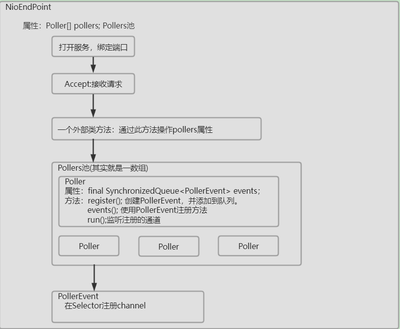
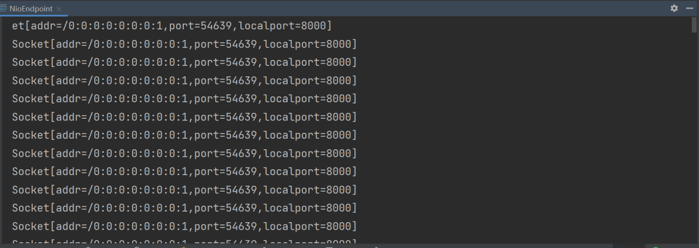
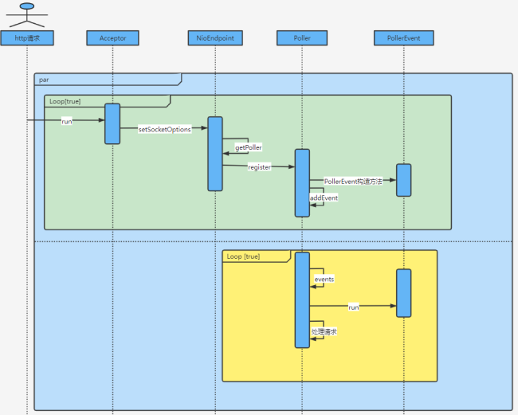

[](https://www.doubao.com/?channel=cnblogs&source=hw_db_cnblogs)

[](https://www.cnblogs.com/yishi-san/)

# [一十三](https://www.cnblogs.com/yishi-san)

## 

- [博客园](https://www.cnblogs.com/)
- [首页](https://www.cnblogs.com/yishi-san/)
- 
- [联系](https://msg.cnblogs.com/send/一十三)
- 
- [管理](https://i.cnblogs.com/)

随笔 - 20 文章 - 1 评论 - 1 阅读 - 13277

# [Tomcat源码分析使用NIO接收HTTP请求(一)----简单实现Acceptor、Poller、PollerEvent](https://www.cnblogs.com/yishi-san/p/16900079.html)

注：本文基于Tomcat8.5撰写

下面的代码主要功能是使用NIO来接收一次http请求，主要包括三个步骤：

 1.打开服务器通道接收请求

 2.接收请求后注册通道 

 3.输出请求的内容。

这个示例是极其简单的，在下一小节笔者会在此示例基础上来探讨Tomcat是如何接收http请求的。

[](javascript:void(0);)

```
public static void main(String[] args) {
    try {
        // 打开服务器套接字通道
        ServerSocketChannel serverSock = ServerSocketChannel.open();
        // 绑定端口
        InetSocketAddress address = new InetSocketAddress(8001);
        serverSock.socket().bind(address);
        // 设置阻塞模式
        serverSock.configureBlocking(true);
        SocketChannel socket;
        Selector selector = Selector.open();
        ByteBuffer byteBuffer = ByteBuffer.allocate(1000);

        while(true) {
            // 接收请求
            socket = serverSock.accept();
            socket.configureBlocking(false);
            // 注册通道
            socket.register(selector, SelectionKey.OP_READ);
            int keyCount = selector.selectNow();

            // 处理请求
            Iterator<SelectionKey> iterator = null;
            if ( keyCount > 0) {
                iterator = selector.selectedKeys().iterator();
            }
            while (iterator != null && iterator.hasNext()) {
                    SelectionKey key = iterator.next();
                    iterator.remove();
                    if (key.isReadable()) {
                        key.interestOps(key.interestOps() & (~key.readyOps()));
                        SocketChannel channel = (SocketChannel) key.channel();
                        boolean flag = true;
                        while (flag) {
                            int count = channel.read(byteBuffer);
                            if (count > 0) {
                                flag = false;
                                // 解析请求
                                System.out.println(new String(byteBuffer.array()));
                            }
                            Thread.sleep(2000);
                        }
                    }
            }
        }
    } catch (Exception e) {
        e.printStackTrace();
    }
}
```

[](javascript:void(0);)

### Tomcat接收Http请求

在上一小节中介绍了使用NIO接收Http请求的三个主要步骤，第一步是很简单的，除了使用的bind方法不同以外，其余并没有太大差别。这里着重探讨一下第二步，即Tomcat如何接收一个Http请求。Tomcat使用NIO接收请求的类叫NioEndpoint，在这个类中定义了五个内部类用来处理请求。第一个类叫Acceptor，它的主要作用是等待连接(SocketChannel)，当有连接到来时Tomcat会使用PollerEvent对连接进行注册，注册后Tomcat会使用Poller处理请求事件，当Poller获取到请求事件后会将请求交给SocketProcessor类进行解析。以上对Tomcat处理请求的文字描述所对应的代码思路就是上一小节while循环中的注释。到目前为止我们已经知道了四个类，第五个类是NioSocketWrapper，这个主要用来包装SocketChannel。Tomcat会将SocketChannel包装成NioChannel进而在包装成NioSocketWrapper，至此Tomcat处理http请求所需要的五个类就介绍完了，接下来让我们来写几行代码，来实现上述逻辑。

### 实现Acceptor、Poller、PollerEvent

首先让我们先将目光聚焦在Acceptor、Poller、PollerEvent这三个内部组件。接下来要写的代码主要 目的是理解这三个组件，下面这张图简单描述了我们即将要开始的示例程序。 



 首先新建一个简单的java工程即可，并新建一个名为NioEndpoint的类。

[](javascript:void(0);)

```
public class NioEndpoint {
    protected volatile ServerSocketChannel serverSock = null;
    protected int pollerThreadCount = Math.min(2,Runtime.getRuntime().availableProcessors());
    protected Poller[] pollers = null;
    private AtomicInteger pollerRotater = new AtomicInteger(0);
    public static final int OP_REGISTER = 0x100;
    ......
    public Poller getPoller0() {
        int idx = Math.abs(pollerRotater.incrementAndGet()) % pollers.length;
        return pollers[idx];
    }
    ......
}
```

[](javascript:void(0);)

第二步：新建一个bind方法

[](javascript:void(0);)

```
protected void bind() {
    try {
        // 打开服务器套接字通道
        serverSock = ServerSocketChannel.open();
        // 绑定端口
        InetSocketAddress address = new InetSocketAddress(8000);
        int acceptCount = 10;
        serverSock.socket().bind(address, acceptCount);
        // 设置阻塞模式
        serverSock.configureBlocking(true);
    } catch (Exception e) {
        e.printStackTrace();
    }
}
```

[](javascript:void(0);)

第三步：新建Acceptor内部类

[](javascript:void(0);)

```
protected class Acceptor implements Runnable{
    @Override
    public void run() {
        SocketChannel socket = null;
        while (true) {
            try {
                // 接收请求
                socket = serverSock.accept();
                setSocketOptions(socket);
                Thread.sleep(2000);
            } catch (Exception e) {
                e.printStackTrace();
            }
        }
    }
}
```

[](javascript:void(0);)

第四步:新建setSocketOptions()方法

[](javascript:void(0);)

```
protected void setSocketOptions(SocketChannel socket) {
    try {
        socket.configureBlocking(false);
        getPoller0().register(socket);
    } catch (Exception e) {
    }
}
```

[](javascript:void(0);)

第五步:新建SynchronizedQueue类(这个不是内部类)

[](javascript:void(0);)

```
public class SynchronizedQueue<T> {

    public static final int DEFAULT_SIZE = 128;

    private Object[] queue;
    private int size;
    private int insert = 0;
    private int remove = 0;

    public SynchronizedQueue() {
        this(DEFAULT_SIZE);
    }

    public SynchronizedQueue(int initialSize) {
        queue = new Object[initialSize];
        size = initialSize;
    }

    public synchronized boolean offer(T t) {
        queue[insert++] = t;

        // Wrap
        if (insert == size) {
            insert = 0;
        }

        if (insert == remove) {
            expand();
        }
        return true;
    }

    public synchronized T poll() {
        if (insert == remove) {
            // empty
            return null;
        }

        @SuppressWarnings("unchecked")
        T result = (T) queue[remove];
        queue[remove] = null;
        remove++;

        // Wrap
        if (remove == size) {
            remove = 0;
        }

        return result;
    }

    private void expand() {
        int newSize = size * 2;
        Object[] newQueue = new Object[newSize];

        System.arraycopy(queue, insert, newQueue, 0, size - insert);
        System.arraycopy(queue, 0, newQueue, size - insert, insert);

        insert = size;
        remove = 0;
        queue = newQueue;
        size = newSize;
    }

    public synchronized int size() {
        int result = insert - remove;
        if (result < 0) {
            result += size;
        }
        return result;
    }

    public synchronized void clear() {
        queue = new Object[size];
        insert = 0;
        remove = 0;
    }
}
```

[](javascript:void(0);)

第六步：新建Poller内部类

[](javascript:void(0);)

```
public class Poller implements Runnable {
    private Selector selector;
    private volatile int keyCount = 0;
    private final SynchronizedQueue<PollerEvent> events =
            new SynchronizedQueue<>();

    public Poller() throws IOException {
        this.selector = Selector.open();
    }

    @Override
    public void run() {
        try {
            while (true) {
                events();
                keyCount = selector.selectNow();
                Iterator<SelectionKey> iterator = null;
                if ( keyCount > 0) {
                    iterator = selector.selectedKeys().iterator();
                }
                while (iterator != null && iterator.hasNext()) {
                    SelectionKey sk = iterator.next();
                    iterator.remove();
                    SocketChannel socket = (SocketChannel) sk.attachment();
                    // 得到socket用于进行后续处理......
                    System.out.println(socket.socket());
                }
            }
        } catch (Exception e) {
            e.printStackTrace();
        }
    }

    public void register(final SocketChannel socket) {
        PollerEvent r = new PollerEvent(socket, this,OP_REGISTER);
        addEvent(r);
    }

    private void addEvent(PollerEvent event) {
        events.offer(event);
    }

    public boolean events() {
        boolean result = false;

        PollerEvent pe = null;
        for (int i = 0, size = events.size(); i < size && (pe = events.poll()) != null; i++ ) {
            result = true;
            try {
                pe.run();
                pe.reset();
            } catch ( Throwable x ) {
            }
        }

        return result;
    }

    public Selector getSelector() {
        return selector;
    }
}
```

[](javascript:void(0);)

第七步：新建PollerEvent内部类

[](javascript:void(0);)

```
public static class PollerEvent implements Runnable {
    private SocketChannel socket;
    private int interestOps;
    private Poller poller;

    public PollerEvent(SocketChannel socket,Poller poller, int intOps) {
        reset(socket, poller, intOps);
    }

    @Override
    public void run() {
        if (interestOps == OP_REGISTER) {
            try {
                socket.register(
                        poller.getSelector(), SelectionKey.OP_READ, socket);
            } catch (Exception e) {
            }
        }
    }

    public void reset(SocketChannel socket, Poller poller, int intOps) {
        this.socket = socket;
        interestOps = intOps;
        this.poller = poller;
    }

    public void reset() {
        reset(null, null, 0);
    }
}
```

[](javascript:void(0);)

第八步：实现main方法

[](javascript:void(0);)

```
public static void main(String[] args) {
    try {
        NioEndpoint server = new NioEndpoint();

        server.bind();

        server.pollers = new Poller[server.pollerThreadCount];
        for (int i=0; i<server.pollers.length; i++) {
            server.pollers[i] = server.new Poller();
            Thread pollerThread = new Thread(server.pollers[i]);
            // 设置线程优先级
            pollerThread.setPriority(5);
            // 设置守护线程
            pollerThread.setDaemon(true);
            pollerThread.start();
        }

        Runnable acceptor = server.new Acceptor();
        new Thread(acceptor).start();
    } catch (Exception e) {
        e.printStackTrace();
    }
}
```

[](javascript:void(0);)

运行main方法后发送http://localhost:8000/请求结果如下图，在这里仅仅是打印了socket对象。



 上面的示例程序是根据Tomcat源码抽简而来，其主要目的是想让读者理解Acceptor、Poller、PollerEvent这三个组件是如何相互影响的。下面的时序图展示一次请求被程序处理的过程。



在示例程序中，我们在main方法中创建了Acceptor等组件，而在Tomcat源码中是在startInternal()方法中创建组件的。读者可以先从该方法开始阅读Tomcat源码，并且把当下的阅读重点放在Acceptor、Poller、PollerEvent这三个组件是如何接收一次请求的，先从整体上有一个大致了解为之后打下基础。在接下来我们需要继续来完善上述代码。

 

结束！！！

分类: [Tomcat](https://www.cnblogs.com/yishi-san/category/2203390.html)

[好文要顶](javascript:void(0);) [关注我](javascript:void(0);) [收藏该文](javascript:void(0);) [微信分享](javascript:void(0);)

[](https://home.cnblogs.com/u/yishi-san/)

[一十三](https://home.cnblogs.com/u/yishi-san/)
[粉丝 - 2](https://home.cnblogs.com/u/yishi-san/followers/) [关注 - 1](https://home.cnblogs.com/u/yishi-san/followees/)

[+加关注](javascript:void(0);)

1

0

[升级成为会员](https://cnblogs.vip/)

[« ](https://www.cnblogs.com/yishi-san/p/16609553.html)上一篇： [Tomcat源码分析--类加载器](https://www.cnblogs.com/yishi-san/p/16609553.html)
[» ](https://www.cnblogs.com/yishi-san/p/16900237.html)下一篇： [Tomcat源码分析使用NIO接收HTTP请求(二)----使用NioSocketWrapper封装SocketChannel](https://www.cnblogs.com/yishi-san/p/16900237.html)

posted @ 2022-11-17 17:18 [一十三](https://www.cnblogs.com/yishi-san) 阅读(858) 评论(1) [编辑](https://i.cnblogs.com/EditPosts.aspx?postid=16900079) [收藏](javascript:void(0)) [举报](javascript:void(0))


评论列表

默认|**按时间**|按支持数


  [回复 ](javascript:void(0);)[引用](javascript:void(0);)

[#1楼](https://www.cnblogs.com/yishi-san/p/16900079.html#5252823) 2024-02-07 14:22 [邓等灯等灯](https://home.cnblogs.com/u/2830204/)

好文

[支持(0) ](javascript:void(0);)[反对(0)](javascript:void(0);)


[刷新评论](javascript:void(0);)[刷新页面](https://www.cnblogs.com/yishi-san/p/16900079.html#)[返回顶部](https://www.cnblogs.com/yishi-san/p/16900079.html#top)

发表评论 [升级成为园子VIP会员](https://cnblogs.vip/)


编辑预览


 自动补全

 [退出](javascript:void(0);) [订阅评论](javascript:void(0);) [我的博客](https://www.cnblogs.com/Carl-Don/)

[Ctrl+Enter快捷键提交]

[【推荐】还在用 ECharts 开发大屏？试试这款永久免费的开源 BI 工具！](https://dataease.cn/?utm_source=cnblogs)
[【推荐】编程新体验，更懂你的AI，立即体验豆包MarsCode编程助手](https://www.marscode.cn/?utm_source=advertising&utm_medium=cnblogs.com_ug_cpa&utm_term=hw_marscode_cnblogs&utm_content=home)
[【推荐】凌霞软件回馈社区，博客园 & 1Panel & Halo 联合会员上线](https://www.cnblogs.com/cmt/p/18669224)
[【推荐】抖音旗下AI助手豆包，你的智能百科全书，全免费不限次数](https://www.doubao.com/?channel=cnblogs&source=hw_db_cnblogs)
[【推荐】博客园社区专享云产品让利特惠，阿里云新客6.5折上折](https://market.cnblogs.com/)
[【推荐】轻量又高性能的 SSH 工具 IShell：AI 加持，快人一步](http://ishell.cc/)

[](https://www.doubao.com/chat/coding?channel=cnblogs&source=hw_db_cnblogs)

**相关博文：**

·[Tomcat源码分析使用NIO接收HTTP请求(二)----使用NioSocketWrapper封装SocketChannel](https://www.cnblogs.com/yishi-san/p/16900237.html)

·[Tomcat源码分析使用NIO接收HTTP请求(七)----使用SocketProcessor接收请求](https://www.cnblogs.com/yishi-san/p/16971551.html)

·[tomcat源码分析（二）如何处理请求](https://www.cnblogs.com/sword-successful/p/17162835.html)

·[【SpringBoot + Tomcat】【一】请求到达后端服务进程后的处理过程-连接器的创建和执行](https://www.cnblogs.com/kukuxjx/p/18120284)

·[Apache Tomcat如何高并发处理请求](https://www.cnblogs.com/chenzw93/p/16072325.html)

**阅读排行：**
· [趁着过年的时候手搓了一个低代码框架](https://www.cnblogs.com/codelove/p/18719305)
· [本地部署DeepSeek后，没有好看的交互界面怎么行！](https://www.cnblogs.com/xiezhr/p/18718693)
· [为什么说在企业级应用开发中，后端往往是效率杀手？](https://www.cnblogs.com/jackyfei/p/18712595)
· [AI工具推荐：领先的开源 AI 代码助手——Continue](https://www.cnblogs.com/mingupupu/p/18716802)
· [用 C# 插值字符串处理器写一个 sscanf](https://www.cnblogs.com/hez2010/p/18718386/csharp-interpolated-string-sscanf)

### 公告

昵称： [一十三](https://home.cnblogs.com/u/yishi-san/)
园龄： [7年10个月](https://home.cnblogs.com/u/yishi-san/)
粉丝： [2](https://home.cnblogs.com/u/yishi-san/followers/)
关注： [1](https://home.cnblogs.com/u/yishi-san/followees/)

[+加关注](javascript:void(0))

| [<](javascript:void(0);)2025年2月[>](javascript:void(0);) |      |      |      |      |      |      |
| --------------------------------------------------------- | ---- | ---- | ---- | ---- | ---- | ---- |
| 日                                                        | 一   | 二   | 三   | 四   | 五   | 六   |
| 26                                                        | 27   | 28   | 29   | 30   | 31   | 1    |
| 2                                                         | 3    | 4    | 5    | 6    | 7    | 8    |
| 9                                                         | 10   | 11   | 12   | 13   | 14   | 15   |
| 16                                                        | 17   | 18   | 19   | 20   | 21   | 22   |
| 23                                                        | 24   | 25   | 26   | 27   | 28   | 1    |
| 2                                                         | 3    | 4    | 5    | 6    | 7    | 8    |

### 搜索

 

### 常用链接

- [我的随笔](https://www.cnblogs.com/yishi-san/p/)
- [我的评论](https://www.cnblogs.com/yishi-san/MyComments.html)
- [我的参与](https://www.cnblogs.com/yishi-san/OtherPosts.html)
- [最新评论](https://www.cnblogs.com/yishi-san/comments)
- [我的标签](https://www.cnblogs.com/yishi-san/tag/)

### [我的标签](https://www.cnblogs.com/yishi-san/tag/)

- [JavaScript(1)](https://www.cnblogs.com/yishi-san/tag/JavaScript/)

### [随笔分类](https://www.cnblogs.com/yishi-san/post-categories)

- [go(1)](https://www.cnblogs.com/yishi-san/category/1683619.html)
- [java(1)](https://www.cnblogs.com/yishi-san/category/1473165.html)
- [JavaScript(2)](https://www.cnblogs.com/yishi-san/category/982421.html)
- [MySql(1)](https://www.cnblogs.com/yishi-san/category/1099028.html)
- [Spring(1)](https://www.cnblogs.com/yishi-san/category/1561179.html)
- [Tomcat(8)](https://www.cnblogs.com/yishi-san/category/2203390.html)
- [密码学(1)](https://www.cnblogs.com/yishi-san/category/1775967.html)
- [区块链(3)](https://www.cnblogs.com/yishi-san/category/1545424.html)

### 随笔档案

- [2022年12月(3)](https://www.cnblogs.com/yishi-san/p/archive/2022/12)
- [2022年11月(4)](https://www.cnblogs.com/yishi-san/p/archive/2022/11)
- [2022年8月(2)](https://www.cnblogs.com/yishi-san/p/archive/2022/08)
- [2021年3月(1)](https://www.cnblogs.com/yishi-san/p/archive/2021/03)
- [2020年10月(1)](https://www.cnblogs.com/yishi-san/p/archive/2020/10)
- [2020年6月(1)](https://www.cnblogs.com/yishi-san/p/archive/2020/06)
- [2020年4月(1)](https://www.cnblogs.com/yishi-san/p/archive/2020/04)
- [2020年3月(3)](https://www.cnblogs.com/yishi-san/p/archive/2020/03)
- [2019年10月(1)](https://www.cnblogs.com/yishi-san/p/archive/2019/10)
- [2019年5月(1)](https://www.cnblogs.com/yishi-san/p/archive/2019/05)
- [2019年4月(1)](https://www.cnblogs.com/yishi-san/p/archive/2019/04)
- [2017年4月(1)](https://www.cnblogs.com/yishi-san/p/archive/2017/04)

### [文章分类](https://www.cnblogs.com/yishi-san/article-categories)

- [MySql(1)](https://www.cnblogs.com/yishi-san/category/1099036.html)

### [阅读排行榜](https://www.cnblogs.com/yishi-san/most-viewed)

- [1. DES算法原理(4637)](https://www.cnblogs.com/yishi-san/p/12990973.html)
- [2. 关于Copper.js的简单使用方法(1448)](https://www.cnblogs.com/yishi-san/p/13782983.html)
- [3. sql与集合(872)](https://www.cnblogs.com/yishi-san/p/10624122.html)
- [4. Tomcat源码分析使用NIO接收HTTP请求(一)----简单实现Acceptor、Poller、PollerEvent(858)](https://www.cnblogs.com/yishi-san/p/16900079.html)
- [5. 对于go当中的cli简单理解(798)](https://www.cnblogs.com/yishi-san/p/12592048.html)

### [评论排行榜](https://www.cnblogs.com/yishi-san/most-commented)

- [1. Tomcat源码分析使用NIO接收HTTP请求(一)----简单实现Acceptor、Poller、PollerEvent(1)](https://www.cnblogs.com/yishi-san/p/16900079.html)

### [推荐排行榜](https://www.cnblogs.com/yishi-san/most-liked)

- [1. Tomcat源码分析使用NIO接收HTTP请求(三)----解析请求行(1)](https://www.cnblogs.com/yishi-san/p/16932071.html)
- [2. Tomcat源码分析使用NIO接收HTTP请求(一)----简单实现Acceptor、Poller、PollerEvent(1)](https://www.cnblogs.com/yishi-san/p/16900079.html)

### [最新评论](https://www.cnblogs.com/yishi-san/comments)

- [1. Re:Tomcat源码分析使用NIO接收HTTP请求(一)----简单实现Acceptor、Poller、PollerEvent](https://www.cnblogs.com/yishi-san/p/16900079.html)
- 好文
- --邓等灯等灯

Copyright © 2025 一十三
Powered by .NET 9.0 on Kubernetes