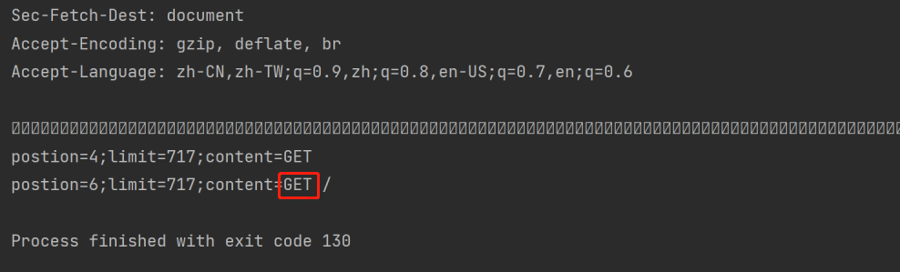
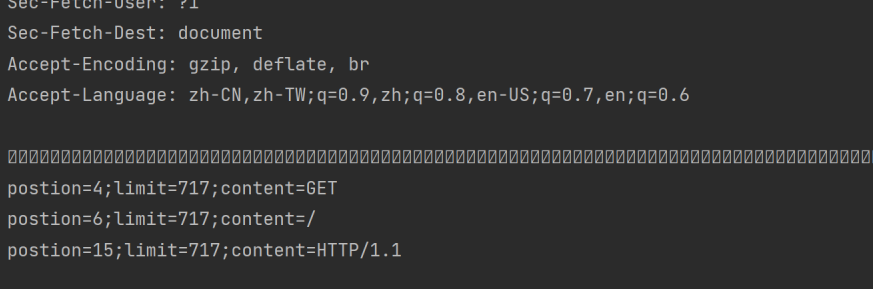
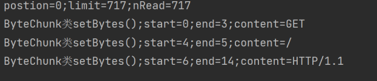

[](https://www.doubao.com/?channel=cnblogs&source=hw_db_cnblogs)

[](https://www.cnblogs.com/yishi-san/)

# [一十三](https://www.cnblogs.com/yishi-san)

## 

- [博客园](https://www.cnblogs.com/)
- [首页](https://www.cnblogs.com/yishi-san/)
- 
- [联系](https://msg.cnblogs.com/send/一十三)
- 
- [管理](https://i.cnblogs.com/)

随笔 - 20 文章 - 1 评论 - 1 阅读 - 13277

# [Tomcat源码分析使用NIO接收HTTP请求(三)----解析请求行](https://www.cnblogs.com/yishi-san/p/16932071.html)

我们在上一节中已经接收到了请求，在本节中我们将来解析请求行也就是`GET / HTTP/1.1`这一行。

### 了解Tomcat解析请求行

Tomcat在Http11Processor的service方法中会调用Http11InputBuffer的parseRequestLine方法来解析Tomcat的请求行，所以我们本节的重点将是实现parseRequestLine方法。

### 实现parseRequestLine方法

以下代码都是基于上一节代码修改或添加的。

第一步: 修改parseRequestLine方法，在parseRequestLine方法读取到数据后，会先执行do-while 循环以用来删除空格。然后根据空格标志来获取Get，获取Get后又以同样的方式获取/,此时可以运行程序 来看一下打印输出，会发现有一个明显的问题(见注释)。

[](javascript:void(0);)

```
boolean parseRequestLine() throws IOException {
    byte chr = 0;
    if (parsingRequestLinePhase < 2) {
        // 读取数据
        wrapper.read(byteBuffer);
        System.out.println("postion="+byteBuffer.position()+";limit=" + byteBuffer.limit());
        if (byteBuffer.position() > 0) {
            // 打印接收到的请求
            System.out.println(new String(byteBuffer.array(), StandardCharsets.UTF_8));
            byteBuffer.flip();
            // 这个do while循环用来清除消息开始的空行
            do{
                chr = byteBuffer.get();
                byte[] b = new byte[]{chr};
            }while((chr == (byte) '\r') || (chr == (byte) '\n'));
            // 因为在do while中多读取了一个position所以在这里需要给设置回来
            byteBuffer.position(byteBuffer.position() - 1);
            // 接下来在继续解析 拿到Get
            // 当遇到空格或制表符时被设置成true
            boolean space = false;
            // 获取GET
            while(!space) {
                chr = byteBuffer.get();
                if (chr == (byte) ' ' || chr == (byte) '\t') {
                    space = true;
                }
            }
            byte[] b = byteBuffer.array();
            byte[] c = Arrays.copyOfRange(b, 0, byteBuffer.position());
            System.out.println("postion="+byteBuffer.position()
                    +";limit=" + byteBuffer.limit()
                    +";content="+ new String(c));
            // 因为获取/与GET逻辑类似，所以直接复制上一段代码来解析/.但是在打印输出时会发现GET被重新输出
            space = false;
            // 获取
            while(!space) {
                chr = byteBuffer.get();
                if (chr == (byte) ' ' || chr == (byte) '\t') {
                    space = true;
                }
            }
            b = byteBuffer.array();
            c = Arrays.copyOfRange(b, 0, byteBuffer.position());
            System.out.println("postion="+byteBuffer.position()
                    +";limit=" + byteBuffer.limit()
                    +";content="+ new String(c));
        }
    }
    return true;
}
```

[](javascript:void(0);)



 第二步: 解决第一步当中的问题。在Http11InputBuffer定义一个全局 变量private int parsingRequestLineStart = 0;然后修改代码如下

[](javascript:void(0);)

```
boolean parseRequestLine() throws IOException {
    byte chr = 0;
    if (parsingRequestLinePhase < 2) {
        wrapper.read(byteBuffer);
        System.out.println("postion="+byteBuffer.position()+";limit=" + byteBuffer.limit());
        if (byteBuffer.position() > 0) {
            System.out.println(new String(byteBuffer.array(), StandardCharsets.UTF_8));
            byteBuffer.flip();
            do{
                chr = byteBuffer.get();
            }while((chr == (byte) '\r') || (chr == (byte) '\n'));
            byteBuffer.position(byteBuffer.position() - 1);
            // 新增加的
            parsingRequestLineStart = byteBuffer.position();
            // =====================-*-__-*-===================================//
            boolean space = false;
            // 获取GET
            while(!space) {
                chr = byteBuffer.get();
                if (chr == (byte) ' ' || chr == (byte) '\t') {
                    space = true;
                }
            }
            byte[] b = byteBuffer.array();
            byte[] c = Arrays.copyOfRange(b, parsingRequestLineStart, byteBuffer.position());
            parsingRequestLineStart = byteBuffer.position();
            System.out.println("postion="+byteBuffer.position()
                    +";limit=" + byteBuffer.limit()
                    +";content="+ new String(c));
            // =====================-*-__-*-===================================//
            space = false;
            // 获取 /
            while(!space) {
                chr = byteBuffer.get();
                if (chr == (byte) ' ' || chr == (byte) '\t') {
                    space = true;
                }
            }
            b = byteBuffer.array();
            c = Arrays.copyOfRange(b, parsingRequestLineStart, byteBuffer.position());
            parsingRequestLineStart = byteBuffer.position();
            System.out.println("postion="+byteBuffer.position()
                    +";limit=" + byteBuffer.limit()
                    +";content="+ new String(c));
            // =====================-*-__-*-===================================//
            space = false;
            // 获取 HTTP/1.1
            while(!space) {
                chr = byteBuffer.get();
                // 这里和上一个有点区别，判断换行
                if ((chr == (byte) '\r') || (chr == (byte) '\n')) {
                    space = true;
                }
            }
            b = byteBuffer.array();
            c = Arrays.copyOfRange(b, parsingRequestLineStart, byteBuffer.position());
            System.out.println("postion="+byteBuffer.position()
                    +";limit=" + byteBuffer.limit()
                    +";content="+ new String(c));
        }
    }
    return true;
}
```

[](javascript:void(0);)



 第三步: 第二步中存在的一个问题是我们只尝试读取了一次数据，有可能数据没有接收全，导致后续解析出错。所以我们需要一种尝试重新读取数据的方法。在Http11InputBuffer中新建一个fill方法，并重写parseRequestLine方法。运行结果和上一步基本一样就不在贴图了。有一点需要注意的是我们是根据position和limit的关系来判断是否需要重新读取数据的，所以我们要重写init方法对position和limit进行设置。

```
public void init(SocketWrapperBase<?> socketWrapper) {
    wrapper = socketWrapper;
    byteBuffer.position(0).limit(0);
}
```

[](javascript:void(0);)

```
private boolean fill() throws IOException {
    int nRead = -1;
    byteBuffer.mark();
    try {
        if (byteBuffer.position() < byteBuffer.limit()) {
            byteBuffer.position(byteBuffer.limit());
        }
        byteBuffer.limit(byteBuffer.capacity());
        nRead = wrapper.read(byteBuffer);
    } finally {
        byteBuffer.limit(byteBuffer.position()).reset();
        System.out.println("postion="+byteBuffer.position() +";limit=" + byteBuffer.limit() + ";nRead=" + nRead);
    }
    return nRead > 0;
}
```

[](javascript:void(0);)

[](javascript:void(0);)

```
boolean parseRequestLine() throws IOException {
    byte chr = 0;
    do{
        if (byteBuffer.position() >= byteBuffer.limit()) {
            if (!fill()) {
                return false;
            }
        }
        chr = byteBuffer.get();
    }while((chr == (byte) '\r') || (chr == (byte) '\n'));
    byteBuffer.position(byteBuffer.position() - 1);
    parsingRequestLineStart = byteBuffer.position();
    // =====================-*-__-*-===================================//
    boolean space = false;
    // 获取GET
    while(!space) {
        if (byteBuffer.position() >= byteBuffer.limit()) {
            if (!fill()) {
                return false;
            }
        }
        chr = byteBuffer.get();
        if (chr == (byte) ' ' || chr == (byte) '\t') {
            space = true;
        }
    }
    byteBuffer.position(byteBuffer.position() - 1);
    byte[] b = byteBuffer.array();
    byte[] c = Arrays.copyOfRange(b, parsingRequestLineStart, byteBuffer.position());
    System.out.println("postion="+byteBuffer.position()
            +";limit=" + byteBuffer.limit()
            +";content="+ new String(c));
    parsingRequestLineStart = byteBuffer.position();
    // =====================-*-__-*-===================================//
    space = false;
    // 获取 空格
    while(!space) {
        if (byteBuffer.position() >= byteBuffer.limit()) {
            if (!fill()) {
                return false;
            }
        }
        chr = byteBuffer.get();
        if (!(chr == (byte) ' ' || chr == (byte) '\t')) {
            space = true;
            byteBuffer.position(byteBuffer.position() - 1);
        }
    }
    b = byteBuffer.array();
    c = Arrays.copyOfRange(b, parsingRequestLineStart, byteBuffer.position());
    System.out.println("postion11="+byteBuffer.position()
            +";limit=" + byteBuffer.limit()
            +";content="+ new String(c));
    parsingRequestLineStart = byteBuffer.position();
    // =====================-*-__-*-===================================//
    space = false;
    // 获取 /
    while(!space) {
        if (byteBuffer.position() >= byteBuffer.limit()) {
            if (!fill()) {
                return false;
            }
        }
        chr = byteBuffer.get();
        if (chr == (byte) ' ' || chr == (byte) '\t') {
            space = true;
        }
    }
    byteBuffer.position(byteBuffer.position() - 1);
    b = byteBuffer.array();
    c = Arrays.copyOfRange(b, parsingRequestLineStart, byteBuffer.position());
    System.out.println("postion="+byteBuffer.position()
            +";limit=" + byteBuffer.limit()
            +";content="+ new String(c));
    parsingRequestLineStart = byteBuffer.position();
    // =====================-*-__-*-===================================//
    space = false;
    // 获取 空格
    while(!space) {
        if (byteBuffer.position() >= byteBuffer.limit()) {
            if (!fill()) {
                return false;
            }
        }
        chr = byteBuffer.get();
        if (!(chr == (byte) ' ' || chr == (byte) '\t')) {
            space = true;
            byteBuffer.position(byteBuffer.position() - 1);
        }
    }
    b = byteBuffer.array();
    c = Arrays.copyOfRange(b, parsingRequestLineStart, byteBuffer.position());
    parsingRequestLineStart = byteBuffer.position();
    System.out.println("postion11="+byteBuffer.position()
            +";limit=" + byteBuffer.limit()
            +";content="+ new String(c));
    // =====================-*-__-*-===================================//
    space = false;
    // 获取 HTTP/1.1
    while(!space) {
        if (byteBuffer.position() >= byteBuffer.limit()) {
            if (!fill()) {
                return false;
            }
        }
        chr = byteBuffer.get();
        if ((chr == (byte) '\r') || (chr == (byte) '\n')) {
            space = true;
        }
    }
    b = byteBuffer.array();
    c = Arrays.copyOfRange(b, parsingRequestLineStart, byteBuffer.position());
    System.out.println("postion="+byteBuffer.position()
            +";limit=" + byteBuffer.limit()
            +";content="+ new String(c));
    return true;
}
```

[](javascript:void(0);)

```
第四步: 使用 parsingRequestLinePhase来标志正确解析了请求行，修改parseRequestLine方法如下:
```

[](javascript:void(0);)

```
boolean parseRequestLine() throws IOException {
    byte chr = 0;
    if (parsingRequestLinePhase < 2) {
        do{
            if (byteBuffer.position() >= byteBuffer.limit()) {
                if (!fill()) {
                    return false;
                }
            }
            chr = byteBuffer.get();
        }while((chr == (byte) '\r') || (chr == (byte) '\n'));
        byteBuffer.position(byteBuffer.position() - 1);
        parsingRequestLineStart = byteBuffer.position();
        parsingRequestLinePhase = 2;
    }
    // =====================-*-__-*-===================================//
    if (parsingRequestLinePhase == 2) {
        boolean space = false;
        // 获取GET
        while(!space) {
            if (byteBuffer.position() >= byteBuffer.limit()) {
                if (!fill()) {
                    return false;
                }
            }
            chr = byteBuffer.get();
            if (chr == (byte) ' ' || chr == (byte) '\t') {
                space = true;
            }
        }
        byteBuffer.position(byteBuffer.position() - 1);
        byte[] b = byteBuffer.array();
        byte[] c = Arrays.copyOfRange(b, parsingRequestLineStart, byteBuffer.position());
        System.out.println("postion="+byteBuffer.position()
                +";limit=" + byteBuffer.limit()
                +";content="+ new String(c));
        parsingRequestLineStart = byteBuffer.position();
        parsingRequestLinePhase = 3;
    }
    // =====================-*-__-*-===================================//
    if (parsingRequestLinePhase == 3) {
        boolean space = false;
        // 获取 空格
        while(!space) {
            if (byteBuffer.position() >= byteBuffer.limit()) {
                if (!fill()) {
                    return false;
                }
            }
            chr = byteBuffer.get();
            if (!(chr == (byte) ' ' || chr == (byte) '\t')) {
                space = true;
                byteBuffer.position(byteBuffer.position() - 1);
            }
        }
        byte[] b = byteBuffer.array();
        byte[] c = Arrays.copyOfRange(b, parsingRequestLineStart, byteBuffer.position());
        System.out.println("postion11="+byteBuffer.position()
                +";limit=" + byteBuffer.limit()
                +";content="+ new String(c));
        parsingRequestLineStart = byteBuffer.position();
        parsingRequestLinePhase = 4;
    }
    // =====================-*-__-*-===================================//
    if (parsingRequestLinePhase == 4) {
        boolean space = false;
        // 获取 /
        while(!space) {
            if (byteBuffer.position() >= byteBuffer.limit()) {
                if (!fill()) {
                    return false;
                }
            }
            chr = byteBuffer.get();
            if (chr == (byte) ' ' || chr == (byte) '\t') {
                space = true;
            }
        }
        byteBuffer.position(byteBuffer.position() - 1);
        byte[] b = byteBuffer.array();
        byte[] c = Arrays.copyOfRange(b, parsingRequestLineStart, byteBuffer.position());
        System.out.println("postion="+byteBuffer.position()
                +";limit=" + byteBuffer.limit()
                +";content="+ new String(c));
        parsingRequestLineStart = byteBuffer.position();
        parsingRequestLinePhase = 5;
    }

    // =====================-*-__-*-===================================//
    if (parsingRequestLinePhase == 5) {
        boolean space = false;
        // 获取 空格
        while(!space) {
            if (byteBuffer.position() >= byteBuffer.limit()) {
                if (!fill()) {
                    return false;
                }
            }
            chr = byteBuffer.get();
            if (!(chr == (byte) ' ' || chr == (byte) '\t')) {
                space = true;
                byteBuffer.position(byteBuffer.position() - 1);
            }
        }
        byte[] b = byteBuffer.array();
        byte[] c = Arrays.copyOfRange(b, parsingRequestLineStart, byteBuffer.position());
        parsingRequestLineStart = byteBuffer.position();
        System.out.println("postion11="+byteBuffer.position()
                +";limit=" + byteBuffer.limit()
                +";content="+ new String(c));
        parsingRequestLinePhase = 6;
    }
    // =====================-*-__-*-===================================//
    if (parsingRequestLinePhase == 6) {
        boolean space = false;
        // 获取 HTTP/1.1
        while(!space) {
            if (byteBuffer.position() >= byteBuffer.limit()) {
                if (!fill()) {
                    return false;
                }
            }
            chr = byteBuffer.get();
            if ((chr == (byte) '\r') || (chr == (byte) '\n')) {
                space = true;
            }
        }
        byte[] b = byteBuffer.array();
        byte[] c = Arrays.copyOfRange(b, parsingRequestLineStart, byteBuffer.position());
        System.out.println("postion="+byteBuffer.position()
                +";limit=" + byteBuffer.limit()
                +";content="+ new String(c));
        parsingRequestLinePhase = 7;
    }
    if (parsingRequestLinePhase == 7) {
        parsingRequestLinePhase = 0;
        parsingRequestLineStart = 0;
        return true;
    }
    throw new IOException("解析错误");
}
```

[](javascript:void(0);)

第五步: 保存解析后的数据。在Tomcat源码中，当其解析请求后会将解析后的信息保存在Request对象中，这个Request对象是Tomcat内部对像，之后会将其转换为ServletRequest 对像。Tomcat会将接收到的数转换为一个数组，并将这个数组和数据索引封装成一个名为ByteChunk的对象，所以我们要新键一个ByteChunk类，如下: 

[](javascript:void(0);)

```
public final class ByteChunk {
    // 缓存数据
    private byte[] buff;
    protected int start;
    protected int end;
    public void setBytes(byte[] b, int off, int len) {
        buff = b;
        start = off;
        end = start + len;
        byte[] c = Arrays.copyOfRange(b, start, end);
        System.out.println("ByteChunk类setBytes();start=" + off + ";end=" + end +";content="+ new String(c));
    }
}
```

[](javascript:void(0);)

第六步: ByteChunk是用来保存字节数据的，在Tomcat源码中还有一个CharChunk是用来保存字符数据的，二者被封装在一个名为MessageBytes的类中，现在我们还用不到CharChunk所以先不管它。在新键一个MessageBytes类，如下

[](javascript:void(0);)

```
public final class MessageBytes implements Cloneable, Serializable {
    private final ByteChunk byteC=new ByteChunk();
    public static MessageBytes newInstance() {
        return factory.newInstance();
    }
    public void setBytes(byte[] b, int off, int len) {
        byteC.setBytes( b, off, len );
    }
    private static final MessageBytesFactory factory = new MessageBytesFactory();
    private static class MessageBytesFactory {
        protected MessageBytesFactory() {
        }
        public MessageBytes newInstance() {
            return new MessageBytes();
        }
    }
}
```

[](javascript:void(0);)

第七步: 新键Request类，并在Http11InputBuffer类中初始话它private Request request = new Request();

[](javascript:void(0);)

```
public class Request {
    // 保存请求方法 GET POST之类的
    private final MessageBytes methodMB = MessageBytes.newInstance();
    // -~-__-~-
    private final MessageBytes uriMB = MessageBytes.newInstance();
    // 使用的协议
    private final MessageBytes protoMB = MessageBytes.newInstance();

    public MessageBytes method() {
        return methodMB;
    }

    public MessageBytes requestURI() {
        return uriMB;
    }

    public MessageBytes protocol() {
        return protoMB;
    }
}
```

[](javascript:void(0);)

第八步: 重写parseRequestLine方法

[](javascript:void(0);)

```
boolean parseRequestLine() throws IOException {
    byte chr = 0;
    if (parsingRequestLinePhase < 2) {
        do{
            if (byteBuffer.position() >= byteBuffer.limit()) {
                if (!fill()) {
                    return false;
                }
            }
            chr = byteBuffer.get();
        }while((chr == (byte) '\r') || (chr == (byte) '\n'));
        byteBuffer.position(byteBuffer.position() - 1);
        parsingRequestLineStart = byteBuffer.position();
        parsingRequestLinePhase = 2;
    }
    // =====================-*-__-*-===================================//
    if (parsingRequestLinePhase == 2) {
        boolean space = false;
        // 获取GET
        while(!space) {
            int pos = byteBuffer.position();
            if (byteBuffer.position() >= byteBuffer.limit()) {
                if (!fill()) {
                    return false;
                }
            }
            chr = byteBuffer.get();
            if (chr == (byte) ' ' || chr == (byte) '\t') {
                space = true;
                // 保存数据
                request.method().setBytes(byteBuffer.array(), parsingRequestLineStart,
                        pos - parsingRequestLineStart);
            }
        }
        parsingRequestLinePhase = 3;
    }
    // =====================-*-__-*-===================================//
    if (parsingRequestLinePhase == 3) {
        boolean space = false;
        // 获取 空格
        while(!space) {
            if (byteBuffer.position() >= byteBuffer.limit()) {
                if (!fill()) {
                    return false;
                }
            }
            chr = byteBuffer.get();
            if (!(chr == (byte) ' ' || chr == (byte) '\t')) {
                space = true;
                byteBuffer.position(byteBuffer.position() - 1);
            }
        }
        parsingRequestLineStart = byteBuffer.position();
        parsingRequestLinePhase = 4;
    }
    // =====================-*-__-*-===================================//
    if (parsingRequestLinePhase == 4) {
        boolean space = false;
        // 获取 /
        while(!space) {
            int pos = byteBuffer.position();
            if (byteBuffer.position() >= byteBuffer.limit()) {
                if (!fill()) {
                    return false;
                }
            }
            chr = byteBuffer.get();
            if (chr == (byte) ' ' || chr == (byte) '\t') {
                space = true;
                request.method().setBytes(byteBuffer.array(), parsingRequestLineStart,
                        pos - parsingRequestLineStart);
            }
        }
        parsingRequestLinePhase = 5;
    }

    // =====================-*-__-*-===================================//
    if (parsingRequestLinePhase == 5) {
        boolean space = false;
        // 获取 空格
        while(!space) {
            if (byteBuffer.position() >= byteBuffer.limit()) {
                if (!fill()) {
                    return false;
                }
            }
            chr = byteBuffer.get();
            if (!(chr == (byte) ' ' || chr == (byte) '\t')) {
                space = true;
                byteBuffer.position(byteBuffer.position() - 1);
            }
        }
        parsingRequestLineStart = byteBuffer.position();
        parsingRequestLinePhase = 6;
    }
    // =====================-*-__-*-===================================//
    if (parsingRequestLinePhase == 6) {
        boolean space = false;
        // 获取 HTTP/1.1
        while(!space) {
            int pos = byteBuffer.position();
            if (byteBuffer.position() >= byteBuffer.limit()) {
                if (!fill()) {
                    return false;
                }
            }
            chr = byteBuffer.get();
            // 这里和上一个有点区别，判断换行
            if ((chr == (byte) '\r') || (chr == (byte) '\n')) {
                space = true;
                request.method().setBytes(byteBuffer.array(), parsingRequestLineStart,
                        pos - parsingRequestLineStart);
            }
        }
        parsingRequestLinePhase = 7;
    }
    if (parsingRequestLinePhase == 7) {
        parsingRequestLinePhase = 0;
        parsingRequestLineStart = 0;
        return true;
    }
    throw new IOException("解析错误");
}
```

[](javascript:void(0);)



 

结束 ！！！

 

```

```

 

分类: [Tomcat](https://www.cnblogs.com/yishi-san/category/2203390.html)

[好文要顶](javascript:void(0);) [关注我](javascript:void(0);) [收藏该文](javascript:void(0);) [微信分享](javascript:void(0);)

[](https://home.cnblogs.com/u/yishi-san/)

[一十三](https://home.cnblogs.com/u/yishi-san/)
[粉丝 - 2](https://home.cnblogs.com/u/yishi-san/followers/) [关注 - 1](https://home.cnblogs.com/u/yishi-san/followees/)

[+加关注](javascript:void(0);)

1

0

[升级成为会员](https://cnblogs.vip/)

[« ](https://www.cnblogs.com/yishi-san/p/16900237.html)上一篇： [Tomcat源码分析使用NIO接收HTTP请求(二)----使用NioSocketWrapper封装SocketChannel](https://www.cnblogs.com/yishi-san/p/16900237.html)
[» ](https://www.cnblogs.com/yishi-san/p/16932180.html)下一篇： [Tomcat源码分析使用NIO接收HTTP请求(四)----解析请求头](https://www.cnblogs.com/yishi-san/p/16932180.html)

posted @ 2022-11-28 14:34 [一十三](https://www.cnblogs.com/yishi-san) 阅读(447) 评论(0) [编辑](https://i.cnblogs.com/EditPosts.aspx?postid=16932071) [收藏](javascript:void(0)) [举报](javascript:void(0))


[刷新评论](javascript:void(0);)[刷新页面](https://www.cnblogs.com/yishi-san/p/16932071.html#)[返回顶部](https://www.cnblogs.com/yishi-san/p/16932071.html#top)

发表评论 [升级成为园子VIP会员](https://cnblogs.vip/)


编辑预览


 自动补全

 [退出](javascript:void(0);) [订阅评论](javascript:void(0);) [我的博客](https://www.cnblogs.com/Carl-Don/)

[Ctrl+Enter快捷键提交]

[【推荐】还在用 ECharts 开发大屏？试试这款永久免费的开源 BI 工具！](https://dataease.cn/?utm_source=cnblogs)
[【推荐】编程新体验，更懂你的AI，立即体验豆包MarsCode编程助手](https://www.marscode.cn/?utm_source=advertising&utm_medium=cnblogs.com_ug_cpa&utm_term=hw_marscode_cnblogs&utm_content=home)
[【推荐】凌霞软件回馈社区，博客园 & 1Panel & Halo 联合会员上线](https://www.cnblogs.com/cmt/p/18669224)
[【推荐】抖音旗下AI助手豆包，你的智能百科全书，全免费不限次数](https://www.doubao.com/?channel=cnblogs&source=hw_db_cnblogs)
[【推荐】博客园社区专享云产品让利特惠，阿里云新客6.5折上折](https://market.cnblogs.com/)
[【推荐】轻量又高性能的 SSH 工具 IShell：AI 加持，快人一步](http://ishell.cc/)

[](https://www.doubao.com/chat/coding?channel=cnblogs&source=hw_db_cnblogs)

**相关博文：**

·[Tomcat源码分析使用NIO接收HTTP请求(四)----解析请求头](https://www.cnblogs.com/yishi-san/p/16932180.html)

·[Tomcat源码分析使用NIO接收HTTP请求(六)----变更工程目录](https://www.cnblogs.com/yishi-san/p/16971500.html)

·[10、http的解析](https://www.cnblogs.com/honger/p/17730599.html)

·[tomcat源码分析（二）如何处理请求](https://www.cnblogs.com/sword-successful/p/17162835.html)

·[Tomcat学习笔记](https://www.cnblogs.com/yhr520/p/15792651.html)

**阅读排行：**
· [趁着过年的时候手搓了一个低代码框架](https://www.cnblogs.com/codelove/p/18719305)
· [本地部署DeepSeek后，没有好看的交互界面怎么行！](https://www.cnblogs.com/xiezhr/p/18718693)
· [为什么说在企业级应用开发中，后端往往是效率杀手？](https://www.cnblogs.com/jackyfei/p/18712595)
· [AI工具推荐：领先的开源 AI 代码助手——Continue](https://www.cnblogs.com/mingupupu/p/18716802)
· [用 C# 插值字符串处理器写一个 sscanf](https://www.cnblogs.com/hez2010/p/18718386/csharp-interpolated-string-sscanf)

### 公告

昵称： [一十三](https://home.cnblogs.com/u/yishi-san/)
园龄： [7年10个月](https://home.cnblogs.com/u/yishi-san/)
粉丝： [2](https://home.cnblogs.com/u/yishi-san/followers/)
关注： [1](https://home.cnblogs.com/u/yishi-san/followees/)

[+加关注](javascript:void(0))

| [<](javascript:void(0);)2025年2月[>](javascript:void(0);) |      |      |      |      |      |      |
| --------------------------------------------------------- | ---- | ---- | ---- | ---- | ---- | ---- |
| 日                                                        | 一   | 二   | 三   | 四   | 五   | 六   |
| 26                                                        | 27   | 28   | 29   | 30   | 31   | 1    |
| 2                                                         | 3    | 4    | 5    | 6    | 7    | 8    |
| 9                                                         | 10   | 11   | 12   | 13   | 14   | 15   |
| 16                                                        | 17   | 18   | 19   | 20   | 21   | 22   |
| 23                                                        | 24   | 25   | 26   | 27   | 28   | 1    |
| 2                                                         | 3    | 4    | 5    | 6    | 7    | 8    |

### 搜索

 

### 常用链接

- [我的随笔](https://www.cnblogs.com/yishi-san/p/)
- [我的评论](https://www.cnblogs.com/yishi-san/MyComments.html)
- [我的参与](https://www.cnblogs.com/yishi-san/OtherPosts.html)
- [最新评论](https://www.cnblogs.com/yishi-san/comments)
- [我的标签](https://www.cnblogs.com/yishi-san/tag/)

### [我的标签](https://www.cnblogs.com/yishi-san/tag/)

- [JavaScript(1)](https://www.cnblogs.com/yishi-san/tag/JavaScript/)

### [随笔分类](https://www.cnblogs.com/yishi-san/post-categories)

- [go(1)](https://www.cnblogs.com/yishi-san/category/1683619.html)
- [java(1)](https://www.cnblogs.com/yishi-san/category/1473165.html)
- [JavaScript(2)](https://www.cnblogs.com/yishi-san/category/982421.html)
- [MySql(1)](https://www.cnblogs.com/yishi-san/category/1099028.html)
- [Spring(1)](https://www.cnblogs.com/yishi-san/category/1561179.html)
- [Tomcat(8)](https://www.cnblogs.com/yishi-san/category/2203390.html)
- [密码学(1)](https://www.cnblogs.com/yishi-san/category/1775967.html)
- [区块链(3)](https://www.cnblogs.com/yishi-san/category/1545424.html)

### 随笔档案

- [2022年12月(3)](https://www.cnblogs.com/yishi-san/p/archive/2022/12)
- [2022年11月(4)](https://www.cnblogs.com/yishi-san/p/archive/2022/11)
- [2022年8月(2)](https://www.cnblogs.com/yishi-san/p/archive/2022/08)
- [2021年3月(1)](https://www.cnblogs.com/yishi-san/p/archive/2021/03)
- [2020年10月(1)](https://www.cnblogs.com/yishi-san/p/archive/2020/10)
- [2020年6月(1)](https://www.cnblogs.com/yishi-san/p/archive/2020/06)
- [2020年4月(1)](https://www.cnblogs.com/yishi-san/p/archive/2020/04)
- [2020年3月(3)](https://www.cnblogs.com/yishi-san/p/archive/2020/03)
- [2019年10月(1)](https://www.cnblogs.com/yishi-san/p/archive/2019/10)
- [2019年5月(1)](https://www.cnblogs.com/yishi-san/p/archive/2019/05)
- [2019年4月(1)](https://www.cnblogs.com/yishi-san/p/archive/2019/04)
- [2017年4月(1)](https://www.cnblogs.com/yishi-san/p/archive/2017/04)

### [文章分类](https://www.cnblogs.com/yishi-san/article-categories)

- [MySql(1)](https://www.cnblogs.com/yishi-san/category/1099036.html)

### [阅读排行榜](https://www.cnblogs.com/yishi-san/most-viewed)

- [1. DES算法原理(4637)](https://www.cnblogs.com/yishi-san/p/12990973.html)
- [2. 关于Copper.js的简单使用方法(1448)](https://www.cnblogs.com/yishi-san/p/13782983.html)
- [3. sql与集合(872)](https://www.cnblogs.com/yishi-san/p/10624122.html)
- [4. Tomcat源码分析使用NIO接收HTTP请求(一)----简单实现Acceptor、Poller、PollerEvent(858)](https://www.cnblogs.com/yishi-san/p/16900079.html)
- [5. 对于go当中的cli简单理解(798)](https://www.cnblogs.com/yishi-san/p/12592048.html)

### [评论排行榜](https://www.cnblogs.com/yishi-san/most-commented)

- [1. Tomcat源码分析使用NIO接收HTTP请求(一)----简单实现Acceptor、Poller、PollerEvent(1)](https://www.cnblogs.com/yishi-san/p/16900079.html)

### [推荐排行榜](https://www.cnblogs.com/yishi-san/most-liked)

- [1. Tomcat源码分析使用NIO接收HTTP请求(三)----解析请求行(1)](https://www.cnblogs.com/yishi-san/p/16932071.html)
- [2. Tomcat源码分析使用NIO接收HTTP请求(一)----简单实现Acceptor、Poller、PollerEvent(1)](https://www.cnblogs.com/yishi-san/p/16900079.html)

### [最新评论](https://www.cnblogs.com/yishi-san/comments)

- [1. Re:Tomcat源码分析使用NIO接收HTTP请求(一)----简单实现Acceptor、Poller、PollerEvent](https://www.cnblogs.com/yishi-san/p/16900079.html)
- 好文
- --邓等灯等灯

Copyright © 2025 一十三
Powered by .NET 9.0 on Kubernetes