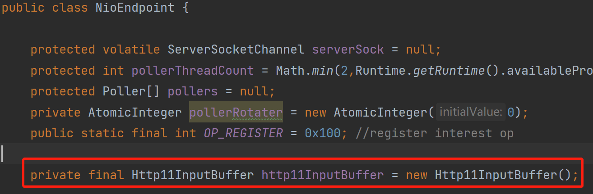
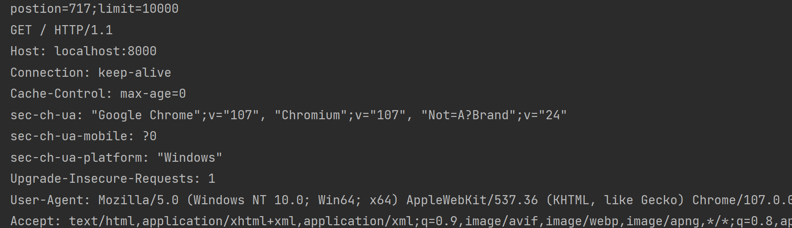
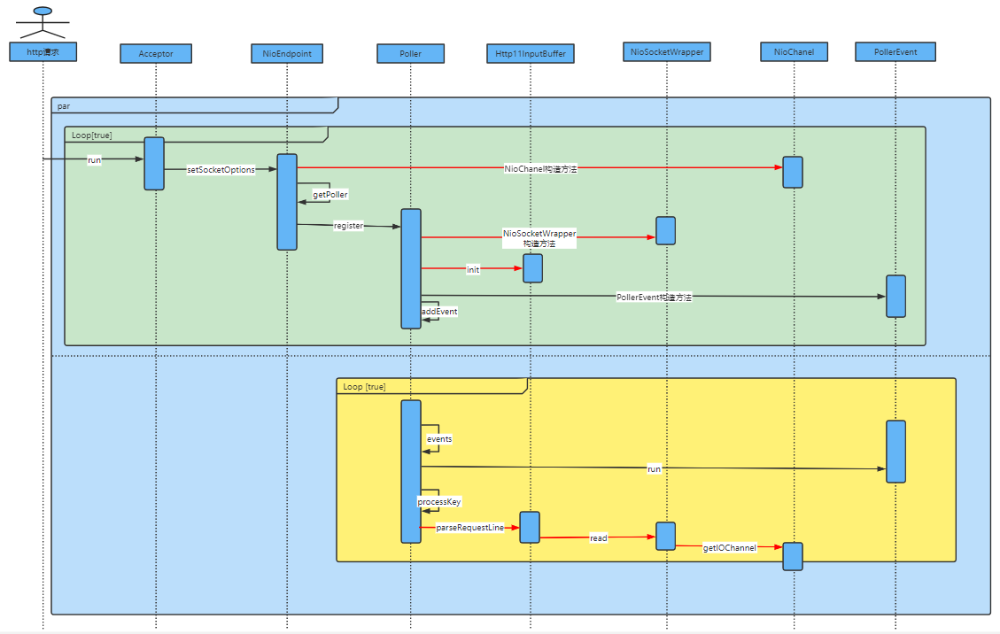

[](https://www.doubao.com/?channel=cnblogs&source=hw_db_cnblogs)

[](https://www.cnblogs.com/yishi-san/)

# [一十三](https://www.cnblogs.com/yishi-san)

## 

- [博客园](https://www.cnblogs.com/)
- [首页](https://www.cnblogs.com/yishi-san/)
- 
- [联系](https://msg.cnblogs.com/send/一十三)
- 
- [管理](https://i.cnblogs.com/)

随笔 - 20 文章 - 1 评论 - 1 阅读 - 13277

# [Tomcat源码分析使用NIO接收HTTP请求(二)----使用NioSocketWrapper封装SocketChannel](https://www.cnblogs.com/yishi-san/p/16900237.html)

注：本文基于Tomcat8.5撰写

在上一小节我们通过一个简单的示例程序来理解了Acceptor、Poller、PollerEvent这个三个内部组件的关系。在这一节我们将主要关注如何封装请求。

### 封装SocketChannel

Acceptor组件接收Http请求后，会对请求进行封装。所谓的“请求”就是SocketChannel对象，封装请求就是封装SocketChannel。在Tomcat中对SocketChannel有两层封装。第一层是将SocketChannel封装成NioChannle，第二层是将NioChannel封装成NioSocketWrapper。封装成NioSocketWrapper后Tomcat会在Http11InputBuffer类中对数据进行处理。

### 封装并打印请求

根据上一节的内容，现在我们来开始编写代码。

第一步 新建NioChannel类并实现ByteChannel接口，实现接口方法使用默认的就行现在无需写代码。在NioChannel中定义SocketChannel属性，并在构造函数中对其赋值，代码如下:

[](javascript:void(0);)

```
public class NioChannel implements ByteChannel {
    protected SocketChannel sc = null;
    public NioChannel(SocketChannel channel) {
        this.sc = channel;
    }
    public SocketChannel getIOChannel() {
        return sc;
    }
    @Override
    public int read(ByteBuffer dst) throws IOException {return 0;}
    @Override
    public int write(ByteBuffer src) throws IOException {return 0;}
    @Override
    public boolean isOpen() {
        return false;
    }

    @Override
    public void close() throws IOException {}
}
```

[](javascript:void(0);)

第二步 在setSocketOptions方法中使用NioChannel对SocketChannel进行包装，将Poller类的register方法的参数类型修改为NioChannel。

[](javascript:void(0);)

```
protected void setSocketOptions(SocketChannel socket) {
        try {
            socket.configureBlocking(false);
            NioChannel channel = new NioChannel(socket);
            getPoller0().register(channel);
        } catch (Exception e) {
            // ignore
        }
    }
```

[](javascript:void(0);)

第三步 新建一个SocketWrapperBase抽象类，在NioEndpoint类中定义一个NioSocketWrapper静态内部类来实现SocketWrapperBase，如下:

[](javascript:void(0);)

```
public abstract class SocketWrapperBase<E> {
    private final E socket;
    protected SocketWrapperBase(E socket) {
        this.socket = socket;
    }
    public abstract int read(ByteBuffer to) throws IOException;
    public E getSocket() {
        return socket;
    }
}
```

[](javascript:void(0);)

[](javascript:void(0);)

```
public static class NioSocketWrapper extends SocketWrapperBase<NioChannel> {
    private int interestOps = 0;
    private Poller poller = null;
    protected NioSocketWrapper(NioChannel socket) {
        super(socket);
    }
    @Override
    public int read(ByteBuffer to) throws IOException {
        return getSocket().getIOChannel().read(to);
    }
    public int getInterestOps() { return interestOps;}
    public void setInterestOps(int interestOps) {this.interestOps = interestOps;}
    public Poller getPoller() {return poller;}
    public void setPoller(Poller poller) {this.poller = poller;}
    public int interestOps(int ops) { this.interestOps  = ops; return ops; }
}
```

[](javascript:void(0);)

第四步 重写Poller类的register方法，使用NioSocketWrapper包装NioChannel,如下:

[](javascript:void(0);)

```
public void register(final NioChannel channel) {
    NioSocketWrapper ka = new NioSocketWrapper(channel);
    ka.setInterestOps(SelectionKey.OP_READ);
    ka.setPoller(this);
    // 在下面会建这个类
    http11InputBuffer.init(ka);
    PollerEvent r = new PollerEvent(channel, ka,OP_REGISTER);
    addEvent(r);
}
```

[](javascript:void(0);)

 第五步 由于在第四步中对PollerEvent类的构造方法参数类型有一些调整，所以需要对PollerEvent类的参数进行一些修改。

[](javascript:void(0);)

```
public static class PollerEvent implements Runnable {
    private NioChannel socket;
    private int interestOps;
    private NioSocketWrapper socketWrapper;

    public PollerEvent(NioChannel socket, NioSocketWrapper socketWrapper, int intOps) {
        reset(socket, socketWrapper, intOps);
    }

    @Override
    public void run() {
        if (interestOps == OP_REGISTER) {
            try {
                socket.register(
                        poller.getSelector(), SelectionKey.OP_READ, socketWrapper);
            } catch (Exception e) {
            }
        }
    }

    public void reset(NioChannel socket, NioSocketWrapper socketWrapper, int intOps) {
        this.socket = socket;
        interestOps = intOps;
        this.socketWrapper = socketWrapper;
    }

    public void reset() {
        reset(null, null, 0);
    }
}
```

[](javascript:void(0);)

第六步 新建Http11InputBuffer类，在NioEndpoint中引用它。



 在register方法中创建NioSocketWrapper时会调用Http11InputBuffer的init方法以用来保存对SocketWrapperBase的引用，在Http11InputBuffer中定义了一个ByteBuffer，这个Buffer会被传入到SocketWrapperBase的read方法中，在read方法中会将SocketChannel中的数据读取到ByteBuffer中。

[](javascript:void(0);)

```
public class Http11InputBuffer {
    private int parsingRequestLinePhase = 0;
    private ByteBuffer byteBuffer = ByteBuffer.allocate(10000);
    private SocketWrapperBase<?> wrapper;

    public void init(SocketWrapperBase<?> socketWrapper) { wrapper = socketWrapper;}

    public boolean parseRequestLine() throws IOException {
        if (parsingRequestLinePhase < 2) {
            wrapper.read(byteBuffer);
            System.out.println("postion="+byteBuffer.position()+";limit=" + byteBuffer.limit());
            System.out.println(new String(byteBuffer.array(), StandardCharsets.UTF_8));
        }
        return true;
    }
}
```

[](javascript:void(0);)

第七步 重写Poller的run方法，在该方法中使用了processKey方法对channel事件进行处理。所以我们需要在Poller类中创建processKey方法。

[](javascript:void(0);)

```
public void run() {
    try {
        while (true) {
            events();
            keyCount = selector.selectNow();
            Iterator<SelectionKey> iterator = null;
            if ( keyCount > 0) {
                iterator = selector.selectedKeys().iterator();
            }
            while (iterator != null && iterator.hasNext()) {
                SelectionKey sk = iterator.next();
                iterator.remove();
                NioSocketWrapper socketWrapper = (NioSocketWrapper) sk.attachment();
                // 得到socket用于进行后续处理
                if (socketWrapper != null) {
                    processKey(sk, socketWrapper);
                }
            }
        }
    } catch (Exception e) {
        e.printStackTrace();
    }
}
```

[](javascript:void(0);)

[](javascript:void(0);)

```
protected void processKey(SelectionKey sk, NioSocketWrapper attachment) {
    if ( sk.isValid() && attachment != null ) {
        if (sk.isReadable() || sk.isWritable() ) {
            // 避免多次请求，可以注释这行代码体验一下
            unreg(sk, attachment, sk.readyOps());
            if (sk.isReadable()) {
                try {
                    http11InputBuffer.parseRequestLine();
                } catch (IOException e) {
                    e.printStackTrace();
                }
            }
        }
    }
}
```

[](javascript:void(0);)

应当注意unreg方法与reg方法属于NioEndpoint类方法。

[](javascript:void(0);)

```
protected void unreg(SelectionKey sk, NioSocketWrapper socketWrapper, int readyOps) {
    // “&～xx”相当于删除xx，有就删除，没有就不变。
    reg(sk, socketWrapper, sk.interestOps() & (~readyOps));
}
protected void reg(SelectionKey sk, NioSocketWrapper socketWrapper, int intops) {
    sk.interestOps(intops);
    socketWrapper.interestOps(intops);
}
```

[](javascript:void(0);)

至此我们可以使用浏览器来发送一个 http://localhost:8000/ 请求测试一下我们的程序。下图测试结果(先忽略乱码)。



 下面是本节程序中发起一次请求的时序图。



 

 

结束！！！

分类: [Tomcat](https://www.cnblogs.com/yishi-san/category/2203390.html)

[好文要顶](javascript:void(0);) [关注我](javascript:void(0);) [收藏该文](javascript:void(0);) [微信分享](javascript:void(0);)

[](https://home.cnblogs.com/u/yishi-san/)

[一十三](https://home.cnblogs.com/u/yishi-san/)
[粉丝 - 2](https://home.cnblogs.com/u/yishi-san/followers/) [关注 - 1](https://home.cnblogs.com/u/yishi-san/followees/)

[+加关注](javascript:void(0);)

0

0

[升级成为会员](https://cnblogs.vip/)

[« ](https://www.cnblogs.com/yishi-san/p/16900079.html)上一篇： [Tomcat源码分析使用NIO接收HTTP请求(一)----简单实现Acceptor、Poller、PollerEvent](https://www.cnblogs.com/yishi-san/p/16900079.html)
[» ](https://www.cnblogs.com/yishi-san/p/16932071.html)下一篇： [Tomcat源码分析使用NIO接收HTTP请求(三)----解析请求行](https://www.cnblogs.com/yishi-san/p/16932071.html)

posted @ 2022-11-17 17:38 [一十三](https://www.cnblogs.com/yishi-san) 阅读(386) 评论(0) [编辑](https://i.cnblogs.com/EditPosts.aspx?postid=16900237) [收藏](javascript:void(0)) [举报](javascript:void(0))


[刷新评论](javascript:void(0);)[刷新页面](https://www.cnblogs.com/yishi-san/p/16900237.html#)[返回顶部](https://www.cnblogs.com/yishi-san/p/16900237.html#top)

发表评论 [升级成为园子VIP会员](https://cnblogs.vip/)


编辑预览


 自动补全

 [退出](javascript:void(0);) [订阅评论](javascript:void(0);) [我的博客](https://www.cnblogs.com/Carl-Don/)

[Ctrl+Enter快捷键提交]

[【推荐】还在用 ECharts 开发大屏？试试这款永久免费的开源 BI 工具！](https://dataease.cn/?utm_source=cnblogs)
[【推荐】编程新体验，更懂你的AI，立即体验豆包MarsCode编程助手](https://www.marscode.cn/?utm_source=advertising&utm_medium=cnblogs.com_ug_cpa&utm_term=hw_marscode_cnblogs&utm_content=home)
[【推荐】凌霞软件回馈社区，博客园 & 1Panel & Halo 联合会员上线](https://www.cnblogs.com/cmt/p/18669224)
[【推荐】抖音旗下AI助手豆包，你的智能百科全书，全免费不限次数](https://www.doubao.com/?channel=cnblogs&source=hw_db_cnblogs)
[【推荐】博客园社区专享云产品让利特惠，阿里云新客6.5折上折](https://market.cnblogs.com/)
[【推荐】轻量又高性能的 SSH 工具 IShell：AI 加持，快人一步](http://ishell.cc/)

[](https://www.doubao.com/chat/coding?channel=cnblogs&source=hw_db_cnblogs)

**相关博文：**

·[Tomcat源码分析使用NIO接收HTTP请求(一)----简单实现Acceptor、Poller、PollerEvent](https://www.cnblogs.com/yishi-san/p/16900079.html)

·[Tomcat源码分析使用NIO接收HTTP请求(七)----使用SocketProcessor接收请求](https://www.cnblogs.com/yishi-san/p/16971551.html)

·[tomcat源码分析（二）如何处理请求](https://www.cnblogs.com/sword-successful/p/17162835.html)

·[【SpringBoot + Tomcat】【一】请求到达后端服务进程后的处理过程-连接器的创建和执行](https://www.cnblogs.com/kukuxjx/p/18120284)

·[Tomcat源码分析 （八）----- HTTP请求处理过程（一）](https://www.cnblogs.com/wk-missQ1/p/16212895.html)

**阅读排行：**
· [趁着过年的时候手搓了一个低代码框架](https://www.cnblogs.com/codelove/p/18719305)
· [本地部署DeepSeek后，没有好看的交互界面怎么行！](https://www.cnblogs.com/xiezhr/p/18718693)
· [为什么说在企业级应用开发中，后端往往是效率杀手？](https://www.cnblogs.com/jackyfei/p/18712595)
· [AI工具推荐：领先的开源 AI 代码助手——Continue](https://www.cnblogs.com/mingupupu/p/18716802)
· [用 C# 插值字符串处理器写一个 sscanf](https://www.cnblogs.com/hez2010/p/18718386/csharp-interpolated-string-sscanf)

### 公告

昵称： [一十三](https://home.cnblogs.com/u/yishi-san/)
园龄： [7年10个月](https://home.cnblogs.com/u/yishi-san/)
粉丝： [2](https://home.cnblogs.com/u/yishi-san/followers/)
关注： [1](https://home.cnblogs.com/u/yishi-san/followees/)

[+加关注](javascript:void(0))

| [<](javascript:void(0);)2025年2月[>](javascript:void(0);) |      |      |      |      |      |      |
| --------------------------------------------------------- | ---- | ---- | ---- | ---- | ---- | ---- |
| 日                                                        | 一   | 二   | 三   | 四   | 五   | 六   |
| 26                                                        | 27   | 28   | 29   | 30   | 31   | 1    |
| 2                                                         | 3    | 4    | 5    | 6    | 7    | 8    |
| 9                                                         | 10   | 11   | 12   | 13   | 14   | 15   |
| 16                                                        | 17   | 18   | 19   | 20   | 21   | 22   |
| 23                                                        | 24   | 25   | 26   | 27   | 28   | 1    |
| 2                                                         | 3    | 4    | 5    | 6    | 7    | 8    |

### 搜索

 

### 常用链接

- [我的随笔](https://www.cnblogs.com/yishi-san/p/)
- [我的评论](https://www.cnblogs.com/yishi-san/MyComments.html)
- [我的参与](https://www.cnblogs.com/yishi-san/OtherPosts.html)
- [最新评论](https://www.cnblogs.com/yishi-san/comments)
- [我的标签](https://www.cnblogs.com/yishi-san/tag/)

### [我的标签](https://www.cnblogs.com/yishi-san/tag/)

- [JavaScript(1)](https://www.cnblogs.com/yishi-san/tag/JavaScript/)

### [随笔分类](https://www.cnblogs.com/yishi-san/post-categories)

- [go(1)](https://www.cnblogs.com/yishi-san/category/1683619.html)
- [java(1)](https://www.cnblogs.com/yishi-san/category/1473165.html)
- [JavaScript(2)](https://www.cnblogs.com/yishi-san/category/982421.html)
- [MySql(1)](https://www.cnblogs.com/yishi-san/category/1099028.html)
- [Spring(1)](https://www.cnblogs.com/yishi-san/category/1561179.html)
- [Tomcat(8)](https://www.cnblogs.com/yishi-san/category/2203390.html)
- [密码学(1)](https://www.cnblogs.com/yishi-san/category/1775967.html)
- [区块链(3)](https://www.cnblogs.com/yishi-san/category/1545424.html)

### 随笔档案

- [2022年12月(3)](https://www.cnblogs.com/yishi-san/p/archive/2022/12)
- [2022年11月(4)](https://www.cnblogs.com/yishi-san/p/archive/2022/11)
- [2022年8月(2)](https://www.cnblogs.com/yishi-san/p/archive/2022/08)
- [2021年3月(1)](https://www.cnblogs.com/yishi-san/p/archive/2021/03)
- [2020年10月(1)](https://www.cnblogs.com/yishi-san/p/archive/2020/10)
- [2020年6月(1)](https://www.cnblogs.com/yishi-san/p/archive/2020/06)
- [2020年4月(1)](https://www.cnblogs.com/yishi-san/p/archive/2020/04)
- [2020年3月(3)](https://www.cnblogs.com/yishi-san/p/archive/2020/03)
- [2019年10月(1)](https://www.cnblogs.com/yishi-san/p/archive/2019/10)
- [2019年5月(1)](https://www.cnblogs.com/yishi-san/p/archive/2019/05)
- [2019年4月(1)](https://www.cnblogs.com/yishi-san/p/archive/2019/04)
- [2017年4月(1)](https://www.cnblogs.com/yishi-san/p/archive/2017/04)

### [文章分类](https://www.cnblogs.com/yishi-san/article-categories)

- [MySql(1)](https://www.cnblogs.com/yishi-san/category/1099036.html)

### [阅读排行榜](https://www.cnblogs.com/yishi-san/most-viewed)

- [1. DES算法原理(4637)](https://www.cnblogs.com/yishi-san/p/12990973.html)
- [2. 关于Copper.js的简单使用方法(1448)](https://www.cnblogs.com/yishi-san/p/13782983.html)
- [3. sql与集合(872)](https://www.cnblogs.com/yishi-san/p/10624122.html)
- [4. Tomcat源码分析使用NIO接收HTTP请求(一)----简单实现Acceptor、Poller、PollerEvent(858)](https://www.cnblogs.com/yishi-san/p/16900079.html)
- [5. 对于go当中的cli简单理解(798)](https://www.cnblogs.com/yishi-san/p/12592048.html)

### [评论排行榜](https://www.cnblogs.com/yishi-san/most-commented)

- [1. Tomcat源码分析使用NIO接收HTTP请求(一)----简单实现Acceptor、Poller、PollerEvent(1)](https://www.cnblogs.com/yishi-san/p/16900079.html)

### [推荐排行榜](https://www.cnblogs.com/yishi-san/most-liked)

- [1. Tomcat源码分析使用NIO接收HTTP请求(三)----解析请求行(1)](https://www.cnblogs.com/yishi-san/p/16932071.html)
- [2. Tomcat源码分析使用NIO接收HTTP请求(一)----简单实现Acceptor、Poller、PollerEvent(1)](https://www.cnblogs.com/yishi-san/p/16900079.html)

### [最新评论](https://www.cnblogs.com/yishi-san/comments)

- [1. Re:Tomcat源码分析使用NIO接收HTTP请求(一)----简单实现Acceptor、Poller、PollerEvent](https://www.cnblogs.com/yishi-san/p/16900079.html)
- 好文
- --邓等灯等灯

Copyright © 2025 一十三
Powered by .NET 9.0 on Kubernetes