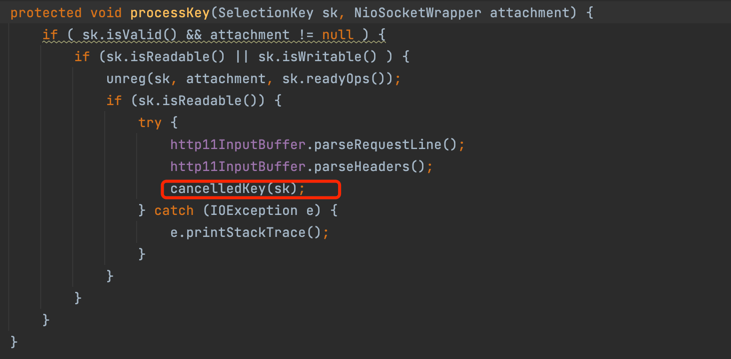

[](https://www.doubao.com/?channel=cnblogs&source=hw_db_cnblogs)

[](https://www.cnblogs.com/yishi-san/)

# [一十三](https://www.cnblogs.com/yishi-san)

## 

- [博客园](https://www.cnblogs.com/)
- [首页](https://www.cnblogs.com/yishi-san/)
- 
- [联系](https://msg.cnblogs.com/send/一十三)
- 
- [管理](https://i.cnblogs.com/)

随笔 - 20 文章 - 1 评论 - 1 阅读 - 13277

# [Tomcat源码分析使用NIO接收HTTP请求(五)----响应请求](https://www.cnblogs.com/yishi-san/p/16971524.html)

```
本章的主要目标是为请求添加响应
第一步：新建Http11OutputBuffer类
```

[](javascript:void(0);)

```
public class Http11OutputBuffer {
    protected final ByteBuffer headerBuffer;

    public Http11OutputBuffer () {
        headerBuffer = ByteBuffer.allocate(2048);
    }

    public ByteBuffer getHeaderBuffer() {
        sendStatus();
        byte[] body = ByteChunk.convertToBytes("<html><h1>Hello World!</h1></html>");
        String format = "EEE,dd MMM yyyy HH:mm:ss z";
        SimpleDateFormat sdf = new SimpleDateFormat(format, Locale.US);
        headerBuffer.put(ByteChunk.convertToBytes("Content-Type: text/html"));
        headerBuffer.put((byte) '\r').put((byte) '\n');
        headerBuffer.put(ByteChunk.convertToBytes("Content-Length:" + body.length));
        headerBuffer.put((byte) '\r').put((byte) '\n');
        headerBuffer.put(ByteChunk.convertToBytes("Date:" + sdf.format(new Date())));
        headerBuffer.put((byte) '\r').put((byte) '\n');
        headerBuffer.put(ByteChunk.convertToBytes("Server:Apache/1.1"));
        headerBuffer.put((byte) '\r').put((byte) '\n');
        headerBuffer.put(ByteChunk.convertToBytes("Connection:keep-alive"));
        headerBuffer.put((byte) '\r').put((byte) '\n');
        headerBuffer.put((byte) '\r').put((byte) '\n');
        headerBuffer.put(body);
        headerBuffer.flip();
        byte[] bb = Arrays.copyOfRange(headerBuffer.array(), 0, headerBuffer.limit());
        ByteBuffer result =ByteBuffer.allocate(bb.length);
        result.put(bb);
        return result;
    }

    public void sendStatus() {
        write(ByteChunk.convertToBytes("HTTP/1.1"));
        headerBuffer.put((byte) ' ');

        write(ByteChunk.convertToBytes("200"));

        headerBuffer.put((byte) ' ');
        write(ByteChunk.convertToBytes("OK"));


        headerBuffer.put((byte) '\r').put((byte) '\n');
    }


    public void write(byte[] b) {
        headerBuffer.put(b);
    }
}
```

[](javascript:void(0);)

```
第二步：在ByteChunk类中添加convertToBytes方法
```

[](javascript:void(0);)

```
public static final byte[] convertToBytes(String value) {
    byte[] result = new byte[value.length()];
    for (int i = 0; i < value.length(); i++) {
        result[i] = (byte) value.charAt(i);
    }
    return result;
}
```

[](javascript:void(0);)

```
第三步：在Poller中新建cancelledKey方法。并在processKey方法中进行调用
```

[](javascript:void(0);)

```
public void cancelledKey(SelectionKey key) {
    NioSocketWrapper ka = null;
    try {
        ka = (NioSocketWrapper) key.attachment();
        if (ka != null) {
            System.out.println("************************************************");
            NioChannel nioChannel = ka.getSocket();
            Http11OutputBuffer ho = new Http11OutputBuffer();
            ByteBuffer bb = ho.getHeaderBuffer();
            System.out.println("=====" + bb.capacity());
            System.out.println(new String(bb.array(), StandardCharsets.UTF_8));
            int cout=0;
            bb.flip();
            while(bb.hasRemaining()) {
                cout = nioChannel.write(bb);
                Thread.sleep(2000);
                System.out.println("等待。。。。。。" + cout);
            }
            nioChannel.close();
        }
    } catch (Exception e) {

    }
}
```

[](javascript:void(0);)



 

 第四步：修改NioChannel的write方法

```
@Override
public int write(ByteBuffer src) throws IOException {
     return sc.write(src);
}
使用浏览器访问http://localhost:8000/结果如下
```


 

 

```
结束！！！
```

分类: [Tomcat](https://www.cnblogs.com/yishi-san/category/2203390.html)

[好文要顶](javascript:void(0);) [关注我](javascript:void(0);) [收藏该文](javascript:void(0);) [微信分享](javascript:void(0);)

[](https://home.cnblogs.com/u/yishi-san/)

[一十三](https://home.cnblogs.com/u/yishi-san/)
[粉丝 - 2](https://home.cnblogs.com/u/yishi-san/followers/) [关注 - 1](https://home.cnblogs.com/u/yishi-san/followees/)

[+加关注](javascript:void(0);)

0

0

[升级成为会员](https://cnblogs.vip/)

[« ](https://www.cnblogs.com/yishi-san/p/16932180.html)上一篇： [Tomcat源码分析使用NIO接收HTTP请求(四)----解析请求头](https://www.cnblogs.com/yishi-san/p/16932180.html)
[» ](https://www.cnblogs.com/yishi-san/p/16971500.html)下一篇： [Tomcat源码分析使用NIO接收HTTP请求(六)----变更工程目录](https://www.cnblogs.com/yishi-san/p/16971500.html)

posted @ 2022-12-10 14:19 [一十三](https://www.cnblogs.com/yishi-san) 阅读(104) 评论(0) [编辑](https://i.cnblogs.com/EditPosts.aspx?postid=16971524) [收藏](javascript:void(0)) [举报](javascript:void(0))


[刷新评论](javascript:void(0);)[刷新页面](https://www.cnblogs.com/yishi-san/p/16971524.html#)[返回顶部](https://www.cnblogs.com/yishi-san/p/16971524.html#top)

发表评论 [升级成为园子VIP会员](https://cnblogs.vip/)


编辑预览


 自动补全

 [退出](javascript:void(0);) [订阅评论](javascript:void(0);) [我的博客](https://www.cnblogs.com/Carl-Don/)

[Ctrl+Enter快捷键提交]

[【推荐】还在用 ECharts 开发大屏？试试这款永久免费的开源 BI 工具！](https://dataease.cn/?utm_source=cnblogs)
[【推荐】编程新体验，更懂你的AI，立即体验豆包MarsCode编程助手](https://www.marscode.cn/?utm_source=advertising&utm_medium=cnblogs.com_ug_cpa&utm_term=hw_marscode_cnblogs&utm_content=home)
[【推荐】凌霞软件回馈社区，博客园 & 1Panel & Halo 联合会员上线](https://www.cnblogs.com/cmt/p/18669224)
[【推荐】抖音旗下AI助手豆包，你的智能百科全书，全免费不限次数](https://www.doubao.com/?channel=cnblogs&source=hw_db_cnblogs)
[【推荐】博客园社区专享云产品让利特惠，阿里云新客6.5折上折](https://market.cnblogs.com/)
[【推荐】轻量又高性能的 SSH 工具 IShell：AI 加持，快人一步](http://ishell.cc/)

[](https://www.doubao.com/chat/coding?channel=cnblogs&source=hw_db_cnblogs)

**相关博文：**

·[Tomcat源码分析使用NIO接收HTTP请求(一)----简单实现Acceptor、Poller、PollerEvent](https://www.cnblogs.com/yishi-san/p/16900079.html)

·[Tomcat源码分析使用NIO接收HTTP请求(二)----使用NioSocketWrapper封装SocketChannel](https://www.cnblogs.com/yishi-san/p/16900237.html)

·[10、http的解析](https://www.cnblogs.com/honger/p/17730599.html)

·[tomcat源码分析（二）如何处理请求](https://www.cnblogs.com/sword-successful/p/17162835.html)

·[【Socket】基于 Java NIO 的 HTTP 请求过程](https://www.cnblogs.com/kukuxjx/p/17238643.html)

**阅读排行：**
· [趁着过年的时候手搓了一个低代码框架](https://www.cnblogs.com/codelove/p/18719305)
· [本地部署DeepSeek后，没有好看的交互界面怎么行！](https://www.cnblogs.com/xiezhr/p/18718693)
· [为什么说在企业级应用开发中，后端往往是效率杀手？](https://www.cnblogs.com/jackyfei/p/18712595)
· [AI工具推荐：领先的开源 AI 代码助手——Continue](https://www.cnblogs.com/mingupupu/p/18716802)
· [用 C# 插值字符串处理器写一个 sscanf](https://www.cnblogs.com/hez2010/p/18718386/csharp-interpolated-string-sscanf)

### 公告

昵称： [一十三](https://home.cnblogs.com/u/yishi-san/)
园龄： [7年10个月](https://home.cnblogs.com/u/yishi-san/)
粉丝： [2](https://home.cnblogs.com/u/yishi-san/followers/)
关注： [1](https://home.cnblogs.com/u/yishi-san/followees/)

[+加关注](javascript:void(0))

| [<](javascript:void(0);)2025年2月[>](javascript:void(0);) |      |      |      |      |      |      |
| --------------------------------------------------------- | ---- | ---- | ---- | ---- | ---- | ---- |
| 日                                                        | 一   | 二   | 三   | 四   | 五   | 六   |
| 26                                                        | 27   | 28   | 29   | 30   | 31   | 1    |
| 2                                                         | 3    | 4    | 5    | 6    | 7    | 8    |
| 9                                                         | 10   | 11   | 12   | 13   | 14   | 15   |
| 16                                                        | 17   | 18   | 19   | 20   | 21   | 22   |
| 23                                                        | 24   | 25   | 26   | 27   | 28   | 1    |
| 2                                                         | 3    | 4    | 5    | 6    | 7    | 8    |

### 搜索

 

### 常用链接

- [我的随笔](https://www.cnblogs.com/yishi-san/p/)
- [我的评论](https://www.cnblogs.com/yishi-san/MyComments.html)
- [我的参与](https://www.cnblogs.com/yishi-san/OtherPosts.html)
- [最新评论](https://www.cnblogs.com/yishi-san/comments)
- [我的标签](https://www.cnblogs.com/yishi-san/tag/)

### [我的标签](https://www.cnblogs.com/yishi-san/tag/)

- [JavaScript(1)](https://www.cnblogs.com/yishi-san/tag/JavaScript/)

### [随笔分类](https://www.cnblogs.com/yishi-san/post-categories)

- [go(1)](https://www.cnblogs.com/yishi-san/category/1683619.html)
- [java(1)](https://www.cnblogs.com/yishi-san/category/1473165.html)
- [JavaScript(2)](https://www.cnblogs.com/yishi-san/category/982421.html)
- [MySql(1)](https://www.cnblogs.com/yishi-san/category/1099028.html)
- [Spring(1)](https://www.cnblogs.com/yishi-san/category/1561179.html)
- [Tomcat(8)](https://www.cnblogs.com/yishi-san/category/2203390.html)
- [密码学(1)](https://www.cnblogs.com/yishi-san/category/1775967.html)
- [区块链(3)](https://www.cnblogs.com/yishi-san/category/1545424.html)

### 随笔档案

- [2022年12月(3)](https://www.cnblogs.com/yishi-san/p/archive/2022/12)
- [2022年11月(4)](https://www.cnblogs.com/yishi-san/p/archive/2022/11)
- [2022年8月(2)](https://www.cnblogs.com/yishi-san/p/archive/2022/08)
- [2021年3月(1)](https://www.cnblogs.com/yishi-san/p/archive/2021/03)
- [2020年10月(1)](https://www.cnblogs.com/yishi-san/p/archive/2020/10)
- [2020年6月(1)](https://www.cnblogs.com/yishi-san/p/archive/2020/06)
- [2020年4月(1)](https://www.cnblogs.com/yishi-san/p/archive/2020/04)
- [2020年3月(3)](https://www.cnblogs.com/yishi-san/p/archive/2020/03)
- [2019年10月(1)](https://www.cnblogs.com/yishi-san/p/archive/2019/10)
- [2019年5月(1)](https://www.cnblogs.com/yishi-san/p/archive/2019/05)
- [2019年4月(1)](https://www.cnblogs.com/yishi-san/p/archive/2019/04)
- [2017年4月(1)](https://www.cnblogs.com/yishi-san/p/archive/2017/04)

### [文章分类](https://www.cnblogs.com/yishi-san/article-categories)

- [MySql(1)](https://www.cnblogs.com/yishi-san/category/1099036.html)

### [阅读排行榜](https://www.cnblogs.com/yishi-san/most-viewed)

- [1. DES算法原理(4637)](https://www.cnblogs.com/yishi-san/p/12990973.html)
- [2. 关于Copper.js的简单使用方法(1448)](https://www.cnblogs.com/yishi-san/p/13782983.html)
- [3. sql与集合(872)](https://www.cnblogs.com/yishi-san/p/10624122.html)
- [4. Tomcat源码分析使用NIO接收HTTP请求(一)----简单实现Acceptor、Poller、PollerEvent(858)](https://www.cnblogs.com/yishi-san/p/16900079.html)
- [5. 对于go当中的cli简单理解(798)](https://www.cnblogs.com/yishi-san/p/12592048.html)

### [评论排行榜](https://www.cnblogs.com/yishi-san/most-commented)

- [1. Tomcat源码分析使用NIO接收HTTP请求(一)----简单实现Acceptor、Poller、PollerEvent(1)](https://www.cnblogs.com/yishi-san/p/16900079.html)

### [推荐排行榜](https://www.cnblogs.com/yishi-san/most-liked)

- [1. Tomcat源码分析使用NIO接收HTTP请求(三)----解析请求行(1)](https://www.cnblogs.com/yishi-san/p/16932071.html)
- [2. Tomcat源码分析使用NIO接收HTTP请求(一)----简单实现Acceptor、Poller、PollerEvent(1)](https://www.cnblogs.com/yishi-san/p/16900079.html)

### [最新评论](https://www.cnblogs.com/yishi-san/comments)

- [1. Re:Tomcat源码分析使用NIO接收HTTP请求(一)----简单实现Acceptor、Poller、PollerEvent](https://www.cnblogs.com/yishi-san/p/16900079.html)
- 好文
- --邓等灯等灯

Copyright © 2025 一十三
Powered by .NET 9.0 on Kubernetes