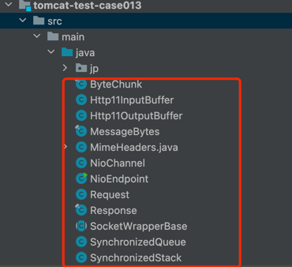
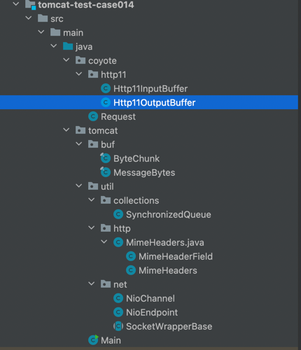

[](https://www.doubao.com/?channel=cnblogs&source=hw_db_cnblogs)

[](https://www.cnblogs.com/yishi-san/)

# [一十三](https://www.cnblogs.com/yishi-san)

## 

- [博客园](https://www.cnblogs.com/)
- [首页](https://www.cnblogs.com/yishi-san/)
- 
- [联系](https://msg.cnblogs.com/send/一十三)
- 
- [管理](https://i.cnblogs.com/)

随笔 - 20 文章 - 1 评论 - 1 阅读 - 13277

# [Tomcat源码分析使用NIO接收HTTP请求(六)----变更工程目录](https://www.cnblogs.com/yishi-san/p/16971500.html)

```
本章的主要目标是根据Tomcat目录对上一章的工程目录进行变更，使之我们的程序与Tomcat想接近，便于后续学习。
下图是上一章的工程目录图
```



 

```
下面这张图是本章中所使用的目录结构，由于目录的变更对程序影响较大，改动点很多，但并不难于理解，所以将所有代码贴在文章最后。
```



 


[](javascript:void(0);)

```
public class Http11InputBuffer {
    // 请求行阶段
    private int parsingRequestLinePhase = 0;
    // 请求行字段起始位置
    private int parsingRequestLineStart = 0;
    private ByteBuffer byteBuffer = ByteBuffer.allocate(10000);
    private SocketWrapperBase<?> wrapper;
    private Request request = new Request();
    private HeaderParsePosition headerParsePos;
    private final MimeHeaders headers;
    private final HeaderParseData headerData = new HeaderParseData();
    private volatile boolean parsingHeader;

    public Http11InputBuffer() {
        headerParsePos = HeaderParsePosition.HEADER_START;
        headers = request.getMimeHeaders();

        parsingHeader = true;
    }

    private static class HeaderParseData {
        int lineStart = 0;
        int start = 0;
        int realPos = 0;
        int lastSignificantChar = 0;
        MessageBytes headerValue = null;
        public void recycle() {
            lineStart = 0;
            start = 0;
            realPos = 0;
            lastSignificantChar = 0;
            headerValue = null;
        }
    }

    private enum HeaderParsePosition {
        HEADER_START,
        HEADER_NAME,
        HEADER_VALUE_START,
        HEADER_VALUE,
        HEADER_MULTI_LINE,
        HEADER_SKIPLINE
    }

    private enum HeaderParseStatus {
        DONE, HAVE_MORE_HEADERS, NEED_MORE_DATA
    }

    public void init(SocketWrapperBase<?> socketWrapper) {
        wrapper = socketWrapper;
        byteBuffer.position(0).limit(0);
    }

    /***
     * 第六阶段 保存解析后的数据以便于后续使用。
     * 在Tomcat中定义了两个类来分别保存byte类型和char类型数据分别是ByteChunk和CharChunk，又定义了一个MessageBytes类分来引用ByteChunk
     * 和CharChunk类，在这里我们先专注于创建MessageBytes和ByteChunk类
     */
    public boolean parseRequestLine() throws IOException {
        byte chr = 0;
        if (parsingRequestLinePhase < 2) {
            do{
                if (byteBuffer.position() >= byteBuffer.limit()) {
                    if (!fill()) {
                        return false;
                    }
                }
                chr = byteBuffer.get();
            }while((chr == (byte) '\r') || (chr == (byte) '\n'));
            byteBuffer.position(byteBuffer.position() - 1);
            parsingRequestLineStart = byteBuffer.position();
            System.out.println("postion="+byteBuffer.position() +";limit=" + byteBuffer.limit());
            parsingRequestLinePhase = 2;
        }
        // =====================-*-__-*-===================================//
        if (parsingRequestLinePhase == 2) {
            boolean space = false;
            // 获取GET
            while(!space) {
                int pos = byteBuffer.position();
                if (byteBuffer.position() >= byteBuffer.limit()) {
                    if (!fill()) {
                        return false;
                    }
                }
                chr = byteBuffer.get();
                if (chr == (byte) ' ' || chr == (byte) '\t') {
                    space = true;
                    // 保存数据
                    request.method().setBytes(byteBuffer.array(), parsingRequestLineStart,
                            pos - parsingRequestLineStart);
                }
            }
            parsingRequestLinePhase = 3;
        }
        // =====================-*-__-*-===================================//
        if (parsingRequestLinePhase == 3) {
            boolean space = false;
            // 获取 空格
            while(!space) {
                if (byteBuffer.position() >= byteBuffer.limit()) {
                    if (!fill()) {
                        return false;
                    }
                }
                chr = byteBuffer.get();
                if (!(chr == (byte) ' ' || chr == (byte) '\t')) {
                    space = true;
                    byteBuffer.position(byteBuffer.position() - 1);
                }
            }
            parsingRequestLineStart = byteBuffer.position();
            parsingRequestLinePhase = 4;
        }
        // =====================-*-__-*-===================================//
        if (parsingRequestLinePhase == 4) {
            boolean space = false;
            // 获取 /
            while(!space) {
                int pos = byteBuffer.position();
                if (byteBuffer.position() >= byteBuffer.limit()) {
                    if (!fill()) {
                        return false;
                    }
                }
                chr = byteBuffer.get();
                if (chr == (byte) ' ' || chr == (byte) '\t') {
                    space = true;
                    request.method().setBytes(byteBuffer.array(), parsingRequestLineStart,
                            pos - parsingRequestLineStart);
                }
            }
            parsingRequestLinePhase = 5;
        }

        // =====================-*-__-*-===================================//
        if (parsingRequestLinePhase == 5) {
            boolean space = false;
            // 获取 空格
            while(!space) {
                if (byteBuffer.position() >= byteBuffer.limit()) {
                    if (!fill()) {
                        return false;
                    }
                }
                chr = byteBuffer.get();
                if (!(chr == (byte) ' ' || chr == (byte) '\t')) {
                    space = true;
                    byteBuffer.position(byteBuffer.position() - 1);
                }
            }
            parsingRequestLineStart = byteBuffer.position();
            parsingRequestLinePhase = 6;
        }
        // =====================-*-__-*-===================================//
        if (parsingRequestLinePhase == 6) {
            boolean space = false;
            // 获取 HTTP/1.1
            while(!space) {
                int pos = byteBuffer.position();
                if (byteBuffer.position() >= byteBuffer.limit()) {
                    if (!fill()) {
                        return false;
                    }
                }
                chr = byteBuffer.get();
                // 这里和上一个有点区别，判断换行
                if ((chr == (byte) '\r') || (chr == (byte) '\n')) {
                    space = true;
                    request.method().setBytes(byteBuffer.array(), parsingRequestLineStart,
                            pos - parsingRequestLineStart);
                }
            }
            parsingRequestLinePhase = 7;
        }
        if (parsingRequestLinePhase == 7) {
            parsingRequestLinePhase = 0;
            parsingRequestLineStart = 0;
            return true;
        }
        throw new IOException("解析错误");
    }

    public boolean parseHeaders() throws IOException {
        HeaderParseStatus status = HeaderParseStatus.HAVE_MORE_HEADERS;
        do {
            status = parseHeader();
        } while (status == HeaderParseStatus.HAVE_MORE_HEADERS);
        if (status == HeaderParseStatus.DONE) {
            parsingHeader = false;
            return true;
        } else {
            return false;
        }
    }


    /**
     *    第一阶段
     *    User-Agent: PostmanRuntime/7.28.4
     *    Accept: text/html
     *    Postman-Token: c125824d-ae13-4082-9ae0-87c1750476b8
     *    Host: localhost:8000
     *    Accept-Encoding: gzip, deflate, br
     *    Connection: keep-alive
     *    以上是我们即将要解析的请求头(类似这种格式)
     *
     *    完成对User-Agent: PostmanRuntime/7.28.4这一行的解析
     */
    public HeaderParseStatus parseHeader() throws IOException {
        int chr = byteBuffer.position();
        int prevChr = chr;
        int tempLineStart = chr;
        while (headerParsePos == HeaderParsePosition.HEADER_START) {
            if (byteBuffer.position() >= byteBuffer.limit()) {
                if (!fill()) {
                    headerParsePos = HeaderParsePosition.HEADER_START;
                    return HeaderParseStatus.NEED_MORE_DATA;
                }
            }

            prevChr = chr;
            chr = byteBuffer.get();

            if (chr == (byte) '\r' && prevChr != (byte) '\r') {
                // 只有回车并不能代表结束
            } else if (prevChr == (byte) '\r' && chr == '\n') {
                // 已经解析结束了，无需再解析了
                return HeaderParseStatus.DONE;
            } else {
                if (prevChr == (byte) '\r') {
                    byteBuffer.position(byteBuffer.position() - 2);
                } else {
                    byteBuffer.position(byteBuffer.position() - 1);
                }
                break;
            }
        }
        /*System.out.println("postion="+byteBuffer.position()+";limit=" + byteBuffer.limit());
        byte[] c = Arrays.copyOfRange(byteBuffer.array(), tempLineStart, byteBuffer.position());
        System.out.println("value=" + new String(c));*/
        if (headerParsePos == HeaderParsePosition.HEADER_START) {
            headerData.start = byteBuffer.position();
            headerData.lineStart = headerData.start;
            headerParsePos = HeaderParsePosition.HEADER_NAME;
        }

        // 获取user-agent:
        tempLineStart = byteBuffer.position();
        while (headerParsePos == HeaderParsePosition.HEADER_NAME) {
            if (byteBuffer.position() >= byteBuffer.limit()) {
                if (!fill()) {
                    headerParsePos = HeaderParsePosition.HEADER_START;
                    return HeaderParseStatus.NEED_MORE_DATA;
                }
            }
            int pos = byteBuffer.position();
            chr = byteBuffer.get();
            if (chr == (byte) ':') {
                headerParsePos = HeaderParsePosition.HEADER_VALUE_START;
                headerData.headerValue = headers.addValue(byteBuffer.array(), headerData.start,
                        pos - headerData.start);
                pos = byteBuffer.position();
                headerData.start = pos;
                headerData.realPos = pos;
                headerData.lastSignificantChar = pos;
                break;
            }
            // 将大写字母转化为小写字母
            if ((chr >= (byte) 'A') && (chr <= (byte) 'Z')) {
                byteBuffer.put(pos, (byte) (chr - ((byte)'A' - (byte)'a')));
            }
        }
        /*System.out.println("postion="+byteBuffer.position()+";limit=" + byteBuffer.limit());
        c = Arrays.copyOfRange(byteBuffer.array(), tempLineStart, byteBuffer.position());
        System.out.println("value=" + new String(c));*/

        tempLineStart = byteBuffer.position();
        while (headerParsePos == HeaderParsePosition.HEADER_VALUE_START) {
            if (headerParsePos == HeaderParsePosition.HEADER_VALUE_START) {
                while (true) {
                    if (byteBuffer.position() >= byteBuffer.limit()) {
                        if (!fill()) {
                            return HeaderParseStatus.NEED_MORE_DATA;
                        }
                    }

                    chr = byteBuffer.get();
                    if (!(chr == (byte) ' ' || chr == (byte) '\t')) {
                        headerParsePos = HeaderParsePosition.HEADER_VALUE;
                        byteBuffer.position(byteBuffer.position() - 1);
                        break;
                    }
                }
            }

            tempLineStart = byteBuffer.position();
            if (headerParsePos == HeaderParsePosition.HEADER_VALUE) {
                boolean eol = false;
                while (!eol) {
                    if (byteBuffer.position() >= byteBuffer.limit()) {
                        if (!fill()) {
                            return HeaderParseStatus.NEED_MORE_DATA;
                        }
                    }
                    prevChr = chr;
                    chr = byteBuffer.get();
                    if (prevChr == '\r' && chr == '\n') {
                        eol = true;
                    } else if(chr == (byte) ' ' || chr == (byte) '\t') { // 清除空格
                        byteBuffer.put(headerData.realPos, (byte)chr);
                        headerData.realPos++;
                    }else {
                        byteBuffer.put(headerData.realPos, (byte)chr);
                        headerData.realPos++;
                        headerData.lastSignificantChar = headerData.realPos;
                    }
                }
                headerData.realPos = headerData.lastSignificantChar;
                headerParsePos = HeaderParsePosition.HEADER_MULTI_LINE;
            }
            byte peek = byteBuffer.get(byteBuffer.position());
            if (headerParsePos == HeaderParsePosition.HEADER_MULTI_LINE) {
                if ((peek != (byte) ' ') && (peek != '\t')) {
                    headerParsePos = HeaderParsePosition.HEADER_START;
                    break;
                } else {
                    // Copying one extra space in the buffer (since there must
                    // be at least one space inserted between the lines)
                    byteBuffer.put(headerData.realPos, peek);
                    headerData.realPos++;
                    headerParsePos = HeaderParsePosition.HEADER_VALUE_START;
                }
            }
        }
        /*System.out.println("postion="+byteBuffer.position()+";limit=" + byteBuffer.limit());
        c = Arrays.copyOfRange(byteBuffer.array(), tempLineStart, byteBuffer.position());
        System.out.println("value=" + new String(c));*/
        headerData.headerValue.setBytes(byteBuffer.array(), headerData.start,
                headerData.lastSignificantChar - headerData.start);
        headerData.recycle();
        return HeaderParseStatus.HAVE_MORE_HEADERS;
    }


    /**
     * 如果当前读取的数据不足以应对接下来解析将尝试读取新的数据
     */
    private boolean fill() throws IOException {
        int nRead = -1;
        byteBuffer.mark();
        try {
            if (byteBuffer.position() < byteBuffer.limit()) {
                byteBuffer.position(byteBuffer.limit());
            }
            byteBuffer.limit(byteBuffer.capacity());
            nRead = wrapper.read(byteBuffer);
        } finally {
            byteBuffer.limit(byteBuffer.position()).reset();
            System.out.println(new String(byteBuffer.array(), StandardCharsets.UTF_8));
            System.out.println("postion="+byteBuffer.position() +";limit=" + byteBuffer.limit() + ";nRead=" + nRead);
        }
        return nRead > 0;
    }
}
```

[](javascript:void(0);)


[](javascript:void(0);)

```
public class Http11OutputBuffer {

    protected final ByteBuffer headerBuffer;

    public Http11OutputBuffer() {
        headerBuffer = ByteBuffer.allocate(2048);
    }

    public ByteBuffer getHeaderBuffer() {
        sendStatus();
        byte[] body = ByteChunk.convertToBytes("<html><h1>Hello World!</h1></html>");
        String format = "EEE,dd MMM yyyy HH:mm:ss z";
        SimpleDateFormat sdf = new SimpleDateFormat(format, Locale.US);
        headerBuffer.put(ByteChunk.convertToBytes("Content-Type: text/html"));
        headerBuffer.put((byte) '\r').put((byte) '\n');
        headerBuffer.put(ByteChunk.convertToBytes("Content-Length:" + body.length));
        headerBuffer.put((byte) '\r').put((byte) '\n');
        headerBuffer.put(ByteChunk.convertToBytes("Date:" + sdf.format(new Date())));
        headerBuffer.put((byte) '\r').put((byte) '\n');
        headerBuffer.put(ByteChunk.convertToBytes("Server:Apache/1.1"));
        headerBuffer.put((byte) '\r').put((byte) '\n');
        headerBuffer.put(ByteChunk.convertToBytes("Connection:keep-alive"));
        headerBuffer.put((byte) '\r').put((byte) '\n');
        headerBuffer.put((byte) '\r').put((byte) '\n');
        headerBuffer.put(body);
        headerBuffer.flip();
        byte[] aa = headerBuffer.array();
        //System.out.println("****headerBuffer.limit()*******===" + headerBuffer.limit());
        byte[] bb = Arrays.copyOfRange(headerBuffer.array(), 0, headerBuffer.limit());
        //System.out.println("value=" + new String(bb));
        ByteBuffer result =ByteBuffer.allocate(bb.length);
        result.put(bb);
        return result;
    }

    public void sendStatus() {
        // Write protocol name
        write(ByteChunk.convertToBytes("HTTP/1.1"));
        headerBuffer.put((byte) ' ');

        write(ByteChunk.convertToBytes("200"));

        headerBuffer.put((byte) ' ');
        write(ByteChunk.convertToBytes("OK"));


        headerBuffer.put((byte) '\r').put((byte) '\n');
    }


    public void write(byte[] b) {
        headerBuffer.put(b);
    }


}
```

[](javascript:void(0);)


[](javascript:void(0);)

```
public final class ByteChunk {
    // 缓存数据
    private byte[] buff;
    protected int start;
    protected int end;
    public void setBytes(byte[] b, int off, int len) {
        buff = b;
        start = off;
        end = start + len;
        byte[] c = Arrays.copyOfRange(b, start, end);
        byte[] d = Arrays.copyOfRange(b, 0, end);
        System.out.println("ByteChunk类setBytes();start=" + off + ";end=" + end +";content="+ new String(c));
        System.out.println("ByteChunk类setBytes();全部数据"+ new String(d));
        System.out.println("================================================================================");
    }

    public static final byte[] convertToBytes(String value) {
        byte[] result = new byte[value.length()];
        for (int i = 0; i < value.length(); i++) {
            result[i] = (byte) value.charAt(i);
        }
        return result;
    }
}
```

[](javascript:void(0);)


[](javascript:void(0);)

```
public final class MessageBytes implements Cloneable, Serializable {
    private final ByteChunk byteC = new ByteChunk();
    private String strValue;
    public static MessageBytes newInstance() {
        return factory.newInstance();
    }
    public void setBytes(byte[] b, int off, int len) {
        byteC.setBytes( b, off, len );
    }

    public ByteChunk getByteChunk() {
        return byteC;
    }

    public void setString( String s ) {
        strValue=s;
    }
    private static final MessageBytesFactory factory = new MessageBytesFactory();
    private static class MessageBytesFactory {
        protected MessageBytesFactory() {
        }
        public MessageBytes newInstance() {
            return new MessageBytes();
        }
    }
}
```

[](javascript:void(0);)


[](javascript:void(0);)

```
public class SynchronizedQueue<T> {

    public static final int DEFAULT_SIZE = 128;

    private Object[] queue;
    private int size;
    private int insert = 0;
    private int remove = 0;

    public SynchronizedQueue() {
        this(DEFAULT_SIZE);
    }

    public SynchronizedQueue(int initialSize) {
        queue = new Object[initialSize];
        size = initialSize;
    }

    public synchronized boolean offer(T t) {
        queue[insert++] = t;

        // Wrap
        if (insert == size) {
            insert = 0;
        }

        if (insert == remove) {
            expand();
        }
        return true;
    }

    public synchronized T poll() {
        if (insert == remove) {
            // empty
            return null;
        }

        @SuppressWarnings("unchecked")
        T result = (T) queue[remove];
        queue[remove] = null;
        remove++;

        // Wrap
        if (remove == size) {
            remove = 0;
        }

        return result;
    }

    private void expand() {
        int newSize = size * 2;
        Object[] newQueue = new Object[newSize];

        System.arraycopy(queue, insert, newQueue, 0, size - insert);
        System.arraycopy(queue, 0, newQueue, size - insert, insert);

        insert = size;
        remove = 0;
        queue = newQueue;
        size = newSize;
    }

    public synchronized int size() {
        int result = insert - remove;
        if (result < 0) {
            result += size;
        }
        return result;
    }

    public synchronized void clear() {
        queue = new Object[size];
        insert = 0;
        remove = 0;
    }
}
```

[](javascript:void(0);)


[](javascript:void(0);)

```
public class MimeHeaders {
    /**请求头默认大小*/
    public static final int DEFAULT_HEADER_SIZE=8;
    private MimeHeaderField[] headers = new MimeHeaderField[DEFAULT_HEADER_SIZE];

    /**当前字段*/
    private int count;

    /**字段限制*/
    private int limit = -1;

    public MessageBytes addValue(byte b[], int startN, int len) {
        MimeHeaderField mhf=createHeader();
        mhf.getName().setBytes(b, startN, len);
        return mhf.getValue();
    }

    public MessageBytes setValue( String name ) {
        MimeHeaderField mh = createHeader();
        mh.getName().setString(name);
        return mh.getValue();
    }

    private MimeHeaderField createHeader() {
        if (limit > -1 && count >= limit) {
            throw new RuntimeException();
        }
        MimeHeaderField mh;
        int len = headers.length;
        if (count >= len) {
            // expand header list array
            int newLength = count * 2;
            if (limit > 0 && newLength > limit) {
                newLength = limit;
            }
            MimeHeaderField tmp[] = new MimeHeaderField[newLength];
            System.arraycopy(headers, 0, tmp, 0, len);
            headers = tmp;
        }
        if ((mh = headers[count]) == null) {
            headers[count] = mh = new MimeHeaderField();
        }
        count++;
        return mh;
    }
}

class MimeHeaderField {

    private final MessageBytes nameB = MessageBytes.newInstance();
    private final MessageBytes valueB = MessageBytes.newInstance();

    public MessageBytes getName() {
        return nameB;
    }

    public MessageBytes getValue() {
        return valueB;
    }
}
```

[](javascript:void(0);)


[](javascript:void(0);)

```
public class NioChannel implements ByteChannel {
    protected SocketChannel sc = null;

    public NioChannel(SocketChannel channel) {
        this.sc = channel;
    }

    @Override
    public int read(ByteBuffer dst) throws IOException {
        return 0;
    }

    @Override
    public int write(ByteBuffer src) throws IOException {
        return sc.write(src);
    }

    @Override
    public boolean isOpen() {
        return false;
    }

    @Override
    public void close() throws IOException {
        getIOChannel().socket().close();
        getIOChannel().close();
    }

    public SocketChannel getIOChannel() {
        return sc;
    }
}
```

[](javascript:void(0);)


[](javascript:void(0);)

```
public class NioEndpoint {

    private Poller[] pollers = null;
    public static final int OP_REGISTER = 0x100;
    private ServerSocketChannel serverSock = null;
    private AtomicInteger pollerRotater = new AtomicInteger(0);
    private Http11InputBuffer http11InputBuffer = new Http11InputBuffer();
    private int pollerThreadCount = Math.min(2,Runtime.getRuntime().availableProcessors());

    public void bind() {
        try {
            // 打开服务器套接字通道
            serverSock = ServerSocketChannel.open();
            // 绑定端口
            InetSocketAddress address = new InetSocketAddress(8000);
            int acceptCount = 10;
            serverSock.socket().bind(address, acceptCount);
            // 设置阻塞模式
            serverSock.configureBlocking(true);
        } catch (Exception e) {
            e.printStackTrace();
        }
    }

    public void startInternal() {
        try {
            pollers = new Poller[pollerThreadCount];
            for (int i=0; i<pollers.length; i++) {
                pollers[i] = new Poller();
                Thread pollerThread = new Thread(pollers[i]);
                // 设置线程优先级
                pollerThread.setPriority(5);
                // 设置守护线程
                pollerThread.setDaemon(true);
                pollerThread.start();
            }

            Runnable acceptor = new Acceptor();
            new Thread(acceptor).start();
        } catch (Exception e) {

        }
    }

    /**
     * 在这里将SocketChannel封装成NioChannel
     */
    protected void setSocketOptions(SocketChannel socket) {
        try {
            socket.configureBlocking(false);
            NioChannel channel = new NioChannel(socket);
            getPoller0().register(channel);
        } catch (Exception e) {
            // ignore
        }
    }

    public Poller getPoller0() {
        int idx = Math.abs(pollerRotater.incrementAndGet()) % pollers.length;
        return pollers[idx];
    }

    protected void unreg(SelectionKey sk, NioSocketWrapper socketWrapper, int readyOps) {
        // “&～xx”相当于删除xx，有就删除，没有就不变。
        reg(sk, socketWrapper, sk.interestOps() & (~readyOps));
    }

    protected void reg(SelectionKey sk, NioSocketWrapper socketWrapper, int intops) {
        sk.interestOps(intops);
        socketWrapper.interestOps(intops);
    }

    /******************************Acceptor***********************************/
    protected class Acceptor implements Runnable{
        @Override
        public void run() {
            SocketChannel socket = null;
            while (true) {
                try {
                    socket = serverSock.accept();
                    setSocketOptions(socket);
                    Thread.sleep(2000);
                } catch (Exception e) {
                    e.printStackTrace();
                }
            }
        }
    }
    /***************************************Runnable*****************************************/
    public class Poller implements Runnable {
        private Selector selector;
        private volatile int keyCount = 0;
        private final SynchronizedQueue<PollerEvent> events =
                new SynchronizedQueue<>();

        public Poller() throws IOException {
            this.selector = Selector.open();
        }

        @Override
        public void run() {
            try {
                while (true) {
                    events();
                    keyCount = selector.selectNow();
                    Iterator<SelectionKey> iterator = null;
                    if ( keyCount > 0) {
                        iterator = selector.selectedKeys().iterator();
                    }
                    while (iterator != null && iterator.hasNext()) {
                        SelectionKey sk = iterator.next();
                        iterator.remove();
                        NioSocketWrapper socketWrapper = (NioSocketWrapper) sk.attachment();
                        // 得到socket用于进行后续处理
                        if (socketWrapper != null) {
                            processKey(sk, socketWrapper);
                        }
                    }
                }
            } catch (Exception e) {
                e.printStackTrace();
            }
        }
        // 为什么非要在PollerEvent中注册
        public void register(final NioChannel channel) {
            NioSocketWrapper ka = new NioSocketWrapper(channel);
            ka.setInterestOps(SelectionKey.OP_READ);
            ka.setPoller(this);
            http11InputBuffer.init(ka);
            PollerEvent r = new PollerEvent(channel, ka,OP_REGISTER);
            addEvent(r);
        }

        private void addEvent(PollerEvent event) {
            events.offer(event);
        }

        public boolean events() {
            boolean result = false;

            PollerEvent pe = null;
            for (int i = 0, size = events.size(); i < size && (pe = events.poll()) != null; i++ ) {
                result = true;
                try {
                    pe.run();
                    pe.reset();
                } catch ( Throwable x ) {
                    // ignore
                }
            }

            return result;
        }

        public Selector getSelector() {
            return selector;
        }

        protected void processKey(SelectionKey sk, NioSocketWrapper attachment) {
            if ( sk.isValid() && attachment != null ) {
                if (sk.isReadable() || sk.isWritable() ) {
                    unreg(sk, attachment, sk.readyOps());
                    if (sk.isReadable()) {
                        try {
                            http11InputBuffer.parseRequestLine();
                            http11InputBuffer.parseHeaders();
                            cancelledKey(sk);
                        } catch (IOException e) {
                            e.printStackTrace();
                        }
                    }
                }
            }
        }
        public void cancelledKey(SelectionKey key) {
            NioSocketWrapper ka = null;
            try {
                ka = (NioSocketWrapper) key.attachment();
                if (ka != null) {
                    System.out.println("************************************************");
                    NioChannel nioChannel = ka.getSocket();
                    Http11OutputBuffer ho = new Http11OutputBuffer();
                    ByteBuffer bb = ho.getHeaderBuffer();
                    System.out.println("=====" + bb.capacity());
                    System.out.println(new String(bb.array(), StandardCharsets.UTF_8));
                    int cout=0;
                    bb.flip();
                    while(bb.hasRemaining()) {
                        cout = nioChannel.write(bb);
                        Thread.sleep(2000);
                        System.out.println("等待。。。。。。" + cout);
                    }
                    nioChannel.close();
                }
            } catch (Exception e) {
                e.printStackTrace();
            }
        }
    }

    public static class PollerEvent implements Runnable {
        private NioChannel socket;
        private int interestOps;
        private NioSocketWrapper socketWrapper;

        public PollerEvent(NioChannel socket,NioSocketWrapper socketWrapper, int intOps) {
            reset(socket, socketWrapper, intOps);
        }

        @Override
        public void run() {
            if (interestOps == OP_REGISTER) {
                try {
                    socket.getIOChannel().register(
                            socketWrapper.getPoller().getSelector(), SelectionKey.OP_READ, socketWrapper);
                } catch (Exception e) {
                    // ignore
                }
            }
        }

        public void reset(NioChannel socket, NioSocketWrapper socketWrapper, int intOps) {
            this.socket = socket;
            interestOps = intOps;
            this.socketWrapper = socketWrapper;
        }

        public void reset() {
            reset(null, null, 0);
        }
    }

    public static class NioSocketWrapper extends SocketWrapperBase<NioChannel> {

        private int interestOps = 0;
        private Poller poller = null;

        protected NioSocketWrapper(NioChannel socket) {
            super(socket);
        }

        @Override
        public int read(ByteBuffer to) throws IOException {
            return getSocket().getIOChannel().read(to);
        }

        @Override
        public void doWrite(ByteBuffer from) throws IOException {
            Selector selector = Selector.open();
            //selector.write(buf,socket,writeTimeout);
        }

        @Override
        public int read(boolean block, ByteBuffer to) throws IOException {
            getSocket().getIOChannel().read(to);
            return 0;
        }

        public int getInterestOps() {
            return interestOps;
        }

        public void setInterestOps(int interestOps) {
            this.interestOps = interestOps;
        }

        public Poller getPoller() {
            return poller;
        }

        public void setPoller(Poller poller) {
            this.poller = poller;
        }

        public int interestOps(int ops) { this.interestOps  = ops; return ops; }
    }
}
```

[](javascript:void(0);)


[](javascript:void(0);)

```
public abstract class SocketWrapperBase<E> {
    private final E socket;

    protected SocketWrapperBase(E socket) {
        this.socket = socket;
    }

    public abstract int read(boolean block, ByteBuffer to) throws IOException;
    public abstract int read(ByteBuffer to) throws IOException;
    public abstract void doWrite(ByteBuffer from) throws IOException;

    public E getSocket() {
        return socket;
    }
}
```

[](javascript:void(0);)


[](javascript:void(0);)

```
public class Main {
    public static void main(String[] args) {
        NioEndpoint server = new NioEndpoint();
        server.bind();
        server.startInternal();
    }
}
```

[](javascript:void(0);)

 

分类: [Tomcat](https://www.cnblogs.com/yishi-san/category/2203390.html)

[好文要顶](javascript:void(0);) [关注我](javascript:void(0);) [收藏该文](javascript:void(0);) [微信分享](javascript:void(0);)

[](https://home.cnblogs.com/u/yishi-san/)

[一十三](https://home.cnblogs.com/u/yishi-san/)
[粉丝 - 2](https://home.cnblogs.com/u/yishi-san/followers/) [关注 - 1](https://home.cnblogs.com/u/yishi-san/followees/)

[+加关注](javascript:void(0);)

0

0

[升级成为会员](https://cnblogs.vip/)

[« ](https://www.cnblogs.com/yishi-san/p/16971524.html)上一篇： [Tomcat源码分析使用NIO接收HTTP请求(五)----响应请求](https://www.cnblogs.com/yishi-san/p/16971524.html)
[» ](https://www.cnblogs.com/yishi-san/p/16971551.html)下一篇： [Tomcat源码分析使用NIO接收HTTP请求(七)----使用SocketProcessor接收请求](https://www.cnblogs.com/yishi-san/p/16971551.html)

posted @ 2022-12-10 14:20 [一十三](https://www.cnblogs.com/yishi-san) 阅读(46) 评论(0) [编辑](https://i.cnblogs.com/EditPosts.aspx?postid=16971500) [收藏](javascript:void(0)) [举报](javascript:void(0))


[刷新评论](javascript:void(0);)[刷新页面](https://www.cnblogs.com/yishi-san/p/16971500.html#)[返回顶部](https://www.cnblogs.com/yishi-san/p/16971500.html#top)

发表评论 [升级成为园子VIP会员](https://cnblogs.vip/)


编辑预览


 自动补全

 [退出](javascript:void(0);) [订阅评论](javascript:void(0);) [我的博客](https://www.cnblogs.com/Carl-Don/)

[Ctrl+Enter快捷键提交]

[【推荐】还在用 ECharts 开发大屏？试试这款永久免费的开源 BI 工具！](https://dataease.cn/?utm_source=cnblogs)
[【推荐】编程新体验，更懂你的AI，立即体验豆包MarsCode编程助手](https://www.marscode.cn/?utm_source=advertising&utm_medium=cnblogs.com_ug_cpa&utm_term=hw_marscode_cnblogs&utm_content=home)
[【推荐】凌霞软件回馈社区，博客园 & 1Panel & Halo 联合会员上线](https://www.cnblogs.com/cmt/p/18669224)
[【推荐】抖音旗下AI助手豆包，你的智能百科全书，全免费不限次数](https://www.doubao.com/?channel=cnblogs&source=hw_db_cnblogs)
[【推荐】博客园社区专享云产品让利特惠，阿里云新客6.5折上折](https://market.cnblogs.com/)
[【推荐】轻量又高性能的 SSH 工具 IShell：AI 加持，快人一步](http://ishell.cc/)

[](https://www.doubao.com/chat/coding?channel=cnblogs&source=hw_db_cnblogs)

**相关博文：**

·[Tomcat源码分析使用NIO接收HTTP请求(一)----简单实现Acceptor、Poller、PollerEvent](https://www.cnblogs.com/yishi-san/p/16900079.html)

·[Tomcat源码分析使用NIO接收HTTP请求(三)----解析请求行](https://www.cnblogs.com/yishi-san/p/16932071.html)

·[Tomcat学习笔记](https://www.cnblogs.com/yhr520/p/15792651.html)

·[【SpringBoot + Tomcat】【一】请求到达后端服务进程后的处理过程-连接器的创建和执行](https://www.cnblogs.com/kukuxjx/p/18120284)

·[tomcat源码分析（二）如何处理请求](https://www.cnblogs.com/sword-successful/p/17162835.html)

**阅读排行：**
· [趁着过年的时候手搓了一个低代码框架](https://www.cnblogs.com/codelove/p/18719305)
· [本地部署DeepSeek后，没有好看的交互界面怎么行！](https://www.cnblogs.com/xiezhr/p/18718693)
· [为什么说在企业级应用开发中，后端往往是效率杀手？](https://www.cnblogs.com/jackyfei/p/18712595)
· [AI工具推荐：领先的开源 AI 代码助手——Continue](https://www.cnblogs.com/mingupupu/p/18716802)
· [用 C# 插值字符串处理器写一个 sscanf](https://www.cnblogs.com/hez2010/p/18718386/csharp-interpolated-string-sscanf)

### 公告

昵称： [一十三](https://home.cnblogs.com/u/yishi-san/)
园龄： [7年10个月](https://home.cnblogs.com/u/yishi-san/)
粉丝： [2](https://home.cnblogs.com/u/yishi-san/followers/)
关注： [1](https://home.cnblogs.com/u/yishi-san/followees/)

[+加关注](javascript:void(0))

| [<](javascript:void(0);)2025年2月[>](javascript:void(0);) |      |      |      |      |      |      |
| --------------------------------------------------------- | ---- | ---- | ---- | ---- | ---- | ---- |
| 日                                                        | 一   | 二   | 三   | 四   | 五   | 六   |
| 26                                                        | 27   | 28   | 29   | 30   | 31   | 1    |
| 2                                                         | 3    | 4    | 5    | 6    | 7    | 8    |
| 9                                                         | 10   | 11   | 12   | 13   | 14   | 15   |
| 16                                                        | 17   | 18   | 19   | 20   | 21   | 22   |
| 23                                                        | 24   | 25   | 26   | 27   | 28   | 1    |
| 2                                                         | 3    | 4    | 5    | 6    | 7    | 8    |

### 搜索

 

### 常用链接

- [我的随笔](https://www.cnblogs.com/yishi-san/p/)
- [我的评论](https://www.cnblogs.com/yishi-san/MyComments.html)
- [我的参与](https://www.cnblogs.com/yishi-san/OtherPosts.html)
- [最新评论](https://www.cnblogs.com/yishi-san/comments)
- [我的标签](https://www.cnblogs.com/yishi-san/tag/)

### [我的标签](https://www.cnblogs.com/yishi-san/tag/)

- [JavaScript(1)](https://www.cnblogs.com/yishi-san/tag/JavaScript/)

### [随笔分类](https://www.cnblogs.com/yishi-san/post-categories)

- [go(1)](https://www.cnblogs.com/yishi-san/category/1683619.html)
- [java(1)](https://www.cnblogs.com/yishi-san/category/1473165.html)
- [JavaScript(2)](https://www.cnblogs.com/yishi-san/category/982421.html)
- [MySql(1)](https://www.cnblogs.com/yishi-san/category/1099028.html)
- [Spring(1)](https://www.cnblogs.com/yishi-san/category/1561179.html)
- [Tomcat(8)](https://www.cnblogs.com/yishi-san/category/2203390.html)
- [密码学(1)](https://www.cnblogs.com/yishi-san/category/1775967.html)
- [区块链(3)](https://www.cnblogs.com/yishi-san/category/1545424.html)

### 随笔档案

- [2022年12月(3)](https://www.cnblogs.com/yishi-san/p/archive/2022/12)
- [2022年11月(4)](https://www.cnblogs.com/yishi-san/p/archive/2022/11)
- [2022年8月(2)](https://www.cnblogs.com/yishi-san/p/archive/2022/08)
- [2021年3月(1)](https://www.cnblogs.com/yishi-san/p/archive/2021/03)
- [2020年10月(1)](https://www.cnblogs.com/yishi-san/p/archive/2020/10)
- [2020年6月(1)](https://www.cnblogs.com/yishi-san/p/archive/2020/06)
- [2020年4月(1)](https://www.cnblogs.com/yishi-san/p/archive/2020/04)
- [2020年3月(3)](https://www.cnblogs.com/yishi-san/p/archive/2020/03)
- [2019年10月(1)](https://www.cnblogs.com/yishi-san/p/archive/2019/10)
- [2019年5月(1)](https://www.cnblogs.com/yishi-san/p/archive/2019/05)
- [2019年4月(1)](https://www.cnblogs.com/yishi-san/p/archive/2019/04)
- [2017年4月(1)](https://www.cnblogs.com/yishi-san/p/archive/2017/04)

### [文章分类](https://www.cnblogs.com/yishi-san/article-categories)

- [MySql(1)](https://www.cnblogs.com/yishi-san/category/1099036.html)

### [阅读排行榜](https://www.cnblogs.com/yishi-san/most-viewed)

- [1. DES算法原理(4637)](https://www.cnblogs.com/yishi-san/p/12990973.html)
- [2. 关于Copper.js的简单使用方法(1448)](https://www.cnblogs.com/yishi-san/p/13782983.html)
- [3. sql与集合(872)](https://www.cnblogs.com/yishi-san/p/10624122.html)
- [4. Tomcat源码分析使用NIO接收HTTP请求(一)----简单实现Acceptor、Poller、PollerEvent(858)](https://www.cnblogs.com/yishi-san/p/16900079.html)
- [5. 对于go当中的cli简单理解(798)](https://www.cnblogs.com/yishi-san/p/12592048.html)

### [评论排行榜](https://www.cnblogs.com/yishi-san/most-commented)

- [1. Tomcat源码分析使用NIO接收HTTP请求(一)----简单实现Acceptor、Poller、PollerEvent(1)](https://www.cnblogs.com/yishi-san/p/16900079.html)

### [推荐排行榜](https://www.cnblogs.com/yishi-san/most-liked)

- [1. Tomcat源码分析使用NIO接收HTTP请求(三)----解析请求行(1)](https://www.cnblogs.com/yishi-san/p/16932071.html)
- [2. Tomcat源码分析使用NIO接收HTTP请求(一)----简单实现Acceptor、Poller、PollerEvent(1)](https://www.cnblogs.com/yishi-san/p/16900079.html)

### [最新评论](https://www.cnblogs.com/yishi-san/comments)

- [1. Re:Tomcat源码分析使用NIO接收HTTP请求(一)----简单实现Acceptor、Poller、PollerEvent](https://www.cnblogs.com/yishi-san/p/16900079.html)
- 好文
- --邓等灯等灯

Copyright © 2025 一十三
Powered by .NET 9.0 on Kubernetes