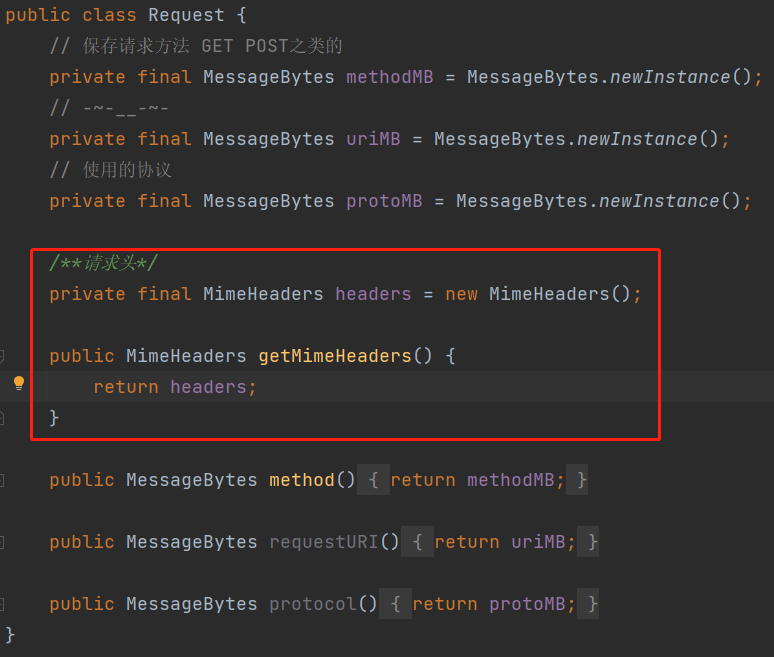
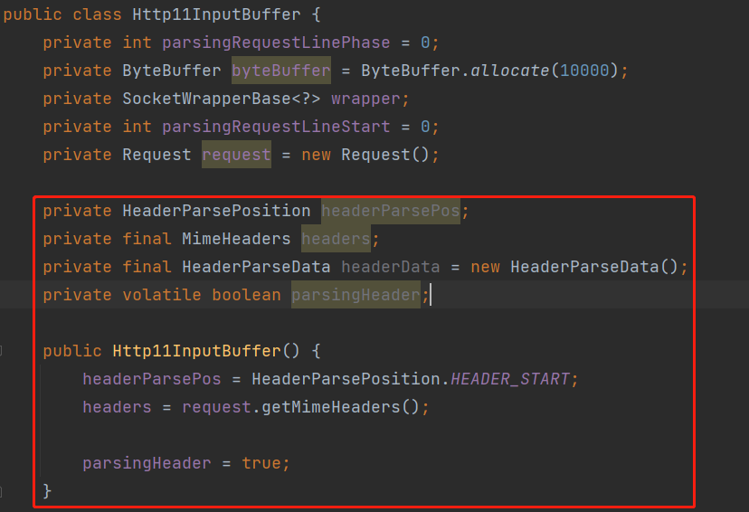
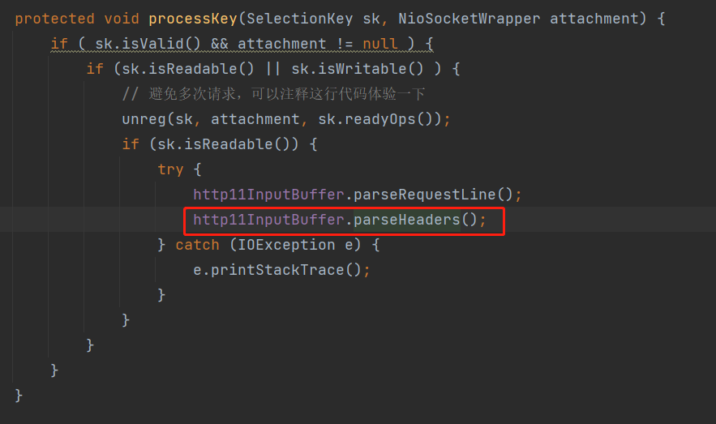
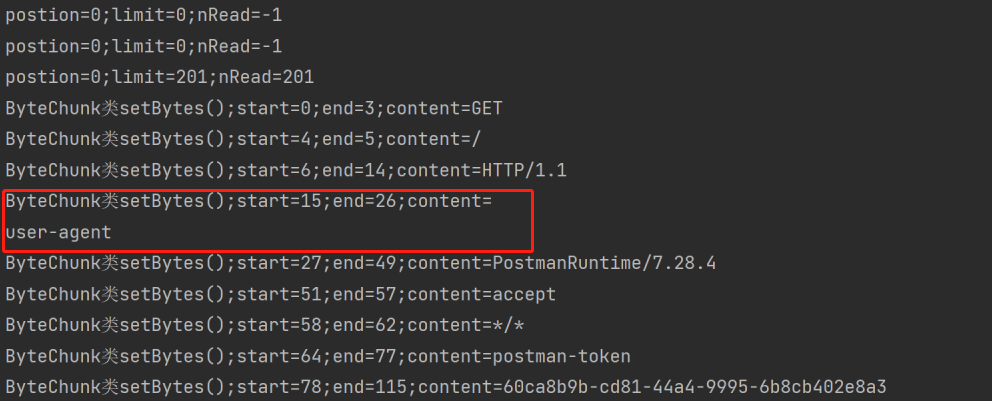
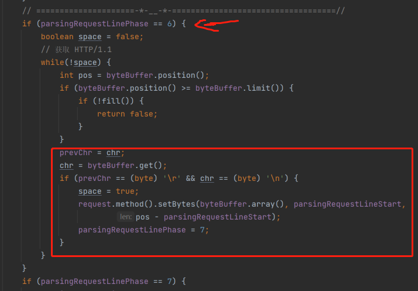
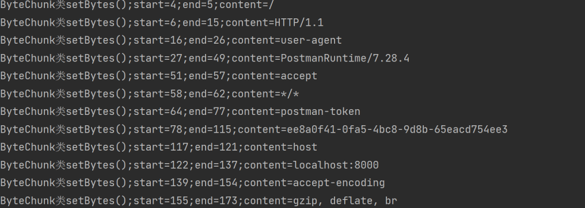

[](https://www.doubao.com/?channel=cnblogs&source=hw_db_cnblogs)

[](https://www.cnblogs.com/yishi-san/)

# [一十三](https://www.cnblogs.com/yishi-san)

## 

- [博客园](https://www.cnblogs.com/)
- [首页](https://www.cnblogs.com/yishi-san/)
- 
- [联系](https://msg.cnblogs.com/send/一十三)
- 
- [管理](https://i.cnblogs.com/)

随笔 - 20 文章 - 1 评论 - 1 阅读 - 13277

# [Tomcat源码分析使用NIO接收HTTP请求(四)----解析请求头](https://www.cnblogs.com/yishi-san/p/16932180.html)

User-Agent: PostmanRuntime/7.28.4
Accept: text/html
Postman-Token: c125824d-ae13-4082-9ae0-87c1750476b8
Host: localhost:8000
Accept-Encoding: gzip, deflate, br
Connection: keep-alive

我们本章的任务是解析请求头。上面的请求头协议是本节使用的样例协议。这个样例协议是使用Postman生成的。我们整体的思路是一行一行循环的对协议进行解析。我们先来解析User-Agent: PostmanRuntime/7.28.4这一行协议，剩余行与其原理一样。关于这一行的解析思路与解析请求行一样。依然是使用MessageBytes类保存一个bytebuffer和起止位。与请求行所不同的是，在请求头中使用MimeHeaders对请求头进行了封装。在MimeHeaders类中包含一个MimeHeaderField内部类，该内部类包含两个字段，类型均为MessageBytes，这两个字段存储的内容是请求行中的name和value，以User-Agent: PostmanRuntime/7.28.4这一行为例，如果解析这一行那么name值为         User-Agent，value值为PostmanRuntime/7.28.4，又因为请求行中包含多行协议所以一定会存在多个MimeHeaderField来保存请求行，所以在MimeHeaders类可以定义一个MimeHeaderField类型的数组用来存储MimeHeaderField。

第一步: 新建MimeHeaders类(虽然是两个类，但是是写在一个文件中的)

[](javascript:void(0);)

```
ublic class MimeHeaders {
    /**请求头默认大小*/
    public static final int DEFAULT_HEADER_SIZE=8;
    private MimeHeaderField[] headers = new MimeHeaderField[DEFAULT_HEADER_SIZE];

    /**当前字段*/
    private int count;

    /**字段限制*/
    private int limit = -1;

    public MessageBytes addValue(byte b[], int startN, int len) {
        MimeHeaderField mhf=createHeader();
        mhf.getName().setBytes(b, startN, len);
        return mhf.getValue();
    }

    private MimeHeaderField createHeader() {
        if (limit > -1 && count >= limit) {
            throw new RuntimeException();
        }
        MimeHeaderField mh;
        int len = headers.length;
        if (count >= len) {
            // 动态扩容
            int newLength = count * 2;
            if (limit > 0 && newLength > limit) {
                newLength = limit;
            }
            MimeHeaderField tmp[] = new MimeHeaderField[newLength];
            System.arraycopy(headers, 0, tmp, 0, len);
            headers = tmp;
        }
        if ((mh = headers[count]) == null) {
            headers[count] = mh = new MimeHeaderField();
        }
        count++;
        return mh;
    }
}
class MimeHeaderField {
    private final MessageBytes nameB = MessageBytes.newInstance();
    private final MessageBytes valueB = MessageBytes.newInstance();
    public MessageBytes getName() {return nameB;}
    public MessageBytes getValue() {return valueB;}
}
```

[](javascript:void(0);)

 第二步: 解析请求头。首先在Http11InputBuffer新键一个静态内部类和二个枚举类，用他们保存解析请求 头中所处于的临时状态。

[](javascript:void(0);)

```
private static class HeaderParseData {
    int lineStart = 0;
    int start = 0;
    int realPos = 0;
    int lastSignificantChar = 0;
    MessageBytes headerValue = null;
    public void recycle() {
        lineStart = 0;
        start = 0;
        realPos = 0;
        lastSignificantChar = 0;
        headerValue = null;
    }
}
private enum HeaderParsePosition {
    HEADER_START,
    HEADER_NAME,
    HEADER_VALUE_START,
    HEADER_VALUE,
    HEADER_MULTI_LINE,
    HEADER_SKIPLINE
}

private enum HeaderParseStatus {
    DONE, HAVE_MORE_HEADERS, NEED_MORE_DATA
}
```

[](javascript:void(0);)

第三步: 在Request类中添加MimeHeaders属性。在Http11InputBuffer类中添加HeaderParsePosition、MimeHeaders、HeaderParseData、parsingHeader属性。

 

第四步: 在Http11InputBuffer类中新建一个parseHeader方法

[](javascript:void(0);)

```
public HeaderParseStatus parseHeader() throws IOException {
    int chr = byteBuffer.position();
    int prevChr = chr;
    while (headerParsePos == HeaderParsePosition.HEADER_START) {
        if (byteBuffer.position() >= byteBuffer.limit()) {
            if (!fill()) {
                headerParsePos = HeaderParsePosition.HEADER_START;
                return HeaderParseStatus.NEED_MORE_DATA;
            }
        }
        prevChr = chr;
        chr = byteBuffer.get();

        if (chr == (byte) '\r' && prevChr != (byte) '\r') {
        } else if (prevChr == (byte) '\r' && chr == '\n') {
            return HeaderParseStatus.DONE;
        } else {
            if (prevChr == (byte) '\r') {
                byteBuffer.position(byteBuffer.position() - 2);
            } else {
                byteBuffer.position(byteBuffer.position() - 1);
            }
            break;
        }
    }
    if (headerParsePos == HeaderParsePosition.HEADER_START) {
        headerData.start = byteBuffer.position();
        headerData.lineStart = headerData.start;
        headerParsePos = HeaderParsePosition.HEADER_NAME;
    }
    while (headerParsePos == HeaderParsePosition.HEADER_NAME) {
        if (byteBuffer.position() >= byteBuffer.limit()) {
            if (!fill()) {
                headerParsePos = HeaderParsePosition.HEADER_START;
                return HeaderParseStatus.NEED_MORE_DATA;
            }
        }
        int pos = byteBuffer.position();
        chr = byteBuffer.get();
        if (chr == (byte) ':') {
            headerParsePos = HeaderParsePosition.HEADER_VALUE_START;
            headerData.headerValue = headers.addValue(byteBuffer.array(), headerData.start,
                    pos - headerData.start);
            pos = byteBuffer.position();
            headerData.start = pos;
            headerData.realPos = pos;
            headerData.lastSignificantChar = pos;
            break;
        }
        // 将大写字母转化为小写字母
        if ((chr >= (byte) 'A') && (chr <= (byte) 'Z')) {
            byteBuffer.put(pos, (byte) (chr - ((byte)'A' - (byte)'a')));
        }
    }
    while (headerParsePos == HeaderParsePosition.HEADER_VALUE_START) {
        if (headerParsePos == HeaderParsePosition.HEADER_VALUE_START) {
            while (true) {
                if (byteBuffer.position() >= byteBuffer.limit()) {
                    if (!fill()) {
                        return HeaderParseStatus.NEED_MORE_DATA;
                    }
                }

                chr = byteBuffer.get();
                if (!(chr == (byte) ' ' || chr == (byte) '\t')) {
                    headerParsePos = HeaderParsePosition.HEADER_VALUE;
                    byteBuffer.position(byteBuffer.position() - 1);
                    break;
                }
            }
        }

        if (headerParsePos == HeaderParsePosition.HEADER_VALUE) {
            boolean eol = false;
            while (!eol) {
                if (byteBuffer.position() >= byteBuffer.limit()) {
                    if (!fill()) {
                        return HeaderParseStatus.NEED_MORE_DATA;
                    }
                }
                prevChr = chr;
                chr = byteBuffer.get();
                if (prevChr == '\r' && chr == '\n') {
                    eol = true;
                } else if(chr == (byte) ' ' || chr == (byte) '\t') { // 清除空格
                    byteBuffer.put(headerData.realPos, (byte)chr);
                    headerData.realPos++;
                }else {
                    byteBuffer.put(headerData.realPos, (byte)chr);
                    headerData.realPos++;
                    headerData.lastSignificantChar = headerData.realPos;
                }
            }
            headerData.realPos = headerData.lastSignificantChar;
            headerParsePos = HeaderParsePosition.HEADER_MULTI_LINE;
        }
        byte peek = byteBuffer.get(byteBuffer.position());
        if (headerParsePos == HeaderParsePosition.HEADER_MULTI_LINE) {
            if ((peek != (byte) ' ') && (peek != '\t')) {
                headerParsePos = HeaderParsePosition.HEADER_START;
                break;
            } else {
                byteBuffer.put(headerData.realPos, peek);
                headerData.realPos++;
                headerParsePos = HeaderParsePosition.HEADER_VALUE_START;
            }
        }
    }
    headerData.headerValue.setBytes(byteBuffer.array(), headerData.start,
            headerData.lastSignificantChar - headerData.start);
    headerData.recycle();
    return HeaderParseStatus.HAVE_MORE_HEADERS;
}
```

[](javascript:void(0);)

第五步: 在新键一个parseHeaders方法

[](javascript:void(0);)

```
public boolean parseHeaders() throws IOException {
    HeaderParseStatus status = HeaderParseStatus.HAVE_MORE_HEADERS;

    do {
        status = parseHeader();
    } while (status == HeaderParseStatus.HAVE_MORE_HEADERS);
    if (status == HeaderParseStatus.DONE) {
        parsingHeader = false;
        return true;
    } else {
        return false;
    }
}
```

[](javascript:void(0);)

第六步: 在Poller类中调用parseHeaders()方法.运行程序查看输出会发现一个小问题，User-Agent这个字段换行了。这个问题的原因是因为我们在解析请求行时并没有读取末尾的换符号。



 

 第七步: 解决第六步的问题。在第四步中我们定义了一个parseHeader方法，在这个方法中有一个prevChr局部变量，现在我们将它提升为全局变量。在定义一个全局变量chr。删除掉parseRequestLine方法中的chr局部变量，在修改其中的一些代码(下面图片中的代码位置)。删除parseHeader类中chr局部变量。运行结果如下图。

```


```

 

 

 

结束 ！！！

分类: [Tomcat](https://www.cnblogs.com/yishi-san/category/2203390.html)

[好文要顶](javascript:void(0);) [关注我](javascript:void(0);) [收藏该文](javascript:void(0);) [微信分享](javascript:void(0);)

[](https://home.cnblogs.com/u/yishi-san/)

[一十三](https://home.cnblogs.com/u/yishi-san/)
[粉丝 - 2](https://home.cnblogs.com/u/yishi-san/followers/) [关注 - 1](https://home.cnblogs.com/u/yishi-san/followees/)

[+加关注](javascript:void(0);)

0

0

[升级成为会员](https://cnblogs.vip/)

[« ](https://www.cnblogs.com/yishi-san/p/16932071.html)上一篇： [Tomcat源码分析使用NIO接收HTTP请求(三)----解析请求行](https://www.cnblogs.com/yishi-san/p/16932071.html)
[» ](https://www.cnblogs.com/yishi-san/p/16971524.html)下一篇： [Tomcat源码分析使用NIO接收HTTP请求(五)----响应请求](https://www.cnblogs.com/yishi-san/p/16971524.html)

posted @ 2022-11-28 14:50 [一十三](https://www.cnblogs.com/yishi-san) 阅读(228) 评论(0) [编辑](https://i.cnblogs.com/EditPosts.aspx?postid=16932180) [收藏](javascript:void(0)) [举报](javascript:void(0))


[刷新评论](javascript:void(0);)[刷新页面](https://www.cnblogs.com/yishi-san/p/16932180.html#)[返回顶部](https://www.cnblogs.com/yishi-san/p/16932180.html#top)

发表评论 [升级成为园子VIP会员](https://cnblogs.vip/)


编辑预览


 自动补全

 [退出](javascript:void(0);) [订阅评论](javascript:void(0);) [我的博客](https://www.cnblogs.com/Carl-Don/)

[Ctrl+Enter快捷键提交]

[【推荐】还在用 ECharts 开发大屏？试试这款永久免费的开源 BI 工具！](https://dataease.cn/?utm_source=cnblogs)
[【推荐】编程新体验，更懂你的AI，立即体验豆包MarsCode编程助手](https://www.marscode.cn/?utm_source=advertising&utm_medium=cnblogs.com_ug_cpa&utm_term=hw_marscode_cnblogs&utm_content=home)
[【推荐】凌霞软件回馈社区，博客园 & 1Panel & Halo 联合会员上线](https://www.cnblogs.com/cmt/p/18669224)
[【推荐】抖音旗下AI助手豆包，你的智能百科全书，全免费不限次数](https://www.doubao.com/?channel=cnblogs&source=hw_db_cnblogs)
[【推荐】博客园社区专享云产品让利特惠，阿里云新客6.5折上折](https://market.cnblogs.com/)
[【推荐】轻量又高性能的 SSH 工具 IShell：AI 加持，快人一步](http://ishell.cc/)

[](https://www.doubao.com/chat/coding?channel=cnblogs&source=hw_db_cnblogs)

**相关博文：**

·[Tomcat源码分析使用NIO接收HTTP请求(三)----解析请求行](https://www.cnblogs.com/yishi-san/p/16932071.html)

·[Tomcat源码分析使用NIO接收HTTP请求(六)----变更工程目录](https://www.cnblogs.com/yishi-san/p/16971500.html)

·[10、http的解析](https://www.cnblogs.com/honger/p/17730599.html)

·[tomcat源码分析（二）如何处理请求](https://www.cnblogs.com/sword-successful/p/17162835.html)

·[Tomcat处理http请求之源码分析](https://www.cnblogs.com/Jcloud/p/17439701.html)

**阅读排行：**
· [趁着过年的时候手搓了一个低代码框架](https://www.cnblogs.com/codelove/p/18719305)
· [本地部署DeepSeek后，没有好看的交互界面怎么行！](https://www.cnblogs.com/xiezhr/p/18718693)
· [为什么说在企业级应用开发中，后端往往是效率杀手？](https://www.cnblogs.com/jackyfei/p/18712595)
· [AI工具推荐：领先的开源 AI 代码助手——Continue](https://www.cnblogs.com/mingupupu/p/18716802)
· [用 C# 插值字符串处理器写一个 sscanf](https://www.cnblogs.com/hez2010/p/18718386/csharp-interpolated-string-sscanf)

### 公告

昵称： [一十三](https://home.cnblogs.com/u/yishi-san/)
园龄： [7年10个月](https://home.cnblogs.com/u/yishi-san/)
粉丝： [2](https://home.cnblogs.com/u/yishi-san/followers/)
关注： [1](https://home.cnblogs.com/u/yishi-san/followees/)

[+加关注](javascript:void(0))

| [<](javascript:void(0);)2025年2月[>](javascript:void(0);) |      |      |      |      |      |      |
| --------------------------------------------------------- | ---- | ---- | ---- | ---- | ---- | ---- |
| 日                                                        | 一   | 二   | 三   | 四   | 五   | 六   |
| 26                                                        | 27   | 28   | 29   | 30   | 31   | 1    |
| 2                                                         | 3    | 4    | 5    | 6    | 7    | 8    |
| 9                                                         | 10   | 11   | 12   | 13   | 14   | 15   |
| 16                                                        | 17   | 18   | 19   | 20   | 21   | 22   |
| 23                                                        | 24   | 25   | 26   | 27   | 28   | 1    |
| 2                                                         | 3    | 4    | 5    | 6    | 7    | 8    |

### 搜索

 

### 常用链接

- [我的随笔](https://www.cnblogs.com/yishi-san/p/)
- [我的评论](https://www.cnblogs.com/yishi-san/MyComments.html)
- [我的参与](https://www.cnblogs.com/yishi-san/OtherPosts.html)
- [最新评论](https://www.cnblogs.com/yishi-san/comments)
- [我的标签](https://www.cnblogs.com/yishi-san/tag/)

### [我的标签](https://www.cnblogs.com/yishi-san/tag/)

- [JavaScript(1)](https://www.cnblogs.com/yishi-san/tag/JavaScript/)

### [随笔分类](https://www.cnblogs.com/yishi-san/post-categories)

- [go(1)](https://www.cnblogs.com/yishi-san/category/1683619.html)
- [java(1)](https://www.cnblogs.com/yishi-san/category/1473165.html)
- [JavaScript(2)](https://www.cnblogs.com/yishi-san/category/982421.html)
- [MySql(1)](https://www.cnblogs.com/yishi-san/category/1099028.html)
- [Spring(1)](https://www.cnblogs.com/yishi-san/category/1561179.html)
- [Tomcat(8)](https://www.cnblogs.com/yishi-san/category/2203390.html)
- [密码学(1)](https://www.cnblogs.com/yishi-san/category/1775967.html)
- [区块链(3)](https://www.cnblogs.com/yishi-san/category/1545424.html)

### 随笔档案

- [2022年12月(3)](https://www.cnblogs.com/yishi-san/p/archive/2022/12)
- [2022年11月(4)](https://www.cnblogs.com/yishi-san/p/archive/2022/11)
- [2022年8月(2)](https://www.cnblogs.com/yishi-san/p/archive/2022/08)
- [2021年3月(1)](https://www.cnblogs.com/yishi-san/p/archive/2021/03)
- [2020年10月(1)](https://www.cnblogs.com/yishi-san/p/archive/2020/10)
- [2020年6月(1)](https://www.cnblogs.com/yishi-san/p/archive/2020/06)
- [2020年4月(1)](https://www.cnblogs.com/yishi-san/p/archive/2020/04)
- [2020年3月(3)](https://www.cnblogs.com/yishi-san/p/archive/2020/03)
- [2019年10月(1)](https://www.cnblogs.com/yishi-san/p/archive/2019/10)
- [2019年5月(1)](https://www.cnblogs.com/yishi-san/p/archive/2019/05)
- [2019年4月(1)](https://www.cnblogs.com/yishi-san/p/archive/2019/04)
- [2017年4月(1)](https://www.cnblogs.com/yishi-san/p/archive/2017/04)

### [文章分类](https://www.cnblogs.com/yishi-san/article-categories)

- [MySql(1)](https://www.cnblogs.com/yishi-san/category/1099036.html)

### [阅读排行榜](https://www.cnblogs.com/yishi-san/most-viewed)

- [1. DES算法原理(4637)](https://www.cnblogs.com/yishi-san/p/12990973.html)
- [2. 关于Copper.js的简单使用方法(1448)](https://www.cnblogs.com/yishi-san/p/13782983.html)
- [3. sql与集合(872)](https://www.cnblogs.com/yishi-san/p/10624122.html)
- [4. Tomcat源码分析使用NIO接收HTTP请求(一)----简单实现Acceptor、Poller、PollerEvent(858)](https://www.cnblogs.com/yishi-san/p/16900079.html)
- [5. 对于go当中的cli简单理解(798)](https://www.cnblogs.com/yishi-san/p/12592048.html)

### [评论排行榜](https://www.cnblogs.com/yishi-san/most-commented)

- [1. Tomcat源码分析使用NIO接收HTTP请求(一)----简单实现Acceptor、Poller、PollerEvent(1)](https://www.cnblogs.com/yishi-san/p/16900079.html)

### [推荐排行榜](https://www.cnblogs.com/yishi-san/most-liked)

- [1. Tomcat源码分析使用NIO接收HTTP请求(三)----解析请求行(1)](https://www.cnblogs.com/yishi-san/p/16932071.html)
- [2. Tomcat源码分析使用NIO接收HTTP请求(一)----简单实现Acceptor、Poller、PollerEvent(1)](https://www.cnblogs.com/yishi-san/p/16900079.html)

### [最新评论](https://www.cnblogs.com/yishi-san/comments)

- [1. Re:Tomcat源码分析使用NIO接收HTTP请求(一)----简单实现Acceptor、Poller、PollerEvent](https://www.cnblogs.com/yishi-san/p/16900079.html)
- 好文
- --邓等灯等灯

Copyright © 2025 一十三
Powered by .NET 9.0 on Kubernetes