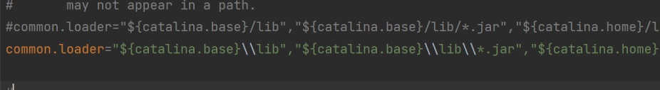
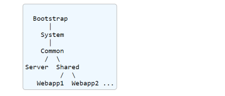

[](https://www.doubao.com/?channel=cnblogs&source=hw_db_cnblogs)

[](https://www.cnblogs.com/yishi-san/)

# [一十三](https://www.cnblogs.com/yishi-san)

## 

- [博客园](https://www.cnblogs.com/)
- [首页](https://www.cnblogs.com/yishi-san/)
- 
- [联系](https://msg.cnblogs.com/send/一十三)
- 
- [管理](https://i.cnblogs.com/)

随笔 - 20 文章 - 1 评论 - 1 阅读 - 13277

# [Tomcat源码分析--类加载器](https://www.cnblogs.com/yishi-san/p/16609553.html)

### Tomcat类加载器结构


上图是Tomcat文档中所展示的Tomcat类加载结构。在这个结构中Bootstartap和System的类加载器由java虚拟机实现。common类加载器由Tomcat容器实现，它对 Tomcat 内部类和所有 Web 应用程序都是可见的。此类加载器搜索的位置$CATALINA_BASE/conf/catalina.properties 中的common.loader属性定义。在catalina.properties文件也定义了server.loader和shared.loader属性，这两个属性分别由Server和Shared两个类加载器加载。



接下来让我们看一下Tomcat如何实现common类加载器。首先我们需要找到Bootstrap类的main方法。在main方中有一段代码如下，这段代码的大意是先判断Bootstrap是否为null，不为null，直接将Catalina ClassLoader设置到当前线程，用于加载服务器相关类，为null则进入bootstrap的init方法。

[](javascript:void(0);)

```
......
synchronized (daemonLock) {
            if (daemon == null) {
                // Don't set daemon until init() has completed
                Bootstrap bootstrap = new Bootstrap();
                try {
                    bootstrap.init();
                } catch (Throwable t) {
                    handleThrowable(t);
                    t.printStackTrace();
                    return;
                }
                daemon = bootstrap;
            } else {
                // When running as a service the call to stop will be on a new
                // thread so make sure the correct class loader is used to
                // prevent a range of class not found exceptions.
                Thread.currentThread().setContextClassLoader(daemon.catalinaLoader);
            }
        }
......
```

[](javascript:void(0);)

init方法会调用initClassLoaders()方法，在该方法中会调用createClassLoader方法创建commonLoader、catalinaLoader、sharedLoader三种类加载器。与上文中所介绍的三种类加载器一一对应。

[](javascript:void(0);)

```
 private void initClassLoaders() {
        try {
            commonLoader = createClassLoader("common", null);
            if (commonLoader == null) {
                // no config file, default to this loader - we might be in a 'single' env.
                commonLoader = this.getClass().getClassLoader();
            }
            catalinaLoader = createClassLoader("server", commonLoader);
            sharedLoader = createClassLoader("shared", commonLoader);
        } catch (Throwable t) {
            handleThrowable(t);
            log.error("Class loader creation threw exception", t);
            System.exit(1);
        }
    }
```

[](javascript:void(0);)

createClassLoader方法终会调用如下代码,通过这段代码可以知到commonLoader是一个URLClassLoader。

[](javascript:void(0);)

```
public static ClassLoader createClassLoader(List<Repository> repositories,
                                                final ClassLoader parent)
        throws Exception {
......
return AccessController.doPrivileged(
                new PrivilegedAction<URLClassLoader>() {
                    @Override
                    public URLClassLoader run() {
                        if (parent == null)
                            return new URLClassLoader(array);
                        else
                            return new URLClassLoader(array, parent);
                    }
                });
}
```

[](javascript:void(0);)

### Common|Catalina|Shared的使用

在Bootstartap中的init方法中调用完initClassLoaders方法后，就开始了对类加载器的使用。Tomcat用catalinaLoader来加载Catalina类，这个类就是我们经常说的容器。加载完Catalina后会将sharedLoader作为参数传递给Catalina类，以便于后续给Webappx设置父加载器。

[](javascript:void(0);)

```
public void init() throws Exception {

        initClassLoaders();

        ......
         // 加载Catalina类
        Class<?> startupClass = catalinaLoader.loadClass("org.apache.catalina.startup.Catalina");
        Object startupInstance = startupClass.getConstructor().newInstance();

        // 设置sharedLoad加载器   
        String methodName = "setParentClassLoader";
        Class<?> paramTypes[] = new Class[1];
        paramTypes[0] = Class.forName("java.lang.ClassLoader");
        Object paramValues[] = new Object[1];
        paramValues[0] = sharedLoader;
        Method method =
            startupInstance.getClass().getMethod(methodName, paramTypes);
        method.invoke(startupInstance, paramValues);

        catalinaDaemon = startupInstance;
    }
```

[](javascript:void(0);)

### **WebappX** 加载器

上文介绍了common类加载器的创建和使用，那么Webappx类加载器又是如何被创建和使用的呢？

#### 创建WebappX 加载器

在看Tomcat源码是如何创建webappx类加载器之前，让我们来做一个实验。假设我们已经编译好了一个全限定名为com.example.WebAppClassLoader.class文件，那么应该如何来加载这个类文件呢？一种方法是自定义一个类加载器。

[](javascript:void(0);)

```
public class MyClassLoader extends URLClassLoader {
    public MyClassLoader() {
        super(new URL[0]);
    }

    @Override
    protected Class<?> findClass(String name) {
        String myPath = "file:///D:/www/tomact-test-war/tomcat-test-case008/src/main/webapp/WEB-INF/" + name.replace(".","/") + ".class";
        byte[] cLassBytes = null;
        Path path = null;
        try {
            path = Paths.get(new URI(myPath));
            cLassBytes = Files.readAllBytes(path);
        } catch (IOException | URISyntaxException e) {
            e.printStackTrace();
        }
        Class clazz = defineClass(name, cLassBytes, 0, cLassBytes.length);
        return clazz;
    }
}
```

[](javascript:void(0);)

创建一个名为MyClassLoader的类并继承URLClassLoader类，重写findClass方法，一个简单的类加载器就创建完成了。

[](javascript:void(0);)

```
public static void main(String[] args) throws Exception {
        MyClassLoader cl = new MyClassLoader();
        Class<?> wacl = cl.findClass("com.example.WebAppClassLoader");
        try {
            Object obj = wacl.newInstance();
            Method method = wacl.getMethod("test_1");
            method.invoke(obj);
        } catch (Exception e) {
            e.printStackTrace();
        }
    }
```

[](javascript:void(0);)

[](javascript:void(0);)

```
package com.example;
public class WebAppClassLoader {
    public WebAppClassLoader() {
    }
    public void test_1() {
        System.out.println("自定类加载器");
    }
}
```

[](javascript:void(0);)

在main方法中创建MyClassLoader对象，并调用findClass方法，至此就将一个class文件加载到了虚拟机中。

好了，实验做完后，让我们回过头来看看Tomcat是如何创建**WebappX**类加载器的。

在StandardContext的startInternal方法中有这样一段代码

```
if (getLoader() == null) {
            WebappLoader webappLoader = new WebappLoader();
            webappLoader.setDelegate(getDelegate());
            setLoader(webappLoader);
        }
```

它会创建WebappLoader对象，并通过setLoader(webappLoader)赋值到一个实例变量中，然后会调用WebappLoader的start方法:

```
......
classLoader = createClassLoader();
            classLoader.setResources(context.getResources());
            classLoader.setDelegate(this.delegate);
......
```

进入createClassLoader方法：

[](javascript:void(0);)

```
private WebappClassLoaderBase createClassLoader()
        throws Exception {

        Class<?> clazz = Class.forName(loaderClass);
        WebappClassLoaderBase classLoader = null;

        if (parentClassLoader == null) {
            parentClassLoader = context.getParentClassLoader();
        } else {
            context.setParentClassLoader(parentClassLoader);
        }
        Class<?>[] argTypes = { ClassLoader.class };
        Object[] args = { parentClassLoader };
        Constructor<?> constr = clazz.getConstructor(argTypes);
        classLoader = (WebappClassLoaderBase) constr.newInstance(args);

        return classLoader;
    }
```

[](javascript:void(0);)

该方法会实例化一个ParallelWebappClassLoader实例，并且传递了sharedLoader作为其父亲加载器。

ParallelWebappClassLoader继承了WebappClassLoaderBase抽象类，WebappClassLoaderBase继承了URLClassLoader。在WebappClassLoaderBase类中重写了findClass方法。至此**WebappX类加载器** 就创建完成了。

那Webappx类加载器又是被如何使用的呢？

还记得在Tomcat动态部署一章介绍的那个webConfig方法吗？这个方法非常复杂。在这个方法的第四步中会调用populateJavaClassCache方法

[](javascript:void(0);)

```
private void populateJavaClassCache(String className,
            Map<String,JavaClassCacheEntry> javaClassCache) {
    ......
         try (InputStream is = context.getLoader().getClassLoader().getResourceAsStream(name)) {
                if (is == null) {
                    return;
                }
                ClassParser parser = new ClassParser(is);
                JavaClass clazz = parser.parse();
                populateJavaClassCache(clazz.getClassName(), clazz, javaClassCache);
            } catch (ClassFormatException | IOException e) {
                log.debug(sm.getString("contextConfig.invalidSciHandlesTypes",
                        className), e);
            }
    ......
 }
```

[](javascript:void(0);)

现在总结如下： 在Tomcat存在common、cataina、shared三个公共的classloader,默认情况下，这三个classloader其实是同一个，都是common classloader，而针对每个webapp，也就是context（对应代码中的StandardContext类），都有自己的WebappClassLoader实例来加载每个应用自己的类，该类加载的父类加载器就是是Shared ClassLoader。这样前面关于tomcat的类加载层次应该就清楚起来了。

### delegate属性与双亲委派

在context.xml文件中可以配置delegate属性，以用来控制Webappx类加载器的类加载机制。delegate属性默认是false。

当delegate为true时webappx的类加载顺序如下：

- JVM 的引导类
- 系统类加载器类
- 通用类加载器类
- */WEB-INF/* Web 应用程序的类
- */WEB-INF/lib/\*.jar*您的 Web 应用程序

当delegate为false时webappx的类加载顺序如下：

- JVM 的引导类
- */WEB-INF/* Web 应用程序的类
- */WEB-INF/lib/\*.jar*您的 Web 应用程序
- 系统类加载器类（如上所述）
- 通用类加载器类（如上所述）

让我再来简单回忆一下JVM的双亲委派模型，在JVM中一个类的加载首先使用其父类加载器去加载，如果加载不到在使用自身的加载器去加载。



 

 

我们以Tomcat的类加载器结构为例，当delegate属性是true时，加载一个自定义servlet是从根加载器，然后是系统类加载器一步步找下来的，这一过程与JVM的双亲委派模型是一致的。但是当delegate为false时却不然，当delegate为fasle时首先依旧从根加载器加载类文件，但是第二步是从webappx类加载器中加载类文件，然后是系统类加载器，最后才是通用类加载器，这与标准的JVM模型并不一致，我们也可以说此时Tomcat打破了双亲委派模型。

Tomcat默认打破了双亲委派，这样的好处之一是当我们在Tomcat中部署多个应用时，即使这些应用程序依赖同一个第三方类库，虽然其版本不同但并不会相互影响。

 

分类: [Tomcat](https://www.cnblogs.com/yishi-san/category/2203390.html)

[好文要顶](javascript:void(0);) [关注我](javascript:void(0);) [收藏该文](javascript:void(0);) [微信分享](javascript:void(0);)

[](https://home.cnblogs.com/u/yishi-san/)

[一十三](https://home.cnblogs.com/u/yishi-san/)
[粉丝 - 2](https://home.cnblogs.com/u/yishi-san/followers/) [关注 - 1](https://home.cnblogs.com/u/yishi-san/followees/)

[+加关注](javascript:void(0);)

0

0

[升级成为会员](https://cnblogs.vip/)

[« ](https://www.cnblogs.com/yishi-san/p/16586466.html)上一篇： [Tomcat源码分析--部署应用程序](https://www.cnblogs.com/yishi-san/p/16586466.html)
[» ](https://www.cnblogs.com/yishi-san/p/16900079.html)下一篇： [Tomcat源码分析使用NIO接收HTTP请求(一)----简单实现Acceptor、Poller、PollerEvent](https://www.cnblogs.com/yishi-san/p/16900079.html)

posted @ 2022-08-21 10:25 [一十三](https://www.cnblogs.com/yishi-san) 阅读(266) 评论(0) [编辑](https://i.cnblogs.com/EditPosts.aspx?postid=16609553) [收藏](javascript:void(0)) [举报](javascript:void(0))


[刷新评论](javascript:void(0);)[刷新页面](https://www.cnblogs.com/yishi-san/p/16609553.html#)[返回顶部](https://www.cnblogs.com/yishi-san/p/16609553.html#top)

发表评论 [升级成为园子VIP会员](https://cnblogs.vip/)


编辑预览


 自动补全

 [退出](javascript:void(0);) [订阅评论](javascript:void(0);) [我的博客](https://www.cnblogs.com/Carl-Don/)

[Ctrl+Enter快捷键提交]

[【推荐】还在用 ECharts 开发大屏？试试这款永久免费的开源 BI 工具！](https://dataease.cn/?utm_source=cnblogs)
[【推荐】编程新体验，更懂你的AI，立即体验豆包MarsCode编程助手](https://www.marscode.cn/?utm_source=advertising&utm_medium=cnblogs.com_ug_cpa&utm_term=hw_marscode_cnblogs&utm_content=home)
[【推荐】凌霞软件回馈社区，博客园 & 1Panel & Halo 联合会员上线](https://www.cnblogs.com/cmt/p/18669224)
[【推荐】抖音旗下AI助手豆包，你的智能百科全书，全免费不限次数](https://www.doubao.com/?channel=cnblogs&source=hw_db_cnblogs)
[【推荐】博客园社区专享云产品让利特惠，阿里云新客6.5折上折](https://market.cnblogs.com/)
[【推荐】轻量又高性能的 SSH 工具 IShell：AI 加持，快人一步](http://ishell.cc/)

[](https://www.doubao.com/chat/coding?channel=cnblogs&source=hw_db_cnblogs)

**相关博文：**

·[Tomcat源码分析--部署应用程序](https://www.cnblogs.com/yishi-san/p/16586466.html)

·[Tomcat源码分析使用NIO接收HTTP请求(一)----简单实现Acceptor、Poller、PollerEvent](https://www.cnblogs.com/yishi-san/p/16900079.html)

·[Tomcat源码分析 （五）----- Tomcat 类加载器](https://www.cnblogs.com/wk-missQ1/p/16180582.html)

·[详解Tomcat类加载器](https://www.cnblogs.com/wa1l-E/p/17072581.html)

·[Tomcat启动类加载机制总结](https://www.cnblogs.com/chy666/p/16104168.html)

**阅读排行：**
· [趁着过年的时候手搓了一个低代码框架](https://www.cnblogs.com/codelove/p/18719305)
· [本地部署DeepSeek后，没有好看的交互界面怎么行！](https://www.cnblogs.com/xiezhr/p/18718693)
· [为什么说在企业级应用开发中，后端往往是效率杀手？](https://www.cnblogs.com/jackyfei/p/18712595)
· [AI工具推荐：领先的开源 AI 代码助手——Continue](https://www.cnblogs.com/mingupupu/p/18716802)
· [用 C# 插值字符串处理器写一个 sscanf](https://www.cnblogs.com/hez2010/p/18718386/csharp-interpolated-string-sscanf)

### 公告

昵称： [一十三](https://home.cnblogs.com/u/yishi-san/)
园龄： [7年10个月](https://home.cnblogs.com/u/yishi-san/)
粉丝： [2](https://home.cnblogs.com/u/yishi-san/followers/)
关注： [1](https://home.cnblogs.com/u/yishi-san/followees/)

[+加关注](javascript:void(0))

| [<](javascript:void(0);)2025年2月[>](javascript:void(0);) |      |      |      |      |      |      |
| --------------------------------------------------------- | ---- | ---- | ---- | ---- | ---- | ---- |
| 日                                                        | 一   | 二   | 三   | 四   | 五   | 六   |
| 26                                                        | 27   | 28   | 29   | 30   | 31   | 1    |
| 2                                                         | 3    | 4    | 5    | 6    | 7    | 8    |
| 9                                                         | 10   | 11   | 12   | 13   | 14   | 15   |
| 16                                                        | 17   | 18   | 19   | 20   | 21   | 22   |
| 23                                                        | 24   | 25   | 26   | 27   | 28   | 1    |
| 2                                                         | 3    | 4    | 5    | 6    | 7    | 8    |

### 搜索

 

### 常用链接

- [我的随笔](https://www.cnblogs.com/yishi-san/p/)
- [我的评论](https://www.cnblogs.com/yishi-san/MyComments.html)
- [我的参与](https://www.cnblogs.com/yishi-san/OtherPosts.html)
- [最新评论](https://www.cnblogs.com/yishi-san/comments)
- [我的标签](https://www.cnblogs.com/yishi-san/tag/)

### [我的标签](https://www.cnblogs.com/yishi-san/tag/)

- [JavaScript(1)](https://www.cnblogs.com/yishi-san/tag/JavaScript/)

### [随笔分类](https://www.cnblogs.com/yishi-san/post-categories)

- [go(1)](https://www.cnblogs.com/yishi-san/category/1683619.html)
- [java(1)](https://www.cnblogs.com/yishi-san/category/1473165.html)
- [JavaScript(2)](https://www.cnblogs.com/yishi-san/category/982421.html)
- [MySql(1)](https://www.cnblogs.com/yishi-san/category/1099028.html)
- [Spring(1)](https://www.cnblogs.com/yishi-san/category/1561179.html)
- [Tomcat(8)](https://www.cnblogs.com/yishi-san/category/2203390.html)
- [密码学(1)](https://www.cnblogs.com/yishi-san/category/1775967.html)
- [区块链(3)](https://www.cnblogs.com/yishi-san/category/1545424.html)

### 随笔档案

- [2022年12月(3)](https://www.cnblogs.com/yishi-san/p/archive/2022/12)
- [2022年11月(4)](https://www.cnblogs.com/yishi-san/p/archive/2022/11)
- [2022年8月(2)](https://www.cnblogs.com/yishi-san/p/archive/2022/08)
- [2021年3月(1)](https://www.cnblogs.com/yishi-san/p/archive/2021/03)
- [2020年10月(1)](https://www.cnblogs.com/yishi-san/p/archive/2020/10)
- [2020年6月(1)](https://www.cnblogs.com/yishi-san/p/archive/2020/06)
- [2020年4月(1)](https://www.cnblogs.com/yishi-san/p/archive/2020/04)
- [2020年3月(3)](https://www.cnblogs.com/yishi-san/p/archive/2020/03)
- [2019年10月(1)](https://www.cnblogs.com/yishi-san/p/archive/2019/10)
- [2019年5月(1)](https://www.cnblogs.com/yishi-san/p/archive/2019/05)
- [2019年4月(1)](https://www.cnblogs.com/yishi-san/p/archive/2019/04)
- [2017年4月(1)](https://www.cnblogs.com/yishi-san/p/archive/2017/04)

### [文章分类](https://www.cnblogs.com/yishi-san/article-categories)

- [MySql(1)](https://www.cnblogs.com/yishi-san/category/1099036.html)

### [阅读排行榜](https://www.cnblogs.com/yishi-san/most-viewed)

- [1. DES算法原理(4637)](https://www.cnblogs.com/yishi-san/p/12990973.html)
- [2. 关于Copper.js的简单使用方法(1448)](https://www.cnblogs.com/yishi-san/p/13782983.html)
- [3. sql与集合(872)](https://www.cnblogs.com/yishi-san/p/10624122.html)
- [4. Tomcat源码分析使用NIO接收HTTP请求(一)----简单实现Acceptor、Poller、PollerEvent(858)](https://www.cnblogs.com/yishi-san/p/16900079.html)
- [5. 对于go当中的cli简单理解(798)](https://www.cnblogs.com/yishi-san/p/12592048.html)

### [评论排行榜](https://www.cnblogs.com/yishi-san/most-commented)

- [1. Tomcat源码分析使用NIO接收HTTP请求(一)----简单实现Acceptor、Poller、PollerEvent(1)](https://www.cnblogs.com/yishi-san/p/16900079.html)

### [推荐排行榜](https://www.cnblogs.com/yishi-san/most-liked)

- [1. Tomcat源码分析使用NIO接收HTTP请求(三)----解析请求行(1)](https://www.cnblogs.com/yishi-san/p/16932071.html)
- [2. Tomcat源码分析使用NIO接收HTTP请求(一)----简单实现Acceptor、Poller、PollerEvent(1)](https://www.cnblogs.com/yishi-san/p/16900079.html)

### [最新评论](https://www.cnblogs.com/yishi-san/comments)

- [1. Re:Tomcat源码分析使用NIO接收HTTP请求(一)----简单实现Acceptor、Poller、PollerEvent](https://www.cnblogs.com/yishi-san/p/16900079.html)
- 好文
- --邓等灯等灯

Copyright © 2025 一十三
Powered by .NET 9.0 on Kubernetes