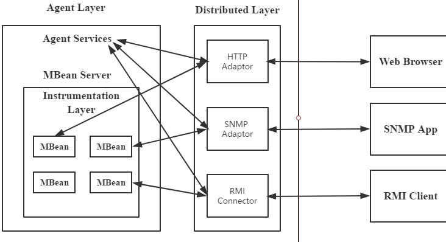
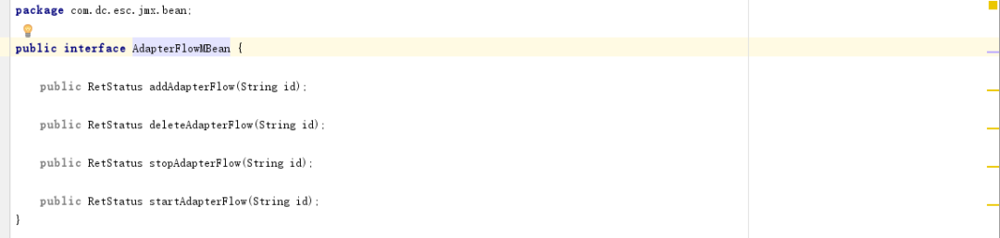
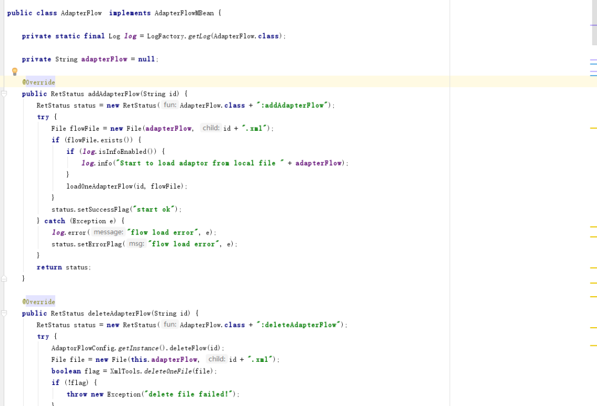
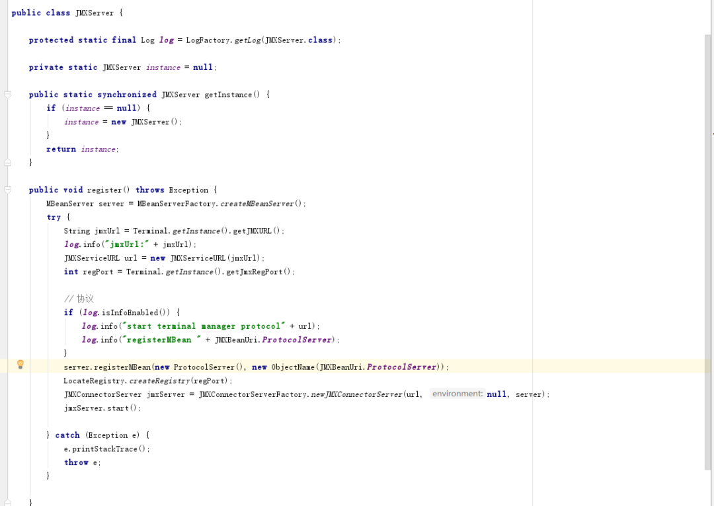
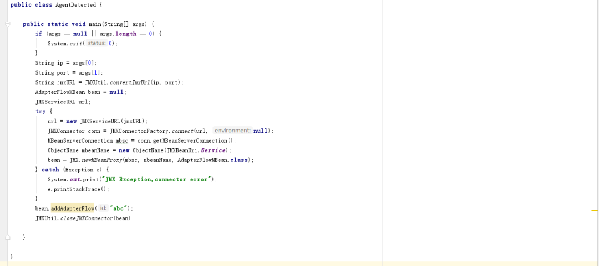
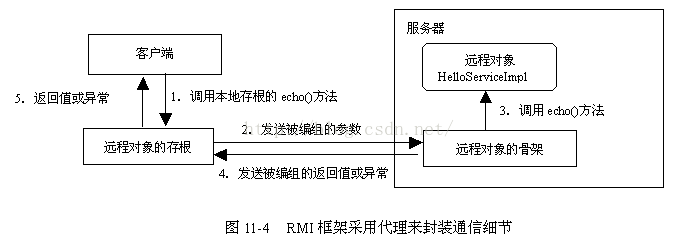

# 技术笔记-JMX与RMI

Original

 

弥

 

弥之猫


 

*2020年12月06日 16:20*

##  1.JMX与RMI定义

JMX(Java Management Extensions)是一个为应用程序植入管理功能的框架；是一种应用编程接口，可扩充对象和方法的集合体；是一套标准的代理和服务。实际上，它就是一个框架，和JPA、JMS是一样的，和我们平时使用的Spring、Hibernate也没有什么区别。就是通过将监控和管理涉及到的各个方面的问题和解决办法放到一起，统一设计，以便向外提供服务，以供使用者调用。

RMI（Java Remote Method Invocation）是Java编程语言里，一种用于实现远程过程调用的应用程序编程接口。它使客户机上运行的程序可以调用远程服务器上的对象。远程方法调用特性使Java编程人员能够在网络环境中分布操作。RMI全部的宗旨就是尽可能简化远程接口对象的使用。

JMX与RMI并没有什么关系，楞说要有关系，那就是JMX一般使用RMI实现客户端调用服务端。

2.JMX详细说明

2.1架构说明

先看看JMX的架构

  从图上，可以看出，JMX架构分为三层：

•分布层（Distributed layer）：包含可以使管理应用与JMX Agents交互的组件。一旦通过交互组件与JMX Agents建立连接，用户可以用管理工具来和注册在Agents中的MBeans进行交互；

•代理层（Agent layer ）：包含JMX Agent以及它们包含的MBean Servers。Agent layer的主要组件是MBean server，作为JMX Agents的核心，它充当MBeans的注册中心。该层提供了4个Agent 服务来使对MBean的管理更容易：计时器（Timer）、监控（monitoring）、动态加载MBean（dynamic MBean loading ）、关系服务（relationship services ）；

•指示层（Instrumentation layer ）：包含代表可管理资源的MBeans。该层是最接近管理资源的，它由注册在Agents中的MBeans组成，这个MBean允许通过JMX Agent来管理。每个MBean都暴露出来针对底层资源的操作和访问。

2.2使用说明

​    第一步：建立一个MBean接口，这个接口的名称要以“MBean”结束，这是要暴露给管理应用使用的，但是具体其中是怎么是实现的，管理应用是不会考虑的，MBean接口和相应的实现类如下：

接口：



实现类：

​    接口必须命名为 xxxMBean 而 Class类名必须为 xxx 放与同一个包下，若不在同一包下运行时将出异常。

​    第二步：创建MBeanServer和JMX Agent，MBeanServer是在JMX Agent 中存在的，代码如下：•首先创建MBean Server，并提供一个名称来唯一标识该Server，这里是使用工厂模式来创建该Server

•将我们创建的MBean注册到MBean Server中，并提供ObjectName来唯一标识，这就是我们在上面提到的域名+属性列表来唯一标识；

•

jxmUrl=service:jmx:rmi://localhost:0/jndi/rmi://localhost:1099/jmxrmi ,其中：

1）service:jmx: 这个是JMX URL的标准前缀，所有的JMX URL都必须以该字符串开头，否则会抛MalformedURLException；

2）rmi: 这个是jmx connector server的传输协议，在这个url中是使用rmi来进行传输的；

3）localhost:0 这个是jmx connector server的IP和端口，也就是真正提供服务的host和端口，可以不写，不写的话在运行期间随意绑定一个端口提供服务；4）jndi/rmi://localhost:1099/jmxrmi 这个是jmx connector server的路径，具体含义取决于前面的传输协议。比如该URL中这串字符串就代表着该jmx connector server的stub（存根）是使用 jndi api 绑定在 rmi://localhost:1099/jmxrmi 这个地址

第三步：创建client链接，并通过RMI协议进行调用，代码如下：



需要说明的是，jmx除了使用RMI协议进行调用，还可以使用IIOP和JMXMP进行调用。

2.3MBean

被管理资源MBean，一般有4种模式，一般使用standardMean。

| 类型           | 描述                                                         |
| -------------- | ------------------------------------------------------------ |
| standard MBean | 这种类型的MBean最简单，它能管理的资源（包括属性，方法，时间）必须定义在接口中，然后MBean必须实现这个接口。它的命名也必须遵循一定的规范，例如我们的MBean为Hello，则接口必须为HelloMBean。 |
| dynamic MBean  | 必须实现javax.management.DynamicMBean接口，所有的属性，方法都在运行时定义 |
| open MBean     | 此MBean的规范还不完善，正在改进中                            |
| model MBean    | 与标准和动态MBean相比，你可以不用写MBean类，只需使用javax.management.modelmbean.RequiredModelMBean即可。RequiredModelMBean实现了ModelMBean接口，而ModelMBean扩展了DynamicMBean接口，因此与DynamicMBean相似，Model MBean的管理资源也是在运行时定义的。与DynamicMBean不同的是，DynamicMBean管理的资源一般定义在DynamicMBean中（运行时才决定管理那些资源），而model MBean管理的资源并不在MBean中，而是在外部（通常是一个类），只有在运行时，才通过set方法将其加入到model MBean中。后面的例子会有详细介绍 |

**3.RMI详细说明**

我们看看例子client中JMX协议的格式:

- 

```
 String jmxURL = "service:jmx:rmi:///jndi/rmi://" + ip + ":" + port + "/jmxrmi";
```


JMX API定义了一个标准连接器 - RMI Connector,它支持通过RMI远程访问一个MBeanServer。那么RMI到底是个什么样的应用程序编程接口呢？它又是如何使客户机上运行的程序可以调用远程服务器上的对象的呢？

3.1RMI调用架构



RMI框架采用代理来负责客户与远程对象之间通过Socket进行通信的细节。RMI框架为远程对象分别生成了客户端代理和服务器端代理。位于客户端的代理类称为存根（Stub），位于服务器端的代理类称为骨架（Skeleton）。stub(存根)和skeleton( 骨架 ) 在RMI中充当代理角色，在现实开发中主要是用来隐藏系统和网络的的差异， 这一部分的功能在RMI开发中对程序员是透明的。Stub为客户端编码远程命令并把他们发送到服务器。而Skeleton则是把远程命令解码，调用服务端的远程对象的方法，把结果在编码发给stub，然后stub再解码返回调用结果给客户端。

**3.2RMI远程调用步骤**

​    步骤如下：

1.客户调用客户端辅助对象stub上的方法2.客户端辅助对象stub打包调用信息（变量，方法名），通过网络发送给服务端辅助对象skeleton3.服务端辅助对象skeleton将客户端辅助对象发送来的信息解包，找出真正被调用的方法以及该方法所在对象4.调用真正服务对象上的真正方法，并将结果返回给服务端辅助对象skeleton5.服务端辅助对象将结果打包，发送给客户端辅助对象stub6.客户端辅助对象将返回值解包，返回给调用者7.客户获得返回值


Reads 42


# 