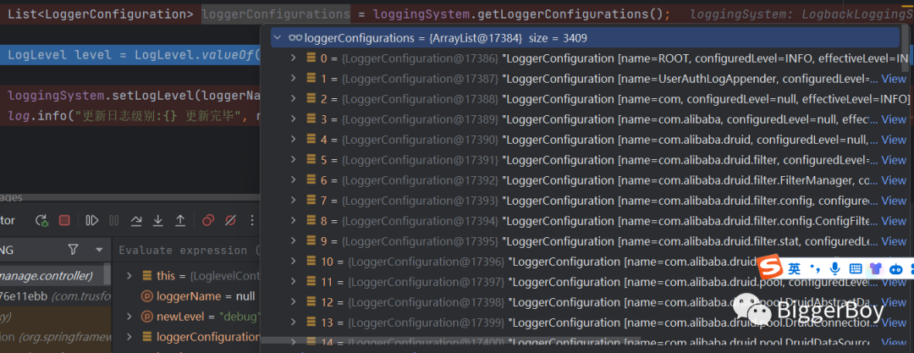
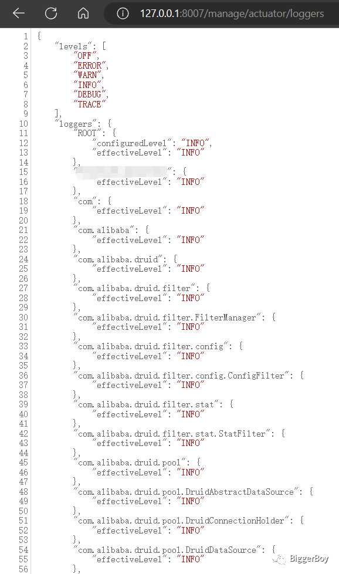

# [问北](https://www.cnblogs.com/ibigboy)

## 欢迎关注公众号：BiggerBoy

- [博客园](https://www.cnblogs.com/)
- [首页](https://www.cnblogs.com/ibigboy/)
- [新随笔](https://i.cnblogs.com/EditPosts.aspx?opt=1)
- [联系](https://msg.cnblogs.com/send/问北)
- 
- [管理](https://i.cnblogs.com/)


# [动态修改日志级别，太有用了！](https://www.cnblogs.com/ibigboy/p/17656193.html)


隐藏

**目录**

- 方案一、LoggingSystem
  - [1.1 获取日志Logger配置](https://www.cnblogs.com/ibigboy/p/17656193.html#_label0_0)
  - [1.2 修改日志级别](https://www.cnblogs.com/ibigboy/p/17656193.html#_label0_1)
- 方案二、日志框架提供的API
  - [2.1 初始化](https://www.cnblogs.com/ibigboy/p/17656193.html#_label1_0)
  - [2.2 获取Logger列表](https://www.cnblogs.com/ibigboy/p/17656193.html#_label1_1)
  - [2.3 修改日志级别](https://www.cnblogs.com/ibigboy/p/17656193.html#_label1_2)
- 方案三、spring-boot-starter-actuator
  - [3.1 引入依赖](https://www.cnblogs.com/ibigboy/p/17656193.html#_label2_0)
  - [3.2 开启日志端点配置](https://www.cnblogs.com/ibigboy/p/17656193.html#_label2_1)
  - [3.3 查看所有Logger](https://www.cnblogs.com/ibigboy/p/17656193.html#_label2_2)
  - [3.4 修改日志级别](https://www.cnblogs.com/ibigboy/p/17656193.html#_label2_3)

 

------

# 背景

我们在系统中一般都会打印一些日志，并且在开发、测试、生产各个环境中的日志级别可能不一样。在开发过程中为了方便调试打印了很多debug日志，但是生产环境为了性能，为了节约存储资源，我们会将日志级别设置为info或error较高的级别，只保留一些关键的必要的日志。

当线上出现问题需要排查时，最有效的方式是分析系统日志。此时因为线上环境日志级别较高，对排查问题有一定的阻碍，为了快速响应线上问题，我们需要更全面的日志帮助排查问题，传统的做法是修改日志级别重启项目。

# 目标

为了兼顾性能和快速响应线上问题，实现不重启项目的前提下动态修改日志级别。通过使用该功能，可以在需要解决线上问题时，实时调整线上日志输出级别，获取全面的Debug日志，帮助工程师提高定位问题的效率。

# 技术方案

本文列举了几种实现方案，已经验证可用，供大家参考。

[回到顶部](https://www.cnblogs.com/ibigboy/p/17656193.html#_labelTop)

## 方案一、LoggingSystem

在Spring Boot项目中可以通过LoggingSystem来获取或修改日志配置。


### 1.1 获取日志Logger配置

通过LoggingSystem API getLoggerConfigurations获取所有Logger配置

```
List loggerConfigs = loggingSystem.getLoggerConfigurations();
```




### 1.2 修改日志级别

通过调用LoggingSystem API setLogLevel设置包或具体Logger的日志级别，修改成功，立即生效。

```java
@Autowired
private LoggingSystem loggingSystem;
 
@RequestMapping(value = "/changeLogLevel", method = RequestMethod.POST)
public void changeLogLevel(String loggerName, String newLevel) {
    log.info("更新日志级别:{}", newLevel);
 
    LogLevel level = LogLevel.valueOf(newLevel.toUpperCase());
 
    loggingSystem.setLogLevel(loggerName, level);
    log.info("更新日志级别:{} 更新完毕", newLevel);
   
}
```

[回到顶部](https://www.cnblogs.com/ibigboy/p/17656193.html#_labelTop)

## 方案二、日志框架提供的API

参考美团技术文章：<https://tech.meituan.com/2017/02/17/change-log-level.html>

想必现在的业务系统基本都是采用SLF4J日志框架吧，在应用初始化时，SLF4J会绑定具体的日志框架，如Log4j、Logback或Log4j2等。具体源码如下(slf4j-api-1.7.7)：

```java
private final static void bind() {
  try {
    // 查找classpath下所有的StaticLoggerBinder类。
    Set<URL> staticLoggerBinderPathSet = findPossibleStaticLoggerBinderPathSet(); 
    reportMultipleBindingAmbiguity(staticLoggerBinderPathSet);
    // 每一个slf4j桥接包中都有一个org.slf4j.impl.StaticLoggerBinder类，该类实现了LoggerFactoryBinder接口。
    // the next line does the binding
    StaticLoggerBinder.getSingleton();
    INITIALIZATION_STATE = SUCCESSFUL_INITIALIZATION;
    reportActualBinding(staticLoggerBinderPathSet);
    fixSubstitutedLoggers();
    ...
}
```

findPossibleStaticLoggerBinderPathSet方法用来查找当前classpath下所有的org.slf4j.impl.StaticLoggerBinder类。每一个slf4j桥接包中都有一个StaticLoggerBinder类，该类实现了LoggerFactoryBinder接口。具体绑定到哪一个日志框架则取决于类加载顺序。

动态调整日志级别具体实现步骤如下：


### 2.1 初始化

确定所使用的日志框架，获取配置文件中所有的Logger内存实例，并将它们的引用缓存到Map容器中。

```java
String type = StaticLoggerBinder.getSingleton().getLoggerFactoryClassStr();
if (LogConstant.LOG4J_LOGGER_FACTORY.equals(type)) {
    logFrameworkType = LogFrameworkType.LOG4J;
    Enumeration enumeration = org.apache.log4j.LogManager.getCurrentLoggers();
    while (enumeration.hasMoreElements()) {
        org.apache.log4j.Logger logger = (org.apache.log4j.Logger) enumeration.nextElement();
        if (logger.getLevel() != null) {
            loggerMap.put(logger.getName(), logger);
        }
    }
    org.apache.log4j.Logger rootLogger = org.apache.log4j.LogManager.getRootLogger();
    loggerMap.put(rootLogger.getName(), rootLogger);
} else if (LogConstant.LOGBACK_LOGGER_FACTORY.equals(type)) {
    logFrameworkType = LogFrameworkType.LOGBACK;
    ch.qos.logback.classic.LoggerContext loggerContext = (ch.qos.logback.classic.LoggerContext) LoggerFactory.getILoggerFactory();
    for (ch.qos.logback.classic.Logger logger : loggerContext.getLoggerList()) {
        if (logger.getLevel() != null) {
            loggerMap.put(logger.getName(), logger);
        }
    }
    ch.qos.logback.classic.Logger rootLogger = (ch.qos.logback.classic.Logger) LoggerFactory.getLogger(Logger.ROOT_LOGGER_NAME);
    loggerMap.put(rootLogger.getName(), rootLogger);
} else if (LogConstant.LOG4J2_LOGGER_FACTORY.equals(type)) {
    logFrameworkType = LogFrameworkType.LOG4J2;
    org.apache.logging.log4j.core.LoggerContext loggerContext = (org.apache.logging.log4j.core.LoggerContext) org.apache.logging.log4j.LogManager.getContext(false);
    Map<String, org.apache.logging.log4j.core.config.LoggerConfig> map = loggerContext.getConfiguration().getLoggers();
    for (org.apache.logging.log4j.core.config.LoggerConfig loggerConfig : map.values()) {
        String key = loggerConfig.getName();
        if (StringUtils.isBlank(key)) {
            key = "root";
        }
        loggerMap.put(key, loggerConfig);
    }
} else {
    logFrameworkType = LogFrameworkType.UNKNOWN;
    LOG.error("Log框架无法识别: type={}", type);
}
```


### 2.2 获取Logger列表

从本地Map容器取出，封装成包含loggerName、logLevel的对象。

```java
private String getLoggerList() {
    JSONObject result = new JSONObject();
    result.put("logFramework", logFrameworkType);
    JSONArray loggerList = new JSONArray();
    for (ConcurrentMap.Entry<String, Object> entry : loggerMap.entrySet()) {
        JSONObject loggerJSON = new JSONObject();
        loggerJSON.put("loggerName", entry.getKey());
        if (logFrameworkType == LogFrameworkType.LOG4J) {
            org.apache.log4j.Logger targetLogger = (org.apache.log4j.Logger) entry.getValue();
            loggerJSON.put("logLevel", targetLogger.getLevel().toString());
        } else if (logFrameworkType == LogFrameworkType.LOGBACK) {
            ch.qos.logback.classic.Logger targetLogger = (ch.qos.logback.classic.Logger) entry.getValue();
            loggerJSON.put("logLevel", targetLogger.getLevel().toString());
        } else if (logFrameworkType == LogFrameworkType.LOG4J2) {
            org.apache.logging.log4j.core.config.LoggerConfig targetLogger = (org.apache.logging.log4j.core.config.LoggerConfig) entry.getValue();
            loggerJSON.put("logLevel", targetLogger.getLevel().toString());
        } else {
            loggerJSON.put("logLevel", "Logger的类型未知,无法处理!");
        }
        loggerList.add(loggerJSON);
    }
    result.put("loggerList", loggerList);
    LOG.info("getLoggerList: result={}", result.toString());
    return result.toString();
}
```

结果：

```json
{
    "loggerList": [
        {
            "logLevel": "OFF",
            "loggerName": "org.springframework.ldap"
        },
        {
            "logLevel": "INFO",
            "loggerName": "ROOT"
        },
        {
            "logLevel": "OFF",
            "loggerName": "com.sun.jersey.api.client"
        },
        {
            "logLevel": "OFF",
            "loggerName": "com.netflix.discovery"
        }
    ],
    "logFramework": "LOGBACK"
}
```


### 2.3 修改日志级别

通过调用具体的日志框架提供的API setLevel修改Logger日志级别，修改成功，立即生效。

```java
private String setLogLevel(JSONArray data) {
    LOG.info("setLogLevel: data={}", data);
    List<LoggerBean> loggerList = parseJsonData(data);
    if (CollectionUtils.isEmpty(loggerList)) {
        return "";
    }
    for (LoggerBean loggerbean : loggerList) {
        Object logger = loggerMap.get(loggerbean.getName());
        if (logger == null) {
            throw new RuntimeException("需要修改日志级别的Logger不存在");
        }
        if (logFrameworkType == LogFrameworkType.LOG4J) {
            org.apache.log4j.Logger targetLogger = (org.apache.log4j.Logger) logger;
            org.apache.log4j.Level targetLevel = org.apache.log4j.Level.toLevel(loggerbean.getLevel());
            targetLogger.setLevel(targetLevel);
        } else if (logFrameworkType == LogFrameworkType.LOGBACK) {
            ch.qos.logback.classic.Logger targetLogger = (ch.qos.logback.classic.Logger) logger;
            ch.qos.logback.classic.Level targetLevel = ch.qos.logback.classic.Level.toLevel(loggerbean.getLevel());
            targetLogger.setLevel(targetLevel);
        } else if (logFrameworkType == LogFrameworkType.LOG4J2) {
            org.apache.logging.log4j.core.config.LoggerConfig loggerConfig = (org.apache.logging.log4j.core.config.LoggerConfig) logger;
            org.apache.logging.log4j.Level targetLevel = org.apache.logging.log4j.Level.toLevel(loggerbean.getLevel());
            loggerConfig.setLevel(targetLevel);
            org.apache.logging.log4j.core.LoggerContext ctx = (org.apache.logging.log4j.core.LoggerContext) org.apache.logging.log4j.LogManager.getContext(false);
            ctx.updateLoggers(); // This causes all Loggers to refetch information from their LoggerConfig.
        } else {
            throw new RuntimeException("Logger的类型未知,无法处理!");
        }
    }
    return "success";
}
```

[回到顶部](https://www.cnblogs.com/ibigboy/p/17656193.html#_labelTop)

## 方案三、spring-boot-starter-actuator


### 3.1 引入依赖

```xml
<dependency>
    <groupId>org.springframework.boot</groupId>
    <artifactId>spring-boot-starter-actuator</artifactId>
</dependency>
```


### 3.2 开启日志端点配置

```yaml
# 由于Spring Boot 2.x默认只暴露 /health 以及 /info 端点，
# 而日志控制需要用到 /loggers 端点，故而需要设置将其暴露。当然把loggers替换成*也是可以的；开启所有！
management:
  endpoints:
    web:
      exposure:
        include: 'loggers'
```

可以通过访问URL/actuator/loggers/后加包名或者类名来查询指定包或者类的当前日志级别。

```bash
curl http://127.0.0.1:8007/manage/actuator/loggers/com.trrt.ep
{"configuredLevel":"DEBUG","effectiveLevel":"DEBUG"}
```


### 3.3 查看所有Logger

```
http://127.0.0.1:8007/manage/actuator/loggers
```




### 3.4 修改日志级别

可以通过访问URL/actuator/loggers/后加包名或者类名来修改指定包或者类的当前日志级别。

```
curl -X POST "http://127.0.0.1:8007/manage/actuator/loggers/com.trrt.ep" -H "Content-Type: application/json;charset=UTF-8" --data '{"configuredLevel":"debug"}'
```

最后，如果你觉得这篇文章有用，动动你的小手点个赞吧

说的再好，不如行动。不怕慢，就怕站。


分类: [问题解决](https://www.cnblogs.com/ibigboy/category/1520689.html) , [系统设计](https://www.cnblogs.com/ibigboy/category/1495330.html)

[好文要顶](javascript:void(0);) [关注我](javascript:void(0);)[收藏该文](javascript:void(0);) [微信分享](javascript:void(0);)


[问北](https://home.cnblogs.com/u/ibigboy/)
[粉丝 - 104](https://home.cnblogs.com/u/ibigboy/followers/) [关注 - 12](https://home.cnblogs.com/u/ibigboy/followees/)


[+加关注](javascript:void(0);)

4


[« ](https://www.cnblogs.com/ibigboy/p/17276288.html)上一篇： [为什么建议主键整型自增？](https://www.cnblogs.com/ibigboy/p/17276288.html)

posted @ 2023-08-25 10:16  [问北](https://www.cnblogs.com/ibigboy)  阅读(2047)  评论(0)  [编辑](https://i.cnblogs.com/EditPosts.aspx?postid=17656193)  [收藏](javascript:void(0))  [举报](javascript:void(0))


[刷新页面](https://www.cnblogs.com/ibigboy/p/17656193.html#)[返回顶部](https://www.cnblogs.com/ibigboy/p/17656193.html#top)

登录后才能查看或发表评论，立即 [登录](javascript:void(0);) 或者 [逛逛](https://www.cnblogs.com/) 博客园首页


[【推荐】100%开源！大型工业跨平台软件C++源码提供，建模，组态！](http://www.uccpsoft.com/index.htm)
[【推荐】轻量又高性能的 SSH 工具 IShell：AI 加持，快人一步](http://ishell.cc/)
[【推荐】2024阿里云超值优品季，精心为您准备的上云首选必备产品](https://click.aliyun.com/m/1000396435/)


[](https://www.wjx.top/vm/Qd2wuJd.aspx?udsid=216073)

**编辑推荐：**
· [SaaS架构：开放平台架构设计](https://www.cnblogs.com/tangshiye/p/18460498)
· [一张图带你了解.NET终结(Finalize)流程](https://www.cnblogs.com/lmy5215006/p/18456380)
· [漫谈高并发业务的 CAS 及 ABA](https://www.cnblogs.com/wzh2010/p/18031157)
· [再谈如何优雅修改代码](https://www.cnblogs.com/OceanEyes/p/18450797)
· [从 SQL Server 过渡到 PostgreSQL：理解模式的差异](https://www.cnblogs.com/lyhabc/p/18440681/sql-server-to-postgresql-understanding-schema-differences)

[](https://www.cnblogs.com/cmt/p/18457617)

**阅读排行：**
· [做点华为云代理业务，挣点小收入](https://www.cnblogs.com/cmt/p/18457617)
· [一张图带你了解.NET终结(Finalize)流程](https://www.cnblogs.com/lmy5215006/p/18456380)
· [.NET 8 实现无实体库表 API 部署服务](https://www.cnblogs.com/1312mn/p/18454788)
· [推荐一款支持Vue3的管理系统模版：Vue-Vben-Admin](https://www.cnblogs.com/kekobn/p/18460231)
· [OpenAI官方开源多智能体框架「Swarm」，并不是我想要的多智能体框架](https://www.cnblogs.com/shanyou/p/18460693)


### 公告

公告：我是问北，人称北哥，专注于Java相关技术分享。
博客园内的所有原创博客，转载时请详细注明出处哦！
『公众号:Biggerboy』欢迎关注~~


昵称：

 

问北

园龄：

 

7年2个月

粉丝：

 

104

关注：

 

12

[+加关注](javascript:void(0))

| [<](javascript:void(0);)2024年10月[>](javascript:void(0);) |      |      |      |      |      |      |
| ---------------------------------------------------------- | ---- | ---- | ---- | ---- | ---- | ---- |
| 日                                                         | 一   | 二   | 三   | 四   | 五   | 六   |
| 29                                                         | 30   | 1    | 2    | 3    | 4    | 5    |
| 6                                                          | 7    | 8    | 9    | 10   | 11   | 12   |
| 13                                                         | 14   | 15   | 16   | 17   | 18   | 19   |
| 20                                                         | 21   | 22   | 23   | 24   | 25   | 26   |
| 27                                                         | 28   | 29   | 30   | 31   | 1    | 2    |
| 3                                                          | 4    | 5    | 6    | 7    | 8    | 9    |

### 搜索

 

### [我的标签](https://www.cnblogs.com/ibigboy/tag/)

- [Redis(18)](https://www.cnblogs.com/ibigboy/tag/Redis/)
- [java(16)](https://www.cnblogs.com/ibigboy/tag/java/)
- [http(7)](https://www.cnblogs.com/ibigboy/tag/http/)
- [zookeeper(6)](https://www.cnblogs.com/ibigboy/tag/zookeeper/)
- [MySQL(6)](https://www.cnblogs.com/ibigboy/tag/MySQL/)
- [数据库(6)](https://www.cnblogs.com/ibigboy/tag/数据库/)
- [面试(6)](https://www.cnblogs.com/ibigboy/tag/面试/)
- [httpclient(5)](https://www.cnblogs.com/ibigboy/tag/httpclient/)
- [总结(5)](https://www.cnblogs.com/ibigboy/tag/总结/)
- [linux(4)](https://www.cnblogs.com/ibigboy/tag/linux/)
- [更多](https://www.cnblogs.com/ibigboy/tag/)

### 积分与排名

- 积分 - 246065
- 排名 - 4349

### [随笔分类](https://www.cnblogs.com/ibigboy/post-categories) (182)

- [dubbo(2)](https://www.cnblogs.com/ibigboy/category/1495334.html)
- [Java(37)](https://www.cnblogs.com/ibigboy/category/1495332.html)
- [Netty(1)](https://www.cnblogs.com/ibigboy/category/1580295.html)
- [nginx(4)](https://www.cnblogs.com/ibigboy/category/1495339.html)
- [Redis(21)](https://www.cnblogs.com/ibigboy/category/1495329.html)
- [spring(2)](https://www.cnblogs.com/ibigboy/category/1642530.html)
- [SpringBoot(2)](https://www.cnblogs.com/ibigboy/category/1547865.html)
- [Zookeeper(8)](https://www.cnblogs.com/ibigboy/category/1526672.html)
- [并发/多线程(3)](https://www.cnblogs.com/ibigboy/category/1520951.html)
- [代码工具(1)](https://www.cnblogs.com/ibigboy/category/2107287.html)
- [更多](javascript:void(0))

### 随笔档案 (133)

- [2023年8月(1)](https://www.cnblogs.com/ibigboy/p/archive/2023/08)
- [2023年3月(3)](https://www.cnblogs.com/ibigboy/p/archive/2023/03)
- [2022年8月(2)](https://www.cnblogs.com/ibigboy/p/archive/2022/08)
- [2022年7月(3)](https://www.cnblogs.com/ibigboy/p/archive/2022/07)
- [2022年4月(2)](https://www.cnblogs.com/ibigboy/p/archive/2022/04)
- [2022年2月(6)](https://www.cnblogs.com/ibigboy/p/archive/2022/02)
- [2021年9月(1)](https://www.cnblogs.com/ibigboy/p/archive/2021/09)
- [2021年2月(1)](https://www.cnblogs.com/ibigboy/p/archive/2021/02)
- [2020年10月(1)](https://www.cnblogs.com/ibigboy/p/archive/2020/10)
- [2020年9月(1)](https://www.cnblogs.com/ibigboy/p/archive/2020/09)
- [更多](javascript:void(0))

### [阅读排行榜](https://www.cnblogs.com/ibigboy/most-viewed)

- [1. com.alibaba.fastjson.JSONObject之对象与JSON转换方法(185056)](https://www.cnblogs.com/ibigboy/p/11124524.html)
- [2. HTTP 400 Bad request 原因(131036)](https://www.cnblogs.com/ibigboy/p/11242776.html)
- [3. 访问http接口时返回502 Bad Getway什么原因怎么解决(69625)](https://www.cnblogs.com/ibigboy/p/11248343.html)
- [4. httpclient信任所有证书解决SSLException:Unrecognized SSL message,plaintext connection(46819)](https://www.cnblogs.com/ibigboy/p/11265855.html)
- [5. SpringBoot自定义过滤器的两种方式及过滤器执行顺序(40950)](https://www.cnblogs.com/ibigboy/p/11528775.html)
- [6. Socket超时时间设置(31612)](https://www.cnblogs.com/ibigboy/p/11089324.html)
- [7. MySQL数据库中查询表的所有列名(30948)](https://www.cnblogs.com/ibigboy/p/11139206.html)
- [8. SecureCRT远程连接The remote system refused the connection问题(27166)](https://www.cnblogs.com/ibigboy/p/11988102.html)
- [9. MySQL数据库查询所有表名(23583)](https://www.cnblogs.com/ibigboy/p/11139257.html)
- [10. 几款ZooKeeper可视化工具，最后一个美炸了~(14764)](https://www.cnblogs.com/ibigboy/p/16501139.html)

### [评论排行榜](https://www.cnblogs.com/ibigboy/most-commented)

- [1. [需求设计\]从一个小需求感受Redis的独特魅力(37)](https://www.cnblogs.com/ibigboy/p/11969947.html)
- [2. Redis分布式锁实战(13)](https://www.cnblogs.com/ibigboy/p/13297215.html)
- [3. 最近面试遇到的种种应聘者，你是这样的吗？(12)](https://www.cnblogs.com/ibigboy/p/13072066.html)
- [4. 新晋面试官对近期面试的感想与总结(7)](https://www.cnblogs.com/ibigboy/p/12867550.html)
- [5. Java中真的只有值传递么？(6)](https://www.cnblogs.com/ibigboy/p/12059071.html)

### [推荐排行榜](https://www.cnblogs.com/ibigboy/most-liked)

- [1. [需求设计\]从一个小需求感受Redis的独特魅力(90)](https://www.cnblogs.com/ibigboy/p/11969947.html)
- [2. 什么？我往Redis写的数据怎么没了？(8)](https://www.cnblogs.com/ibigboy/p/12118636.html)
- [3. com.alibaba.fastjson.JSONObject之对象与JSON转换方法(7)](https://www.cnblogs.com/ibigboy/p/11124524.html)
- [4. 最近面试遇到的种种应聘者，你是这样的吗？(6)](https://www.cnblogs.com/ibigboy/p/13072066.html)
- [5. Java中真的只有值传递么？(6)](https://www.cnblogs.com/ibigboy/p/12059071.html)


Copyright ©2019 为何不是梦