# Alertmanager——配置详解

Prometheus2021-11-13228380

## 一、配置概述

### 1. 配置简介

Alertmanager主要负责对Prometheus产生的告警进行统一处理，在Alertmanager配置中一般会包含以下几个主要部分：

- 全局配置（global）：用于定义一些全局的公共参数，如全局的SMTP配置，Slack配置等内容；
- 模板（templates）：用于定义告警通知时的模板，如HTML模板，邮件模板等；
- 告警路由（route）：根据标签匹配，确定当前告警应该如何处理；
- 接收人（receivers）：接收人是一个抽象的概念，它可以是一个邮箱也可以是微信，Slack或者Webhook等，接收人一般配合告警路由使用；
- 抑制规则（inhibit_rules）：合理设置抑制规则可以减少垃圾告警的产生

### 2.global配置

```
global:
  [ resolve_timeout: <duration> | default = 5m ] # 当Alertmanager持续多长时间未接收到告警后标记告警状态为resolved（已解决）
  [ smtp_from: <tmpl_string> ]
  [ smtp_smarthost: <string> ]
  [ smtp_hello: <string> | default = "localhost" ] 
  [ smtp_auth_username: <string> ]
  [ smtp_auth_password: <secret> ] 
  [ smtp_auth_identity: <string> ]
  [ smtp_auth_secret: <secret> ]
  [ smtp_require_tls: <bool> | default = true ]
  [ slack_api_url: <secret> ]
  [ victorops_api_key: <secret> ]
  [ victorops_api_url: <string> | default = "https://alert.victorops.com/integrations/generic/20131114/alert/" ]
  [ pagerduty_url: <string> | default = "https://events.pagerduty.com/v2/enqueue" ]
  [ opsgenie_api_key: <secret> ]
  [ opsgenie_api_url: <string> | default = "https://api.opsgenie.com/" ]
  [ hipchat_api_url: <string> | default = "https://api.hipchat.com/" ]
  [ hipchat_auth_token: <secret> ]
  [ wechat_api_url: <string> | default = "https://qyapi.weixin.qq.com/cgi-bin/" ]
  [ wechat_api_secret: <secret> ]
  [ wechat_api_corp_id: <string> ]
  [ http_config: <http_config> ]

templates:
  [ - <filepath> ... ]

route: <route>

receivers:
  - <receiver> ...

inhibit_rules:
  [ - <inhibit_rule> ... ]
```

global配置中主要关注resolve_timeout的配置。其他配置为SMTP配置，Slack配置等告警媒介的相关配置，在后续章节配置不同的告警媒介时会具体讲到。也可参考官方文档：<https://prometheus.io/docs/alerting/latest/configuration/>

## 二、告警路由

### 1. 配置详解

告警路由可以使我们的告警根据不同的标签告警匹配到不同的渠道发送处理。配置文件解析如下：

```
route: #配置路由树
  receiver: # 接收组名，对于不同级别的告警，我们可能多个完全不同的接收组进行处理。
  group_by: []# 根据label标签的key进行匹配，如果是多个，就要多个都匹配
  continue: false # 告警是否去继续路由子节点
  match: [labelname:labelvalue,labelname1,labelvalue1] # 通过标签去匹配这次告警是否符合这个路由节点。
  match_re: [labelname:regex] # 通过正则表达是匹配标签，意义同上
  group_wait: 30s  # 组内等待时间，同一分组内收到第一个告警等待多久开始发送，目标是为了同组消息同时发送，不占用告警信息，默认30s
  group_interval: 5m # 当组内已经发送过一个告警，组内若有新增告警需要等待的时间，默认为5m,这条要确定组内信息是影响同一业务才能设置，若分组不合理，可能导致告警延迟，造成影响
  repeat_inteval: 4h # 告警已经发送，且无新增告警，若重复告警需要间隔多久 默认4h 属于重复告警，时间间隔应根据告警的严重程度来设置
  routes:
    - route: #路由子节点 配置信息跟主节点的路由信息一致
```

### 2. 路由匹配

每一个告警都会从配置文件中顶级的route进入路由树，需要注意的是顶级的route必须匹配所有告警(即不能有任何的匹配设置match和match_re)，每一个路由都可以定义自己的接受人以及匹配规则。默认情况下，告警进入到顶级route后会遍历所有的子节点，直到找到最深的匹配route，并将告警发送到该route定义的receiver中。但如果route中设置**continue**的值为false，那么告警在匹配到第一个子节点之后就直接停止。如果**continue**为true，报警则会继续进行后续子节点的匹配。如果当前告警匹配不到任何的子节点，那该告警将会基于当前路由节点的接收器配置方式进行处理。
其中告警的匹配有两种方式可以选择。一种方式基于字符串验证，通过设置**match**规则判断当前告警中是否存在标签labelname并且其值等于labelvalue。第二种方式则基于正则表达式，通过设置**match_re**验证当前告警标签的值是否满足正则表达式的内容。
如果警报已经成功发送通知, 如果想设置发送告警通知之前要等待时间，则可以通过**repeat_interval**参数进行设置。

### 3. 告警分组

Alertmanager可以对告警通知进行分组，将多条告警合合并为一个通知，避免短期内频繁收到多条相关告警。这里我们可以使用**group_by**来定义分组规则。基于告警中包含的标签，如果满足**group_by**中定义标签名称，那么这些告警将会合并为一个通知发送给接收器。
有的时候为了能够一次性收集和发送更多的相关信息时，可以通过**group_wait**参数设置等待时间，如果在等待时间内当前group接收到了新的告警，这些告警将会合并为一个通知向receiver发送。
而**group_interval**配置，则用于定义相同的Group之间发送告警通知的时间间隔。

### 4. 配置举例：告警分组功能的实现

> 一个完善的告警系统，告警路由通常是非常复杂的，为了便于运维人员配置，prometheus官方开发了一个路由配置树工具。<https://www.prometheus.io/webtools/alerting/routing-tree-editor/>

- 默认情况下所有的告警都会发送给管理员default-receiver，因此在Alertmanager的配置文件的根路由中，对告警信息按照集群以及告警的名称对告警进行分组。
- 如果告警是来源于数据库服务如MySQL或者pgsql，此时则需要将告警发送给相应的数据库管理员(dba)。这里定义了一个单独子路由，如果告警中包含service标签，并且service为mysql或者pgsql,则向dba-pager发送告警通知，由于这里没有定义group_by等属性，这些属性的配置信息将从上级路由继承，dba-pager将会接收到按cluser和alertname进行分组的告警通知。
- 而某些告警规则来源可能来源于开发团队，这些告警中通过添加标签team来标示这些告警的创建者。在Alertmanager配置文件的告警路由下，定义单独子路由用于处理这一类的告警通知，如果匹配到告警中包含标签team，并且team的值为dev，Alertmanager将会按照标签product和environment对告警进行分组。此时如果应用出现异常，开发团队就能清楚的知道哪一个环境(environment)中的哪一个应用程序出现了问题，可以快速对应用进行问题定位。

```
route:
  receiver: 'default-receiver'
  group_wait: 30s
  group_interval: 5m
  repeat_interval: 4h
  group_by: [cluster, alertname]
  routes:
  - receiver: 'dba-pager'
    group_wait: 10s
    match_re:
      service: mysql|pgsql
  - receiver: 'dev-pager'
    group_by: [product, environment]
    match:
      team: dev
```

### 5. 配置举例：告警分级功能的实现

- 在每条告警配置的标签中添加severity配置，有三种等级，分别为warning、critical和emergency。严重等级依次递增。
- 不论收到那种等级的告警，都会邮件通知给默认的管理员default-receiver
- 当告警等级为critical时，比较严重的告警，发送短信通知，每2h重复发送一次，直到问题解决
- 当告警等级为emergency时，特别严重的告警，打电话通知，每1h重复发送一次，直到问题解决

```
route:
  receiver: 'default-receiver'
  group_wait: 30s
  group_interval: 5m
  repeat_interval: 4h
  group_by: [cluster, alertname]
  routes:
  - receiver: 'SMS-pager'
    repeat_inteval: 2h
    group_wait: 10s
    match:
      severity: critical
  - receiver: 'phone-pager'
    repeat_inteval: 1h
    group_wait: 10s
    match:
      severity: emergency
```

## 三、告警接收

### 1. receiver配置介绍

在Alertmanager中路由负责对告警信息进行分组匹配，并向告警接收器发送通知。每一个receiver具有一个全局唯一的名称，并且对应一个或者多个通知方式，告警接收配置如下：

```
receivers:
- name: # 接收器名称，全局唯一

  # Configurations for several notification integrations.
  email_configs:
    [ - <email_config>, ... ]
  pagerduty_configs:
    [ - <pagerduty_config>, ... ]
  pushover_configs:
    [ - <pushover_config>, ... ]
  slack_configs:
    [ - <slack_config>, ... ]
  opsgenie_configs:
    [ - <opsgenie_config>, ... ]
  webhook_configs:
    [ - <webhook_config>, ... ]
  victorops_configs:
    [ - <victorops_config>, ... ]
  wechat_configs:
    [ - <wechat_config>, ... ]
- name: # 另一个接收器名称，全局唯一
	………………
```

目前官方内置的第三方通知集成包括：邮件、 即时通讯软件（如Slack、Hipchat）、移动应用消息推送(如Pushover)和自动化运维工具（例如：Pagerduty、Opsgenie、Victorops）。Alertmanager的通知方式中还可以支持Webhook，通过这种方式开发者可以实现更多个性化的扩展支持。
更多告警媒介配置请参考官方文档：<https://prometheus.io/docs/alerting/latest/configuration/#receiver>

### 2. 邮件告警配置

Alertmanager使用邮箱通知，用户只需要全局配置中定义好SMTP相关的配置，并且在receiver中定义接收方的邮件地址即可，此处以qq邮箱为例：

- 需要先登录QQ邮箱，开通smtp功能，并获取授权码。smtp_auth_password填写的信息，就是授权码，而非QQ邮箱的登录密码！

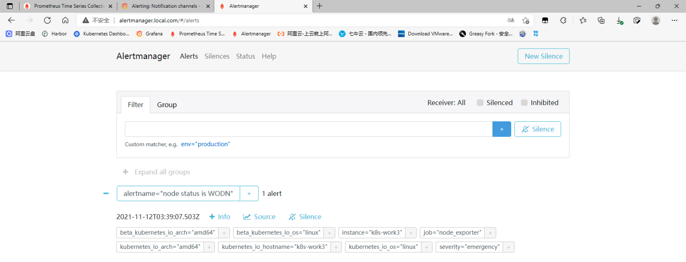

- Alertmanager配置

```
apiVersion: v1
kind: ConfigMap
metadata:
  name: alertmanager-conf
  namespace: monitoring
data:
  config.yaml: |-
    global: 
      smtp_smarthost: 'smtp.qq.com:465' 
      smtp_from: 'cuiliangblog@qq.com' 
      smtp_auth_username: 'cuiliangblog@qq.com' 
      smtp_auth_password: 'XXXX' 
      smtp_require_tls: false
    route: 
      receiver: email 
      group_by: 
      - alertname 
      group_wait: 10s 
      group_interval: 10s 
      repeat_interval: 1h
    receivers: 
    - name: 'email' 
      email_configs: 
      - to: '1111@qq.com'
      	send_resolved: false #告警解除发送恢复通知
```

- 告警测试


## 四、告警模板

Alertmanager提供了一套基于Go的默认模板系统。Alertmanager也支持用户定义和使用自己的模板。

### 1. 模板字符串

和prometheus配置模板字符串一样。具体参考官方文档<https://prometheus.io/blog/2016/03/03/custom-alertmanager-templates/#customize>，实际生产环境使用较少，此处不再介绍。

### 2. 模板文件

官方语法介绍：<https://prometheus.io/docs/alerting/latest/notifications/>
官方模板链接：<https://github.com/prometheus/alertmanager/blob/master/template/default.tmpl>
邮件模板链接：<https://github.com/mailgun/transactional-email-templates>

- 首先定义模板文件configmap

```
apiVersion: v1
kind: ConfigMap
metadata:
  name: alertmanager-email-tmpl
  namespace: monitoring
data:
  email-monitor.tmpl: |-
    {{ define "email-monitor.html" }}
    {{- if gt (len .Alerts.Firing) 0 -}}
    <h1>告警</h1>
    <table border="5">
        <tr>
            <td>报警项</td>
            <td>实例</td>
            <td>报警详情</td>
            <td>报警阀值</td>
            <td>开始时间</td>
        </tr>
        {{ range $i, $alert := .Alerts }}
            <tr><td>{{ index $alert.Labels "alertname" }}</td>
                <td>{{ index $alert.Labels "instance" }}</td>
                <td>{{ index $alert.Annotations "description" }}</td>
                <td>{{ index $alert.Annotations "value" }}</td>
                <td>{{ $alert.StartsAt.Format "2006-01-02 15:04:05" }}</td>
            </tr>
        {{ end }}
    </table>
    {{ end }}
    {{- if gt (len .Alerts.Resolved) 0 -}}
    <h1>恢复</h1>
    <table border="5">
        <tr>
            <td>报警项</td>
            <td>实例</td>
            <td>报警详情</td>
            <td>报警阀值</td>
            <td>开始时间</td>
        </tr>
        {{ range $i, $alert := .Alerts }}
            <tr>
                <td>{{ index $alert.Labels "alertname" }}</td>
                <td>{{ index $alert.Labels "instance" }}</td>
                <td>{{ index $alert.Annotations "description" }}</td>
                <td>{{ index $alert.Annotations "value" }}</td>
                <td>{{ $alert.StartsAt.Format "2006-01-02 15:04:05" }}</td>
            </tr>
        {{ end }}
    </table>
    {{ end }}{{- end }}
```

- 然后修改Alertmanager-config，指定模板文件

```
apiVersion: v1
kind: ConfigMap
metadata:
  name: alertmanager-conf
  namespace: monitoring
data:
  config.yaml: |-
    global: 
      smtp_smarthost: 'smtp.qq.com:465' 
      smtp_from: 'cuiliangblog@qq.com' 
      smtp_auth_username: 'cuiliangblog@qq.com' 
      smtp_auth_password: 'XXXXXX' 
      smtp_require_tls: false
    templates:
    - '/etc/alertmanager/tmpl/*.tmpl' # 指定自定义告警模板位置
    route: 
      receiver: email 
      group_by: 
      - alertname 
      group_wait: 10s 
      group_interval: 10m
      repeat_interval: 1h
    receivers: 
    - name: 'email' 
      email_configs: 
      - to: '1554382111@qq.com'
        send_resolved: false # 告警解除发送恢复通知
        html: '{{ template "email-monitor.html" . }}' # 指定告警模板
        headers: { Subject: "告警邮件" } # 邮件主题 如果不写也可以在模板中定义默认值
```

- 最后修改Alertmanager资源清单，将模板配置文件挂载

```
apiVersion: apps/v1
kind: Deployment
metadata:
  name: alertmanager
  namespace: monitoring
spec:
  replicas: 1
  selector:
    matchLabels:
      app: alertmanager
  template:
    metadata:
      name: alertmanager
      labels:
        app: alertmanager
    spec:
      containers:
      - name: alertmanager
        image: prom/alertmanager:v0.23.0
        imagePullPolicy: IfNotPresent
        resources:
          limits:
            memory: "4Gi"
            cpu: "4"
          requests:
            memory: "128Mi"
            cpu: "500m"
        args:
          - '--config.file=/etc/alertmanager/config/config.yaml'
          - '--storage.path=/alertmanager'
          - '--log.level=debug' 
        ports:
        - name: alertmanager
          containerPort: 9093
        volumeMounts:
        - name: alertmanager-conf
          mountPath: /etc/alertmanager/config
        - name: alertmanager-email-tmpl
          mountPath: /etc/alertmanager/tmpl
        - name: alertmanager
          mountPath: /alertmanager
      affinity:
        podAntiAffinity:
          requiredDuringSchedulingIgnoredDuringExecution:
          - labelSelector:
              matchExpressions:
              - key: app
                operator: In
                values:
                - alertmanager
            topologyKey: "kubernetes.io/hostname"
      volumes:
      - name: alertmanager-conf
        configMap:
          name: alertmanager-conf
      - name: alertmanager-email-tmpl
        configMap:
          name: alertmanager-email-tmpl
      - name: alertmanager
        emptyDir: {}
```

- 一切准备就绪后，接下来模拟节点宕机，测试告警是否正常发出


## 五、告警静默

接着上文提到的操作，现在work3节点持续处于宕机状态，并配置了repeat_interval: 1h，也就是如果故障没有解决，每1h会通知一次，直到故障恢复。但有可能这台服务器硬件损坏，短期内无法恢复，为了避免告警打扰，可以设置临时静默。

### 1. 查看告警

首先，查看Alertmanager的alerts。查看当前未恢复的告警


### 2. 设置静默

然后点击silence，对这个告警设置临时静默，然后填写静默持续时间(默认2h)，以及创建这和备注，填写完成后点击create创建静默规则
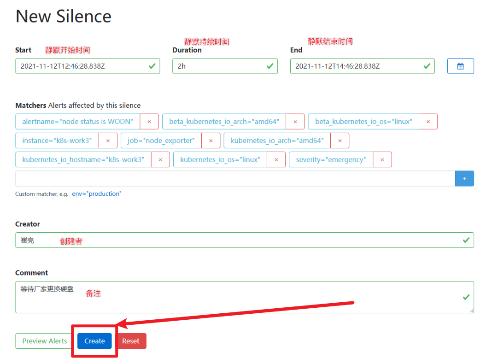

### 3. 查看验证

- 此时在alert中就不会看到激活的告警内容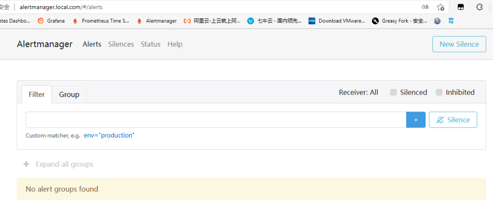
- 点击silence就可以查看到已经静默的告警

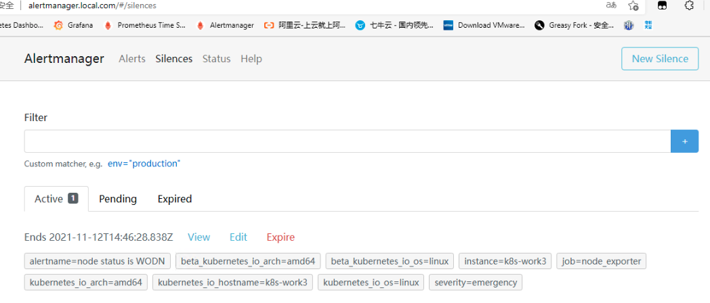

## 六、告警抑制

Alertmanager的抑制机制可以避免当某种问题告警产生之后用户接收到大量由此问题导致的一系列的其它告警通知。例如当集群不可用时，用户可能只希望接收到一条告警，告诉他这时候集群出现了问题，而不是大量的如集群中的应用异常、中间件服务异常的告警通知。

### 1. 基本格式

- Alertmanager中使用inhibit_rules定义一组告警的抑制规则，基本格式如下

```
inhibit_rules:
  - source_match: # 第一条抑制规则
    target_match: # 匹配标签
    target_match_re: # 匹配正则
    equal: # 在源和目标中具有相同值的标签
  - source_match: # 第二条抑制规则
    …………
```

当已经发送的告警通知匹配到target_match和target_match_re规则，当有新的告警规则如果满足source_match或者定义的匹配规则，并且已发送的告警与新产生的告警中equal定义的标签完全相同，则启动抑制机制，新的告警不会发送。

### 2. 模拟测试-抑制前

场景模拟：当前当前集群的work2上面运行了nginx服务，访问地址为<http://192.168.10.12/test.html>，并且配置了网络探针，检测<http://192.168.10.12/test.html>页面状态码是否为200，以及80端口的TCP检测，还有node_exporter宕机检测。并且都设置了告警，如果此时服务器宕机了，那么我将收到大量无用的告警信息，反而不好排查问题原因。

- 我们先在work2服务器上运行nginx服务，并添加测试页面，模拟线上生产环境的web服务

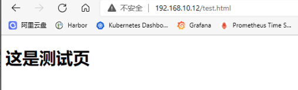

- 然后部署blackbox-exporter组件用于网络检测

```
apiVersion: v1
kind: Service
metadata:
  name: blackbox-exporter-svc
  namespace: monitoring
  labels:
    app: blackbox-exporter
spec:
  selector:
    app: blackbox-exporter
  type: ClusterIP
  ports:
  - name: http
    port: 9115
    protocol: TCP
---
apiVersion: apps/v1
kind: Deployment
metadata:
  name: blackbox-exporter
  namespace: monitoring
  labels:
    app: blackbox-exporter
spec:
  replicas: 1
  selector:
    matchLabels:
      app: blackbox-exporter
  template:
    metadata:
      labels:
        app: blackbox-exporter
    spec:
      containers:
      - image: prom/blackbox-exporter
        name: blackbox-exporter
        ports:
        - containerPort: 9115
          name: http
        readinessProbe:
          httpGet:
            path: /-/healthy
            port: http
          initialDelaySeconds: 10
          timeoutSeconds: 60
        livenessProbe:
          httpGet:
            path: /-/healthy
            port: http
          initialDelaySeconds: 30
          timeoutSeconds: 60
        resources:
          limits:
            cpu: 1 
            memory: "2Gi"
          requests:
            cpu: 250m
            memory: 640Mi
      restartPolicy: Always
```

- 接下来在prometheus配置文件中添加网络检测相关target

```
apiVersion: v1
kind: ConfigMap
metadata:
  name: prometheus-config
  namespace: monitoring
data:
  prometheus.yaml: |-
    global:
      scrape_interval: 15s
      evaluation_interval: 15s
    rule_files:
    - /etc/prometheus/rules/*.yaml
    alerting:
      alertmanagers:
      - static_configs:
        - targets: ["alertmanager:9093"]
    scrape_configs:
    - job_name: blackbox_http_exporter
      metrics_path: /probe
      params:
        module: [http_2xx]
      static_configs:
      - targets:
        - http://192.168.10.12/test.html
      relabel_configs:
      - source_labels: [__address__]
        target_label: __param_target
      - source_labels: [__param_target]
        target_label: instance
      - target_label: __address__
        replacement: blackbox-exporter-svc:9115
    - job_name: blackbox_tcp_exporter
      metrics_path: /probe
      params:
        module: [tcp_connect]
      static_configs:
      - targets:
        - 192.168.10.12:80
      relabel_configs:
      - source_labels: [__address__]
        target_label: __param_target
      - source_labels: [__param_target]
        target_label: instance
      - target_label: __address__
        replacement: blackbox-exporter-svc:9115
```

- 接下来查看prometheus-target页面，确认采集项成功添加

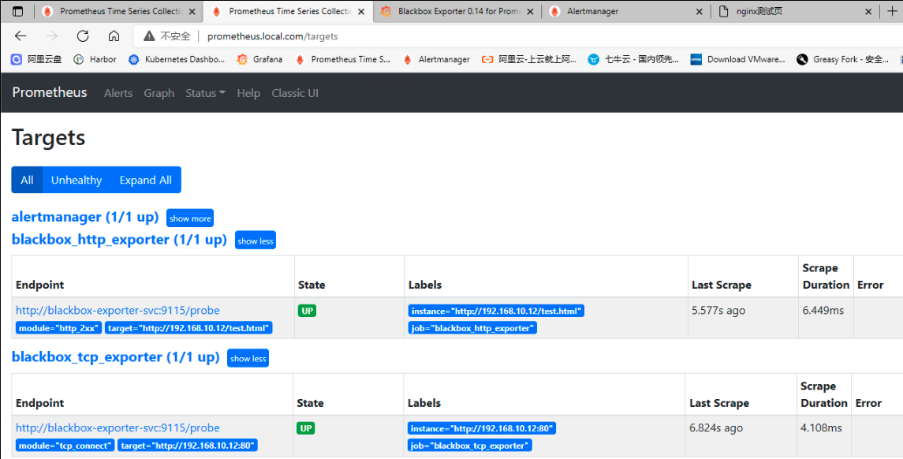

- 接下来添加告警规则配置，现在有三条告警，第一条为node status is WODN，事件等级为emergency，第二条为nginx service status is WODN，事件等级为critical，第三条为page status code error，事件等级为critical。三个告警事件从上到下层层依赖，重要程度依次递减。

```
apiVersion: v1
kind: ConfigMap
metadata:
  name: prometheus-rule
  labels:
    name: prometheus-rule
  namespace: monitoring
data:
  alert-rules.yaml: |-
    groups:
    - name: node-alert
      rules:
      - alert: node status is WODN
        expr: up{job="node_exporter"} == 0
        for: 1m
        labels:
          severity: emergency
          instance: "{{ $labels.instance }}"
        annotations:
          summary: "node: {{ $labels.instance }} down"
          description: "{{$labels.instance}} down more than 1 minutes"
          value: "{{ $value }}"
      - alert: nginx service status is WODN
        expr: probe_success{instance="192.168.10.12:80"} == 0
        for: 1m
        labels:
          severity: critical
          instance: "{{ $labels.instance }}"
        annotations:
          summary: "node: {{ $labels.instance }} nginx service down"
          description: "{{$labels.instance}} nginx service down more than 1 minutes"
          value: "{{ $value }}"
      - alert: page status code error
        expr: probe_http_status_code{instance="http://192.168.10.12/test.html"} != 200
        for: 1m
        labels:
          severity: warning
          instance: "{{ $labels.instance }}"
        annotations:
          summary: "url: {{ $labels.instance }} page status code error"
          description: "{{$labels.instance}} page status code error more than 1 minutes"
          value: "{{ $value }}"
```

- 先查看告警规则状态，当前三条告警规则都没有被触发

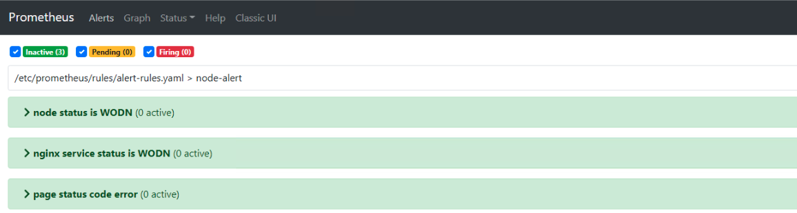

- 接下来先关闭其中任意一个节点，模拟服务器宕机。查看prometheus告警信息，三条告警被成功触发。

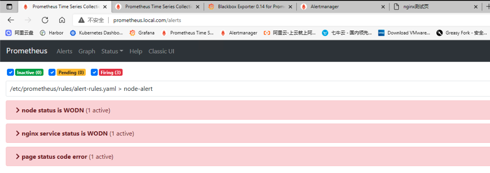

- 接下来查看Alertmanager告警列表，同样的收到了三条告警信息

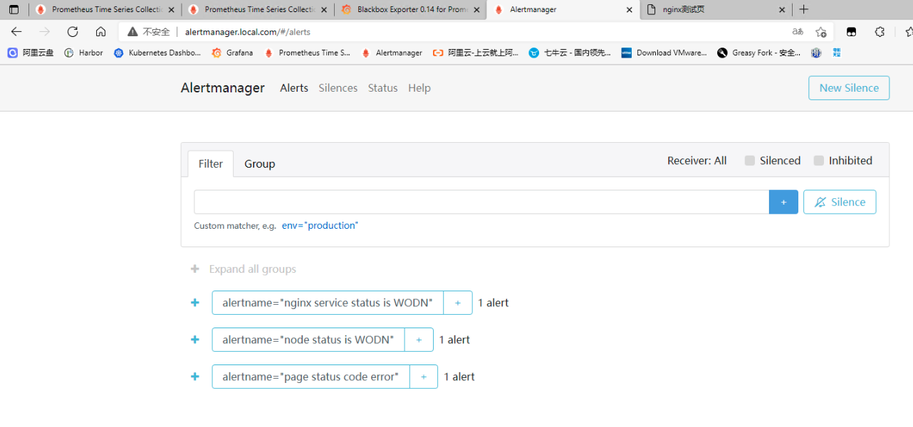

- 可以看到由于节点宕机，导致这台主机的nginx服务和对应的web页面均无法访问而产生了大量告警。在实际生产环境中，服务的依赖关系错综复杂，例如交换机端口down，可能会导致服务器间通信异常，从而收到大量的相关告警，反而无法快速定位出问题。遇到这种情况，就需要梳理告警之间的依赖关系，配置合理的告警抑制策略，避免告警风暴产生。

### 3. 模拟测试-抑制后

接下来，我们先对这三条告警依赖关系做一个简单的梳理，三条告警的依赖关系如下图所示：

- 接下来，我们先对nginx服务异常和web页面访问异常告警添加一个额外的标签`project: test-web`，标注这两条告警同属一个业务。接下来查看这三条告警的label，后面配置的告警抑制规则是根据每条告警的标签匹配的。


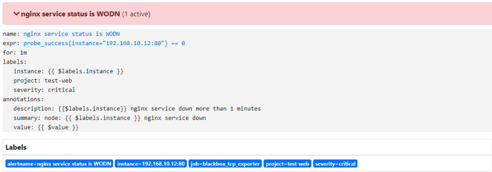


- 接下来，我们编写告警抑制规则

```
apiVersion: v1
kind: ConfigMap
metadata:
  name: alertmanager-conf
  namespace: monitoring
data:
  config.yaml: |-
    global: 
      smtp_smarthost: 'smtp.qq.com:465' 
      smtp_from: 'cuiliangblog@qq.com' 
      smtp_auth_username: 'cuiliangblog@qq.com' 
      smtp_auth_password: 'XXXXXXX' 
      smtp_require_tls: false
    templates:
    - '/etc/alertmanager/tmpl/*.tmpl' # 指定自定义告警模板位置
    route: 
      receiver: email 
      group_by: 
      - alertname 
      group_wait: 10s 
      group_interval: 10m
      repeat_interval: 1h
    receivers: 
    - name: 'email' 
      email_configs: 
      - to: '1554382111@qq.com'
        send_resolved: false # 告警解除发送恢复通知
        html: '{{ template "email-monitor.html" . }}' # 指定告警模板
        headers: { Subject: "告警邮件" } # 邮件主题 如果不写也可以在模板中定义默认值
    inhibit_rules:  
    - source_match: 
        alertname: 'node status is WODN'  
        instance: k8s-work2  
      target_match:
        project: test-web  
    - source_match: 
        severity: critical  
      target_match:
        severity: warning
      equal:
      - project
```

其中第一条抑制规则含义为：当收到告警的标签中instance=k8s-work2并且alertname='node status is WODN’时，触发抑制规则。后续收到的告警标签中project=test-web的告警将全部被抑制（也就是nginx告警和page code告警）
第二条抑制规则含义为：当收到告警的标签中severity=critical时，触发抑制规则，包含severity=warning的告警将被抑制。需要注意的是，还添加了一个equal标签，作用就是source和target中都包含project这个标签，且他们的值一致时，才会抑制（也就是抑制page code告警）

- 我们先将服务恢复正常状态

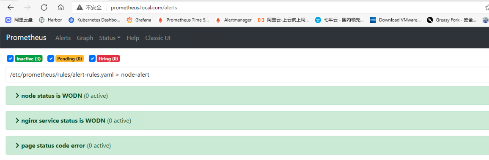

- 接下来关闭nginx服务，查看prometheus会发现有page status code error和nginx service status isWODN两条告警事件

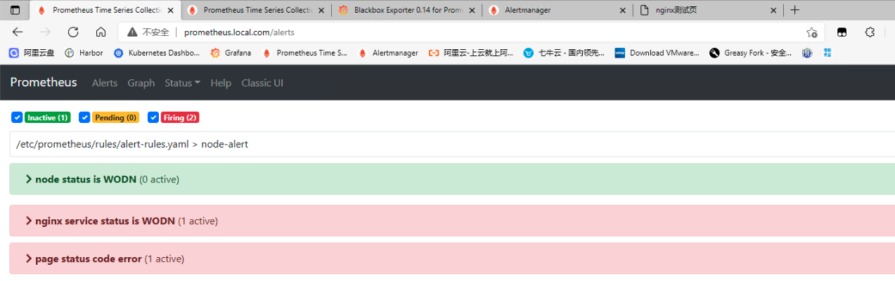

- 但此时Alertmanager只有nginx service status is WODN这一条告警事件，另一条page status code error告警被成功抑制。

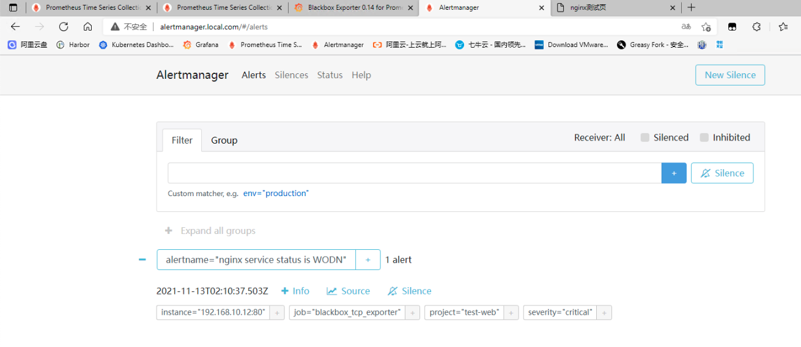

- 接下来关闭work2节点，模拟服务器宕机。查看prometheus告警这三条全部触发


- 查看Alertmanager告警列表，只有一条node status is WODN，其余两条告警被成功抑制。

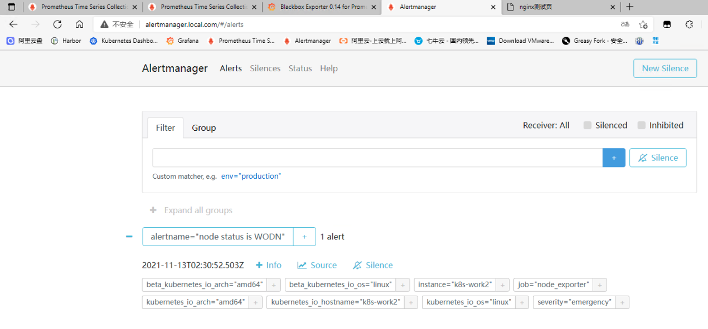

💖 猜你喜欢


Vue项目上线前优化总结


ES跨集群数据迁移方案测评


前后端分离项目SEO优化实践


ES索引策略配置与写入性能优化

📝 评论交流


0/50


暂无评论，快来抢沙发吧！


目录


评论


点赞


收藏


分享