# [](https://panzhongxian.cn/)

[关于我](https://panzhongxian.cn/cn-about/)[技术日志](https://panzhongxian.cn/cn/log/)[快乐生活](https://panzhongxian.cn/cn/life/)[标签](https://panzhongxian.cn/tags/)

# Grafana 常用但难配的图表

### 潘忠显 / 2023-09-02

------

Prometheus 是开源的监控系统，可以采集各种应用程序、服务和系统的监控指标。

Grafana 是开源的数据可视化和监控平台，它可以将各种数据源中的数据进行可视化展示，配置告警监控。

正因为其使用的低成本和便利性，Prometheus 数据源 + Grafana 指标展示，已经是非常常用的监控方式了：

- 服务框架会默认进行一些基础的上报，比如 RPC 的请求量、耗时分布等
- 业务相关的指标，开发也会在自己代码逻辑中添加相关的指标

但在实践中，上报较为完整的指标较容易，但因为对配置展示的不甚了解，会导致我们数据不能发挥其全面的监控作用。

接下来会介绍 Grafana 上如何配置几种**常用但不容易配的图表**。过程中会穿插介绍 Grafana 和 Prometheus 的一些基础细节。

## 一、测试环境

我这里提供了一个测试环境，依赖于 Docker Compose。

<https://github.com/panzhongxian/grafana-promql-test-env>

直接 `git clone` 之后直接 `docker compose up` 可以拉起 4 个服务：


- Grafana 的容器，命名为 grafana，监听 TCP 端口 3000
- Prometheus 的容器，命名为 promtheus，监听 TCP 端口 9090
- 指标暴露服务1，Python 后台进程，监听 18001 端口
- 指标暴露服务2，Python 后台进程，监听 18002 端口

**特别说明：因为前两个服务是在 Docker 容器内运行的，容器内无法直接通过 localhost 访问到母机上的端口，需要将 localhost 替换为 host.docker.internal**，相关的配置涉及两个地方：

- Prometheus 配置文件中，配置需要抓取的 targets 信息配置，已在仓库中的 prometheus.yml 文件中修改
- 通过 locahost:3000 访问 Grafana 页面配置中，需要配置 Prometheus 数据源

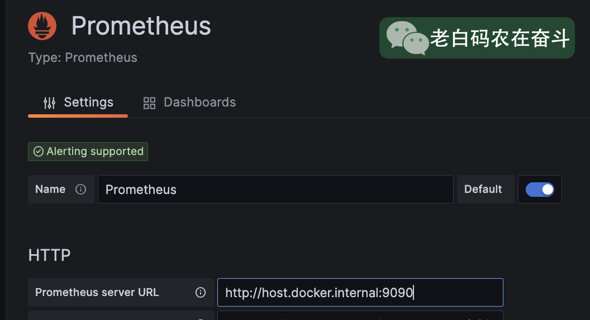

## 二、PromQL 基础

PromQL 顾名思义就是 Prometheus Query Language，可以让用户实时选择和聚合时间序列数据。

### 基础数据类型

了解 PromQL 是在 Grafana 上配置 Promtheus 指标展示的基础，而在这更基础的是，要理解 PromQL 表达式对应的几种数据类型：

- **Range vector(范围向量)**: 时间序列的集合，其中包含随时间变化的一系列数据点
- **Instant vector(即时向量)**: 某个时间点上的样本值的集合，可以理解为 Range vector 在某个时间点上的采样值
- **Scalar(标量)**: 一个简单的浮点值

与官方文档不同，我上边的故意调整了一下介绍顺序，因为 Instant Vector 分别可以和 Range Vector 和 Scalar 产生联系。

### 举例说明基础类型间关系

以一个 Counter 指标为例说明三者之间的关系。首先说明一下，这个 Counter 有两个 label，同时启动了两个实例进行上报：

```python
c = Counter('item_total', 'demo item counter', ['id', 'type'])
while True:
  type_, id_ = get_type_and_id()
  c.labels(id_, type_).inc()
  time.sleep(0.1)
```

**直接查询 item_total 得到的结果可以是 Range Vector，也可以是 Instant Vector**。这取决于在Grafana上选择的查询选项，本质上调用不同的 Prometheus API：

```bash
GET /api/v1/query        # 查询 instant，可以指定时间点
GET /api/v1/query_range  # 查询 range，可以指定时间范围
```

比如在 Grafana 上查询选项中勾选了 Both 会同时展示 Range 和 Instant：

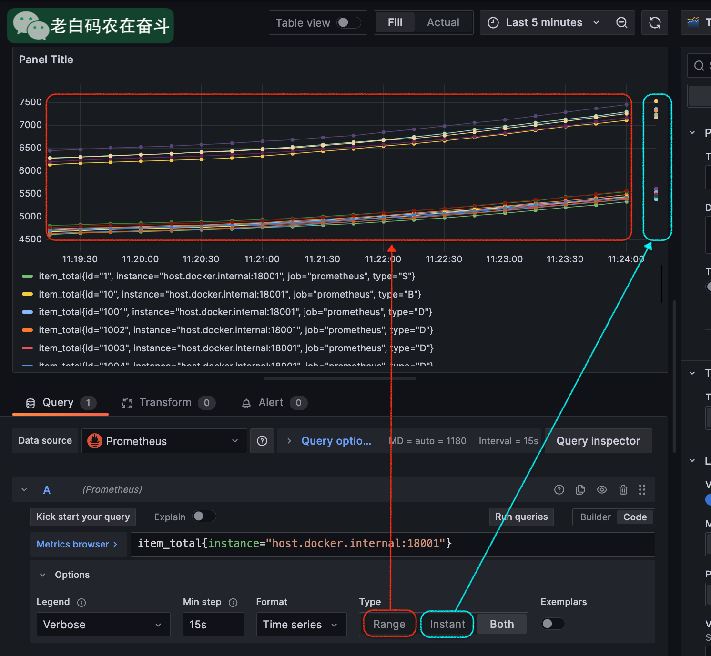

具体地画个关系图，总结一下三者关系：

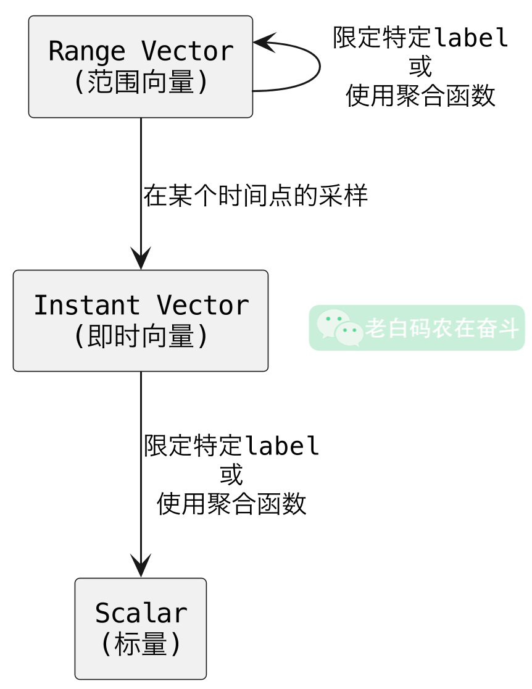

### 基本选择器语句

下面通过一个语句展示一下几种常见的选择器（selector）的用法，用于筛选的 Prometheus 中的指标：

```sql
sum by (id) (rate(item_total{type="S"} [5m] offset 5m @1690788035))
```

- `{}` 用于过滤 label
- `[5m]` 表示产生产生5分钟的 range vector
- `offset 5m` 表示往前（更早的时间）偏移5分钟
- `@1690788035` 表示前边表达式在时间戳的那个位置上的 instant 值
- `rate` 表示计算括号内的值的速率
- `sum by (id)` 表示按照 id 标签聚合求和

很少有场景，会将所有的 selector 都加到一个指标上。而是会通过不同选择器筛选出多个指标，进行计算或结合来进行复杂的展示。

另外，**Range vector 可以转换成 Range vector，有几种方式**：

- 通过过滤 label：`item_total{instance="host.docker.internal:18001"}` 就会过滤得到其中一个实例， 样本数减少
- 通过聚合函数：`sum(item_total)` 或 `avg(item_total)` 会将所有 label 进行聚合，得到一个时间序列，样本数减少
- 普通函数：`rate(item_total[1m])` 按照分钟统计的每秒速率，得到相同的 label 的N个时间序列，样本数基本没有减少，做了一个计算

## 三、百分比表格

以上边 item_total 指标为例，我们除了会关心这个指标的实时变化之外，往往还需要看到这个指标的PV、每日道具产出道具ID、道具类型的数量和占比。

在没有使用 Prometheus 指标之前，要看这个值，往往需要通过日志上报，然后做实时计算来累积这个值。接下来我们看一下直接使用 Grafana 上如何配置出这两个表格。

### 固定相对时间

**当天数据**：我们希望展示的是当天的数据，即时 Grafana 面板的在右上角时间发生变化的时候，也能固定住这个时间。

点击 Query options 会展开面板，在 “Relative time” 选项框中输入 `now/d` 即表示开始时间从当天0点开始。

灵活地运用这个Promtheus的这个相对时间，可以更容易配置出更符合预期的图表。这里完整的表达式的可以这么写：

```
now-5d/M -1M
```

上述表达式可以拆分成两部分来看：

- `now-5d/M`：表示从当前时间往前推45天，然后按照每个月的第一天进行分组
- `-1M`：表示在上述时间范围内，再往前推一个月

注意：**Rleative time** 会在右上角为相对时间的时候，覆盖全局的时间，即独立而不受影响。但如果右上角 from 和 to 都是绝对的时间，则会覆盖图表的起止时间 range。

### 使用时间区间

在选择了当天的时间范围之后，我们要在指标中使用这个区间并统计区间内的增长值，同时要按照我们需要的维度进行聚合（去掉一些不需要了解的维度，比如 instance）：

```sql
sum by(id, type) (increase(item_total[$__range]))
```

这里有用到`$__range`，是一个 **Grafana 内置变量**，用于表示当前查询的时间范围。

### 生成表格并构造列

在指标下边的选项中：勾选 Fromat 为 Table；在 Type 中点选 Instant。

在右侧 Visualization 的下拉框中，选择 Table。

以上操作完成之后，panel中已经呈现出表格的基本形态，包括 Time/id/type/Value 等4列。

### 增加百分比列

我们要展示各个道具ID占总产出的比例，其实就是将 各个ID数量对应的 range vector 和 总数量的 range vector 进行除法运算即可。

- 分子是 `sum by(id, type) (increase(item_total[$__range]))`
- 分母是 `sum (increase(item_total[$__range]))`

但是两者 label 的数量不一样，直接做除法是会报错的。并且这里属于一种 *many-to-one* 的场景：一边多个元素（不同label值的单个值）对应另外一边一个向量元素（不同label值的和），前者被称为 many-side，后者被称为 one-side。

Promtheus 的 vector matching 中有介绍连接不同向量的方法：

- `ignoring` 的操作忽略掉指定的 label，以匹配两个 label 不完全相同的指标
- `group_left`关键词，用于 `many-to-one` 的连接，按照左边的标签进行匹配，若没有匹配值，右边放0

具体地，统计各个ID占比可以表示为：

```sql
sum by(id, type) (increase(item_total[$__range])) 
/
ignoring(id, type) group_left sum (increase(item_total[$__range]))
```

只显示上述展示的可以看到 Value 列展示的就是道具的产出占比：

同样地，按照上边的解释，还可以配置出每种道具类型中，不同道具的产出占比：

```sql
sum by(id, type) (increase(item_total[$__range])) 
/
ignoring(id) group_left sum by (type) (increase(item_total[$__range]))
```

以及不同类型的占道具总产出的占比：

```sql
sum by(type) (increase(item_total[$__range])) 
/
ignoring(type) group_left sum (increase(item_total[$__range]))
```

### 两个查询结果合并展示

前边通过两个查询分别查询出了*各道具当天产出总量*以及*各道具产出总量占比*。通过 Transform 中的 *Merge* 功能可以将两个结果 自动合并到一起。

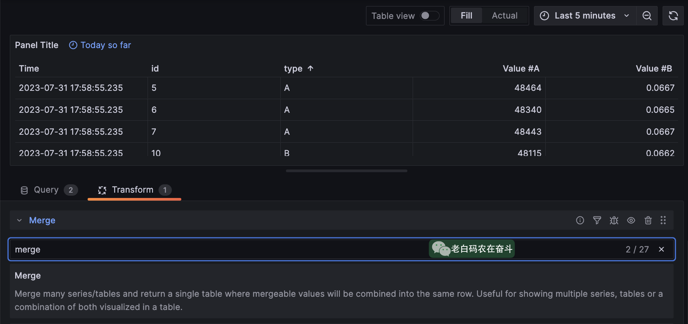

但展示的列名，需要做一下简单的映射，才有更好的可读性。通过 Transform 中的 *Organize fields* 完成这个映射。

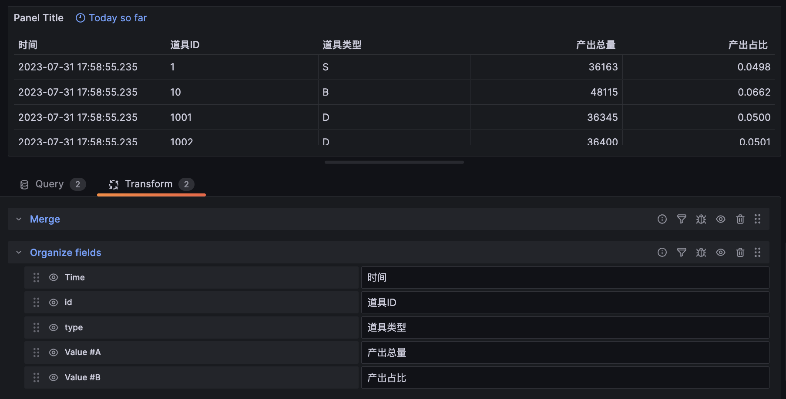

### 更多细节处理

- 居中对齐：在 All -Table-Column Align 中可以选择默认的对齐方式

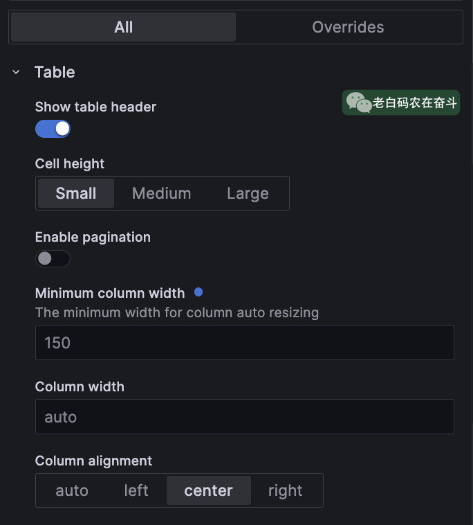

在 Overrides 中选择 Fields with name 可以针对每一列调整如下信息：

- 百分比格式：选择单位(Unit)，然后选择 percent(0.0 - 1.0)
- 时间格式：因为这里展示的是一天，没有合适的选项，可以直接手动输入 `time: YYYY-MM-DD` 然后敲回车，来指定日期格式
- 最小宽度：针对实际宽度比较小的，可以设置最小宽度，比如这里的道具类型

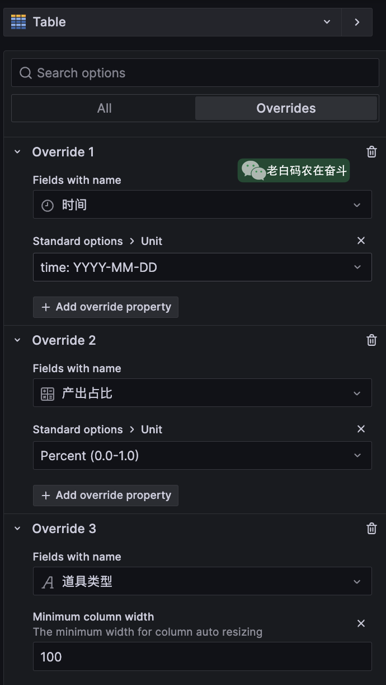

## 四、统计每小时/每日增量

日常的数据统计中，按照天统计某个指标的增量（比如某接口在最近一周每天的访问总量）是非常常见的。

如何通过配置，能以表格或柱状图的形式，展示一段时间每小时/每天统计的效果呢？

前边的表格中，展示的是当天（`now/d` 到 `now`）之间的数据，固定了 range 之后，无法查看其他天的统计情况。有一种特殊情况是可以将右上角的相对时间修改为绝对时间，此时 `$__range` 的实际值会与右上角一致，但结果只能是这段时间的增量，而不会产生多天的数值。

*一段时间内每小时/每天的统计*，实际上指标在有不同的时间点上的结果，因此 PromQL 的查询结果应当是个 Range vector，只不过这个时间点是每天只有一个时间点（间隔较大而已）。

### 不含当前周期的统计

“*某指标在每小时增加的统计量*”直接翻译成 PromQL 为：

```sql
sum(increase(item_total[1h]))
```

为了避免过多的干扰，我们只关注整点时该统计值，因此，需要在 Options - Min step 中设置成 `1h`。

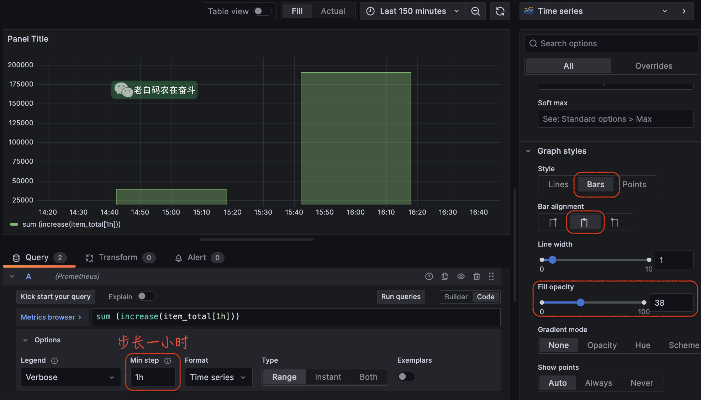

上边的配置能基本满足按照小时统计的需求，但是有一点**不足：不能显示当前不满1小时内的统计量**。比如上图的“now”实际为 16:50，从16:00 到 now 的增量实际是没有显示，而当前未满一个周期的统计值，实际也是我们较关心的。

### 包含当前周期的统计

将 PromQL 语句做一个简单调整：

```sql
sum(increase(item_total[1h] offset -1h))
```

offset 函数用于将时间窗口向过去移动指定的时间，这里 `offset -1h` 表示将时间窗口向过去移动 `-1h`，即向未来移动一小时。所以，`item_total[1h] offset -1h` 最近一个周期返回的是 `item_total` 时间序列在 now/h 到 now/h + 1h 之间的所有数据点。但是 now 到 now/h + 1h 还没有数据，所以等价于表示 now/h 到 now 到所有时间点。

再具体到上边截图中，在16:50统计时，图中 16:00 的统计点：

- `sum(increase(item_total[1h]))` 是 *15:00 - 16:00* 之间增加的数量
- `sum(increase(item_total[1h] offset -1h))` 是 *16:00 - 当前时间*的之间增加的数量

后者是前者的往前偏移了一小时，最后补充了当前周期的统计点，为了更明显的对比，这里暂时改成 line 进行比较：

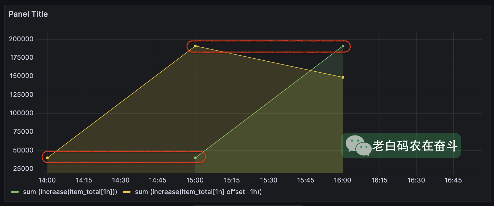

时间 override：跟之前介绍的类似，时间可以指定格式进行 override，这样当光标移动到对应的 bar 上则可以显示指定的格式

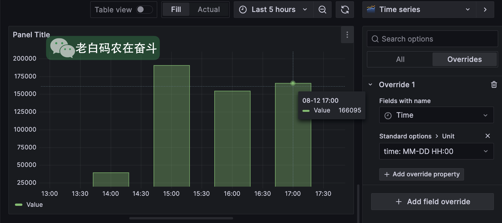

### 使用 Bar chart 替换

如果每个时间点存在多个 label 的指标，可以在 visualization 中选择 Bar 类型：

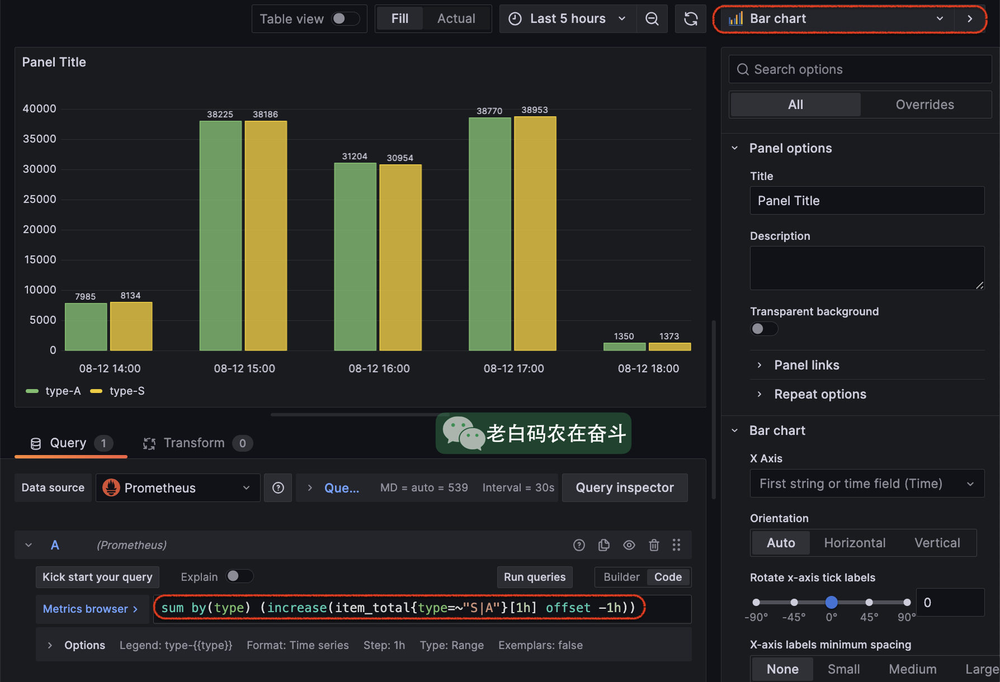

## 五、Panel 对齐

新手在处理 Grafana 面板的时候，往往会比较难操控面板的对齐。Grafana 没有分散对齐的功能，像这样常见需求就难操作：一行有2个面板，容易让他们均匀对齐；再添加一个面板，需要3个面板均匀分布；再添加一个面板，需要4个面板均匀分布。

理解了 Grafana Dashboard 的尺寸原理，上边这种需求就很好操作了。

我们知道 Grafana 在界面上的配置，最终都会保存成 JSON。我们看看 JSON 配置说明中关于尺寸和位置的说明。

> ### Panel size and position
>
> The gridPos property describes the panel size and position in grid coordinates.
>
> - `w` 1-24 (the width of the dashboard is divided into 24 columns)
> - `h` In grid height units, each represents 30 pixels.
> - `x` The x position, in same unit as `w`.
> - `y` The y position, in same unit as `h`.
>
> The grid has a negative gravity that moves panels up if there is empty space above a panel.

### 宽度单位 1/24

宽度和横轴位置的单位，是屏幕宽度的 1/24。也就是说，宽度是相对的，浏览器不管多宽，面板的宽度只能是屏幕宽度的 N 份 1/24。

**为什么会将屏幕分成 24 个单位？**因为 24 是 1、2、3、4、6、8倍数，换句话，一行中如果有2、3、4、6、8个面板，都可以被均匀的分布。

所以如果我们要对齐 3个面板，将每个面板的宽度，JSON中设置成8即可，或者拖拉8个单位，拖拉会有栏位的提示：


*类似的问题：为什么圆周被划分成 360 度？为什么一小时有60分钟，一天有24小时？都是因为好做等分。*

### 高度单位 30 pixels

高度的单位则是 “30 pixels”，即 30 像素，可以认为是一个绝对的单位。但是会随着浏览器的缩放像素大小会有区别。

同样的，每个高度单位附近，拖拉也会有一定的吸附提示：

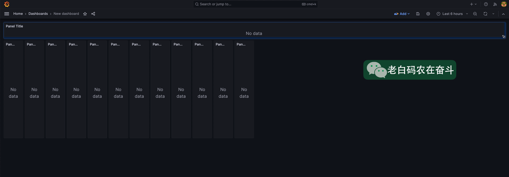

### 浏览器缩放中的面板

通过 Ctrl + +/- 可以控制浏览器的页面的缩放，缩放过程中像素点的大小缩放，但是总宽度是不变的。

再加上我们上边提到的宽高度单位不同，浏览器缩放，只会影响高度，所以**面板的比例实际是会变化的**：

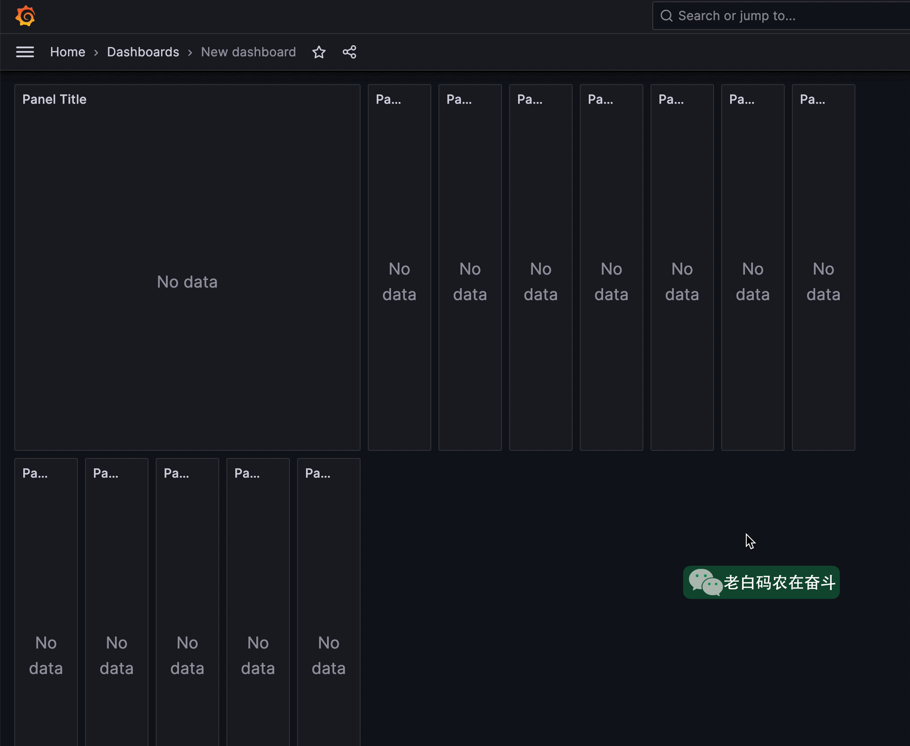


← [GitHub 每周热点(230827)](https://panzhongxian.cn/cn/2023/08/github-trending-230827/)[23年9月新闻随谈](https://panzhongxian.cn/cn/2023/10/news-comments/) →

<iframe class="utterances-frame" title="Comments" scrolling="no" src="https://utteranc.es/utterances.html?src=https%3A%2F%2Futteranc.es%2Fclient.js&amp;repo=panzhongxian%2Fblog-comments&amp;issue-term=pathname&amp;theme=github-light&amp;crossorigin=anonymous&amp;async=&amp;url=https%3A%2F%2Fpanzhongxian.cn%2Fcn%2F2023%2F09%2Fgrafana-pannel-skills%2F&amp;origin=https%3A%2F%2Fpanzhongxian.cn&amp;pathname=cn%2F2023%2F09%2Fgrafana-pannel-skills%2F&amp;title=Grafana+%E5%B8%B8%E7%94%A8%E4%BD%86%E9%9A%BE%E9%85%8D%E7%9A%84%E5%9B%BE%E8%A1%A8+-+%E6%BD%98%E5%BF%A0%E6%98%BE&amp;description=Jason+Pan%27s+Personal+Website%3B+%E6%BD%98%E5%BF%A0%E6%98%BE%E7%9A%84%E4%B8%AA%E4%BA%BA%E7%BD%91%E7%AB%99&amp;og%3Atitle=Grafana+%E5%B8%B8%E7%94%A8%E4%BD%86%E9%9A%BE%E9%85%8D%E7%9A%84%E5%9B%BE%E8%A1%A8+-+%E6%BD%98%E5%BF%A0%E6%98%BE&amp;session=" loading="lazy" style="box-sizing: inherit; max-width: 100%; display: block; margin: auto; color-scheme: light; position: absolute; left: 0px; right: 0px; width: 1px; min-width: 100%; height: 269px; border: 0px;"></iframe>

------

© [Jason Pan](https://panzhongxian.cn/) 2020    [粤ICP备17076119号](https://beian.miit.gov.cn/)