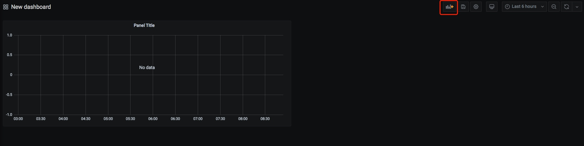
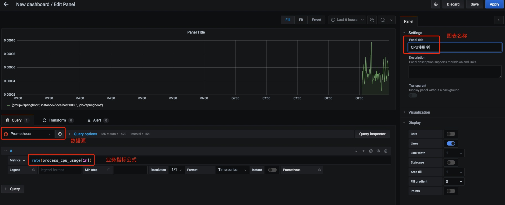
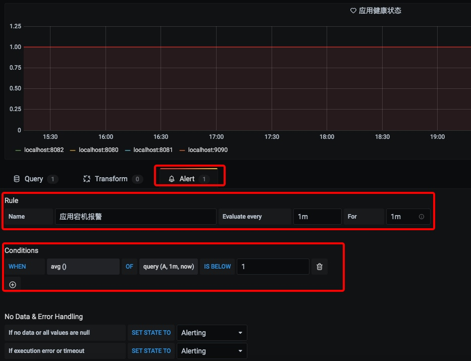

# [Prometheus 快速入门教程（二）：Prometheus + Grafana实现可视化、告警](https://www.cnblogs.com/chanshuyi/p/02_grafana_quick_start.html)


目录

- [什么是Grafana](https://www.cnblogs.com/chanshuyi/p/02_grafana_quick_start.html#什么是grafana)
- 快速入门
  - [启动服务器](https://www.cnblogs.com/chanshuyi/p/02_grafana_quick_start.html#启动服务器)
  - [配置数据源](https://www.cnblogs.com/chanshuyi/p/02_grafana_quick_start.html#配置数据源)
  - [配置面板](https://www.cnblogs.com/chanshuyi/p/02_grafana_quick_start.html#配置面板)
  - [邮件通道配置](https://www.cnblogs.com/chanshuyi/p/02_grafana_quick_start.html#邮件通道配置)
  - [指标告警配置](https://www.cnblogs.com/chanshuyi/p/02_grafana_quick_start.html#指标告警配置)
- [Grafana模板中心](https://www.cnblogs.com/chanshuyi/p/02_grafana_quick_start.html#grafana模板中心)
- [参考资料](https://www.cnblogs.com/chanshuyi/p/02_grafana_quick_start.html#参考资料)

# 文章首发于【陈树义】公众号，点击跳转到原文：<https://mp.weixin.qq.com/s/56S290p4j9KROB5uGRcGkQ>

Prometheus UI 提供了快速验证 PromQL 以及临时可视化支持的能力，但其可视化能力却比较弱。一般情况下，我们都用 Grafana 来实现对 Prometheus 的可视化实现。


## 什么是Grafana

Grafana 是一个用来展示各种各样数据的开源软件，在其官网上用这么一段话来说明其作用。

```vbnet
Used by thousands of companies to monitor everything from infrastructure, applications, and power plants to beehives.

数以万计的公司用 Grafana 来监控基础设施、应用。
```

从官网上可以看到目前有 Paypal、ebay 等公司已经在使用 Prometheus 了。


## 快速入门

我们只需要在 Grafana 上配置一个 Prometheus 的数据源。接着我们就可以配置各种图表，Grafana 就会自动去 Prometheus 拉取数据进行展示。


### 启动服务器

首先我们从 <https://grafana.com/grafana/download> 下载对应系统的安装包，下载解压后用下面的命令启动：

```bash
./grafana-server web
```

# 文章首发于【陈树义】公众号，点击跳转到原文：<https://mp.weixin.qq.com/s/56S290p4j9KROB5uGRcGkQ>

正常启动会输出如下信息：

```makefile
INFO[07-18|17:28:12] App mode production                      logger=settings
INFO[07-18|17:28:12] Connecting to DB                         logger=sqlstore dbtype=sqlite3
INFO[07-18|17:28:12] Starting DB migration                    logger=migrator
INFO[07-18|17:28:12] Starting plugin search                   logger=plugins
INFO[07-18|17:28:12] Registering plugin                       logger=plugins name="Direct Input"
INFO[07-18|17:28:12] HTTP Server Listen                       logger=http.server address=[::]:3000 protocol=http subUrl= socket=
```

Grafana 默认使用 3000 端口启动，我们访问：[http://localhost:3000](http://localhost:3000/) 查看对应页面。


默认的账号密码是 admin/admin，登陆进去后是这样的。


### 配置数据源

之后我们去设置菜单添加 Prometheus 数据源：


打开如下图所示：


之后输入对应的名字和 URL 地址即可：


这里我们添加了一个名为「Prometheus-1」的数据源，数据获取地址为：[http://localhost:9090](http://localhost:9090/)。


### 配置面板

在 Grafana 中有「Dashboard」和「Panel」的概念，Dashboard 可以理解成「看板」，而 Panel 可以理解成「图表，一个看看板中包含了无数个图表。例如下图就是一个看板（Dashboard）：


里面一个个小的图表，就是一个个小的图表（Panel）。

点击「+号」-> 「Dashboard」就可以添加一个大面板。


添加后的面板是空白的，下面我们创建一个图标来显示 CPU 的使用率变化情况。点击右上角的创建图表按钮：



点击创建图表会进入如下界面：



我们设置好数据源、Metrics数据、图表名称，之后点击右上角的 Apply 按钮即可。保存之后我们就可以在面板中看到机器的 CPU 使用率情况了。


### 邮件通道配置

如果我们要使用 Prometheus 进行监控告警，那么 Grafana 也能够实现。

Grafana 的告警渠道有很多，这里我们以邮件告警为例。

首先需要在 Grafana 的配置文件，默认是 conf/default.ini 文件。


在 default.ini 文件中增加如下配置：

```makefile
[smtp]
enabled = true
host = smtp.exmail.qq.com:465
user = xxx@qq.com
# If the password contains # or ; you have to wrap it with triple quotes. Ex """#password;"""
password = xxxx
cert_file =
key_file =
skip_verify = false
from_address = xxx@qq.com  //必须与上面的 user 属性一致
from_name = Grafana
ehlo_identity =
```

host 这里是你邮箱所在运营商的 SMTP 服务器。user 属性是发件人的邮箱地址。password 是发件人邮箱的登陆密码。from_address 与 user 属性一样，都是发件人的邮箱地址。from_name 是发件人的显示名称。

修改完成之后，保存配置文件，之后重启 Grafana。接着通过 Alerting 菜单添加告警渠道。


之后填写「提醒通道」名称、类型，之后点击「Send Test」按钮测试一下。


正常的话，会受到一封测试邮件，这表明邮件配置已经完成。

此外我们还可以配置 AlertManager、钉钉等其他告警方式，配置的流程都大同小异，这里不再赘述。

# 文章首发于【陈树义】公众号，点击跳转到原文：<https://mp.weixin.qq.com/s/56S290p4j9KROB5uGRcGkQ>


### 指标告警配置

配置好邮件发送通道信息后，Grafana 就具备了发送邮件的能力。但是什么时候发送邮件呢？这就需要我们进行指标告警配置了。

我们需要在图表面板设置中设置相关报警信息：



这里我配置了 1 分钟内值低于 1，那么就报警，即：1 分钟内挂机了，那么就报警。随后我手动关掉了 NodeExport 节点，过了几分钟我就收到了报警邮件。


***更多关于图表的设置，将在后续文章专门讲述，这里不深入讲解。***

## Grafana模板中心

对于线上监控来讲，如果我们每个面板都需要自己从零开始，那么就太累了。事实上，我们用到的许多监控信息都是类似的。因此 [Grafana官网 - Dashboards 模块](https://grafana.com/grafana/dashboards) 提供了下载 Dashboard 模板的功能。


Dashboards 里有许多各种类型的 Dashboard 面板，例如 JVM 监控、MySQL 数据库监控等。你只需找到合适自己的监控面板，之后根据 ID 添加即可。

例如我找到的这个这个面板包含了各种常见的资源监控，例如：CPU、内存等。


你只需要复制它的 ID 并使用 Grafana 的 import 功能导入即可，如下图所示：


最终的效果如图所示：


# 文章首发于【陈树义】公众号，点击跳转到原文：<https://mp.weixin.qq.com/s/56S290p4j9KROB5uGRcGkQ>

## 参考资料

- [Grafana: The open observability platform | Grafana Labs](https://grafana.com/)
- [Grafana Dashboards - discover and share dashboards for Grafana. | Grafana Labs](https://grafana.com/grafana/dashboards)


分类: [14. Prometheus 快速入门教程](https://www.cnblogs.com/chanshuyi/category/1862951.html)