转载自：<https://cloud.tencent.com/developer/article/1486483>

### 文章目录[1、Prometheus & AlertManager 介绍](https://cloud.tencent.com/developer?from=10680)[2、环境、软件准备](https://cloud.tencent.com/developer?from=10680)[3、启动并配置 Prometheus](https://cloud.tencent.com/developer?from=10680)[3.1、Docker 启动 Prometheus](https://cloud.tencent.com/developer?from=10680)[3.2、Docker 启动 node-exporter](https://cloud.tencent.com/developer?from=10680)[3.3、Prometheus 配置 node-exproter](https://cloud.tencent.com/developer?from=10680)[4、启动并配置 AlertManager](https://cloud.tencent.com/developer?from=10680)[4.1、AlertManager 配置邮件告警](https://cloud.tencent.com/developer?from=10680)[4.2、Prometheus 配置 AlertManager 告警规则](https://cloud.tencent.com/developer?from=10680)[4.3、触发报警发送 Email](https://cloud.tencent.com/developer?from=10680)[4.4、AlertManager 配置自定义邮件模板](https://cloud.tencent.com/developer?from=10680)

## 1、Prometheus & AlertManager 介绍

> Prometheus 是一套开源的系统监控、报警、时间序列数据库的组合，最初有 SoundCloud 开发的，后来随着越来越多公司使用，于是便独立成开源项目。Alertmanager 主要用于接收 Prometheus 发送的告警信息，它支持丰富的告警通知渠道，例如邮件、微信、钉钉、Slack 等常用沟通工具，而且很容易做到告警信息进行去重，降噪，分组等，是一款很好用的告警通知系统。

## 2、环境、软件准备

本次演示环境，我是在本机 MAC OS 上操作，以下是安装的软件及版本：

- **Docker**: 18.06.3-ce
- **Oracle VirtualBox**: 6.0.8 r130520 (Qt5.6.3)
- **Linux**: 7.6.1810
- **Prometheus**: v2.11.1
- **Alertmanager**: v0.18.0
- **Node-Exporter**: v0.18.1

注意：这里为了快速方便启动 Prometheus、Alertmanager、Node-Exporter 服务，我使用 Docker 方式启动，所以本机需要安装好 Docker 环境，这里忽略 Docker 的安装过程，着重介绍一下如何启动并配置 Prometheus 监控报警系统 集成 AlertManager，并配置 Email 发送告警信息。

## 3、启动并配置 Prometheus

### 3.1、Docker 启动 Prometheus

启动 Prometheus 很简单，这里为了方便，我采用 Docker 方式启动，最简单的启动命令如下：

```javascript
$ docker run --name prometheus -d -p 9090:9090 prom/prometheus:latest
```

这里默认 Prometheus 开放 `9090` 端口，我们使用最新版官方镜像，当前最新版本为 `v2.11.1`，启动完成后，浏览器访问 `http://<IP>:9090` 即可看到默认 UI 页面。

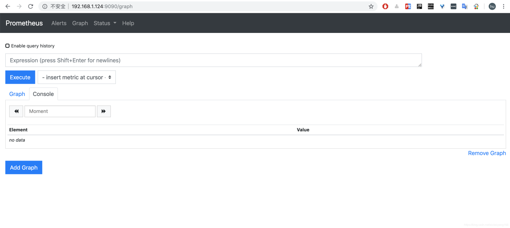

Prometheus 默认配置文件 `prometheus.yml` 在容器内路径为 `/etc/prometheus/prometheus.yml`，我们可以进入到容器内查看一下。

```javascript
$ docker exec -it prometheus /bin/sh
/prometheus $ cat /etc/prometheus/prometheus.yml
# my global config
global:
  scrape_interval:     15s # Set the scrape interval to every 15 seconds. Default is every 1 minute.
  evaluation_interval: 15s # Evaluate rules every 15 seconds. The default is every 1 minute.
  # scrape_timeout is set to the global default (10s).

# Alertmanager configuration
alerting:
  alertmanagers:
  - static_configs:
    - targets:
      # - alertmanager:9093

# Load rules once and periodically evaluate them according to the global 'evaluation_interval'.
rule_files:
  # - "first_rules.yml"
  # - "second_rules.yml"

# A scrape configuration containing exactly one endpoint to scrape:
# Here it's Prometheus itself.
scrape_configs:
  # The job name is added as a label `job=<job_name>` to any timeseries scraped from this config.
  - job_name: 'prometheus'

    # metrics_path defaults to '/metrics'
    # scheme defaults to 'http'.

    static_configs:
    - targets: ['localhost:9090']
```

从默认配置可以看到 Alertmanager 配置、rule 报警规则、监听目标端点配置等，每一项的配置我就不一一解释了，下边具体使用中，会分别讲到。现在 Prometheus 已经启动起来了，我们需要启动一个 exporter 来供 Prometheus 监控获取指标值，这里以一个常用的 `node-exproter` 为例，它是最基本的节点监控客户端，负责监控机器的各个指标，包括节点存活、CPU、Mem、Network、IO 等等，方便后边演示 Alertmanager 报警时的触发条件，例如配置节点存活检测，当机器 Down 时，触发报警控制，那么就可以通过停止 `node-exporter` 来模拟实现了。

### 3.2、Docker 启动 node-exporter

同样采用 Docker 方式启动 `node-exporter` 服务，最简单的启动命令如下：

```javascript
$ docker run --name node-exporter -d -p 9100:9100 prom/node-exporter:latest
```

这里 `node-exporter` 默认启动端口为 `9100`，当前镜像最新版本为 `v0.18.0`。启动完成后，浏览器访问 `http://<IP>:9100/metrics` 可以看到提供的监控指标项列表了。

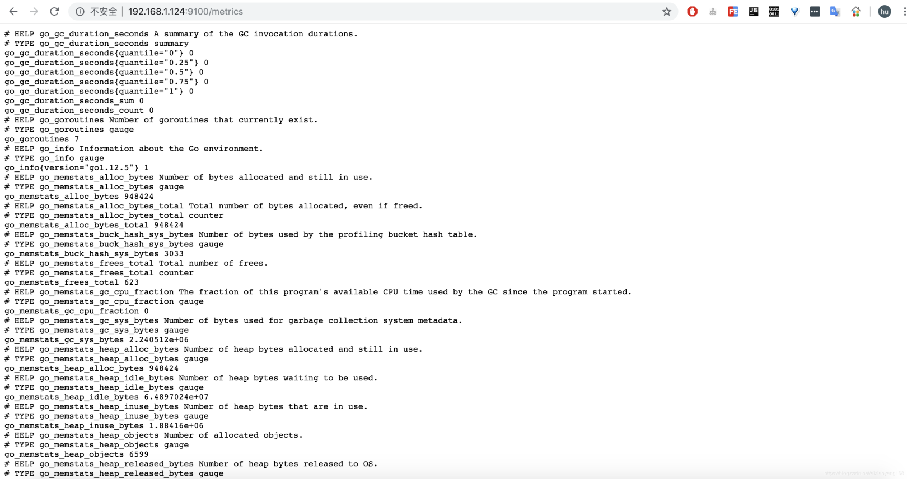

### 3.3、Prometheus 配置 node-exproter

接下来，我们需要将 `node-exporter` 信息配置到 Prometheus 中，来让 Prometheus 定期获取 exporter 采集的信息，那么就需要修改 `prometheus.yml` 配置文件，在 `scrape_configs` 下新增一个 job，配置如下：

```javascript
$ mkdir -p /root/prometheus && cd /root/prometheus
$ vim prometheus.yml
global:
  scrape_interval:     15s 
  evaluation_interval: 15s  
  # scrape_timeout is set to the global default (10s).

# Alertmanager configuration
alerting:
  alertmanagers:
  - static_configs:
    - targets:
      # - alertmanager:9093

# Load rules once and periodically evaluate them according to the global 'evaluation_interval'.
rule_files:
  # - "first_rules.yml"
  # - "second_rules.yml"

scrape_configs:
  - job_name: 'prometheus'
    static_configs:
    - targets: ['192.168.1.124:9090']
      labels:
        instance: prometheus
        service: prometheus-service
 
  - job_name: 'node-exporter'
    static_configs:
    - targets: ['192.168.1.124:9100'] 
      labels: 
        instance: vm-192.168.1.124
        service: node-service
```

注意：这里新增一个名称为 `node-exporter` 的 job 配置，target 就是上边 `node-exporter` 请求地址，默认 `http` 方式，请求地址后缀默认为 `/metric`，如果不是该地址，那么就需要配置 `metrics_path: <path>`。同时我为每个 job 新增了 label 标签配置，这个是很有必要的，通过配置不同的 label 来附加一些必要的信息，在后边 Alertmanager 告警邮件中和 Grafana Dashboard 展示中，都是很重要的区分表示。配置完毕，需要将新的配置文件覆盖容器内配置文件，并重启 Prometheus 来使配置生效。

```javascript
$ docker run -d
	--name prometheus 
	-p 9090:9090 
	-v /root/prometheus/prometheus.yml:/etc/prometheus/prometheus.yml 
	prom/prometheus:latest
```

这里通过挂载的方式将外部配置文件覆盖容器内配置，重启 prometheus 服务，浏览器访问 `http://192.168.1.124:9090/targets` 可以看到新增加的 target，并且是 `healthy` 状态。

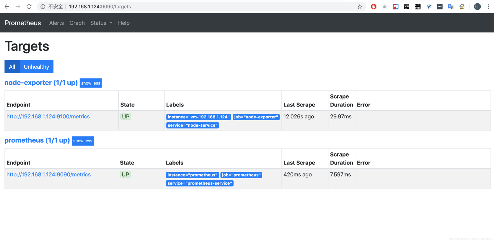

不过，有没有发现默认使用 `static_configs` 静态配置方式，虽然可以正确配置，但是每次配置都需要重启 Prometheus 服务，当我们需要分批次添加很多 Node 时，频繁重启服务就会造成监控的多次中断，这太不友好了。当然 Prometheus 也提供了多种服务发现方式。

- [`azure_sd_configs`](https://prometheus.io/docs/prometheus/latest/configuration/configuration/#azure_sd_config)
- [`consul_sd_configs`](https://prometheus.io/docs/prometheus/latest/configuration/configuration/#consul_sd_config)
- [`dns_sd_configs`](https://prometheus.io/docs/prometheus/latest/configuration/configuration/#dns_sd_config)
- [`ec2_sd_configs`](https://prometheus.io/docs/prometheus/latest/configuration/configuration/#ec2_sd_config)
- [`openstack_sd_configs`](https://prometheus.io/docs/prometheus/latest/configuration/configuration/#openstack_sd_config)
- [`file_sd_configs`](https://prometheus.io/docs/prometheus/latest/configuration/configuration/#file_sd_config)
- [`kubernetes_sd_configs`](https://prometheus.io/docs/prometheus/latest/configuration/configuration/#kubernetes_sd_config)
- [`marathon_sd_configs`](https://prometheus.io/docs/prometheus/latest/configuration/configuration/#marathon_sd_config)
- [`nerve_sd_configs`](https://prometheus.io/docs/prometheus/latest/configuration/configuration/#nerve_sd_config)
- [`serverset_sd_configs`](https://prometheus.io/docs/prometheus/latest/configuration/configuration/#serverset_sd_config)
- [`triton_sd_configs`](https://prometheus.io/docs/prometheus/latest/configuration/configuration/#triton_sd_config)

更多详细配置可查看 [这里](https://prometheus.io/docs/prometheus/latest/configuration/configuration/#scrape_config)，这里我们可以采用 `file_sd_configs` 方式，将 targets 以 Json 或 Yaml 方式写入特定文件中，那么只要文件发生变化，Prometheus 就会自动加载，是不是很方便啦！

```javascript
$ midir -p /root/prometheus/groups/nodegroups && cd /root/prometheus/groups/nodegroups
$ vim node.json
[
    {
        "targets": [
            "192.168.1.124:9100"
        ],
        "labels": {
            "instance": "vm-192.168.1.124",
            "service": "node-service"
        }
    }
]
```

新建一个 `node.json` 文件，将 `prometheus.yml` 中 `job_name: 'node-exporter'` 下的信息以 Json 方式配置到该文件中，然后修改 `prometheus.yml` 加载方式为 `file_sd_configs`，配置修改如下：

```javascript
...
	- job_name: 'node-exporter'
     file_sd_configs:
       - files: ['/usr/local/prometheus/groups/nodegroups/*.json']
```

注意：这里我们指定加载容器内目录配置文件，那么需要将本地 `node.json` 文件挂载到容器内指定目录上，修改 Prometheus 启动命令如下：

```javascript
$ docker run -d
	--name prometheus
	-p 9090:9090 
	-v /root/prometheus/prometheus.yml:/etc/prometheus/prometheus.yml 
	-v /root/prometheus/groups/:/usr/local/prometheus/groups/ prom/	prometheus:latest        
```

启动成功，以后在添加或修改 Node 相关的 exproter，就可以直接在该 Json 文件中更新即可，不需要重启 Prometheus 服务，更多关于 Prometheus 配置可以参考 [官网文档](https://prometheus.io/docs/prometheus/latest/configuration/configuration/)。

## 4、启动并配置 AlertManager

接下来，我们需要启动 AlertManager 来接受 Prometheus 发送过来的报警信息，并执行各种方式的告警。同样以 Docker 方式启动 AlertManager，最简单的启动命令如下：

```javascript
$ docker run --name alertmanager -d -p 9093:9093 prom/alertmanager:latest
```

这里 AlertManager 默认启动的端口为 `9093`，启动完成后，浏览器访问 `http://<IP>:9093` 可以看到默认提供的 UI 页面，不过现在是没有任何告警信息的，因为我们还没有配置报警规则来触发报警。

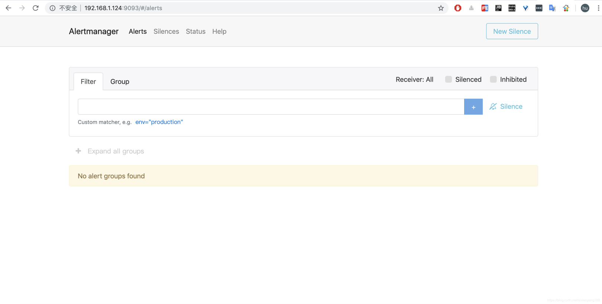

### 4.1、AlertManager 配置邮件告警

AlertManager 默认配置文件为 `alertmanager.yml`，在容器内路径为 `/etc/alertmanager/alertmanager.yml`，默认配置如下：

```javascript
global:
  resolve_timeout: 5m

route:
  group_by: ['alertname']
  group_wait: 10s
  group_interval: 10s
  repeat_interval: 1h
  receiver: 'web.hook'
receivers:
- name: 'web.hook'
  webhook_configs:
  - url: 'http://127.0.0.1:5001/'
inhibit_rules:
  - source_match:
      severity: 'critical'
    target_match:
      severity: 'warning'
    equal: ['alertname', 'dev', 'instance']
```

简单介绍一下主要配置的作用：

- [global](https://prometheus.io/docs/alerting/configuration/#configuration-file): 全局配置，包括报警解决后的超时时间、SMTP 相关配置、各种渠道通知的 API 地址等等。
- [route](https://prometheus.io/docs/alerting/configuration/#route): 用来设置报警的分发策略，它是一个树状结构，按照深度优先从左向右的顺序进行匹配。
- [receivers](https://prometheus.io/docs/alerting/configuration/#receiver): 配置告警消息接受者信息，例如常用的 email、wechat、slack、webhook 等消息通知方式。
- [inhibit_rules](https://prometheus.io/docs/alerting/configuration/#inhibit_rule): 抑制规则配置，当存在与另一组匹配的警报（源）时，抑制规则将禁用与一组匹配的警报（目标）。

那么，我们就来配置一下使用 Email 方式通知报警信息，这里以 QQ 邮箱为例，配置如下：

```javascript
global:
  resolve_timeout: 5m
  smtp_from: 'xxxxxxxx@qq.com'
  smtp_smarthost: 'smtp.qq.com:465'
  smtp_auth_username: 'xxxxxxxx@qq.com'
  smtp_auth_password: 'xxxxxxxxxxxxxxx'
  smtp_require_tls: false
  smtp_hello: 'qq.com'
route:
  group_by: ['alertname']
  group_wait: 5s
  group_interval: 5s
  repeat_interval: 5m
  receiver: 'email'
receivers:
- name: 'email'
  email_configs:
  - to: 'xxxxxxxx@qq.com'
    send_resolved: true # 注意这个参数：控制告警恢复后发不发邮件的
inhibit_rules:
  - source_match:
      severity: 'critical'
    target_match:
      severity: 'warning'
    equal: ['alertname', 'dev', 'instance']
```

以上配置我反复试验后，发现不同的环境参数配置也不一样，调试期间出现了各种报错问题，将其中几个关键的配置说明一下：

- `smtp_smarthost`: 这里为 QQ 邮箱 SMTP 服务地址，官方地址为 `smtp.qq.com` 端口为 `465` 或 `587`，同时要设置开启 `POP3/SMTP` 服务。
- `smtp_auth_password`: 这里为第三方登录 QQ 邮箱的授权码，非 QQ 账户登录密码，否则会报错，获取方式在 QQ 邮箱服务端设置开启 `POP3/SMTP` 服务时会提示。
- `smtp_require_tls`: 是否使用 tls，根据环境不同，来选择开启和关闭。如果提示报错 `email.loginAuth failed: 530 Must issue a STARTTLS command first`，那么就需要设置为 true。着重说明一下，如果开启了 tls，提示报错 `starttls failed: x509: certificate signed by unknown authority`，需要在 `email_configs` 下配置 `insecure_skip_verify: true` 来跳过 tls 验证。

修改 AlertManager 启动命令，将本地 `alertmanager.yml` 文件挂载到容器内指定位置。

```javascript
$ docker run -d
	--name alertmanager
	-p 9093:9093 
	-v /root/prometheus/alertmanager.yml:/etc/alertmanager/alertmanager.yml
	prom/alertmanager:latest
```

### 4.2、Prometheus 配置 AlertManager 告警规则

接下来，我们需要在 Prometheus 配置 AlertManager 服务地址以及告警规则，新建报警规则文件 `node-up.rules` 如下：

```javascript
$ mkdir -p /root/prometheus/rules && cd /root/prometheus/rules/
$ vim node-up.rules
groups:
- name: node-up
  rules:
  - alert: node-up
    expr: up{job="node-exporter"} == 0
    for: 15s
    labels:
      severity: 1
      team: node
    annotations:
      summary: "{{ $labels.instance }} 已停止运行超过 15s！"
```

说明一下：该 rules 目的是监测 node 是否存活，`expr` 为 PromQL 表达式验证特定节点 `job="node-exporter"` 是否活着，`for` 表示报警状态为 `Pending` 后等待 15s 变成 `Firing` 状态，一旦变成 `Firing` 状态则将报警发送到 AlertManager，`labels` 和 `annotations` 对该 alert 添加更多的标识说明信息，所有添加的标签注解信息，以及 `prometheus.yml` 中该 job 已添加 label 都会自动添加到邮件内容中，更多关于 rule 详细配置可以参考 [这里](https://prometheus.io/docs/prometheus/latest/configuration/recording_rules/#rule)。

然后，修改 `prometheus.yml` 配置文件，添加 rules 规则文件。

```javascript
...
# Alertmanager configuration
alerting:
  alertmanagers:
  - static_configs:
    - targets:
      - 172.30.12.39:9093

rule_files:
  - "/usr/local/prometheus/rules/*.rules"
...
```

注意: 这里 `rule_files` 为容器内路径，需要将本地 `node-up.rules` 文件挂载到容器内指定路径，修改 Prometheus 启动命令如下，并重启服务。

```javascript
$ docker run --name prometheus -d -p 9090:9090 
	-v /root/prometheus/prometheus.yml:/etc/prometheus/prometheus.yml 
	-v /root/prometheus/groups/:/usr/local/prometheus/groups/ 
	-v /root/prometheus/rules/:/usr/local/prometheus/rules/ 
	prom/prometheus:latest
```

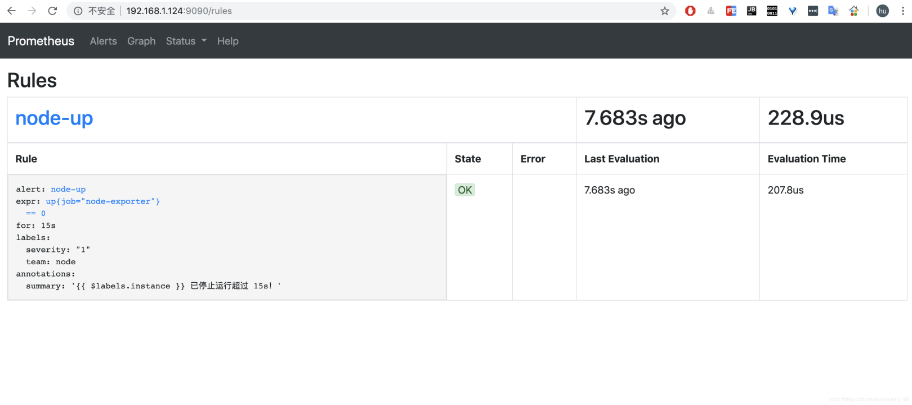

这里说明一下 Prometheus Alert 告警状态有三种状态：`Inactive`、`Pending`、`Firing`。

- **Inactive**：非活动状态，表示正在监控，但是还未有任何警报触发。
- **Pending**：表示这个警报必须被触发。由于警报可以被分组、压抑/抑制或静默/静音，所以等待验证，一旦所有的验证都通过，则将转到 `Firing` 状态。
- **Firing**：将警报发送到 AlertManager，它将按照配置将警报的发送给所有接收者。一旦警报解除，则将状态转到 `Inactive`，如此循环。

### 4.3、触发报警发送 Email

上边我们定义的 rule 规则为监测 `job="node-exporter"` Node 是否活着，那么就可以停掉 `node-exporter` 服务来间接起到 Node Down 的作用，从而达到报警条件，触发报警规则。

```javascript
$ docker stop node-exporter
```

停止服务后，等待 15s 之后可以看到 Prometheus target 里面 `node-exproter` 状态为 `unhealthy` 状态，等待 15s 后，alert 页面由绿色 `node-up (0 active)` `Inactive` 状态变成了黄色 `node-up (1 active)` `Pending` 状态，继续等待 15s 后状态变成红色 `Firing` 状态，向 AlertManager 发送报警信息，此时 AlertManager 则按照配置规则向接受者发送邮件告警。

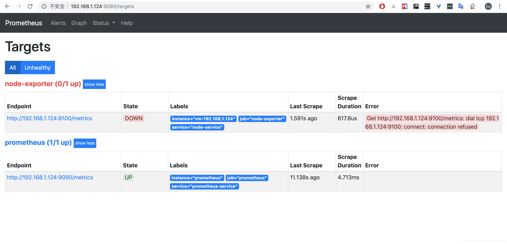

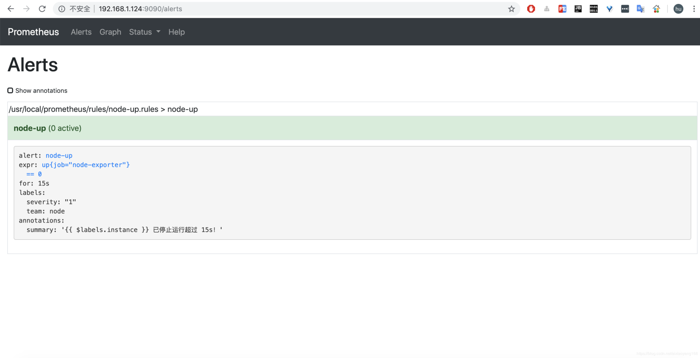

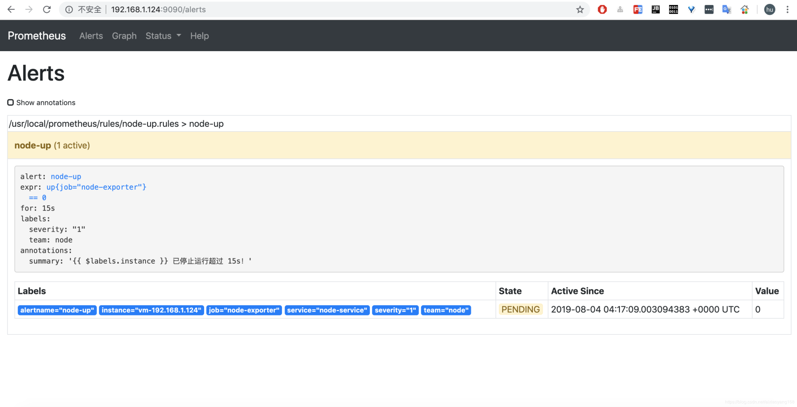

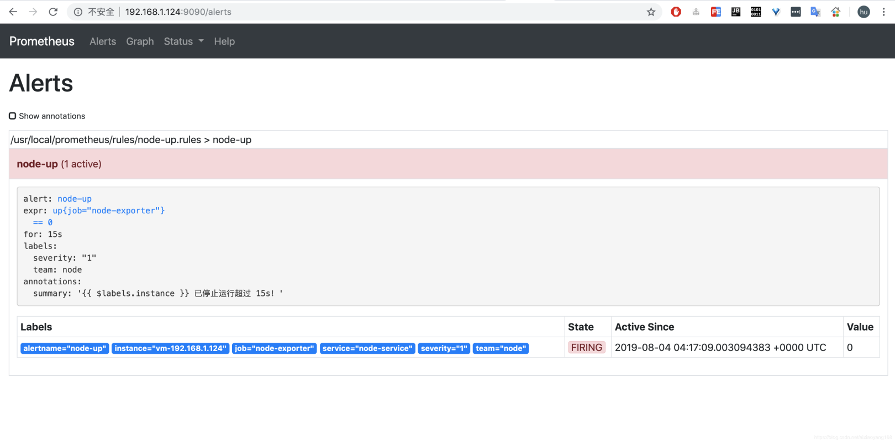

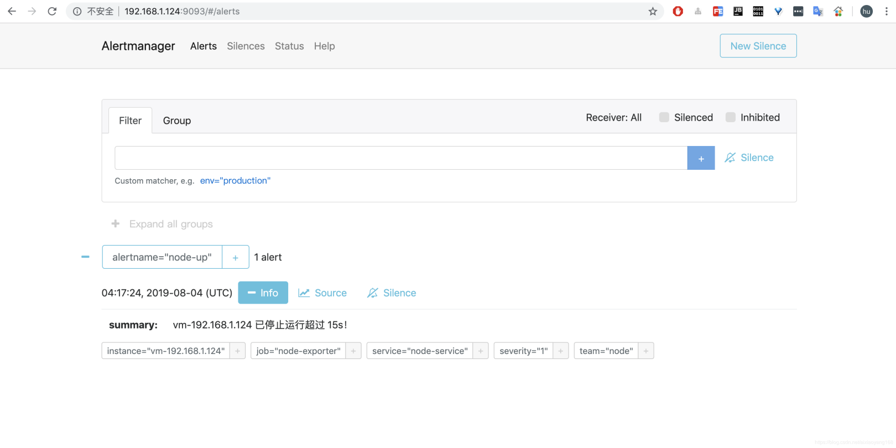

最终发送的默认报警邮件信息如下：

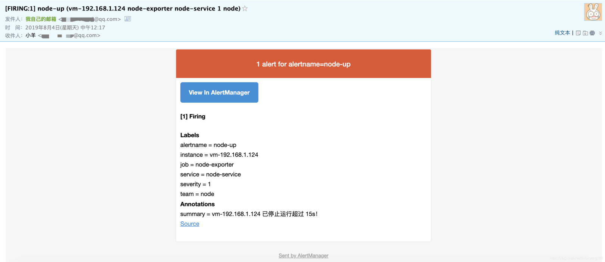

从上图可以看到，默认邮件模板 Title 及 Body 会将之前配置的 Labels 及 Annotations 信息均包含在内，而且每隔 5m 会自动发送，直到服务恢复正常，报警解除为止，同时会发送一封报警解除邮件。接下来，我们启动 `node-exporter` 来恢复服务。

```javascript
$ docker start node-exporter
```

等待 15s 之后，Prometheus Alerts 页面变成绿色 `node-up (0 active)` `Inactive` 状态，同时也收到了报警解除邮件提醒。

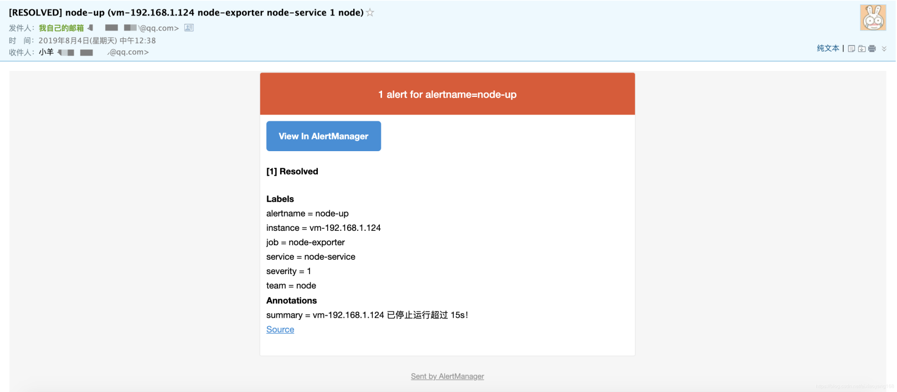

这里有几个地方需要解释一下：

1. 每次停止/恢复服务后，15s 之后才会发现 Alert 状态变化，是因为 `prometheus.yml`中 `global -> scrape_interval: 15s` 配置决定的，如果觉得等待 15s 时间太长，可以修改小一些，可以全局修改，也可以局部修改。例如局部修改 `node-exporter` 等待时间为 5s。 ... - job_name: 'node-exporter' scrape_interval: 5s file_sd_configs: - files: ['/usr/local/prometheus/groups/nodegroups/*.json']
2. Alert 状态变化时会等待 15s 才发生改变，是因为 `node-up.rules` 中配置了 `for: 15s` 状态变化等待时间。
3. 报警触发后，每隔 5m 会自动发送报警邮件(服务未恢复正常期间)，是因为 `alertmanager.yml` 中 `route -> repeat_interval: 5m` 配置决定的。

### 4.4、AlertManager 配置自定义邮件模板

看到上边默认发送的邮件模板，虽然所有核心的信息已经包含了，但是邮件格式内容可以更优雅直观一些，那么，AlertManager 也是支持自定义邮件模板配置的，首先新建一个模板文件 `email.tmpl`。

```javascript
$ mkdir -p /root/prometheus/alertmanager-tmpl && cd /root/prometheus/alertmanager-tmpl
$ vim email.tmpl
{{ define "email.from" }}xxxxxxxx@qq.com{{ end }}
{{ define "email.to" }}xxxxxxxx@qq.com{{ end }}
{{ define "email.to.html" }}
{{ range .Alerts }}
=========start==========<br>
告警程序: prometheus_alert <br>
告警级别: {{ .Labels.severity }} 级 <br>
告警类型: {{ .Labels.alertname }} <br>
故障主机: {{ .Labels.instance }} <br>
告警主题: {{ .Annotations.summary }} <br>
告警详情: {{ .Annotations.description }} <br>
触发时间: {{ .StartsAt.Format "2019-08-04 16:58:15" }} <br>
=========end==========<br>
{{ end }}
{{ end }}
```

简单说明一下，上边模板文件配置了 `email.from`、`email.to`、`email.to.html` 三种模板变量，可以在 `alertmanager.yml` 文件中直接配置引用。这里 `email.to.html` 就是要发送的邮件内容，支持 Html 和 Text 格式，这里为了显示好看，采用 Html 格式简单显示信息。下边 `{{ range .Alerts }}` 是个循环语法，用于循环获取匹配的 Alerts 的信息，下边的告警信息跟上边默认邮件显示信息一样，只是提取了部分核心值来展示。然后，需要增加 `alertmanager.yml` 文件 templates 配置如下：

```javascript
global:
  resolve_timeout: 5m
  smtp_from: '{{ template "email.from" . }}'
  smtp_smarthost: 'smtp.qq.com:465'
  smtp_auth_username: '{{ template "email.from" . }}'
  smtp_auth_password: 'xxxxxxxxxxxxxxx'
  smtp_require_tls: false
  smtp_hello: 'qq.com'
templates:
  - '/etc/alertmanager-tmpl/email.tmpl'
route:
  group_by: ['alertname']
  group_wait: 5s
  group_interval: 5s
  repeat_interval: 5m
  receiver: 'email'
receivers:
- name: 'email'
  email_configs:
  - to: '{{ template "email.to" . }}'
    html: '{{ template "email.to.html" . }}'
    send_resolved: true
inhibit_rules:
  - source_match:
      severity: 'critical'
    target_match:
      severity: 'warning'
    equal: ['alertname', 'dev', 'instance']
```

然后，修改 AlertManager 启动命令，将本地 `email.tmpl` 文件挂载到容器内指定位置并重启。

```javascript
$ docker run -d
    --name alertmanager
    -p 9093:9093 
    -v /root/prometheus/alertmanager.yml:/etc/alertmanager/alertmanager.yml
    -v /root/prometheus/alertmanager-tmpl/:/etc/alertmanager-tmpl/
    prom/alertmanager:latest
```

上边模板中由于配置了 `{{ .Annotations.description }}` 变量，而之前 `node-up.rules` 中并没有配置该变量，会导致获取不到值，所以这里我们修改一下 `node-up.rules` 并重启 Promethues 服务。

```javascript
$ vim /root/prometheus/rules/node-up.rules
groups:
- name: node-up
  rules:
  - alert: node-up
    expr: up{job="node-exporter"} == 0
    for: 15s
    labels:
      severity: 1
      team: node
    annotations:
      summary: "{{ $labels.instance }} 已停止运行!"
      description: "{{ $labels.instance }} 检测到异常停止！请重点关注！！！"
```

重启完毕后，同样模拟触发报警条件（停止 `node-exporter` 服务），也是可以正常发送模板邮件出来的，这次就是我们想要的风格啦！

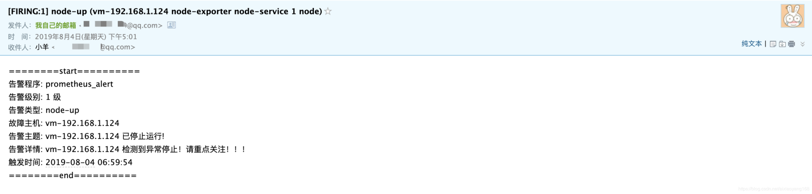

当然我们还可以配置邮件标题，这里就不在演示了，详细配置可参考 [这里](https://prometheus.io/docs/alerting/configuration/#email_config)。这里除了监控节点是否存活外，还可以监控很多很多指标，例如 CPU 负载告警、Mem 使用量告警、Disk 存储空间告警、Network 负载告警等等，这些都可以通过自定义 PromQL 表达式验证值来定义一些列的告警规则，来丰富日常工作中需要的各种告警。 这里，我们只演示了如何通过 AlertManager 来配置发送邮件告警，其他的告警方式，可以参考 [官网文档](https://prometheus.io/docs/alerting/configuration/) 来配置，这里就不再演示了。下一篇，我们继续通过 Prometheus 来监控 SpringBoot 工程应用程序 JVM 情况，以及自定义 metrics 来实现特定功能的监控。

**参考资料**

- [prometheus docs](https://prometheus.io/docs/)
- [prometheus configuration](https://prometheus.io/docs/prometheus/latest/configuration/configuration/)
- [alertting configuration](https://prometheus.io/docs/alerting/configuration/)


分类: [Prometheus](https://www.cnblogs.com/hahaha111122222/category/1785170.html)

[好文要顶](javascript:void(0);) [关注我](javascript:void(0);) [收藏该文](javascript:void(0);) [微信分享](javascript:void(0);)


[哈喽哈喽111111](https://home.cnblogs.com/u/hahaha111122222/)
[粉丝 - 19](https://home.cnblogs.com/u/hahaha111122222/followers/) [关注 - 0](https://home.cnblogs.com/u/hahaha111122222/followees/)


[+加关注](javascript:void(0);)

0

0


[升级成为会员](https://cnblogs.vip/)


[« ](https://www.cnblogs.com/hahaha111122222/p/13723811.html)上一篇： [Elasticsearch：使用 IP 过滤器限制连接](https://www.cnblogs.com/hahaha111122222/p/13723811.html)
[» ](https://www.cnblogs.com/hahaha111122222/p/13724172.html)下一篇： [AlertManager 之微信告警模板，UTC时间错8个小时的解决办法](https://www.cnblogs.com/hahaha111122222/p/13724172.html)