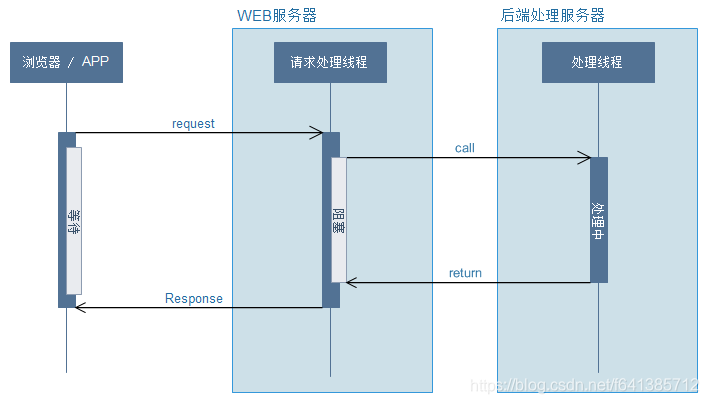
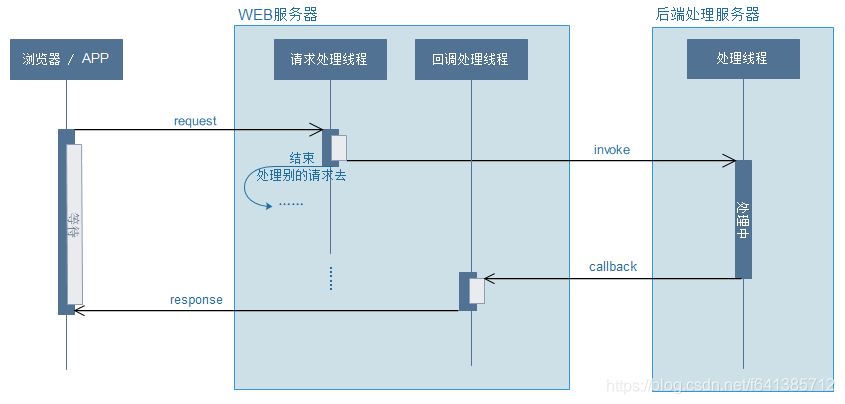
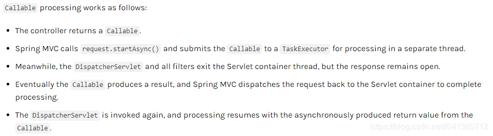
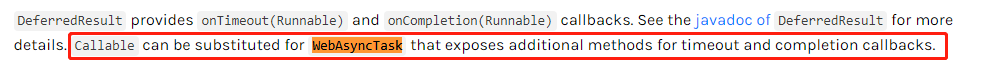
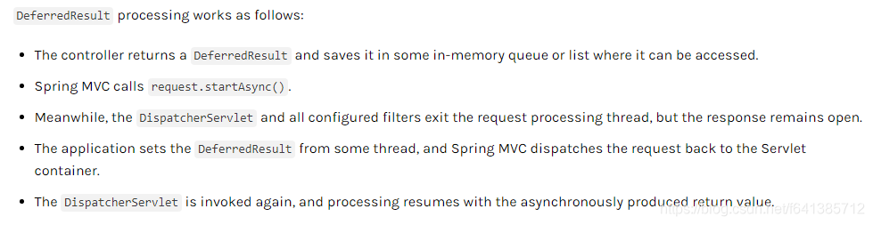

# 【小家Spring】高性能关键技术之---体验Spring MVC的异步模式（Callable、WebAsyncTask、DeferredResult） 基础使用篇


YourBatman


于 2019-03-20 21:38:13 发布


阅读量5.3k

 收藏 31

点赞数 9

分类专栏： [# 享学Spring MVC](https://blog.csdn.net/f641385712/category_7941357.html) 文章标签： [Spring MVC的异步模式](https://so.csdn.net/so/search/s.do?q=Spring+MVC的异步模式&t=all&o=vip&s=&l=&f=&viparticle=&from_tracking_code=tag_word&from_code=app_blog_art) [DeferredResult](https://so.csdn.net/so/search/s.do?q=DeferredResult&t=all&o=vip&s=&l=&f=&viparticle=&from_tracking_code=tag_word&from_code=app_blog_art) [WebAsyncTask](https://so.csdn.net/so/search/s.do?q=WebAsyncTask&t=all&o=vip&s=&l=&f=&viparticle=&from_tracking_code=tag_word&from_code=app_blog_art) [Callable](https://so.csdn.net/so/search/s.do?q=Callable&t=all&o=vip&s=&l=&f=&viparticle=&from_tracking_code=tag_word&from_code=app_blog_art) [Spring5响应式编程](https://so.csdn.net/so/search/s.do?q=Spring5响应式编程&t=all&o=vip&s=&l=&f=&viparticle=&from_tracking_code=tag_word&from_code=app_blog_art)

版权

[享学Spring MVC专栏收录该内容](https://blog.csdn.net/f641385712/category_7941357.html)

142 篇文章571 订阅

订阅专栏

##### 每篇一句

> 人与人，任何是凭实力的，和平是打出来的

##### 相关阅读

[【小家Spring】高性能关键技术之—体验Spring MVC的异步模式（Callable、WebAsyncTask、DeferredResult） 基础使用篇](https://blog.csdn.net/f641385712/article/details/88692534)
[【小家Spring】高性能关键技术之—体验Spring MVC的异步模式（DeferredResult、ResponseBodyEmitter、SseEmitter） 高级使用篇](https://blog.csdn.net/f641385712/article/details/88710676)

[【小家Spring】控制Spring IoC容器对Bean（含@Configuration配置类）的加载顺序（@DependsOn注解的使用）](https://blog.csdn.net/f641385712/article/details/88715380)
[【小家java】java8新特性（简述十大新特性） 饱受赞誉](https://blog.csdn.net/f641385712/article/details/81286231)

##### 前言

现在已经在2019年，这个时候再来谈`Spring MVC`的异步模式，好像有点老掉牙了。毕竟现在都Spring5的时代了，甚至将来肯定是`webflux`的天下了。

而`Spring MVC`的异步请求模式是`Spring3.2`就推出了，它是基于基`Servlet3.0`规范实现的，而此规范是2011年推出的，距现在已经有近10的历史了，可谓是非常非常成熟的一种技术规范了。

但是震惊的是，我前端时间一连问了公司的3位同事（工作5年以上），对Spring MVC的异步模式三缄其口，说不出个所以然，更有连`Servlet3.0`规范都没听过，有什么新特性都没有了解的。着实让我大吃了一惊~

> 需要说明的一点：我问的这几位同事，做业务方便绝对是杠杠的没问题的，也有很长的Spring MVC使用经验

我想了一下出现这现象的原因：
1、`Spring MVC`足够优秀，封装得我们现在处理业务请求只需要面向`JavaBean`去编程即可，没必要再去了解[Servlet](https://so.csdn.net/so/search?q=Servlet&spm=1001.2101.3001.7020)底层的细节
2、`Servlet`源生的API在`Spring MVC`的环境下，使用场景已经非常的少了。甚至给我们一种错觉：servlet技术已经淡化了大众的视野，是不是都不更新了呢？（显然不是的嘛~毕竟4.0的规范都快出来了）
3、`Spring MVC`的异步模式多多少少都会增加使用的复杂度，从而增加犯错的概率。而它的同步模式可以说是能够满足现在绝大部分的使用场景（大不了觉得性能不够了，就加机器嘛，很少会从代码的本身去考虑和优化性能），所以确实没使用过也是在清理之中的~

###### Spring 5

这里小插曲不得不简单说一下Spring5。2016 年7月28日重磅发布Spring5.0版本。
Spring Framework 5.0的**最大特点之一是响应式编程（Reactive Programming）。**它使用了如下规范：

- Servlet 3.1
- JMS 2.0
- JPA 2.1
- JAX-RS 2.0
- Bean Validation 1.1

这里必须再提一次它最重要的新特性：**响应式编程（Reactive Programming）**。为了将下来更好的去学习和深入理解响应式编程的核心内容，我觉得先铺垫此篇文章的讲解尤为重要。

> Spring5.0以后，它对servlet不再强依赖，而是变为了可选依赖。另外一个选择还可以是：Reactive编程

##### Spring MVC的同步模式

要知道什么是异步模式，就先要知道什么是同步模式。

浏览器发起请求，Web服务器开一个线程处理（`请求处理线程`），处理完把处理结果返回浏览器。**这就是同步模式。**，绝大多数Web服务器都如此般处理。这里面有几个关键的点：简单示例图如下


> 此处需要明晰一个概念：比如tomcat，它既是一个web服务器，同时它也是个servlet后端容器（调ava后端服务），所以要区分清楚这两个概念。请求处理线程是有限的，宝贵的资源~（注意它和处理线程的区别）

1. 请求发起者发起一个request，然后会一直等待一个response，这期间它是阻塞的
2. 请求处理线程会在Call了之后等待Return，`自身处于阻塞状态`（这个很关键）
3. 然后都等待return，知道处理线程全部完事后返回了，然后把response反给调用者就算全部结束了

###### 问题在哪里？

绝大部分情况下，这样是没有问题的。因为
第一：高并发、高流量的场景放眼中国的公司，占比也是非常少的。
第二：`长时间处理服务`这种情况也是少之又少的

所以两者结合起来，场景就更加稀少了。相信这就是为什么好多做开发N年了的，却还不知道Servlet和Spring MVC的异步模式的原因吧。

**正所谓，别人不懂的地方，咱们才有机会嘛。因此好好学习本文的内容，能让你升值哦~**

**Tomcat等应用服务器的连接线程池实际上是有限制的；每一个连接请求都会耗掉线程池的一个连接数；如果某些耗时很长的操作，如对大量数据的查询操作、调用外部系统提供的服务以及一些IO密集型操作等，会占用连接很长时间，这个时候这个连接就无法被释放而被其它请求重用。如果连接占用过多，服务器就很可能无法及时响应每个请求；极端情况下如果将线程池中的所有连接耗尽，服务器将长时间无法向外提供服务！**

##### Spring MVC异步模式Demo Show

Spring MVC3.2之后支持异步请求，能够在controller中返回一个`Callable`或者`DeferredResult`。由于Spring MVC的良好封装，异步功能使用起来出奇的简单。

###### `Callable`案例：

```java
	@Controller
	@RequestMapping("/async/controller")
	public class AsyncHelloController {
	
	    @ResponseBody
	    @GetMapping("/hello")
	    public Callable<String> helloGet() throws Exception {
	        System.out.println(Thread.currentThread().getName() + " 主线程start");
	
	        Callable<String> callable = () -> {
	            System.out.println(Thread.currentThread().getName() + " 子子子线程start");
	            TimeUnit.SECONDS.sleep(5); //模拟处理业务逻辑，话费了5秒钟
	            System.out.println(Thread.currentThread().getName() + " 子子子线程end");
			
				// 这里稍微小细节一下：最终返回的不是Callable对象，而是它里面的内容
	            return "hello world";
	        };
	
	        System.out.println(Thread.currentThread().getName() + " 主线程end");
	        return callable;
	    }
	}

12345678910111213141516171819202122
```

输出：

```java
http-apr-8080-exec-3 主线程start
http-apr-8080-exec-3 主线程end
MvcAsync1 子子子线程start
MvcAsync1 子子子线程end
1234
```

先明细两个概念：

1. 请求处理线程：处理线程 属于 web 服务器线程，负责 处理用户请求，采用 线程池 管理。
2. 异步线程：异步线程 属于 用户自定义的线程，可采用 线程池管理。

前端页面等待5秒出现结果。

> 注意：异步模式对前端来说，是无感知的，这是后端的一种技术。所以这个和我们自己开启一个线程处理，立马返回给前端是有非常大的不同的，需要注意~

由此我们可以看出，主线程早早就结束了（需要注意，**此时还并没有把response返回的，此处一定要注意**），真正干事的是子线程（交给`TaskExecutor`去处理的，后续分析过程中可以看到），它的大致的一个处理流程图可以如下：

这里能够很直接的看出：我们很大程度上提高了我们`请求处理线程`的利用率，从而肯定就提高了我们系统的吞吐量。

###### 异步模式处理步骤概述如下：

1. 当Controller返回值是Callable的时候
2. Spring就会将Callable交给TaskExecutor去处理（一个隔离的线程池）
3. 与此同时将`DispatcherServlet`里的拦截器、Filter等等都马上退出主线程，**但是response仍然保持打开的状态**
4. Callable线程处理完成后，Spring MVC讲请求重新派发给容器**（注意这里的重新派发，和后面讲的拦截器密切相关）**
5. 根据Callabel返回结果，继续处理（比如参数绑定、视图解析等等就和之前一样了）~~~~

**Spring官方解释如下截图：**


###### `WebAsyncTask`案例：

官方有这么一句话，截图给你：

如果我们需要超时处理的回调或者错误处理的回调，我们可以使用`WebAsyncTask`代替Callable

> 实际使用中，我并不建议直接使用Callable ，而是使用Spring提供的`WebAsyncTask` 代替，它包装了Callable，功能更强大些

```java
@Controller
@RequestMapping("/async/controller")
public class AsyncHelloController {

    @ResponseBody
    @GetMapping("/hello")
    public WebAsyncTask<String> helloGet() throws Exception {
        System.out.println(Thread.currentThread().getName() + " 主线程start");

        Callable<String> callable = () -> {
            System.out.println(Thread.currentThread().getName() + " 子子子线程start");
            TimeUnit.SECONDS.sleep(5); //模拟处理业务逻辑，话费了5秒钟
            System.out.println(Thread.currentThread().getName() + " 子子子线程end");

            return "hello world";
        };

        // 采用WebAsyncTask 返回 这样可以处理超时和错误 同时也可以指定使用的Excutor名称
        WebAsyncTask<String> webAsyncTask = new WebAsyncTask<>(3000, callable);
        // 注意：onCompletion表示完成，不管你是否超时、是否抛出异常，这个函数都会执行的
        webAsyncTask.onCompletion(() -> System.out.println("程序[正常执行]完成的回调"));

        // 这两个返回的内容，最终都会放进response里面去===========
        webAsyncTask.onTimeout(() -> "程序[超时]的回调");
        // 备注：这个是Spring5新增的
        webAsyncTask.onError(() -> "程序[出现异常]的回调");


        System.out.println(Thread.currentThread().getName() + " 主线程end");
        return webAsyncTask;
    }
}

1234567891011121314151617181920212223242526272829303132
```

如上，由于我们设置了超时时间为3000ms，而业务处理是5s，所以会执行`onTimeout`这个回调函数。因此页面是会显示“程序[超时]的回调”这几个字。其执行的过程同Callback。

下面我们简单看看`WebAsyncTask`的源码，非常简单，就是个包装：

```java
public class WebAsyncTask<V> implements BeanFactoryAware {
	
	// 正常执行的函数（通过WebAsyncTask的构造函数可以传进来）
	private final Callable<V> callable;
	// 处理超时时间（ms），可通过构造函数指定，也可以不指定（不会有超时处理）
	private Long timeout;
	// 执行任务的执行器。可以构造函数设置进来，手动指定。
	private AsyncTaskExecutor executor;
	// 若设置了，会根据此名称去IoC容器里找这个Bean （和上面二选一）  
	// 若传了executorName,请务必调用set方法设置beanFactory
	private String executorName;
	private BeanFactory beanFactory;

	// 超时的回调
	private Callable<V> timeoutCallback;
	// 发生错误的回调
	private Callable<V> errorCallback;
	// 完成的回调（不管超时还是错误都会执行）
	private Runnable completionCallback;

	...
	
	// 这是获取执行器的逻辑
	@Nullable
	public AsyncTaskExecutor getExecutor() {
		if (this.executor != null) {
			return this.executor;
		} else if (this.executorName != null) {
			Assert.state(this.beanFactory != null, "BeanFactory is required to look up an executor bean by name");
			return this.beanFactory.getBean(this.executorName, AsyncTaskExecutor.class);
		} else {
			return null;
		}
	}


	public void onTimeout(Callable<V> callback) {
		this.timeoutCallback = callback;
	}
	public void onError(Callable<V> callback) {
		this.errorCallback = callback;
	}
	public void onCompletion(Runnable callback) {
		this.completionCallback = callback;
	}

	// 最终执行超时回调、错误回调、完成回调都是通过这个拦截器实现的
	CallableProcessingInterceptor getInterceptor() {
		return new CallableProcessingInterceptor() {
			@Override
			public <T> Object handleTimeout(NativeWebRequest request, Callable<T> task) throws Exception {
				return (timeoutCallback != null ? timeoutCallback.call() : CallableProcessingInterceptor.RESULT_NONE);
			}
			@Override
			public <T> Object handleError(NativeWebRequest request, Callable<T> task, Throwable t) throws Exception {
				return (errorCallback != null ? errorCallback.call() : CallableProcessingInterceptor.RESULT_NONE);
			}
			@Override
			public <T> void afterCompletion(NativeWebRequest request, Callable<T> task) throws Exception {
				if (completionCallback != null) {
					completionCallback.run();
				}
			}
		};
	}

}

12345678910111213141516171819202122232425262728293031323334353637383940414243444546474849505152535455565758596061626364656667
```

> WebAsyncTask 的异步编程 API。相比于 @[Async](https://so.csdn.net/so/search?q=Async&spm=1001.2101.3001.7020) 注解，WebAsyncTask 提供更加健全的 超时处理 和 异常处理 支持。但是@Async也有更优秀的地方，就是他不仅仅能用于controller中~~~~（任意地方）

###### `DeferredResult`案例：

`DeferredResult`使用方式与Callable类似，但在返回结果上不一样，**它返回的时候实际结果可能没有生成**，实际的结果可能会在**另外的线程**里面设置到`DeferredResult`中去。

这个特性非常非常的重要，对后面实现复杂的功能（**比如服务端推技术、订单过期时间处理、长轮询、模拟MQ的功能等等高级应用**）

官方给的Demo如下：

自己写个非常粗糙的Demo：

```java
@Controller
@RequestMapping("/async/controller")
public class AsyncHelloController {

    private List<DeferredResult<String>> deferredResultList = new ArrayList<>();

    @ResponseBody
    @GetMapping("/hello")
    public DeferredResult<String> helloGet() throws Exception {
        DeferredResult<String> deferredResult = new DeferredResult<>();

        //先存起来，等待触发
        deferredResultList.add(deferredResult);
        return deferredResult;
    }

    @ResponseBody
    @GetMapping("/setHelloToAll")
    public void helloSet() throws Exception {
        // 让所有hold住的请求给与响应
        deferredResultList.forEach(d -> d.setResult("say hello to all"));
    }
}

1234567891011121314151617181920212223
```

我们第一个请求`/hello`，会先`deferredResult`存起来，然后前端页面是一直等待（转圈状态）的。知道我发第二个请求：`setHelloToAll`，所有的相关页面才会有响应~~

###### 执行过程

官方：



1. controller 返回一个`DeferredResult`，我们把它保存到内存里或者List里面（供后续访问）
2. Spring MVC调用`request.startAsync()`，开启异步处理
3. 与此同时将`DispatcherServlet`里的拦截器、Filter等等都马上退出主线程，**但是response仍然保持打开的状态**
4. 应用通过另外一个线程（可能是MQ消息、定时任务等）给`DeferredResult` set值。然后`Spring MVC`会把这个请求再次派发给servlet容器
5. `DispatcherServlet`再次被调用，然后处理后续的标准流程

简单看看源码：

```java
public class DeferredResult<T> {

	private static final Object RESULT_NONE = new Object()

	
	// 超时时间（ms） 可以不配置
	@Nullable
	private final Long timeout;
	// 相当于超时的话的，传给回调函数的值
	private final Object timeoutResult;

	// 这三种回调也都是支持的
	private Runnable timeoutCallback;
	private Consumer<Throwable> errorCallback;
	private Runnable completionCallback;


	// 这个比较强大，就是能把我们结果再交给这个自定义的函数处理了 他是个@FunctionalInterface
	private DeferredResultHandler resultHandler;

	private volatile Object result = RESULT_NONE;
	private volatile boolean expired = false;


	// 判断这个DeferredResult是否已经被set过了（被set过的对象，就可以移除了嘛）
	// 如果expired表示已经过期了你还没set，也是返回false的
	// Spring4.0之后提供的
	public final boolean isSetOrExpired() {
		return (this.result != RESULT_NONE || this.expired);
	}

	// 没有isSetOrExpired 强大，建议使用上面那个
	public boolean hasResult() {
		return (this.result != RESULT_NONE);
	}

	// 还可以获得set进去的结果
	@Nullable
	public Object getResult() {
		Object resultToCheck = this.result;
		return (resultToCheck != RESULT_NONE ? resultToCheck : null);
	}


	public void onTimeout(Runnable callback) {
		this.timeoutCallback = callback;
	}
	public void onError(Consumer<Throwable> callback) {
		this.errorCallback = callback;
	}
	public void onCompletion(Runnable callback) {
		this.completionCallback = callback;
	}

	
	// 如果你的result还需要处理，可以这是一个resultHandler，会对你设置进去的结果进行处理
	public final void setResultHandler(DeferredResultHandler resultHandler) {
		Assert.notNull(resultHandler, "DeferredResultHandler is required");
		// Immediate expiration check outside of the result lock
		if (this.expired) {
			return;
		}
		Object resultToHandle;
		synchronized (this) {
			// Got the lock in the meantime: double-check expiration status
			if (this.expired) {
				return;
			}
			resultToHandle = this.result;
			if (resultToHandle == RESULT_NONE) {
				// No result yet: store handler for processing once it comes in
				this.resultHandler = resultHandler;
				return;
			}
		}
		try {
			resultHandler.handleResult(resultToHandle);
		} catch (Throwable ex) {
			logger.debug("Failed to handle existing result", ex);
		}
	}

	// 我们发现，这里调用是private方法setResultInternal，我们设置进来的结果result，会经过它的处理
	// 而它的处理逻辑也很简单，如果我们提供了resultHandler，它会把这个值进一步的交给我们的resultHandler处理
	// 若我们没有提供此resultHandler，那就保存下这个result即可
	public boolean setResult(T result) {
		return setResultInternal(result);
	}

	private boolean setResultInternal(Object result) {
		// Immediate expiration check outside of the result lock
		if (isSetOrExpired()) {
			return false;
		}
		DeferredResultHandler resultHandlerToUse;
		synchronized (this) {
			// Got the lock in the meantime: double-check expiration status
			if (isSetOrExpired()) {
				return false;
			}
			// At this point, we got a new result to process
			this.result = result;
			resultHandlerToUse = this.resultHandler;
			if (resultHandlerToUse == null) {
				this.resultHandler = null;
			}
		}
		resultHandlerToUse.handleResult(result);
		return true;
	}

	// 发生错误了，也可以设置一个值。这个result会被记下来，当作result
	// 注意这个和setResult的唯一区别，这里入参是Object类型，而setResult只能set规定的指定类型
	// 定义成Obj是有原因的：因为我们一般会把Exception等异常对象放进来。。。
	public boolean setErrorResult(Object result) {
		return setResultInternal(result);
	}

	// 拦截器 注意最终finally里面，都可能会调用我们的自己的处理器resultHandler(若存在的话)
	// afterCompletion不会调用resultHandler~~~~~~~~~~~~~
	final DeferredResultProcessingInterceptor getInterceptor() {
		return new DeferredResultProcessingInterceptor() {
			@Override
			public <S> boolean handleTimeout(NativeWebRequest request, DeferredResult<S> deferredResult) {
				boolean continueProcessing = true;
				try {
					if (timeoutCallback != null) {
						timeoutCallback.run();
					}
				} finally {
					if (timeoutResult != RESULT_NONE) {
						continueProcessing = false;
						try {
							setResultInternal(timeoutResult);
						} catch (Throwable ex) {
							logger.debug("Failed to handle timeout result", ex);
						}
					}
				}
				return continueProcessing;
			}
			@Override
			public <S> boolean handleError(NativeWebRequest request, DeferredResult<S> deferredResult, Throwable t) {
				try {
					if (errorCallback != null) {
						errorCallback.accept(t);
					}
				} finally {
					try {
						setResultInternal(t);
					} catch (Throwable ex) {
						logger.debug("Failed to handle error result", ex);
					}
				}
				return false;
			}
			@Override
			public <S> void afterCompletion(NativeWebRequest request, DeferredResult<S> deferredResult) {
				expired = true;
				if (completionCallback != null) {
					completionCallback.run();
				}
			}
		};
	}

	// 内部函数式接口 DeferredResultHandler
	@FunctionalInterface
	public interface DeferredResultHandler {
		void handleResult(Object result);
	}

}

123456789101112131415161718192021222324252627282930313233343536373839404142434445464748495051525354555657585960616263646566676869707172737475767778798081828384858687888990919293949596979899100101102103104105106107108109110111112113114115116117118119120121122123124125126127128129130131132133134135136137138139140141142143144145146147148149150151152153154155156157158159160161162163164165166167168169170171172173
```

`DeferredResult`的超时处理，采用委托机制，也就是在实例`DeferredResult`时给予一个超时时长（毫秒），同时在`onTimeout`中委托（传入）一个新的处理线程（**我们可以认为是超时线程**）；当超时时间到来，`DeferredResult`启动超时线程，超时线程处理业务，封装返回数据，给`DeferredResult`赋值（正确返回的或错误返回的）

##### Spring MVC异步模式中使用Filter和HandlerInterceptor

看到上面的异步访问，不免我们会新生怀疑，若是普通的拦截器`HandlerInterceptor`，还生效吗？若生效，效果是怎么样的，现在我们直接看一下吧：（备注：我以上面`Callable`的Demo为示例）

###### Filter

```java
// 注意，这里必须开启异步支持asyncSupported = true，否则报错：Async support must be enabled on a servlet and for all filters involved in async request processing
@WebFilter(urlPatterns = "/*", asyncSupported = true)
public class HelloFilter extends OncePerRequestFilter {

    @Override
    protected void initFilterBean() throws ServletException {
        System.out.println("Filter初始化...");
    }

    @Override
    protected void doFilterInternal(HttpServletRequest request, HttpServletResponse response, FilterChain filterChain) throws ServletException, IOException {
        System.out.println(Thread.currentThread().getName() + "--->" + request.getRequestURI());
        filterChain.doFilter(request, response);
    }

}

12345678910111213141516
```

输出：

```java
http-apr-8080-exec-3--->/demowar_war/async/controller/hello
http-apr-8080-exec-3 主线程start
http-apr-8080-exec-3 主线程end
MvcAsync1 子子子线程start
MvcAsync1 子子子线程end
12345
```

由此可以看出，异步上下文，Filter还是只会被执行一次拦截的，符合我们的预期，所以没什么毛病。

###### HandlerInterceptor

```java
public class HelloInterceptor implements HandlerInterceptor {

    @Override
    public boolean preHandle(HttpServletRequest request, HttpServletResponse response, Object handler) throws Exception {
        System.out.println(Thread.currentThread().getName() + "---preHandle-->" + request.getRequestURI());
        return true;
    }

    @Override
    public void postHandle(HttpServletRequest request, HttpServletResponse response, Object handler, ModelAndView modelAndView) throws Exception {
        System.out.println(Thread.currentThread().getName() + "---postHandle-->" + request.getRequestURI());
    }

    @Override
    public void afterCompletion(HttpServletRequest request, HttpServletResponse response, Object handler, Exception ex) throws Exception {
        System.out.println(Thread.currentThread().getName() + "---postHandle-->" + request.getRequestURI());
    }
}

// 注册拦截器
@Configuration
@EnableWebMvc
public class AppConfig implements WebMvcConfigurer {

    @Override
    public void addInterceptors(InterceptorRegistry registry) {
    	// /**拦截所有请求
        registry.addInterceptor(new HelloInterceptor()).addPathPatterns("/**");
    }
}

123456789101112131415161718192021222324252627282930
```

输出：

```java
http-apr-8080-exec-3--->/demowar_war/async/controller/hello
http-apr-8080-exec-3---preHandle-->/demowar_war/async/controller/hello

http-apr-8080-exec-3 主线程start
http-apr-8080-exec-3 主线程end
MvcAsync1 子子子线程start
MvcAsync1 子子子线程end

// 注意  子子子线程处理结束后，再一次触发了preHandle=====
// 此处还要一个细节：这里面的线程既不是子线程，也不是上面的线程  而是新开了一个线程~~~
http-apr-8080-exec-5---preHandle-->/demowar_war/async/controller/hello
http-apr-8080-exec-5---postHandle-->/demowar_war/async/controller/hello
http-apr-8080-exec-5---afterCompletion-->/demowar_war/async/controller/hello
12345678910111213
```

从上面可以看出，如果我们就是普通的Spring MVC的拦截器，preHandler会执行两次，这也符合我们上面分析的处理步骤。**所以我们在书写preHandler的时候，一定要特别的注意，要让preHandler即使执行多次，也不要受到影响（幂等）**

###### 异步拦截器 `AsyncHandlerInterceptor、CallableProcessingInterceptor、DeferredResultProcessingInterceptor`

Spring MVC给提供了异步拦截器，能让我们更深入的参与进去异步request的生命周期里面去。其中最为常用的为：`AsyncHandlerInterceptor`：

```java
public class AsyncHelloInterceptor implements AsyncHandlerInterceptor {

    // 这是Spring3.2提供的方法，专门拦截异步请求的方式
    @Override
    public void afterConcurrentHandlingStarted(HttpServletRequest request, HttpServletResponse response, Object handler) throws Exception {
        System.out.println(Thread.currentThread().getName() + "---afterConcurrentHandlingStarted-->" + request.getRequestURI());
    }

    @Override
    public boolean preHandle(HttpServletRequest request, HttpServletResponse response, Object handler) throws Exception {
        System.out.println(Thread.currentThread().getName() + "---preHandle-->" + request.getRequestURI());
        return true;
    }

    @Override
    public void postHandle(HttpServletRequest request, HttpServletResponse response, Object handler, ModelAndView modelAndView) throws Exception {
        System.out.println(Thread.currentThread().getName() + "---postHandle-->" + request.getRequestURI());
    }

    @Override
    public void afterCompletion(HttpServletRequest request, HttpServletResponse response, Object handler, Exception ex) throws Exception {
        System.out.println(Thread.currentThread().getName() + "---afterCompletion-->" + request.getRequestURI());
    }
}

123456789101112131415161718192021222324
```

输出：

```java
http-apr-8080-exec-3---preHandle-->/demowar_war/async/controller/hello
http-apr-8080-exec-3 主线程start
http-apr-8080-exec-3 主线程end

// 这里发现，它在主线程结束后，子线程开始之前执行的（线程号还是同一个哦~）
http-apr-8080-exec-3---afterConcurrentHandlingStarted-->/demowar_war/async/controller/hello

MvcAsync1 子子子线程start
MvcAsync1 子子子线程end
http-apr-8080-exec-6---preHandle-->/demowar_war/async/controller/hello
http-apr-8080-exec-6---postHandle-->/demowar_war/async/controller/hello
http-apr-8080-exec-6---afterCompletion-->/demowar_war/async/controller/hello
123456789101112
```

`AsyncHandlerInterceptor`提供了一个`afterConcurrentHandlingStarted()`方法, 这个方法会在`Controller`方法异步执行时开始执行, 而`Interceptor的postHandle`方法则是需要等到`Controller`的异步执行完才能执行

**（比如我们用DeferredResult的话，afterConcurrentHandlingStarted是在return的之后执行，而postHandle()是执行.setResult()之后执行）**

> 需要说明的是：如果我们不是异步请求，`afterConcurrentHandlingStarted`是不会执行的。所以我们可以把它当做加强版的`HandlerInterceptor`来用。平时我们若要使用拦截器，建议使用它。（Spring5，JDK8以后，很多的`xxxAdapter`都没啥用了，直接implements接口就成~）

同样可以注册`CallableProcessingInterceptor`或者一个`DeferredResultProcessingInterceptor`用于更深度的集成异步request的生命周期

```java
    @Override
    public void configureAsyncSupport(AsyncSupportConfigurer configurer) {
        // 注册异步的拦截器、默认的超时时间、任务处理器TaskExecutor等等
        //configurer.registerCallableInterceptors();
        //configurer.registerDeferredResultInterceptors();
        //configurer.setDefaultTimeout();
        //configurer.setTaskExecutor();
    }
12345678
```

只是一般来说，我们并不需要注册这种精细的拦截器，绝大多数情况下，使用`AsyncHandlerInterceptor`是够了的。
（Spring MVC的很多默认设置，请参考`WebMvcConfigurationSupport`）

##### 区别使用

我觉得最主要的区别是：`DeferredResult`需要**自己用线程**来处理结果`setResult`，而`Callable`的话不需要我们来维护一个结果处理线程。
总体来说，`Callable`的话更为简单，同样的也是因为简单，灵活性不够；
相对地，`DeferredResult`更为复杂一些，**但是又极大的灵活性**，所以能实现非常多个性化的、复杂的功能，可以设计高级应用。

**有些较常见的场景， Callable也并不能解决，比如说：我们访问A接口，A接口调用三方的服务，服务回调（注意此处指的回调，不是返回值）B接口，这种情况就没办法使用Callable了，这个时候可以使用DeferredResult**

使用原则：基本上在可以用`Callable`的时候，直接用`Callable`；而遇到`Callable`没法解决的场景的时候，可以尝试使用`DeferredResult`。

> 这里所指的`Callable`包括`WebAsyncTask`

##### 总结

在Reactive编程模型越来越流行的今天，多一点对异步编程模型（Spring MVC异步模式）的了解，可以更容易去接触Spring5带来的新特性—响应式编程。
同时，异步编程是我们高效利用系统资源，提高系统吞吐量，编写高性能应用的必备技能。希望此篇文章能帮助到大家，运用到工作中~

然后，关于`DeferredResult`的高级使用场景，见下一篇博文：高级应用和源码分析篇