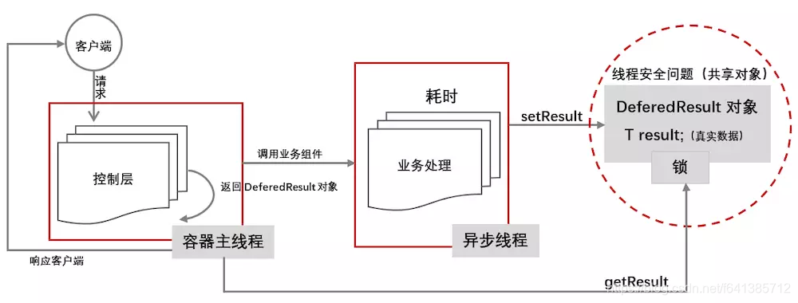
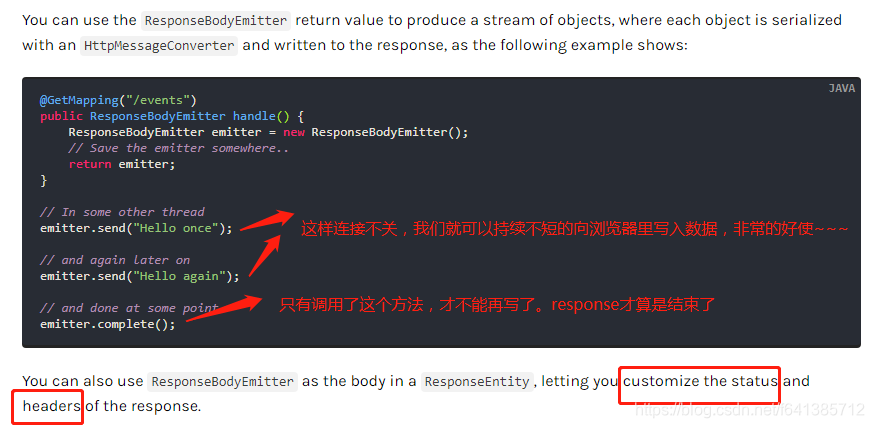
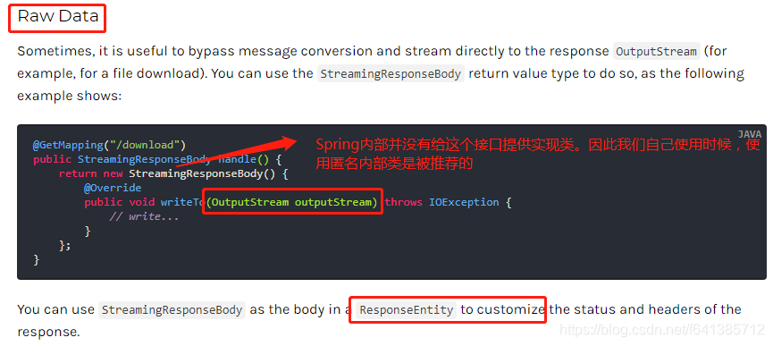

# 【小家Spring】高性能关键技术之---体验Spring MVC的异步模式（ResponseBodyEmitter、SseEmitter、StreamingResponseBody） 高级使用篇


YourBatman


于 2019-03-23 10:23:54 发布


阅读量6.8k

 收藏 20

点赞数 3

分类专栏： [# 享学Spring MVC](https://blog.csdn.net/f641385712/category_7941357.html) 文章标签： [StreamingResponseBody](https://so.csdn.net/so/search/s.do?q=StreamingResponseBody&t=all&o=vip&s=&l=&f=&viparticle=&from_tracking_code=tag_word&from_code=app_blog_art) [ResponseBodyEmitter](https://so.csdn.net/so/search/s.do?q=ResponseBodyEmitter&t=all&o=vip&s=&l=&f=&viparticle=&from_tracking_code=tag_word&from_code=app_blog_art) [SseEmitter](https://so.csdn.net/so/search/s.do?q=SseEmitter&t=all&o=vip&s=&l=&f=&viparticle=&from_tracking_code=tag_word&from_code=app_blog_art) [ResponseBodyEmitterReturnValueHandl](https://so.csdn.net/so/search/s.do?q=ResponseBodyEmitterReturnValueHandl&t=all&o=vip&s=&l=&f=&viparticle=&from_tracking_code=tag_word&from_code=app_blog_art) [DeferredResult](https://so.csdn.net/so/search/s.do?q=DeferredResult&t=all&o=vip&s=&l=&f=&viparticle=&from_tracking_code=tag_word&from_code=app_blog_art)

版权

[享学Spring MVC专栏收录该内容](https://blog.csdn.net/f641385712/category_7941357.html)

142 篇文章571 订阅

订阅专栏

##### 每篇一句

> 等号是什么意思？等号的另外一层意思是：某些东西不重要

##### 相关阅读

[【小家Spring】高性能关键技术之—体验Spring MVC的异步模式（Callable、WebAsyncTask、DeferredResult） 基础使用篇](https://blog.csdn.net/f641385712/article/details/88692534)
[【小家Spring】高性能关键技术之—体验Spring MVC的异步模式（DeferredResult、ResponseBodyEmitter、SseEmitter） 高级使用篇](https://blog.csdn.net/f641385712/article/details/88710676)

[【小家Spring】控制Spring IoC容器对Bean（含@Configuration配置类）的加载顺序（@DependsOn注解的使用）](https://blog.csdn.net/f641385712/article/details/88715380)
[【小家java】java8新特性（简述十大新特性） 饱受赞誉](https://blog.csdn.net/f641385712/article/details/81286231)

##### 前言

上篇博文：[【小家Spring】高性能关键技术之—体验Spring MVC的异步模式（Callable、WebAsyncTask、DeferredResult） 基础使用篇](https://blog.csdn.net/f641385712/article/details/88692534)
介绍了Spring MVC异步模式的基本使用，相信小伙伴们基本的使用都能运用自如了。

那么本篇文章主要介绍一下异步模式的高级使用（`ResponseBodyEmitter、SseEmitter、StreamingResponseBody`）

### `DeferredResult`高级使用

上篇博文介绍的它的基本使用，那么本文主要结合一些特殊的使用场景，来介绍下它的高级使用，让能更深刻的理解`DeferredResult`的强大之处。

> 它的优点也是非常明显的，能够实现两个完全不相干的线程间的通信。`处理的时候请注意图中标记的线程安全问题~~~`
> 

##### 实现长轮询服务端推送消息（long polling）

###### 简单科普双向通信的方式

在`WebSocket`协议之前(它是2011年发布的)，有三种实现双向通信的方式：**轮询（polling）**、**长轮询（long-polling）和iframe流（streaming）**。

- **轮询（polling）**：这个不解释了。优点是实现简单粗暴，后台处理简单。缺点也是大大的，耗流量、耗CPU。。。
- **长轮询（long-polling）**：长轮询是对轮询的改进版。客户端发送HTTP给服务器之后，看有没有新消息，如果没有新消息，就一直等待（而不是一直去请求了）。当有新消息的时候，才会返回给客户端。 优点是对轮询做了优化，时效性也较好。**缺点是：保持连接会消耗资源; 服务器没有返回有效数据，程序超时**~~~
- **iframe流（streaming）**：是在页面中插入一个`隐藏的iframe`，利用其src属性在服务器和客户端之间创建一条长连接，服务器向iframe传输数据（通常是HTML，内有负责插入信息的javascript），来实时更新页面。(个人觉得还不如长轮询呢。。。)
- **WebSocket**：WebSocket协议是基于TCP的一种新的网络协议。它实现了浏览器与服务器全双工(full-duplex)通信——允许服务器主动发送信息给客户端。它将TCP的Socket（套接字）应用在了webpage上。 它的有点一大把：支持双向通信，实时性更强；可发送二进制文件；非常节省流量。 但也是有缺点的：`浏览器支持程度不一致`，不支持断开重连 （其实是最推荐的~~~）

------

之前看`apollo配置中心`的实现原理，apollo的发布配置推送变更消息就是用`DeferredResult`实现的。它的大概实现步骤如下：

1. apollo客户端会像服务端发送`长轮询http请求`，超时时间60秒
2. 当超时后返回客户端一个304 httpstatus,表明配置没有变更，客户端`继续这个步骤重复发起请求`
3. 当有发布配置的时候，服务端会调用`DeferredResult.setResult`返回200状态码。客户端收到响应结果后，**会发起请求获取变更后的配置信息**（注意这里是另外一个请求哦~）。

为了演示，简单的按照此方式，写一个Demo：

```java
@Configuration
@EnableWebMvc
public class AppConfig implements WebMvcConfigurer {

    @Override
    public void configureAsyncSupport(AsyncSupportConfigurer configurer) {
        // 超时时间设置为60s
        configurer.setDefaultTimeout(TimeUnit.SECONDS.toMillis(60));
    }
}
12345678910
```

服务端简单代码模拟如下：

```java
@Slf4j
@RestController
public class ApolloController {

    // 值为List，因为监视同一个名称空间的长轮询可能有N个（毕竟可能有多个客户端用同一份配置嘛）
    private Map<String, List<DeferredResult<String>>> watchRequests = new ConcurrentHashMap<>();

    @GetMapping(value = "/all/watchrequests")
    public Object getWatchRequests() {
        return watchRequests;
    }

    // 模拟长轮询：apollo客户端来监听配置文件的变更~  可以指定namespace 监视指定的NameSpace
    @GetMapping(value = "/watch/{namespace}")
    public DeferredResult<String> watch(@PathVariable("namespace") String namespace) {
        log.info("Request received,namespace is" + namespace + ",当前时间：" + System.currentTimeMillis());

        DeferredResult<String> deferredResult = new DeferredResult<>();

        //当deferredResult完成时（不论是超时还是异常还是正常完成），都应该移除watchRequests中相应的watch key
        deferredResult.onCompletion(() -> {
            log.info("onCompletion，移除对namespace：" + namespace + "的监视~");
            List<DeferredResult<String>> list = watchRequests.get(namespace);
            list.remove(deferredResult);
            if (list.isEmpty()) {
                watchRequests.remove(namespace);
            }
        });

        List<DeferredResult<String>> list = watchRequests.computeIfAbsent(namespace, (k) -> new ArrayList<>());
        list.add(deferredResult);
        return deferredResult;


    }

    //模拟发布namespace配置：修改配置
    @GetMapping(value = "/publish/{namespace}")
    public void publishConfig(@PathVariable("namespace") String namespace) {
        //do Something for update config

        if (watchRequests.containsKey(namespace)) {
            List<DeferredResult<String>> deferredResults = watchRequests.get(namespace);

            //通知所有watch这个namespace变更的长轮训配置变更结果
            for (DeferredResult<String> deferredResult : deferredResults) {
                deferredResult.setResult(namespace + " changed，时间为" + System.currentTimeMillis());
            }
        }

    }
}
12345678910111213141516171819202122232425262728293031323334353637383940414243444546474849505152
```

apollo处理超时时候会抛出一个异常`AsyncRequestTimeoutException`，因此我们全局处理一下就成：

```java
@Slf4j
@ControllerAdvice
class GlobalControllerExceptionHandler {

    @ResponseStatus(HttpStatus.NOT_MODIFIED)//返回304状态码  效果同HttpServletResponse#sendError(int) 但这样更优雅
    @ResponseBody
    @ExceptionHandler(AsyncRequestTimeoutException.class) //捕获特定异常
    public void handleAsyncRequestTimeoutException(AsyncRequestTimeoutException e) {
        System.out.println("handleAsyncRequestTimeoutException");
    }
}
1234567891011
```

**用Ajax模拟Client端的伪代码如下：**

```js
 		//长轮询：一直去监听指定namespace的配置文件
        function watchConfig(){
        	$.ajax({
        		url:"http://localhost:8080/demo_war/watch/classroomconfig",
        		method:"get",
        		success:function(response,status){
					if(status == 304){
						watchConfig(); //超时，没有更改，那就继续去监听
					}else if(status == 200){
						getNewConfig(); //监听到更改后，立马去获取最新的配置文件内容回来做事
						...
		
						watchConfig(); // 昨晚事后又去监听着
					}
        		}
        		
        	});
        }
		
		// 调用去监听获取配置文件的函数
        watchConfig();
123456789101112131415161718192021
```

这样子我们就基本模拟了一个`长轮询`的案例~

长轮询的应用场景也是很多的，比如我们现在要实现这样一个功能：浏览器要实时展示服务端计算出来的数据。（这个用普通轮询就会有延迟且浪费资源，但是用这种类似`长连接`的方案就很合适）

### ResponseBodyEmitter和SseEmitter

`Callback`和`DeferredResult`用于设置单个结果，如果有多个结果需要set返回给客户端时，可以使用`SseEmitter以及ResponseBodyEmitter`，each object is written with a compatible `HttpMessageConverter`。返回值可以直接写他们本身，也可以放在`ResponseEntity`里面

> 它俩都是Spring4.2之后提供的类。由`ResponseBodyEmitterReturnValueHandler`负责处理。 这个和Spring5提供的webFlux技术已经很像了，后续讲到的时候还会提到他们~~~~
> Emitter：发射器

它们的使用方式几乎同：`DeferredResult`，这里我只把官方的例子拿出来你就懂了

`SseEmitter`是`ResponseBodyEmitter`的子类,它提供`Server-Sent Events（Sse）`.服务器事件发送是”HTTP Streaming”的另一个变种技术.只是从服务器发送的事件按照`W3C Server-Sent Events`规范来的（推荐使用） 它的使用方式上，完全同上

`Server-Sent Events`这个规范能够来用于它们的预期使用目的：就是从server发送events到clients（服务器推）.在Spring MVC中可以很容易的实现.仅仅需要返回一个`SseEmitter`类型的值.

> 向这种场景在在线游戏、在线协作、金融领域等等都有很好的应用。当然，如果你对稳定性什么的要求都非常高，官方也推荐最好是使用`WebSocket`来实现~

`ResponseBodyEmitter`允许通过`HttpMessageConverter`把发送的events写到对象到response中.这可能是最常见的情况。**例如写JSON数据**
可是有时候它被用来绕开message转换直接写入到**response的OutputStream。例如文件下载**.这样可以通过返回`StreamingResponseBody`类型的值做到.

##### StreamingResponseBody （很方便的文件下载）

它用于直接将结果写出到Response的`OutputStream`中； 如文件下载等

接口源码非常简单：

```java
@FunctionalInterface
public interface StreamingResponseBody {
	void writeTo(OutputStream outputStream) throws IOException;
}
1234
```

##### 异步优化

Spring内部默认不使用线程池处理的（通过源码分析后面我们是能看到的）,为了提高处理的效率，我们可以自己优化，建议自己在配置里注入一个线程池供给使用，参考如下：

```java
	// 提供一个mvc里专用的线程池。。。  这是全局的方式~~~~
    @Bean
    public ThreadPoolTaskExecutor mvcTaskExecutor() {
        ThreadPoolTaskExecutor executor = new ThreadPoolTaskExecutor();
        executor.setCorePoolSize(10);
        executor.setQueueCapacity(100);
        executor.setMaxPoolSize(25);
        return executor;
    }

// 最优解决方案不是像上面一样配置通用的，而是配置一个单独的专用的，如下~~~~
@Configuration
@EnableWebMvc
public class WebMvcConfig extends WebMvcConfigurerAdapter {

	// 配置异步支持~~~~
    @Override
    public void configureAsyncSupport(AsyncSupportConfigurer configurer) {
    	// 设置一个用于异步执行的执行器~~~AsyncTaskExecutor
        configurer.setTaskExecutor(mvcTaskExecutor());
        configurer.setDefaultTimeout(60000L);
    }
}
1234567891011121314151617181920212223
```

##### 总结

总的来说，Spring MVC提供的便捷的异步支持，能够大大的提高Tomcat容器等的性能。同时也给我们的应用提供了更多的便利。这也为Spring5以后的Reactive编程模型提供了有利的支持和保障。
Spring是一个易学难精的技术，想要把各种技术融汇贯通，还有后续更扎实的深挖~