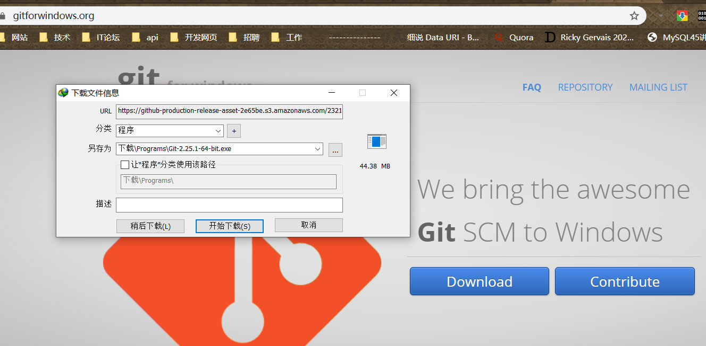
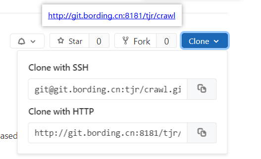
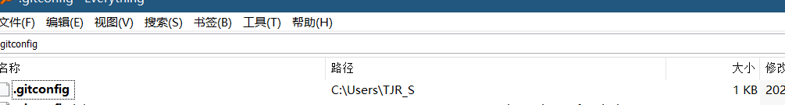

# 下载Git

##  Git for Windows VS msysGit

[msysGit](http://msysgit.github.com/)的主页提供了两个项目：Git for Windows和msysGit，并写明了它们的详细区别。 个人认为，Git for Windows适合绝大多数程序猿（又见绝大多数 :D）。所以，强烈建议安装Git for Window。 msysGit使用一种很BT也很NB的方式来安装。先安装一个最小的[MinGW/MSYS](http://www.mingw.org/)系统，然后使用git `pull` 所有的源码，调用gcc在本地编译成可执行文件。

[git下载](http://msysgit.github.com/) git的主页已经变了，会直接重定向到fit for window



# git客户端

## TortoiseGit

## SourceTree

## GitGui

git提供的gui客户端

## GitBash

最底层，直接使用命令，和linux一样

# 参考文章

[使用Git、Git GUI和TortoiseGit](https://blog.zengrong.net/post/git_garbled/)  


# 远程仓库

1. github、gitlab、码云、bitbucket等等。。。

2. 在任一远程托管中心建立仓库，然后推送。

同步需要有url，无论clone还是push。

clone不一定需要密码，但是push一定需要密码或者密钥。



## https

密码配合https使用。如果使用 https 很简单基本不需要配置就可以使用，但是每次提交代码和下载代码时都需要输入用户名和密码。  （实际上不一定需要，看远程托管中心的安全机制）

注意http的地址，有可能带端口，有可能不带端口，nginx做转发之类的，并且自建gitlab需要特地修改，有可能是显示错误的。

## ssh

使用ssh依靠ssh协议，公钥和私钥，并且需要ssh客户端，因此需要三部。

1. 生成公钥私钥
2. 远端配置公钥
3. 本地选择ssh客户端，配置私钥。不同gui客户端有不同的操作。
4. 注意ssh协议的端口是否修改：看pdf：FAQ

### ssh客户端

在安装TortoiseGit的时候，你可以选择使用Putty还是OpenSSH作为SSH客户端。安装程序中说，Putty和Windows配合得更好。


如何选择？我分别给出它们的特点：

#### **Putty**

1. Putty有GUI界面，可以通过[配置sessions来访问不同的git服务器端口](https://blog.zengrong.net/post/1775.html)；
2. Putty有GUI程序(Putty Key Generator)来生成密钥；
3. 如果使用Putty作为SSH客户端，那么传输速度可能会比较慢（个人感觉，当然也[有人和我有一样的感觉](http://www.iteye.com/topic/1124117)）；
4. Putty不能直接使用原有的OpenSSH密钥，必须将其转换成PPK密钥才行。

#### **OpenSSH**

1. OpenSSH是Git命令行程序默认使用的SSH客户端程序；
2. Git for Windows默认就包含了OpenSSH程序；
3. 你可以利用已有的OpenSSH密钥，不用做转换（例如我原来用cygwin的时候积累了一堆OpenSSH密钥，现在只需要在~/.ssh下做一个符号链接就能用了）；
4. GitHub/bitbucket等Host使用的都是OpenSSH密钥；
5. 大多数Linux发行版默认使用OpenSSH作为服务端；
6. 你可以方便的使用命令行程序来实现自动化处理。

看完上面的特点，如果你还是选择了Putty作为客户端的话，那么需要转换原有的OpenSSH密钥（如果有的话）； 如果你依然义无反顾选择了OpenSSH作为客户端的话，我相信你已经知道如何生成、修改、配置SSH了，看来我也不必罗嗦

### 4.1 转换OpenSSH密钥到ppk格式

可以使用TortoiseGit自带的Putty Key Generator来转换原来的OpenSSH密钥到ppk格式。

打开该程序，选择 `Conversions->Import Key` 命令将OpenSSH **私钥** 导入界面中，然后点击 `Save private key` 按钮将密钥保存成ppk格式。建议在 `Key comment` 中输入说明，否则密钥多了很难分辨。至于密码，为了方便可以不设置。


### 4.2 生成OpenSSH和ppk格式的密钥

为了同时支持服务端和客户端，我们可以在生成一个密钥的时候，同时生成该密钥的ppk格式和OpenSSH格式。而每个密钥对都包含 **公钥** 和 **私钥**，两对一共是4个文件。这样就可以满足所有情况了。

打开Putty Key Generator，选择 `Generator` 按钮，晃动鼠标生成一个密钥，然后这样处理：

- 点击 `Save private key` 按钮将密钥保存成 **ppk格式私钥**；
- 点击 `Save public key` 按钮将密钥保存成 **ppk格式公钥**；
- 点击 `Conversions->Export OpenSSH Key` 按钮将密钥保存成 **OpenSSH格式私钥**；
- 获取上图红框中的所有文本内容，粘贴到文本编辑软件中，保存为一个单行的文件，这就是 **OpenSSH格式公钥**；

### 4.3 在TortoiseGit中使用SSH host

如果使用Putty作为TortoiseGit的SSH客户端，那么就不能使用OpenSSH的 ~/.ssh/config 来定义使用不同的端口和密钥访问SSH，而是需要使用 PuTTY Session。这篇文章进行了详细讲解： [在TortoiseGit中使用SSH host](https://blog.zengrong.net/post/1775.html)

### 4.4 从 putty 切换到 OpenSSH

也许是你一时 ~~手贱~~……唔，手快选择了 putty 作为客户端，某天又良心发现想用 OpenSSH ，是否必须重装一次 TortoiseGit 来重新选择一次呢？

我曾经这样做过，直到我找到这个设置：


是的，只需要把 ssh客户端 改成 git for windows 提供的 ssh.exe 即可。如果用 Cygwin，那么这个程序在 `cygwin/bin` 目录中。


# 名字邮箱和代理

1. 用户名和邮箱地址的作用

   用户名和邮箱地址是本地git客户端的一个变量，不随git库而改变。

   每次commit都会用用户名和邮箱纪录。

   github的contributions统计就是按邮箱来统计的。

2. 查看用户名和邮箱地址：

   ```
   $ git config user.name
   
   $ git config user.email
   123
   ```

3. 修改用户名和邮箱地址：

   ```
   $ git config --global user.name "username"
   
   $ git config --global user.email "email"
   ```

4. 乌龟里面就可以修改设置，包括代理

