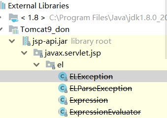
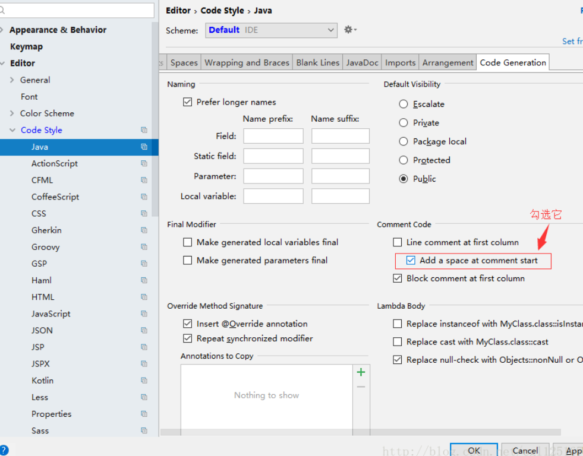
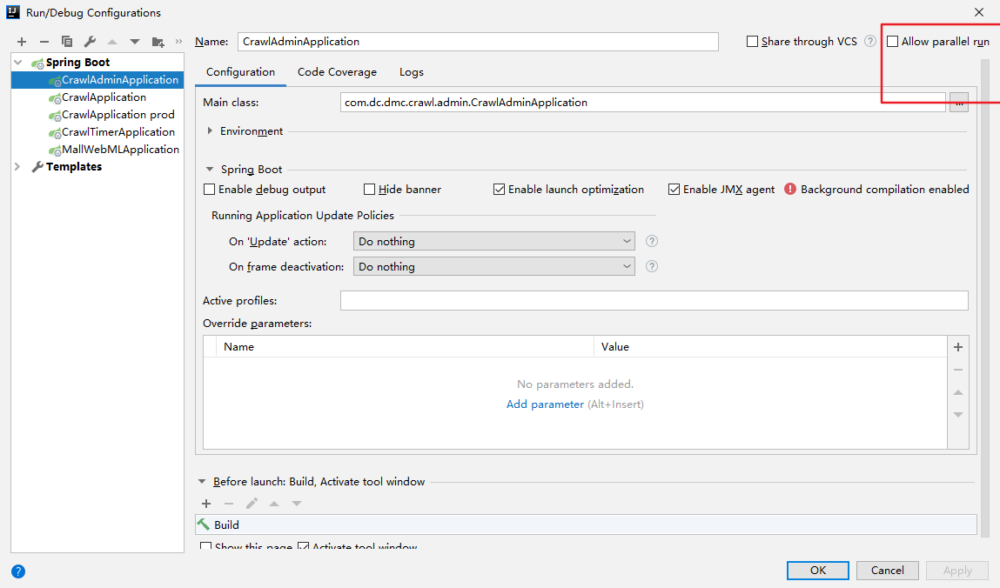

## [如何开启Run DashBoard](https://blog.csdn.net/m18633778874/article/details/82687389  )

找到.idea下面的workspace.xml文件，加入一段配置代码   源代码位

```xml
<component name="RunDashboard">
 <option name="ruleStates">
     <list>
       <RuleState>
           <option name="name" value="ConfigurationTypeDashboardGroupingRule" />
       </RuleState>
       <RuleState>
          <option name="name" value="StatusDashboardGroupingRule" />
       </RuleState>
     </list>
  </option>
  <option name="contentProportion" value="0.22874807" />
    
         <!-- 配置代码-->
  <option name="configurationTypes">
     <set>
          <option value="SpringBootApplicationConfigurationType" />
     </set>
  </option>
          <!-- 配置代码-->
 </component>
```

## class关联src

在idea点进去class文件，可以有choose sources 的选择

## 卡顿

[idea关闭不必要的插件减少内存占用](https://blog.csdn.net/tutian2000/article/details/80074643)

[intellij idea cpu占用率太大太满 运行速度太慢 使了五个解决方法最终成功](https://blog.csdn.net/zdxxinlang/article/details/78391060?depth_1-utm_source=distribute.pc_relevant.none-task&utm_source=distribute.pc_relevant.none-task)

## 单行注释



## Idea 启动项目时，卡在Parsing Java 解决方案

https://blog.csdn.net/Gabriel576282253/article/details/88866623

## 程序并行运行

